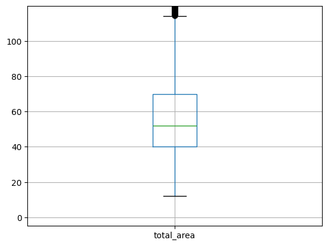
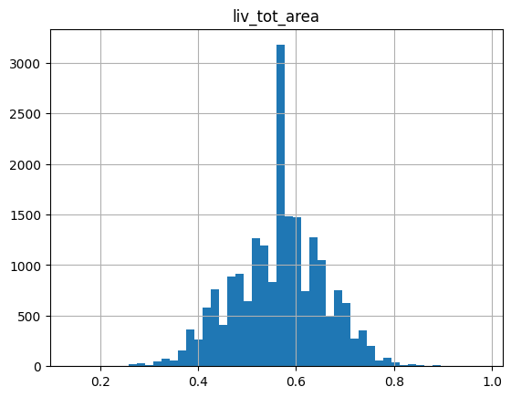
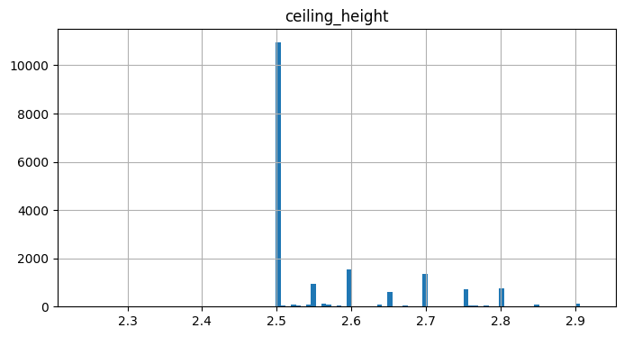

# Исследование объявлений о продаже квартир

<h1>Содержание<span class='tocSkip'></span></h1>

* [1 Ознакомление с данными](#my_section_1) <a id='content_1'></a>
  * [1.1 Изучение информации](#my_section_2) <a id='content_2'></a>
  * [1.2 Заключение](#my_section_3) <a id='content_3'></a>
* [2 Предобработка данных](#my_section_4) <a id='content_4'></a>
  * [2.1 Заполнение пропусков](#my_section_5) <a id='content_5'></a>
    * [2.1.1 Столбец 'ceiling_height'](#my_section_6) <a id='content_6'></a>
    * [2.1.2 Столбец 'floors_total'](#my_section_7) <a id='content_7'></a>
    * [2.1.3 Столбец 'living_area'](#my_section_8) <a id='content_8'></a>
    * [2.1.4 Столбец 'is_apartment'](#my_section_9) <a id='content_9'></a>
    * [2.1.5 Столбец 'kitchen_area'](#my_section_10) <a id='content_10'></a>
    * [2.1.6 Столбец 'balcony'](#my_section_11) <a id='content_11'></a>
    * [2.1.7 Столбец 'locality_name'](#my_section_12) <a id='content_12'></a>
    * [2.1.8 Столбец 'days_exposition'](#my_section_13) <a id='content_13'></a>
      * [2.1.8.1 Обобщённые столбцы](#my_section_14) <a id='content_14'></a>
      * [2.1.8.2 Заключение](#my_section_15) <a id='content_15'></a>
  * [2.2 Изменение типов данных](#my_section_16) <a id='content_16'></a>
      * [2.2.1 Корректировка](#my_section_17) <a id='content_17'></a>
      * [2.2.2 Заключение](#my_section_18) <a id='content_18'></a>
  * [2.3 Устранение неявных дубликатов в названиях населённых пунктов](#my_section_19) <a id='content_19'></a>
      * [2.3.1 Поиск значений](#my_section_20) <a id='content_20'></a>
      * [2.3.2 Удаление неявных дубликатов](#my_section_21) <a id='content_21'></a>
      * [2.3.3 Заключение](#my_section_22) <a id='content_22'></a>
  * [2.4 Обработка аномалий](#my_section_23) <a id='content_23'></a>
    * [2.4.1 Столбец 'total_area'](#my_section_24) <a id='content_24'></a>
    * [2.4.2 Столбец 'living_area'](#my_section_25) <a id='content_25'></a>
      * [2.4.2.1 Столбец 'kitchen_area'](#my_section_26) <a id='content_26'></a>
    * [2.4.3 Столбец 'liv_tot_area' ](#my_section_27) <a id='content_27'></a>
    * [2.4.4 Столбец 'lk_total_area'  ](#my_section_28) <a id='content_28'></a>
    * [2.4.5 Столбец 'rooms'](#my_section_29) <a id='content_29'></a>
    * [2.4.6 Столбец 'floors_total'](#my_section_30) <a id='content_30'></a>
      * [2.4.6.1 Заключение](#my_section_31) <a id='content_31'></a>
* [3 Подготовка данных](#my_section_32) <a id='content_32'></a>
  * [3.1 Рассчёт цены одного квадратного метра](#my_section_33) <a id='content_33'></a>
  * [3.2 Рассчёт дня публикации](#my_section_34) <a id='content_34'></a>
  * [3.3 Рассчёт месяца публикации](#my_section_35) <a id='content_35'></a>
  * [3.4 Рассчёт года публикации объявления](#my_section_36) <a id='content_36'></a>
  * [3.5 Рассчёт типа этажа квартиры](#my_section_37) <a id='content_37'></a>
  * [3.6 Рассчёт расстояния в км до центра города](#my_section_38) <a id='content_38'></a>
  * [3.7 Заключение](#my_section_39) <a id='content_39'></a>
* [4 Исследовательский анализ данных](#my_section_40) <a id='content_40'></a>
  * [4.1 Изучение и описание параметров](#my_section_41) <a id='content_41'></a>
    * [4.1.1 Общая площадь](#my_section_42) <a id='content_42'></a>
    * [4.1.2 Жилая площадь](#my_section_43) <a id='content_43'></a>
    * [4.1.3 Площадь кухни](#my_section_44) <a id='content_44'></a>
    * [4.1.4 Цена объекта](#my_section_45) <a id='content_45'></a>
    * [4.1.5 Количество комнат](#my_section_46) <a id='content_46'></a>
    * [4.1.6 Высота потолков](#my_section_47) <a id='content_47'></a>
    * [4.1.7 Этаж квартиры](#my_section_48) <a id='content_48'></a>
    * [4.1.8 Тип этажа квартиры](#my_section_49) <a id='content_49'></a>
    * [4.1.9 Общее количество этажей в доме](#my_section_50) <a id='content_50'></a>
    * [4.1.10 Расстояние до центра города в метрах ](#my_section_51) <a id='content_51'></a>
    * [4.1.11 Расстояние до ближайшего аэропорта ](#my_section_52) <a id='content_52'></a>
    * [4.1.12 Расстояние до ближайшего парка](#my_section_53) <a id='content_53'></a>
    * [4.1.13 День публикации объявления](#my_section_54) <a id='content_54'></a>
    * [4.1.14 Месяц публикации объявления](#my_section_55) <a id='content_55'></a>
    * [4.1.15 Заключение](#my_section_56) <a id='content_56'></a>
  * [4.2 Изучение скорости продажи квартир](#my_section_57) <a id='content_57'></a>
    * [4.2.1 Рассчёт](#my_section_58) <a id='content_58'></a>
      * [4.2.1.1 Заключение](#my_section_59) <a id='content_59'></a>
  * [4.3 Факторы, влияющие на полную стоимость объекта](#my_section_60) <a id='content_60'></a>
    * [4.3.1 Список 'many_values'](#my_section_61) <a id='content_61'></a>
    * [4.3.2 Список 'few_values'](#my_section_62) <a id='content_62'></a>
      * [4.3.2.1 Заключение](#my_section_63) <a id='content_63'></a>
  * [4.4 Рассчёт стоимость площади метра объекта в самых популярных местах](#my_section_64) <a id='content_64'></a>
      * [4.4.1 Заключение](#my_section_65) <a id='content_65'></a>
  * [4.5 Стоимость километра в Санкт-Петербурге](#my_section_66) <a id='content_66'></a>
      * [4.5.1 Заключение](#my_section_67) <a id='content_67'></a>
* [5 Общий вывод](#my_section_68) <a id='content_68'></a>


**Общая цель:** \
Установить параметры. Это позволит построить автоматизированную систему: она отследит аномалии и мошенническую деятельность.

 **Цели исследовния:** \
 научиться определять рыночную стоимость объектов недвижимости.  

 **План работы:**
1. изучить общую информацию о полученном датафрейме;
2. найти и обработать возможные ошибки, дубликаты, пропуски;
3. выделить основные категории, провести дополнительную категоризацию данных при необходимости, дополнительно подготовить данные к анализу; 
4. провести исследовательский анализ данных;
5. составить  общий вывод.

**Описание данных:** \
информация получена из сервиса Яндекс.Недвижимость — архив объявлений о продаже квартир в Санкт-Петербурге и соседних населённых пунктов за несколько лет.
По каждой квартире на продажу доступны два вида данных. Первые вписаны пользователем, вторые — получены автоматически на основе картографических данных. Например, расстояние до центра, аэропорта, ближайшего парка и водоёма.

Данные представлены следующими столбцами:
- airports_nearest — расстояние до ближайшего аэропорта в метрах (м)
- balcony — число балконов
- ceiling_height — высота потолков (м)
- cityCenters_nearest — расстояние до центра города (м)
- days_exposition — сколько дней было размещено объявление (от публикации до снятия)
- first_day_exposition — дата публикации
- floor — этаж
- floors_total — всего этажей в доме
- is_apartment — апартаменты (булев тип)
- kitchen_area — площадь кухни в квадратных метрах (м²)
- last_price — цена на момент снятия с публикации
- living_area — жилая площадь в квадратных метрах (м²)
- locality_name — название населённого пункта
- open_plan — свободная планировка (булев тип)
- parks_around3000 — число парков в радиусе 3 км
- parks_nearest — расстояние до ближайшего парка (м)
- ponds_around3000 — число водоёмов в радиусе 3 км
- ponds_nearest — расстояние до ближайшего водоёма (м)
- rooms — число комнат
- studio — квартира-студия (булев тип)
- total_area — общая площадь квартиры в квадратных метрах (м²)
- total_images — число фотографий квартиры в объявлении

<a id='my_section_1'></a>
## [Ознакомление с данными](#content_1)

Подключим библиотеку `pandas` и `matplotlib` для продвинутой работы с графиками.


```python
import pandas as pd
import matplotlib.pyplot as plt
```

Прочтем файл и запишем его в переменную 'data'


```python
try:
    data = pd.read_csv('real_estate_data.csv', sep = '\t')
except:
    data = pd.read_csv('https:..', sep = '\t')
```

<a id='my_section_2'></a>
### [Изучение информации](#content_2)

Для ознакомления прочтем первые 20 строк датафрейма `data`


```python
data.head(10)
```


<div>
<style scoped>
    .dataframe tbody tr th:only-of-type {
        vertical-align: middle;
    }

    .dataframe tbody tr th {
        vertical-align: top;
    }

    .dataframe thead th {
        text-align: right;
    }
</style>
<table border="1" class="dataframe">
  <thead>
    <tr style="text-align: right;">
      <th></th>
      <th>total_images</th>
      <th>last_price</th>
      <th>total_area</th>
      <th>first_day_exposition</th>
      <th>rooms</th>
      <th>ceiling_height</th>
      <th>floors_total</th>
      <th>living_area</th>
      <th>floor</th>
      <th>is_apartment</th>
      <th>...</th>
      <th>kitchen_area</th>
      <th>balcony</th>
      <th>locality_name</th>
      <th>airports_nearest</th>
      <th>cityCenters_nearest</th>
      <th>parks_around3000</th>
      <th>parks_nearest</th>
      <th>ponds_around3000</th>
      <th>ponds_nearest</th>
      <th>days_exposition</th>
    </tr>
  </thead>
  <tbody>
    <tr>
      <th>0</th>
      <td>20</td>
      <td>13000000.0</td>
      <td>108.00</td>
      <td>2019-03-07T00:00:00</td>
      <td>3</td>
      <td>2.70</td>
      <td>16.0</td>
      <td>51.00</td>
      <td>8</td>
      <td>NaN</td>
      <td>...</td>
      <td>25.00</td>
      <td>NaN</td>
      <td>Санкт-Петербург</td>
      <td>18863.0</td>
      <td>16028.0</td>
      <td>1.0</td>
      <td>482.0</td>
      <td>2.0</td>
      <td>755.0</td>
      <td>NaN</td>
    </tr>
    <tr>
      <th>1</th>
      <td>7</td>
      <td>3350000.0</td>
      <td>40.40</td>
      <td>2018-12-04T00:00:00</td>
      <td>1</td>
      <td>NaN</td>
      <td>11.0</td>
      <td>18.60</td>
      <td>1</td>
      <td>NaN</td>
      <td>...</td>
      <td>11.00</td>
      <td>2.0</td>
      <td>посёлок Шушары</td>
      <td>12817.0</td>
      <td>18603.0</td>
      <td>0.0</td>
      <td>NaN</td>
      <td>0.0</td>
      <td>NaN</td>
      <td>81.0</td>
    </tr>
    <tr>
      <th>2</th>
      <td>10</td>
      <td>5196000.0</td>
      <td>56.00</td>
      <td>2015-08-20T00:00:00</td>
      <td>2</td>
      <td>NaN</td>
      <td>5.0</td>
      <td>34.30</td>
      <td>4</td>
      <td>NaN</td>
      <td>...</td>
      <td>8.30</td>
      <td>0.0</td>
      <td>Санкт-Петербург</td>
      <td>21741.0</td>
      <td>13933.0</td>
      <td>1.0</td>
      <td>90.0</td>
      <td>2.0</td>
      <td>574.0</td>
      <td>558.0</td>
    </tr>
    <tr>
      <th>3</th>
      <td>0</td>
      <td>64900000.0</td>
      <td>159.00</td>
      <td>2015-07-24T00:00:00</td>
      <td>3</td>
      <td>NaN</td>
      <td>14.0</td>
      <td>NaN</td>
      <td>9</td>
      <td>NaN</td>
      <td>...</td>
      <td>NaN</td>
      <td>0.0</td>
      <td>Санкт-Петербург</td>
      <td>28098.0</td>
      <td>6800.0</td>
      <td>2.0</td>
      <td>84.0</td>
      <td>3.0</td>
      <td>234.0</td>
      <td>424.0</td>
    </tr>
    <tr>
      <th>4</th>
      <td>2</td>
      <td>10000000.0</td>
      <td>100.00</td>
      <td>2018-06-19T00:00:00</td>
      <td>2</td>
      <td>3.03</td>
      <td>14.0</td>
      <td>32.00</td>
      <td>13</td>
      <td>NaN</td>
      <td>...</td>
      <td>41.00</td>
      <td>NaN</td>
      <td>Санкт-Петербург</td>
      <td>31856.0</td>
      <td>8098.0</td>
      <td>2.0</td>
      <td>112.0</td>
      <td>1.0</td>
      <td>48.0</td>
      <td>121.0</td>
    </tr>
    <tr>
      <th>5</th>
      <td>10</td>
      <td>2890000.0</td>
      <td>30.40</td>
      <td>2018-09-10T00:00:00</td>
      <td>1</td>
      <td>NaN</td>
      <td>12.0</td>
      <td>14.40</td>
      <td>5</td>
      <td>NaN</td>
      <td>...</td>
      <td>9.10</td>
      <td>NaN</td>
      <td>городской посёлок Янино-1</td>
      <td>NaN</td>
      <td>NaN</td>
      <td>NaN</td>
      <td>NaN</td>
      <td>NaN</td>
      <td>NaN</td>
      <td>55.0</td>
    </tr>
    <tr>
      <th>6</th>
      <td>6</td>
      <td>3700000.0</td>
      <td>37.30</td>
      <td>2017-11-02T00:00:00</td>
      <td>1</td>
      <td>NaN</td>
      <td>26.0</td>
      <td>10.60</td>
      <td>6</td>
      <td>NaN</td>
      <td>...</td>
      <td>14.40</td>
      <td>1.0</td>
      <td>посёлок Парголово</td>
      <td>52996.0</td>
      <td>19143.0</td>
      <td>0.0</td>
      <td>NaN</td>
      <td>0.0</td>
      <td>NaN</td>
      <td>155.0</td>
    </tr>
    <tr>
      <th>7</th>
      <td>5</td>
      <td>7915000.0</td>
      <td>71.60</td>
      <td>2019-04-18T00:00:00</td>
      <td>2</td>
      <td>NaN</td>
      <td>24.0</td>
      <td>NaN</td>
      <td>22</td>
      <td>NaN</td>
      <td>...</td>
      <td>18.90</td>
      <td>2.0</td>
      <td>Санкт-Петербург</td>
      <td>23982.0</td>
      <td>11634.0</td>
      <td>0.0</td>
      <td>NaN</td>
      <td>0.0</td>
      <td>NaN</td>
      <td>NaN</td>
    </tr>
    <tr>
      <th>8</th>
      <td>20</td>
      <td>2900000.0</td>
      <td>33.16</td>
      <td>2018-05-23T00:00:00</td>
      <td>1</td>
      <td>NaN</td>
      <td>27.0</td>
      <td>15.43</td>
      <td>26</td>
      <td>NaN</td>
      <td>...</td>
      <td>8.81</td>
      <td>NaN</td>
      <td>посёлок Мурино</td>
      <td>NaN</td>
      <td>NaN</td>
      <td>NaN</td>
      <td>NaN</td>
      <td>NaN</td>
      <td>NaN</td>
      <td>189.0</td>
    </tr>
    <tr>
      <th>9</th>
      <td>18</td>
      <td>5400000.0</td>
      <td>61.00</td>
      <td>2017-02-26T00:00:00</td>
      <td>3</td>
      <td>2.50</td>
      <td>9.0</td>
      <td>43.60</td>
      <td>7</td>
      <td>NaN</td>
      <td>...</td>
      <td>6.50</td>
      <td>2.0</td>
      <td>Санкт-Петербург</td>
      <td>50898.0</td>
      <td>15008.0</td>
      <td>0.0</td>
      <td>NaN</td>
      <td>0.0</td>
      <td>NaN</td>
      <td>289.0</td>
    </tr>
  </tbody>
</table>
<p>10 rows × 22 columns</p>
</div>


Получим обзорную статистику данных


```python
data.info()  
```

    <class 'pandas.core.frame.DataFrame'>
    RangeIndex: 23699 entries, 0 to 23698
    Data columns (total 22 columns):
     #   Column                Non-Null Count  Dtype  
    ---  ------                --------------  -----  
     0   total_images          23699 non-null  int64  
     1   last_price            23699 non-null  float64
     2   total_area            23699 non-null  float64
     3   first_day_exposition  23699 non-null  object 
     4   rooms                 23699 non-null  int64  
     5   ceiling_height        14504 non-null  float64
     6   floors_total          23613 non-null  float64
     7   living_area           21796 non-null  float64
     8   floor                 23699 non-null  int64  
     9   is_apartment          2775 non-null   object 
     10  studio                23699 non-null  bool   
     11  open_plan             23699 non-null  bool   
     12  kitchen_area          21421 non-null  float64
     13  balcony               12180 non-null  float64
     14  locality_name         23650 non-null  object 
     15  airports_nearest      18157 non-null  float64
     16  cityCenters_nearest   18180 non-null  float64
     17  parks_around3000      18181 non-null  float64
     18  parks_nearest         8079 non-null   float64
     19  ponds_around3000      18181 non-null  float64
     20  ponds_nearest         9110 non-null   float64
     21  days_exposition       20518 non-null  float64
    dtypes: bool(2), float64(14), int64(3), object(3)
    memory usage: 3.7+ MB
    


```python
len(data.isna().sum().loc[data.isna().sum() != 0].index)
```


    14


*Методом поиска пропущенных значений `isna` и индексацией нашли, что в таблице имеется 14 стлобцов с пропуском в данных.*


```python
non_bool_obj = data.dtypes.loc[(data.dtypes != 'object') & (data.dtypes != 'bool')].index
for el in non_bool_obj:
    print(f'- {el}')
print('Столбов с числовыми значениями:', len(non_bool_obj))
```

    - total_images
    - last_price
    - total_area
    - rooms
    - ceiling_height
    - floors_total
    - living_area
    - floor
    - kitchen_area
    - balcony
    - airports_nearest
    - cityCenters_nearest
    - parks_around3000
    - parks_nearest
    - ponds_around3000
    - ponds_nearest
    - days_exposition
    Столбов с числовыми значениями: 17
    

*Провели фильтрцию данных и отобрали столбцы с только числовыми значениями.*

Построим общую гистограмму для всех числовых столбцов таблицы, используя индексацию.


```python
data.loc[:, non_bool_obj].hist(figsize = (15, 20));
```


    

    


<a id='my_section_3'></a>
### [Заключение](#content_3)

**Вывод:** \
Обзор общей информации из файла дал представление о необходимости внесения корректировок. В таблицах наблюдается наличие пропусков и необходимость преобразования типа столбцов(таких как 'first_day_exposition' и, возможно  'is_apartment'). В графиках наблюдаются неоднородности и разбросы значений.  

<a id='my_section_4'></a>
## [Предобработка данных](#content_4)

Еще раз определим столбцы с пропусками


```python
def column_pass():
    count = 0
    print(f'{"Столбец":>17}: {"Количество":>13}:{" ":>10}{"Процент":>8}')
    for index, values in data.isna().sum().loc[data.isna().sum() != 0].items():
        count += 1
        print(f'{count:>2}.{index:<19} {values:>10}{" ":>10}{round(values/data.shape[0]*100,2):>8}%')
        
column_pass()
```

              Столбец:    Количество:           Процент
     1.ceiling_height            9195              38.8%
     2.floors_total                86              0.36%
     3.living_area               1903              8.03%
     4.is_apartment             20924             88.29%
     5.kitchen_area              2278              9.61%
     6.balcony                  11519             48.61%
     7.locality_name               49              0.21%
     8.airports_nearest          5542             23.38%
     9.cityCenters_nearest       5519             23.29%
    10.parks_around3000          5518             23.28%
    11.parks_nearest            15620             65.91%
    12.ponds_around3000          5518             23.28%
    13.ponds_nearest            14589             61.56%
    14.days_exposition           3181             13.42%
    

*Функция считает пропуски в таблице и их процент от всей выборки.*

<a id='my_section_5'></a>
### [Заполнение пропусков](#content_5)

<a id='my_section_6'></a>
#### [Столбец 'ceiling_height'](#content_6)

Пойдем по порядку и обработаем пропущенные значения. Для начала обработаем столбец `ceiling_height`. Для оценки столбца получим обзор значений, которые в нём представлены. Используем метод сортировки и поиска уникальных значений. 


```python
data['ceiling_height'].sort_values().unique()
```


    array([  1.  ,   1.2 ,   1.75,   2.  ,   2.2 ,   2.25,   2.3 ,   2.34,
             2.4 ,   2.45,   2.46,   2.47,   2.48,   2.49,   2.5 ,   2.51,
             2.52,   2.53,   2.54,   2.55,   2.56,   2.57,   2.58,   2.59,
             2.6 ,   2.61,   2.62,   2.63,   2.64,   2.65,   2.66,   2.67,
             2.68,   2.69,   2.7 ,   2.71,   2.72,   2.73,   2.74,   2.75,
             2.76,   2.77,   2.78,   2.79,   2.8 ,   2.81,   2.82,   2.83,
             2.84,   2.85,   2.86,   2.87,   2.88,   2.89,   2.9 ,   2.91,
             2.92,   2.93,   2.94,   2.95,   2.96,   2.97,   2.98,   2.99,
             3.  ,   3.01,   3.02,   3.03,   3.04,   3.05,   3.06,   3.07,
             3.08,   3.09,   3.1 ,   3.11,   3.12,   3.13,   3.14,   3.15,
             3.16,   3.17,   3.18,   3.2 ,   3.21,   3.22,   3.23,   3.24,
             3.25,   3.26,   3.27,   3.28,   3.29,   3.3 ,   3.31,   3.32,
             3.33,   3.34,   3.35,   3.36,   3.37,   3.38,   3.39,   3.4 ,
             3.42,   3.43,   3.44,   3.45,   3.46,   3.47,   3.48,   3.49,
             3.5 ,   3.51,   3.52,   3.53,   3.54,   3.55,   3.56,   3.57,
             3.58,   3.59,   3.6 ,   3.62,   3.63,   3.65,   3.66,   3.67,
             3.68,   3.69,   3.7 ,   3.75,   3.76,   3.78,   3.8 ,   3.82,
             3.83,   3.84,   3.85,   3.86,   3.87,   3.88,   3.9 ,   3.93,
             3.95,   3.98,   4.  ,   4.06,   4.1 ,   4.14,   4.15,   4.19,
             4.2 ,   4.25,   4.3 ,   4.37,   4.4 ,   4.45,   4.5 ,   4.65,
             4.7 ,   4.8 ,   4.9 ,   5.  ,   5.2 ,   5.3 ,   5.5 ,   5.6 ,
             5.8 ,   6.  ,   8.  ,   8.3 ,  10.3 ,  14.  ,  20.  ,  22.6 ,
            24.  ,  25.  ,  26.  ,  27.  ,  27.5 ,  32.  , 100.  ,    nan])


```python
data['ceiling_height'].describe()
```


    count    14504.000000
    mean         2.771499
    std          1.261056
    min          1.000000
    25%          2.520000
    50%          2.650000
    75%          2.800000
    max        100.000000
    Name: ceiling_height, dtype: float64


*Для наглядности сгенерировали описательную статистику столбца.*


```python
plt.ylim(2, 3.5)
data.boxplot('ceiling_height');
```


    

    


*Построили диаграмму размаха, где показан диапазон нахождения основного количества значений.*


```python
print(f"Процент значений выброса в диапазоне от 1.0 до 2.2 метров: {data.loc[data['ceiling_height'] < 2.2].shape[0]/data.shape[0]:.2%}")
print(f"Процент значений выброса в диапазоне от 3.2 до 100.0 метров: {data.loc[data['ceiling_height'] > 3.2].shape[0]/data.shape[0]:.2%}")
print(f"Процент значений выброса в диапазоне от 3.2 до 4.5 метров: {data.loc[(data['ceiling_height'] > 3.2) & (data['ceiling_height'] <= 4.5)].shape[0]/data.shape[0]:.2%}")

```

    Процент значений выброса в диапазоне от 1.0 до 2.2 метров: 0.06%
    Процент значений выброса в диапазоне от 3.2 до 100.0 метров: 3.45%
    Процент значений выброса в диапазоне от 3.2 до 4.5 метров: 3.27%
    

*Рассчитали проценты значений выброса разных диапазонов от общей выборки столбца. Процент значений выброса в диапазоне от 3.2 до 4.5 включен в дальнейшее исследование, так как в соответствии с данными из открытых источников, можно считать, что квартиры с потолками такого размера существуют. Эти данные составляют 0.18% от общей выборки и не окажут сильного влияния на исследование, зато, есть вероятность, что они покажут необычный результат.*

**Вывод по столбцу**: \
Столбец `ceiling_height` содержит почти 40% пропусков от общего количества значений. Учитывая такое большое количество пустых значений, было бы справедливо включить этот столбец для перепроверки значений. Однако, если предположить, что данные верны, тогда пропуск в значениях может быть обусловлен незнанием высоты помещения, либо не внесен специально, так как соответствует *СП 54.13330.2016 «СНиП 31-01-2003 Здания жилые многоквартирные»*, где минимальная высота потолка соответствует 2.5 метра и может увеличиваться в зависимости от класса помещения до 4.5 метров, однако в квартирах старого жилого фонда, ещё дореволюционной эпохи, высота потолков была от 2.2 метров, тем не менее, таких квартир, предположительно мало. Будем придерживаться стандарту и заполним пропуски в соответствии с документацией. Кроме того, значение 2.5 метра попадает в первый квартиль описательной статистики столбца.     
Полученные данные заставляют сомневаться в правильности дальнейшего выбора, ведь значения, ниже порогового в 2,2 можно приравнять к стандарту, так как согласно нормам, жилое помещение не может быть ниже. Однако, данные выбросы лучше убрать, либо совсем, либо до нахождения взаимосвязей, позволяющих восстановить их точное или примерное значение. Поступим в соответствии с общими правилами, исключим выбросы, кроме того этих значений всего 0.06% от общей выборки, что почти не отразиться на результат исследования. Значение порога в 3.2, увеличено до 4.5 в соответствии с открытыми источниками, а значения от 22 до 45, возможно, внесены ошибочно, и имеют ошибку в разрядности. 
Возможные исправления будут применены, остальные значения отбросим.


```python
data.loc[(data['ceiling_height'] >= 22) & (data['ceiling_height'] <= 45), 'ceiling_height'] = \
data.loc[(data['ceiling_height'] >= 22) & (data['ceiling_height'] <= 45), 'ceiling_height']/10
```

*Провели фильтрацию и обработку значений в соответствии с предположением, что данные внесены с ошибкой в разряде.*


```python
data['ceiling_height'] = data['ceiling_height'].fillna(2.5)
```

*Провели заполнение пропусков в соответствии со стандартом.*


```python
data = data.query('2.2 <= ceiling_height <= 4.5')
```

*Отобрали только те значения, которые соответствуют границам диапазона допустимых значений.*


```python
data['ceiling_height'].isna().sum()
```


    0


*Провели проверку столбца на пропуски.*

<a id='my_section_7'></a>
#### [Столбец 'floors_total'](#content_7)

Столбец `floor_total` содержит всего-лишь 0.36% пропусков. Медиана в этом случае не придаст точности, так как постройки не однообразные и находятся в разных населенных пунктах. Можно ли судить о количестве этажей, судя по типу населённого пункта?
(российское государство запретило своим гражданам строить частные дома этажностью выше 3-х этажей) Скорее нет, так как здания не однотипны. Скорее всего данные пропущенны из-за соответствия этажа 'floor' высоте первого этажа. Внесем корректировку на основе этого суждения.    


```python
data.query('floors_total.isna()').sort_values(by = 'floor').tail()
```


<div>
<style scoped>
    .dataframe tbody tr th:only-of-type {
        vertical-align: middle;
    }

    .dataframe tbody tr th {
        vertical-align: top;
    }

    .dataframe thead th {
        text-align: right;
    }
</style>
<table border="1" class="dataframe">
  <thead>
    <tr style="text-align: right;">
      <th></th>
      <th>total_images</th>
      <th>last_price</th>
      <th>total_area</th>
      <th>first_day_exposition</th>
      <th>rooms</th>
      <th>ceiling_height</th>
      <th>floors_total</th>
      <th>living_area</th>
      <th>floor</th>
      <th>is_apartment</th>
      <th>...</th>
      <th>kitchen_area</th>
      <th>balcony</th>
      <th>locality_name</th>
      <th>airports_nearest</th>
      <th>cityCenters_nearest</th>
      <th>parks_around3000</th>
      <th>parks_nearest</th>
      <th>ponds_around3000</th>
      <th>ponds_nearest</th>
      <th>days_exposition</th>
    </tr>
  </thead>
  <tbody>
    <tr>
      <th>8478</th>
      <td>19</td>
      <td>13500000.0</td>
      <td>77.80</td>
      <td>2019-04-17T00:00:00</td>
      <td>2</td>
      <td>2.80</td>
      <td>NaN</td>
      <td>39.41</td>
      <td>21</td>
      <td>NaN</td>
      <td>...</td>
      <td>13.27</td>
      <td>2.0</td>
      <td>Санкт-Петербург</td>
      <td>12838.0</td>
      <td>11477.0</td>
      <td>1.0</td>
      <td>593.0</td>
      <td>1.0</td>
      <td>130.0</td>
      <td>NaN</td>
    </tr>
    <tr>
      <th>2392</th>
      <td>7</td>
      <td>5395770.0</td>
      <td>53.00</td>
      <td>2017-06-29T00:00:00</td>
      <td>2</td>
      <td>2.50</td>
      <td>NaN</td>
      <td>29.00</td>
      <td>22</td>
      <td>NaN</td>
      <td>...</td>
      <td>9.00</td>
      <td>0.0</td>
      <td>Санкт-Петербург</td>
      <td>43074.0</td>
      <td>10820.0</td>
      <td>0.0</td>
      <td>NaN</td>
      <td>0.0</td>
      <td>NaN</td>
      <td>48.0</td>
    </tr>
    <tr>
      <th>14264</th>
      <td>13</td>
      <td>14000000.0</td>
      <td>94.00</td>
      <td>2019-01-23T00:00:00</td>
      <td>6</td>
      <td>2.65</td>
      <td>NaN</td>
      <td>51.00</td>
      <td>23</td>
      <td>NaN</td>
      <td>...</td>
      <td>16.30</td>
      <td>NaN</td>
      <td>Санкт-Петербург</td>
      <td>51333.0</td>
      <td>13056.0</td>
      <td>0.0</td>
      <td>NaN</td>
      <td>0.0</td>
      <td>NaN</td>
      <td>NaN</td>
    </tr>
    <tr>
      <th>6030</th>
      <td>3</td>
      <td>10900000.0</td>
      <td>116.23</td>
      <td>2017-05-05T00:00:00</td>
      <td>4</td>
      <td>2.50</td>
      <td>NaN</td>
      <td>NaN</td>
      <td>24</td>
      <td>NaN</td>
      <td>...</td>
      <td>NaN</td>
      <td>0.0</td>
      <td>Санкт-Петербург</td>
      <td>35234.0</td>
      <td>14674.0</td>
      <td>0.0</td>
      <td>NaN</td>
      <td>1.0</td>
      <td>844.0</td>
      <td>83.0</td>
    </tr>
    <tr>
      <th>7922</th>
      <td>3</td>
      <td>5426412.0</td>
      <td>50.11</td>
      <td>2016-06-08T00:00:00</td>
      <td>2</td>
      <td>2.50</td>
      <td>NaN</td>
      <td>26.94</td>
      <td>24</td>
      <td>NaN</td>
      <td>...</td>
      <td>11.13</td>
      <td>0.0</td>
      <td>Санкт-Петербург</td>
      <td>7050.0</td>
      <td>13266.0</td>
      <td>1.0</td>
      <td>868.0</td>
      <td>0.0</td>
      <td>NaN</td>
      <td>14.0</td>
    </tr>
  </tbody>
</table>
<p>5 rows × 22 columns</p>
</div>


*Вывели последние 5 строк таблицы с пропусками в столбце `floors_total`.*


```python
data.loc[data['floors_total'].isna(), 'floors_total'] = 1
```

*Внесли корректировки в соответствии с предписанием.*


```python
data['ceiling_height'].isna().sum()
```


    0


*Провели проверку столбца на пропуски.*

<a id='my_section_8'></a>
#### [Столбец 'living_area'](#content_8)

 Обеспечить заполнение данного столбца можно разными способами и подходами. Для начала, стоит проверить, есть ли закономерности в таблице, которые позволят восстановить недостающие данные. Так же стоит обратить внимание на описание данных, там чётко сказано: 'информация получена из сервиса Яндекс.Недвижимость — архив объявлений о продаже **квартир**'. Это означает, что речь не идёт о продаже доли в квартире. Полученная информация позволит исключить выбросы из столбца. Учетная норма — минимальный размер площади жилого помещения на человека. В Санкт-Петербурге одна из норм гласит: — 9 *квадратных метров* общей площади жилого помещения для проживающих в отдельных квартирах(меньше продать нельзя). В конечном итоге для заполнения пропущенных значений будет использовано медианное значение соотношения `living_area` к `total_area`, полученный результат  будет определять процент, который должна составлять жилая площадь от общей. 
 
**Закон Санкт-Петербурга от 19 июля 2005 г. N 407-65 "О порядке ведения учета граждан в качестве нуждающихся в жилых помещениях и предоставлении жилых помещений по договорам социального найма в Санкт-Петербурге" (Принят Законодательным Собранием Санкт-Петербурга 30 июня 2005 года) (с изменениями и дополнениями) Глава 1. Общие положения (ст.ст. 1 - 5) Статья 3. Учетная норма площади жилого помещения* 

Попробуем найти закономерности в таблице, которые могли бы объяснить пропуски в столбце. 


```python
data.loc[~data['living_area'].isna(), ['total_area', 'living_area', 'balcony', 'rooms', 'studio', 'is_apartment']].head(20)
```


<div>
<style scoped>
    .dataframe tbody tr th:only-of-type {
        vertical-align: middle;
    }

    .dataframe tbody tr th {
        vertical-align: top;
    }

    .dataframe thead th {
        text-align: right;
    }
</style>
<table border="1" class="dataframe">
  <thead>
    <tr style="text-align: right;">
      <th></th>
      <th>total_area</th>
      <th>living_area</th>
      <th>balcony</th>
      <th>rooms</th>
      <th>studio</th>
      <th>is_apartment</th>
    </tr>
  </thead>
  <tbody>
    <tr>
      <th>0</th>
      <td>108.00</td>
      <td>51.00</td>
      <td>NaN</td>
      <td>3</td>
      <td>False</td>
      <td>NaN</td>
    </tr>
    <tr>
      <th>1</th>
      <td>40.40</td>
      <td>18.60</td>
      <td>2.0</td>
      <td>1</td>
      <td>False</td>
      <td>NaN</td>
    </tr>
    <tr>
      <th>2</th>
      <td>56.00</td>
      <td>34.30</td>
      <td>0.0</td>
      <td>2</td>
      <td>False</td>
      <td>NaN</td>
    </tr>
    <tr>
      <th>4</th>
      <td>100.00</td>
      <td>32.00</td>
      <td>NaN</td>
      <td>2</td>
      <td>False</td>
      <td>NaN</td>
    </tr>
    <tr>
      <th>5</th>
      <td>30.40</td>
      <td>14.40</td>
      <td>NaN</td>
      <td>1</td>
      <td>False</td>
      <td>NaN</td>
    </tr>
    <tr>
      <th>6</th>
      <td>37.30</td>
      <td>10.60</td>
      <td>1.0</td>
      <td>1</td>
      <td>False</td>
      <td>NaN</td>
    </tr>
    <tr>
      <th>8</th>
      <td>33.16</td>
      <td>15.43</td>
      <td>NaN</td>
      <td>1</td>
      <td>False</td>
      <td>NaN</td>
    </tr>
    <tr>
      <th>9</th>
      <td>61.00</td>
      <td>43.60</td>
      <td>2.0</td>
      <td>3</td>
      <td>False</td>
      <td>NaN</td>
    </tr>
    <tr>
      <th>10</th>
      <td>39.60</td>
      <td>20.30</td>
      <td>NaN</td>
      <td>1</td>
      <td>False</td>
      <td>NaN</td>
    </tr>
    <tr>
      <th>11</th>
      <td>44.00</td>
      <td>31.00</td>
      <td>1.0</td>
      <td>2</td>
      <td>False</td>
      <td>False</td>
    </tr>
    <tr>
      <th>12</th>
      <td>54.00</td>
      <td>30.00</td>
      <td>0.0</td>
      <td>2</td>
      <td>False</td>
      <td>NaN</td>
    </tr>
    <tr>
      <th>13</th>
      <td>42.80</td>
      <td>27.00</td>
      <td>1.0</td>
      <td>2</td>
      <td>False</td>
      <td>NaN</td>
    </tr>
    <tr>
      <th>14</th>
      <td>36.00</td>
      <td>17.00</td>
      <td>0.0</td>
      <td>1</td>
      <td>False</td>
      <td>NaN</td>
    </tr>
    <tr>
      <th>15</th>
      <td>39.00</td>
      <td>20.50</td>
      <td>1.0</td>
      <td>1</td>
      <td>False</td>
      <td>NaN</td>
    </tr>
    <tr>
      <th>16</th>
      <td>82.00</td>
      <td>55.60</td>
      <td>NaN</td>
      <td>3</td>
      <td>False</td>
      <td>NaN</td>
    </tr>
    <tr>
      <th>17</th>
      <td>36.00</td>
      <td>16.50</td>
      <td>1.0</td>
      <td>1</td>
      <td>False</td>
      <td>NaN</td>
    </tr>
    <tr>
      <th>18</th>
      <td>31.00</td>
      <td>19.40</td>
      <td>1.0</td>
      <td>1</td>
      <td>False</td>
      <td>NaN</td>
    </tr>
    <tr>
      <th>19</th>
      <td>121.00</td>
      <td>76.00</td>
      <td>NaN</td>
      <td>3</td>
      <td>False</td>
      <td>NaN</td>
    </tr>
    <tr>
      <th>20</th>
      <td>80.00</td>
      <td>48.00</td>
      <td>2.0</td>
      <td>3</td>
      <td>False</td>
      <td>NaN</td>
    </tr>
    <tr>
      <th>21</th>
      <td>31.60</td>
      <td>16.90</td>
      <td>1.0</td>
      <td>1</td>
      <td>False</td>
      <td>NaN</td>
    </tr>
  </tbody>
</table>
</div>


*Визуальная оценка не дала результатов.*

Проведем корреляцию данных, вдруг есть какое-нибудь соответствие


```python
(
data.loc[(~data['total_area'].isna()) 
         & (~data['living_area'].isna()) 
         & (~data['kitchen_area'].isna()), 
         ['total_area', 'living_area', 'kitchen_area']].corr()
    
)    
```


<div>
<style scoped>
    .dataframe tbody tr th:only-of-type {
        vertical-align: middle;
    }

    .dataframe tbody tr th {
        vertical-align: top;
    }

    .dataframe thead th {
        text-align: right;
    }
</style>
<table border="1" class="dataframe">
  <thead>
    <tr style="text-align: right;">
      <th></th>
      <th>total_area</th>
      <th>living_area</th>
      <th>kitchen_area</th>
    </tr>
  </thead>
  <tbody>
    <tr>
      <th>total_area</th>
      <td>1.000000</td>
      <td>0.938594</td>
      <td>0.608004</td>
    </tr>
    <tr>
      <th>living_area</th>
      <td>0.938594</td>
      <td>1.000000</td>
      <td>0.425828</td>
    </tr>
    <tr>
      <th>kitchen_area</th>
      <td>0.608004</td>
      <td>0.425828</td>
      <td>1.000000</td>
    </tr>
  </tbody>
</table>
</div>


*Можно судить о том, что столбцу `living_area` соответствует `total_area`*

Получим результат зависимости `living_area` к `total_area` и найдем процентное медианное значение жилого пространства к общему. 


```python
filt_percent_area = (
round(data.loc[(~data['living_area'].isna()), 'living_area'] / 
       data.loc[(~data['living_area'].isna()), 'total_area'],2)
) 

filt_percent_area.describe()
```


    count    21766.000000
    mean         0.564725
    std          0.105386
    min          0.020000
    25%          0.500000
    50%          0.570000
    75%          0.640000
    max          1.000000
    dtype: float64


*Из рассчетов найден наиболее вероятное значение для жилой площади, равный 57% от общей. Кроме того, обнаружены значения, которые выбиваются из нормального соотношения. Эти значения не могут отражать реальные данные, так как квартира по определению состоит из разных частей. К этой части стоит вернуться позже и обработать выбросы.*

Проведем рассчет и заполнение в столбце `living area` пустых значений.


```python
data.loc[data['living_area'].isna(), 'living_area'] =\
data.loc[data['living_area'].isna(), 'total_area']*filt_percent_area.median()
```


```python
(
data.loc[(~data['total_area'].isna()) 
         & (~data['living_area'].isna()) , 
         ['total_area', 'living_area', 'kitchen_area']].corr()
)    
```


<div>
<style scoped>
    .dataframe tbody tr th:only-of-type {
        vertical-align: middle;
    }

    .dataframe tbody tr th {
        vertical-align: top;
    }

    .dataframe thead th {
        text-align: right;
    }
</style>
<table border="1" class="dataframe">
  <thead>
    <tr style="text-align: right;">
      <th></th>
      <th>total_area</th>
      <th>living_area</th>
      <th>kitchen_area</th>
    </tr>
  </thead>
  <tbody>
    <tr>
      <th>total_area</th>
      <td>1.000000</td>
      <td>0.945251</td>
      <td>0.608076</td>
    </tr>
    <tr>
      <th>living_area</th>
      <td>0.945251</td>
      <td>1.000000</td>
      <td>0.433543</td>
    </tr>
    <tr>
      <th>kitchen_area</th>
      <td>0.608076</td>
      <td>0.433543</td>
      <td>1.000000</td>
    </tr>
  </tbody>
</table>
</div>


*Сделали проверку на правильность рассчётов. Корреляция значений практически совпадает с прошлым результатом.*


```python
data['living_area'].isna().sum()
```


    0


*Провели проверку столбца на пропуски.*

Создадим столбец `liv_tot_area` выражающий отнашение `living_area` к `total_area`, это пригодится для дальнейших рассчётов.


```python
data['liv_tot_area'] = (round(data.loc[(~data['living_area'].isna()), 'living_area'] / 
       data.loc[(~data['living_area'].isna()), 'total_area'],2)

)    
```

<a id='my_section_9'></a>
#### [Столбец 'is_apartment'](#content_9)

Данный столбец носит тип данных `bool`, что означает значение 0 - False или 1 - True. Пропущенные значения с большой долей вероятности означают False. Точкой отсчета является 0, поэтому данные могли не внести. Да и квартиры распространены больше.


```python
data.loc[data['is_apartment'].isna(), 'is_apartment'] = False
```


```python
data['is_apartment'].isna().sum()
```


    0


*Провели проверку столбца на пропуски.*

<a id='my_section_10'></a>
#### [Столбец 'kitchen_area'](#content_10)

Попробуем изучить данный столбец и выявить закономерность, вдруг имеется корреляция? 


```python
(
data.loc[(~data['total_area'].isna()) 
         & (~data['living_area'].isna()) 
         & (~data['kitchen_area'].isna()), 
         ['total_area', 'living_area', 'kitchen_area']].corr()
    
)    
```


<div>
<style scoped>
    .dataframe tbody tr th:only-of-type {
        vertical-align: middle;
    }

    .dataframe tbody tr th {
        vertical-align: top;
    }

    .dataframe thead th {
        text-align: right;
    }
</style>
<table border="1" class="dataframe">
  <thead>
    <tr style="text-align: right;">
      <th></th>
      <th>total_area</th>
      <th>living_area</th>
      <th>kitchen_area</th>
    </tr>
  </thead>
  <tbody>
    <tr>
      <th>total_area</th>
      <td>1.000000</td>
      <td>0.941174</td>
      <td>0.608076</td>
    </tr>
    <tr>
      <th>living_area</th>
      <td>0.941174</td>
      <td>1.000000</td>
      <td>0.433543</td>
    </tr>
    <tr>
      <th>kitchen_area</th>
      <td>0.608076</td>
      <td>0.433543</td>
      <td>1.000000</td>
    </tr>
  </tbody>
</table>
</div>


*Соотношения, позволяющего с достаточной точностью восстановить данные не обнаружено.*

Попробуем определить какую часть в среднем имеет кухня и жилое помещение от всего. 


```python
lk_total_area = (
(data.loc[~data['kitchen_area'].isna(), 'living_area'] +
    data.loc[~data['kitchen_area'].isna(), 'kitchen_area']) / 
    data.loc[~data['kitchen_area'].isna(), 'total_area']

)

lk_total_area.describe()
```


    count    21394.000000
    mean         0.750023
    std          0.072226
    min          0.136691
    25%          0.710748
    50%          0.750000
    75%          0.787155
    max          1.575758
    dtype: float64


```python
# (x+y)/z = ans 
# x + y = z*ans
# y = z*ans - x
```

*Рассчитали примерное соотношение, теперь можно восстановить пропущенные значения. Опять обнаружено наличие выбросов в столбце 'total_area'. Проведём визуализацию данных, чтобы удостовериться.*


```python
lk_total_area.hist(bins=100, range=(0.4, 1.2), figsize=(4,2))
```


    <Axes: >


    

    


*Получили подтверждение возможности восстановления данных ввиде нормального распределения.*


```python
data.loc[data['kitchen_area'] < 0, 'kitchen_area']
```


    Series([], Name: kitchen_area, dtype: float64)


Проведём восстановление данных.


```python
data.loc[data['kitchen_area'].isna(), 'kitchen_area'] = (
    data.loc[data['kitchen_area'].isna(), 'total_area']*lk_total_area.median() 
    - data.loc[data['kitchen_area'].isna(), 'living_area']
)    
```

После операции нужно убедиться в правильности проведённой операции.


```python
(
data.loc[(~data['total_area'].isna()) 
         & (~data['living_area'].isna()) 
         & (~data['kitchen_area'].isna()), 
         ['total_area', 'living_area', 'kitchen_area']].corr()
    
)    
```


<div>
<style scoped>
    .dataframe tbody tr th:only-of-type {
        vertical-align: middle;
    }

    .dataframe tbody tr th {
        vertical-align: top;
    }

    .dataframe thead th {
        text-align: right;
    }
</style>
<table border="1" class="dataframe">
  <thead>
    <tr style="text-align: right;">
      <th></th>
      <th>total_area</th>
      <th>living_area</th>
      <th>kitchen_area</th>
    </tr>
  </thead>
  <tbody>
    <tr>
      <th>total_area</th>
      <td>1.000000</td>
      <td>0.945251</td>
      <td>0.637466</td>
    </tr>
    <tr>
      <th>living_area</th>
      <td>0.945251</td>
      <td>1.000000</td>
      <td>0.465691</td>
    </tr>
    <tr>
      <th>kitchen_area</th>
      <td>0.637466</td>
      <td>0.465691</td>
      <td>1.000000</td>
    </tr>
  </tbody>
</table>
</div>


*Корреляция практически осталась неизменной.*


```python
data['kitchen_area'].isna().sum()
```


    0


*Провели проверку столбца на пропуски.*

Создадим столбец 'lk_total_area' выражающий отнашение 'living_area' и 'kitchen_area' к 'total_area', это пригодится для дальнейших рассчётов.


```python
data['lk_total_area'] = (
(data.loc[~data['kitchen_area'].isna(), 'living_area'] +
    data.loc[~data['kitchen_area'].isna(), 'kitchen_area']) / 
    data.loc[~data['kitchen_area'].isna(), 'total_area']

)
```

<a id='my_section_11'></a>
#### [Столбец 'balcony'](#content_11)

Информация в столбце показывает количество балконов в квартире. Отсутствие значения скорее всего указывает на отсутствие балкона, так и заполним.


```python
data['balcony'] = data['balcony'].fillna(0)
data['balcony'].isna().sum()
```


    0


*Провели проверку столбца на пропуски.*

<a id='my_section_12'></a>
#### [Столбец 'locality_name'](#content_12)

Столбец содержит названия населённых пунктов. Пропусков в столбце всего 0.21%, эти значения без уточняющих данных не восстановить, а удаление не будет сильно влиять на результат. Проведём удаление.


```python
data = data.dropna(subset=['locality_name'])
data['locality_name'].isna().sum()
```


    0


*Провели проверку столбца на пропуски.*

<a id='my_section_13'></a>
#### [Столбец 'days_exposition'](#content_13)

Предварительный осмотр таблицы через data.head() не дал представления о характере пропуска в 'days_exposition'.
Существует предположение, что пропуск в таблице связан с продажей квартиры в тот же день. Учитывая это, результатов с продажей квартиры в первый и последующие дни тоже должно быть много. Стоит проверить.


```python
data.loc[data['days_exposition'] <= 2]['locality_name'].value_counts()
```


    locality_name
    Санкт-Петербург    4
    Name: count, dtype: int64


Потсроим дополнительно гистограмму(hist).


```python
data.hist('days_exposition', bins=80, range=(0, 80))
```


    array([[<Axes: title={'center': 'days_exposition'}>]], dtype=object)


    

    


*Предположение не подтвердилось. Скорее всего данные просто не внесены или утерены. Так же есть вероятность, что на момент выгрузки архива квартира не была продана, что и оказалось в таблице. К сожалению придется заменить данные на -1(обозначает отсутствие данных), так как информации нет.*


```python
data['days_exposition'] = data['days_exposition'].fillna(-1)
data['days_exposition'].isna().sum()
```


    0


```python
column_pass()
```

              Столбец:    Количество:           Процент
     1.airports_nearest          5522             23.38%
     2.cityCenters_nearest       5500             23.29%
     3.parks_around3000          5499             23.29%
     4.parks_nearest            15569             65.93%
     5.ponds_around3000          5499             23.29%
     6.ponds_nearest            14546              61.6%
    

*Провели проверку на столбцы с пропусками.*

<a id='my_section_14'></a>
##### [Обобщённые столбцы](#content_14)
В таблице обнаружены столбцы с пропусками, строки которых, предположительно могут совпадать. Значения этих столбцов числовые и привязаны к координатам, что не позволяет, используя данные таблицы, найти недостающие значения. Столбцы:
- 'airports_nearest'; 
- 'cityCenters_nearest';
- 'parks_around3000';
- 'parks_nearest';
- 'ponds_around3000';
- 'ponds_nearest'.

Вероятно, что ячейки строк не имеют значений, так как находятся слишком далеко от ожидаемого места, например за пределами 3 км, поэтому и не учтены, а возможно, дело в ошибке. Попробуем конкретизировать данные по пропускам. 


```python
(
data.loc[(data['airports_nearest'].isna()) 
         & (data['cityCenters_nearest'].isna()) 
         & (data['parks_around3000'].isna())
         & (data['parks_nearest'].isna()) 
         & (data['ponds_around3000'].isna())
         & (data['ponds_nearest'].isna()),
        ['airports_nearest', 'cityCenters_nearest', 'parks_around3000',
         'parks_nearest', 'ponds_around3000', 'ponds_nearest']]
).shape
```


    (5499, 6)


*Оказывается, что места пропусков совпадают. Возможно получится скорректировать тех.поддержку по столбцам и обратить внимание на эту часть.*

Заполним недостающие значения, используя метод fillna. Пропуск обозначим как -1.


```python
var = ['airports_nearest', 'cityCenters_nearest', 'parks_around3000', 'parks_nearest', 'ponds_around3000', 'ponds_nearest']
data.loc[:, var] = data.loc[:, var].fillna(-1)
data.loc[:, var].isna().sum()
```


    airports_nearest       0
    cityCenters_nearest    0
    parks_around3000       0
    parks_nearest          0
    ponds_around3000       0
    ponds_nearest          0
    dtype: int64


*Провели операцию по избавлению от пропусков и проверили результат.*


```python
column_pass()
```

              Столбец:    Количество:           Процент
    

*Проверили функцией на пропуски в таблице. Пропусков не обнаружено.*

<a id='my_section_15'></a>
##### [Заключение](#content_15)

**Вывод:** Был проведен анализ и восстановление данных. Часть пропусков в данных, заполненных вручную удалось восстановить, данные же заполненные автоматически по координатам были заполнены значением '-1'. На эти данные стоит обратить внимание:

1. airports_nearest - 5519 (23.38%)
2. cityCenters_nearest - 5497 (23.29%)
3. parks_around3000 - 5496 (23.28%)
4. parks_nearest - 15562 (65.92%)
5. ponds_around3000 - 5496 (23.28%)
6. ponds_nearest - 14543 (61.6%)
 
Как видно, эти пропуски имеют значительную часть, некоторые из которых скорее всего помешают дать точную оценку некоторым зависимостям, требуется вмешание сотрудников технического отдела для перепроверки выгрузки. 

<a id='my_section_16'></a>
### [Изменение типов данных](#content_16)

Проведём корректировку типов данных. Для начала воспользуемся информацией с описанием исходных данных и сравним с результатом, который нами был получен через метод `info()`. Не соответствует описанию столбец `is_apartment` - его необходимо перевести в тип `bool`, так значения в столбце уже лишены пропусков и соответствуют `True` или `False`. Следующим шагом будем осматривать таблицу визуально(метод `head()`), где найдём столбец `first_day_exposition` в формате `object` - её следует перевести в читаемые вид в формат соотвествующий дате-времени `datetime64`. Обнаружено не соответствие типу данных у столбца `floors_total` - он имеет дробный вид, а должен соответствовать типу `int`, так как не бывает 4.5 этажа. *Описанные методы обзора информации использованы ранее, здесь будут отражены только методы изменения типов и проверка.*

<a id='my_section_17'></a>
##### [Корректировка](#content_17)


```python
data['is_apartment'] = data['is_apartment'].astype('bool')
```

*Перевод в тип 'bool' столбца 'is_apartment'*


```python
# формат даты 2019-03-07T00:00:00
data['first_day_exposition'] = pd.to_datetime(data['first_day_exposition'], format ='%Y-%m-%dT%H:%M:%S')
```

*Перевод в формат datetime столбца 'first_day_exposition'.*


```python
data['floors_total'] = data['floors_total'].astype('int64')
```

*Перевод в формат int столбца `floors_total`.*


```python
data.info()
```

    <class 'pandas.core.frame.DataFrame'>
    Index: 23615 entries, 0 to 23698
    Data columns (total 24 columns):
     #   Column                Non-Null Count  Dtype         
    ---  ------                --------------  -----         
     0   total_images          23615 non-null  int64         
     1   last_price            23615 non-null  float64       
     2   total_area            23615 non-null  float64       
     3   first_day_exposition  23615 non-null  datetime64[ns]
     4   rooms                 23615 non-null  int64         
     5   ceiling_height        23615 non-null  float64       
     6   floors_total          23615 non-null  int64         
     7   living_area           23615 non-null  float64       
     8   floor                 23615 non-null  int64         
     9   is_apartment          23615 non-null  bool          
     10  studio                23615 non-null  bool          
     11  open_plan             23615 non-null  bool          
     12  kitchen_area          23615 non-null  float64       
     13  balcony               23615 non-null  float64       
     14  locality_name         23615 non-null  object        
     15  airports_nearest      23615 non-null  float64       
     16  cityCenters_nearest   23615 non-null  float64       
     17  parks_around3000      23615 non-null  float64       
     18  parks_nearest         23615 non-null  float64       
     19  ponds_around3000      23615 non-null  float64       
     20  ponds_nearest         23615 non-null  float64       
     21  days_exposition       23615 non-null  float64       
     22  liv_tot_area          23615 non-null  float64       
     23  lk_total_area         23615 non-null  float64       
    dtypes: bool(3), datetime64[ns](1), float64(15), int64(4), object(1)
    memory usage: 4.0+ MB
    

*Провели проверку преобразования к форматам. Данные преобразованы в нужный формат.*

<a id='my_section_18'></a>
##### [Заключение](#content_18)

**Вывод:** Было проведено преобразование типов данных столбцов:
- 'is_apartment'
- 'first_day_exposition'
- 'floors_total'

'is_apartment' отражает в значении True или False отношение позиции к типу коммерческой недвижимости, а
'first_day_exposition' преобразован к типу времени и даты(datetime), 'floors_total' к типу данных int64

<a id='my_section_19'></a>
### [Устранение неявных дубликатов в названиях населённых пунктов](#content_19)

<a id='my_section_20'></a>
##### [Поиск значений](#content_20)

Проверим столбец 'locality_name' на уникальные значения.


```python
locality_name = data['locality_name'].sort_values().unique()
locality_name
```


    array(['Бокситогорск', 'Волосово', 'Волхов', 'Всеволожск', 'Выборг',
           'Высоцк', 'Гатчина', 'Зеленогорск', 'Ивангород', 'Каменногорск',
           'Кингисепп', 'Кириши', 'Кировск', 'Колпино', 'Коммунар',
           'Красное Село', 'Кронштадт', 'Кудрово', 'Лодейное Поле',
           'Ломоносов', 'Луга', 'Любань', 'Мурино', 'Никольское',
           'Новая Ладога', 'Отрадное', 'Павловск', 'Петергоф', 'Пикалёво',
           'Подпорожье', 'Приморск', 'Приозерск', 'Пушкин', 'Санкт-Петербург',
           'Светогорск', 'Сертолово', 'Сестрорецк', 'Сланцы', 'Сосновый Бор',
           'Сясьстрой', 'Тихвин', 'Тосно', 'Шлиссельбург',
           'городской поселок Большая Ижора', 'городской поселок Янино-1',
           'городской посёлок Будогощь', 'городской посёлок Виллози',
           'городской посёлок Лесогорский', 'городской посёлок Мга',
           'городской посёлок Назия', 'городской посёлок Новоселье',
           'городской посёлок Павлово', 'городской посёлок Рощино',
           'городской посёлок Свирьстрой', 'городской посёлок Советский',
           'городской посёлок Фёдоровское', 'городской посёлок Янино-1',
           'деревня Агалатово', 'деревня Аро', 'деревня Батово',
           'деревня Бегуницы', 'деревня Белогорка', 'деревня Большая Вруда',
           'деревня Большая Пустомержа', 'деревня Большие Колпаны',
           'деревня Большое Рейзино', 'деревня Большой Сабск', 'деревня Бор',
           'деревня Борисова Грива', 'деревня Ваганово', 'деревня Вартемяги',
           'деревня Вахнова Кара', 'деревня Выскатка', 'деревня Гарболово',
           'деревня Глинка', 'деревня Горбунки', 'деревня Гостилицы',
           'деревня Заклинье', 'деревня Заневка', 'деревня Зимитицы',
           'деревня Извара', 'деревня Иссад', 'деревня Калитино',
           'деревня Кальтино', 'деревня Камышовка', 'деревня Каськово',
           'деревня Келози', 'деревня Кипень', 'деревня Кисельня',
           'деревня Колтуши', 'деревня Коркино', 'деревня Котлы',
           'деревня Кривко', 'деревня Кудрово', 'деревня Кузьмолово',
           'деревня Курковицы', 'деревня Куровицы', 'деревня Куттузи',
           'деревня Лаврики', 'деревня Лаголово', 'деревня Лампово',
           'деревня Лесколово', 'деревня Лопухинка', 'деревня Лупполово',
           'деревня Малая Романовка', 'деревня Малое Верево',
           'деревня Малое Карлино', 'деревня Малые Колпаны',
           'деревня Мануйлово', 'деревня Меньково', 'деревня Мины',
           'деревня Мистолово', 'деревня Ненимяки', 'деревня Нижние Осельки',
           'деревня Нижняя', 'деревня Низино', 'деревня Новое Девяткино',
           'деревня Новолисино', 'деревня Нурма', 'деревня Оржицы',
           'деревня Парицы', 'деревня Пельгора', 'деревня Пеники',
           'деревня Пижма', 'деревня Пикколово', 'деревня Пудомяги',
           'деревня Пустынка', 'деревня Пчева', 'деревня Рабитицы',
           'деревня Разбегаево', 'деревня Раздолье', 'деревня Разметелево',
           'деревня Рапполово', 'деревня Реброво', 'деревня Русско',
           'деревня Сижно', 'деревня Снегирёвка', 'деревня Старая',
           'деревня Старая Пустошь', 'деревня Старое Хинколово',
           'деревня Старополье', 'деревня Старосиверская',
           'деревня Старые Бегуницы', 'деревня Суоранда',
           'деревня Сяськелево', 'деревня Тарасово', 'деревня Терпилицы',
           'деревня Тихковицы', 'деревня Тойворово', 'деревня Торосово',
           'деревня Торошковичи', 'деревня Трубников Бор',
           'деревня Фалилеево', 'деревня Фёдоровское', 'деревня Хапо-Ое',
           'деревня Хязельки', 'деревня Чудской Бор', 'деревня Шпаньково',
           'деревня Щеглово', 'деревня Юкки', 'деревня Ялгино',
           'деревня Яльгелево', 'деревня Ям-Тесово',
           'коттеджный поселок Кивеннапа Север', 'коттеджный поселок Счастье',
           'коттеджный посёлок Лесное', 'поселок Аннино', 'поселок Барышево',
           'поселок Бугры', 'поселок Возрождение', 'поселок Войсковицы',
           'поселок Володарское', 'поселок Гаврилово', 'поселок Гарболово',
           'поселок Гладкое', 'поселок Глажево', 'поселок Глебычево',
           'поселок Гончарово', 'поселок Громово', 'поселок Дружноселье',
           'поселок Елизаветино', 'поселок Жилгородок', 'поселок Жилпосёлок',
           'поселок Житково', 'поселок Заводской', 'поселок Запорожское',
           'поселок Зимитицы', 'поселок Ильичёво', 'поселок Калитино',
           'поселок Каложицы', 'поселок Кингисеппский', 'поселок Кирпичное',
           'поселок Кобралово', 'поселок Кобринское', 'поселок Коммунары',
           'поселок Коробицыно', 'поселок Котельский',
           'поселок Красная Долина', 'поселок Красносельское',
           'поселок Лесное', 'поселок Лисий Нос', 'поселок Лукаши',
           'поселок Любань', 'поселок Мельниково', 'поселок Мичуринское',
           'поселок Молодцово', 'поселок Мурино', 'поселок Новый Свет',
           'поселок Новый Учхоз', 'поселок Оредеж',
           'поселок Пансионат Зелёный Бор', 'поселок Первомайское',
           'поселок Перово', 'поселок Петровское', 'поселок Победа',
           'поселок Поляны', 'поселок Почап', 'поселок Починок',
           'поселок Пушное', 'поселок Пчевжа', 'поселок Рабитицы',
           'поселок Романовка', 'поселок Ромашки', 'поселок Рябово',
           'поселок Севастьяново', 'поселок Селезнёво', 'поселок Сельцо',
           'поселок Семиозерье', 'поселок Семрино', 'поселок Серебрянский',
           'поселок Совхозный', 'поселок Старая Малукса',
           'поселок Стеклянный', 'поселок Сумино', 'поселок Суходолье',
           'поселок Тельмана', 'поселок Терволово', 'поселок Торковичи',
           'поселок Тёсово-4', 'поселок Углово', 'поселок Усть-Луга',
           'поселок Ушаки', 'поселок Цвелодубово', 'поселок Цвылёво',
           'поселок городского типа Большая Ижора',
           'поселок городского типа Вырица',
           'поселок городского типа Дружная Горка',
           'поселок городского типа Дубровка',
           'поселок городского типа Ефимовский',
           'поселок городского типа Кондратьево',
           'поселок городского типа Красный Бор',
           'поселок городского типа Кузьмоловский',
           'поселок городского типа Лебяжье',
           'поселок городского типа Лесогорский',
           'поселок городского типа Назия',
           'поселок городского типа Никольский',
           'поселок городского типа Приладожский',
           'поселок городского типа Рахья', 'поселок городского типа Рощино',
           'поселок городского типа Рябово',
           'поселок городского типа Синявино',
           'поселок городского типа Советский',
           'поселок городского типа Токсово',
           'поселок городского типа Форносово',
           'поселок городского типа имени Свердлова',
           'поселок станции Вещево', 'поселок станции Корнево',
           'поселок станции Лужайка', 'поселок станции Приветнинское',
           'посёлок Александровская', 'посёлок Алексеевка', 'посёлок Аннино',
           'посёлок Белоостров', 'посёлок Бугры', 'посёлок Возрождение',
           'посёлок Войскорово', 'посёлок Высокоключевой',
           'посёлок Гаврилово', 'посёлок Дзержинского', 'посёлок Жилгородок',
           'посёлок Ильичёво', 'посёлок Кикерино', 'посёлок Кобралово',
           'посёлок Коробицыно', 'посёлок Левашово', 'посёлок Ленинское',
           'посёлок Лисий Нос', 'посёлок Мельниково', 'посёлок Металлострой',
           'посёлок Мичуринское', 'посёлок Молодёжное', 'посёлок Мурино',
           'посёлок Мыза-Ивановка', 'посёлок Новогорелово',
           'посёлок Новый Свет', 'посёлок Пансионат Зелёный Бор',
           'посёлок Парголово', 'посёлок Перово', 'посёлок Песочный',
           'посёлок Петро-Славянка', 'посёлок Петровское',
           'посёлок Платформа 69-й километр', 'посёлок Плодовое',
           'посёлок Плоское', 'посёлок Победа', 'посёлок Поляны',
           'посёлок Понтонный', 'посёлок Пригородный', 'посёлок Пудость',
           'посёлок Репино', 'посёлок Ропша', 'посёлок Сапёрное',
           'посёлок Сапёрный', 'посёлок Сосново', 'посёлок Старая Малукса',
           'посёлок Стеклянный', 'посёлок Стрельна', 'посёлок Суйда',
           'посёлок Сумино', 'посёлок Тельмана', 'посёлок Терволово',
           'посёлок Торфяное', 'посёлок Усть-Ижора', 'посёлок Усть-Луга',
           'посёлок Форт Красная Горка', 'посёлок Шугозеро', 'посёлок Шушары',
           'посёлок Щеглово', 'посёлок городского типа Важины',
           'посёлок городского типа Вознесенье',
           'посёлок городского типа Вырица',
           'посёлок городского типа Красный Бор',
           'посёлок городского типа Кузнечное',
           'посёлок городского типа Кузьмоловский',
           'посёлок городского типа Лебяжье', 'посёлок городского типа Мга',
           'посёлок городского типа Павлово',
           'посёлок городского типа Рощино', 'посёлок городского типа Рябово',
           'посёлок городского типа Сиверский',
           'посёлок городского типа Тайцы', 'посёлок городского типа Токсово',
           'посёлок городского типа Ульяновка',
           'посёлок городского типа Форносово',
           'посёлок городского типа имени Морозова',
           'посёлок городского типа имени Свердлова',
           'посёлок при железнодорожной станции Вещево',
           'посёлок при железнодорожной станции Приветнинское',
           'посёлок станции Громово', 'посёлок станции Свирь',
           'садоводческое некоммерческое товарищество Лесная Поляна',
           'садовое товарищество Новая Ропша',
           'садовое товарищество Приладожский', 'садовое товарищество Рахья',
           'садовое товарищество Садко', 'село Копорье', 'село Никольское',
           'село Павлово', 'село Паша', 'село Путилово', 'село Рождествено',
           'село Русско-Высоцкое', 'село Старая Ладога', 'село Шум'],
          dtype=object)


```python
len(data['locality_name'].unique())
```


    364


*Получено 364 уникальных значения.*

Проведём элементарную замену 'поселок' на 'посёлок'.


```python
for i in range(len(locality_name)):
    locality_name[i] = locality_name[i].replace('поселок', 'посёлок')

```

Проведём проверку наименований на отсутствие верхнего регистра.


```python
for el in locality_name:
    count = 0
    for val in el:
        if val.isupper():
            count += 1
    if count == 0:
        print(el)
```

Следующим шагом напишем алгоритм, который будет разбивать строку на части, искать имя населенного пункта по большим буквам, сохранять его и искать для имени уникальные типы наименования. Если этих типов 2 и более, алгоритм выведет наименования этих населенных пунктов.


```python
def loc_unique_search():
    alp_loc = {} # Словарь искомого
    Err = [] # Список с ошибками
    for el in locality_name:
        key = ''
        for part in el.split(): 
            if part[0].isupper() or part[0].isdigit(): #Если имя или цифра
                key += part + ' ' # Формируется ключ словаря
        key = key.strip()        
        if key not in alp_loc.keys(): # Если нет в ключах
            alp_loc[key] = [el] # Формирует ключ
        elif key in alp_loc.keys(): # Если есть в ключах
            if el not in alp_loc[key]: # Если по ключу нет подобного 
                alp_loc[key].append(el) # Добавляет в словарь
        else:
            Err.append(el) # Добавляет в список ошибку

    for key, values in alp_loc.items(): # Проверка на количество типов
        if len(values) > 1:
            print(key, values)

    print('Ошибки', Err)
    
loc_unique_search()    
```

    Кудрово ['Кудрово', 'деревня Кудрово']
    Любань ['Любань', 'посёлок Любань']
    Мурино ['Мурино', 'посёлок Мурино']
    Никольское ['Никольское', 'село Никольское']
    Большая Ижора ['городской посёлок Большая Ижора', 'посёлок городского типа Большая Ижора']
    Лесогорский ['городской посёлок Лесогорский', 'посёлок городского типа Лесогорский']
    Мга ['городской посёлок Мга', 'посёлок городского типа Мга']
    Назия ['городской посёлок Назия', 'посёлок городского типа Назия']
    Павлово ['городской посёлок Павлово', 'посёлок городского типа Павлово', 'село Павлово']
    Рощино ['городской посёлок Рощино', 'посёлок городского типа Рощино']
    Советский ['городской посёлок Советский', 'посёлок городского типа Советский']
    Фёдоровское ['городской посёлок Фёдоровское', 'деревня Фёдоровское']
    Гарболово ['деревня Гарболово', 'посёлок Гарболово']
    Зимитицы ['деревня Зимитицы', 'посёлок Зимитицы']
    Калитино ['деревня Калитино', 'посёлок Калитино']
    Рабитицы ['деревня Рабитицы', 'посёлок Рабитицы']
    Щеглово ['деревня Щеглово', 'посёлок Щеглово']
    Лесное ['коттеджный посёлок Лесное', 'посёлок Лесное']
    Громово ['посёлок Громово', 'посёлок станции Громово']
    Рябово ['посёлок Рябово', 'посёлок городского типа Рябово']
    Приладожский ['посёлок городского типа Приладожский', 'садовое товарищество Приладожский']
    Рахья ['посёлок городского типа Рахья', 'садовое товарищество Рахья']
    Вещево ['посёлок станции Вещево', 'посёлок при железнодорожной станции Вещево']
    Приветнинское ['посёлок станции Приветнинское', 'посёлок при железнодорожной станции Приветнинское']
    Ошибки []
    

*Обнаружены наименования 'городской посёлок' и дублирующий 'посёлок городского типа'; 'городской посёлок Фёдоровское' и 'деревня Фёдоровское', где 'деревня Фёдоровское', если верить Яндекс.Картам находится в Московской области; 'деревня Гарболово' и 'посёлок Гарболово', если верить Яндекс.Картам 'посёлок Гарболово' не существует; 'посёлок станции Вещево' и 'посёлок при железнодорожной станции Вещево' - это одно и тоже; 'посёлок станции Приветнинское' и 'посёлок при железнодорожной станции Приветнинское' - это одно и тоже. Остальные названия не являются 'не явными' дубликатами.* 

Проведём проверку некоторых данных.


```python
data.loc[(data['locality_name'] == 'деревня Фёдоровское') | (data['locality_name'] == 'поселок Гарболово')]
```


<div>
<style scoped>
    .dataframe tbody tr th:only-of-type {
        vertical-align: middle;
    }

    .dataframe tbody tr th {
        vertical-align: top;
    }

    .dataframe thead th {
        text-align: right;
    }
</style>
<table border="1" class="dataframe">
  <thead>
    <tr style="text-align: right;">
      <th></th>
      <th>total_images</th>
      <th>last_price</th>
      <th>total_area</th>
      <th>first_day_exposition</th>
      <th>rooms</th>
      <th>ceiling_height</th>
      <th>floors_total</th>
      <th>living_area</th>
      <th>floor</th>
      <th>is_apartment</th>
      <th>...</th>
      <th>locality_name</th>
      <th>airports_nearest</th>
      <th>cityCenters_nearest</th>
      <th>parks_around3000</th>
      <th>parks_nearest</th>
      <th>ponds_around3000</th>
      <th>ponds_nearest</th>
      <th>days_exposition</th>
      <th>liv_tot_area</th>
      <th>lk_total_area</th>
    </tr>
  </thead>
  <tbody>
    <tr>
      <th>68</th>
      <td>11</td>
      <td>4150000.0</td>
      <td>74.0</td>
      <td>2017-08-04</td>
      <td>3</td>
      <td>2.8</td>
      <td>5</td>
      <td>44.0</td>
      <td>1</td>
      <td>False</td>
      <td>...</td>
      <td>деревня Фёдоровское</td>
      <td>-1.0</td>
      <td>-1.0</td>
      <td>-1.0</td>
      <td>-1.0</td>
      <td>-1.0</td>
      <td>-1.0</td>
      <td>234.0</td>
      <td>0.59</td>
      <td>0.702703</td>
    </tr>
    <tr>
      <th>3150</th>
      <td>10</td>
      <td>2500000.0</td>
      <td>42.0</td>
      <td>2015-09-03</td>
      <td>1</td>
      <td>2.5</td>
      <td>3</td>
      <td>17.0</td>
      <td>3</td>
      <td>False</td>
      <td>...</td>
      <td>деревня Фёдоровское</td>
      <td>-1.0</td>
      <td>-1.0</td>
      <td>-1.0</td>
      <td>-1.0</td>
      <td>-1.0</td>
      <td>-1.0</td>
      <td>870.0</td>
      <td>0.40</td>
      <td>0.690476</td>
    </tr>
    <tr>
      <th>4392</th>
      <td>14</td>
      <td>2500000.0</td>
      <td>42.0</td>
      <td>2016-01-25</td>
      <td>2</td>
      <td>2.5</td>
      <td>2</td>
      <td>27.5</td>
      <td>1</td>
      <td>False</td>
      <td>...</td>
      <td>деревня Фёдоровское</td>
      <td>-1.0</td>
      <td>-1.0</td>
      <td>-1.0</td>
      <td>-1.0</td>
      <td>-1.0</td>
      <td>-1.0</td>
      <td>689.0</td>
      <td>0.65</td>
      <td>0.780952</td>
    </tr>
    <tr>
      <th>7466</th>
      <td>16</td>
      <td>4300000.0</td>
      <td>67.8</td>
      <td>2017-02-15</td>
      <td>2</td>
      <td>2.7</td>
      <td>3</td>
      <td>30.2</td>
      <td>3</td>
      <td>False</td>
      <td>...</td>
      <td>деревня Фёдоровское</td>
      <td>-1.0</td>
      <td>-1.0</td>
      <td>-1.0</td>
      <td>-1.0</td>
      <td>-1.0</td>
      <td>-1.0</td>
      <td>137.0</td>
      <td>0.45</td>
      <td>0.744838</td>
    </tr>
    <tr>
      <th>9722</th>
      <td>7</td>
      <td>1850000.0</td>
      <td>31.0</td>
      <td>2017-02-08</td>
      <td>1</td>
      <td>2.7</td>
      <td>3</td>
      <td>14.0</td>
      <td>3</td>
      <td>False</td>
      <td>...</td>
      <td>деревня Фёдоровское</td>
      <td>-1.0</td>
      <td>-1.0</td>
      <td>-1.0</td>
      <td>-1.0</td>
      <td>-1.0</td>
      <td>-1.0</td>
      <td>45.0</td>
      <td>0.45</td>
      <td>0.741935</td>
    </tr>
    <tr>
      <th>14580</th>
      <td>20</td>
      <td>3600000.0</td>
      <td>60.1</td>
      <td>2018-03-20</td>
      <td>3</td>
      <td>2.6</td>
      <td>5</td>
      <td>42.7</td>
      <td>4</td>
      <td>False</td>
      <td>...</td>
      <td>деревня Фёдоровское</td>
      <td>-1.0</td>
      <td>-1.0</td>
      <td>-1.0</td>
      <td>-1.0</td>
      <td>-1.0</td>
      <td>-1.0</td>
      <td>6.0</td>
      <td>0.71</td>
      <td>0.811980</td>
    </tr>
    <tr>
      <th>15211</th>
      <td>2</td>
      <td>1600000.0</td>
      <td>32.0</td>
      <td>2017-05-07</td>
      <td>1</td>
      <td>2.5</td>
      <td>5</td>
      <td>17.0</td>
      <td>2</td>
      <td>False</td>
      <td>...</td>
      <td>поселок Гарболово</td>
      <td>-1.0</td>
      <td>-1.0</td>
      <td>-1.0</td>
      <td>-1.0</td>
      <td>-1.0</td>
      <td>-1.0</td>
      <td>150.0</td>
      <td>0.53</td>
      <td>0.703125</td>
    </tr>
    <tr>
      <th>16528</th>
      <td>4</td>
      <td>3430000.0</td>
      <td>66.6</td>
      <td>2016-03-28</td>
      <td>3</td>
      <td>2.7</td>
      <td>3</td>
      <td>40.5</td>
      <td>1</td>
      <td>False</td>
      <td>...</td>
      <td>деревня Фёдоровское</td>
      <td>-1.0</td>
      <td>-1.0</td>
      <td>-1.0</td>
      <td>-1.0</td>
      <td>-1.0</td>
      <td>-1.0</td>
      <td>703.0</td>
      <td>0.61</td>
      <td>0.765766</td>
    </tr>
    <tr>
      <th>17139</th>
      <td>1</td>
      <td>1750000.0</td>
      <td>31.2</td>
      <td>2017-11-10</td>
      <td>1</td>
      <td>2.5</td>
      <td>5</td>
      <td>16.6</td>
      <td>3</td>
      <td>False</td>
      <td>...</td>
      <td>поселок Гарболово</td>
      <td>-1.0</td>
      <td>-1.0</td>
      <td>-1.0</td>
      <td>-1.0</td>
      <td>-1.0</td>
      <td>-1.0</td>
      <td>6.0</td>
      <td>0.53</td>
      <td>0.708333</td>
    </tr>
    <tr>
      <th>17555</th>
      <td>3</td>
      <td>1550000.0</td>
      <td>31.4</td>
      <td>2015-09-19</td>
      <td>1</td>
      <td>2.5</td>
      <td>5</td>
      <td>14.3</td>
      <td>2</td>
      <td>False</td>
      <td>...</td>
      <td>поселок Гарболово</td>
      <td>-1.0</td>
      <td>-1.0</td>
      <td>-1.0</td>
      <td>-1.0</td>
      <td>-1.0</td>
      <td>-1.0</td>
      <td>758.0</td>
      <td>0.46</td>
      <td>0.707006</td>
    </tr>
    <tr>
      <th>20561</th>
      <td>1</td>
      <td>3100000.0</td>
      <td>58.7</td>
      <td>2017-11-22</td>
      <td>2</td>
      <td>2.5</td>
      <td>2</td>
      <td>29.9</td>
      <td>1</td>
      <td>False</td>
      <td>...</td>
      <td>поселок Гарболово</td>
      <td>-1.0</td>
      <td>-1.0</td>
      <td>-1.0</td>
      <td>-1.0</td>
      <td>-1.0</td>
      <td>-1.0</td>
      <td>21.0</td>
      <td>0.51</td>
      <td>0.664395</td>
    </tr>
    <tr>
      <th>20566</th>
      <td>8</td>
      <td>2080000.0</td>
      <td>33.0</td>
      <td>2017-06-09</td>
      <td>1</td>
      <td>2.6</td>
      <td>5</td>
      <td>18.0</td>
      <td>4</td>
      <td>False</td>
      <td>...</td>
      <td>деревня Фёдоровское</td>
      <td>-1.0</td>
      <td>-1.0</td>
      <td>-1.0</td>
      <td>-1.0</td>
      <td>-1.0</td>
      <td>-1.0</td>
      <td>122.0</td>
      <td>0.55</td>
      <td>0.733333</td>
    </tr>
  </tbody>
</table>
<p>12 rows × 24 columns</p>
</div>


*Вероятно, что полученная из архива информация несколько устарела, будем придерживаться мнения, что населённые пункты находятся в Ленинградской области и существуют. Критерием по которому эти данные оставлены, является столбец 'days_exposition', так как он наполнен данными.*

**Вывод:**

Исходя из данных, в таблице требуется: 
- провести замену 'поселок' на 'посёлок';
- изменить 'посёлок городского типа' на 'городской посёлок';
- изменить 'посёлок станции Вещево' на 'посёлок при железнодорожной станции Вещево';
- изменить 'посёлок станции Приветнинское' на 'посёлок при железнодорожной станции Приветнинское'.

<a id='my_section_21'></a>
##### [Удаление неявных дубликатов](#content_21)

Удалим дубликаты методом '.replace()' используя функцию. Функция перебирает значения в списке 'duplicates', потом сравнивает их со значением в ячейке таблицы, если происходит совпадение, то происходит замена на элемент в списке 'name', одного слова на другое. В итоге функция возвращает измененное значение или исходное, если совпадений не было.


```python
duplicates = ['поселок', 'посёлок городского типа', 'посёлок станции Вещево', 'посёлок станции Приветнинское']
name = ['посёлок', 'городской посёлок', 'посёлок при железнодорожной станции Вещево', 'посёлок при железнодорожной станции Приветнинское']
def dup_replace(text):
    for i in range(len(duplicates)):
        if duplicates[i] in text:
            text = text.replace(duplicates[i], name[i])
    return text    
        
data['locality_name'] = data['locality_name'].apply(dup_replace)
```


```python
data['locality_name'].sort_values().unique()
```


    array(['Бокситогорск', 'Волосово', 'Волхов', 'Всеволожск', 'Выборг',
           'Высоцк', 'Гатчина', 'Зеленогорск', 'Ивангород', 'Каменногорск',
           'Кингисепп', 'Кириши', 'Кировск', 'Колпино', 'Коммунар',
           'Красное Село', 'Кронштадт', 'Кудрово', 'Лодейное Поле',
           'Ломоносов', 'Луга', 'Любань', 'Мурино', 'Никольское',
           'Новая Ладога', 'Отрадное', 'Павловск', 'Петергоф', 'Пикалёво',
           'Подпорожье', 'Приморск', 'Приозерск', 'Пушкин', 'Санкт-Петербург',
           'Светогорск', 'Сертолово', 'Сестрорецк', 'Сланцы', 'Сосновый Бор',
           'Сясьстрой', 'Тихвин', 'Тосно', 'Шлиссельбург',
           'городской посёлок Большая Ижора', 'городской посёлок Будогощь',
           'городской посёлок Важины', 'городской посёлок Виллози',
           'городской посёлок Вознесенье', 'городской посёлок Вырица',
           'городской посёлок Дружная Горка', 'городской посёлок Дубровка',
           'городской посёлок Ефимовский', 'городской посёлок Кондратьево',
           'городской посёлок Красный Бор', 'городской посёлок Кузнечное',
           'городской посёлок Кузьмоловский', 'городской посёлок Лебяжье',
           'городской посёлок Лесогорский', 'городской посёлок Мга',
           'городской посёлок Назия', 'городской посёлок Никольский',
           'городской посёлок Новоселье', 'городской посёлок Павлово',
           'городской посёлок Приладожский', 'городской посёлок Рахья',
           'городской посёлок Рощино', 'городской посёлок Рябово',
           'городской посёлок Свирьстрой', 'городской посёлок Сиверский',
           'городской посёлок Синявино', 'городской посёлок Советский',
           'городской посёлок Тайцы', 'городской посёлок Токсово',
           'городской посёлок Ульяновка', 'городской посёлок Форносово',
           'городской посёлок Фёдоровское', 'городской посёлок Янино-1',
           'городской посёлок имени Морозова',
           'городской посёлок имени Свердлова', 'деревня Агалатово',
           'деревня Аро', 'деревня Батово', 'деревня Бегуницы',
           'деревня Белогорка', 'деревня Большая Вруда',
           'деревня Большая Пустомержа', 'деревня Большие Колпаны',
           'деревня Большое Рейзино', 'деревня Большой Сабск', 'деревня Бор',
           'деревня Борисова Грива', 'деревня Ваганово', 'деревня Вартемяги',
           'деревня Вахнова Кара', 'деревня Выскатка', 'деревня Гарболово',
           'деревня Глинка', 'деревня Горбунки', 'деревня Гостилицы',
           'деревня Заклинье', 'деревня Заневка', 'деревня Зимитицы',
           'деревня Извара', 'деревня Иссад', 'деревня Калитино',
           'деревня Кальтино', 'деревня Камышовка', 'деревня Каськово',
           'деревня Келози', 'деревня Кипень', 'деревня Кисельня',
           'деревня Колтуши', 'деревня Коркино', 'деревня Котлы',
           'деревня Кривко', 'деревня Кудрово', 'деревня Кузьмолово',
           'деревня Курковицы', 'деревня Куровицы', 'деревня Куттузи',
           'деревня Лаврики', 'деревня Лаголово', 'деревня Лампово',
           'деревня Лесколово', 'деревня Лопухинка', 'деревня Лупполово',
           'деревня Малая Романовка', 'деревня Малое Верево',
           'деревня Малое Карлино', 'деревня Малые Колпаны',
           'деревня Мануйлово', 'деревня Меньково', 'деревня Мины',
           'деревня Мистолово', 'деревня Ненимяки', 'деревня Нижние Осельки',
           'деревня Нижняя', 'деревня Низино', 'деревня Новое Девяткино',
           'деревня Новолисино', 'деревня Нурма', 'деревня Оржицы',
           'деревня Парицы', 'деревня Пельгора', 'деревня Пеники',
           'деревня Пижма', 'деревня Пикколово', 'деревня Пудомяги',
           'деревня Пустынка', 'деревня Пчева', 'деревня Рабитицы',
           'деревня Разбегаево', 'деревня Раздолье', 'деревня Разметелево',
           'деревня Рапполово', 'деревня Реброво', 'деревня Русско',
           'деревня Сижно', 'деревня Снегирёвка', 'деревня Старая',
           'деревня Старая Пустошь', 'деревня Старое Хинколово',
           'деревня Старополье', 'деревня Старосиверская',
           'деревня Старые Бегуницы', 'деревня Суоранда',
           'деревня Сяськелево', 'деревня Тарасово', 'деревня Терпилицы',
           'деревня Тихковицы', 'деревня Тойворово', 'деревня Торосово',
           'деревня Торошковичи', 'деревня Трубников Бор',
           'деревня Фалилеево', 'деревня Фёдоровское', 'деревня Хапо-Ое',
           'деревня Хязельки', 'деревня Чудской Бор', 'деревня Шпаньково',
           'деревня Щеглово', 'деревня Юкки', 'деревня Ялгино',
           'деревня Яльгелево', 'деревня Ям-Тесово',
           'коттеджный посёлок Кивеннапа Север', 'коттеджный посёлок Лесное',
           'коттеджный посёлок Счастье', 'посёлок Александровская',
           'посёлок Алексеевка', 'посёлок Аннино', 'посёлок Барышево',
           'посёлок Белоостров', 'посёлок Бугры', 'посёлок Возрождение',
           'посёлок Войсковицы', 'посёлок Войскорово', 'посёлок Володарское',
           'посёлок Высокоключевой', 'посёлок Гаврилово', 'посёлок Гарболово',
           'посёлок Гладкое', 'посёлок Глажево', 'посёлок Глебычево',
           'посёлок Гончарово', 'посёлок Громово', 'посёлок Дзержинского',
           'посёлок Дружноселье', 'посёлок Елизаветино', 'посёлок Жилгородок',
           'посёлок Жилпосёлок', 'посёлок Житково', 'посёлок Заводской',
           'посёлок Запорожское', 'посёлок Зимитицы', 'посёлок Ильичёво',
           'посёлок Калитино', 'посёлок Каложицы', 'посёлок Кикерино',
           'посёлок Кингисеппский', 'посёлок Кирпичное', 'посёлок Кобралово',
           'посёлок Кобринское', 'посёлок Коммунары', 'посёлок Коробицыно',
           'посёлок Котельский', 'посёлок Красная Долина',
           'посёлок Красносельское', 'посёлок Левашово', 'посёлок Ленинское',
           'посёлок Лесное', 'посёлок Лисий Нос', 'посёлок Лукаши',
           'посёлок Любань', 'посёлок Мельниково', 'посёлок Металлострой',
           'посёлок Мичуринское', 'посёлок Молодцово', 'посёлок Молодёжное',
           'посёлок Мурино', 'посёлок Мыза-Ивановка', 'посёлок Новогорелово',
           'посёлок Новый Свет', 'посёлок Новый Учхоз', 'посёлок Оредеж',
           'посёлок Пансионат Зелёный Бор', 'посёлок Парголово',
           'посёлок Первомайское', 'посёлок Перово', 'посёлок Песочный',
           'посёлок Петро-Славянка', 'посёлок Петровское',
           'посёлок Платформа 69-й километр', 'посёлок Плодовое',
           'посёлок Плоское', 'посёлок Победа', 'посёлок Поляны',
           'посёлок Понтонный', 'посёлок Почап', 'посёлок Починок',
           'посёлок Пригородный', 'посёлок Пудость', 'посёлок Пушное',
           'посёлок Пчевжа', 'посёлок Рабитицы', 'посёлок Репино',
           'посёлок Романовка', 'посёлок Ромашки', 'посёлок Ропша',
           'посёлок Рябово', 'посёлок Сапёрное', 'посёлок Сапёрный',
           'посёлок Севастьяново', 'посёлок Селезнёво', 'посёлок Сельцо',
           'посёлок Семиозерье', 'посёлок Семрино', 'посёлок Серебрянский',
           'посёлок Совхозный', 'посёлок Сосново', 'посёлок Старая Малукса',
           'посёлок Стеклянный', 'посёлок Стрельна', 'посёлок Суйда',
           'посёлок Сумино', 'посёлок Суходолье', 'посёлок Тельмана',
           'посёлок Терволово', 'посёлок Торковичи', 'посёлок Торфяное',
           'посёлок Тёсово-4', 'посёлок Углово', 'посёлок Усть-Ижора',
           'посёлок Усть-Луга', 'посёлок Ушаки', 'посёлок Форт Красная Горка',
           'посёлок Цвелодубово', 'посёлок Цвылёво', 'посёлок Шугозеро',
           'посёлок Шушары', 'посёлок Щеглово',
           'посёлок при железнодорожной станции Вещево',
           'посёлок при железнодорожной станции Приветнинское',
           'посёлок станции Громово', 'посёлок станции Корнево',
           'посёлок станции Лужайка', 'посёлок станции Свирь',
           'садоводческое некоммерческое товарищество Лесная Поляна',
           'садовое товарищество Новая Ропша',
           'садовое товарищество Приладожский', 'садовое товарищество Рахья',
           'садовое товарищество Садко', 'село Копорье', 'село Никольское',
           'село Павлово', 'село Паша', 'село Путилово', 'село Рождествено',
           'село Русско-Высоцкое', 'село Старая Ладога', 'село Шум'],
          dtype=object)


```python
len(data['locality_name'].sort_values().unique())
```


    321


*Из 364 значений осталось 321, значит удаление прошло результативно.*

Еще раз воспользуемся функцией проверки значений.


```python
locality_name = data['locality_name'].sort_values().unique()
loc_unique_search()
```

    Кудрово ['Кудрово', 'деревня Кудрово']
    Любань ['Любань', 'посёлок Любань']
    Мурино ['Мурино', 'посёлок Мурино']
    Никольское ['Никольское', 'село Никольское']
    Павлово ['городской посёлок Павлово', 'село Павлово']
    Приладожский ['городской посёлок Приладожский', 'садовое товарищество Приладожский']
    Рахья ['городской посёлок Рахья', 'садовое товарищество Рахья']
    Рябово ['городской посёлок Рябово', 'посёлок Рябово']
    Фёдоровское ['городской посёлок Фёдоровское', 'деревня Фёдоровское']
    Гарболово ['деревня Гарболово', 'посёлок Гарболово']
    Зимитицы ['деревня Зимитицы', 'посёлок Зимитицы']
    Калитино ['деревня Калитино', 'посёлок Калитино']
    Рабитицы ['деревня Рабитицы', 'посёлок Рабитицы']
    Щеглово ['деревня Щеглово', 'посёлок Щеглово']
    Лесное ['коттеджный посёлок Лесное', 'посёлок Лесное']
    Громово ['посёлок Громово', 'посёлок станции Громово']
    Ошибки []
    

*Проверка прошла успешно. Значения в выводе не являются 'не явными дубликатами', так как реально существуют, согласно сервису Яндекс.Карты.*

<a id='my_section_22'></a>
##### [Заключение](#content_22)

**Вывод:** была проведена обработка данных и поиск невяных дубликатов в столбце 'locality_name'.
Обнаружены значения, которые возможно внесены ошибочно, так как они не были найдены на современных картах('посёлок Гарболово'), либо не имеют привязку к Ленинградской области 'деревня Фёдоровское'. В остальном было проведено избавление от не явных дубликатов, если до обработки в столбце 'locality_name' было 364 уникальных значения, то на момент завершения осталось всего 321.  

<a id='my_section_23'></a>
### [Обработка аномалий](#content_23)
Столбец 'ceiling_height' с аномалиями был обработан в пункте '2.1 Заполнение пропусков', поэтому в этой части рассмотрим некоторые из оставшихся. 

Рассмотрим:
- 'total_area';
- 'living_area';
- 'kitchen_area';
- 'rooms';
- 'floors_total'.

Остальные столбцы не нуждаются в поиске аномалий, так как, либо имеют особый тип данных, либо носят в себе значения часто встречающееся, либо не дающие возможность оценки выбросов.

Стоит отметить, что выбросами могут быть реальные значения, некоторые из которых объяснить не выйдет(в силу, например, человеческого фактора), кроме того, для формирования автоматизированной системы, они будут мешать, выбросы редки, возможно для них лучше построить отдельный алгоритм или обрабатывать вручную.  

Напишем функцию, которая описывает значения столбца методом 'describe', строит диаграмму размаха и считает для неё 'усы'. 


```python
def desc_mous(column):
    desc = data[column].describe() # Описание столбца
    print(desc) # вывод описания
    left_moustache = round(desc.iloc[4] - 1.5*(desc.iloc[6]-desc.iloc[4]), 2) # Рассчёт левого уса
    right_moustache = round(desc.iloc[6] + 1.5*(desc.iloc[6]-desc.iloc[4]), 2) # Рассчёт правого уса
    l_bra = left_moustache * 0.05 # Параметр для форматирование левой границы графика
    r_bra = right_moustache * 0.05 # Параметр для форматирование правой границы графика
    plt.ylim(left_moustache - abs(l_bra), right_moustache + r_bra) # Применение масштабирования
    data.boxplot(column) # Построение диаграммы размаха
    print('Граница нижнего уса:', left_moustache)
    print('Граница верхнего уса:', right_moustache)
    return left_moustache, right_moustache # Возврат двух значений
```

<a id='my_section_24'></a>
#### [Столбец 'total_area'](#content_24)

Выбросы столбца могут быть обусловлены как человеческим фактором, так и сбоем. Оставим только то, что под выброс не попадает. Воспользуемся методом 'describe' для получения описания стобца.


```python
left_side, right_side = desc_mous('total_area')
```

    count    23615.000000
    mean        60.262564
    std         35.373622
    min         12.000000
    25%         40.000000
    50%         52.000000
    75%         69.700000
    max        900.000000
    Name: total_area, dtype: float64
    Граница нижнего уса: -4.55
    Граница верхнего уса: 114.25
    


    

    


Построим гистограмму


```python
data.hist('total_area', bins = 100, range=(0, 200))
```


    array([[<Axes: title={'center': 'total_area'}>]], dtype=object)


    

    


*Вопрос не очевидный, стоит ли избавлять от выбросов 'total_area'?  Примеры при избавление от выбросов в основном распространяются именно на некорректные данные, которые могли быть получены ошибочно, если же полученные данные достоверны, то их можно отнести к интересным особенностям. В случае с 'total_area', следуя примеру сайта Яндекс.Недвижимость, то площади, размерами от 12 до 900 реальны. Если же тут и присутствуют ошибки, то их надо искать в процентном соотношении столбцов. В любом случае, надо искать и другие закономерности для отсева выбросов. Например в отношении площади 'living area' к 'total_area'.*

Проведём отсев выбросов столбца 'total_area'.


```python
data = data.query('@left_side <= total_area <= @right_side')
```

<a id='my_section_25'></a>
#### [Столбец 'living_area'](#content_25)


```python
left_side, right_side = desc_mous('living_area')
```

    count    22379.000000
    mean        31.053029
    std         13.314423
    min          2.000000
    25%         18.600000
    50%         29.700000
    75%         40.000000
    max        101.000000
    Name: living_area, dtype: float64
    Граница нижнего уса: -13.5
    Граница верхнего уса: 72.1
    


    

    


*При обработке выбросов будем руководствоваться СП 54.13330.2016 Здания жилые многоквартирные, который гласит, что нельза продать квартиру меньше 9 кв.м. и границей верхнего уса.*

Проведем фильтрацию выбросов.


```python
data = data.query('9 <=living_area<= @right_side')
```

<a id='my_section_26'></a>
##### [Столбец 'kitchen_area'](#content_26)


```python
left_side, right_side = desc_mous('kitchen_area')
```

    count    22235.000000
    mean         9.731810
    std          4.430489
    min        -16.000000
    25%          7.000000
    50%          9.000000
    75%         11.200000
    max         55.700000
    Name: kitchen_area, dtype: float64
    Граница нижнего уса: 0.7
    Граница верхнего уса: 17.5
    


    

    


*Согласно СП 54.13330.2016 Здания жилые многоквартирные. Площадь кухни не может быть ниже 5 кв.м. Проведём это исправление.*


```python
data = data.query('5 <= kitchen_area <= @right_side')
```

<a id='my_section_27'></a>
#### [Столбец 'liv_tot_area'](#content_27)
Получен ранее соотношением 'living_area'/'total_area' (пункт 2.1.3). Данное соотношение пользуется высоким корреляционным коэффициентом равным 94%. Есть предположение, что такое соотношение должно хорошо характеризовать выбросы. Воспользуемся функцией desc_mous.


```python
left_side, right_side = desc_mous('liv_tot_area')
```

    count    20654.000000
    mean         0.564954
    std          0.093988
    min          0.140000
    25%          0.500000
    50%          0.570000
    75%          0.630000
    max          0.980000
    Name: liv_tot_area, dtype: float64
    Граница нижнего уса: 0.3
    Граница верхнего уса: 0.82
    


    

    


```python
data.hist('liv_tot_area', bins = 50)
```


    array([[<Axes: title={'center': 'liv_tot_area'}>]], dtype=object)


    

    


*Построили гистограмму для наглядности определенных выбросов.*


```python
data.query("liv_tot_area < @left_side")
```


<div>
<style scoped>
    .dataframe tbody tr th:only-of-type {
        vertical-align: middle;
    }

    .dataframe tbody tr th {
        vertical-align: top;
    }

    .dataframe thead th {
        text-align: right;
    }
</style>
<table border="1" class="dataframe">
  <thead>
    <tr style="text-align: right;">
      <th></th>
      <th>total_images</th>
      <th>last_price</th>
      <th>total_area</th>
      <th>first_day_exposition</th>
      <th>rooms</th>
      <th>ceiling_height</th>
      <th>floors_total</th>
      <th>living_area</th>
      <th>floor</th>
      <th>is_apartment</th>
      <th>...</th>
      <th>locality_name</th>
      <th>airports_nearest</th>
      <th>cityCenters_nearest</th>
      <th>parks_around3000</th>
      <th>parks_nearest</th>
      <th>ponds_around3000</th>
      <th>ponds_nearest</th>
      <th>days_exposition</th>
      <th>liv_tot_area</th>
      <th>lk_total_area</th>
    </tr>
  </thead>
  <tbody>
    <tr>
      <th>6</th>
      <td>6</td>
      <td>3700000.0</td>
      <td>37.30</td>
      <td>2017-11-02</td>
      <td>1</td>
      <td>2.50</td>
      <td>26</td>
      <td>10.60</td>
      <td>6</td>
      <td>False</td>
      <td>...</td>
      <td>посёлок Парголово</td>
      <td>52996.0</td>
      <td>19143.0</td>
      <td>0.0</td>
      <td>-1.0</td>
      <td>0.0</td>
      <td>-1.0</td>
      <td>155.0</td>
      <td>0.28</td>
      <td>0.670241</td>
    </tr>
    <tr>
      <th>219</th>
      <td>12</td>
      <td>7700000.0</td>
      <td>58.70</td>
      <td>2017-12-12</td>
      <td>1</td>
      <td>2.50</td>
      <td>7</td>
      <td>17.00</td>
      <td>3</td>
      <td>False</td>
      <td>...</td>
      <td>Санкт-Петербург</td>
      <td>24102.0</td>
      <td>4670.0</td>
      <td>1.0</td>
      <td>239.0</td>
      <td>0.0</td>
      <td>-1.0</td>
      <td>136.0</td>
      <td>0.29</td>
      <td>0.557070</td>
    </tr>
    <tr>
      <th>352</th>
      <td>3</td>
      <td>5496074.0</td>
      <td>48.60</td>
      <td>2016-04-25</td>
      <td>1</td>
      <td>2.50</td>
      <td>11</td>
      <td>13.00</td>
      <td>3</td>
      <td>False</td>
      <td>...</td>
      <td>Санкт-Петербург</td>
      <td>23609.0</td>
      <td>5299.0</td>
      <td>0.0</td>
      <td>-1.0</td>
      <td>1.0</td>
      <td>433.0</td>
      <td>60.0</td>
      <td>0.27</td>
      <td>0.576132</td>
    </tr>
    <tr>
      <th>698</th>
      <td>9</td>
      <td>5930000.0</td>
      <td>47.10</td>
      <td>2018-08-21</td>
      <td>1</td>
      <td>2.50</td>
      <td>22</td>
      <td>12.08</td>
      <td>13</td>
      <td>False</td>
      <td>...</td>
      <td>Санкт-Петербург</td>
      <td>15377.0</td>
      <td>13486.0</td>
      <td>0.0</td>
      <td>-1.0</td>
      <td>1.0</td>
      <td>825.0</td>
      <td>97.0</td>
      <td>0.26</td>
      <td>0.579193</td>
    </tr>
    <tr>
      <th>707</th>
      <td>7</td>
      <td>4500000.0</td>
      <td>40.20</td>
      <td>2017-08-08</td>
      <td>1</td>
      <td>2.70</td>
      <td>27</td>
      <td>11.00</td>
      <td>4</td>
      <td>False</td>
      <td>...</td>
      <td>посёлок Парголово</td>
      <td>53115.0</td>
      <td>19292.0</td>
      <td>0.0</td>
      <td>-1.0</td>
      <td>1.0</td>
      <td>593.0</td>
      <td>65.0</td>
      <td>0.27</td>
      <td>0.626866</td>
    </tr>
    <tr>
      <th>2518</th>
      <td>2</td>
      <td>5000000.0</td>
      <td>55.00</td>
      <td>2017-07-01</td>
      <td>1</td>
      <td>2.80</td>
      <td>26</td>
      <td>15.00</td>
      <td>21</td>
      <td>False</td>
      <td>...</td>
      <td>Санкт-Петербург</td>
      <td>45469.0</td>
      <td>18194.0</td>
      <td>0.0</td>
      <td>-1.0</td>
      <td>0.0</td>
      <td>-1.0</td>
      <td>284.0</td>
      <td>0.27</td>
      <td>0.590909</td>
    </tr>
    <tr>
      <th>2654</th>
      <td>4</td>
      <td>3936700.0</td>
      <td>42.80</td>
      <td>2018-01-02</td>
      <td>1</td>
      <td>2.75</td>
      <td>14</td>
      <td>10.00</td>
      <td>4</td>
      <td>False</td>
      <td>...</td>
      <td>Сестрорецк</td>
      <td>59377.0</td>
      <td>36307.0</td>
      <td>1.0</td>
      <td>88.0</td>
      <td>2.0</td>
      <td>140.0</td>
      <td>16.0</td>
      <td>0.23</td>
      <td>0.605140</td>
    </tr>
    <tr>
      <th>2699</th>
      <td>14</td>
      <td>3850000.0</td>
      <td>37.10</td>
      <td>2017-10-24</td>
      <td>1</td>
      <td>2.60</td>
      <td>9</td>
      <td>10.00</td>
      <td>7</td>
      <td>False</td>
      <td>...</td>
      <td>Пушкин</td>
      <td>14059.0</td>
      <td>26212.0</td>
      <td>0.0</td>
      <td>-1.0</td>
      <td>0.0</td>
      <td>-1.0</td>
      <td>255.0</td>
      <td>0.27</td>
      <td>0.673854</td>
    </tr>
    <tr>
      <th>2708</th>
      <td>1</td>
      <td>11060000.0</td>
      <td>51.20</td>
      <td>2018-02-16</td>
      <td>1</td>
      <td>3.00</td>
      <td>7</td>
      <td>15.00</td>
      <td>5</td>
      <td>False</td>
      <td>...</td>
      <td>Санкт-Петербург</td>
      <td>39412.0</td>
      <td>10186.0</td>
      <td>1.0</td>
      <td>1424.0</td>
      <td>3.0</td>
      <td>204.0</td>
      <td>90.0</td>
      <td>0.29</td>
      <td>0.632812</td>
    </tr>
    <tr>
      <th>2788</th>
      <td>9</td>
      <td>5000000.0</td>
      <td>47.00</td>
      <td>2016-04-06</td>
      <td>1</td>
      <td>2.50</td>
      <td>24</td>
      <td>13.00</td>
      <td>3</td>
      <td>False</td>
      <td>...</td>
      <td>Санкт-Петербург</td>
      <td>18573.0</td>
      <td>16168.0</td>
      <td>3.0</td>
      <td>156.0</td>
      <td>2.0</td>
      <td>268.0</td>
      <td>86.0</td>
      <td>0.28</td>
      <td>0.638298</td>
    </tr>
    <tr>
      <th>4031</th>
      <td>15</td>
      <td>10700000.0</td>
      <td>105.40</td>
      <td>2017-11-10</td>
      <td>2</td>
      <td>2.50</td>
      <td>10</td>
      <td>30.10</td>
      <td>4</td>
      <td>False</td>
      <td>...</td>
      <td>Санкт-Петербург</td>
      <td>23562.0</td>
      <td>7508.0</td>
      <td>1.0</td>
      <td>287.0</td>
      <td>1.0</td>
      <td>670.0</td>
      <td>89.0</td>
      <td>0.29</td>
      <td>0.412713</td>
    </tr>
    <tr>
      <th>4100</th>
      <td>17</td>
      <td>5300000.0</td>
      <td>34.80</td>
      <td>2017-06-19</td>
      <td>1</td>
      <td>2.70</td>
      <td>23</td>
      <td>9.00</td>
      <td>15</td>
      <td>False</td>
      <td>...</td>
      <td>Санкт-Петербург</td>
      <td>33626.0</td>
      <td>13495.0</td>
      <td>0.0</td>
      <td>-1.0</td>
      <td>0.0</td>
      <td>-1.0</td>
      <td>30.0</td>
      <td>0.26</td>
      <td>0.750000</td>
    </tr>
    <tr>
      <th>4457</th>
      <td>20</td>
      <td>3340000.0</td>
      <td>37.10</td>
      <td>2017-06-02</td>
      <td>1</td>
      <td>2.50</td>
      <td>9</td>
      <td>10.40</td>
      <td>9</td>
      <td>False</td>
      <td>...</td>
      <td>посёлок Мурино</td>
      <td>-1.0</td>
      <td>-1.0</td>
      <td>-1.0</td>
      <td>-1.0</td>
      <td>-1.0</td>
      <td>-1.0</td>
      <td>145.0</td>
      <td>0.28</td>
      <td>0.727763</td>
    </tr>
    <tr>
      <th>4797</th>
      <td>10</td>
      <td>3638724.0</td>
      <td>34.36</td>
      <td>2018-10-11</td>
      <td>1</td>
      <td>2.50</td>
      <td>5</td>
      <td>10.00</td>
      <td>2</td>
      <td>False</td>
      <td>...</td>
      <td>Санкт-Петербург</td>
      <td>47325.0</td>
      <td>25220.0</td>
      <td>1.0</td>
      <td>246.0</td>
      <td>1.0</td>
      <td>786.0</td>
      <td>134.0</td>
      <td>0.29</td>
      <td>0.750000</td>
    </tr>
    <tr>
      <th>5273</th>
      <td>10</td>
      <td>4500000.0</td>
      <td>53.00</td>
      <td>2018-10-18</td>
      <td>1</td>
      <td>2.70</td>
      <td>25</td>
      <td>14.00</td>
      <td>22</td>
      <td>False</td>
      <td>...</td>
      <td>Санкт-Петербург</td>
      <td>48847.0</td>
      <td>16685.0</td>
      <td>0.0</td>
      <td>-1.0</td>
      <td>0.0</td>
      <td>-1.0</td>
      <td>62.0</td>
      <td>0.26</td>
      <td>0.509434</td>
    </tr>
    <tr>
      <th>5847</th>
      <td>19</td>
      <td>3700000.0</td>
      <td>54.00</td>
      <td>2018-09-07</td>
      <td>2</td>
      <td>2.50</td>
      <td>14</td>
      <td>12.50</td>
      <td>11</td>
      <td>False</td>
      <td>...</td>
      <td>Колпино</td>
      <td>27638.0</td>
      <td>33424.0</td>
      <td>0.0</td>
      <td>-1.0</td>
      <td>0.0</td>
      <td>-1.0</td>
      <td>8.0</td>
      <td>0.23</td>
      <td>0.453704</td>
    </tr>
    <tr>
      <th>5851</th>
      <td>12</td>
      <td>14900000.0</td>
      <td>96.00</td>
      <td>2017-10-18</td>
      <td>3</td>
      <td>2.50</td>
      <td>16</td>
      <td>20.00</td>
      <td>4</td>
      <td>False</td>
      <td>...</td>
      <td>Санкт-Петербург</td>
      <td>38505.0</td>
      <td>7765.0</td>
      <td>1.0</td>
      <td>496.0</td>
      <td>2.0</td>
      <td>219.0</td>
      <td>97.0</td>
      <td>0.21</td>
      <td>0.364583</td>
    </tr>
    <tr>
      <th>6779</th>
      <td>2</td>
      <td>5300000.0</td>
      <td>63.00</td>
      <td>2016-11-21</td>
      <td>1</td>
      <td>2.50</td>
      <td>4</td>
      <td>15.90</td>
      <td>4</td>
      <td>False</td>
      <td>...</td>
      <td>Сестрорецк</td>
      <td>54328.0</td>
      <td>35334.0</td>
      <td>0.0</td>
      <td>-1.0</td>
      <td>0.0</td>
      <td>-1.0</td>
      <td>493.0</td>
      <td>0.25</td>
      <td>0.487302</td>
    </tr>
    <tr>
      <th>6855</th>
      <td>13</td>
      <td>3590000.0</td>
      <td>39.00</td>
      <td>2018-01-01</td>
      <td>1</td>
      <td>2.58</td>
      <td>14</td>
      <td>11.10</td>
      <td>2</td>
      <td>False</td>
      <td>...</td>
      <td>посёлок Парголово</td>
      <td>53115.0</td>
      <td>19292.0</td>
      <td>0.0</td>
      <td>-1.0</td>
      <td>1.0</td>
      <td>593.0</td>
      <td>9.0</td>
      <td>0.28</td>
      <td>0.684615</td>
    </tr>
    <tr>
      <th>7150</th>
      <td>0</td>
      <td>2700000.0</td>
      <td>56.30</td>
      <td>2017-09-13</td>
      <td>1</td>
      <td>2.50</td>
      <td>15</td>
      <td>15.70</td>
      <td>2</td>
      <td>False</td>
      <td>...</td>
      <td>Колпино</td>
      <td>24735.0</td>
      <td>30523.0</td>
      <td>0.0</td>
      <td>-1.0</td>
      <td>1.0</td>
      <td>674.0</td>
      <td>21.0</td>
      <td>0.28</td>
      <td>0.451155</td>
    </tr>
    <tr>
      <th>7268</th>
      <td>1</td>
      <td>3500000.0</td>
      <td>36.23</td>
      <td>2019-03-26</td>
      <td>1</td>
      <td>2.50</td>
      <td>19</td>
      <td>10.08</td>
      <td>10</td>
      <td>False</td>
      <td>...</td>
      <td>Санкт-Петербург</td>
      <td>37006.0</td>
      <td>15157.0</td>
      <td>0.0</td>
      <td>-1.0</td>
      <td>0.0</td>
      <td>-1.0</td>
      <td>17.0</td>
      <td>0.28</td>
      <td>0.728126</td>
    </tr>
    <tr>
      <th>7700</th>
      <td>10</td>
      <td>3001767.0</td>
      <td>35.29</td>
      <td>2018-10-01</td>
      <td>1</td>
      <td>2.50</td>
      <td>5</td>
      <td>10.00</td>
      <td>4</td>
      <td>False</td>
      <td>...</td>
      <td>Санкт-Петербург</td>
      <td>47204.0</td>
      <td>25767.0</td>
      <td>1.0</td>
      <td>297.0</td>
      <td>1.0</td>
      <td>465.0</td>
      <td>145.0</td>
      <td>0.28</td>
      <td>0.750000</td>
    </tr>
    <tr>
      <th>7942</th>
      <td>1</td>
      <td>5800000.0</td>
      <td>36.80</td>
      <td>2017-08-22</td>
      <td>1</td>
      <td>2.70</td>
      <td>19</td>
      <td>10.50</td>
      <td>3</td>
      <td>False</td>
      <td>...</td>
      <td>Санкт-Петербург</td>
      <td>18982.0</td>
      <td>7206.0</td>
      <td>0.0</td>
      <td>-1.0</td>
      <td>1.0</td>
      <td>415.0</td>
      <td>82.0</td>
      <td>0.29</td>
      <td>0.706522</td>
    </tr>
    <tr>
      <th>8325</th>
      <td>9</td>
      <td>4800000.0</td>
      <td>52.00</td>
      <td>2017-10-25</td>
      <td>2</td>
      <td>2.50</td>
      <td>5</td>
      <td>9.00</td>
      <td>2</td>
      <td>False</td>
      <td>...</td>
      <td>Санкт-Петербург</td>
      <td>33358.0</td>
      <td>13171.0</td>
      <td>0.0</td>
      <td>-1.0</td>
      <td>2.0</td>
      <td>118.0</td>
      <td>119.0</td>
      <td>0.17</td>
      <td>0.288462</td>
    </tr>
    <tr>
      <th>8529</th>
      <td>8</td>
      <td>3850000.0</td>
      <td>39.00</td>
      <td>2017-10-07</td>
      <td>1</td>
      <td>2.50</td>
      <td>26</td>
      <td>11.00</td>
      <td>4</td>
      <td>False</td>
      <td>...</td>
      <td>посёлок Парголово</td>
      <td>53115.0</td>
      <td>19292.0</td>
      <td>0.0</td>
      <td>-1.0</td>
      <td>0.0</td>
      <td>-1.0</td>
      <td>390.0</td>
      <td>0.28</td>
      <td>0.666667</td>
    </tr>
    <tr>
      <th>9209</th>
      <td>2</td>
      <td>4200000.0</td>
      <td>38.00</td>
      <td>2016-07-01</td>
      <td>1</td>
      <td>2.50</td>
      <td>19</td>
      <td>11.00</td>
      <td>4</td>
      <td>False</td>
      <td>...</td>
      <td>Санкт-Петербург</td>
      <td>32866.0</td>
      <td>13783.0</td>
      <td>0.0</td>
      <td>-1.0</td>
      <td>1.0</td>
      <td>836.0</td>
      <td>55.0</td>
      <td>0.29</td>
      <td>0.552632</td>
    </tr>
    <tr>
      <th>9471</th>
      <td>4</td>
      <td>850000.0</td>
      <td>78.00</td>
      <td>2017-05-04</td>
      <td>3</td>
      <td>2.50</td>
      <td>9</td>
      <td>12.50</td>
      <td>7</td>
      <td>False</td>
      <td>...</td>
      <td>Гатчина</td>
      <td>-1.0</td>
      <td>-1.0</td>
      <td>-1.0</td>
      <td>-1.0</td>
      <td>-1.0</td>
      <td>-1.0</td>
      <td>169.0</td>
      <td>0.16</td>
      <td>0.269231</td>
    </tr>
    <tr>
      <th>9657</th>
      <td>9</td>
      <td>6360136.0</td>
      <td>38.30</td>
      <td>2016-07-20</td>
      <td>1</td>
      <td>2.50</td>
      <td>19</td>
      <td>10.70</td>
      <td>14</td>
      <td>False</td>
      <td>...</td>
      <td>Санкт-Петербург</td>
      <td>19499.0</td>
      <td>4844.0</td>
      <td>0.0</td>
      <td>-1.0</td>
      <td>1.0</td>
      <td>503.0</td>
      <td>804.0</td>
      <td>0.28</td>
      <td>0.710183</td>
    </tr>
    <tr>
      <th>10115</th>
      <td>0</td>
      <td>6100000.0</td>
      <td>62.00</td>
      <td>2016-05-24</td>
      <td>2</td>
      <td>2.70</td>
      <td>9</td>
      <td>17.00</td>
      <td>4</td>
      <td>False</td>
      <td>...</td>
      <td>Гатчина</td>
      <td>-1.0</td>
      <td>-1.0</td>
      <td>-1.0</td>
      <td>-1.0</td>
      <td>-1.0</td>
      <td>-1.0</td>
      <td>23.0</td>
      <td>0.27</td>
      <td>0.524194</td>
    </tr>
    <tr>
      <th>10319</th>
      <td>10</td>
      <td>3216089.0</td>
      <td>35.79</td>
      <td>2018-10-01</td>
      <td>1</td>
      <td>2.50</td>
      <td>1</td>
      <td>10.00</td>
      <td>8</td>
      <td>False</td>
      <td>...</td>
      <td>Санкт-Петербург</td>
      <td>47303.0</td>
      <td>25866.0</td>
      <td>1.0</td>
      <td>251.0</td>
      <td>1.0</td>
      <td>350.0</td>
      <td>145.0</td>
      <td>0.28</td>
      <td>0.750000</td>
    </tr>
    <tr>
      <th>10475</th>
      <td>14</td>
      <td>4600000.0</td>
      <td>39.10</td>
      <td>2018-08-18</td>
      <td>1</td>
      <td>2.50</td>
      <td>18</td>
      <td>10.30</td>
      <td>18</td>
      <td>False</td>
      <td>...</td>
      <td>Санкт-Петербург</td>
      <td>32308.0</td>
      <td>8387.0</td>
      <td>0.0</td>
      <td>-1.0</td>
      <td>0.0</td>
      <td>-1.0</td>
      <td>73.0</td>
      <td>0.26</td>
      <td>0.631714</td>
    </tr>
    <tr>
      <th>10559</th>
      <td>8</td>
      <td>5865000.0</td>
      <td>42.00</td>
      <td>2016-06-09</td>
      <td>1</td>
      <td>2.50</td>
      <td>11</td>
      <td>12.00</td>
      <td>9</td>
      <td>False</td>
      <td>...</td>
      <td>Санкт-Петербург</td>
      <td>24151.0</td>
      <td>5777.0</td>
      <td>1.0</td>
      <td>1272.0</td>
      <td>2.0</td>
      <td>407.0</td>
      <td>593.0</td>
      <td>0.29</td>
      <td>0.690476</td>
    </tr>
    <tr>
      <th>11876</th>
      <td>18</td>
      <td>3950000.0</td>
      <td>57.80</td>
      <td>2018-12-17</td>
      <td>2</td>
      <td>2.50</td>
      <td>10</td>
      <td>11.50</td>
      <td>4</td>
      <td>False</td>
      <td>...</td>
      <td>деревня Новое Девяткино</td>
      <td>-1.0</td>
      <td>-1.0</td>
      <td>-1.0</td>
      <td>-1.0</td>
      <td>-1.0</td>
      <td>-1.0</td>
      <td>98.0</td>
      <td>0.20</td>
      <td>0.397924</td>
    </tr>
    <tr>
      <th>12104</th>
      <td>10</td>
      <td>3182400.0</td>
      <td>35.36</td>
      <td>2018-10-01</td>
      <td>1</td>
      <td>2.50</td>
      <td>1</td>
      <td>10.00</td>
      <td>7</td>
      <td>False</td>
      <td>...</td>
      <td>Санкт-Петербург</td>
      <td>47303.0</td>
      <td>25866.0</td>
      <td>1.0</td>
      <td>251.0</td>
      <td>1.0</td>
      <td>350.0</td>
      <td>145.0</td>
      <td>0.28</td>
      <td>0.750000</td>
    </tr>
    <tr>
      <th>12177</th>
      <td>5</td>
      <td>5299000.0</td>
      <td>37.30</td>
      <td>2019-03-12</td>
      <td>1</td>
      <td>2.80</td>
      <td>18</td>
      <td>10.00</td>
      <td>10</td>
      <td>False</td>
      <td>...</td>
      <td>Санкт-Петербург</td>
      <td>32781.0</td>
      <td>8684.0</td>
      <td>0.0</td>
      <td>-1.0</td>
      <td>0.0</td>
      <td>-1.0</td>
      <td>41.0</td>
      <td>0.27</td>
      <td>0.670241</td>
    </tr>
    <tr>
      <th>12432</th>
      <td>10</td>
      <td>7950000.0</td>
      <td>78.90</td>
      <td>2018-02-14</td>
      <td>3</td>
      <td>2.50</td>
      <td>5</td>
      <td>16.60</td>
      <td>3</td>
      <td>False</td>
      <td>...</td>
      <td>Санкт-Петербург</td>
      <td>23071.0</td>
      <td>4336.0</td>
      <td>1.0</td>
      <td>659.0</td>
      <td>1.0</td>
      <td>266.0</td>
      <td>221.0</td>
      <td>0.21</td>
      <td>0.343473</td>
    </tr>
    <tr>
      <th>13437</th>
      <td>6</td>
      <td>5820000.0</td>
      <td>39.00</td>
      <td>2017-07-26</td>
      <td>1</td>
      <td>2.50</td>
      <td>19</td>
      <td>10.60</td>
      <td>8</td>
      <td>False</td>
      <td>...</td>
      <td>Санкт-Петербург</td>
      <td>19169.0</td>
      <td>4743.0</td>
      <td>0.0</td>
      <td>-1.0</td>
      <td>1.0</td>
      <td>535.0</td>
      <td>393.0</td>
      <td>0.27</td>
      <td>0.692308</td>
    </tr>
    <tr>
      <th>13651</th>
      <td>5</td>
      <td>3390000.0</td>
      <td>44.08</td>
      <td>2018-09-17</td>
      <td>1</td>
      <td>2.50</td>
      <td>3</td>
      <td>12.18</td>
      <td>2</td>
      <td>False</td>
      <td>...</td>
      <td>Красное Село</td>
      <td>26236.0</td>
      <td>29661.0</td>
      <td>3.0</td>
      <td>95.0</td>
      <td>2.0</td>
      <td>319.0</td>
      <td>45.0</td>
      <td>0.28</td>
      <td>0.657441</td>
    </tr>
    <tr>
      <th>13739</th>
      <td>19</td>
      <td>2100000.0</td>
      <td>80.00</td>
      <td>2016-07-01</td>
      <td>4</td>
      <td>2.50</td>
      <td>6</td>
      <td>23.00</td>
      <td>3</td>
      <td>False</td>
      <td>...</td>
      <td>Санкт-Петербург</td>
      <td>23953.0</td>
      <td>5094.0</td>
      <td>1.0</td>
      <td>595.0</td>
      <td>1.0</td>
      <td>705.0</td>
      <td>23.0</td>
      <td>0.29</td>
      <td>0.462500</td>
    </tr>
    <tr>
      <th>13759</th>
      <td>6</td>
      <td>5950000.0</td>
      <td>43.00</td>
      <td>2016-12-07</td>
      <td>1</td>
      <td>2.50</td>
      <td>9</td>
      <td>12.00</td>
      <td>6</td>
      <td>False</td>
      <td>...</td>
      <td>Санкт-Петербург</td>
      <td>23900.0</td>
      <td>5232.0</td>
      <td>1.0</td>
      <td>2137.0</td>
      <td>1.0</td>
      <td>933.0</td>
      <td>422.0</td>
      <td>0.28</td>
      <td>0.674419</td>
    </tr>
    <tr>
      <th>13792</th>
      <td>9</td>
      <td>4999000.0</td>
      <td>85.20</td>
      <td>2015-11-02</td>
      <td>1</td>
      <td>2.50</td>
      <td>4</td>
      <td>15.70</td>
      <td>1</td>
      <td>False</td>
      <td>...</td>
      <td>Сестрорецк</td>
      <td>54104.0</td>
      <td>35204.0</td>
      <td>0.0</td>
      <td>-1.0</td>
      <td>0.0</td>
      <td>-1.0</td>
      <td>280.0</td>
      <td>0.18</td>
      <td>0.355634</td>
    </tr>
    <tr>
      <th>13942</th>
      <td>20</td>
      <td>9700000.0</td>
      <td>75.00</td>
      <td>2018-10-24</td>
      <td>2</td>
      <td>2.80</td>
      <td>15</td>
      <td>18.20</td>
      <td>7</td>
      <td>False</td>
      <td>...</td>
      <td>Санкт-Петербург</td>
      <td>51218.0</td>
      <td>15573.0</td>
      <td>0.0</td>
      <td>-1.0</td>
      <td>0.0</td>
      <td>-1.0</td>
      <td>124.0</td>
      <td>0.24</td>
      <td>0.442667</td>
    </tr>
    <tr>
      <th>14103</th>
      <td>4</td>
      <td>3650000.0</td>
      <td>34.00</td>
      <td>2017-08-15</td>
      <td>1</td>
      <td>2.80</td>
      <td>27</td>
      <td>10.00</td>
      <td>7</td>
      <td>False</td>
      <td>...</td>
      <td>посёлок Мурино</td>
      <td>-1.0</td>
      <td>-1.0</td>
      <td>-1.0</td>
      <td>-1.0</td>
      <td>-1.0</td>
      <td>-1.0</td>
      <td>44.0</td>
      <td>0.29</td>
      <td>0.735294</td>
    </tr>
    <tr>
      <th>14669</th>
      <td>5</td>
      <td>2583900.0</td>
      <td>44.55</td>
      <td>2017-09-07</td>
      <td>1</td>
      <td>2.50</td>
      <td>3</td>
      <td>12.00</td>
      <td>3</td>
      <td>False</td>
      <td>...</td>
      <td>Санкт-Петербург</td>
      <td>39446.0</td>
      <td>18500.0</td>
      <td>0.0</td>
      <td>-1.0</td>
      <td>2.0</td>
      <td>639.0</td>
      <td>56.0</td>
      <td>0.27</td>
      <td>0.409877</td>
    </tr>
    <tr>
      <th>15555</th>
      <td>10</td>
      <td>3024353.0</td>
      <td>35.29</td>
      <td>2018-11-04</td>
      <td>1</td>
      <td>2.50</td>
      <td>5</td>
      <td>10.00</td>
      <td>2</td>
      <td>False</td>
      <td>...</td>
      <td>Санкт-Петербург</td>
      <td>47303.0</td>
      <td>25866.0</td>
      <td>1.0</td>
      <td>251.0</td>
      <td>1.0</td>
      <td>350.0</td>
      <td>111.0</td>
      <td>0.28</td>
      <td>0.750000</td>
    </tr>
    <tr>
      <th>15833</th>
      <td>20</td>
      <td>4600000.0</td>
      <td>33.00</td>
      <td>2017-01-01</td>
      <td>1</td>
      <td>2.70</td>
      <td>22</td>
      <td>9.00</td>
      <td>12</td>
      <td>False</td>
      <td>...</td>
      <td>Санкт-Петербург</td>
      <td>33803.0</td>
      <td>13671.0</td>
      <td>0.0</td>
      <td>-1.0</td>
      <td>0.0</td>
      <td>-1.0</td>
      <td>511.0</td>
      <td>0.27</td>
      <td>0.706061</td>
    </tr>
    <tr>
      <th>16731</th>
      <td>9</td>
      <td>3978000.0</td>
      <td>40.00</td>
      <td>2018-09-24</td>
      <td>1</td>
      <td>2.65</td>
      <td>52</td>
      <td>10.50</td>
      <td>18</td>
      <td>False</td>
      <td>...</td>
      <td>Санкт-Петербург</td>
      <td>20728.0</td>
      <td>12978.0</td>
      <td>1.0</td>
      <td>793.0</td>
      <td>0.0</td>
      <td>-1.0</td>
      <td>45.0</td>
      <td>0.26</td>
      <td>0.612500</td>
    </tr>
    <tr>
      <th>17143</th>
      <td>14</td>
      <td>5500000.0</td>
      <td>45.00</td>
      <td>2018-08-28</td>
      <td>1</td>
      <td>2.50</td>
      <td>22</td>
      <td>10.80</td>
      <td>20</td>
      <td>False</td>
      <td>...</td>
      <td>Санкт-Петербург</td>
      <td>35257.0</td>
      <td>14772.0</td>
      <td>0.0</td>
      <td>-1.0</td>
      <td>1.0</td>
      <td>865.0</td>
      <td>10.0</td>
      <td>0.24</td>
      <td>0.628889</td>
    </tr>
    <tr>
      <th>17710</th>
      <td>2</td>
      <td>7476560.0</td>
      <td>65.70</td>
      <td>2014-12-20</td>
      <td>2</td>
      <td>2.80</td>
      <td>24</td>
      <td>19.10</td>
      <td>17</td>
      <td>False</td>
      <td>...</td>
      <td>Санкт-Петербург</td>
      <td>18695.0</td>
      <td>16268.0</td>
      <td>1.0</td>
      <td>51.0</td>
      <td>1.0</td>
      <td>344.0</td>
      <td>593.0</td>
      <td>0.29</td>
      <td>0.449011</td>
    </tr>
    <tr>
      <th>18278</th>
      <td>10</td>
      <td>3109347.0</td>
      <td>36.13</td>
      <td>2018-10-02</td>
      <td>1</td>
      <td>2.50</td>
      <td>5</td>
      <td>10.00</td>
      <td>5</td>
      <td>False</td>
      <td>...</td>
      <td>Санкт-Петербург</td>
      <td>47204.0</td>
      <td>25767.0</td>
      <td>1.0</td>
      <td>297.0</td>
      <td>1.0</td>
      <td>465.0</td>
      <td>144.0</td>
      <td>0.28</td>
      <td>0.750000</td>
    </tr>
    <tr>
      <th>18373</th>
      <td>8</td>
      <td>3500000.0</td>
      <td>35.36</td>
      <td>2018-10-27</td>
      <td>1</td>
      <td>2.50</td>
      <td>5</td>
      <td>10.40</td>
      <td>2</td>
      <td>False</td>
      <td>...</td>
      <td>Санкт-Петербург</td>
      <td>47039.0</td>
      <td>25599.0</td>
      <td>1.0</td>
      <td>126.0</td>
      <td>1.0</td>
      <td>979.0</td>
      <td>33.0</td>
      <td>0.29</td>
      <td>0.698529</td>
    </tr>
    <tr>
      <th>19080</th>
      <td>5</td>
      <td>3277000.0</td>
      <td>38.84</td>
      <td>2017-01-24</td>
      <td>1</td>
      <td>2.50</td>
      <td>22</td>
      <td>11.00</td>
      <td>19</td>
      <td>False</td>
      <td>...</td>
      <td>Санкт-Петербург</td>
      <td>8426.0</td>
      <td>12082.0</td>
      <td>2.0</td>
      <td>24.0</td>
      <td>1.0</td>
      <td>271.0</td>
      <td>68.0</td>
      <td>0.28</td>
      <td>0.682286</td>
    </tr>
    <tr>
      <th>19253</th>
      <td>6</td>
      <td>4990000.0</td>
      <td>38.00</td>
      <td>2017-08-07</td>
      <td>1</td>
      <td>2.50</td>
      <td>5</td>
      <td>10.00</td>
      <td>2</td>
      <td>False</td>
      <td>...</td>
      <td>Санкт-Петербург</td>
      <td>40535.0</td>
      <td>9795.0</td>
      <td>1.0</td>
      <td>1312.0</td>
      <td>0.0</td>
      <td>-1.0</td>
      <td>152.0</td>
      <td>0.26</td>
      <td>0.526316</td>
    </tr>
    <tr>
      <th>19380</th>
      <td>1</td>
      <td>2583900.0</td>
      <td>44.44</td>
      <td>2017-10-19</td>
      <td>1</td>
      <td>2.50</td>
      <td>3</td>
      <td>11.88</td>
      <td>1</td>
      <td>False</td>
      <td>...</td>
      <td>Санкт-Петербург</td>
      <td>39446.0</td>
      <td>18500.0</td>
      <td>0.0</td>
      <td>-1.0</td>
      <td>2.0</td>
      <td>639.0</td>
      <td>14.0</td>
      <td>0.27</td>
      <td>0.410666</td>
    </tr>
    <tr>
      <th>19620</th>
      <td>10</td>
      <td>4300000.0</td>
      <td>33.00</td>
      <td>2018-02-01</td>
      <td>1</td>
      <td>2.50</td>
      <td>5</td>
      <td>9.00</td>
      <td>1</td>
      <td>False</td>
      <td>...</td>
      <td>Санкт-Петербург</td>
      <td>22525.0</td>
      <td>2976.0</td>
      <td>2.0</td>
      <td>251.0</td>
      <td>3.0</td>
      <td>220.0</td>
      <td>86.0</td>
      <td>0.27</td>
      <td>0.787879</td>
    </tr>
    <tr>
      <th>22403</th>
      <td>5</td>
      <td>1961100.0</td>
      <td>43.58</td>
      <td>2017-09-07</td>
      <td>1</td>
      <td>2.50</td>
      <td>3</td>
      <td>11.99</td>
      <td>3</td>
      <td>False</td>
      <td>...</td>
      <td>Санкт-Петербург</td>
      <td>39446.0</td>
      <td>18500.0</td>
      <td>0.0</td>
      <td>-1.0</td>
      <td>2.0</td>
      <td>639.0</td>
      <td>56.0</td>
      <td>0.28</td>
      <td>0.416475</td>
    </tr>
    <tr>
      <th>22473</th>
      <td>0</td>
      <td>3490304.0</td>
      <td>33.26</td>
      <td>2015-12-22</td>
      <td>2</td>
      <td>2.50</td>
      <td>13</td>
      <td>9.10</td>
      <td>9</td>
      <td>False</td>
      <td>...</td>
      <td>Санкт-Петербург</td>
      <td>33626.0</td>
      <td>13495.0</td>
      <td>0.0</td>
      <td>-1.0</td>
      <td>0.0</td>
      <td>-1.0</td>
      <td>199.0</td>
      <td>0.27</td>
      <td>0.766687</td>
    </tr>
    <tr>
      <th>23359</th>
      <td>10</td>
      <td>3114406.0</td>
      <td>36.13</td>
      <td>2018-10-01</td>
      <td>1</td>
      <td>2.50</td>
      <td>5</td>
      <td>10.00</td>
      <td>5</td>
      <td>False</td>
      <td>...</td>
      <td>Санкт-Петербург</td>
      <td>47303.0</td>
      <td>25866.0</td>
      <td>1.0</td>
      <td>251.0</td>
      <td>1.0</td>
      <td>350.0</td>
      <td>145.0</td>
      <td>0.28</td>
      <td>0.750000</td>
    </tr>
    <tr>
      <th>23394</th>
      <td>10</td>
      <td>1600000.0</td>
      <td>92.00</td>
      <td>2018-07-10</td>
      <td>3</td>
      <td>3.00</td>
      <td>6</td>
      <td>13.00</td>
      <td>1</td>
      <td>False</td>
      <td>...</td>
      <td>Санкт-Петербург</td>
      <td>20881.0</td>
      <td>4465.0</td>
      <td>1.0</td>
      <td>937.0</td>
      <td>3.0</td>
      <td>167.0</td>
      <td>3.0</td>
      <td>0.14</td>
      <td>0.250000</td>
    </tr>
    <tr>
      <th>23481</th>
      <td>1</td>
      <td>3000000.0</td>
      <td>37.29</td>
      <td>2019-04-15</td>
      <td>1</td>
      <td>2.50</td>
      <td>19</td>
      <td>10.08</td>
      <td>10</td>
      <td>False</td>
      <td>...</td>
      <td>Санкт-Петербург</td>
      <td>37006.0</td>
      <td>15157.0</td>
      <td>0.0</td>
      <td>-1.0</td>
      <td>0.0</td>
      <td>-1.0</td>
      <td>7.0</td>
      <td>0.27</td>
      <td>0.722982</td>
    </tr>
  </tbody>
</table>
<p>60 rows × 24 columns</p>
</div>


*Провели визуальную оценку. Данные стоблбцы искажают точность данных, так как скорее всего внесены некорректно, например, мало вероятно, что в квартире, где площадь равна 139 кв.м, жилая площадь равна 8 кв.м.*

Ограничим выборку границами усов.


```python
data = data.query('@left_side <= liv_tot_area <= @right_side')
```

<a id='my_section_28'></a>
#### [Столбец 'lk_total_area'](#content_28)
Получен в пункте 2.1.5, находит процентное отношение 'living_area' + 'kitchen_area' к 'total_area'. Имеет устойчивый показатель соотношения величин. Вероятно, что может быть использован для выявления аномалий.
Воспользуемся функцией desc_mous.


```python
left_side, right_side = desc_mous('lk_total_area')
```

    count    20530.000000
    mean         0.748998
    std          0.059781
    min          0.438596
    25%          0.715873
    50%          0.750000
    75%          0.781690
    max          1.446541
    Name: lk_total_area, dtype: float64
    Граница нижнего уса: 0.62
    Граница верхнего уса: 0.88
    


    

    


```python
data.hist('lk_total_area', bins = 61, range = (0.4, 1), figsize=(4,2))
```


    array([[<Axes: title={'center': 'lk_total_area'}>]], dtype=object)


    

    


*Гистограмма имеет вид нормального распределения. Большинство квартир имеет примерно одинаковые пропорции. Ограничим выборку по усам.*


```python
data = data.query('@left_side <= lk_total_area <= @right_side')
```

<a id='my_section_29'></a>
#### [Столбец 'rooms'](#content_29)
Согласно Яндекс.Недвижимость, даже самые большие квартиры по площади имеют около 10 комнат. Стоит проверить обстановку в столбце и убрать выбросы.


```python
left_side, right_side = desc_mous('rooms')
```

    count    19735.000000
    mean         1.948467
    std          0.870813
    min          0.000000
    25%          1.000000
    50%          2.000000
    75%          3.000000
    max          6.000000
    Name: rooms, dtype: float64
    Граница нижнего уса: -2.0
    Граница верхнего уса: 6.0
    


    

    


Без гистограммы будет сложно принять решение. 


```python
data.hist('rooms', bins = 20, range=(5, 8))
```


    array([[<Axes: title={'center': 'rooms'}>]], dtype=object)


    

    


Оценим площадь квартир для 6 комнат методом describe.


```python
data.loc[data['rooms'] == 6, ['total_area']].describe()
```


<div>
<style scoped>
    .dataframe tbody tr th:only-of-type {
        vertical-align: middle;
    }

    .dataframe tbody tr th {
        vertical-align: top;
    }

    .dataframe thead th {
        text-align: right;
    }
</style>
<table border="1" class="dataframe">
  <thead>
    <tr style="text-align: right;">
      <th></th>
      <th>total_area</th>
    </tr>
  </thead>
  <tbody>
    <tr>
      <th>count</th>
      <td>3.000000</td>
    </tr>
    <tr>
      <th>mean</th>
      <td>95.666667</td>
    </tr>
    <tr>
      <th>std</th>
      <td>9.609024</td>
    </tr>
    <tr>
      <th>min</th>
      <td>87.000000</td>
    </tr>
    <tr>
      <th>25%</th>
      <td>90.500000</td>
    </tr>
    <tr>
      <th>50%</th>
      <td>94.000000</td>
    </tr>
    <tr>
      <th>75%</th>
      <td>100.000000</td>
    </tr>
    <tr>
      <th>max</th>
      <td>106.000000</td>
    </tr>
  </tbody>
</table>
</div>


*Ограничим выборку значением в 6 комнат, может это и выброс с точки зрения статистики, но такие данные могут существовать как реальные.*


```python
data = data.query('1 <= rooms <= 6')
```

<a id='my_section_30'></a>
#### [Столбец 'floors_total'](#content_30)
Применим функцию 'desc_mous' для оценки максимального этажа.


```python
desc_mous('floors_total')
```

    count    19709.000000
    mean        10.646101
    std          6.507917
    min          1.000000
    25%          5.000000
    50%          9.000000
    75%         15.000000
    max         60.000000
    Name: floors_total, dtype: float64
    Граница нижнего уса: -10.0
    Граница верхнего уса: 30.0
    


    (-10.0, 30.0)


    

    


*Вывели описательную статистику. Верхняя граница равна 30.*

Проведём подсчет домов с этажами выше порога в 30.


```python
data.loc[data['floors_total'] >= 30, 'floors_total'].value_counts()
```


    floors_total
    35    12
    36     2
    60     1
    Name: count, dtype: int64


Покажем таблицу для визуальной оценки.


```python
data.query('floors_total >= 30')
```


<div>
<style scoped>
    .dataframe tbody tr th:only-of-type {
        vertical-align: middle;
    }

    .dataframe tbody tr th {
        vertical-align: top;
    }

    .dataframe thead th {
        text-align: right;
    }
</style>
<table border="1" class="dataframe">
  <thead>
    <tr style="text-align: right;">
      <th></th>
      <th>total_images</th>
      <th>last_price</th>
      <th>total_area</th>
      <th>first_day_exposition</th>
      <th>rooms</th>
      <th>ceiling_height</th>
      <th>floors_total</th>
      <th>living_area</th>
      <th>floor</th>
      <th>is_apartment</th>
      <th>...</th>
      <th>locality_name</th>
      <th>airports_nearest</th>
      <th>cityCenters_nearest</th>
      <th>parks_around3000</th>
      <th>parks_nearest</th>
      <th>ponds_around3000</th>
      <th>ponds_nearest</th>
      <th>days_exposition</th>
      <th>liv_tot_area</th>
      <th>lk_total_area</th>
    </tr>
  </thead>
  <tbody>
    <tr>
      <th>871</th>
      <td>14</td>
      <td>7777777.0</td>
      <td>75.0</td>
      <td>2017-11-16</td>
      <td>2</td>
      <td>2.50</td>
      <td>35</td>
      <td>40.5</td>
      <td>23</td>
      <td>False</td>
      <td>...</td>
      <td>Санкт-Петербург</td>
      <td>18732.0</td>
      <td>20444.0</td>
      <td>0.0</td>
      <td>-1.0</td>
      <td>3.0</td>
      <td>80.0</td>
      <td>169.0</td>
      <td>0.54</td>
      <td>0.696000</td>
    </tr>
    <tr>
      <th>1917</th>
      <td>13</td>
      <td>10150000.0</td>
      <td>74.0</td>
      <td>2017-11-17</td>
      <td>2</td>
      <td>2.80</td>
      <td>35</td>
      <td>34.4</td>
      <td>30</td>
      <td>False</td>
      <td>...</td>
      <td>Санкт-Петербург</td>
      <td>18732.0</td>
      <td>20444.0</td>
      <td>0.0</td>
      <td>-1.0</td>
      <td>3.0</td>
      <td>80.0</td>
      <td>-1.0</td>
      <td>0.46</td>
      <td>0.640541</td>
    </tr>
    <tr>
      <th>2253</th>
      <td>12</td>
      <td>3800000.0</td>
      <td>45.5</td>
      <td>2018-06-28</td>
      <td>2</td>
      <td>2.88</td>
      <td>60</td>
      <td>27.4</td>
      <td>4</td>
      <td>False</td>
      <td>...</td>
      <td>Кронштадт</td>
      <td>67763.0</td>
      <td>49488.0</td>
      <td>2.0</td>
      <td>342.0</td>
      <td>3.0</td>
      <td>614.0</td>
      <td>166.0</td>
      <td>0.60</td>
      <td>0.764835</td>
    </tr>
    <tr>
      <th>2966</th>
      <td>9</td>
      <td>4300000.0</td>
      <td>37.0</td>
      <td>2017-08-08</td>
      <td>1</td>
      <td>2.50</td>
      <td>35</td>
      <td>14.0</td>
      <td>15</td>
      <td>False</td>
      <td>...</td>
      <td>Санкт-Петербург</td>
      <td>18732.0</td>
      <td>20444.0</td>
      <td>0.0</td>
      <td>-1.0</td>
      <td>3.0</td>
      <td>80.0</td>
      <td>50.0</td>
      <td>0.38</td>
      <td>0.659459</td>
    </tr>
    <tr>
      <th>4855</th>
      <td>12</td>
      <td>5500000.0</td>
      <td>50.0</td>
      <td>2017-06-22</td>
      <td>1</td>
      <td>2.80</td>
      <td>35</td>
      <td>22.0</td>
      <td>4</td>
      <td>False</td>
      <td>...</td>
      <td>Санкт-Петербург</td>
      <td>18627.0</td>
      <td>20339.0</td>
      <td>1.0</td>
      <td>609.0</td>
      <td>3.0</td>
      <td>145.0</td>
      <td>537.0</td>
      <td>0.44</td>
      <td>0.700000</td>
    </tr>
    <tr>
      <th>5807</th>
      <td>17</td>
      <td>8150000.0</td>
      <td>80.0</td>
      <td>2019-01-09</td>
      <td>2</td>
      <td>2.70</td>
      <td>36</td>
      <td>41.0</td>
      <td>13</td>
      <td>False</td>
      <td>...</td>
      <td>Санкт-Петербург</td>
      <td>18732.0</td>
      <td>20444.0</td>
      <td>0.0</td>
      <td>-1.0</td>
      <td>3.0</td>
      <td>80.0</td>
      <td>38.0</td>
      <td>0.51</td>
      <td>0.662500</td>
    </tr>
    <tr>
      <th>5808</th>
      <td>12</td>
      <td>4590000.0</td>
      <td>43.0</td>
      <td>2018-10-19</td>
      <td>1</td>
      <td>2.50</td>
      <td>35</td>
      <td>14.0</td>
      <td>11</td>
      <td>False</td>
      <td>...</td>
      <td>Санкт-Петербург</td>
      <td>18732.0</td>
      <td>20444.0</td>
      <td>0.0</td>
      <td>-1.0</td>
      <td>3.0</td>
      <td>80.0</td>
      <td>82.0</td>
      <td>0.33</td>
      <td>0.674419</td>
    </tr>
    <tr>
      <th>9186</th>
      <td>7</td>
      <td>6500000.0</td>
      <td>49.1</td>
      <td>2019-04-12</td>
      <td>1</td>
      <td>2.50</td>
      <td>35</td>
      <td>31.0</td>
      <td>3</td>
      <td>False</td>
      <td>...</td>
      <td>Санкт-Петербург</td>
      <td>18732.0</td>
      <td>20444.0</td>
      <td>0.0</td>
      <td>-1.0</td>
      <td>3.0</td>
      <td>80.0</td>
      <td>3.0</td>
      <td>0.63</td>
      <td>0.773931</td>
    </tr>
    <tr>
      <th>11079</th>
      <td>16</td>
      <td>9200000.0</td>
      <td>75.0</td>
      <td>2019-02-22</td>
      <td>2</td>
      <td>2.70</td>
      <td>36</td>
      <td>40.0</td>
      <td>29</td>
      <td>False</td>
      <td>...</td>
      <td>Санкт-Петербург</td>
      <td>18732.0</td>
      <td>20444.0</td>
      <td>0.0</td>
      <td>-1.0</td>
      <td>3.0</td>
      <td>80.0</td>
      <td>-1.0</td>
      <td>0.53</td>
      <td>0.693333</td>
    </tr>
    <tr>
      <th>13975</th>
      <td>19</td>
      <td>6990000.0</td>
      <td>65.0</td>
      <td>2018-10-06</td>
      <td>2</td>
      <td>2.50</td>
      <td>35</td>
      <td>32.1</td>
      <td>23</td>
      <td>False</td>
      <td>...</td>
      <td>Санкт-Петербург</td>
      <td>18732.0</td>
      <td>20444.0</td>
      <td>0.0</td>
      <td>-1.0</td>
      <td>3.0</td>
      <td>80.0</td>
      <td>89.0</td>
      <td>0.49</td>
      <td>0.630769</td>
    </tr>
    <tr>
      <th>15982</th>
      <td>1</td>
      <td>5900000.0</td>
      <td>62.0</td>
      <td>2015-03-01</td>
      <td>2</td>
      <td>2.50</td>
      <td>35</td>
      <td>34.0</td>
      <td>9</td>
      <td>False</td>
      <td>...</td>
      <td>Санкт-Петербург</td>
      <td>18732.0</td>
      <td>20444.0</td>
      <td>0.0</td>
      <td>-1.0</td>
      <td>3.0</td>
      <td>80.0</td>
      <td>547.0</td>
      <td>0.55</td>
      <td>0.709677</td>
    </tr>
    <tr>
      <th>18218</th>
      <td>4</td>
      <td>9900000.0</td>
      <td>101.0</td>
      <td>2018-09-27</td>
      <td>3</td>
      <td>2.50</td>
      <td>35</td>
      <td>53.4</td>
      <td>33</td>
      <td>False</td>
      <td>...</td>
      <td>Санкт-Петербург</td>
      <td>18737.0</td>
      <td>20450.0</td>
      <td>0.0</td>
      <td>-1.0</td>
      <td>3.0</td>
      <td>72.0</td>
      <td>7.0</td>
      <td>0.53</td>
      <td>0.664356</td>
    </tr>
    <tr>
      <th>20938</th>
      <td>18</td>
      <td>9900000.0</td>
      <td>100.9</td>
      <td>2019-04-08</td>
      <td>3</td>
      <td>2.50</td>
      <td>35</td>
      <td>53.4</td>
      <td>22</td>
      <td>False</td>
      <td>...</td>
      <td>Санкт-Петербург</td>
      <td>18732.0</td>
      <td>20444.0</td>
      <td>0.0</td>
      <td>-1.0</td>
      <td>3.0</td>
      <td>80.0</td>
      <td>-1.0</td>
      <td>0.53</td>
      <td>0.662042</td>
    </tr>
    <tr>
      <th>21809</th>
      <td>20</td>
      <td>10600000.0</td>
      <td>77.0</td>
      <td>2019-04-16</td>
      <td>2</td>
      <td>2.50</td>
      <td>35</td>
      <td>39.0</td>
      <td>11</td>
      <td>False</td>
      <td>...</td>
      <td>Санкт-Петербург</td>
      <td>18732.0</td>
      <td>20444.0</td>
      <td>0.0</td>
      <td>-1.0</td>
      <td>3.0</td>
      <td>80.0</td>
      <td>-1.0</td>
      <td>0.51</td>
      <td>0.688312</td>
    </tr>
    <tr>
      <th>22946</th>
      <td>14</td>
      <td>7690000.0</td>
      <td>75.0</td>
      <td>2018-03-27</td>
      <td>2</td>
      <td>2.50</td>
      <td>35</td>
      <td>40.0</td>
      <td>8</td>
      <td>False</td>
      <td>...</td>
      <td>Санкт-Петербург</td>
      <td>18732.0</td>
      <td>20444.0</td>
      <td>0.0</td>
      <td>-1.0</td>
      <td>3.0</td>
      <td>80.0</td>
      <td>-1.0</td>
      <td>0.53</td>
      <td>0.733333</td>
    </tr>
  </tbody>
</table>
<p>15 rows × 24 columns</p>
</div>


*В Кроштадте нет домов с 60 этажами, скорее всего это 6 этажное здание. Остальные строки уникальные, но имеют место быть. Т.к. ко всем имеется информация, загруженная автоматически.*

Проведём исправление для 60 этажного дома.


```python
data.loc[data['floors_total'] == 60, 'floors_total'] = 6
```

Посчитаем, сколько значений осталось от изначального количества, после проведения предобработки данных. 


```python
round(data.shape[0]/23699,2)
```


    0.83


Сделаем проверку на явные дубликаты.


```python
data.duplicated().sum()
```


    0


<a id='my_section_31'></a>
##### [Заключение](#content_31)

**Вывод:** была проведена работа по выявлению аномалий и очистки датафрейма от них. Выборку значений для выявления аномалий составляли не только исходные столбцы, но и столбы, результатом которых были отношения(были использованы 'total_area', 'living_area', 'kitchen_area'). Столбцы составленные из координат и загруженные автоматически(6 шт.) не были проверены на выбросы из-за природы данных, однако ранее было выявлено, что сразу все столбцы имеют пропуски в одних и тех же ячейках(порядка 23% значений от всей выборки), а такие как 'parks_nearest' и 'ponds_nearest', 65.91% и 61.56% пропусков соответственно. Столбцы, загруженные автоматически в части значений нуждающиеся в перепроверке техническим отделом:
- 'airports_nearest'; 
- 'cityCenters_nearest';
- 'parks_around3000';
- 'parks_nearest';
- 'ponds_around3000';
- 'ponds_nearest'.

В обработку не были включены столбцы не поддающиеся обработке или не имеющие существенной ценности в исследовании. Основными столбцами и их отношениями для обработки аномалий выступили:
- 'total_area';
- 'living_area';
- 'kitchen_area';
- 'rooms';
- 'floors_total'.

В процессе обработки для устранения аномалий были выбраны медианные значения, квартили и их границы('усы'). На основании этих значений была отброшена часть выбросов(17%), другая часть подверглась более детальной проверке и наиболее близкие и реальные значения оставлены. 

<a id='my_section_32'></a>
## [Подготовка данных](#content_32)

<a id='my_section_33'></a>
### [Рассчёт цены одного квадратного метра](#content_33)

Добавим рассчёт цены одного квадратного метра. Посчитает соотношение 'last_price' к 'total_area'.


```python
data['price_per_square_meter'] = round(data['last_price'] / data['total_area'], 2)
```

<a id='my_section_34'></a>
### [Рассчёт дня публикации](#content_34)

Воспользуемся методом 'day_of_week' для подсчета дня недели.


```python
data['publication_day'] = pd.DatetimeIndex(data['first_day_exposition']).day_of_week
```

<a id='my_section_35'></a>
### [Рассчёт месяца публикации](#content_35)

Воспользуемся методом 'month' для подсчета месяца.


```python
data['month_of_publication'] = pd.DatetimeIndex(data['first_day_exposition']).month
```

<a id='my_section_36'></a>
### [Рассчёт года публикации объявления](#content_36)

Воспользуемся методом 'year' для подсчета года.


```python
data['year_of_publication'] = pd.DatetimeIndex(data['first_day_exposition']).year
```

<a id='my_section_37'></a>
### [Рассчёт типа этажа квартиры](#content_37)
Представлены три типа этажа: «первый», «последний», «другой».
Используем метод 'apply' для категоризации.


```python
def floor_type(row):
    floor = row['floor'] # значение строки столбца 'floor'
    floors_total = row['floors_total'] # значение строки столбца ''floors_total'
    f_type = '' # пустая строка
    if floor == 1: # сравнеие и запись
        f_type = 'первый' # запись, если соответствует
    elif floor == floors_total:
        f_type = 'последний'
    else:
        f_type = 'другой'
        
    return f_type
    
data['floor_type'] = data.apply(floor_type, axis=1)
```

*Была проведена категоризация.*

<a id='my_section_38'></a>
### [Рассчёт расстояния в км до центра города](#content_38)
Проведём рассчёт используя метод 'apply'.


```python
def city_Cent_near_km(text):
    if text != -1:
        text = round(text/1000)
    return int(text)

data['city_Cent_near_km'] = data['cityCenters_nearest'].apply(city_Cent_near_km)
```

Проверим таблицу на корректность и соответствие внсённым данным.


```python
data.head()
```


<div>
<style scoped>
    .dataframe tbody tr th:only-of-type {
        vertical-align: middle;
    }

    .dataframe tbody tr th {
        vertical-align: top;
    }

    .dataframe thead th {
        text-align: right;
    }
</style>
<table border="1" class="dataframe">
  <thead>
    <tr style="text-align: right;">
      <th></th>
      <th>total_images</th>
      <th>last_price</th>
      <th>total_area</th>
      <th>first_day_exposition</th>
      <th>rooms</th>
      <th>ceiling_height</th>
      <th>floors_total</th>
      <th>living_area</th>
      <th>floor</th>
      <th>is_apartment</th>
      <th>...</th>
      <th>ponds_nearest</th>
      <th>days_exposition</th>
      <th>liv_tot_area</th>
      <th>lk_total_area</th>
      <th>price_per_square_meter</th>
      <th>publication_day</th>
      <th>month_of_publication</th>
      <th>year_of_publication</th>
      <th>floor_type</th>
      <th>city_Cent_near_km</th>
    </tr>
  </thead>
  <tbody>
    <tr>
      <th>1</th>
      <td>7</td>
      <td>3350000.0</td>
      <td>40.40</td>
      <td>2018-12-04</td>
      <td>1</td>
      <td>2.5</td>
      <td>11</td>
      <td>18.60</td>
      <td>1</td>
      <td>False</td>
      <td>...</td>
      <td>-1.0</td>
      <td>81.0</td>
      <td>0.46</td>
      <td>0.732673</td>
      <td>82920.79</td>
      <td>1</td>
      <td>12</td>
      <td>2018</td>
      <td>первый</td>
      <td>19</td>
    </tr>
    <tr>
      <th>2</th>
      <td>10</td>
      <td>5196000.0</td>
      <td>56.00</td>
      <td>2015-08-20</td>
      <td>2</td>
      <td>2.5</td>
      <td>5</td>
      <td>34.30</td>
      <td>4</td>
      <td>False</td>
      <td>...</td>
      <td>574.0</td>
      <td>558.0</td>
      <td>0.61</td>
      <td>0.760714</td>
      <td>92785.71</td>
      <td>3</td>
      <td>8</td>
      <td>2015</td>
      <td>другой</td>
      <td>14</td>
    </tr>
    <tr>
      <th>5</th>
      <td>10</td>
      <td>2890000.0</td>
      <td>30.40</td>
      <td>2018-09-10</td>
      <td>1</td>
      <td>2.5</td>
      <td>12</td>
      <td>14.40</td>
      <td>5</td>
      <td>False</td>
      <td>...</td>
      <td>-1.0</td>
      <td>55.0</td>
      <td>0.47</td>
      <td>0.773026</td>
      <td>95065.79</td>
      <td>0</td>
      <td>9</td>
      <td>2018</td>
      <td>другой</td>
      <td>-1</td>
    </tr>
    <tr>
      <th>8</th>
      <td>20</td>
      <td>2900000.0</td>
      <td>33.16</td>
      <td>2018-05-23</td>
      <td>1</td>
      <td>2.5</td>
      <td>27</td>
      <td>15.43</td>
      <td>26</td>
      <td>False</td>
      <td>...</td>
      <td>-1.0</td>
      <td>189.0</td>
      <td>0.47</td>
      <td>0.731001</td>
      <td>87454.76</td>
      <td>2</td>
      <td>5</td>
      <td>2018</td>
      <td>другой</td>
      <td>-1</td>
    </tr>
    <tr>
      <th>9</th>
      <td>18</td>
      <td>5400000.0</td>
      <td>61.00</td>
      <td>2017-02-26</td>
      <td>3</td>
      <td>2.5</td>
      <td>9</td>
      <td>43.60</td>
      <td>7</td>
      <td>False</td>
      <td>...</td>
      <td>-1.0</td>
      <td>289.0</td>
      <td>0.71</td>
      <td>0.821311</td>
      <td>88524.59</td>
      <td>6</td>
      <td>2</td>
      <td>2017</td>
      <td>другой</td>
      <td>15</td>
    </tr>
  </tbody>
</table>
<p>5 rows × 30 columns</p>
</div>


*Данные внесены, посчитаны и записаны верно.*

<a id='my_section_39'></a>
### [Заключение](#content_39)
**Вывод:** осуществлён рассчет, категоризация и добавление новых столбцов в таблицу. Произведена оценка внесённых данных. Данные внесены и рассчитаны верно.

<a id='my_section_40'></a>
## [Исследовательский анализ данных](#content_40)

<a id='my_section_41'></a>
### [Изучение и описание параметров](#content_41)

Изучим и опишем столбцы:
- 'total_area';
- 'living_area';
- 'kitchen_area';
- 'last_price';
- 'rooms';
- 'ceiling_height';
- 'floor';
- 'floor_type';
- 'floors_total';
- 'cityCenters_nearest';
- 'airports_nearest';
- 'ponds_nearest';
- 'publication_day';
- 'month_of_publication'.

Сформируем функцию, которая выводит основные параметры, используя метод описания данных 'describe', считает границы квартилей, изменяет формат вывода данных('divider') для графика гистограммы 'hist'. Эта функцию будет использоваться в дальнейшем и описание присущее ей, присуще остальным её вызовам. А так же создадим список с интересующими нас столбцами, к этим столбцам мы будем обращаться при вызове функции.


```python
def gen_info(column, step = 100): 
    desc = data[column].describe() # вызов метода describe для описания данных и сохранение в переменную
    print(desc) # вывод переменной
    left_moustache = round(desc.iloc[4] - 1.5*(desc.iloc[6]-desc.iloc[4]), 2) # Рассчёт границы левого уса диаграммы размаха
    right_moustache = round(desc.iloc[6] + 1.5*(desc.iloc[6]-desc.iloc[4]), 2) # Рассчёт границы правого уса диаграммы размаха
    data.hist(column, bins = step, range=(left_moustache, right_moustache), figsize = (8,4)) # Построение гистограммы

gi = ['total_area', 'living_area', 'kitchen_area', 'last_price', 'rooms', 'ceiling_height',
      'floor', 'floor_type', 'floors_total', 'cityCenters_nearest', 'airports_nearest', 
      'ponds_nearest', 'publication_day', 'month_of_publication']
```

<a id='my_section_42'></a>
#### [Общая площадь](#content_42)
Параметр соответствует столбцу 'total_area'.
Воспользуемся функцией 'gen_info' и получим основную информацию.


```python
gen_info(gi[0])
```

    count    19709.000000
    mean        53.363180
    std         17.769253
    min         21.100000
    25%         39.300000
    50%         50.000000
    75%         64.000000
    max        114.200000
    Name: total_area, dtype: float64
    


    

    


*По результатам описания данных можно сказать, что наиболее ходовые в продаже кваритиры с площадью от 39.3 до 64 кв.м, как говорится "Спрос рождает предложение", возможно в силу однотипности застройки. Квартиры же с площадью от 21.1 кв.м до 39.3 не находят столь высокой популярности в силу их размера и возможно времени постройки. А площадь от 64 кв.м вероятно теряет популярность в силу повышения цены.* 

<a id='my_section_43'></a>
#### [Жилая площадь](#content_43)
Параметр соответствует столбцу 'living_area'.
Воспользуемся функцией 'gen_info' и получим основную информацию.


```python
gen_info(gi[1])
```

    count    19709.000000
    mean        30.717132
    std         12.543951
    min         10.000000
    25%         18.700000
    50%         29.640000
    75%         39.500000
    max         72.100000
    Name: living_area, dtype: float64
    


    

    


*В большинстве случаев жилая площаль составляет от 18.7 кв.м до 39.5, пик значений, возле 18-20 кв.м скорее всего говорит о выставлении на продажу квартир с относительно невыской стоимостью, которые имеют хоршие показатели, возможно, это однокомнатные квартиры. Значения от 20 квм.м до 39.5, предположительно находятся в хороших пропорциях цена/качество, скорее всего относятся к однотипным сооуружениям, где имеется инстересное покупателю соотношение жилой/нежилой площади. Значения, выше 39.5 кв.м, говорят о нацеленности этих квартир на проживание в них больших семей(3 человека и более) или людей с высокими заработными платами. Квартиры с жилой площадью от 10 до 18.7, могут представлять из себя апартаменты или бывшие апартаменты, либо старые квартиры. В целом можно говорить о  том, что на гистограмме в интервалах от 18.7 кв.м до 39.5 располодились значения с наиболее благоприятными площадями, теми значениями, которые хотели бы купить.*

<a id='my_section_44'></a>
#### [Площадь кухни](#content_44)
Параметр соответствует столбцу 'kitchen_area'.
Воспользуемся функцией 'gen_info' и получим основную информацию.


```python
gen_info(gi[2], step=50)
```

    count    19709.00000
    mean         9.23624
    std          2.80579
    min          5.00000
    25%          7.00000
    50%          9.00000
    75%         11.00000
    max         17.50000
    Name: kitchen_area, dtype: float64
    


    

    


*Наиболее популярны квартиры с площадью кухни 7-11 кв.м, они будут наиболее интересны потенциальному покупателю.*

<a id='my_section_45'></a>
#### [Цена объекта](#content_45)
Параметр соответствует столбцу 'last_price'. Воспользуемся функцией 'gen_info' и получим основную информацию.


```python
gen_info(gi[3])
```

    count    1.970900e+04
    mean     5.040577e+06
    std      2.836461e+06
    min      4.300000e+05
    25%      3.350000e+06
    50%      4.450000e+06
    75%      6.000000e+06
    max      4.800000e+07
    Name: last_price, dtype: float64
    


    

    


*Столбец представлен значением цены, где наиболее чаще встречаются квартиры в диапазоне от 3.35 до 6 млн.рублей, квартиры в этом ценовом диапазоне должны быть наиболее близки по соотношению цена/качество. Можно сказать, что есть некий стандарт наиболее популярного жилья.*

<a id='my_section_46'></a>
#### [Количество комнат](#content_46)
Параметр соответствует столбцу 'rooms'. Воспользуемся функцией 'gen_info' и получим основную информацию.


```python
gen_info(gi[4])
```

    count    19709.000000
    mean         1.951038
    std          0.868505
    min          1.000000
    25%          1.000000
    50%          2.000000
    75%          3.000000
    max          6.000000
    Name: rooms, dtype: float64
    


    

    


*Наибольшей популярностью пользуются 1 и 2 комнатные квартиры, 3 и 4 комнатные уже менее востребованны, опять же всему виной цена, так как скорее всего и площадь у них гораздо выше.*

<a id='my_section_47'></a>
#### [Высота потолков](#content_47)
Параметр соответствует столбцу 'ceiling_hight'. Воспользуемся функцией 'gen_info' и получим основную информацию.


```python
gen_info(gi[5])
```

    count    19709.000000
    mean         2.611414
    std          0.196929
    min          2.250000
    25%          2.500000
    50%          2.500000
    75%          2.670000
    max          4.500000
    Name: ceiling_height, dtype: float64
    


    

    


*Значение из гистограммы свидетельствует об однотипности большенства квартир, лишь некоторые слегка выбиваются из категории, это должны быть более дорогие квартиры с большей площадью.*

<a id='my_section_48'></a>
#### [Этаж квартиры](#content_48)
Параметр соответствует столбцу 'floor'. Воспользуемся функцией 'gen_info' и получим основную информацию.


```python
gen_info(gi[6])
```

    count    19709.000000
    mean         5.852098
    std          4.819251
    min          1.000000
    25%          2.000000
    50%          4.000000
    75%          8.000000
    max         33.000000
    Name: floor, dtype: float64
    


    

    


*Как видно, большое количество квартир продается с 1-8 этаж, есть разделение на группы, где, квартиры с 1-5 этаж продаются больше, чем с 6 по 8 и далее по угасающей.*

<a id='my_section_49'></a>
#### [Тип этажа квартиры](#content_49)

Посчитаем количество типов этажей.


```python
data[gi[7]].value_counts()
```


    floor_type
    другой       14522
    последний     2683
    первый        2504
    Name: count, dtype: int64


Найдем процентное соотношение.


```python
for el in data[gi[7]].value_counts():
    print(round(el/data.shape[0], 2), '%')
```

    0.74 %
    0.14 %
    0.13 %
    

Построем гистограмму.


```python
data.loc[data[gi[7]] == 'первый', gi[7]].hist(bins = 10, figsize=(8,4))
data.loc[data[gi[7]] == 'последний', gi[7]].hist(bins = 10, figsize=(8,4))
data.loc[data[gi[7]] == 'другой', gi[7]].hist(bins = 10, figsize=(8,4))
```


    <Axes: >


    

    


*В общей массе первый и последний этаж пользуются хорошей и почти одинаковой популярностью. Столбцов первого этажа 13% от всех, а последнего 14%. Основную же массу составляют(74%) все остальные.*

<a id='my_section_50'></a>
#### [Общее количество этажей в доме](#content_50)
Параметр соответствует столбцу 'floors_total'. Воспользуемся функцией 'gen_info' и получим основную информацию.


```python
gen_info(gi[8])
```

    count    19709.000000
    mean        10.643361
    std          6.498498
    min          1.000000
    25%          5.000000
    50%          9.000000
    75%         15.000000
    max         36.000000
    Name: floors_total, dtype: float64
    


    

    


*Основной набор данных находится в диапазоне от 5-15, заметно сильное увеличений значений, где макимальный этаж 5, так же можно заметить увеличение значения 9, гораздо меньше увеличение у 10, 12, 16, 25 значений, это может характеризировать обстановку/застройку в определенных районах.*

<a id='my_section_51'></a>
#### [Расстояние до центра города в метрах ](#content_51)

Задание требует переопределения функции, немного скорректируем параметры.
Еще раз опишем действие функции:
- производит описание столбца методом describe();
- рассчитывает значение усов гистограммы размаха;
- строит гистограмму в соответствии с допустимыми значениями. 

В качесте корректировки была добавлена возможность указывать ограничения по столбцу. Это сделано в связи с тем, что часть значений столбца заполненно значениями '-1' и использование этого параметра будет искажать вывод описательного метода 'describe' и гистограммы 'hist'. 


```python
def gen_info(column, step = 100):
    desc = column.describe()
    print(desc)
    left_moustache = round(desc.iloc[4] - 1.5*(desc.iloc[6]-desc.iloc[4]), 2)
    right_moustache = round(desc.iloc[6] + 1.5*(desc.iloc[6]-desc.iloc[4]), 2)
    column.hist(bins = step, range=(left_moustache, right_moustache), figsize = (8,4))
```

Параметр соответствует столбцу 'cityCenters_nearest'. Воспользуемся функцией 'gen_info' и получим основную информацию.


```python
gen_info(data.loc[data[gi[9]] != -1, gi[9]])
```

    count    14856.000000
    mean     14949.662291
    std       8474.040934
    min        208.000000
    25%      10625.250000
    50%      13564.000000
    75%      16668.000000
    max      65968.000000
    Name: cityCenters_nearest, dtype: float64
    


    

    


*Большинство значений находится в диапазоне 10625 - 16668 метров, по мере же удаления или приближения к центру, значений становится меньше. Что скорее всего говорит о приемлемой стоимости в этих районах, либо более популярных квартирах по другим причинам.*

<a id='my_section_52'></a>
#### [Расстояние до ближайшего аэропорта](#content_52)
Параметр соответствует столбцу 'airports_nearest'. Воспользуемся функцией 'gen_info' и получим основную информацию.


```python
plt.xlim(0, 70000)
gen_info(data.loc[data[gi[10]] > 0, gi[10]])
```

    count    14840.000000
    mean     28969.991644
    std      12946.601901
    min       6450.000000
    25%      18039.000000
    50%      27267.000000
    75%      37727.000000
    max      84869.000000
    Name: airports_nearest, dtype: float64
    


    

    


*В основном значения находятся в диапазоне от 18000 до 38000 метров. Это один из критериев определения рыночной стоимости объекта, оптимальное расстояние от аэропорта позволяет иметь свободу передвижения и комфорт проживания.*

<a id='my_section_53'></a>
#### [Расстояние до ближайшего парка](#content_53)
Параметр соответствует столбцу 'ponds_nearest'. Воспользуемся функцией 'gen_info' и получим основную информацию.


```python
plt.xlim(-100, 1500)
gen_info(data.loc[data[gi[11]] > 0, gi[11]])
```

    count    7113.000000
    mean      531.599044
    std       276.190830
    min        13.000000
    25%       315.000000
    50%       516.000000
    75%       740.000000
    max      1344.000000
    Name: ponds_nearest, dtype: float64
    


    

    


*Ближайшие парки находятся для квартир в основном на расстоянии 315-740 метров, это весьма близкое расстояние. Как видно, самым оптимальным значением является 500 метров, значения по краям плавно спадают вниз.*

<a id='my_section_54'></a>
#### [День публикации объявления](#content_54)
Параметр соответствует столбцу 'publication_day'. Воспользуемся функцией 'gen_info' и получим основную информацию.


```python
plt.xlim(-1, 7)
gen_info(data[gi[12]])
```

    count    19709.000000
    mean         2.572074
    std          1.794678
    min          0.000000
    25%          1.000000
    50%          3.000000
    75%          4.000000
    max          6.000000
    Name: publication_day, dtype: float64
    


    

    


*Люди в большей части предпочитают размещать объявления о продаже квартир в будние дни.*

<a id='my_section_55'></a>
#### [Месяц публикации объявления](#content_55)
Параметр соответствует столбцу 'month_of_publication'. Воспользуемся функцией 'gen_info' и получим основную информацию.


```python
plt.xlim(0, 13)
gen_info(data[gi[13]])
```

    count    19709.000000
    mean         6.395657
    std          3.490024
    min          1.000000
    25%          3.000000
    50%          6.000000
    75%         10.000000
    max         12.000000
    Name: month_of_publication, dtype: float64
    


    

    


*Гистограмма показала, что квартиры активнее всего публикуются с февраля по апрель, затем в июне и с августа по ноябрь. В январе, мае, июле и декабре идёт спад по продажам квартир.*

<a id='my_section_56'></a>
#### [Заключение](#content_56)

 **Вывод**: общий обзор показал и выявил наиболее частые предложения, где характеристики квартиры включают: 
- общую площадь от 39.3 до 64 кв.м;
- жилую площадь от 18.7 кв.м до 39.5;
- площадь кухни от 7 до 11 кв.м;
- цену от 3.35 до 6 млн.рублей;
- количество комнат от 1 до 3;
- высоту потолков от 2.5 до 2.65 метров;
- этаж от 1 до 8;
- тип этажа:
 - 'первый' 14%;
 - 'последний' 13%;
 - 'другие' 73%;
- количество этажей в доме от 5 - 15, также встречаются значения 16 и 25; 
- расстояние до центра от 10600 - 17000 метров;
- расстояние до аэропорта от 18000 до 38000 метров;
- расстояние до ближайшего парка 315-740 метров;
- публикации в основном в будние дни;
- публикации в основном в месяцы: февраль, март, апрель, июнь, август, сентябрь, октябрь, ноябрь.

Полученные значения помогают сформировать общее представление о предложениях. 
 
 

<a id='my_section_57'></a>
### [Изучение скорости продажи квартир](#content_57)


<a id='my_section_58'></a>
#### [Рассчёт](#content_58)
Проведём изучение стлобца 'days_exposition'. Выберем столбцы, значение которых не равно -1, так как это условное значение пропусков.


```python
days_exposition = data.loc[data['days_exposition'] != -1, 'days_exposition']
desc = days_exposition.describe()
desc
```


    count    17240.000000
    mean       173.871868
    std        211.973437
    min          1.000000
    25%         44.000000
    50%         92.000000
    75%        220.000000
    max       1580.000000
    Name: days_exposition, dtype: float64


Рассчитаем границы усов диаграммы размаха. 


```python
left_moustache = round(desc.iloc[4] - 1.5*(desc.iloc[6]-desc.iloc[4]), 2)
right_moustache = round(desc.iloc[6] + 1.5*(desc.iloc[6]-desc.iloc[4]), 2)
print('Нижняя граница:', left_moustache)
print('Верхняя граница:', right_moustache)
```

    Нижняя граница: -220.0
    Верхняя граница: 484.0
    

Потсроим гистограмму методом 'hist', установим границы диапазона оси x 0 - 1600, количество 'вёдер' - 100.


```python
days_exposition.hist(range = (0, 484), bins =100)
```


    <Axes: >


    

    


<a id='my_section_59'></a>
##### [Заключение](#content_59)

**Вывод:** Продажи в период от 1 до 44 можно считать необычно быстрыми, обычная продажа занимает от 44 до 220 дней, а продажи от 220 до 484 можно считать долгими, начиная от 484 дней и больше - необычно долгие, согласно диаграмме размаха. 

<a id='my_section_60'></a>
### [Факторы, влияющие на полную стоимость объекта](#content_60)
Для оценки факторов влияющих на стоимость объекта изучим взаимосвязь значений:
- общей площади;
- жилой площади;
- площади кухни;
- количество комнат;
- типа этажа, на котором расположена квартира (первый, последний, другой);
- даты размещения (день недели, месяц, год);

Сформируем два списка значений, один для большого набора значений, другой для малого. И обработаем их в два этапа.
Используем для обоих сводные таблицы и построим графики.


```python
many_values = ['total_area', 'living_area', 'kitchen_area']
few_values = ['rooms', 'publication_day', 'month_of_publication', 'year_of_publication']
```

<a id='my_section_61'></a>
#### [Список 'many_values'](#content_61)

Рассмотрим первый список 'many_values'.
Создадим свобную таблицу и сделаем сброс индексов для построения графиков.


```python
mvs = data.pivot_table(index = ['last_price'], values = many_values, aggfunc = 'median').reset_index()
mvs_corr = mvs.corr()
mvs_corr = mvs_corr.loc[mvs_corr['last_price'] != 1].sort_values(by='last_price', ascending=False)
mvs_corr
```


<div>
<style scoped>
    .dataframe tbody tr th:only-of-type {
        vertical-align: middle;
    }

    .dataframe tbody tr th {
        vertical-align: top;
    }

    .dataframe thead th {
        text-align: right;
    }
</style>
<table border="1" class="dataframe">
  <thead>
    <tr style="text-align: right;">
      <th></th>
      <th>last_price</th>
      <th>kitchen_area</th>
      <th>living_area</th>
      <th>total_area</th>
    </tr>
  </thead>
  <tbody>
    <tr>
      <th>total_area</th>
      <td>0.711384</td>
      <td>0.640722</td>
      <td>0.959665</td>
      <td>1.000000</td>
    </tr>
    <tr>
      <th>living_area</th>
      <td>0.662927</td>
      <td>0.464522</td>
      <td>1.000000</td>
      <td>0.959665</td>
    </tr>
    <tr>
      <th>kitchen_area</th>
      <td>0.529700</td>
      <td>1.000000</td>
      <td>0.464522</td>
      <td>0.640722</td>
    </tr>
  </tbody>
</table>
</div>


Построим графики для визуализации результата.


```python
pd.plotting.scatter_matrix(mvs, figsize=(9, 9))
```


    array([[<Axes: xlabel='last_price', ylabel='last_price'>,
            <Axes: xlabel='kitchen_area', ylabel='last_price'>,
            <Axes: xlabel='living_area', ylabel='last_price'>,
            <Axes: xlabel='total_area', ylabel='last_price'>],
           [<Axes: xlabel='last_price', ylabel='kitchen_area'>,
            <Axes: xlabel='kitchen_area', ylabel='kitchen_area'>,
            <Axes: xlabel='living_area', ylabel='kitchen_area'>,
            <Axes: xlabel='total_area', ylabel='kitchen_area'>],
           [<Axes: xlabel='last_price', ylabel='living_area'>,
            <Axes: xlabel='kitchen_area', ylabel='living_area'>,
            <Axes: xlabel='living_area', ylabel='living_area'>,
            <Axes: xlabel='total_area', ylabel='living_area'>],
           [<Axes: xlabel='last_price', ylabel='total_area'>,
            <Axes: xlabel='kitchen_area', ylabel='total_area'>,
            <Axes: xlabel='living_area', ylabel='total_area'>,
            <Axes: xlabel='total_area', ylabel='total_area'>]], dtype=object)


    

    


*В столбце 'last_price' наблюдается корреляция, но конкретную информацию больше дают числа.*

<a id='my_section_62'></a>
#### [Список 'few_values'](#content_62)

Метод 'scatter_matrix' достаточно громоздно предоставляет визуализацию графиков и не сильно информативно, поэтому будут использован метод 'plot' и вид графика 'scatter'.  

Рассмотрим второй список 'few_values'. Создадим свобную таблицу и сделаем сброс индексов для построения графиков.


```python
fvs = data.pivot_table(index = ['last_price'], values = few_values, aggfunc = 'median').reset_index()
fvs_corr = fvs.corr()
fvs_corr = fvs_corr.loc[fvs_corr['last_price'] != 1].sort_values(by='last_price', ascending=False)
fvs_corr
```


<div>
<style scoped>
    .dataframe tbody tr th:only-of-type {
        vertical-align: middle;
    }

    .dataframe tbody tr th {
        vertical-align: top;
    }

    .dataframe thead th {
        text-align: right;
    }
</style>
<table border="1" class="dataframe">
  <thead>
    <tr style="text-align: right;">
      <th></th>
      <th>last_price</th>
      <th>month_of_publication</th>
      <th>publication_day</th>
      <th>rooms</th>
      <th>year_of_publication</th>
    </tr>
  </thead>
  <tbody>
    <tr>
      <th>rooms</th>
      <td>0.479096</td>
      <td>-0.000848</td>
      <td>-0.026216</td>
      <td>1.000000</td>
      <td>-0.037522</td>
    </tr>
    <tr>
      <th>month_of_publication</th>
      <td>-0.002562</td>
      <td>1.000000</td>
      <td>0.048420</td>
      <td>-0.000848</td>
      <td>-0.242293</td>
    </tr>
    <tr>
      <th>publication_day</th>
      <td>-0.014359</td>
      <td>0.048420</td>
      <td>1.000000</td>
      <td>-0.026216</td>
      <td>-0.019241</td>
    </tr>
    <tr>
      <th>year_of_publication</th>
      <td>-0.071980</td>
      <td>-0.242293</td>
      <td>-0.019241</td>
      <td>-0.037522</td>
      <td>1.000000</td>
    </tr>
  </tbody>
</table>
</div>


Напишем функцию для постройки графиков списка 'few_values', будем использовать вид графика 'scatter'.


```python
few_values = ['last_price', 'rooms', 'floor_type', 'publication_day', 'month_of_publication', 'year_of_publication']
def pl_few_val(el):
    hw = data.loc[:, few_values]
    hw.plot(x='last_price', y=el, kind='scatter', alpha=0.5, figsize=(9,3))
```

Построим графики для визуализации результата.

Проверим взаимосвяь `rooms` и `last_price`.


```python
data.groupby('rooms')['last_price'].median().sort_values().reset_index()\
.plot(x='rooms', y='last_price', kind='bar', figsize=(7,7), grid=True, ylim = (3500000, 13000000), title='Средняя стоимость')
```


    <Axes: title={'center': 'Средняя стоимость'}, xlabel='rooms'>


    

    


```python
data.groupby('rooms')['last_price'].count().sort_values(ascending=False).reset_index()\
.plot(x='rooms', y='last_price', kind='bar', figsize=(7,7), grid=True, title='Количество')
```


    <Axes: title={'center': 'Количество'}, xlabel='rooms'>


    

    


*Поиск корреляции между 'last_price' и 'rooms' выявил трёхкомнатные квартиры, как наиболее дорогие и популярные, но значение, кажется не велико.*

Проверим взаимосвяь `floor_type` и `last_price`.


```python
data.groupby('floor_type')['last_price'].median().sort_values().reset_index()\
.plot(x='floor_type', y='last_price', kind='bar', figsize=(3,3), grid=True, ylim = (3500000, 5000000), title='Стоимость')
```


    <Axes: title={'center': 'Стоимость'}, xlabel='floor_type'>


    

    


*Поиск корреляции между 'last_price' и 'floor_type' не выявил существенных закономерностей.* 

Проверим взаимосвяь `publication_day` и `last_price`.


```python
data.groupby('publication_day')['last_price'].median().reset_index()\
.plot(x='publication_day', y='last_price', kind='bar', figsize=(8,4), grid=True, ylim = (4000000, 4600000), title='Стоимость')
```


    <Axes: title={'center': 'Стоимость'}, xlabel='publication_day'>


    

    


*Поиск корреляции между 'last_price' и 'publication_day' не выявил существенных закономерностей.*

Проверим взаимосвяь `month_of_publication` и `last_price`.


```python
data.groupby('month_of_publication')['last_price'].median().reset_index()\
.plot(x='month_of_publication', y='last_price', kind='bar', figsize=(8,4), grid=True, ylim = (4000000, 4800000), title='Стоимость')
```


    <Axes: title={'center': 'Стоимость'}, xlabel='month_of_publication'>


    

    


*Поиск корреляции между 'last_price' и 'month_of_publication' не выявил существенных закономерностей.*

Проверим взаимосвяь `year_of_publication` и `last_price`.


```python
data.groupby('year_of_publication')['last_price'].median().reset_index()\
.plot(x='year_of_publication', y='last_price', kind='bar', figsize=(8,4), grid=True, ylim = (4200000, 5600000), title='Стоимость')
```


    <Axes: title={'center': 'Стоимость'}, xlabel='year_of_publication'>


    

    


```python
data.groupby('year_of_publication')['last_price'].count().reset_index()\
.plot(x='year_of_publication', y='last_price', kind='bar', figsize=(8,4), grid=True, title='Количество')
```


    <Axes: title={'center': 'Количество'}, xlabel='year_of_publication'>


    

    


*Поиск корреляции между 'last_price' и 'year_of_publication' дал представление о том, квартиры с 2017-2019 стали дорожать, а с 2014-2016 дешевели. Рост объявлений происходил с 2014 по 2018, а в 2019 году произошёл спад.*

<a id='my_section_63'></a>
##### [Заключение](#content_63)


```python
pd.concat([mvs_corr['last_price'], fvs_corr['last_price']], axis = 1).reset_index()
```


<div>
<style scoped>
    .dataframe tbody tr th:only-of-type {
        vertical-align: middle;
    }

    .dataframe tbody tr th {
        vertical-align: top;
    }

    .dataframe thead th {
        text-align: right;
    }
</style>
<table border="1" class="dataframe">
  <thead>
    <tr style="text-align: right;">
      <th></th>
      <th>index</th>
      <th>last_price</th>
      <th>last_price</th>
    </tr>
  </thead>
  <tbody>
    <tr>
      <th>0</th>
      <td>total_area</td>
      <td>0.711384</td>
      <td>NaN</td>
    </tr>
    <tr>
      <th>1</th>
      <td>living_area</td>
      <td>0.662927</td>
      <td>NaN</td>
    </tr>
    <tr>
      <th>2</th>
      <td>kitchen_area</td>
      <td>0.529700</td>
      <td>NaN</td>
    </tr>
    <tr>
      <th>3</th>
      <td>rooms</td>
      <td>NaN</td>
      <td>0.479096</td>
    </tr>
    <tr>
      <th>4</th>
      <td>month_of_publication</td>
      <td>NaN</td>
      <td>-0.002562</td>
    </tr>
    <tr>
      <th>5</th>
      <td>publication_day</td>
      <td>NaN</td>
      <td>-0.014359</td>
    </tr>
    <tr>
      <th>6</th>
      <td>year_of_publication</td>
      <td>NaN</td>
      <td>-0.071980</td>
    </tr>
  </tbody>
</table>
</div>


**Вывод:** наибольше влияние на рост цены оказывают столбцы:
- 'total_area', коэффициент корреляции около 0.7;
- 'living_area', коэффициент корреляции около 0.66;
- 'kitchen_area', коэффициент корреляции около 0.5;
- 'rooms', коэффициент корреляции около 0.48.

Стоит отметить столбец 'rooms' у которого на графике заметно, что рост цены для 3-х комнатных квартир выше. Если обратить внимание, что коэффициент корреляции у 'living_area' и 'total_area' почти 0.95, то их можно прировнять, тогда основными показателем роста цен становится 'total_area'. 

<a id='my_section_64'></a>
### [Рассчёт стоимость площади метра объекта в самых популярных местах](#content_64)
Рассчитаем среднюю цену одного квадратного метра в 10 населённых пунктах с наибольшим числом объявлений.


```python
price_btplace = data.pivot_table(index = ['locality_name'], values='price_per_square_meter', aggfunc=['median', 'count'])\
    .sort_values(by=('count', 'price_per_square_meter'), ascending=False).head(10)

price_btplace.sort_values(by=('median', 'price_per_square_meter'), ascending=False)
```


<div>
<style scoped>
    .dataframe tbody tr th:only-of-type {
        vertical-align: middle;
    }

    .dataframe tbody tr th {
        vertical-align: top;
    }

    .dataframe thead tr th {
        text-align: left;
    }

    .dataframe thead tr:last-of-type th {
        text-align: right;
    }
</style>
<table border="1" class="dataframe">
  <thead>
    <tr>
      <th></th>
      <th>median</th>
      <th>count</th>
    </tr>
    <tr>
      <th></th>
      <th>price_per_square_meter</th>
      <th>price_per_square_meter</th>
    </tr>
    <tr>
      <th>locality_name</th>
      <th></th>
      <th></th>
    </tr>
  </thead>
  <tbody>
    <tr>
      <th>Санкт-Петербург</th>
      <td>102463.050</td>
      <td>12685</td>
    </tr>
    <tr>
      <th>Пушкин</th>
      <td>98437.500</td>
      <td>311</td>
    </tr>
    <tr>
      <th>посёлок Парголово</th>
      <td>92282.050</td>
      <td>293</td>
    </tr>
    <tr>
      <th>деревня Кудрово</th>
      <td>91428.570</td>
      <td>234</td>
    </tr>
    <tr>
      <th>посёлок Мурино</th>
      <td>83018.870</td>
      <td>453</td>
    </tr>
    <tr>
      <th>посёлок Шушары</th>
      <td>76573.505</td>
      <td>410</td>
    </tr>
    <tr>
      <th>Колпино</th>
      <td>74657.530</td>
      <td>315</td>
    </tr>
    <tr>
      <th>Гатчина</th>
      <td>67927.170</td>
      <td>285</td>
    </tr>
    <tr>
      <th>Всеволожск</th>
      <td>65667.560</td>
      <td>348</td>
    </tr>
    <tr>
      <th>Выборг</th>
      <td>58133.215</td>
      <td>204</td>
    </tr>
  </tbody>
</table>
</div>


<a id='my_section_65'></a>
##### [Заключение](#content_65)

**Вывод:** По данным из архива, самым большим количеством объявлений и самой высокой стоимостью за квадратный метр являются населенные пункты:
- Санкт-Петербург;
- Пушкин;
- деревня Кудрово.

По данным из запроса, населёнными пунктами с самой низкой стоимостью квадратного метра являются:
- Гатчина;
- Всеволожск;
- Выборг.


<a id='my_section_66'></a>
### [Стоимость километра в Санкт-Петербурге](#content_66)

Отфильтруем датафрейм по объектам в Санкт-Петербурге и сохраним в переменную.


```python
obj_StP = data.loc[(data['locality_name'] == 'Санкт-Петербург') & (data['city_Cent_near_km'] != -1)] 
obj_StP.head()
```


<div>
<style scoped>
    .dataframe tbody tr th:only-of-type {
        vertical-align: middle;
    }

    .dataframe tbody tr th {
        vertical-align: top;
    }

    .dataframe thead th {
        text-align: right;
    }
</style>
<table border="1" class="dataframe">
  <thead>
    <tr style="text-align: right;">
      <th></th>
      <th>total_images</th>
      <th>last_price</th>
      <th>total_area</th>
      <th>first_day_exposition</th>
      <th>rooms</th>
      <th>ceiling_height</th>
      <th>floors_total</th>
      <th>living_area</th>
      <th>floor</th>
      <th>is_apartment</th>
      <th>...</th>
      <th>ponds_nearest</th>
      <th>days_exposition</th>
      <th>liv_tot_area</th>
      <th>lk_total_area</th>
      <th>price_per_square_meter</th>
      <th>publication_day</th>
      <th>month_of_publication</th>
      <th>year_of_publication</th>
      <th>floor_type</th>
      <th>city_Cent_near_km</th>
    </tr>
  </thead>
  <tbody>
    <tr>
      <th>2</th>
      <td>10</td>
      <td>5196000.0</td>
      <td>56.0</td>
      <td>2015-08-20</td>
      <td>2</td>
      <td>2.50</td>
      <td>5</td>
      <td>34.3</td>
      <td>4</td>
      <td>False</td>
      <td>...</td>
      <td>574.0</td>
      <td>558.0</td>
      <td>0.61</td>
      <td>0.760714</td>
      <td>92785.71</td>
      <td>3</td>
      <td>8</td>
      <td>2015</td>
      <td>другой</td>
      <td>14</td>
    </tr>
    <tr>
      <th>9</th>
      <td>18</td>
      <td>5400000.0</td>
      <td>61.0</td>
      <td>2017-02-26</td>
      <td>3</td>
      <td>2.50</td>
      <td>9</td>
      <td>43.6</td>
      <td>7</td>
      <td>False</td>
      <td>...</td>
      <td>-1.0</td>
      <td>289.0</td>
      <td>0.71</td>
      <td>0.821311</td>
      <td>88524.59</td>
      <td>6</td>
      <td>2</td>
      <td>2017</td>
      <td>другой</td>
      <td>15</td>
    </tr>
    <tr>
      <th>10</th>
      <td>5</td>
      <td>5050000.0</td>
      <td>39.6</td>
      <td>2017-11-16</td>
      <td>1</td>
      <td>2.67</td>
      <td>12</td>
      <td>20.3</td>
      <td>3</td>
      <td>False</td>
      <td>...</td>
      <td>553.0</td>
      <td>137.0</td>
      <td>0.51</td>
      <td>0.727273</td>
      <td>127525.25</td>
      <td>3</td>
      <td>11</td>
      <td>2017</td>
      <td>другой</td>
      <td>14</td>
    </tr>
    <tr>
      <th>15</th>
      <td>16</td>
      <td>4650000.0</td>
      <td>39.0</td>
      <td>2017-11-18</td>
      <td>1</td>
      <td>2.50</td>
      <td>14</td>
      <td>20.5</td>
      <td>5</td>
      <td>False</td>
      <td>...</td>
      <td>296.0</td>
      <td>19.0</td>
      <td>0.53</td>
      <td>0.720513</td>
      <td>119230.77</td>
      <td>5</td>
      <td>11</td>
      <td>2017</td>
      <td>другой</td>
      <td>14</td>
    </tr>
    <tr>
      <th>16</th>
      <td>11</td>
      <td>6700000.0</td>
      <td>82.0</td>
      <td>2017-11-23</td>
      <td>3</td>
      <td>3.05</td>
      <td>5</td>
      <td>55.6</td>
      <td>1</td>
      <td>False</td>
      <td>...</td>
      <td>-1.0</td>
      <td>397.0</td>
      <td>0.68</td>
      <td>0.787805</td>
      <td>81707.32</td>
      <td>3</td>
      <td>11</td>
      <td>2017</td>
      <td>первый</td>
      <td>11</td>
    </tr>
  </tbody>
</table>
<p>5 rows × 30 columns</p>
</div>


Используем сводные таблицы и сгруппируем 'price_per_square_meter' по 'city_Cent_near_km'.


```python
obj_StP = (obj_StP.pivot_table
           (index = ['city_Cent_near_km'],
            values = 'price_per_square_meter',
            aggfunc = 'mean').reset_index()
          )
```

Создадим функцию для категоризации значений по километрам. *Функция пробегает по значению из строки, доходит до точки, сохраняет значения до точки и выводит результат + 1.* 


```python
def km_maker(text):  
    count = ''
    for el in str(text):
        if el != '.':
            count += el
        elif el == '.':
            break
    count = float(count) + 1
    return count

```

Категоризируем таблицу методом 'apply'.


```python
obj_StP['num_km'] = obj_StP['city_Cent_near_km'].apply(km_maker)
obj_StP
```


<div>
<style scoped>
    .dataframe tbody tr th:only-of-type {
        vertical-align: middle;
    }

    .dataframe tbody tr th {
        vertical-align: top;
    }

    .dataframe thead th {
        text-align: right;
    }
</style>
<table border="1" class="dataframe">
  <thead>
    <tr style="text-align: right;">
      <th></th>
      <th>city_Cent_near_km</th>
      <th>price_per_square_meter</th>
      <th>num_km</th>
    </tr>
  </thead>
  <tbody>
    <tr>
      <th>0</th>
      <td>0</td>
      <td>130525.490000</td>
      <td>1.0</td>
    </tr>
    <tr>
      <th>1</th>
      <td>1</td>
      <td>150599.293762</td>
      <td>2.0</td>
    </tr>
    <tr>
      <th>2</th>
      <td>2</td>
      <td>139073.071282</td>
      <td>3.0</td>
    </tr>
    <tr>
      <th>3</th>
      <td>3</td>
      <td>117008.307208</td>
      <td>4.0</td>
    </tr>
    <tr>
      <th>4</th>
      <td>4</td>
      <td>124478.709125</td>
      <td>5.0</td>
    </tr>
    <tr>
      <th>5</th>
      <td>5</td>
      <td>131401.553792</td>
      <td>6.0</td>
    </tr>
    <tr>
      <th>6</th>
      <td>6</td>
      <td>128863.469923</td>
      <td>7.0</td>
    </tr>
    <tr>
      <th>7</th>
      <td>7</td>
      <td>127807.664326</td>
      <td>8.0</td>
    </tr>
    <tr>
      <th>8</th>
      <td>8</td>
      <td>119223.375768</td>
      <td>9.0</td>
    </tr>
    <tr>
      <th>9</th>
      <td>9</td>
      <td>109238.958760</td>
      <td>10.0</td>
    </tr>
    <tr>
      <th>10</th>
      <td>10</td>
      <td>109937.358947</td>
      <td>11.0</td>
    </tr>
    <tr>
      <th>11</th>
      <td>11</td>
      <td>105650.539756</td>
      <td>12.0</td>
    </tr>
    <tr>
      <th>12</th>
      <td>12</td>
      <td>106385.908297</td>
      <td>13.0</td>
    </tr>
    <tr>
      <th>13</th>
      <td>13</td>
      <td>106765.563427</td>
      <td>14.0</td>
    </tr>
    <tr>
      <th>14</th>
      <td>14</td>
      <td>103253.935394</td>
      <td>15.0</td>
    </tr>
    <tr>
      <th>15</th>
      <td>15</td>
      <td>102610.126101</td>
      <td>16.0</td>
    </tr>
    <tr>
      <th>16</th>
      <td>16</td>
      <td>99189.417253</td>
      <td>17.0</td>
    </tr>
    <tr>
      <th>17</th>
      <td>17</td>
      <td>95591.519018</td>
      <td>18.0</td>
    </tr>
    <tr>
      <th>18</th>
      <td>18</td>
      <td>96968.347269</td>
      <td>19.0</td>
    </tr>
    <tr>
      <th>19</th>
      <td>19</td>
      <td>97733.187589</td>
      <td>20.0</td>
    </tr>
    <tr>
      <th>20</th>
      <td>20</td>
      <td>98334.427187</td>
      <td>21.0</td>
    </tr>
    <tr>
      <th>21</th>
      <td>21</td>
      <td>91892.549604</td>
      <td>22.0</td>
    </tr>
    <tr>
      <th>22</th>
      <td>22</td>
      <td>90468.965934</td>
      <td>23.0</td>
    </tr>
    <tr>
      <th>23</th>
      <td>23</td>
      <td>92714.125974</td>
      <td>24.0</td>
    </tr>
    <tr>
      <th>24</th>
      <td>24</td>
      <td>84877.794348</td>
      <td>25.0</td>
    </tr>
    <tr>
      <th>25</th>
      <td>25</td>
      <td>90390.538500</td>
      <td>26.0</td>
    </tr>
    <tr>
      <th>26</th>
      <td>26</td>
      <td>88724.214000</td>
      <td>27.0</td>
    </tr>
    <tr>
      <th>27</th>
      <td>27</td>
      <td>70312.500000</td>
      <td>28.0</td>
    </tr>
    <tr>
      <th>28</th>
      <td>28</td>
      <td>81161.914286</td>
      <td>29.0</td>
    </tr>
    <tr>
      <th>29</th>
      <td>29</td>
      <td>72953.365000</td>
      <td>30.0</td>
    </tr>
  </tbody>
</table>
</div>


Используем сводную таблицу для группировки 'price_per_square_meter' по 'num_km'.


```python
obj_StP = round(obj_StP.pivot_table(index = ['num_km'], values = 'price_per_square_meter', aggfunc = 'median').reset_index(), 2)
obj_StP
```


<div>
<style scoped>
    .dataframe tbody tr th:only-of-type {
        vertical-align: middle;
    }

    .dataframe tbody tr th {
        vertical-align: top;
    }

    .dataframe thead th {
        text-align: right;
    }
</style>
<table border="1" class="dataframe">
  <thead>
    <tr style="text-align: right;">
      <th></th>
      <th>num_km</th>
      <th>price_per_square_meter</th>
    </tr>
  </thead>
  <tbody>
    <tr>
      <th>0</th>
      <td>1.0</td>
      <td>130525.49</td>
    </tr>
    <tr>
      <th>1</th>
      <td>2.0</td>
      <td>150599.29</td>
    </tr>
    <tr>
      <th>2</th>
      <td>3.0</td>
      <td>139073.07</td>
    </tr>
    <tr>
      <th>3</th>
      <td>4.0</td>
      <td>117008.31</td>
    </tr>
    <tr>
      <th>4</th>
      <td>5.0</td>
      <td>124478.71</td>
    </tr>
    <tr>
      <th>5</th>
      <td>6.0</td>
      <td>131401.55</td>
    </tr>
    <tr>
      <th>6</th>
      <td>7.0</td>
      <td>128863.47</td>
    </tr>
    <tr>
      <th>7</th>
      <td>8.0</td>
      <td>127807.66</td>
    </tr>
    <tr>
      <th>8</th>
      <td>9.0</td>
      <td>119223.38</td>
    </tr>
    <tr>
      <th>9</th>
      <td>10.0</td>
      <td>109238.96</td>
    </tr>
    <tr>
      <th>10</th>
      <td>11.0</td>
      <td>109937.36</td>
    </tr>
    <tr>
      <th>11</th>
      <td>12.0</td>
      <td>105650.54</td>
    </tr>
    <tr>
      <th>12</th>
      <td>13.0</td>
      <td>106385.91</td>
    </tr>
    <tr>
      <th>13</th>
      <td>14.0</td>
      <td>106765.56</td>
    </tr>
    <tr>
      <th>14</th>
      <td>15.0</td>
      <td>103253.94</td>
    </tr>
    <tr>
      <th>15</th>
      <td>16.0</td>
      <td>102610.13</td>
    </tr>
    <tr>
      <th>16</th>
      <td>17.0</td>
      <td>99189.42</td>
    </tr>
    <tr>
      <th>17</th>
      <td>18.0</td>
      <td>95591.52</td>
    </tr>
    <tr>
      <th>18</th>
      <td>19.0</td>
      <td>96968.35</td>
    </tr>
    <tr>
      <th>19</th>
      <td>20.0</td>
      <td>97733.19</td>
    </tr>
    <tr>
      <th>20</th>
      <td>21.0</td>
      <td>98334.43</td>
    </tr>
    <tr>
      <th>21</th>
      <td>22.0</td>
      <td>91892.55</td>
    </tr>
    <tr>
      <th>22</th>
      <td>23.0</td>
      <td>90468.97</td>
    </tr>
    <tr>
      <th>23</th>
      <td>24.0</td>
      <td>92714.13</td>
    </tr>
    <tr>
      <th>24</th>
      <td>25.0</td>
      <td>84877.79</td>
    </tr>
    <tr>
      <th>25</th>
      <td>26.0</td>
      <td>90390.54</td>
    </tr>
    <tr>
      <th>26</th>
      <td>27.0</td>
      <td>88724.21</td>
    </tr>
    <tr>
      <th>27</th>
      <td>28.0</td>
      <td>70312.50</td>
    </tr>
    <tr>
      <th>28</th>
      <td>29.0</td>
      <td>81161.91</td>
    </tr>
    <tr>
      <th>29</th>
      <td>30.0</td>
      <td>72953.37</td>
    </tr>
  </tbody>
</table>
</div>


*Провели рассчет средней стоимости каждого километра.*

Визуализируем полученные данные методом 'plot' и видом 'scatter'.


```python
obj_StP.plot(x='num_km', y='price_per_square_meter', kind='scatter', figsize=(9,3), grid=True, title = 'Стоимость квартир');
```


    

    


```python
obj_StP.corr()
```


<div>
<style scoped>
    .dataframe tbody tr th:only-of-type {
        vertical-align: middle;
    }

    .dataframe tbody tr th {
        vertical-align: top;
    }

    .dataframe thead th {
        text-align: right;
    }
</style>
<table border="1" class="dataframe">
  <thead>
    <tr style="text-align: right;">
      <th></th>
      <th>num_km</th>
      <th>price_per_square_meter</th>
    </tr>
  </thead>
  <tbody>
    <tr>
      <th>num_km</th>
      <td>1.000000</td>
      <td>-0.948411</td>
    </tr>
    <tr>
      <th>price_per_square_meter</th>
      <td>-0.948411</td>
      <td>1.000000</td>
    </tr>
  </tbody>
</table>
</div>


<a id='my_section_67'></a>
##### [Заключение](#content_67)
**Вывод:** По мере удаления от центра цена уменьшается, спад цены происходит практически равномерно, наблюдается корреляция с коэффициентом 0.94. Разбросы значений обусловлены разными характеристиками объектов и разным количественным наполнением категорий.
 

<a id='my_section_68'></a>
## [Общий вывод](#content_68)

1. Получение и предварительный обзор данных по архиву из сервиса сервиса Яндекс.Недвижимость выявил необходимость в предварительной обработке данных с целью изучения пропусков, восстановления данных, изменения типа данных и избавления от выбросов. Были обнаружены и обработаны следующие столбцы с пропусками(указаны в процентах):

    - ceiling_height         38.8%;
    - floors_total           0.36%;
    - living_area            8.03%;
    - is_apartment          88.29%;
    - kitchen_area           9.61%;
    - balcony               48.61%;
    - locality_name          0.21%;
    - airports_nearest      23.38%;
    - cityCenters_nearest   23.29%;
    - parks_around3000      23.28%; 
    - parks_nearest         65.91%;
    - ponds_around3000      23.28%; 
    - ponds_nearest         61.56%; 
    - days_exposition       13.42%.  
 
2. Результатом общего обзора данных стало решение применить меры по предобработке данных. Проведены комплексные меры по приведению полученной информации к виду данных, готовых для проведения анализа:

    - Проведена замена типов данных у следующих столбцов:
      - 'is_apartment'; 
      - 'floors_total';
      - 'first_day_exposition'.
    - Проведена работа по избавлению от неявных дубликатов столбца 'locality_name', где в результате из 364 значений, путём корректировки значений, осталось 321. Была проведена проверка на явные дубликаты, они не были обнаружены;
   
    - Выявлены аномалии и очищен датафрейм от них. Выборку значений для выявления аномалий составляли не только исходные столбцы, но и столбцы, результатом которых были отношения(были использованы 'total_area', 'living_area', 'kitchen_area'). Столбцы составленные из координат и загруженные автоматически(6 шт.) не были проверены на выбросы из-за природы данных, однако ранее было выявлено, что сразу все столбцы имеют пропуски в одних и тех же ячейках(порядка 23% значений от всей выборки), а такие как 'parks_nearest' и 'ponds_nearest', 65.91% и 61.56% пропусков соответственно. Столбцы, загруженные автоматически в части значений нуждающиеся в перепроверке техническим отделом:
      - 'airports_nearest'; 
      - 'cityCenters_nearest';
      - 'parks_around3000';
      - 'parks_nearest';
      - 'ponds_around3000';
      - 'ponds_nearest'.

   - Проведена работа по очисте от аномалий в столбцах и их производных: 
      - 'total_area';
      - 'living_area';
      - 'kitchen_area';
      - 'liv_tot_area';
      - 'lk_total_area';
      - 'rooms';
      - 'floors_total'.

   - В процессе обработки для устранения аномалий были выбраны медианные значения, квартили и их границы('усы'). На основании этих значений была отброшена часть выбросов(17%), другая часть подверглась более детальной проверке и наиболее близкие и реальные значения оставлены.

3. Рассчитаны и добавлены новые столбцы:
   
    - 'price_per_square_meter' (цена одного квадратного метра);
    - 'publication_day' (день публикации);
    - 'month_of_publication' (месяц публикации);
    - 'year_of_publication' (год публикации);
    - 'floor_type' (тип этажа);
    - 'city_Cent_near_km' (расстояние в км до центра города).

4. Проведён исследовательский анализ данных, было изучено и описано множество данных, изучены факторы, влияющие на полную стоимость объекта, проведены рассчёты стоимости квадратного метра в 10 населённых пунктах с самым большим количеством объявлений и стоимость километра в Санк-Петербурге. Этапы и выводы:
   
    * Общий анализ данных показал, что наиболее популярными предложениями являются объекты со следующими характеристиками:
          
       - общая площадь от 39.3 до 64 кв.м;
       - жилая площадь от 18.7 кв.м до 39.5;
       - площадь кухни от 7 до 11 кв.м;
       - цена от 3.35 до 6 млн.рублей;
       - количество комнат от 1 до 3;
       - высота потолков от 2.5 до 2.65 метров;
       - этаж от 1 до 8;
       - тип этажа:
         - 'первый' 14% предложений;
         - 'последний' 13% предложений;
         - 'другие' 73% предложений;
       - количество этажей в доме от 5 - 15, также встречаются значения 16 и 25; 
       - расстояние до центра от 10600 - 17000 метров;
       - расстояние до аэропорта от 18000 до 38000 метров;
       - расстояние до ближайшего парка 315-740 метров.
      
    * Проведена оценка выставления объявлений о продаже объектов, согласно которой:
  
       - публикации объявлений проходят основной частью в будние дни;
       - публикации объявлений проходят основной частью в месяцы: февраль, март, апрель, июнь, август, сентябрь, октябрь, ноябрь.

    * Исследование о скорости продаж объектов условно разбито на 4 категории и гласит, что продажи со сроком:
  
      - от 1 до 44 дней - необычайно быстрые;
      - от 44 до 220 дней - обычная скорость продажи;
      - от 220 до 484 дней - можно считать долгими;
      - от 484 дней и больше - необычно долгие.

    * Выделены несколько факторов, влияющих на полную стоимость объекта 'last_price':
      - 'total_area' с коэффициентом корреляции около 0.7;
      - 'living_area' с коэффициентом корреляции около 0.66;
      - 'kitchen_area' с коэффициентом корреляции около 0.5;
      - 'rooms' с коэффициент корреляции около 0.48.

    * Стоит отметить что столбцы 'total_area', 'living_area', 'kitchen_area' должны идти в правильном пропорциональном соотношении, только в связке их можно рассматривать как факторы, влияющие на полную стоимость. Отклонение от этих взаимосвязей может свидетельствовать о существовании ошибки. 

    * Исследована и рассчитана средняя цена одного квадратного метра в 10 населённых пунктах с наибольшим числом объявлений. Согласно исследованию, самые дорогие объекты находятся в следющих населённых пунктах:
  
      - Санкт-Петербург;
      - Пушкин;
      - деревня Кудрово.

    * А самые дешёвые: 
      - Гатчина;
      - Всеволожск;
      - Выборг.

    * На основе полученных данных проведена оценка стоимости километра до центра города в Санкт-Петербурге:
  
      - 138476.01 - 1 км до центра;
      - 138567.52 - 2 км до центра;
      - 123838.97 - 3 км до центра;
      - ..
      - 107467.73 - 10 км до центра; 
      - 106252.87 - 11 км до центра;
      - 104484.30 - 12 км до центра..

В целом наблюдается достаточно стабильная корреляция снижения цены по мере удаления от центра в размере 0.94.

Установлены основные параметры, выявлены закономерности для определения рыночной стоимости недвижимости. На основе полученных взаимосвязей возможно выделять и обрабатывать ошибки, аномалии или мошенническую деятельность. Можно сказать, что полученные результаты формируют некоторый стандарт значений, которые в определённых ситуациях стоит учитывать, но исследование не абсолютно и возможны исключения. Стоит обратить внимание на поиск взаимосвязей между значениями таблицы и нахождению новых отношений, которые могут лучше охарактеризовать параметрическую зависимость.


```python

```
