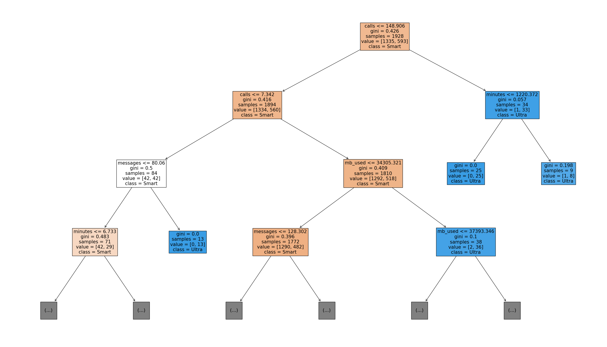
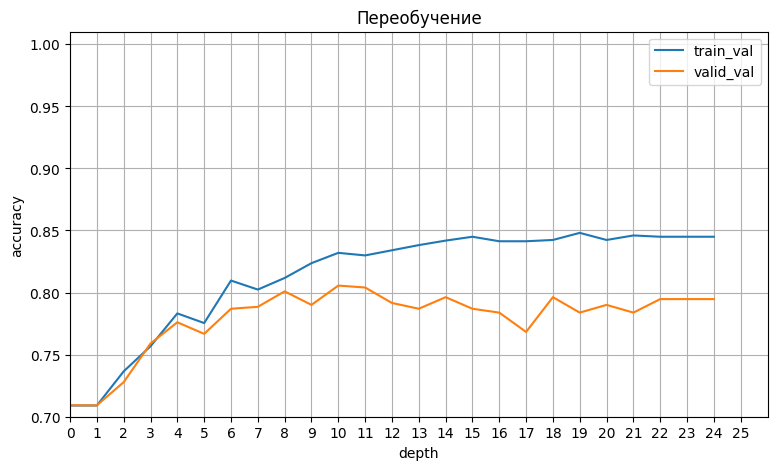
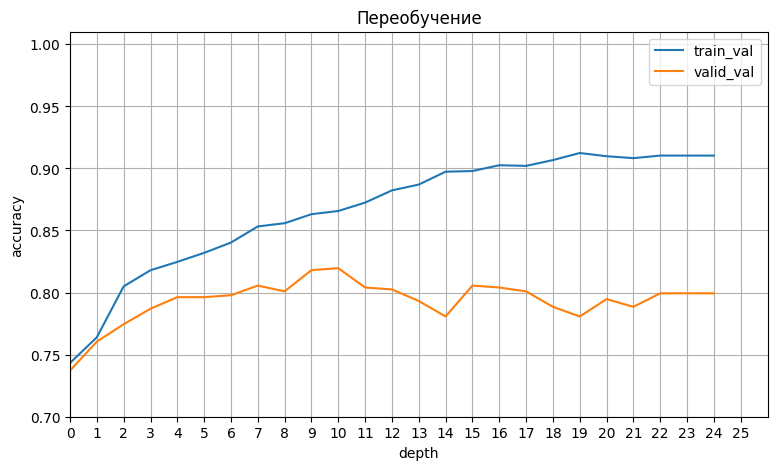

# Рекомендация тарифов мобильного оператора


<h1>Содержание<span class='tocSkip'></span></h1>

* [1 Откроем и изучим файл](#my_section_1) <a id='content_1'></a>
* [2 Разобьём данные на выборки](#my_section_2) <a id='content_2'></a>
* [3 Исследуем модели](#my_section_3) <a id='content_3'></a>
  * [3.1 Модель DecisionTreeClassifier](#my_section_4) <a id='content_4'></a>
  * [3.2 Модель RandomForestClassifier](#my_section_5) <a id='content_5'></a>
  * [3.3 Модель LogisticRegression](#my_section_6) <a id='content_6'></a>
  * [3.4 Заключение](#my_section_7) <a id='content_7'></a>
* [4 Проверка модели на тестовой выборке](#my_section_8) <a id='content_8'></a>
  * [4.1 Модель RandomForestClassifier](#my_section_9) <a id='content_9'></a>
  * [4.2 Заключение](#my_section_10) <a id='content_10'></a>
* [5 Проверка модели на адекватность](#my_section_11) <a id='content_11'></a>
  * [5.1 Модель DummyClassifier](#my_section_12) <a id='content_12'></a>
  * [5.2 Заключение](#my_section_13) <a id='content_13'></a>
* [6 Общий вывод](#my_section_14) <a id='content_14'></a>


**Общая цель:** построить систему, способную проанализировать поведение клиентов и предложить пользователям новый тариф: «Смарт» или «Ультра».


**Цели исследования:** построить модель для задачи классификации, которая выберет подходящий тариф. Модель должна быть с максимально большим значением accuracy, необходимая доля правильных ответов не меньше 0.75.


**План работы:** 
1. Провести выгрузку данных, изучить общую информацию
2. Разделить исходные данные на обучающую, валидационную и тестовую выборки.
3. Исследовать качество разных моделей, меняя гиперпараметры. Подготовить краткие выводы исследования.
4. Проверить качество модели на тестовой выборке.
5. Проверить модели на вменяемость.
6. Подготовить общий вывод


**Описание данных:** Каждый объект в наборе данных — это информация о поведении одного пользователя за месяц. Известно:
- сalls — количество звонков,
- minutes — суммарная длительность звонков в минутах,
- messages — количество sms-сообщений,
- mb_used — израсходованный интернет-трафик в Мб,
- is_ultra — каким тарифом пользовался в течение месяца («Ультра» — 1, «Смарт» — 0).

Предобработка данных уже проведена.

<a id='my_section_1'></a>
## [Откроем и изучим файл](#content_1)

Подключим необходимые модули и библиотеки


```python
import time

import pandas as pd
from sklearn.tree import DecisionTreeClassifier
from sklearn.ensemble import RandomForestClassifier
from sklearn.linear_model import LogisticRegression
from sklearn.dummy import DummyClassifier
from sklearn.metrics import accuracy_score
from sklearn.model_selection import train_test_split
from sklearn import tree
import matplotlib.pyplot as plt
```

Загрузим файл


```python
try:
    df = pd.read_csv('users_behavior.csv')
except:
    df = pd.read_csv('https:..')
```

Изучим информацию о файле


```python
df.head()
```


<div>
<style scoped>
    .dataframe tbody tr th:only-of-type {
        vertical-align: middle;
    }

    .dataframe tbody tr th {
        vertical-align: top;
    }

    .dataframe thead th {
        text-align: right;
    }
</style>
<table border="1" class="dataframe">
  <thead>
    <tr style="text-align: right;">
      <th></th>
      <th>calls</th>
      <th>minutes</th>
      <th>messages</th>
      <th>mb_used</th>
      <th>is_ultra</th>
    </tr>
  </thead>
  <tbody>
    <tr>
      <th>0</th>
      <td>40.0</td>
      <td>311.90</td>
      <td>83.0</td>
      <td>19915.42</td>
      <td>0</td>
    </tr>
    <tr>
      <th>1</th>
      <td>85.0</td>
      <td>516.75</td>
      <td>56.0</td>
      <td>22696.96</td>
      <td>0</td>
    </tr>
    <tr>
      <th>2</th>
      <td>77.0</td>
      <td>467.66</td>
      <td>86.0</td>
      <td>21060.45</td>
      <td>0</td>
    </tr>
    <tr>
      <th>3</th>
      <td>106.0</td>
      <td>745.53</td>
      <td>81.0</td>
      <td>8437.39</td>
      <td>1</td>
    </tr>
    <tr>
      <th>4</th>
      <td>66.0</td>
      <td>418.74</td>
      <td>1.0</td>
      <td>14502.75</td>
      <td>0</td>
    </tr>
  </tbody>
</table>
</div>


```python
df.info()
```

    <class 'pandas.core.frame.DataFrame'>
    RangeIndex: 3214 entries, 0 to 3213
    Data columns (total 5 columns):
     #   Column    Non-Null Count  Dtype  
    ---  ------    --------------  -----  
     0   calls     3214 non-null   float64
     1   minutes   3214 non-null   float64
     2   messages  3214 non-null   float64
     3   mb_used   3214 non-null   float64
     4   is_ultra  3214 non-null   int64  
    dtypes: float64(4), int64(1)
    memory usage: 125.7 KB
    


```python
df.isna().sum()
```


    calls       0
    minutes     0
    messages    0
    mb_used     0
    is_ultra    0
    dtype: int64


```python
df.describe()
```


<div>
<style scoped>
    .dataframe tbody tr th:only-of-type {
        vertical-align: middle;
    }

    .dataframe tbody tr th {
        vertical-align: top;
    }

    .dataframe thead th {
        text-align: right;
    }
</style>
<table border="1" class="dataframe">
  <thead>
    <tr style="text-align: right;">
      <th></th>
      <th>calls</th>
      <th>minutes</th>
      <th>messages</th>
      <th>mb_used</th>
      <th>is_ultra</th>
    </tr>
  </thead>
  <tbody>
    <tr>
      <th>count</th>
      <td>3214.000000</td>
      <td>3214.000000</td>
      <td>3214.000000</td>
      <td>3214.000000</td>
      <td>3214.000000</td>
    </tr>
    <tr>
      <th>mean</th>
      <td>63.038892</td>
      <td>438.208787</td>
      <td>38.281269</td>
      <td>17207.673836</td>
      <td>0.306472</td>
    </tr>
    <tr>
      <th>std</th>
      <td>33.236368</td>
      <td>234.569872</td>
      <td>36.148326</td>
      <td>7570.968246</td>
      <td>0.461100</td>
    </tr>
    <tr>
      <th>min</th>
      <td>0.000000</td>
      <td>0.000000</td>
      <td>0.000000</td>
      <td>0.000000</td>
      <td>0.000000</td>
    </tr>
    <tr>
      <th>25%</th>
      <td>40.000000</td>
      <td>274.575000</td>
      <td>9.000000</td>
      <td>12491.902500</td>
      <td>0.000000</td>
    </tr>
    <tr>
      <th>50%</th>
      <td>62.000000</td>
      <td>430.600000</td>
      <td>30.000000</td>
      <td>16943.235000</td>
      <td>0.000000</td>
    </tr>
    <tr>
      <th>75%</th>
      <td>82.000000</td>
      <td>571.927500</td>
      <td>57.000000</td>
      <td>21424.700000</td>
      <td>1.000000</td>
    </tr>
    <tr>
      <th>max</th>
      <td>244.000000</td>
      <td>1632.060000</td>
      <td>224.000000</td>
      <td>49745.730000</td>
      <td>1.000000</td>
    </tr>
  </tbody>
</table>
</div>


Проведём проверку на сбалансированность классов по целевому признаку.


```python
df['is_ultra'].value_counts()/df.shape[0]*100
```


    is_ultra
    0    69.352831
    1    30.647169
    Name: count, dtype: float64


*Количество пользователей с тарифом "Смарт"(69%) больше, чем с тарифом "Ультра"(31%).*

Изучим датафрейм на корреляцию признаков


```python
df.corr()
```


<div>
<style scoped>
    .dataframe tbody tr th:only-of-type {
        vertical-align: middle;
    }

    .dataframe tbody tr th {
        vertical-align: top;
    }

    .dataframe thead th {
        text-align: right;
    }
</style>
<table border="1" class="dataframe">
  <thead>
    <tr style="text-align: right;">
      <th></th>
      <th>calls</th>
      <th>minutes</th>
      <th>messages</th>
      <th>mb_used</th>
      <th>is_ultra</th>
    </tr>
  </thead>
  <tbody>
    <tr>
      <th>calls</th>
      <td>1.000000</td>
      <td>0.982083</td>
      <td>0.177385</td>
      <td>0.286442</td>
      <td>0.207122</td>
    </tr>
    <tr>
      <th>minutes</th>
      <td>0.982083</td>
      <td>1.000000</td>
      <td>0.173110</td>
      <td>0.280967</td>
      <td>0.206955</td>
    </tr>
    <tr>
      <th>messages</th>
      <td>0.177385</td>
      <td>0.173110</td>
      <td>1.000000</td>
      <td>0.195721</td>
      <td>0.203830</td>
    </tr>
    <tr>
      <th>mb_used</th>
      <td>0.286442</td>
      <td>0.280967</td>
      <td>0.195721</td>
      <td>1.000000</td>
      <td>0.198568</td>
    </tr>
    <tr>
      <th>is_ultra</th>
      <td>0.207122</td>
      <td>0.206955</td>
      <td>0.203830</td>
      <td>0.198568</td>
      <td>1.000000</td>
    </tr>
  </tbody>
</table>
</div>


*Сильная корреляция наблюдается между двумя признаками: 'minuetes' и 'calls'. Говорить о мультиколлинеарности не приходится.*

**Вывод:** проведена загрузка ключевых модулей файла, проведен обзор информации.

<a id='my_section_2'></a>
## [Разобьём данные на выборки](#content_2)

Определим обучающий набор данных(*features*) и целевой признак(*target*).


```python
features = df.drop(['is_ultra'], axis=1)
target = df['is_ultra']
```

*Целевой признак target категориальный, должна решаться задача классификации.*

Разделим набор данных на обучающий(60%), валидационный(20%) и тестовый(20%), по правилу 3:1:1.
Для начала получим тестовый и **обучающий набор**.


```python
features_train, features_test, target_train, target_test =\
train_test_split(features, target, test_size=0.4, random_state=12345)
features_test.shape
```


    (1286, 4)


Перезапишем пременные и получим **тестовый и валидационный** набор. 


```python
features_test, features_valid, target_test, target_valid =\
train_test_split(features_test, target_test, test_size=.5, random_state=12345)
print('Размер выборки:')
print(f'- обучающей — {features_train.shape[0]}')
print(f'- валидационной — {features_valid.shape[0]}')
print(f'- тестовой — {features_test.shape[0]}')
```

    Размер выборки:
    - обучающей — 1928
    - валидационной — 643
    - тестовой — 643
    

**Вывод:** проведено определение обучающего набора данных(*features*) и целевого признака(*target*). Разделен набор данных на:
- features_train, target_train — обучающий(60%);
- features_valid, target_valid — валидационный(20%);
- features_test, target_test — тестовый(20%).

<a id='my_section_3'></a>
## [Исследуем модели](#content_3)

Так как целевой признак *target* категориальный, будет решаться задача классификации. Проведём исследование качества разных моделей.

<a id='my_section_4'></a>
### [Модель DecisionTreeClassifier](#content_4)

Проведём эксперимент для выявления лучших гиперпараметров модели. Определим значения используя валидационную выборку. Будем использовать гиперпараметры:
- random_state — управляет случайностью оценки;
- max_depth — максимальная глубина дерева;
- splitter — стратегия, используемая для выбора разделения на каждом узле;
- min_samples_split — минимальное количество выборок, необходимое для разделения внутреннего узла;
- min_samples_leaf — минимальное количество выборок, необходимых для нахождения в конечном узле.


```python
best_model_dtc = None
best_result_dtc = 0
top_depth_dtc = 1
for el in ['random', 'best']:
    for spl in range(2,6):
        for depth in range(1, 21):
            # Определение гиперпараметров модели
            model = DecisionTreeClassifier(random_state=12345, max_depth=depth, splitter=el,
                                           min_samples_split=spl, min_samples_leaf=spl-1) 
            # обучение модели
            model.fit(features_train, target_train) 
            # предсказания модели на валидационной выборке
            predictions = model.predict(features_valid) 
            # нахождение качества модели для валидационной выборки
            result = accuracy_score(target_valid, predictions)
            if result > best_result_dtc:
                best_model_dtc = model
                best_result_dtc = result
                
                top_depth_dtc = depth
                top_splitter_dtc = el
                top_split = spl
                top_leaf = spl-1
                
print('Оптимальная глубина дерева:', top_depth_dtc)
print('Стратегия разделения:', top_splitter_dtc)
print('\nОптимальное количество выборок, необходимое для:')
print('- разделения внутреннего узла:', top_split)
print('- размещения в конечном узле:', top_leaf)
```

    Оптимальная глубина дерева: 11
    Стратегия разделения: random
    
    Оптимальное количество выборок, необходимое для:
    - разделения внутреннего узла: 5
    - размещения в конечном узле: 4
    

Изучим, как модель принимает решение. Построим график `plot_tree`


```python
def nice_visualisation(var):
    clf = tree.DecisionTreeClassifier(random_state=12345,
                                      splitter=top_splitter_dtc,
                                      min_samples_split=top_split,
                                      min_samples_leaf=top_leaf,
                                      max_depth=var)
    clf = clf.fit(features_train, target_train)
    fig = plt.figure(figsize=(35,20))
    tree.plot_tree(clf,
                   feature_names=features.columns.values, 
                   class_names=['Smart','Ultra'],
                   filled=True,
                   fontsize = 15,
                   max_depth = 3     # Это чтобы прорисовывало 3 уровня, не глубже
                      );
    
nice_visualisation(4)    
```


    

    


Проведём эксперимент, визуализируем график распределения точности между значениями выборок train и valid, меняя при этом depth. Большая разность в точности между выборками будет свидетельствовать о переобучении модели.


```python
def mod_acc(height):
    score_t = []
    score_v = []
    for depth in range(1,height):
        model = DecisionTreeClassifier(random_state=12345,
                                       max_depth=depth,
                                       splitter=top_splitter_dtc,
                                       min_samples_split=top_split,
                                       min_samples_leaf=top_leaf) 
        # обучение модели
        model.fit(features_train, target_train) 

        # для обучающей выборки
        predictions = model.predict(features_train) 
        result_train = accuracy_score(target_train, predictions)

        # для валидационной выборки
        predictions = model.predict(features_valid) 
        result_valid = accuracy_score(target_valid, predictions)

        # Сохранение результатов
        score_t.append(result_train)
        score_v.append(result_valid)
    
    
    plt.figure(figsize=(9, 5))
    plt.plot(score_t, label='train_val')
    plt.plot(score_v, label='valid_val')
    plt.grid()
    plt.axis([0,height,0.7,1.01])
    plt.legend()
    plt.xlabel('depth')
    plt.ylabel('accuracy')
    plt.title('Переобучение')
    plt.xticks(range(0,26,1))

mod_acc(26)    
```


    

    


*Как видно, начало переобучения модели можно наблюдать на глубине выше 3,5.*

Проведём проверку скорости работы предсказания модели.


```python
start = time.time()
predictions_dtc = best_model_dtc.predict(features_test)
end = time.time()
time_dtc = (end-start) * 10**3
```

Определим функцию для вывода, чтобы не повторяться


```python
def conc(accuracy, time):
    print('Доля правильных ответов модели'
          f' для валидационного набора данных:\n — {accuracy}')
    print('\nВремя предсказания модели:\n'
          f' — {time :.3} ms')
```

**Вывод:**

Подведём итог для выбранных гиперпараметров, выявленных с помощью обучающей и валидационной выборок.


```python
conc(best_result_dtc, time_dtc)
```

    Доля правильных ответов модели для валидационного набора данных:
     — 0.8055987558320373
    
    Время предсказания модели:
     — 0.975 ms
    

<a id='my_section_5'></a>
### [Модель RandomForestClassifier](#content_5)

Проведём эксперимент для выявления лучших гиперпараметров модели. Определим значения используя валидационную выборку.


```python
best_model_rfc = None
best_result_rfc =  0
for est in range(1, 7):
    for depth in range(1, 11):
        for spl in range(2,5):
            for lf in range(1,4):
                model = RandomForestClassifier(random_state=12345,
                                               n_estimators=est,
                                               max_depth=depth,
                                               min_samples_split=spl,
                                               min_samples_leaf=lf)

                model.fit(features_train, target_train)
                answer = model.score(features_valid, target_valid)
                if answer > best_result_rfc:
                    best_result_rfc = answer
                    best_model_rfc = model
                    best_est_rfc = est
                    best_depth_rfc = depth
                    top_spl_rfc = spl
                    top_lf_rfc = lf
        
        
print('Оптимальное количество деревьев:', best_est_rfc)
print('Оптимальная глубина:', best_depth_rfc)
print('\nОптимальное количество выборок, необходимое для:')
print('- разделения внутреннего узла:', top_spl_rfc)
print('- размещения в конечном узле:', top_lf_rfc)
```

    Оптимальное количество деревьев: 6
    Оптимальная глубина: 10
    
    Оптимальное количество выборок, необходимое для:
    - разделения внутреннего узла: 2
    - размещения в конечном узле: 3
    

Проведём эксперимент, визуализируем график распределения точности между значениями выборок train и valid, меняя при этом depth. Большая разность в точности между выборками будет свидетельствовать о переобучении модели.


```python
def mod_acc_rfc(height):
    score_t = []
    score_v = []
    for depth in range(1,height):
        model = RandomForestClassifier(random_state=12345,
                                       n_estimators=best_est_rfc,
                                       max_depth=depth,
                                       min_samples_split=top_spl_rfc,
                                       min_samples_leaf=top_lf_rfc) 
        # обучение модели
        model.fit(features_train, target_train) 

        # для обучающей выборки
        predictions = model.predict(features_train) 
        result_train = accuracy_score(target_train, predictions)

        # для валидационной выборки
        predictions = model.predict(features_valid) 
        result_valid = accuracy_score(target_valid, predictions)

        # Сохранение результатов
        score_t.append(result_train)
        score_v.append(result_valid)
    
    
    plt.figure(figsize=(9, 5))
    plt.plot(score_t, label='train_val')
    plt.plot(score_v, label='valid_val')
    plt.grid()
    plt.axis([0,height,0.7,1.01])
    plt.legend()
    plt.xlabel('depth')
    plt.ylabel('accuracy')
    plt.title('Переобучение')
    plt.xticks(range(0,26,1))

mod_acc_rfc(26)    
```


    

    


Проведём проверку скорости работы предсказания модели.


```python
start = time.time()
predictions_rfc = best_model_rfc.predict(features_test)
end = time.time()
time_rfc = (end-start) * 10**3
```

**Вывод:**

Подведём итог для лучших гиперпараметров, выявленных с помощью обучающей, валидационной и тестовой выборок.


```python
conc(best_result_rfc, time_rfc)
```

    Доля правильных ответов модели для валидационного набора данных:
     — 0.8180404354587869
    
    Время предсказания модели:
     — 2.97 ms
    

<a id='my_section_6'></a>
### [Модель LogisticRegression](#content_6)


```python
model = LogisticRegression(random_state=12345,
                           solver='lbfgs',
                           max_iter=1000)
model.fit(features_train, target_train)
answer_valid_lr = model.score(features_valid, target_valid)
```

Проведём проверку скорости работы предсказания модели.


```python
start = time.time()
predictions_lr = model.predict(features_train)
end = time.time()
time_lr = (end-start) * 10**3
```

**Вывод:**

Подведём итог для лучших гиперпараметров, выявленных с помощью обучающей, валидационной и тестовой выборок.


```python
conc(answer_valid_lr, time_lr)
```

    Доля правильных ответов модели для валидационного набора данных:
     — 0.6842923794712286
    
    Время предсказания модели:
     — 0.997 ms
    

<a id='my_section_7'></a>
### [Заключение](#content_7)

**Вывод:** в результате исследования были получены следующие данные для модели:
1. Решающего леса:
 - точность: 0.8055987558320373
 
 
2. Случайного леса: 
 - точность: 0.8180404354587869
 
 
3. Логистическая регрессия:
 - точность: 0.6842923794712286
 
 
Как видно, лучшая точность, проверенная на валидационной выборке, оказывается у модели 'Случайный лес'.

<a id='my_section_8'></a>
## [Проверка модели на тестовой выборке](#content_8)

Изучим точность предсказания выбранной модели с гиперпараметрами на тестовой выборке.

<a id='my_section_9'></a>
### [Модель RandomForestClassifier](#content_9)


```python
test_rfc = best_model_rfc.score(features_test, target_test)
print(f'Точность предсказания: {test_rfc}')
```

    Точность предсказания: 0.7884914463452566
    

<a id='my_section_10'></a>
### [Заключение](#content_10)

**Вывод:** модель 'Случайный лес' показала точность на тестовой выборке:
- 0.7884914463452566


<a id='my_section_11'></a>
## [Проверка модели на адекватность](#content_11)

Чтобы проверить модель на  адекватность нужно сравнить качество нашей лучшей модели с качеством лучшей константной модели. Если качество нашей модели окажется хуже качества константной модели, то наша модель бесполезна. Константная модель - это модель, которая предсказывает одну и ту же константу для любого входа. И если говорить о задаче классификации, то лучшая константа - это метка наибольшего класса.

Для начала определим метку наибольшего класса.


```python
df['is_ultra'].value_counts()/df.shape[0]
```


    is_ultra
    0    0.693528
    1    0.306472
    Name: count, dtype: float64


*Наибольшим классом оказался 0 - тариф 'Смарт'*

<a id='my_section_12'></a>
### [Модель DummyClassifier](#content_12)

Зададим константную модель для DummyClassifier. Проведём обучение и предсказание модели, получим её точность.


```python
model_dc = DummyClassifier(strategy='most_frequent', random_state=1)
# задаем константную модель, которая будет предсказывать по most_frequent - самый частый класс
model_dc.fit(features_train, target_train)
# тут модель смотри на самый частый класс в target_train - типо "обучение"
predictions_dc = model_dc.predict(features_test)
# проогнозирует везде самый частый класс в features_test
answer_dc = model_dc.score(features_test, target_test)
# подсчёт точности
print('Точность предсказание модели', answer_dc)
```

    Точность предсказание модели 0.7060653188180405
    

Проведём проверку на адекватность  модели DecisionTreeClassifier сравнивания точность с моделью, полученной при помощи DummyClassifier.


```python
if test_rfc > answer_dc:
    print('Модель адекватна')
else:
    print('Модель бесполезна')
```

    Модель адекватна
    

<a id='my_section_13'></a>
### [Заключение](#content_13)

**Вывод:** модель прошла проверку на адекватность.

<a id='my_section_14'></a>
## [Общий вывод](#content_14)

Чтобы построить модель для задачи классификации, которая выберет подходящий тариф были выполнены действия:
1. проведена загрузка и изучение данных.
2. разбиты данные по пропорции 3:1:1  на выборки:
    - features_train, target_train — обучающий(60%);
    - features_valid, target_valid — валидационный(20%);
    - features_test, target_test — тестовый(20%).
    
    
3. Проведено исследование моделей:
    - DecisionTreeClassifier;
    - RandomForestClassifier;
    - LogisticRegression.
    
    Результат исследования, выявил, что наиболбшей точностью обладает модель RandomForestClassifier (0.8180404354587869).


4. Результат проверки на тестовом наборе данных выявил у модели RandomForestClassifier точность  0.789.
5. Проверка на адекватность показала, что модель RandomForestClassifier адекватна.   

В целом можно заключить, что нам удалось построить модель для задачи классификации, которая выберет подходящий тариф. Модель обладает необходимой долей правильных ответов не меньше 0.75.


```python

```
