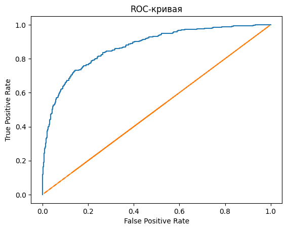

# Прогнозирование оттока клиентов

<h1>Содержание<span class='tocSkip'></span></h1>

* [1 Подготовка данных](#my_section_1) <a id='content_1'></a>
  * [1.1 Загрузка и изучение](#my_section_2) <a id='content_2'></a>
    * [1.1.1 Выгрузка](#my_section_3) <a id='content_3'></a>
    * [1.1.2 Ознакомление](#my_section_4) <a id='content_4'></a>
    * [1.1.3 Корреляция](#my_section_5) <a id='content_5'></a>
    * [1.1.4 Проверка на дубликаты](#my_section_6) <a id='content_6'></a>
    * [1.1.5 Сбалансированность целевого признака](#my_section_7) <a id='content_7'></a>
    * [1.1.6 Вывод](#my_section_8) <a id='content_8'></a>
  * [1.2 Подготовка данных](#my_section_9) <a id='content_9'></a>
    * [1.2.1 Обработка пропусков](#my_section_10) <a id='content_10'></a>
    * [1.2.2 Изменение типов данных](#my_section_11) <a id='content_11'></a>
    * [1.2.3 Структурирование](#my_section_12) <a id='content_12'></a>
    * [1.2.4 Разделение на выборки](#my_section_13) <a id='content_13'></a>
    * [1.2.5 Техника кодирования OHE](#my_section_14) <a id='content_14'></a>
    * [1.2.6 Масштабирование признаков](#my_section_15) <a id='content_15'></a>
* [2 Исследование задачи](#my_section_16) <a id='content_16'></a>
  * [2.1 Модель DecisionTreeClassifier](#my_section_17) <a id='content_17'></a>
  * [2.2 Модель RandomForestClassifier](#my_section_18) <a id='content_18'></a>
  * [2.3 Модель LogisticRegression](#my_section_19) <a id='content_19'></a>
  * [2.4 Заключение](#my_section_20) <a id='content_20'></a>
* [3 Борьба с дисбалансом](#my_section_21) <a id='content_21'></a>
  * [3.1 Увеличение выборки](#my_section_22) <a id='content_22'></a>
  * [3.2 Уменьшение выборки](#my_section_23) <a id='content_23'></a>
  * [3.3 Модель DecisionTreeClassifier](#my_section_24) <a id='content_24'></a>
    * [3.3.1 Взвешивание классов](#my_section_25) <a id='content_25'></a>
    * [3.3.2 Обучение на увеличенной выборке](#my_section_26) <a id='content_26'></a>
    * [3.3.3 Обучение на уменьшенной выборке](#my_section_27) <a id='content_27'></a>
  * [3.4 Модель RandomForestClassifier](#my_section_28) <a id='content_28'></a>
    * [3.4.1 Взвешивание классов](#my_section_29) <a id='content_29'></a>
    * [3.4.2 Обучение на увеличенной выборке](#my_section_30) <a id='content_30'></a>
    * [3.4.3 Обучение на уменьшенной выборке](#my_section_31) <a id='content_31'></a>
  * [3.5 Модель LogisticRegression](#my_section_32) <a id='content_32'></a>
    * [3.5.1 Взвешивание классов](#my_section_33) <a id='content_33'></a>
    * [3.5.2 Обучение на увеличенной выборке](#my_section_34) <a id='content_34'></a>
    * [3.5.3 Обучение на уменьшенной выборке](#my_section_35) <a id='content_35'></a>
  * [3.6 Заключение](#my_section_36) <a id='content_36'></a>
* [4 Тестирование модели](#my_section_37) <a id='content_37'></a>
  * [4.1 Тестирование](#my_section_38) <a id='content_38'></a>
  * [4.2 Метрика AUC-ROC](#my_section_39) <a id='content_39'></a>
  * [4.3 Заключение](#my_section_40) <a id='content_40'></a>


**Основная задача:** 
Подготовить модель, которая позволит спрогнозировать, уйдёт клиент из банка в ближайшее время или нет.

**Цель исследования:**
- Построить модель с предельно большим значением F1-меры, довести метрику до 0.59.
- Проверить F1-меру на тестовой выборке.
- Провести измерение AUC-ROC, сравнивать её значение с F1-мерой.

**План работы:**
1. Выгрузить данные, изучить, обработать и подготовить для дальнейшей работы.
2. Исследовать задачу с учётом дисбаланса классов
3. Исследовать задачу, избавившись от дисбаланса
4. Провести тестирование лучшей модели
5. Написать вывод

**Описание данных:**

Признаки:
- RowNumber — индекс строки в данных
- CustomerId — уникальный идентификатор клиента
- Surname — фамилия
- CreditScore — кредитный рейтинг
- Geography — страна проживания
- Gender — пол
- Age — возраст
- Tenure — сколько лет человек является клиентом банка
- Balance — баланс на счёте
- NumOfProducts — количество продуктов банка, используемых клиентом
- HasCrCard — наличие кредитной карты
- IsActiveMember — активность клиента
- EstimatedSalary — предполагаемая зарплата

Целевой признак:
- Exited — факт ухода клиента

Источник данных: [https://www.kaggle.com/barelydedicated/bank-customer-churn-modeling](https://www.kaggle.com/barelydedicated/bank-customer-churn-modeling)

<a id='my_section_1'></a>
## [Подготовка данных](#content_1)

Проведём загрузку, изучение и обработку данных

<a id='my_section_2'></a>
### [Загрузка и изучение](#content_2)


```python
#!pip install scikit-learn==1.1.3
#!pip install tqdm
```

<a id='my_section_3'></a>
#### [Выгрузка](#content_3)

Создадим блок для импорта нужных в работе библиотек


```python
import pandas as pd
import matplotlib.pyplot as plt

from sklearn.model_selection import train_test_split
from sklearn.preprocessing import StandardScaler, OneHotEncoder
from sklearn.metrics import (
    f1_score,
    roc_auc_score,
    roc_curve,
    recall_score
)
from sklearn.utils import shuffle
from sklearn.tree import DecisionTreeClassifier
from sklearn.ensemble import RandomForestClassifier
from sklearn.linear_model import LogisticRegression

from tqdm import tqdm
```

Выгрузим данные в переменную data


```python
try:
    data = pd.read_csv('Churn.csv')
except:
    data = pd.read_csv('https:..')
```

<a id='my_section_4'></a>
#### [Ознакомление](#content_4)

Ознакомление с первыми 10 строками таблицы


```python
data.head(10)
```


<div>
<style scoped>
    .dataframe tbody tr th:only-of-type {
        vertical-align: middle;
    }

    .dataframe tbody tr th {
        vertical-align: top;
    }

    .dataframe thead th {
        text-align: right;
    }
</style>
<table border="1" class="dataframe">
  <thead>
    <tr style="text-align: right;">
      <th></th>
      <th>RowNumber</th>
      <th>CustomerId</th>
      <th>Surname</th>
      <th>CreditScore</th>
      <th>Geography</th>
      <th>Gender</th>
      <th>Age</th>
      <th>Tenure</th>
      <th>Balance</th>
      <th>NumOfProducts</th>
      <th>HasCrCard</th>
      <th>IsActiveMember</th>
      <th>EstimatedSalary</th>
      <th>Exited</th>
    </tr>
  </thead>
  <tbody>
    <tr>
      <th>0</th>
      <td>1</td>
      <td>15634602</td>
      <td>Hargrave</td>
      <td>619</td>
      <td>France</td>
      <td>Female</td>
      <td>42</td>
      <td>2.0</td>
      <td>0.00</td>
      <td>1</td>
      <td>1</td>
      <td>1</td>
      <td>101348.88</td>
      <td>1</td>
    </tr>
    <tr>
      <th>1</th>
      <td>2</td>
      <td>15647311</td>
      <td>Hill</td>
      <td>608</td>
      <td>Spain</td>
      <td>Female</td>
      <td>41</td>
      <td>1.0</td>
      <td>83807.86</td>
      <td>1</td>
      <td>0</td>
      <td>1</td>
      <td>112542.58</td>
      <td>0</td>
    </tr>
    <tr>
      <th>2</th>
      <td>3</td>
      <td>15619304</td>
      <td>Onio</td>
      <td>502</td>
      <td>France</td>
      <td>Female</td>
      <td>42</td>
      <td>8.0</td>
      <td>159660.80</td>
      <td>3</td>
      <td>1</td>
      <td>0</td>
      <td>113931.57</td>
      <td>1</td>
    </tr>
    <tr>
      <th>3</th>
      <td>4</td>
      <td>15701354</td>
      <td>Boni</td>
      <td>699</td>
      <td>France</td>
      <td>Female</td>
      <td>39</td>
      <td>1.0</td>
      <td>0.00</td>
      <td>2</td>
      <td>0</td>
      <td>0</td>
      <td>93826.63</td>
      <td>0</td>
    </tr>
    <tr>
      <th>4</th>
      <td>5</td>
      <td>15737888</td>
      <td>Mitchell</td>
      <td>850</td>
      <td>Spain</td>
      <td>Female</td>
      <td>43</td>
      <td>2.0</td>
      <td>125510.82</td>
      <td>1</td>
      <td>1</td>
      <td>1</td>
      <td>79084.10</td>
      <td>0</td>
    </tr>
    <tr>
      <th>5</th>
      <td>6</td>
      <td>15574012</td>
      <td>Chu</td>
      <td>645</td>
      <td>Spain</td>
      <td>Male</td>
      <td>44</td>
      <td>8.0</td>
      <td>113755.78</td>
      <td>2</td>
      <td>1</td>
      <td>0</td>
      <td>149756.71</td>
      <td>1</td>
    </tr>
    <tr>
      <th>6</th>
      <td>7</td>
      <td>15592531</td>
      <td>Bartlett</td>
      <td>822</td>
      <td>France</td>
      <td>Male</td>
      <td>50</td>
      <td>7.0</td>
      <td>0.00</td>
      <td>2</td>
      <td>1</td>
      <td>1</td>
      <td>10062.80</td>
      <td>0</td>
    </tr>
    <tr>
      <th>7</th>
      <td>8</td>
      <td>15656148</td>
      <td>Obinna</td>
      <td>376</td>
      <td>Germany</td>
      <td>Female</td>
      <td>29</td>
      <td>4.0</td>
      <td>115046.74</td>
      <td>4</td>
      <td>1</td>
      <td>0</td>
      <td>119346.88</td>
      <td>1</td>
    </tr>
    <tr>
      <th>8</th>
      <td>9</td>
      <td>15792365</td>
      <td>He</td>
      <td>501</td>
      <td>France</td>
      <td>Male</td>
      <td>44</td>
      <td>4.0</td>
      <td>142051.07</td>
      <td>2</td>
      <td>0</td>
      <td>1</td>
      <td>74940.50</td>
      <td>0</td>
    </tr>
    <tr>
      <th>9</th>
      <td>10</td>
      <td>15592389</td>
      <td>H?</td>
      <td>684</td>
      <td>France</td>
      <td>Male</td>
      <td>27</td>
      <td>2.0</td>
      <td>134603.88</td>
      <td>1</td>
      <td>1</td>
      <td>1</td>
      <td>71725.73</td>
      <td>0</td>
    </tr>
  </tbody>
</table>
</div>


Категориальные признаки: 
- RowNumber; 
- CustomerId; 
- Surname; 
- Geography;
- Gender; 
- Age; 
- Tenure; 
- NumOfProducts; 
- HasCrCard;
- IsActiveMember; 
- Exited.

Количественные:
- CreditScore;
- Balance;
- EstimatedSalary.

Получим общую информацию


```python
data.info()
```

    <class 'pandas.core.frame.DataFrame'>
    RangeIndex: 10000 entries, 0 to 9999
    Data columns (total 14 columns):
     #   Column           Non-Null Count  Dtype  
    ---  ------           --------------  -----  
     0   RowNumber        10000 non-null  int64  
     1   CustomerId       10000 non-null  int64  
     2   Surname          10000 non-null  object 
     3   CreditScore      10000 non-null  int64  
     4   Geography        10000 non-null  object 
     5   Gender           10000 non-null  object 
     6   Age              10000 non-null  int64  
     7   Tenure           9091 non-null   float64
     8   Balance          10000 non-null  float64
     9   NumOfProducts    10000 non-null  int64  
     10  HasCrCard        10000 non-null  int64  
     11  IsActiveMember   10000 non-null  int64  
     12  EstimatedSalary  10000 non-null  float64
     13  Exited           10000 non-null  int64  
    dtypes: float64(3), int64(8), object(3)
    memory usage: 1.1+ MB
    


```python
data['Tenure'].unique()
```


    array([ 2.,  1.,  8.,  7.,  4.,  6.,  3., 10.,  5.,  9.,  0., nan])


*В столбце Tenure есть пропуски, тип столбца можно перевести в int*

Изучим сводную информацию о датафрейме


```python
data.loc[:, ['CreditScore', 'Age', 'Tenure', 'Balance', 'NumOfProducts', 'HasCrCard',
     'IsActiveMember', 'EstimatedSalary', 'Exited']].describe()
```


<div>
<style scoped>
    .dataframe tbody tr th:only-of-type {
        vertical-align: middle;
    }

    .dataframe tbody tr th {
        vertical-align: top;
    }

    .dataframe thead th {
        text-align: right;
    }
</style>
<table border="1" class="dataframe">
  <thead>
    <tr style="text-align: right;">
      <th></th>
      <th>CreditScore</th>
      <th>Age</th>
      <th>Tenure</th>
      <th>Balance</th>
      <th>NumOfProducts</th>
      <th>HasCrCard</th>
      <th>IsActiveMember</th>
      <th>EstimatedSalary</th>
      <th>Exited</th>
    </tr>
  </thead>
  <tbody>
    <tr>
      <th>count</th>
      <td>10000.000000</td>
      <td>10000.000000</td>
      <td>9091.000000</td>
      <td>10000.000000</td>
      <td>10000.000000</td>
      <td>10000.00000</td>
      <td>10000.000000</td>
      <td>10000.000000</td>
      <td>10000.000000</td>
    </tr>
    <tr>
      <th>mean</th>
      <td>650.528800</td>
      <td>38.921800</td>
      <td>4.997690</td>
      <td>76485.889288</td>
      <td>1.530200</td>
      <td>0.70550</td>
      <td>0.515100</td>
      <td>100090.239881</td>
      <td>0.203700</td>
    </tr>
    <tr>
      <th>std</th>
      <td>96.653299</td>
      <td>10.487806</td>
      <td>2.894723</td>
      <td>62397.405202</td>
      <td>0.581654</td>
      <td>0.45584</td>
      <td>0.499797</td>
      <td>57510.492818</td>
      <td>0.402769</td>
    </tr>
    <tr>
      <th>min</th>
      <td>350.000000</td>
      <td>18.000000</td>
      <td>0.000000</td>
      <td>0.000000</td>
      <td>1.000000</td>
      <td>0.00000</td>
      <td>0.000000</td>
      <td>11.580000</td>
      <td>0.000000</td>
    </tr>
    <tr>
      <th>25%</th>
      <td>584.000000</td>
      <td>32.000000</td>
      <td>2.000000</td>
      <td>0.000000</td>
      <td>1.000000</td>
      <td>0.00000</td>
      <td>0.000000</td>
      <td>51002.110000</td>
      <td>0.000000</td>
    </tr>
    <tr>
      <th>50%</th>
      <td>652.000000</td>
      <td>37.000000</td>
      <td>5.000000</td>
      <td>97198.540000</td>
      <td>1.000000</td>
      <td>1.00000</td>
      <td>1.000000</td>
      <td>100193.915000</td>
      <td>0.000000</td>
    </tr>
    <tr>
      <th>75%</th>
      <td>718.000000</td>
      <td>44.000000</td>
      <td>7.000000</td>
      <td>127644.240000</td>
      <td>2.000000</td>
      <td>1.00000</td>
      <td>1.000000</td>
      <td>149388.247500</td>
      <td>0.000000</td>
    </tr>
    <tr>
      <th>max</th>
      <td>850.000000</td>
      <td>92.000000</td>
      <td>10.000000</td>
      <td>250898.090000</td>
      <td>4.000000</td>
      <td>1.00000</td>
      <td>1.000000</td>
      <td>199992.480000</td>
      <td>1.000000</td>
    </tr>
  </tbody>
</table>
</div>


*Медианы:*
- рейтинг: 650.1;
- возраст: 39;
- лет, сколько человек является клиентом банка: 5;
- баланс: 76485;
- кол-во продуктов: 1.5;
- кредитных карт: 0.7;
- активность: 0.5;
- предполагаемая з/п: 100090.23;
- факт ухода: 0.2.

<a id='my_section_5'></a>
#### [Корреляция](#content_5)

Изучим корреляцию признаков


```python
data_corr = data.corr(numeric_only=True)
data_corr
```


<div>
<style scoped>
    .dataframe tbody tr th:only-of-type {
        vertical-align: middle;
    }

    .dataframe tbody tr th {
        vertical-align: top;
    }

    .dataframe thead th {
        text-align: right;
    }
</style>
<table border="1" class="dataframe">
  <thead>
    <tr style="text-align: right;">
      <th></th>
      <th>RowNumber</th>
      <th>CustomerId</th>
      <th>CreditScore</th>
      <th>Age</th>
      <th>Tenure</th>
      <th>Balance</th>
      <th>NumOfProducts</th>
      <th>HasCrCard</th>
      <th>IsActiveMember</th>
      <th>EstimatedSalary</th>
      <th>Exited</th>
    </tr>
  </thead>
  <tbody>
    <tr>
      <th>RowNumber</th>
      <td>1.000000</td>
      <td>0.004202</td>
      <td>0.005840</td>
      <td>0.000783</td>
      <td>-0.007322</td>
      <td>-0.009067</td>
      <td>0.007246</td>
      <td>0.000599</td>
      <td>0.012044</td>
      <td>-0.005988</td>
      <td>-0.016571</td>
    </tr>
    <tr>
      <th>CustomerId</th>
      <td>0.004202</td>
      <td>1.000000</td>
      <td>0.005308</td>
      <td>0.009497</td>
      <td>-0.021418</td>
      <td>-0.012419</td>
      <td>0.016972</td>
      <td>-0.014025</td>
      <td>0.001665</td>
      <td>0.015271</td>
      <td>-0.006248</td>
    </tr>
    <tr>
      <th>CreditScore</th>
      <td>0.005840</td>
      <td>0.005308</td>
      <td>1.000000</td>
      <td>-0.003965</td>
      <td>-0.000062</td>
      <td>0.006268</td>
      <td>0.012238</td>
      <td>-0.005458</td>
      <td>0.025651</td>
      <td>-0.001384</td>
      <td>-0.027094</td>
    </tr>
    <tr>
      <th>Age</th>
      <td>0.000783</td>
      <td>0.009497</td>
      <td>-0.003965</td>
      <td>1.000000</td>
      <td>-0.013134</td>
      <td>0.028308</td>
      <td>-0.030680</td>
      <td>-0.011721</td>
      <td>0.085472</td>
      <td>-0.007201</td>
      <td>0.285323</td>
    </tr>
    <tr>
      <th>Tenure</th>
      <td>-0.007322</td>
      <td>-0.021418</td>
      <td>-0.000062</td>
      <td>-0.013134</td>
      <td>1.000000</td>
      <td>-0.007911</td>
      <td>0.011979</td>
      <td>0.027232</td>
      <td>-0.032178</td>
      <td>0.010520</td>
      <td>-0.016761</td>
    </tr>
    <tr>
      <th>Balance</th>
      <td>-0.009067</td>
      <td>-0.012419</td>
      <td>0.006268</td>
      <td>0.028308</td>
      <td>-0.007911</td>
      <td>1.000000</td>
      <td>-0.304180</td>
      <td>-0.014858</td>
      <td>-0.010084</td>
      <td>0.012797</td>
      <td>0.118533</td>
    </tr>
    <tr>
      <th>NumOfProducts</th>
      <td>0.007246</td>
      <td>0.016972</td>
      <td>0.012238</td>
      <td>-0.030680</td>
      <td>0.011979</td>
      <td>-0.304180</td>
      <td>1.000000</td>
      <td>0.003183</td>
      <td>0.009612</td>
      <td>0.014204</td>
      <td>-0.047820</td>
    </tr>
    <tr>
      <th>HasCrCard</th>
      <td>0.000599</td>
      <td>-0.014025</td>
      <td>-0.005458</td>
      <td>-0.011721</td>
      <td>0.027232</td>
      <td>-0.014858</td>
      <td>0.003183</td>
      <td>1.000000</td>
      <td>-0.011866</td>
      <td>-0.009933</td>
      <td>-0.007138</td>
    </tr>
    <tr>
      <th>IsActiveMember</th>
      <td>0.012044</td>
      <td>0.001665</td>
      <td>0.025651</td>
      <td>0.085472</td>
      <td>-0.032178</td>
      <td>-0.010084</td>
      <td>0.009612</td>
      <td>-0.011866</td>
      <td>1.000000</td>
      <td>-0.011421</td>
      <td>-0.156128</td>
    </tr>
    <tr>
      <th>EstimatedSalary</th>
      <td>-0.005988</td>
      <td>0.015271</td>
      <td>-0.001384</td>
      <td>-0.007201</td>
      <td>0.010520</td>
      <td>0.012797</td>
      <td>0.014204</td>
      <td>-0.009933</td>
      <td>-0.011421</td>
      <td>1.000000</td>
      <td>0.012097</td>
    </tr>
    <tr>
      <th>Exited</th>
      <td>-0.016571</td>
      <td>-0.006248</td>
      <td>-0.027094</td>
      <td>0.285323</td>
      <td>-0.016761</td>
      <td>0.118533</td>
      <td>-0.047820</td>
      <td>-0.007138</td>
      <td>-0.156128</td>
      <td>0.012097</td>
      <td>1.000000</td>
    </tr>
  </tbody>
</table>
</div>


```python
def pr_corr(data_corr):
    """
    Функция для нахождения
    наиболее коррелирующих признаков
    из таблицы корреляции
    """
    
    print(f'Столбец{"":<10}Строка{"":<10}Значение')
    for el in data_corr.columns:
        for var in data_corr[el]:
            if var > 0.1 and var < 1:
                print(f'{el :<16} {data_corr[el][data_corr[el] == var].index[0] :<14} {var :.05}')
                
pr_corr(data_corr)                
```

    Столбец          Строка          Значение
    Age              Exited         0.28532
    Balance          Exited         0.11853
    Exited           Age            0.28532
    Exited           Balance        0.11853
    

*Сильная корреляция признаков не наблюдается*

<a id='my_section_6'></a>
#### [Проверка на дубликаты](#content_6)

Выделим ключевые столбцы для проверки:
CustomerId, Surname, Geography, Gender, Age, Tenure, CreditScore

Проведём проверку


```python
data_dup_check = data
for el in ['Surname', 'Geography', 'Gender']:
    try:
        data_dup_check[el] = data_dup_check[el].str.lower()
    except AttributeError:
        print("Возникла ошибка в столбце:", el)
        
data_dup_check.loc[:, ['Surname', 'Geography', 'Gender', 'Tenure', 'CreditScore', 'Age']].duplicated().sum()
```


    0


```python
data['CustomerId'].duplicated().sum()
```


    0


*Дубликаты не найдены*

<a id='my_section_7'></a>
#### [Сбалансированность целевого признака](#content_7)

Изучим целевой признак на сбалансированность классов


```python
data['Exited'].value_counts() / data.shape[0] * 100
```


    Exited
    0    79.63
    1    20.37
    Name: count, dtype: float64


Наблюдается дисбаланс в сторону "0" класса.

<a id='my_section_8'></a>
#### [Вывод](#content_8)

В результате ознакомления с данными получены результаты:
1. обнаружен столбец Tenure с пропусками. Столбец имеет тип float, при этом дробные значения не обнаружены, имеется возможно изменить тип на int;
2. корреляция признаков отсутствует;
3. дубликаты не найдены;
4. сбалансированность целевого признака находится в соотношении:
 - 0 — 79.63%;
 - 1 — 20.37%.
 
 
5. Произведено разделение столбцов на признаки:

    Категориальные:
    - RowNumber; 
    - CustomerId; 
    - Surname; 
    - Geography;
    - Gender; 
    - Age; 
    - Tenure; 
    - NumOfProducts; 
    - HasCrCard;
    - IsActiveMember; 
    - Exited.

   Количественные:
    - CreditScore;
    - Balance;
    - EstimatedSalary.

 
 

<a id='my_section_9'></a>
### [Подготовка данных](#content_9)

<a id='my_section_10'></a>
#### [Обработка пропусков](#content_10)

Изучим на процентное соотношение классы по целевому признаку


```python
omission_tenure = data.loc[data['Tenure'].isna(), :]
omission_tenure['Exited'].value_counts() / 909 * 100
```


    Exited
    0    79.867987
    1    20.132013
    Name: count, dtype: float64


*Распределение классов почти такое же как и во всем датафрейме.*

Изучим корреляцию признаков для заполнения пропусков


```python
tenure_corr = omission_tenure.corr(numeric_only=True)
tenure_corr
```


<div>
<style scoped>
    .dataframe tbody tr th:only-of-type {
        vertical-align: middle;
    }

    .dataframe tbody tr th {
        vertical-align: top;
    }

    .dataframe thead th {
        text-align: right;
    }
</style>
<table border="1" class="dataframe">
  <thead>
    <tr style="text-align: right;">
      <th></th>
      <th>RowNumber</th>
      <th>CustomerId</th>
      <th>CreditScore</th>
      <th>Age</th>
      <th>Tenure</th>
      <th>Balance</th>
      <th>NumOfProducts</th>
      <th>HasCrCard</th>
      <th>IsActiveMember</th>
      <th>EstimatedSalary</th>
      <th>Exited</th>
    </tr>
  </thead>
  <tbody>
    <tr>
      <th>RowNumber</th>
      <td>1.000000</td>
      <td>0.002624</td>
      <td>0.038683</td>
      <td>0.000455</td>
      <td>NaN</td>
      <td>-0.040211</td>
      <td>-0.010692</td>
      <td>-0.005296</td>
      <td>0.036459</td>
      <td>-0.018325</td>
      <td>-0.036923</td>
    </tr>
    <tr>
      <th>CustomerId</th>
      <td>0.002624</td>
      <td>1.000000</td>
      <td>0.069218</td>
      <td>0.000028</td>
      <td>NaN</td>
      <td>-0.059415</td>
      <td>0.039303</td>
      <td>0.042422</td>
      <td>0.003098</td>
      <td>0.066181</td>
      <td>0.001235</td>
    </tr>
    <tr>
      <th>CreditScore</th>
      <td>0.038683</td>
      <td>0.069218</td>
      <td>1.000000</td>
      <td>0.001027</td>
      <td>NaN</td>
      <td>0.039465</td>
      <td>0.023283</td>
      <td>-0.020099</td>
      <td>-0.026097</td>
      <td>-0.067141</td>
      <td>-0.058002</td>
    </tr>
    <tr>
      <th>Age</th>
      <td>0.000455</td>
      <td>0.000028</td>
      <td>0.001027</td>
      <td>1.000000</td>
      <td>NaN</td>
      <td>-0.005604</td>
      <td>-0.018039</td>
      <td>0.014739</td>
      <td>0.120013</td>
      <td>-0.009525</td>
      <td>0.310935</td>
    </tr>
    <tr>
      <th>Tenure</th>
      <td>NaN</td>
      <td>NaN</td>
      <td>NaN</td>
      <td>NaN</td>
      <td>NaN</td>
      <td>NaN</td>
      <td>NaN</td>
      <td>NaN</td>
      <td>NaN</td>
      <td>NaN</td>
      <td>NaN</td>
    </tr>
    <tr>
      <th>Balance</th>
      <td>-0.040211</td>
      <td>-0.059415</td>
      <td>0.039465</td>
      <td>-0.005604</td>
      <td>NaN</td>
      <td>1.000000</td>
      <td>-0.326853</td>
      <td>0.026921</td>
      <td>-0.077324</td>
      <td>-0.002999</td>
      <td>0.131570</td>
    </tr>
    <tr>
      <th>NumOfProducts</th>
      <td>-0.010692</td>
      <td>0.039303</td>
      <td>0.023283</td>
      <td>-0.018039</td>
      <td>NaN</td>
      <td>-0.326853</td>
      <td>1.000000</td>
      <td>-0.022867</td>
      <td>0.014828</td>
      <td>0.016380</td>
      <td>-0.023493</td>
    </tr>
    <tr>
      <th>HasCrCard</th>
      <td>-0.005296</td>
      <td>0.042422</td>
      <td>-0.020099</td>
      <td>0.014739</td>
      <td>NaN</td>
      <td>0.026921</td>
      <td>-0.022867</td>
      <td>1.000000</td>
      <td>-0.042472</td>
      <td>-0.048790</td>
      <td>-0.024521</td>
    </tr>
    <tr>
      <th>IsActiveMember</th>
      <td>0.036459</td>
      <td>0.003098</td>
      <td>-0.026097</td>
      <td>0.120013</td>
      <td>NaN</td>
      <td>-0.077324</td>
      <td>0.014828</td>
      <td>-0.042472</td>
      <td>1.000000</td>
      <td>0.076619</td>
      <td>-0.166911</td>
    </tr>
    <tr>
      <th>EstimatedSalary</th>
      <td>-0.018325</td>
      <td>0.066181</td>
      <td>-0.067141</td>
      <td>-0.009525</td>
      <td>NaN</td>
      <td>-0.002999</td>
      <td>0.016380</td>
      <td>-0.048790</td>
      <td>0.076619</td>
      <td>1.000000</td>
      <td>-0.028419</td>
    </tr>
    <tr>
      <th>Exited</th>
      <td>-0.036923</td>
      <td>0.001235</td>
      <td>-0.058002</td>
      <td>0.310935</td>
      <td>NaN</td>
      <td>0.131570</td>
      <td>-0.023493</td>
      <td>-0.024521</td>
      <td>-0.166911</td>
      <td>-0.028419</td>
      <td>1.000000</td>
    </tr>
  </tbody>
</table>
</div>


Воспользуемся известной функцией для нахожденее наболее коррелирующих признаков


```python
pr_corr(tenure_corr)
```

    Столбец          Строка          Значение
    Age              IsActiveMember 0.12001
    Age              Exited         0.31094
    Balance          Exited         0.13157
    IsActiveMember   Age            0.12001
    Exited           Age            0.31094
    Exited           Balance        0.13157
    

*Сильной корреляции не наблюдается*

Получим основые сведения о стобце  спропусками


```python
data['Tenure'].describe()
```


    count    9091.000000
    mean        4.997690
    std         2.894723
    min         0.000000
    25%         2.000000
    50%         5.000000
    75%         7.000000
    max        10.000000
    Name: Tenure, dtype: float64


*Имеется небольшая зависимость между возрастом и фактом ухода клиента. Других зависимостей нет, восстановить данные не выйдет. Заполнять значения медианой будет не верным, так как это может сбить с толку модель. Классы целевого признака в столбце с пропусками и общем датасете имеют примерно одинаковое процентное соотношение, удаление в этом случае, мы считаем, лучшим решением, так как в сравнении с заполнением медианой, оно должно в меньшей степени исказить точность.*


```python
data = data.dropna(subset=['Tenure']).reset_index(drop=True)
```


```python
data.info()
```

    <class 'pandas.core.frame.DataFrame'>
    RangeIndex: 9091 entries, 0 to 9090
    Data columns (total 14 columns):
     #   Column           Non-Null Count  Dtype  
    ---  ------           --------------  -----  
     0   RowNumber        9091 non-null   int64  
     1   CustomerId       9091 non-null   int64  
     2   Surname          9091 non-null   object 
     3   CreditScore      9091 non-null   int64  
     4   Geography        9091 non-null   object 
     5   Gender           9091 non-null   object 
     6   Age              9091 non-null   int64  
     7   Tenure           9091 non-null   float64
     8   Balance          9091 non-null   float64
     9   NumOfProducts    9091 non-null   int64  
     10  HasCrCard        9091 non-null   int64  
     11  IsActiveMember   9091 non-null   int64  
     12  EstimatedSalary  9091 non-null   float64
     13  Exited           9091 non-null   int64  
    dtypes: float64(3), int64(8), object(3)
    memory usage: 994.5+ KB
    

<a id='my_section_11'></a>
#### [Изменение типов данных](#content_11)

Изменим тип столбца Tenure


```python
data['Tenure'] = data['Tenure'].astype('int64')
```

<a id='my_section_12'></a>
#### [Структурирование](#content_12)

В исследовании не важно наличие всех столбцов в датафрейме для обучение модели. Часть признаков не несут ценности для предсказания целевого признака. Чтобы упростить и ускорить подготовку модели разделим датафрейм на несколько таблиц.


```python
data.head(3)
```


<div>
<style scoped>
    .dataframe tbody tr th:only-of-type {
        vertical-align: middle;
    }

    .dataframe tbody tr th {
        vertical-align: top;
    }

    .dataframe thead th {
        text-align: right;
    }
</style>
<table border="1" class="dataframe">
  <thead>
    <tr style="text-align: right;">
      <th></th>
      <th>RowNumber</th>
      <th>CustomerId</th>
      <th>Surname</th>
      <th>CreditScore</th>
      <th>Geography</th>
      <th>Gender</th>
      <th>Age</th>
      <th>Tenure</th>
      <th>Balance</th>
      <th>NumOfProducts</th>
      <th>HasCrCard</th>
      <th>IsActiveMember</th>
      <th>EstimatedSalary</th>
      <th>Exited</th>
    </tr>
  </thead>
  <tbody>
    <tr>
      <th>0</th>
      <td>1</td>
      <td>15634602</td>
      <td>hargrave</td>
      <td>619</td>
      <td>france</td>
      <td>female</td>
      <td>42</td>
      <td>2</td>
      <td>0.00</td>
      <td>1</td>
      <td>1</td>
      <td>1</td>
      <td>101348.88</td>
      <td>1</td>
    </tr>
    <tr>
      <th>1</th>
      <td>2</td>
      <td>15647311</td>
      <td>hill</td>
      <td>608</td>
      <td>spain</td>
      <td>female</td>
      <td>41</td>
      <td>1</td>
      <td>83807.86</td>
      <td>1</td>
      <td>0</td>
      <td>1</td>
      <td>112542.58</td>
      <td>0</td>
    </tr>
    <tr>
      <th>2</th>
      <td>3</td>
      <td>15619304</td>
      <td>onio</td>
      <td>502</td>
      <td>france</td>
      <td>female</td>
      <td>42</td>
      <td>8</td>
      <td>159660.80</td>
      <td>3</td>
      <td>1</td>
      <td>0</td>
      <td>113931.57</td>
      <td>1</td>
    </tr>
  </tbody>
</table>
</div>


*Столбцы 'RowNumber', 'CustomerId', 'Surname' носят уникальные значения от которых не зависит уход клиента из банка.*

Разобьём таблицу. Потом, если понадобится, можно по индексу соберать вместе.


```python
data_left = data[['RowNumber', 'CustomerId', 'Surname']]
data_right = data.loc[:, 'CreditScore':'Exited']
```


```python
data_right.head(5)
```


<div>
<style scoped>
    .dataframe tbody tr th:only-of-type {
        vertical-align: middle;
    }

    .dataframe tbody tr th {
        vertical-align: top;
    }

    .dataframe thead th {
        text-align: right;
    }
</style>
<table border="1" class="dataframe">
  <thead>
    <tr style="text-align: right;">
      <th></th>
      <th>CreditScore</th>
      <th>Geography</th>
      <th>Gender</th>
      <th>Age</th>
      <th>Tenure</th>
      <th>Balance</th>
      <th>NumOfProducts</th>
      <th>HasCrCard</th>
      <th>IsActiveMember</th>
      <th>EstimatedSalary</th>
      <th>Exited</th>
    </tr>
  </thead>
  <tbody>
    <tr>
      <th>0</th>
      <td>619</td>
      <td>france</td>
      <td>female</td>
      <td>42</td>
      <td>2</td>
      <td>0.00</td>
      <td>1</td>
      <td>1</td>
      <td>1</td>
      <td>101348.88</td>
      <td>1</td>
    </tr>
    <tr>
      <th>1</th>
      <td>608</td>
      <td>spain</td>
      <td>female</td>
      <td>41</td>
      <td>1</td>
      <td>83807.86</td>
      <td>1</td>
      <td>0</td>
      <td>1</td>
      <td>112542.58</td>
      <td>0</td>
    </tr>
    <tr>
      <th>2</th>
      <td>502</td>
      <td>france</td>
      <td>female</td>
      <td>42</td>
      <td>8</td>
      <td>159660.80</td>
      <td>3</td>
      <td>1</td>
      <td>0</td>
      <td>113931.57</td>
      <td>1</td>
    </tr>
    <tr>
      <th>3</th>
      <td>699</td>
      <td>france</td>
      <td>female</td>
      <td>39</td>
      <td>1</td>
      <td>0.00</td>
      <td>2</td>
      <td>0</td>
      <td>0</td>
      <td>93826.63</td>
      <td>0</td>
    </tr>
    <tr>
      <th>4</th>
      <td>850</td>
      <td>spain</td>
      <td>female</td>
      <td>43</td>
      <td>2</td>
      <td>125510.82</td>
      <td>1</td>
      <td>1</td>
      <td>1</td>
      <td>79084.10</td>
      <td>0</td>
    </tr>
  </tbody>
</table>
</div>


<a id='my_section_13'></a>
#### [Разделение на выборки](#content_13)

Определим обучающий набор данных(features) и целевой признак(target).


```python
features = data_right.drop(['Exited'], axis=1)
target = data_right['Exited']
```

Разделим набор данных на обучающий(60%), валидационный(20%) и тестовый(20%), по правилу 3:1:1. Для начала получим тестовый и **обучающий набор.**


```python
features_train, features_test, target_train, target_test =\
train_test_split(features, target, test_size=0.4, random_state=12345, stratify=target)
features_test.shape
```


    (3637, 10)


Перезапишем пременные и получим **тестовый и валидационный** набор.


```python
features_test, features_valid, target_test, target_valid =\
train_test_split(features_test, target_test, test_size=.5, random_state=12345, stratify=target_test)
print('Размер выборки:')
print(f'- обучающей — {features_train.shape[0]}')
print(f'- валидационной — {features_valid.shape[0]}')
print(f'- тестовой — {features_test.shape[0]}')
```

    Размер выборки:
    - обучающей — 5454
    - валидационной — 1819
    - тестовой — 1818
    

<a id='my_section_14'></a>
#### [Техника кодирования OHE](#content_14)

Используем технику прямого кодирования библиотеки sklearn для преобразования категориальных признаков, проверим результат.


```python
features_train_ohe = features_train.copy()
features_valid_ohe = features_valid.copy()
features_test_ohe = features_test.copy()
columns=['Geography', 'Gender']
```


```python
# drop='first' удаляет первый признак из закодированных:
# таким образом обходим dummy-ловушку
# задаём handle_unknown='ignore':
# игнорируется ранее невстречающиеся значения признака (при transform)
encoder_ohe = OneHotEncoder(drop='first', handle_unknown='ignore', sparse_img/output=False)
# обучаем энкодер на заданных категориальных признаках тренировочной выборки
encoder_ohe.fit(features_train_ohe[columns])

def enc(features_train_ohe):
    # добавляем закодированные признаки в features_train_ohe
    # encoder_ohe.get_feature_names_out() позволяет получить названия колонок
    features_train_ohe[
        encoder_ohe.get_feature_names_out()
    ] = encoder_ohe.transform(features_train_ohe[columns])

    # удаляем незакодированные категориальные признаки (изначальные колонки)
    features_train_ohe = features_train_ohe.drop(columns, axis=1)
    return features_train_ohe

```


```python
features_train = enc(features_train_ohe)
features_valid = enc(features_valid_ohe)
features_test = enc(features_test_ohe)
```


```python
features_valid.head(3)
```


<div>
<style scoped>
    .dataframe tbody tr th:only-of-type {
        vertical-align: middle;
    }

    .dataframe tbody tr th {
        vertical-align: top;
    }

    .dataframe thead th {
        text-align: right;
    }
</style>
<table border="1" class="dataframe">
  <thead>
    <tr style="text-align: right;">
      <th></th>
      <th>CreditScore</th>
      <th>Age</th>
      <th>Tenure</th>
      <th>Balance</th>
      <th>NumOfProducts</th>
      <th>HasCrCard</th>
      <th>IsActiveMember</th>
      <th>EstimatedSalary</th>
      <th>Geography_germany</th>
      <th>Geography_spain</th>
      <th>Gender_male</th>
    </tr>
  </thead>
  <tbody>
    <tr>
      <th>3726</th>
      <td>675</td>
      <td>32</td>
      <td>10</td>
      <td>0.00</td>
      <td>2</td>
      <td>1</td>
      <td>0</td>
      <td>191545.65</td>
      <td>0.0</td>
      <td>1.0</td>
      <td>1.0</td>
    </tr>
    <tr>
      <th>4661</th>
      <td>784</td>
      <td>38</td>
      <td>1</td>
      <td>138515.02</td>
      <td>1</td>
      <td>1</td>
      <td>1</td>
      <td>171768.76</td>
      <td>1.0</td>
      <td>0.0</td>
      <td>1.0</td>
    </tr>
    <tr>
      <th>8400</th>
      <td>644</td>
      <td>49</td>
      <td>10</td>
      <td>0.00</td>
      <td>2</td>
      <td>1</td>
      <td>1</td>
      <td>145089.64</td>
      <td>0.0</td>
      <td>1.0</td>
      <td>1.0</td>
    </tr>
  </tbody>
</table>
</div>


<a id='my_section_15'></a>
#### [Масштабирование признаков](#content_15)

Используем StandardScaler для масштабирования признаков. Уравняем важность.


```python
scaler = StandardScaler()
numeric = ['CreditScore', 'Age', 'Tenure', 'Balance', 'NumOfProducts', 'EstimatedSalary']
scaler.fit(features_train[numeric])

pd.options.mode.chained_assignment = None
features_train.loc[:, numeric] = scaler.transform(features_train.loc[:, numeric])
features_valid.loc[:, numeric] = scaler.transform(features_valid.loc[:, numeric])
features_test.loc[:, numeric] = scaler.transform(features_test.loc[:, numeric])
```

*Теперь таблица подготовлена для операций машинного обучения.*

<a id='my_section_16'></a>
## [Исследование задачи](#content_16)

Изучим как работают несколько моделей и выберем лучшую.

<a id='my_section_17'></a>
### [Модель DecisionTreeClassifier](#content_17)

Определим для модели лучшее значение среднего гармонического полноты и точности с лучшими гиперпараметрами.


```python
best_model_DTC = None
best_result_DTC = 0
for el in tqdm(['random', 'best']):
        for depth in range(1, 21):
            for spl in range(2, 8):
                    # Определение гиперпараметров модели
                    model = DecisionTreeClassifier(random_state=12345,
                                                   max_depth=depth,
                                                   splitter=el,
                                                   min_samples_split=spl)
                                                   
                    # обучение модели
                    model.fit(features_train, target_train) 
                    # предсказания модели на валидационной выборке
                    predictions = model.predict(features_valid) 
                    # нахождение качества модели для валидационной выборки
                    score_DTC = f1_score(target_valid, predictions)
                    if score_DTC > best_result_DTC:
                        f1_score_DTC = score_DTC
                        best_model_DTC = model
                        DTC_depth = depth
                        DTC_splitter = el
                        DTC_split = spl
                        
                
print(f'top_f1_score_DTC: {f1_score_DTC}'
     f'\nmax_depth: {DTC_depth}' 
     f'\nsplitter: {DTC_splitter}'
     f'\nmin_samples_split: {DTC_split}') 
```

    100%|████████████████████████████████████████████████████████████████████████████████████| 2/2 [00:04<00:00,  2.41s/it]

    top_f1_score_DTC: 0.5227272727272727
    max_depth: 20
    splitter: best
    min_samples_split: 7
    

    
    

*Лучшая модель DecisionTreeClassifier показала F1-меру: 0.52*

<a id='my_section_18'></a>
### [Модель RandomForestClassifier](#content_18)

Определим для модели лучшее значение среднего гармонического полноты и точности с лучшими гиперпараметрами.


```python
best_model_RFC = None
f1_score_RFC = 0
for est in tqdm(range(1, 40)):
    for depth in range(1, 12):
        for spl in range(2, 8):  
            model = RandomForestClassifier(random_state=12345,
                                          n_estimators=est,
                                          max_depth=depth,
                                          min_samples_split=spl)
                                          
            model.fit(features_train, target_train)
            predictions_valid = model.predict(features_valid)
            score = f1_score(target_valid, predictions_valid)
            if score > f1_score_RFC:
                f1_score_RFC = score
                best_model_RFC = model
                RFC_estimators = est
                RFC_depth = depth
                RFC_split = spl
                
                    
    
    
print(f'top_f1_score_RFC: {f1_score_RFC}'
     f'\nn_estimators: {RFC_estimators}'
     f'\nmax_depth: {RFC_depth}'
     f'\nmin_samples_split: {RFC_split}')
         
```

    100%|██████████████████████████████████████████████████████████████████████████████████| 39/39 [04:43<00:00,  7.26s/it]

    top_f1_score_RFC: 0.5831903945111492
    n_estimators: 16
    max_depth: 10
    min_samples_split: 2
    

    
    

*Лучшая модель RandomForestClassifier показала F1-меру: 0.58*

<a id='my_section_19'></a>
### [Модель LogisticRegression](#content_19)

Определим для модели лучшее значение среднего гармонического полноты и точности с лучшими гиперпараметрами.


```python
model = LogisticRegression(random_state=12345, solver='liblinear')
model.fit(features_train, target_train)
predicted_valid = model.predict(features_valid)
print("F1:", f1_score(target_valid, predicted_valid))
```

    F1: 0.35203094777562866
    

Лучшая модель LogisticRegression показала F1-меру: 0.35

<a id='my_section_20'></a>
### [Заключение](#content_20)

**Вывод:**
Среди рассмотренных моделей лучшей оказалась RandomForestClassifier с F1 мерой 0.58. Попробуем улучшить результат, проведя балансирование признаков. 

<a id='my_section_21'></a>
## [Борьба с дисбалансом](#content_21)

В этом пункте проведём работу по избавлению от дисбаланса и обучению на сбалансированной выборке выбранной модели.

<a id='my_section_22'></a>
### [Увеличение выборки](#content_22)

Избавляться от дисбаланса классов будем путём увеличения обучающей выборки, чтобы не потерять в точности. Напомним процентное соотношение целевого признака.


```python
data['Exited'].value_counts() / data.shape[0] * 100
```


    Exited
    0    79.606204
    1    20.393796
    Name: count, dtype: float64


Создадим функцию для балансирования наименьшего класса и его признаков. Функция собирает признаки, где значение целевого признака равно 1 и 0, увеличивает количество наименьшего класса для пропорционального равенства, затем возвращает значения целевого признака и значения обучающих признаков.


```python
def unsample(features, target, repeat):
    features_zeros = features[target == 0]
    features_ones = features[target == 1]
    target_zeros = target[target == 0]
    target_ones = target[target == 1]
    
    features_unsampled = pd.concat([features_zeros] + [features_ones] * repeat)
    target_unsampled = pd.concat([target_zeros] + [target_ones] * repeat)
    features_unsampled, target_unsampled = shuffle(
        features_unsampled, target_unsampled, random_state=12345)
    
    return features_unsampled, target_unsampled

features_unsample, target_unsample = unsample(features_train, target_train, 4)
    
```

Проведём проверку на количество признаков


```python
print(features_unsample.shape, target_unsample.shape)
```

    (8790, 11) (8790,)
    

<a id='my_section_23'></a>
### [Уменьшение выборки](#content_23)

Создадим функцию, которая балансирует выборку, путём уменьшения наиболее часто встречающегося класса и его объектов.


```python
def downsample(features, target, fraction):
    features_zeros = features[target == 0]
    features_ones = features[target == 1]
    target_zeros = target[target == 0]
    target_ones = target[target == 1]

    features_downsampled = pd.concat(
        [features_zeros.sample(frac=fraction, random_state=12345)] + [features_ones])
    target_downsampled = pd.concat(
        [target_zeros.sample(frac=fraction, random_state=12345)] + [target_ones])
    
    features_downsampled, target_downsampled = shuffle(
        features_downsampled, target_downsampled, random_state=12345)
    
    return features_downsampled, target_downsampled

features_downsampled, target_downsampled = downsample(features_train, target_train, 0.25)
```

Проведём проверку на количество признаков


```python
print(features_downsampled.shape, target_downsampled.shape)
```

    (2198, 11) (2198,)
    

<a id='my_section_24'></a>
### [Модель DecisionTreeClassifier](#content_24)

<a id='my_section_25'></a>
#### [Взвешивание классов](#content_25)


```python
model_DTC_b = None
result_DTC_b = 0
for el in tqdm(['random', 'best']):
        for depth in range(1, 21):
            for spl in range(2, 8):
                    # Определение гиперпараметров модели
                    model = DecisionTreeClassifier(random_state=12345,
                                                   max_depth=depth,
                                                   splitter=el,
                                                   min_samples_split=spl,
                                                   class_weight='balanced')
                                                   
                    # обучение модели
                    model.fit(features_train, target_train) 
                    # предсказания модели на валидационной выборке
                    predictions = model.predict(features_valid) 
                    # нахождение качества модели для валидационной выборки
                    score_DTC = f1_score(target_valid, predictions)
                    if score_DTC > best_result_DTC:
                        f1_score_DTC_b = score_DTC
                        best_model_DTC_b = model
                        DTC_depth_b = depth
                        DTC_splitter_b = el
                        DTC_split_b = spl
                        
                
print(f'top_f1_score_DTC: {f1_score_DTC_b}'
     f'\nmax_depth: {DTC_depth_b}' 
     f'\nsplitter: {DTC_splitter_b}'
     f'\nmin_samples_split: {DTC_split_b}') 
```

    100%|████████████████████████████████████████████████████████████████████████████████████| 2/2 [00:05<00:00,  2.80s/it]

    top_f1_score_DTC: 0.4975845410628019
    max_depth: 20
    splitter: best
    min_samples_split: 7
    

    
    

*Модель DecisionTreeClassifier при гиперпараметре `class_weight='balanced'` показала F1-меру: 0.49*

<a id='my_section_26'></a>
#### [Обучение на увеличенной выборке](#content_26)

Проводить обучение будем с учётом балансирования выборки в большую сторону для лучшей точности. Используем DecisionTreeClassifier. Получим F1-меру.


```python
model_DTC_us = None
result_DTC_us = 0
for el in tqdm(['random', 'best']):
        for depth in range(1, 21):
            for spl in range(2, 8):
                    # Определение гиперпараметров модели
                    model = DecisionTreeClassifier(random_state=12345,
                                                   max_depth=depth,
                                                   splitter=el,
                                                   min_samples_split=spl)
                                                   
                    # обучение модели
                    model.fit(features_unsample, target_unsample) 
                    # предсказания модели на валидационной выборке
                    predictions = model.predict(features_valid) 
                    # нахождение качества модели для валидационной выборки
                    score_DTC = f1_score(target_valid, predictions)
                    if score_DTC > best_result_DTC:
                        f1_score_DTC_us = score_DTC
                        best_model_DTC_us = model
                        DTC_depth_us = depth
                        DTC_splitter_us = el
                        DTC_split_us = spl
                        
                
print(f'top_f1_score_DTC_ls: {f1_score_DTC_us}'
     f'\nmax_depth: {DTC_depth_us}' 
     f'\nsplitter: {DTC_splitter_us}'
     f'\nmin_samples_split: {DTC_split_us}') 
```

    100%|████████████████████████████████████████████████████████████████████████████████████| 2/2 [00:05<00:00,  2.68s/it]

    top_f1_score_DTC_ls: 0.48627450980392156
    max_depth: 20
    splitter: best
    min_samples_split: 7
    

    
    

*Модель DecisionTreeClassifier при балансировании увеличением выборки показала F1-меру: 0.48*

<a id='my_section_27'></a>
#### [Обучение на уменьшенной выборке](#content_27)

Проведём эксперимент и обучим модель на уменьшенной выборке.


```python
model_DTC_ds = None
result_DTC_ds = 0
for el in tqdm(['random', 'best']):
        for depth in range(1, 21):
            for spl in range(2, 8):
                    # Определение гиперпараметров модели
                    model = DecisionTreeClassifier(random_state=12345,
                                                   max_depth=depth,
                                                   splitter=el,
                                                   min_samples_split=spl)
                                                   
                    # обучение модели
                    model.fit(features_downsampled, target_downsampled) 
                    # предсказания модели на валидационной выборке
                    predictions = model.predict(features_valid) 
                    # нахождение качества модели для валидационной выборки
                    score_DTC = f1_score(target_valid, predictions)
                    if score_DTC > best_result_DTC:
                        f1_score_DTC_ds = score_DTC
                        best_model_DTC_ds = model
                        DTC_depth_ds = depth
                        DTC_splitter_ds = el
                        DTC_split_ds = spl
                        
                
print(f'top_f1_score_DTC_ls: {f1_score_DTC_ds}'
     f'\nmax_depth: {DTC_depth_ds}' 
     f'\nsplitter: {DTC_splitter_ds}'
     f'\nmin_samples_split: {DTC_split_ds}') 
```

    100%|████████████████████████████████████████████████████████████████████████████████████| 2/2 [00:02<00:00,  1.20s/it]

    top_f1_score_DTC_ls: 0.49272550921435493
    max_depth: 20
    splitter: best
    min_samples_split: 7
    

    
    

*Модель DecisionTreeClassifier при балансировании уменьшением выборки показала F1-меру: 0.49*

<a id='my_section_28'></a>
### [Модель RandomForestClassifier](#content_28)

<a id='my_section_29'></a>
#### [Взвешивание классов](#content_29)


```python
model_RFC_b = None
f1_score_RFC_b = 0
for est in tqdm(range(1, 40)):
    for depth in range(1, 12):
        for spl in range(2, 8):
            model = RandomForestClassifier(random_state=12345,
                                          n_estimators=est,
                                          max_depth=depth,
                                          min_samples_split=spl,
                                          class_weight='balanced')

            model.fit(features_train, target_train)
            predictions_valid = model.predict(features_valid)
            score = f1_score(target_valid, predictions_valid)
            if score > f1_score_RFC:
                f1_score_RFC_b = score
                best_model_RFC_b = model
                RFC_estimators_b = est
                RFC_depth_b = depth
                RFC_split_b = spl
               
                    
    
    
print(f'top_f1_score_RFC: {f1_score_RFC_b}'
     f'\nn_estimators: {RFC_estimators_b}'
     f'\nmax_depth: {RFC_depth_b}'
     f'\nmin_samples_split: {RFC_split_b}')
```

    100%|██████████████████████████████████████████████████████████████████████████████████| 39/39 [04:47<00:00,  7.37s/it]

    top_f1_score_RFC: 0.599721059972106
    n_estimators: 39
    max_depth: 11
    min_samples_split: 7
    

    
    

*Модель RandomForestClassifier при гиперпараметре `class_weight='balanced'` показала F1-меру: 0.6*

<a id='my_section_30'></a>
#### [Обучение на увеличенной выборке](#content_30)

Проводить обучение будем с учётом балансирования выборки в большую сторону для лучшей точности. Используем  RandomForestClassifier как модель, которая лучше всего себя показала. Получим F1-меру.


```python
model_RFC_us = None
f1_score_RFC_us = 0
for est in tqdm(range(1, 40)):
    for depth in range(1, 12):
        for spl in range(2, 8):
            model = RandomForestClassifier(random_state=12345,
                                          n_estimators=est,
                                          max_depth=depth,
                                          min_samples_split=spl)

            model.fit(features_unsample, target_unsample)
            predictions_valid = model.predict(features_valid)
            score = f1_score(target_valid, predictions_valid)
            if score > f1_score_RFC:
                f1_score_RFC_us = score
                best_model_RFC_us = model
                RFC_estimators_us = est
                RFC_depth_us = depth
                RFC_split_us = spl
               
                    
    
    
print(f'top_f1_score_RFC: {f1_score_RFC_us}'
     f'\nn_estimators: {RFC_estimators_us}'
     f'\nmax_depth: {RFC_depth_us}'
     f'\nmin_samples_split: {RFC_split_us}')
       
```

    100%|██████████████████████████████████████████████████████████████████████████████████| 39/39 [05:59<00:00,  9.22s/it]

    top_f1_score_RFC: 0.592020592020592
    n_estimators: 39
    max_depth: 11
    min_samples_split: 7
    

    
    

*Модель RandomForestClassifier при балансировании увеличением выборки показала F1-меру: 0.59*

<a id='my_section_31'></a>
#### [Обучение на уменьшенной выборке](#content_31)

Проведём эксперимент и обучим модель на уменьшенной выборке.


```python
best_model_RFC_ds = None
f1_score_RFC_ds = 0
for est in tqdm(range(1, 40)):
    for depth in range(1, 12):
        for spl in range(2, 8):
            model = RandomForestClassifier(random_state=12345,
                                          n_estimators=est,
                                          max_depth=depth,
                                          min_samples_split=spl)

            model.fit(features_downsampled, target_downsampled)
            predictions_valid = model.predict(features_valid)
            score = f1_score(target_valid, predictions_valid)
            if score > f1_score_RFC:
                RFC_score_ds = score
                best_model_RFC_ds = model
                RFC_estimators_ds = est
                RFC_depth_ds = depth
                RFC_split_ds = spl
                
                    
    
    
print(f'top_f1_score_RFC: {RFC_score_ds}'
     f'\nn_estimators: {RFC_estimators_ds}'
     f'\nmax_depth: {RFC_depth_ds}'
     f'\nmin_samples_split: {RFC_split_ds}')
        
```

    100%|██████████████████████████████████████████████████████████████████████████████████| 39/39 [02:40<00:00,  4.11s/it]

    top_f1_score_RFC: 0.5839909808342727
    n_estimators: 39
    max_depth: 7
    min_samples_split: 4
    

    
    

*Модель RandomForestClassifier при балансировании уменьшением выборки показала F1-меру: 0.58*

<a id='my_section_32'></a>
### [Модель LogisticRegression](#content_32)

<a id='my_section_33'></a>
#### [Взвешивание классов](#content_33)

Проведём балансировку класса, используя гиперпараметр class_weight='balanced'.


```python
model = LogisticRegression(random_state=12345, solver='liblinear', class_weight='balanced')
model.fit(features_train, target_train)
predicted_valid_b = model.predict(features_valid)
print("F1:", f1_score(target_valid, predicted_valid_b))
```

    F1: 0.5087040618955513
    

*Модель LogisticRegression при гиперпараметре class_weight='balanced' показала F1-меру: 0.509*

<a id='my_section_34'></a>
#### [Обучение на увеличенной выборке](#content_34)


```python
model = LogisticRegression(random_state=12345, solver='liblinear', class_weight='balanced')
model.fit(features_unsample, target_unsample)
predicted_valid_us = model.predict(features_valid)
print("F1:", f1_score(target_valid, predicted_valid_us))
```

    F1: 0.5087040618955513
    

*Модель LogisticRegression при балансировании увеличением выборки показала F1-меру: 0.509*

<a id='my_section_35'></a>
#### [Обучение на уменьшенной выборке](#content_35)


```python
model = LogisticRegression(random_state=12345, solver='liblinear', class_weight='balanced')
model.fit(features_downsampled, target_downsampled)
predicted_valid_ds = model.predict(features_valid)
print("F1:", f1_score(target_valid, predicted_valid_ds))
```

    F1: 0.5071496663489038
    

*Модель LogisticRegression при балансировании уменьшением выборки показала F1-меру: 0.507*

<a id='my_section_36'></a>
### [Заключение](#content_36)

**Вывод:** 
- Лучшей моделью оказалась RandomForestClassifier(**best_model_RFC_b**)
- В результате балансирования классов удалось улучшить показатель F1-меры, до балансирования метрика лучшей модели RandomForestClassifier была 0.58, после проведения балансирования 0.6. 
- Наилучший результат F1-меры показала модель, сбалансированная гиперпараметром `class_weight='balanced'`.


Использованные гиперпараметры модели:
- random_state: 12345
- n_estimators: 39
- max_depth: 11
- min_samples_split: 7
- class_weight: 'balanced'

<a id='my_section_37'></a>
## [Тестирование модели](#content_37)

Проведём тестирование лучшей модели, сравним F1-меру и метрику AUC-ROC.

<a id='my_section_38'></a>
### [Тестирование](#content_38)


```python
predictions_test = best_model_RFC_b.predict(features_test)
rfc_test_score = f1_score(target_test, predictions_test)
print(f'Значение F1-меры на тестовой выборке: {rfc_test_score}')
```

    Значение F1-меры на тестовой выборке: 0.6364883401920439
    

<a id='my_section_39'></a>
### [Метрика AUC-ROC](#content_39)

Чтобы выявить, как сильно наша модель отличается от случайной, посчитаем AUC-ROC.


```python
probabilities_test = best_model_RFC_b.predict_proba(features_test)
probabilities_one_valid = probabilities_test[:, 1]
auc_roc = roc_auc_score(target_test, probabilities_one_valid)
print(auc_roc)
```

    0.869820820845061
    


```python
fpr, tpr, thresholds = roc_curve(target_test, probabilities_one_valid) 
plt.plot(fpr, tpr)
plt.plot(probabilities_one_valid, probabilities_one_valid, linestyle = 'dashed')
plt.xlabel('False Positive Rate')
plt.ylabel('True Positive Rate')
plt.title('ROC-кривая')
```


    Text(0.5, 1.0, 'ROC-кривая')


    

    


*Полученное значение метрики говорит о высоком качестве  модели, отличающейся от случайной.*

Изучим показатель метрики `recall`


```python
print(recall_score(target_test, predictions_test))
```

    0.6253369272237197
    

<a id='my_section_40'></a>
### [Заключение](#content_40)

**Вывод:**

В результате тестирование трёх моделей(DecisionTreeClassifier, RandomForestClassifier, LogisticRegression) с перебором гиперпараметров до решения вопроса с дисбалансом и после, была выбрана модель RandomForestClassifier, так как она показала лучшие параметры:
- **Не решен вопрос с дисбалансом:**
 - RandomForestClassifier:
   - F1-мера: 0.58
 - DecisionTreeClassifier:
   - F1-мера: 0.52
 - LogisticRegression:
   - F1-мера: 0.35
   
   
- **Решен вопрос с дисбалансом:**
 - RandomForestClassifier:
   - F1-мера: 0.6
 - DecisionTreeClassifier:
   - F1-мера: 0.497
 - LogisticRegression:
   - F1-мера: 0.508   


Лучшим способом решения вопроса дисбаланса для моделей оказался способ указания гиперпараметра модели class_weight='balanced'. Метрика AUC-ROC показала значение 0.87, что говорит о качестве модели, которая отличается от случайной на 0.37. В целом можно сказать, что борьба с дисбалансом и обучение на увеличенной выборке положительно сказалось на модели. Метрика recall позволила определить как хорошо модель ищет клиентов, которые могут уйти, её точность: 0.625.

Финальная модель позволяет с неплохой точностью определить потенциальных клиентов, которые могут уйти из банка и предопределить дальнейшие действия для предотвращения оттока клиентов.
