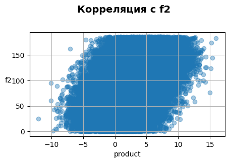
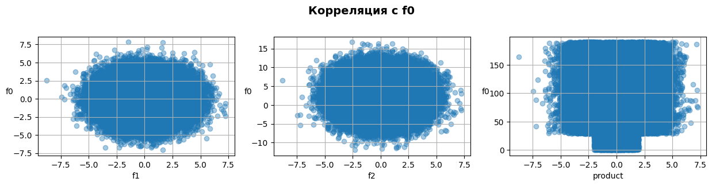

# Выбор локации для скважины

<h1>Содержание<span class='tocSkip'></span></h1>

* [1 Загрузка и подготовка данных](#my_section_1) <a id='content_1'></a>
  * [1.1 Загрузка данных](#my_section_2) <a id='content_2'></a>
  * [1.2 Ознакомление и корректировка](#my_section_3) <a id='content_3'></a>
    * [1.2.1 geo_data_0](#my_section_4) <a id='content_4'></a>
      * [1.2.1.1 Ознакомление](#my_section_5) <a id='content_5'></a>
      * [1.2.1.2 Изучение корреляции данных](#my_section_6) <a id='content_6'></a>
      * [1.2.1.3 Проверка на дубликаты](#my_section_7) <a id='content_7'></a>
      * [1.2.1.4 Изучение выбросов](#my_section_8) <a id='content_8'></a>
    * [1.2.2 geo_data_1](#my_section_9) <a id='content_9'></a>
      * [1.2.2.1 Ознакомление](#my_section_10) <a id='content_10'></a>
      * [1.2.2.2 Изучение корреляции данных](#my_section_11) <a id='content_11'></a>
      * [1.2.2.3 Проверка на дубликаты](#my_section_12) <a id='content_12'></a>
      * [1.2.2.4 Изучение выбросов](#my_section_13) <a id='content_13'></a>
    * [1.2.3 geo_data_2](#my_section_14) <a id='content_14'></a>
      * [1.2.3.1 Ознакомление](#my_section_15) <a id='content_15'></a>
      * [1.2.3.2 Изучение корреляции данных](#my_section_16) <a id='content_16'></a>
      * [1.2.3.3 Проверка на дубликаты](#my_section_17) <a id='content_17'></a>
      * [1.2.3.4 Изучение выбросов](#my_section_18) <a id='content_18'></a>
  * [1.3 Подготовка данных](#my_section_19) <a id='content_19'></a>
    * [1.3.1 geo_data_0](#my_section_20) <a id='content_20'></a>
    * [1.3.2 geo_data_1](#my_section_21) <a id='content_21'></a>
    * [1.3.3 geo_data_2](#my_section_22) <a id='content_22'></a>
  * [1.4 Заключение](#my_section_23) <a id='content_23'></a>
* [2 Обучение и проверка модели](#my_section_24) <a id='content_24'></a>
  * [2.1 geo_data_0](#my_section_25) <a id='content_25'></a>
  * [2.2 geo_data_1](#my_section_26) <a id='content_26'></a>
  * [2.3 geo_data_2](#my_section_27) <a id='content_27'></a>
  * [2.4 Анализ](#my_section_28) <a id='content_28'></a>
    * [2.4.1 Средний запас предсказанного сырья](#my_section_29) <a id='content_29'></a>
    * [2.4.2 RMSE](#my_section_30) <a id='content_30'></a>
  * [2.5 Заключение](#my_section_31) <a id='content_31'></a>
* [3 Подготовка к расчёту прибыли](#my_section_32) <a id='content_32'></a>
  * [3.1 Сохранение ключевых значений](#my_section_33) <a id='content_33'></a>
  * [3.2 Рассчёт безубыточной разработки](#my_section_34) <a id='content_34'></a>
  * [3.3 Определим функцию для рассчёта прибыли](#my_section_35) <a id='content_35'></a>
  * [3.4 Заключение](#my_section_36) <a id='content_36'></a>
* [4 Расчёт прибыли и рисков ](#my_section_37) <a id='content_37'></a>
  * [4.1 Рассчётная часть](#my_section_38) <a id='content_38'></a>
  * [4.2 Заключение](#my_section_39) <a id='content_39'></a>


**Описание проекта:**

Нужно решить, где бурить новую скважину. Предоставлены пробы нефти в трёх регионах. Характеристики для каждой скважины в регионе уже известны. Необходимо построить модель для определения региона, где добыча принесёт наибольшую прибыль. Дополнительно требуется проанализировать возможную прибыль и риски техникой Bootstrap.

**Главная задача:** Решить, где бурить скважину.

**Подзадачи:**
- В избранном регионе собрать характеристики для скважин: качество нефти и объём её запасов;
- Построить модель для предсказания объёма запасов в новых скважинах;
- Выбрать скважины с самыми высокими оценками значений;
- Определить регион с максимальной суммарной прибылью отобранных скважин.

**План работы:**
1. Загрузить и подготовить данные;
2. Обучить и проверить модель для каждого региона;
3. Подготовиться к расчёту прибыли;
4. Написать функцию для расчёта прибыли по выбранным скважинам и предсказаниям модели;
5. Посчитать риски и прибыль для каждого региона.

**Описание данных**

Данные геологоразведки трёх регионов находятся в файлах: 
- geo_data_0.csv 
- geo_data_1.csv
- geo_data_2.csv

*Описание столбцов:*
- id — уникальный идентификатор скважины;
- f0, f1, f2 — три признака точек (неважно, что они означают, но сами признаки значимы);
- product — объём запасов в скважине (тыс. баррелей).

*Заметка:*
1. предполагаемые действия будут обозначены текстом без форматирования;
2. *курсивом* — небольшие выводы и заключения по ячейкам.

<a id='my_section_1'></a>
## [Загрузка и подготовка данных](#content_1)

В этом этапе будет проведена загрузка библиотек и модулей, загрузка и ознакомление с данными, их подготовка. В этап подготовки будет входить разделение данных на выборки и масштабирование при необходимости.

<a id='my_section_2'></a>
### [Загрузка данных](#content_2)

Импортируем библиотеки и модули для  работы


```python
from IPython.display import display

import pandas as pd
from pandas.plotting import scatter_matrix
import numpy as np
from numpy.random import RandomState
import matplotlib.pyplot as plt

from sklearn.linear_model import LinearRegression
from sklearn.model_selection import train_test_split
from sklearn.preprocessing import StandardScaler
from sklearn.metrics import mean_squared_error
```

Определим функцию и загрузим данные


```python
def download_data(name):
    file_path = '/datasets/'
    file_path_2 = 'https://..'
    try:
        data = pd.read_csv(name+'.csv')
        
    except FileNotFoundError:
        try:
            data = pd.read_csv(file_path+name+'.csv')
        except FileNotFoundError:
            data = pd.read_csv(file_path_2+name+'.csv')
        
    except Exception as ex:
        print('Some error', ex)
        
    return data
```


```python
geo_data_0 = download_data('geo_data_0')
geo_data_1 = download_data('geo_data_1')
geo_data_2 = download_data('geo_data_2')
```

*Загрузка проведена без ошибок*

<a id='my_section_3'></a>
### [Ознакомление и корректировка](#content_3)

Получим общую информацию о данных по каждому региону.

<a id='my_section_4'></a>
#### [geo_data_0](#content_4)

<a id='my_section_5'></a>
##### [Ознакомление](#content_5)

Изучим первые строки датафрейма


```python
geo_data_0.head()
```


<div>
<style scoped>
    .dataframe tbody tr th:only-of-type {
        vertical-align: middle;
    }

    .dataframe tbody tr th {
        vertical-align: top;
    }

    .dataframe thead th {
        text-align: right;
    }
</style>
<table border="1" class="dataframe">
  <thead>
    <tr style="text-align: right;">
      <th></th>
      <th>id</th>
      <th>f0</th>
      <th>f1</th>
      <th>f2</th>
      <th>product</th>
    </tr>
  </thead>
  <tbody>
    <tr>
      <th>0</th>
      <td>txEyH</td>
      <td>0.705745</td>
      <td>-0.497823</td>
      <td>1.221170</td>
      <td>105.280062</td>
    </tr>
    <tr>
      <th>1</th>
      <td>2acmU</td>
      <td>1.334711</td>
      <td>-0.340164</td>
      <td>4.365080</td>
      <td>73.037750</td>
    </tr>
    <tr>
      <th>2</th>
      <td>409Wp</td>
      <td>1.022732</td>
      <td>0.151990</td>
      <td>1.419926</td>
      <td>85.265647</td>
    </tr>
    <tr>
      <th>3</th>
      <td>iJLyR</td>
      <td>-0.032172</td>
      <td>0.139033</td>
      <td>2.978566</td>
      <td>168.620776</td>
    </tr>
    <tr>
      <th>4</th>
      <td>Xdl7t</td>
      <td>1.988431</td>
      <td>0.155413</td>
      <td>4.751769</td>
      <td>154.036647</td>
    </tr>
  </tbody>
</table>
</div>


*Заметно, что признаки нуждаются в масштабировании, столбец id носит уникальные параметры.*

Изучим каких типов данных столбцы и наличие пропусков.


```python
geo_data_0.info()
```

    <class 'pandas.core.frame.DataFrame'>
    RangeIndex: 100000 entries, 0 to 99999
    Data columns (total 5 columns):
     #   Column   Non-Null Count   Dtype  
    ---  ------   --------------   -----  
     0   id       100000 non-null  object 
     1   f0       100000 non-null  float64
     2   f1       100000 non-null  float64
     3   f2       100000 non-null  float64
     4   product  100000 non-null  float64
    dtypes: float64(4), object(1)
    memory usage: 3.8+ MB
    

*Пропусков нет, типы данных в порядке.*

<a id='my_section_6'></a>
##### [Изучение корреляции данных](#content_6)


```python
geo_data_0_corr = geo_data_0.corr(numeric_only=True)
geo_data_0_corr
```


<div>
<style scoped>
    .dataframe tbody tr th:only-of-type {
        vertical-align: middle;
    }

    .dataframe tbody tr th {
        vertical-align: top;
    }

    .dataframe thead th {
        text-align: right;
    }
</style>
<table border="1" class="dataframe">
  <thead>
    <tr style="text-align: right;">
      <th></th>
      <th>f0</th>
      <th>f1</th>
      <th>f2</th>
      <th>product</th>
    </tr>
  </thead>
  <tbody>
    <tr>
      <th>f0</th>
      <td>1.000000</td>
      <td>-0.440723</td>
      <td>-0.003153</td>
      <td>0.143536</td>
    </tr>
    <tr>
      <th>f1</th>
      <td>-0.440723</td>
      <td>1.000000</td>
      <td>0.001724</td>
      <td>-0.192356</td>
    </tr>
    <tr>
      <th>f2</th>
      <td>-0.003153</td>
      <td>0.001724</td>
      <td>1.000000</td>
      <td>0.483663</td>
    </tr>
    <tr>
      <th>product</th>
      <td>0.143536</td>
      <td>-0.192356</td>
      <td>0.483663</td>
      <td>1.000000</td>
    </tr>
  </tbody>
</table>
</div>


Вместо использования громоздкой функции `scatter_matrix` определим свою:


```python
def corr_plot(geo_data_0):
    col = geo_data_0.drop(['id'], axis=1).columns
    for i in range(len(col)-1):
        corr_col = col[i+1:]
        fig, ax = plt.subplots(1, len(corr_col), figsize=(len(corr_col)*(1/0.2),3))
        fig.suptitle(f'Корреляция с {col[i]}', fontsize=14, fontweight='bold')
        fig.subplots_adjust(top=0.8)
        for j in range(len(corr_col)):
            if len(corr_col) != 1:
                ax[j].scatter(x=geo_data_0[col[i]], y=geo_data_0[corr_col[j]], alpha=0.4)
                ax[j].grid()
                ax[j].set_ylabel(col[i], rotation=0)
                ax[j].set_xlabel(corr_col[j])
            else:
                ax.scatter(x=geo_data_0[col[i]], y=geo_data_0[corr_col[j]], alpha=0.4)
                ax.grid()
                ax.set_ylabel(col[i], rotation=0)
                ax.set_xlabel(corr_col[j])

   
```


```python
corr_plot(geo_data_0); 
```


    

    


    

    


    

    


*Сильной корреляции признаков не наблюдается.*

<a id='my_section_7'></a>
##### [Проверка на дубликаты](#content_7)

Пройдемся по каждому столбцу для поиска дубликатов, определим функцию.


```python
def some_dub(geo_data_0):
    for el in geo_data_0.columns:
        some_dub = geo_data_0.loc[:, el].duplicated().sum()
        if some_dub > 0:
            print(f'В столбце {el} — {some_dub} дубликат(а/ов)')
```


```python
some_dub(geo_data_0)
```

    В столбце id — 10 дубликат(а/ов)
    

*Существовала вероятность, что дубликаты будут и в остальных столбцах, роль могла сыграть случайность, однако, дубликаты обнаружены только в столбце с уникальным идентификатором.*

Данных не много, попробуем разобраться в их природе


```python
def split_dup(geo_data_0, col='id', to=6, step=2):   
    dup = geo_data_0.loc[geo_data_0[col].duplicated(), :][col]
    for el in dup[:to:step]:
        display(geo_data_0.loc[geo_data_0[col] == el, :].head(5))
    return dup
```


```python
dup = split_dup(geo_data_0) 
```


<div>
<style scoped>
    .dataframe tbody tr th:only-of-type {
        vertical-align: middle;
    }

    .dataframe tbody tr th {
        vertical-align: top;
    }

    .dataframe thead th {
        text-align: right;
    }
</style>
<table border="1" class="dataframe">
  <thead>
    <tr style="text-align: right;">
      <th></th>
      <th>id</th>
      <th>f0</th>
      <th>f1</th>
      <th>f2</th>
      <th>product</th>
    </tr>
  </thead>
  <tbody>
    <tr>
      <th>931</th>
      <td>HZww2</td>
      <td>0.755284</td>
      <td>0.368511</td>
      <td>1.863211</td>
      <td>30.681774</td>
    </tr>
    <tr>
      <th>7530</th>
      <td>HZww2</td>
      <td>1.061194</td>
      <td>-0.373969</td>
      <td>10.430210</td>
      <td>158.828695</td>
    </tr>
  </tbody>
</table>
</div>


<div>
<style scoped>
    .dataframe tbody tr th:only-of-type {
        vertical-align: middle;
    }

    .dataframe tbody tr th {
        vertical-align: top;
    }

    .dataframe thead th {
        text-align: right;
    }
</style>
<table border="1" class="dataframe">
  <thead>
    <tr style="text-align: right;">
      <th></th>
      <th>id</th>
      <th>f0</th>
      <th>f1</th>
      <th>f2</th>
      <th>product</th>
    </tr>
  </thead>
  <tbody>
    <tr>
      <th>3389</th>
      <td>A5aEY</td>
      <td>-0.039949</td>
      <td>0.156872</td>
      <td>0.209861</td>
      <td>89.249364</td>
    </tr>
    <tr>
      <th>51970</th>
      <td>A5aEY</td>
      <td>-0.180335</td>
      <td>0.935548</td>
      <td>-2.094773</td>
      <td>33.020205</td>
    </tr>
  </tbody>
</table>
</div>


<div>
<style scoped>
    .dataframe tbody tr th:only-of-type {
        vertical-align: middle;
    }

    .dataframe tbody tr th {
        vertical-align: top;
    }

    .dataframe thead th {
        text-align: right;
    }
</style>
<table border="1" class="dataframe">
  <thead>
    <tr style="text-align: right;">
      <th></th>
      <th>id</th>
      <th>f0</th>
      <th>f1</th>
      <th>f2</th>
      <th>product</th>
    </tr>
  </thead>
  <tbody>
    <tr>
      <th>64022</th>
      <td>74z30</td>
      <td>0.741456</td>
      <td>0.459229</td>
      <td>5.153109</td>
      <td>140.771492</td>
    </tr>
    <tr>
      <th>66136</th>
      <td>74z30</td>
      <td>1.084962</td>
      <td>-0.312358</td>
      <td>6.990771</td>
      <td>127.643327</td>
    </tr>
  </tbody>
</table>
</div>


*Предположительно, данные корректны за исключением столбца `id`(вероятно, что допущена ошибка в присвоении уникального идентификатора), дальнейшая обработка предполагает избавление от этого столбца с сохранением индекса позиций для возможности их дальнейшего восстановления. Предполагаем, что оставить дубликаты с сохранением информации об этом для уточнения у заказчика будет корректно. Ведь качество модели машинного обучения не будет зависить от столбца `id`, а только от остальных признаков.*


```python
geo_data_0_duplicates_id = geo_data_0.query('id in @dup').sort_values(by='id', ascending=False)
```

<a id='my_section_8'></a>
##### [Изучение выбросов](#content_8)

Получим общее представление о данных, используя метод `describe`


```python
geo_data_0.describe()
```


<div>
<style scoped>
    .dataframe tbody tr th:only-of-type {
        vertical-align: middle;
    }

    .dataframe tbody tr th {
        vertical-align: top;
    }

    .dataframe thead th {
        text-align: right;
    }
</style>
<table border="1" class="dataframe">
  <thead>
    <tr style="text-align: right;">
      <th></th>
      <th>f0</th>
      <th>f1</th>
      <th>f2</th>
      <th>product</th>
    </tr>
  </thead>
  <tbody>
    <tr>
      <th>count</th>
      <td>100000.000000</td>
      <td>100000.000000</td>
      <td>100000.000000</td>
      <td>100000.000000</td>
    </tr>
    <tr>
      <th>mean</th>
      <td>0.500419</td>
      <td>0.250143</td>
      <td>2.502647</td>
      <td>92.500000</td>
    </tr>
    <tr>
      <th>std</th>
      <td>0.871832</td>
      <td>0.504433</td>
      <td>3.248248</td>
      <td>44.288691</td>
    </tr>
    <tr>
      <th>min</th>
      <td>-1.408605</td>
      <td>-0.848218</td>
      <td>-12.088328</td>
      <td>0.000000</td>
    </tr>
    <tr>
      <th>25%</th>
      <td>-0.072580</td>
      <td>-0.200881</td>
      <td>0.287748</td>
      <td>56.497507</td>
    </tr>
    <tr>
      <th>50%</th>
      <td>0.502360</td>
      <td>0.250252</td>
      <td>2.515969</td>
      <td>91.849972</td>
    </tr>
    <tr>
      <th>75%</th>
      <td>1.073581</td>
      <td>0.700646</td>
      <td>4.715088</td>
      <td>128.564089</td>
    </tr>
    <tr>
      <th>max</th>
      <td>2.362331</td>
      <td>1.343769</td>
      <td>16.003790</td>
      <td>185.364347</td>
    </tr>
  </tbody>
</table>
</div>


Визуализируем данные методом `boxplot`


```python
def overview_borders(geo_data_0): 
    moustache = {}
    # Построение смежных графиков
    fig, ax = plt.subplots(2, 2, figsize=(10,8))
    fig.suptitle('Ящики с усами', fontsize=14, fontweight='bold')
    fig.subplots_adjust(top=0.9)
    col = {'f0':[0,0], 'f1':[0,1], 'f2':[1,0], 'product':[1,1]}
    # Установка параметров
    for key, val in col.items():
        x = val[0]
        y = val[1]
        name = key
        b = ax[x, y].boxplot(geo_data_0[name])
        # Выделение крайних усов боксплота
        moustache[key] = [item.get_ydata()[1] for item in b['whiskers']]
        ax[x, y].grid()
        ax[x, y].set_title(name)
        ax[x, y].tick_params('x', labelrotation = 0)
        #ax[0, 0].set_xlabel('f0')
        ax[x, y].set_ylabel('Значимые признаки')
    return moustache
```


```python
moustache_0 = overview_borders(geo_data_0)
```


    

    


Изучим границы усов


```python
moustache_0
```


    {'f0': [-1.408605306026996, 2.362330810854224],
     'f1': [-0.8482184970082173, 1.343769333804496],
     'f2': [-6.352956245317204, 11.353803862227108],
     'product': [0.0, 185.3643474222929]}


Определим функцию для корректировки датасета


```python
def make_limit(geo_data_0):
    for key, val in moustache_0.items():
        geo_data_0 =\
        geo_data_0.loc[(geo_data_0[key] >= val[0]) & (geo_data_0[key] <= val[1]), :]
        
    return geo_data_0
```

*Проводить корректировку значений будет не правильно, если мы хотим отобрать самые удачные скважины. Функцию оставим на случай корректировок. Наиболее удачная корректировка может быть по нижней границе столбца `product`, но выбросов там не наблюдается.*

<a id='my_section_9'></a>
#### [geo_data_1](#content_9)

<a id='my_section_10'></a>
##### [Ознакомление](#content_10)

Изучим первые строки датафрейма


```python
geo_data_1.head()
```


<div>
<style scoped>
    .dataframe tbody tr th:only-of-type {
        vertical-align: middle;
    }

    .dataframe tbody tr th {
        vertical-align: top;
    }

    .dataframe thead th {
        text-align: right;
    }
</style>
<table border="1" class="dataframe">
  <thead>
    <tr style="text-align: right;">
      <th></th>
      <th>id</th>
      <th>f0</th>
      <th>f1</th>
      <th>f2</th>
      <th>product</th>
    </tr>
  </thead>
  <tbody>
    <tr>
      <th>0</th>
      <td>kBEdx</td>
      <td>-15.001348</td>
      <td>-8.276000</td>
      <td>-0.005876</td>
      <td>3.179103</td>
    </tr>
    <tr>
      <th>1</th>
      <td>62mP7</td>
      <td>14.272088</td>
      <td>-3.475083</td>
      <td>0.999183</td>
      <td>26.953261</td>
    </tr>
    <tr>
      <th>2</th>
      <td>vyE1P</td>
      <td>6.263187</td>
      <td>-5.948386</td>
      <td>5.001160</td>
      <td>134.766305</td>
    </tr>
    <tr>
      <th>3</th>
      <td>KcrkZ</td>
      <td>-13.081196</td>
      <td>-11.506057</td>
      <td>4.999415</td>
      <td>137.945408</td>
    </tr>
    <tr>
      <th>4</th>
      <td>AHL4O</td>
      <td>12.702195</td>
      <td>-8.147433</td>
      <td>5.004363</td>
      <td>134.766305</td>
    </tr>
  </tbody>
</table>
</div>


*Заметно, что признаки нуждаются в масштабировании, столбец id носит уникальные параметры.*

Изучим каких типов данных столбцы и наличие пропусков.


```python
geo_data_1.info()
```

    <class 'pandas.core.frame.DataFrame'>
    RangeIndex: 100000 entries, 0 to 99999
    Data columns (total 5 columns):
     #   Column   Non-Null Count   Dtype  
    ---  ------   --------------   -----  
     0   id       100000 non-null  object 
     1   f0       100000 non-null  float64
     2   f1       100000 non-null  float64
     3   f2       100000 non-null  float64
     4   product  100000 non-null  float64
    dtypes: float64(4), object(1)
    memory usage: 3.8+ MB
    

*Пропусков нет, типы данных в порядке.*

<a id='my_section_11'></a>
##### [Изучение корреляции данных](#content_11)


```python
geo_data_1_corr = geo_data_1.corr(numeric_only=True)
geo_data_1_corr
```


<div>
<style scoped>
    .dataframe tbody tr th:only-of-type {
        vertical-align: middle;
    }

    .dataframe tbody tr th {
        vertical-align: top;
    }

    .dataframe thead th {
        text-align: right;
    }
</style>
<table border="1" class="dataframe">
  <thead>
    <tr style="text-align: right;">
      <th></th>
      <th>f0</th>
      <th>f1</th>
      <th>f2</th>
      <th>product</th>
    </tr>
  </thead>
  <tbody>
    <tr>
      <th>f0</th>
      <td>1.000000</td>
      <td>0.182287</td>
      <td>-0.001777</td>
      <td>-0.030491</td>
    </tr>
    <tr>
      <th>f1</th>
      <td>0.182287</td>
      <td>1.000000</td>
      <td>-0.002595</td>
      <td>-0.010155</td>
    </tr>
    <tr>
      <th>f2</th>
      <td>-0.001777</td>
      <td>-0.002595</td>
      <td>1.000000</td>
      <td>0.999397</td>
    </tr>
    <tr>
      <th>product</th>
      <td>-0.030491</td>
      <td>-0.010155</td>
      <td>0.999397</td>
      <td>1.000000</td>
    </tr>
  </tbody>
</table>
</div>


```python
corr_plot(geo_data_1); 
```


    

    


    

    


    

    


*Сильной корреляции признаков не наблюдается. Данные выглядят подозрительно, относительно региона 1.*

<a id='my_section_12'></a>
##### [Проверка на дубликаты](#content_12)

Обнаружим дубликаты по каждому столбцу таблицы, используем определённую функцию `some_dub`


```python
some_dub(geo_data_1)
```

    В столбце id — 4 дубликат(а/ов)
    В столбце product — 99988 дубликат(а/ов)
    

**Столбец id**

Изучим природу дубликатов в столбце `id`.


```python
dup = split_dup(geo_data_1, to=4,step=1) 
```


<div>
<style scoped>
    .dataframe tbody tr th:only-of-type {
        vertical-align: middle;
    }

    .dataframe tbody tr th {
        vertical-align: top;
    }

    .dataframe thead th {
        text-align: right;
    }
</style>
<table border="1" class="dataframe">
  <thead>
    <tr style="text-align: right;">
      <th></th>
      <th>id</th>
      <th>f0</th>
      <th>f1</th>
      <th>f2</th>
      <th>product</th>
    </tr>
  </thead>
  <tbody>
    <tr>
      <th>1305</th>
      <td>LHZR0</td>
      <td>11.170835</td>
      <td>-1.945066</td>
      <td>3.002872</td>
      <td>80.859783</td>
    </tr>
    <tr>
      <th>41906</th>
      <td>LHZR0</td>
      <td>-8.989672</td>
      <td>-4.286607</td>
      <td>2.009139</td>
      <td>57.085625</td>
    </tr>
  </tbody>
</table>
</div>


<div>
<style scoped>
    .dataframe tbody tr th:only-of-type {
        vertical-align: middle;
    }

    .dataframe tbody tr th {
        vertical-align: top;
    }

    .dataframe thead th {
        text-align: right;
    }
</style>
<table border="1" class="dataframe">
  <thead>
    <tr style="text-align: right;">
      <th></th>
      <th>id</th>
      <th>f0</th>
      <th>f1</th>
      <th>f2</th>
      <th>product</th>
    </tr>
  </thead>
  <tbody>
    <tr>
      <th>2721</th>
      <td>bfPNe</td>
      <td>-9.494442</td>
      <td>-5.463692</td>
      <td>4.006042</td>
      <td>110.992147</td>
    </tr>
    <tr>
      <th>82178</th>
      <td>bfPNe</td>
      <td>-6.202799</td>
      <td>-4.820045</td>
      <td>2.995107</td>
      <td>84.038886</td>
    </tr>
  </tbody>
</table>
</div>


<div>
<style scoped>
    .dataframe tbody tr th:only-of-type {
        vertical-align: middle;
    }

    .dataframe tbody tr th {
        vertical-align: top;
    }

    .dataframe thead th {
        text-align: right;
    }
</style>
<table border="1" class="dataframe">
  <thead>
    <tr style="text-align: right;">
      <th></th>
      <th>id</th>
      <th>f0</th>
      <th>f1</th>
      <th>f2</th>
      <th>product</th>
    </tr>
  </thead>
  <tbody>
    <tr>
      <th>47591</th>
      <td>wt4Uk</td>
      <td>-9.091098</td>
      <td>-8.109279</td>
      <td>-0.002314</td>
      <td>3.179103</td>
    </tr>
    <tr>
      <th>82873</th>
      <td>wt4Uk</td>
      <td>10.259972</td>
      <td>-9.376355</td>
      <td>4.994297</td>
      <td>134.766305</td>
    </tr>
  </tbody>
</table>
</div>


<div>
<style scoped>
    .dataframe tbody tr th:only-of-type {
        vertical-align: middle;
    }

    .dataframe tbody tr th {
        vertical-align: top;
    }

    .dataframe thead th {
        text-align: right;
    }
</style>
<table border="1" class="dataframe">
  <thead>
    <tr style="text-align: right;">
      <th></th>
      <th>id</th>
      <th>f0</th>
      <th>f1</th>
      <th>f2</th>
      <th>product</th>
    </tr>
  </thead>
  <tbody>
    <tr>
      <th>5849</th>
      <td>5ltQ6</td>
      <td>-3.435401</td>
      <td>-12.296043</td>
      <td>1.999796</td>
      <td>57.085625</td>
    </tr>
    <tr>
      <th>84461</th>
      <td>5ltQ6</td>
      <td>18.213839</td>
      <td>2.191999</td>
      <td>3.993869</td>
      <td>107.813044</td>
    </tr>
  </tbody>
</table>
</div>


*Предполагаем, что оставить дубликаты с сохранением информации об этом для уточнения у заказчика будет корректно. Ведь качество модели машинного обучения не будет зависить от столбца id, а только от остальных признаков.*


```python
geo_data_1_duplicates_id = geo_data_1.query('id in @dup').sort_values(by='id', ascending=False)
```

**Столбец product**

Проверим что произойдёт, если избавиться от дубликатов в столбце `product`


```python
geo_data_1.drop_duplicates(subset='product').shape
```


    (12, 5)


*Из 10000 значений останется только 12 строк. Это значит что данные по региону разбиты на группы.*

Проведём обзор полученных значений


```python
geo_data_1.drop_duplicates(subset='product')
```


<div>
<style scoped>
    .dataframe tbody tr th:only-of-type {
        vertical-align: middle;
    }

    .dataframe tbody tr th {
        vertical-align: top;
    }

    .dataframe thead th {
        text-align: right;
    }
</style>
<table border="1" class="dataframe">
  <thead>
    <tr style="text-align: right;">
      <th></th>
      <th>id</th>
      <th>f0</th>
      <th>f1</th>
      <th>f2</th>
      <th>product</th>
    </tr>
  </thead>
  <tbody>
    <tr>
      <th>0</th>
      <td>kBEdx</td>
      <td>-15.001348</td>
      <td>-8.276000</td>
      <td>-0.005876</td>
      <td>3.179103</td>
    </tr>
    <tr>
      <th>1</th>
      <td>62mP7</td>
      <td>14.272088</td>
      <td>-3.475083</td>
      <td>0.999183</td>
      <td>26.953261</td>
    </tr>
    <tr>
      <th>2</th>
      <td>vyE1P</td>
      <td>6.263187</td>
      <td>-5.948386</td>
      <td>5.001160</td>
      <td>134.766305</td>
    </tr>
    <tr>
      <th>3</th>
      <td>KcrkZ</td>
      <td>-13.081196</td>
      <td>-11.506057</td>
      <td>4.999415</td>
      <td>137.945408</td>
    </tr>
    <tr>
      <th>5</th>
      <td>HHckp</td>
      <td>-3.327590</td>
      <td>-2.205276</td>
      <td>3.003647</td>
      <td>84.038886</td>
    </tr>
    <tr>
      <th>6</th>
      <td>h5Ujo</td>
      <td>-11.142655</td>
      <td>-10.133399</td>
      <td>4.002382</td>
      <td>110.992147</td>
    </tr>
    <tr>
      <th>7</th>
      <td>muH9x</td>
      <td>4.234715</td>
      <td>-0.001354</td>
      <td>2.004588</td>
      <td>53.906522</td>
    </tr>
    <tr>
      <th>11</th>
      <td>OXyvW</td>
      <td>16.320755</td>
      <td>-0.562946</td>
      <td>-0.001783</td>
      <td>0.000000</td>
    </tr>
    <tr>
      <th>12</th>
      <td>cB8re</td>
      <td>7.736313</td>
      <td>-6.093374</td>
      <td>3.982531</td>
      <td>107.813044</td>
    </tr>
    <tr>
      <th>25</th>
      <td>AOrbK</td>
      <td>2.338888</td>
      <td>-8.508383</td>
      <td>2.008130</td>
      <td>57.085625</td>
    </tr>
    <tr>
      <th>34</th>
      <td>5O3Zt</td>
      <td>-4.792992</td>
      <td>-7.569682</td>
      <td>1.004281</td>
      <td>30.132364</td>
    </tr>
    <tr>
      <th>36</th>
      <td>aArVp</td>
      <td>5.897063</td>
      <td>-5.249982</td>
      <td>2.994434</td>
      <td>80.859783</td>
    </tr>
  </tbody>
</table>
</div>


Посчитаем количество строк для определённого значения в колонке `product`.


```python
geo_data_1['product'].value_counts()
```


    product
    53.906522     8472
    26.953261     8468
    84.038886     8431
    57.085625     8390
    3.179103      8337
    80.859783     8320
    30.132364     8306
    134.766305    8304
    110.992147    8303
    0.000000      8235
    137.945408    8233
    107.813044    8201
    Name: count, dtype: int64


*Если `id` — это уникальный идентификатор скважины, выходит, что в регионе 12 крупных месторождений, куда ведут около 8300 скважин в каждое, либо в данных ошибка.*

Изучим какие значения встречаются в группах для остальных признаков.


```python
split_dup(geo_data_1, col='product', to=2,step=1); 
```


<div>
<style scoped>
    .dataframe tbody tr th:only-of-type {
        vertical-align: middle;
    }

    .dataframe tbody tr th {
        vertical-align: top;
    }

    .dataframe thead th {
        text-align: right;
    }
</style>
<table border="1" class="dataframe">
  <thead>
    <tr style="text-align: right;">
      <th></th>
      <th>id</th>
      <th>f0</th>
      <th>f1</th>
      <th>f2</th>
      <th>product</th>
    </tr>
  </thead>
  <tbody>
    <tr>
      <th>2</th>
      <td>vyE1P</td>
      <td>6.263187</td>
      <td>-5.948386</td>
      <td>5.001160</td>
      <td>134.766305</td>
    </tr>
    <tr>
      <th>4</th>
      <td>AHL4O</td>
      <td>12.702195</td>
      <td>-8.147433</td>
      <td>5.004363</td>
      <td>134.766305</td>
    </tr>
    <tr>
      <th>8</th>
      <td>YiRkx</td>
      <td>13.355129</td>
      <td>-0.332068</td>
      <td>4.998647</td>
      <td>134.766305</td>
    </tr>
    <tr>
      <th>17</th>
      <td>gIqzq</td>
      <td>8.900460</td>
      <td>-5.632857</td>
      <td>4.994324</td>
      <td>134.766305</td>
    </tr>
    <tr>
      <th>21</th>
      <td>eVFPS</td>
      <td>2.195392</td>
      <td>-3.829295</td>
      <td>4.993895</td>
      <td>134.766305</td>
    </tr>
  </tbody>
</table>
</div>


<div>
<style scoped>
    .dataframe tbody tr th:only-of-type {
        vertical-align: middle;
    }

    .dataframe tbody tr th {
        vertical-align: top;
    }

    .dataframe thead th {
        text-align: right;
    }
</style>
<table border="1" class="dataframe">
  <thead>
    <tr style="text-align: right;">
      <th></th>
      <th>id</th>
      <th>f0</th>
      <th>f1</th>
      <th>f2</th>
      <th>product</th>
    </tr>
  </thead>
  <tbody>
    <tr>
      <th>2</th>
      <td>vyE1P</td>
      <td>6.263187</td>
      <td>-5.948386</td>
      <td>5.001160</td>
      <td>134.766305</td>
    </tr>
    <tr>
      <th>4</th>
      <td>AHL4O</td>
      <td>12.702195</td>
      <td>-8.147433</td>
      <td>5.004363</td>
      <td>134.766305</td>
    </tr>
    <tr>
      <th>8</th>
      <td>YiRkx</td>
      <td>13.355129</td>
      <td>-0.332068</td>
      <td>4.998647</td>
      <td>134.766305</td>
    </tr>
    <tr>
      <th>17</th>
      <td>gIqzq</td>
      <td>8.900460</td>
      <td>-5.632857</td>
      <td>4.994324</td>
      <td>134.766305</td>
    </tr>
    <tr>
      <th>21</th>
      <td>eVFPS</td>
      <td>2.195392</td>
      <td>-3.829295</td>
      <td>4.993895</td>
      <td>134.766305</td>
    </tr>
  </tbody>
</table>
</div>


*Лучшим вариантом будет оставить данные как есть. Следующим этапом нужно уведомить ответственное лицо о проблеме. В случае подгрузки корректной информации дальнейшие наработки примут правильный вид, но исследование придётся дорабатывать.*

<a id='my_section_13'></a>
##### [Изучение выбросов](#content_13)

Получим общее представление о данных, используя метод `describe`


```python
geo_data_1.describe()
```


<div>
<style scoped>
    .dataframe tbody tr th:only-of-type {
        vertical-align: middle;
    }

    .dataframe tbody tr th {
        vertical-align: top;
    }

    .dataframe thead th {
        text-align: right;
    }
</style>
<table border="1" class="dataframe">
  <thead>
    <tr style="text-align: right;">
      <th></th>
      <th>f0</th>
      <th>f1</th>
      <th>f2</th>
      <th>product</th>
    </tr>
  </thead>
  <tbody>
    <tr>
      <th>count</th>
      <td>100000.000000</td>
      <td>100000.000000</td>
      <td>100000.000000</td>
      <td>100000.000000</td>
    </tr>
    <tr>
      <th>mean</th>
      <td>1.141296</td>
      <td>-4.796579</td>
      <td>2.494541</td>
      <td>68.825000</td>
    </tr>
    <tr>
      <th>std</th>
      <td>8.965932</td>
      <td>5.119872</td>
      <td>1.703572</td>
      <td>45.944423</td>
    </tr>
    <tr>
      <th>min</th>
      <td>-31.609576</td>
      <td>-26.358598</td>
      <td>-0.018144</td>
      <td>0.000000</td>
    </tr>
    <tr>
      <th>25%</th>
      <td>-6.298551</td>
      <td>-8.267985</td>
      <td>1.000021</td>
      <td>26.953261</td>
    </tr>
    <tr>
      <th>50%</th>
      <td>1.153055</td>
      <td>-4.813172</td>
      <td>2.011479</td>
      <td>57.085625</td>
    </tr>
    <tr>
      <th>75%</th>
      <td>8.621015</td>
      <td>-1.332816</td>
      <td>3.999904</td>
      <td>107.813044</td>
    </tr>
    <tr>
      <th>max</th>
      <td>29.421755</td>
      <td>18.734063</td>
      <td>5.019721</td>
      <td>137.945408</td>
    </tr>
  </tbody>
</table>
</div>


Визуализируем данные методом `boxplot`


```python
moustache_1 = overview_borders(geo_data_1)
```


    

    


Изучим границы усов


```python
moustache_1
```


    {'f0': [-27.829616136400016, 29.42175461390372],
     'f1': [-18.66777679200792, 9.05068813075942],
     'f2': [-0.0181440867134202, 5.019720555223062],
     'product': [0.0, 137.94540774090564]}


*Проводить корректировку значений будет не правильно, если мы хотим отобрать самые удачные скважины. Наиболее удачная корректировка может быть по нижней границе столбца `product`, но выбросов там не наблюдается.*

<a id='my_section_14'></a>
#### [geo_data_2](#content_14)

<a id='my_section_15'></a>
##### [Ознакомление](#content_15)

Изучим первые строки датафрейма


```python
geo_data_2.head()
```


<div>
<style scoped>
    .dataframe tbody tr th:only-of-type {
        vertical-align: middle;
    }

    .dataframe tbody tr th {
        vertical-align: top;
    }

    .dataframe thead th {
        text-align: right;
    }
</style>
<table border="1" class="dataframe">
  <thead>
    <tr style="text-align: right;">
      <th></th>
      <th>id</th>
      <th>f0</th>
      <th>f1</th>
      <th>f2</th>
      <th>product</th>
    </tr>
  </thead>
  <tbody>
    <tr>
      <th>0</th>
      <td>fwXo0</td>
      <td>-1.146987</td>
      <td>0.963328</td>
      <td>-0.828965</td>
      <td>27.758673</td>
    </tr>
    <tr>
      <th>1</th>
      <td>WJtFt</td>
      <td>0.262778</td>
      <td>0.269839</td>
      <td>-2.530187</td>
      <td>56.069697</td>
    </tr>
    <tr>
      <th>2</th>
      <td>ovLUW</td>
      <td>0.194587</td>
      <td>0.289035</td>
      <td>-5.586433</td>
      <td>62.871910</td>
    </tr>
    <tr>
      <th>3</th>
      <td>q6cA6</td>
      <td>2.236060</td>
      <td>-0.553760</td>
      <td>0.930038</td>
      <td>114.572842</td>
    </tr>
    <tr>
      <th>4</th>
      <td>WPMUX</td>
      <td>-0.515993</td>
      <td>1.716266</td>
      <td>5.899011</td>
      <td>149.600746</td>
    </tr>
  </tbody>
</table>
</div>


*Заметно, что признаки нуждаются в масштабировании, столбец id носит уникальные параметры.*

Изучим каких типов данных столбцы и наличие пропусков.


```python
geo_data_2.info()
```

    <class 'pandas.core.frame.DataFrame'>
    RangeIndex: 100000 entries, 0 to 99999
    Data columns (total 5 columns):
     #   Column   Non-Null Count   Dtype  
    ---  ------   --------------   -----  
     0   id       100000 non-null  object 
     1   f0       100000 non-null  float64
     2   f1       100000 non-null  float64
     3   f2       100000 non-null  float64
     4   product  100000 non-null  float64
    dtypes: float64(4), object(1)
    memory usage: 3.8+ MB
    

*Пропусков нет, типы данных в порядке.*

<a id='my_section_16'></a>
##### [Изучение корреляции данных](#content_16)


```python
geo_data_2_corr = geo_data_2.corr(numeric_only=True)
geo_data_2_corr
```


<div>
<style scoped>
    .dataframe tbody tr th:only-of-type {
        vertical-align: middle;
    }

    .dataframe tbody tr th {
        vertical-align: top;
    }

    .dataframe thead th {
        text-align: right;
    }
</style>
<table border="1" class="dataframe">
  <thead>
    <tr style="text-align: right;">
      <th></th>
      <th>f0</th>
      <th>f1</th>
      <th>f2</th>
      <th>product</th>
    </tr>
  </thead>
  <tbody>
    <tr>
      <th>f0</th>
      <td>1.000000</td>
      <td>0.000528</td>
      <td>-0.000448</td>
      <td>-0.001987</td>
    </tr>
    <tr>
      <th>f1</th>
      <td>0.000528</td>
      <td>1.000000</td>
      <td>0.000779</td>
      <td>-0.001012</td>
    </tr>
    <tr>
      <th>f2</th>
      <td>-0.000448</td>
      <td>0.000779</td>
      <td>1.000000</td>
      <td>0.445871</td>
    </tr>
    <tr>
      <th>product</th>
      <td>-0.001987</td>
      <td>-0.001012</td>
      <td>0.445871</td>
      <td>1.000000</td>
    </tr>
  </tbody>
</table>
</div>


```python
corr_plot(geo_data_2); 
```


    

    


    

    


    

    


*Сильной корреляции признаков не наблюдается.*

<a id='my_section_17'></a>
##### [Проверка на дубликаты](#content_17)

Обнаружим дубликаты по каждому столбцу таблицы, используем определённую функцию `some_dub`


```python
some_dub(geo_data_2)
```

    В столбце id — 4 дубликат(а/ов)
    

Изучим природу дубликатов в столбце `id`.


```python
dup = split_dup(geo_data_2, to=4,step=1) 
```


<div>
<style scoped>
    .dataframe tbody tr th:only-of-type {
        vertical-align: middle;
    }

    .dataframe tbody tr th {
        vertical-align: top;
    }

    .dataframe thead th {
        text-align: right;
    }
</style>
<table border="1" class="dataframe">
  <thead>
    <tr style="text-align: right;">
      <th></th>
      <th>id</th>
      <th>f0</th>
      <th>f1</th>
      <th>f2</th>
      <th>product</th>
    </tr>
  </thead>
  <tbody>
    <tr>
      <th>28039</th>
      <td>xCHr8</td>
      <td>1.633027</td>
      <td>0.368135</td>
      <td>-2.378367</td>
      <td>6.120525</td>
    </tr>
    <tr>
      <th>43233</th>
      <td>xCHr8</td>
      <td>-0.847066</td>
      <td>2.101796</td>
      <td>5.597130</td>
      <td>184.388641</td>
    </tr>
  </tbody>
</table>
</div>


<div>
<style scoped>
    .dataframe tbody tr th:only-of-type {
        vertical-align: middle;
    }

    .dataframe tbody tr th {
        vertical-align: top;
    }

    .dataframe thead th {
        text-align: right;
    }
</style>
<table border="1" class="dataframe">
  <thead>
    <tr style="text-align: right;">
      <th></th>
      <th>id</th>
      <th>f0</th>
      <th>f1</th>
      <th>f2</th>
      <th>product</th>
    </tr>
  </thead>
  <tbody>
    <tr>
      <th>11449</th>
      <td>VF7Jo</td>
      <td>2.122656</td>
      <td>-0.858275</td>
      <td>5.746001</td>
      <td>181.716817</td>
    </tr>
    <tr>
      <th>49564</th>
      <td>VF7Jo</td>
      <td>-0.883115</td>
      <td>0.560537</td>
      <td>0.723601</td>
      <td>136.233420</td>
    </tr>
  </tbody>
</table>
</div>


<div>
<style scoped>
    .dataframe tbody tr th:only-of-type {
        vertical-align: middle;
    }

    .dataframe tbody tr th {
        vertical-align: top;
    }

    .dataframe thead th {
        text-align: right;
    }
</style>
<table border="1" class="dataframe">
  <thead>
    <tr style="text-align: right;">
      <th></th>
      <th>id</th>
      <th>f0</th>
      <th>f1</th>
      <th>f2</th>
      <th>product</th>
    </tr>
  </thead>
  <tbody>
    <tr>
      <th>45404</th>
      <td>KUPhW</td>
      <td>0.231846</td>
      <td>-1.698941</td>
      <td>4.990775</td>
      <td>11.716299</td>
    </tr>
    <tr>
      <th>55967</th>
      <td>KUPhW</td>
      <td>1.211150</td>
      <td>3.176408</td>
      <td>5.543540</td>
      <td>132.831802</td>
    </tr>
  </tbody>
</table>
</div>


<div>
<style scoped>
    .dataframe tbody tr th:only-of-type {
        vertical-align: middle;
    }

    .dataframe tbody tr th {
        vertical-align: top;
    }

    .dataframe thead th {
        text-align: right;
    }
</style>
<table border="1" class="dataframe">
  <thead>
    <tr style="text-align: right;">
      <th></th>
      <th>id</th>
      <th>f0</th>
      <th>f1</th>
      <th>f2</th>
      <th>product</th>
    </tr>
  </thead>
  <tbody>
    <tr>
      <th>44378</th>
      <td>Vcm5J</td>
      <td>-1.229484</td>
      <td>-2.439204</td>
      <td>1.222909</td>
      <td>137.968290</td>
    </tr>
    <tr>
      <th>95090</th>
      <td>Vcm5J</td>
      <td>2.587702</td>
      <td>1.986875</td>
      <td>2.482245</td>
      <td>92.327572</td>
    </tr>
  </tbody>
</table>
</div>


*Предполагаем, что оставить дубликаты с сохранением информации об этом для уточнения у заказчика будет корректно. Ведь качество модели машинного обучения не будет зависить от столбца id, а только от остальных признаков.*


```python
geo_data_2_duplicates_id = geo_data_2.query('id in @dup').sort_values(by='id', ascending=False)
```

<a id='my_section_18'></a>
##### [Изучение выбросов](#content_18)

Получим общее представление о данных, используя метод `describe`


```python
geo_data_2.describe()
```


<div>
<style scoped>
    .dataframe tbody tr th:only-of-type {
        vertical-align: middle;
    }

    .dataframe tbody tr th {
        vertical-align: top;
    }

    .dataframe thead th {
        text-align: right;
    }
</style>
<table border="1" class="dataframe">
  <thead>
    <tr style="text-align: right;">
      <th></th>
      <th>f0</th>
      <th>f1</th>
      <th>f2</th>
      <th>product</th>
    </tr>
  </thead>
  <tbody>
    <tr>
      <th>count</th>
      <td>100000.000000</td>
      <td>100000.000000</td>
      <td>100000.000000</td>
      <td>100000.000000</td>
    </tr>
    <tr>
      <th>mean</th>
      <td>0.002023</td>
      <td>-0.002081</td>
      <td>2.495128</td>
      <td>95.000000</td>
    </tr>
    <tr>
      <th>std</th>
      <td>1.732045</td>
      <td>1.730417</td>
      <td>3.473445</td>
      <td>44.749921</td>
    </tr>
    <tr>
      <th>min</th>
      <td>-8.760004</td>
      <td>-7.084020</td>
      <td>-11.970335</td>
      <td>0.000000</td>
    </tr>
    <tr>
      <th>25%</th>
      <td>-1.162288</td>
      <td>-1.174820</td>
      <td>0.130359</td>
      <td>59.450441</td>
    </tr>
    <tr>
      <th>50%</th>
      <td>0.009424</td>
      <td>-0.009482</td>
      <td>2.484236</td>
      <td>94.925613</td>
    </tr>
    <tr>
      <th>75%</th>
      <td>1.158535</td>
      <td>1.163678</td>
      <td>4.858794</td>
      <td>130.595027</td>
    </tr>
    <tr>
      <th>max</th>
      <td>7.238262</td>
      <td>7.844801</td>
      <td>16.739402</td>
      <td>190.029838</td>
    </tr>
  </tbody>
</table>
</div>


Визуализируем данные методом `boxplot`


```python
moustache_2 = overview_borders(geo_data_2)
```


    

    


Изучим границы усов


```python
moustache_2
```


    {'f0': [-4.6408299374502215, 4.637964787684985],
     'f1': [-4.682104027590131, 4.670610174332134],
     'f2': [-6.944602170854223, 11.945919471303876],
     'product': [0.0, 190.0298383433513]}


*Проводить корректировку значений будет не правильно, если мы хотим отобрать самые удачные скважины. Наиболее удачная корректировка может быть по нижней границе столбца `product`, но выбросов там не наблюдается.*

<a id='my_section_19'></a>
### [Подготовка данных](#content_19)

По результату ознакомления с данными выявлено, что для создания корректной модели машинного обучения и ёё упрощения нужно отделить столбец `id`, определить ключевой и обучающие признаки, разделить данные на выборки, масштабировать их. Если понадобиться, то вдальнейшим сопоставить `id` с полученной таблицей можно по индексу.

<a id='my_section_20'></a>
#### [geo_data_0](#content_20)

Определим функцию и разделим значения


```python
def split_data(geo_data_0):
    geo_data_0_index = geo_data_0.loc[:, 'id']
    geo_data_0 = geo_data_0.drop(['id'], axis=1)
    return geo_data_0_index, geo_data_0
```


```python
geo_data_0_index, geo_data_0 = split_data(geo_data_0)
```

Прежде чем масштабировать, изучим разброс значений. Определим функцию, считающую разницу между максимумом и минимумом.


```python
def min_max(geo_data_0):
    for el in geo_data_0.columns:
        print(f"{el} min-max: "  
              f"{geo_data_0[el].min() - geo_data_0[el].max() :.4};"
             )
```


```python
min_max(geo_data_0)
```

    f0 min-max: -3.771;
    f1 min-max: -2.192;
    f2 min-max: -28.09;
    product min-max: -185.4;
    

Определим обучающие признаки и целевой, затем разделим выборки на обучающую и валидационную в процентном соотношении 75:25, затем масштабируем признаки, чтобы не повторяться определим функцию.


```python
def preparation_data(geo_data_0):
    # Разделяем датафрейм на признаки
    features_0 = geo_data_0.drop(['product'], axis=1)
    target_0 = geo_data_0['product']
    
    # Формируем обучающую и валидационную выборки
    features_train_0, features_valid_0, target_train_0, target_valid_0 =\
    train_test_split(features_0, target_0, test_size=.25, random_state=12345)
    
    # Применяем масштабирование
    scaler = StandardScaler()
    numeric = features_0.columns
    scaler.fit(features_train_0[numeric])
    pd.options.mode.chained_assignment = None
    features_train_0.loc[:, numeric] = scaler.transform(features_train_0.loc[:, numeric])
    features_valid_0.loc[:, numeric] = scaler.transform(features_valid_0.loc[:, numeric])
    return features_train_0, features_valid_0, target_train_0, target_valid_0
```


```python
features_train_0, features_valid_0, target_train_0, target_valid_0 = preparation_data(geo_data_0)
```

Оценим полученные результаты


```python
features_train_0.head()
```


<div>
<style scoped>
    .dataframe tbody tr th:only-of-type {
        vertical-align: middle;
    }

    .dataframe tbody tr th {
        vertical-align: top;
    }

    .dataframe thead th {
        text-align: right;
    }
</style>
<table border="1" class="dataframe">
  <thead>
    <tr style="text-align: right;">
      <th></th>
      <th>f0</th>
      <th>f1</th>
      <th>f2</th>
    </tr>
  </thead>
  <tbody>
    <tr>
      <th>27212</th>
      <td>-0.544828</td>
      <td>1.390264</td>
      <td>-0.094959</td>
    </tr>
    <tr>
      <th>7866</th>
      <td>1.455912</td>
      <td>-0.480422</td>
      <td>1.209567</td>
    </tr>
    <tr>
      <th>62041</th>
      <td>0.260460</td>
      <td>0.825069</td>
      <td>-0.204865</td>
    </tr>
    <tr>
      <th>70185</th>
      <td>-1.837105</td>
      <td>0.010321</td>
      <td>-0.147634</td>
    </tr>
    <tr>
      <th>82230</th>
      <td>-1.299243</td>
      <td>0.987558</td>
      <td>1.273181</td>
    </tr>
  </tbody>
</table>
</div>


```python
min_max(features_train_0)
```

    f0 min-max: -4.325;
    f1 min-max: -4.347;
    f2 min-max: -8.045;
    

*Преобразование успешно*

<a id='my_section_21'></a>
#### [geo_data_1](#content_21)

Разделим значения


```python
geo_data_1_index, geo_data_1 = split_data(geo_data_1)
```

Изучим разброс


```python
min_max(geo_data_1)
```

    f0 min-max: -61.03;
    f1 min-max: -45.09;
    f2 min-max: -5.038;
    product min-max: -137.9;
    

Определим обучающие признаки и целевой, затем разделим выборки на обучающую и валидационную в процентном соотношении 75:25, затем масштабируем признаки.


```python
features_train_1, features_valid_1, target_train_1, target_valid_1 = preparation_data(geo_data_1)
```

Оценим полученные результаты


```python
features_train_1.head()
```


<div>
<style scoped>
    .dataframe tbody tr th:only-of-type {
        vertical-align: middle;
    }

    .dataframe tbody tr th {
        vertical-align: top;
    }

    .dataframe thead th {
        text-align: right;
    }
</style>
<table border="1" class="dataframe">
  <thead>
    <tr style="text-align: right;">
      <th></th>
      <th>f0</th>
      <th>f1</th>
      <th>f2</th>
    </tr>
  </thead>
  <tbody>
    <tr>
      <th>27212</th>
      <td>-0.850855</td>
      <td>0.624428</td>
      <td>0.296943</td>
    </tr>
    <tr>
      <th>7866</th>
      <td>1.971935</td>
      <td>1.832275</td>
      <td>0.294333</td>
    </tr>
    <tr>
      <th>62041</th>
      <td>1.079305</td>
      <td>0.170127</td>
      <td>-0.296418</td>
    </tr>
    <tr>
      <th>70185</th>
      <td>-1.512028</td>
      <td>-0.887837</td>
      <td>-0.880471</td>
    </tr>
    <tr>
      <th>82230</th>
      <td>-1.804775</td>
      <td>-0.718311</td>
      <td>-0.293255</td>
    </tr>
  </tbody>
</table>
</div>


```python
min_max(features_train_1)
```

    f0 min-max: -6.807;
    f1 min-max: -8.795;
    f2 min-max: -2.959;
    

*Преобразование проведено*

<a id='my_section_22'></a>
#### [geo_data_2](#content_22)


Разделим значения


```python
geo_data_2_index, geo_data_2 = split_data(geo_data_2)
```

Изучим разброс


```python
min_max(geo_data_2)
```

    f0 min-max: -16.0;
    f1 min-max: -14.93;
    f2 min-max: -28.71;
    product min-max: -190.0;
    

Определим обучающие признаки и целевой, затем разделим выборки на обучающую и валидационную в процентном соотношении 75:25, затем масштабируем признаки.


```python
features_train_2, features_valid_2, target_train_2, target_valid_2 = preparation_data(geo_data_2)
```

Оценим полученные результаты


```python
features_train_2.head()
```


<div>
<style scoped>
    .dataframe tbody tr th:only-of-type {
        vertical-align: middle;
    }

    .dataframe tbody tr th {
        vertical-align: top;
    }

    .dataframe thead th {
        text-align: right;
    }
</style>
<table border="1" class="dataframe">
  <thead>
    <tr style="text-align: right;">
      <th></th>
      <th>f0</th>
      <th>f1</th>
      <th>f2</th>
    </tr>
  </thead>
  <tbody>
    <tr>
      <th>27212</th>
      <td>-0.526160</td>
      <td>0.776329</td>
      <td>-0.400793</td>
    </tr>
    <tr>
      <th>7866</th>
      <td>-0.889625</td>
      <td>-0.404070</td>
      <td>-1.222936</td>
    </tr>
    <tr>
      <th>62041</th>
      <td>-1.133984</td>
      <td>0.208576</td>
      <td>0.296765</td>
    </tr>
    <tr>
      <th>70185</th>
      <td>1.227045</td>
      <td>1.570166</td>
      <td>-0.764556</td>
    </tr>
    <tr>
      <th>82230</th>
      <td>-0.194289</td>
      <td>0.878312</td>
      <td>0.840821</td>
    </tr>
  </tbody>
</table>
</div>


```python
min_max(features_train_2)
```

    f0 min-max: -9.237;
    f1 min-max: -8.623;
    f2 min-max: -8.269;
    

*Преобразование проведено*

<a id='my_section_23'></a>
### [Заключение](#content_23)

1. проведена загрузка и ознакомление с данными; 
2. выявлены дубликаты в значениях и ошибки для региона №2(geo_data_1) в столбце `product`:
  - дубликаты для столбца `id` были оставлены с сохранением значения для дальнейшего устранения. Ошибка произошла толко в столбце `id`, который из-за уникальности значений не имеет ценности в формировании модели машинного обучения;
  - для региона №2 данные оставлены как есть, на случай, когда будут получены корректные значения. При устранении дубликатов данные не имеют ценности для анализа/диагностики(из 10000 значений только 12 уникальны). 
  

3. построены ящики с усами, изучен разброс; 
4. данные разбиты на валидационные и обучающие выборки;
5. данные масштабированы.

**Вывод:**


Осуществлена предобработка данных, можно приступать к обучению модели.

<a id='my_section_24'></a>
## [Обучение и проверка модели](#content_24)

В этой главе по каждому региону будет обучена модель и сделаны предсказания на валидационной выборке. Будут проведён рассчёт RMSE модели и среднего запаса предсказанного сырья. 

<a id='my_section_25'></a>
### [geo_data_0](#content_25)

Создадим и обучим модель. Работать будем с выборками:
- features_train_0;
- features_valid_0;
- target_train_0;
- target_valid_0.


```python
def model_geo_data(features_train_0, features_valid_0,
                   target_train_0, target_valid_0, geo_data_0):
    # Инициализация модели, обучение и предсказание
    model = LinearRegression()
    model.fit(features_train_0, target_train_0)
    predictions_valid = model.predict(features_valid_0)
    # Получение средний запас предсказанного сырья
    #  и метрики RMSE 
    pred_prod_mean = predictions_valid.mean()
    rmse = mean_squared_error(target_valid_0, predictions_valid)**0.5
    # Вывод на экран результатов
    print(f"Средний запас предсказанного сырья {pred_prod_mean}")
    print(f"Истинный средний запас сырья {geo_data_0['product'].mean()}")
    print(f"RMSE модели на валидационной выборке: {rmse}")
    
    return predictions_valid, pred_prod_mean, rmse
```


```python
var_0 = [features_train_0, features_valid_0, target_train_0, target_valid_0, geo_data_0]
predictions_valid_0, pred_prod_mean_0, rmse_0 = model_geo_data(*var_0)
```

    Средний запас предсказанного сырья 92.59256778438035
    Истинный средний запас сырья 92.50000000000001
    RMSE модели на валидационной выборке: 37.5794217150813
    

*Предсказания и правильные ответы на валидационной выборке сохранены соответственно в переменные:*
1. predictions_valid_0;
2. target_valid_0.

<a id='my_section_26'></a>
### [geo_data_1](#content_26)

Создадим и обучим модель. Работать будем с выборками:
- features_train_1;
- features_valid_1;
- target_train_1;
- target_valid_1.


```python
var_1 = [features_train_1, features_valid_1, target_train_1, target_valid_1, geo_data_1]
predictions_valid_1, pred_prod_mean_1, rmse_1 = model_geo_data(*var_1)
```

    Средний запас предсказанного сырья 68.728546895446
    Истинный средний запас сырья 68.82500000000002
    RMSE модели на валидационной выборке: 0.893099286775617
    

*Предсказания и правильные ответы на валидационной выборке сохранены соответственно в переменные:*
1. predictions_valid_1;
2. target_valid_1.

<a id='my_section_27'></a>
### [geo_data_2](#content_27)

Создадим и обучим модель. Работать будем с выборками:
- features_train_2;
- features_valid_2;
- target_train_2;
- target_valid_2.


```python
var_2 = [features_train_2, features_valid_2, target_train_2, target_valid_2, geo_data_2]
predictions_valid_2, pred_prod_mean_2, rmse_2 = model_geo_data(*var_2)
```

    Средний запас предсказанного сырья 94.96504596800489
    Истинный средний запас сырья 95.00000000000004
    RMSE модели на валидационной выборке: 40.02970873393434
    

*Предсказания и правильные ответы на валидационной выборке сохранены соответственно в переменные:*
1. predictions_valid_2;
2. target_valid_2.

<a id='my_section_28'></a>
### [Анализ](#content_28)


Оценим полученные результаты по регионам

<a id='my_section_29'></a>
#### [Средний запас предсказанного сырья](#content_29)


```python
pred_prod_mean = {'Регион 1' : pred_prod_mean_0, 'Регион 2' : pred_prod_mean_1, 'Регион 3' : pred_prod_mean_2}
y_range = list(np.arange(0., 90, 10)) + list(np.arange(90., 100.1, 5))
fig, ax = plt.subplots(figsize=(8,6))
fig.suptitle('Средний запас предсказанного сырья', fontsize=14, fontweight='bold');
fig.subplots_adjust(top=0.9)
ax.bar(pred_prod_mean.keys(), pred_prod_mean.values()) 
ax.set_xlabel('Регионы')
ax.set_ylabel('Ср.запас сырья')
ax.yaxis.set_ticks(y_range)
ax.grid()
```


    

    


```python
for key, value in pred_prod_mean.items():
    print(f'{key}: {round(value,2)}')
```

    Регион 1: 92.59
    Регион 2: 68.73
    Регион 3: 94.97
    

<a id='my_section_30'></a>
#### [RMSE](#content_30)


```python
rmse = {'Регион 1' : rmse_0, 'Регион 2' : rmse_1, 'Регион 3' : rmse_2}
fig, ax = plt.subplots(figsize=(8,6))
fig.suptitle('RMSE', fontsize=14, fontweight='bold');
fig.subplots_adjust(top=0.9)
ax.bar(rmse.keys(), rmse.values()) 
ax.set_xlabel('Регионы')
ax.set_ylabel('Квадратный корень из ср. кв. ошибки')
ax.grid()
```


    

    


```python
for key, value in rmse.items():
    print(f'{key}: {round(value,2)}')
```

    Регион 1: 37.58
    Регион 2: 0.89
    Регион 3: 40.03
    

<a id='my_section_31'></a>
### [Заключение](#content_31)

Полученные результаты таковы:
- Наибольшее количество сырья предсказано:
  - Регион 3 — 94.97 ед;
  - Регион 1 — 92.59 ед;
  - Регион 2 — 68.73 ед.
- Лучшая точность RMSE:
  - Регион 2 — 0.89;
  - Регион 1 — 37.58;
  - Регион 3 — 40.03.
  
**Вывод:**
Высокая точность региона 2 и предсказанное сырье не учитываем из-за ошибки в данных. Наиболее высокой точностью обладает модель региона 1. Данные модели одинаковые по гиперпараметрам, разная точность обусловлена вариативностью данных.  

<a id='my_section_32'></a>
## [Подготовка к расчёту прибыли](#content_32)

<a id='my_section_33'></a>
### [Сохранение ключевых значений](#content_33)


```python
TOTAL_WELLS = 100_000     # всего скважин
SELECTIVE_WELLS = 500    # выбирают 500 скважин
BEST_WELLS = 200         # из них 200 лучших для разработки
BUDGET = 1*10**10         # бюджет 10 миллиардов на разработку скважин в регионе
BARREL = 450             # 450 руб за бочку
PRODUCT_UNIT = 450_000    # за единицу товара, т.к указано в тыс.
```

<a id='my_section_34'></a>
### [Рассчёт безубыточной разработки](#content_34)

Рассчитаем достаточный объём сырья для безубыточной разработки новой скважины. Сравним полученный объём сырья со средним запасом в каждом регионе. 

Произведём рассчёт того, сколько денег должна принести одна скважина, чтобы уйти в 0. Или сколько выделено денег на разработку одной скважины.


```python
zero_profit = BUDGET/BEST_WELLS
print(f'На разработку одной скважины выделено: {zero_profit}')
```

    На разработку одной скважины выделено: 50000000.0
    

Рассмотрим какое минимальное количество сырья необходимо для окупаемости одной скважины. Произведём рассчёты для: 
1. бочек
2. единиц


```python
# Расчёт минимального к-ва бочек
min_bar = zero_profit/BARREL
min_bar = min_bar+1
# Рассчёт минимального к-ва единиц сырья
min_unit = zero_profit/PRODUCT_UNIT+0.001
print(f'Минимальное количество бочек сырья нужно добыть: {round(min_bar)}')
print(f'Минимальное количество единиц сырья нужно добыть: {round(min_unit,2)}')
```

    Минимальное количество бочек сырья нужно добыть: 111112
    Минимальное количество единиц сырья нужно добыть: 111.11
    

Сравним полученный объём сырья со средним запасом в каждом регионе. Для этого определим функцию.


```python
def stock_comparison(geo_data_0):
    # рассчёт среднего объема сырья в регионе
    mean_vol = geo_data_0['product'].median()
    ans = round(mean_vol-min_unit, 2)
    if mean_vol >= min_unit:
        print(f'Средний объем сырья в регионе'
              f' превосходит минимальный объем'
              f' для безубыточной разработки на: {ans}')
    else:
        print(f'Среднего объёма сырья недостаточно для добычи в регионе,'
              f' убыток составляет: {ans}')
```


```python
stock_comparison(geo_data_0)
```

    Среднего объёма сырья недостаточно для добычи в регионе, убыток составляет: -19.26
    


```python
stock_comparison(geo_data_1)
```

    Среднего объёма сырья недостаточно для добычи в регионе, убыток составляет: -54.03
    


```python
stock_comparison(geo_data_2)
```

    Среднего объёма сырья недостаточно для добычи в регионе, убыток составляет: -16.19
    

<a id='my_section_35'></a>
### [Определим функцию для рассчёта прибыли](#content_35)

По условию необходимо составить функцию для 200 лучших скважин по результату машинного обучения. При реализации функции необходимо сопоставить индексы.


```python
def prof_reg_200(predictions_valid_0, features_valid_0, target_valid_0):
    # Сопоставления индексов и значений
    predictions_valid_0 = pd.Series(predictions_valid_0, index = features_valid_0.index)
    # Выбор 200 лучших значений
    best_200 = predictions_valid_0.sort_values(ascending=False)[:BEST_WELLS]
    # Рассчёт прибыли
    for_sum = target_valid_0[best_200.index]
    profit = round(for_sum.sum() * PRODUCT_UNIT - BUDGET, 2)
    return profit 

```

Проведём рассчёт прибыли для регионов

**Регион 1**


```python
profit_0 = prof_reg_200(predictions_valid_0, features_valid_0, target_valid_0)
print(f'По результатам рассчёта прибыль региона №{1} составит: {profit_0}')
```

    По результатам рассчёта прибыль региона №1 составит: 3320826043.14
    

**Регион 2**


```python
profit_1 = prof_reg_200(predictions_valid_1, features_valid_1, target_valid_1)
print(f'По результатам рассчёта прибыль региона №{1} составит: {profit_1}')
```

    По результатам рассчёта прибыль региона №1 составит: 2415086696.68
    

**Регион 3**


```python
profit_2 = prof_reg_200(predictions_valid_2, features_valid_2, target_valid_2)
print(f'По результатам рассчёта прибыль региона №{1} составит: {profit_2}')
```

    По результатам рассчёта прибыль региона №1 составит: 2710349963.6
    

<a id='my_section_36'></a>
### [Заключение](#content_36)

Был проведён рассчёт минимального объёма сырья, который необходимо добыть, чтобы разработка скважины была безубыточной, он составил 111112 бочек. Регионы не обладают по среднему показателю достаточным объёмом сырья для безубыточной разработки:
- Регион 1 — -19.26;
- Регион 2 — -54.03;
- Регион 3 — -16.19.

После выбора 200 скважин с наибольшим запасом сырья для каждого региона была определена функция рассчёта прибыли. Прибыль составла:
- Регион 1 — 3996048877.47;
- Регион 2 — 2485712051.97;
- Регион 3 — 3321754396.24.

Наибольшим запасом сырья обладает Регион 3, потенциально, наиболее прибыльным — Регион 1. 

<a id='my_section_37'></a>
## [Расчёт прибыли и рисков ](#content_37)

В этой главе произведём рассчёт рисков и прибыли. Используем процедуру Bootstrap, определим лучший регион для разработки.
- применим технику Bootstrap с 1000 выборок, чтобы найти распределение прибыли.
- найдём среднюю прибыль, 95%-й доверительный интервал и риск убытков. Убыток — это отрицательная прибыль.
- напишем выводы: предложим регион для разработки скважин и обоснуем выбор.

<a id='my_section_38'></a>
### [Рассчётная часть](#content_38)

Определим функцию для Bootstrap с 1000 выборок, чтобы найти распределение прибыли. Определим функцию.


```python
def profit_destribution(target, predictions, features):
    state = np.random.RandomState(12345)
    values = []
    for i in range(1000):
        target_subsample = target.sample(n=SELECTIVE_WELLS, replace=True, random_state=state)
        
        predictions_val = pd.Series(predictions, index = features.index)
        pro = predictions_val[target_subsample.index]

        values.append(prof_reg_200(pro, target_subsample, target))

    values = pd.Series(values)
    lower = values.quantile(0.025)
    upper = values.quantile(0.975)
    risk = len(values[values < 0])/len(values)*100
    mean = values.mean()
    print('Средняя прибыль в регионе:', round(mean/10**6, 2), 'млн.руб')
    print('Доверительный интервал от', round(lower/10**6, 2),'млн.руб.', 'до', round(upper/10**6, 2),'млн.руб')
    print('Риск:', round(risk, 2), '%')
```

**Регион 1**


```python
profit_destribution(target_valid_0, predictions_valid_0, features_valid_0)
```

    Средняя прибыль в регионе: 396.16 млн.руб
    Доверительный интервал от -111.22 млн.руб. до 909.77 млн.руб
    Риск: 6.9 %
    

**Регион 2**


```python
profit_destribution(target_valid_1, predictions_valid_1, features_valid_1)
```

    Средняя прибыль в регионе: 456.05 млн.руб
    Доверительный интервал от 33.82 млн.руб. до 852.29 млн.руб
    Риск: 1.5 %
    

**Регион 3**


```python
profit_destribution(target_valid_2, predictions_valid_2, features_valid_2)
```

    Средняя прибыль в регионе: 404.4 млн.руб
    Доверительный интервал от -163.35 млн.руб. до 950.36 млн.руб
    Риск: 7.6 %
    

<a id='my_section_39'></a>
### [Заключение](#content_39)

По результату исследования лучшим оказался регион №3. Он обладает наибольшей средней прибылью в регионе: 396.16 млн.руб млн.руб.
Оценка риска показал, что у 1 и 2 региона риски минимальные(6.9%, 1.5%), в то время как у региона 3: 7.6%. Разброс доверительного интервала:
- Регион 1: от -111.22 млн.руб. до 909.77 млн.руб;
- Регион 2: от 33.82 млн.руб. до 852.29 млн.руб;
- Регион 3: от -163.35 млн.руб. до 950.36 млн.руб.
