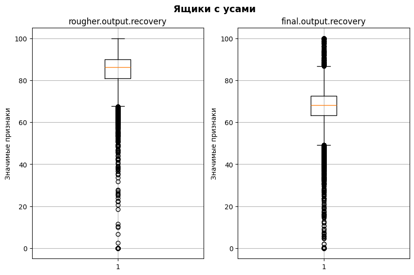
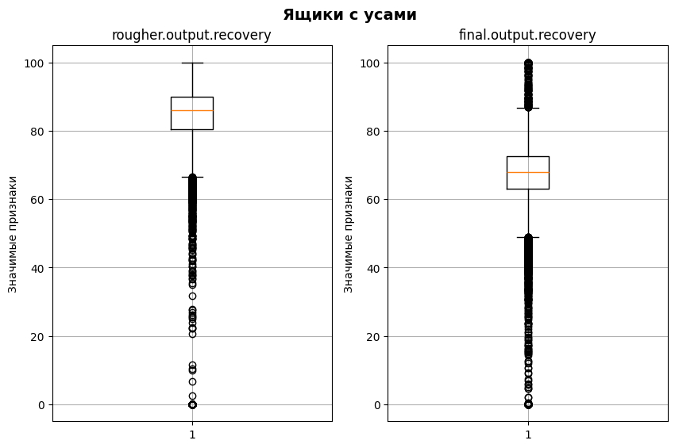
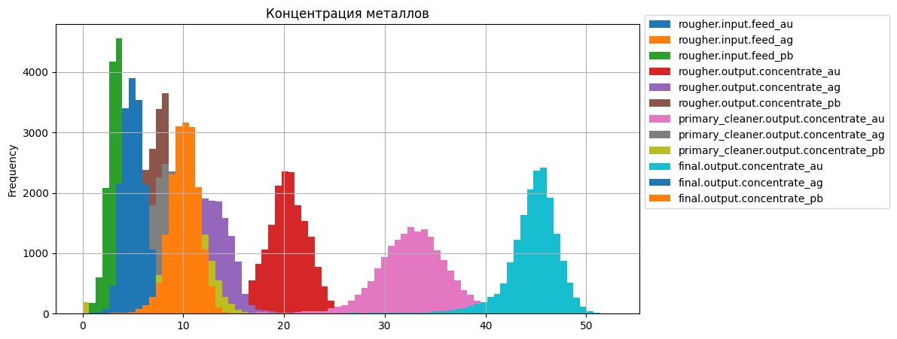
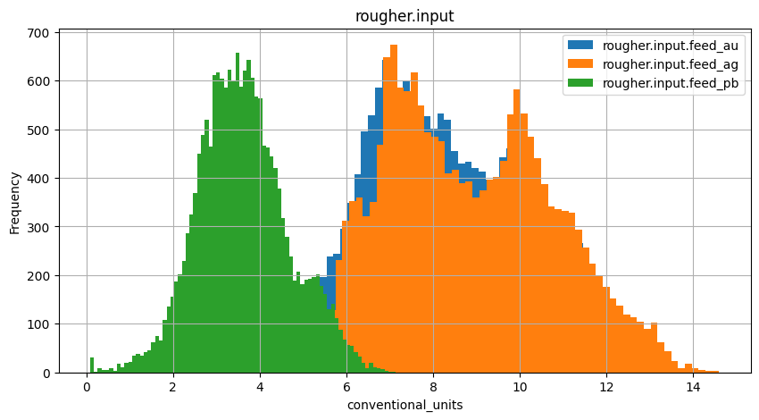
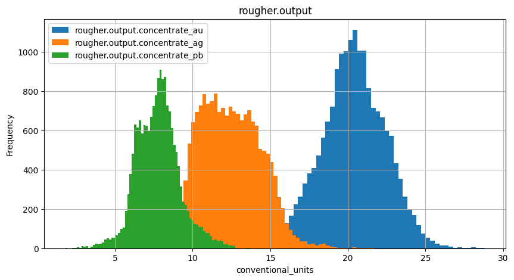
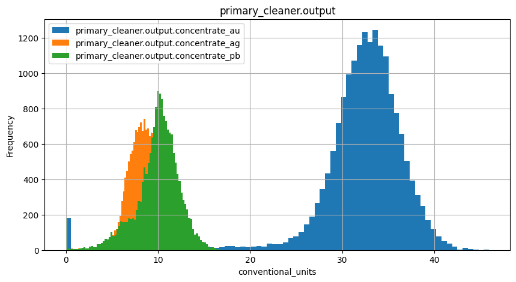
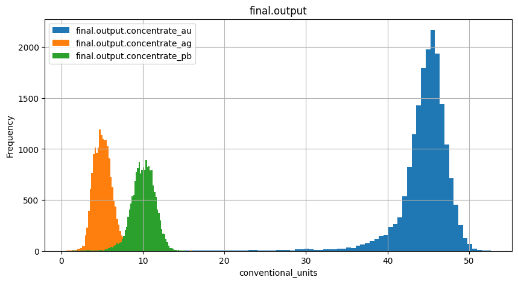
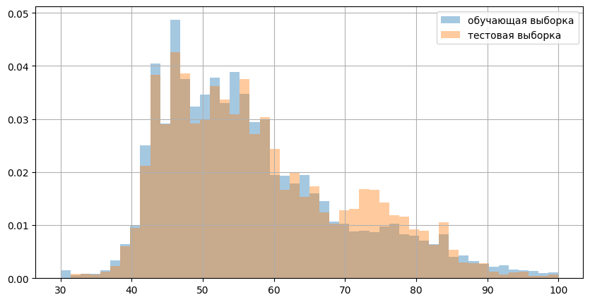
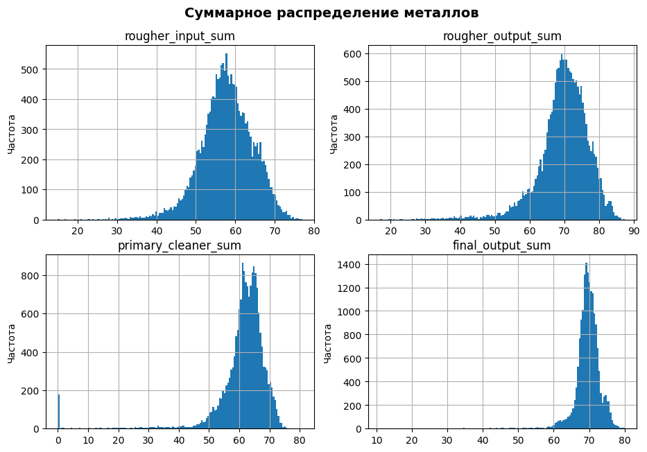
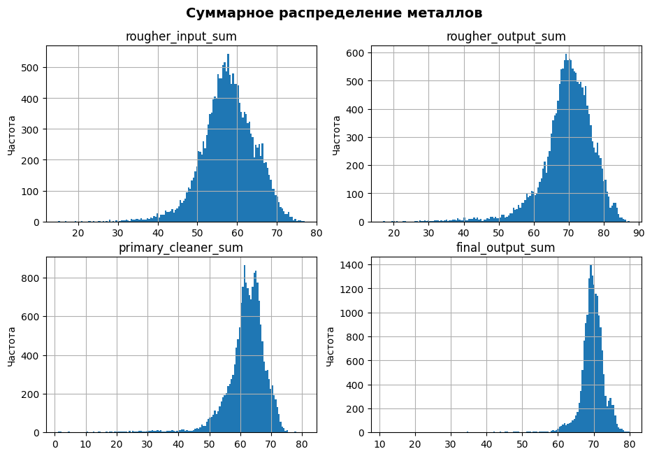

# Восстановление золота из руды

<h1>Содержание<span class='tocSkip'></span></h1>

* [1 Подготовка данных](#my_section_1) <a id='content_1'></a>
  * [1.1 Открытие файлов и изучение их](#my_section_2) <a id='content_2'></a>
    * [1.1.1 Получение данных](#my_section_3) <a id='content_3'></a>
    * [1.1.2 Ознакомление с данными](#my_section_4) <a id='content_4'></a>
      * [1.1.2.1 gold_industry_full](#my_section_5) <a id='content_5'></a>
      * [1.1.2.2 gold_industry_train](#my_section_6) <a id='content_6'></a>
      * [1.1.2.3 gold_industry_test](#my_section_7) <a id='content_7'></a>
      * [1.1.2.4 Структура](#my_section_8) <a id='content_8'></a>
      * [1.1.2.5 Заключение](#my_section_9) <a id='content_9'></a>
  * [1.2 Проверка эффективности обогащения](#my_section_10) <a id='content_10'></a>
  * [1.3 Отсутствующие признаки в тестовой выборке](#my_section_11) <a id='content_11'></a>
  * [1.4 Предобработка данных](#my_section_12) <a id='content_12'></a>
    * [1.4.1 Удаление пропусков и индексация](#my_section_13) <a id='content_13'></a>
  * [1.5 Заключение](#my_section_14) <a id='content_14'></a>
* [2 Анализ данных](#my_section_15) <a id='content_15'></a>
  * [2.1 Концентрация металлов](#my_section_16) <a id='content_16'></a>
  * [2.2 Распределение размеров гранул](#my_section_17) <a id='content_17'></a>
  * [2.3 Суммарная концентрацию металлов](#my_section_18) <a id='content_18'></a>
* [3 Модель](#my_section_19) <a id='content_19'></a>
  * [3.1 sMAPE](#my_section_20) <a id='content_20'></a>
  * [3.2 Подготовка признаков](#my_section_21) <a id='content_21'></a>
    * [3.2.1 Разбиение на признаки](#my_section_22) <a id='content_22'></a>
    * [3.2.2 Масштабирование признаков](#my_section_23) <a id='content_23'></a>
  * [3.3 Обучение модели](#my_section_24) <a id='content_24'></a>
    * [3.3.1 LinearRegression](#my_section_25) <a id='content_25'></a>
    * [3.3.2 DecisionTreeRegressor](#my_section_26) <a id='content_26'></a>
    * [3.3.3 RandomForestRegressor](#my_section_27) <a id='content_27'></a>
  * [3.4 Проверка качества](#my_section_28) <a id='content_28'></a>
  * [3.5 Проверка моделей на адекватность](#my_section_29) <a id='content_29'></a>
  * [3.6 Заключение](#my_section_30) <a id='content_30'></a>


<font style='font-size:24px; font-weight:bold'>Описание проекта</font>

**Задача:**<br/>
Подготовить прототип модели машинного обучения для «Зифры». Компания разрабатывает решения для эффективной работы промышленных предприятий.  

**Нужно спрогнозировать сразу две величины:**
- эффективность обогащения чернового концентрата **rougher.img/output.recovery;**
- эффективность обогащения финального концентрата **final.img/output.recovery.**

**Зачем нужна модель:**<br/>
Модель должна предсказать коэффициент восстановления золота из золотосодержащей руды. Модель поможет оптимизировать производство, чтобы не запускать предприятие с убыточными характеристиками.

**Этапы кратко:**<br/>
1. Подготовить данные;
2. Провести исследовательский анализ данных;
3. Построить и обучить модель.

<br/>
<br/>
<font style='font-size:24px; font-weight:bold'>Описание данных</font><br/>

**Данные находятся в трёх файлах:**

- gold_industry_train.csv — обучающая выборка;
- gold_industry_test.csv — тестовая выборка;
- gold_industry_full.csv — исходные данные.

Данные индексируются датой и временем получения информации (признак 'date'). Соседние по времени параметры часто похожи.<br/>
Некоторые параметры недоступны, потому что замеряются и/или рассчитываются значительно позже. Из-за этого в тестовой выборке отсутствуют некоторые признаки, которые могут быть в обучающей. Также в тестовом наборе нет целевых признаков.<br/>
Исходный датасет содержит обучающую и тестовую выборки со всеми признаками.<br/>
В нашем распоряжении сырые данные: их просто выгрузили из хранилища. <br/>


**Технологический процесс**<br/>
 - Rougher feed — исходное сырье
 - Rougher additions (или reagent additions) — флотационные реагенты: Xanthate, Sulphate, Depressant
    - Xanthate — ксантогенат (промотер, или активатор флотации);
    - Sulphate — сульфат (на данном производстве сульфид натрия);
    - Depressant — депрессант (силикат натрия).
    
- Rougher process (англ. «грубый процесс») — флотация
- Rougher tails — отвальные хвосты
- Float banks — флотационная установка
- Cleaner process — очистка
- Rougher Au — черновой концентрат золота
- Final Au — финальный концентрат золота

**Параметры этапов**<br/>
- air amount — объём воздуха
- fluid levels — уровень жидкости
- feed size — размер гранул сырья
- feed rate — скорость подачи


**Наименование признаков:**<br/>

'этап'.'тип_параметра'.'название_параметра'<br/>
Пример: *rougher.input.feed_ag*

**Возможные значения для блока 'этап':**
- rougher — флотация
- primary_cleaner — первичная очистка
- secondary_cleaner — вторичная очистка
- final — финальные характеристики

**Возможные значения для блока 'тип_параметра':**
- input — параметры сырья
- img/output — параметры продукта
- state — параметры, характеризующие текущее состояние этапа
- calculation — расчётные характеристики


<a id='my_section_1'></a>
## [Подготовка данных](#content_1)

Произведём загрузку необходимых библиотек


```python
from IPython.display import display
from statistics import median
import math
import pandas as pd
import matplotlib.pyplot as plt

from sklearn.metrics import (
    mean_absolute_error,
    mean_squared_error,
    make_scorer,
    )
from sklearn.model_selection import cross_val_score
from sklearn.preprocessing import StandardScaler
from sklearn.tree import DecisionTreeRegressor
from sklearn.linear_model import LinearRegression
from sklearn.ensemble import RandomForestRegressor
from sklearn.dummy import DummyRegressor

from tqdm import tqdm
```

<a id='my_section_2'></a>
### [Открытие файлов и изучение их](#content_2)

<a id='my_section_3'></a>
#### [Получение данных](#content_3)


```python
def download_data(name):
    file_path = '/datasets/'
    file_path_2 = 'https://..'
    try:
        data = pd.read_csv(name+'.csv')
        
    except FileNotFoundError:
        try:
            data = pd.read_csv(file_path+name+'.csv')
        except FileNotFoundError:
            data = pd.read_csv(file_path_2+name+'.csv')
        
    except Exception as ex:
        print('Some error', ex)
    return data
```


```python
gold_industry_train = download_data('gold_industry_train')
gold_industry_test = download_data('gold_industry_test')
gold_industry_full = download_data('gold_industry_full')
```

*Загрузка прошла без ошибок*

Для удобства сформируем словарь


```python
gold_industry_dict = {'gold_industry_full': gold_industry_full, 'gold_industry_train':gold_industry_train, 
                      'gold_industry_test':gold_industry_test}
gold_industry_dict.keys()
```


    dict_keys(['gold_industry_full', 'gold_industry_train', 'gold_industry_test'])


<a id='my_section_4'></a>
#### [Ознакомление с данными](#content_4)

В этом пункте будет проведено ознакомление с данными. Стоит сразу учесть, что часть данных по условию загружена не полностью.

<a id='my_section_5'></a>
##### [gold_industry_full](#content_5)

**head, tail**

Получим обзорную информацию методами `head` и `tail`


```python
display(gold_industry_full.head())
display(gold_industry_full.tail())
```


<div>
<style scoped>
    .dataframe tbody tr th:only-of-type {
        vertical-align: middle;
    }

    .dataframe tbody tr th {
        vertical-align: top;
    }

    .dataframe thead th {
        text-align: right;
    }
</style>
<table border="1" class="dataframe">
  <thead>
    <tr style="text-align: right;">
      <th></th>
      <th>date</th>
      <th>rougher.input.feed_au</th>
      <th>rougher.input.feed_ag</th>
      <th>rougher.input.feed_pb</th>
      <th>rougher.input.feed_sol</th>
      <th>rougher.input.feed_rate</th>
      <th>rougher.input.feed_size</th>
      <th>rougher.input.floatbank10_sulfate</th>
      <th>rougher.input.floatbank10_xanthate</th>
      <th>rougher.state.floatbank10_a_air</th>
      <th>...</th>
      <th>secondary_cleaner.img/output.tail_sol</th>
      <th>final.img/output.concentrate_au</th>
      <th>final.img/output.concentrate_ag</th>
      <th>final.img/output.concentrate_pb</th>
      <th>final.img/output.concentrate_sol</th>
      <th>final.img/output.recovery</th>
      <th>final.img/output.tail_au</th>
      <th>final.img/output.tail_ag</th>
      <th>final.img/output.tail_pb</th>
      <th>final.img/output.tail_sol</th>
    </tr>
  </thead>
  <tbody>
    <tr>
      <th>0</th>
      <td>2016-01-15 00:00:00</td>
      <td>6.486150</td>
      <td>6.100378</td>
      <td>2.284912</td>
      <td>36.808594</td>
      <td>523.546326</td>
      <td>55.486599</td>
      <td>11.986616</td>
      <td>6.007990</td>
      <td>999.706909</td>
      <td>...</td>
      <td>8.764648</td>
      <td>42.192020</td>
      <td>6.055403</td>
      <td>9.889648</td>
      <td>5.507324</td>
      <td>70.541216</td>
      <td>2.143149</td>
      <td>10.411962</td>
      <td>0.895447</td>
      <td>16.904297</td>
    </tr>
    <tr>
      <th>1</th>
      <td>2016-01-15 01:00:00</td>
      <td>6.478583</td>
      <td>6.161113</td>
      <td>2.266033</td>
      <td>35.753385</td>
      <td>525.290581</td>
      <td>57.278666</td>
      <td>11.971193</td>
      <td>6.005766</td>
      <td>1000.286398</td>
      <td>...</td>
      <td>9.001494</td>
      <td>42.701629</td>
      <td>6.029369</td>
      <td>9.968944</td>
      <td>5.257781</td>
      <td>69.266198</td>
      <td>2.224930</td>
      <td>10.462676</td>
      <td>0.927452</td>
      <td>16.634514</td>
    </tr>
    <tr>
      <th>2</th>
      <td>2016-01-15 02:00:00</td>
      <td>6.362222</td>
      <td>6.116455</td>
      <td>2.159622</td>
      <td>35.971630</td>
      <td>530.026610</td>
      <td>57.510649</td>
      <td>11.920603</td>
      <td>6.197377</td>
      <td>999.719565</td>
      <td>...</td>
      <td>8.842896</td>
      <td>42.657501</td>
      <td>6.055926</td>
      <td>10.213995</td>
      <td>5.383759</td>
      <td>68.116445</td>
      <td>2.257889</td>
      <td>10.507046</td>
      <td>0.953716</td>
      <td>16.208849</td>
    </tr>
    <tr>
      <th>3</th>
      <td>2016-01-15 03:00:00</td>
      <td>6.118189</td>
      <td>6.043309</td>
      <td>2.037807</td>
      <td>36.862241</td>
      <td>542.590390</td>
      <td>57.792734</td>
      <td>11.630094</td>
      <td>6.203177</td>
      <td>999.814770</td>
      <td>...</td>
      <td>9.122857</td>
      <td>42.689819</td>
      <td>6.047977</td>
      <td>9.977019</td>
      <td>4.858634</td>
      <td>68.347543</td>
      <td>2.146849</td>
      <td>10.422762</td>
      <td>0.883763</td>
      <td>16.532835</td>
    </tr>
    <tr>
      <th>4</th>
      <td>2016-01-15 04:00:00</td>
      <td>5.663707</td>
      <td>6.060915</td>
      <td>1.786875</td>
      <td>34.347666</td>
      <td>540.531893</td>
      <td>56.047189</td>
      <td>10.957755</td>
      <td>6.198826</td>
      <td>999.678690</td>
      <td>...</td>
      <td>8.871028</td>
      <td>42.774141</td>
      <td>6.148599</td>
      <td>10.142511</td>
      <td>4.939416</td>
      <td>66.927016</td>
      <td>2.055292</td>
      <td>10.360302</td>
      <td>0.792826</td>
      <td>16.525686</td>
    </tr>
  </tbody>
</table>
<p>5 rows × 87 columns</p>
</div>


<div>
<style scoped>
    .dataframe tbody tr th:only-of-type {
        vertical-align: middle;
    }

    .dataframe tbody tr th {
        vertical-align: top;
    }

    .dataframe thead th {
        text-align: right;
    }
</style>
<table border="1" class="dataframe">
  <thead>
    <tr style="text-align: right;">
      <th></th>
      <th>date</th>
      <th>rougher.input.feed_au</th>
      <th>rougher.input.feed_ag</th>
      <th>rougher.input.feed_pb</th>
      <th>rougher.input.feed_sol</th>
      <th>rougher.input.feed_rate</th>
      <th>rougher.input.feed_size</th>
      <th>rougher.input.floatbank10_sulfate</th>
      <th>rougher.input.floatbank10_xanthate</th>
      <th>rougher.state.floatbank10_a_air</th>
      <th>...</th>
      <th>secondary_cleaner.img/output.tail_sol</th>
      <th>final.img/output.concentrate_au</th>
      <th>final.img/output.concentrate_ag</th>
      <th>final.img/output.concentrate_pb</th>
      <th>final.img/output.concentrate_sol</th>
      <th>final.img/output.recovery</th>
      <th>final.img/output.tail_au</th>
      <th>final.img/output.tail_ag</th>
      <th>final.img/output.tail_pb</th>
      <th>final.img/output.tail_sol</th>
    </tr>
  </thead>
  <tbody>
    <tr>
      <th>19434</th>
      <td>2018-08-18 06:59:59</td>
      <td>6.620245</td>
      <td>5.992592</td>
      <td>2.589242</td>
      <td>39.934641</td>
      <td>578.654582</td>
      <td>63.473450</td>
      <td>14.688804</td>
      <td>6.898599</td>
      <td>999.688257</td>
      <td>...</td>
      <td>10.013738</td>
      <td>42.435181</td>
      <td>5.719113</td>
      <td>10.621027</td>
      <td>6.459561</td>
      <td>68.786981</td>
      <td>2.314786</td>
      <td>10.286797</td>
      <td>1.171459</td>
      <td>19.131121</td>
    </tr>
    <tr>
      <th>19435</th>
      <td>2018-08-18 07:59:59</td>
      <td>6.741324</td>
      <td>6.158617</td>
      <td>2.647185</td>
      <td>40.176307</td>
      <td>571.622005</td>
      <td>62.815291</td>
      <td>14.892720</td>
      <td>6.903204</td>
      <td>1000.479783</td>
      <td>...</td>
      <td>9.841210</td>
      <td>43.440341</td>
      <td>5.410126</td>
      <td>10.868937</td>
      <td>6.258693</td>
      <td>67.839536</td>
      <td>2.423143</td>
      <td>10.382891</td>
      <td>1.239738</td>
      <td>18.544924</td>
    </tr>
    <tr>
      <th>19436</th>
      <td>2018-08-18 08:59:59</td>
      <td>6.627458</td>
      <td>6.015149</td>
      <td>2.466127</td>
      <td>39.841423</td>
      <td>563.733146</td>
      <td>61.287347</td>
      <td>13.723692</td>
      <td>6.700148</td>
      <td>1000.014718</td>
      <td>...</td>
      <td>10.119344</td>
      <td>44.284117</td>
      <td>5.437716</td>
      <td>9.781181</td>
      <td>6.057627</td>
      <td>70.847012</td>
      <td>2.161256</td>
      <td>10.324415</td>
      <td>0.961210</td>
      <td>18.185262</td>
    </tr>
    <tr>
      <th>19437</th>
      <td>2018-08-18 09:59:59</td>
      <td>6.702243</td>
      <td>6.097592</td>
      <td>2.278955</td>
      <td>37.728375</td>
      <td>549.812490</td>
      <td>59.637037</td>
      <td>13.746510</td>
      <td>6.706417</td>
      <td>999.635748</td>
      <td>...</td>
      <td>9.876374</td>
      <td>43.339714</td>
      <td>5.664983</td>
      <td>10.168953</td>
      <td>5.484318</td>
      <td>72.659046</td>
      <td>2.064422</td>
      <td>10.475957</td>
      <td>1.050592</td>
      <td>17.525656</td>
    </tr>
    <tr>
      <th>19438</th>
      <td>2018-08-18 10:59:59</td>
      <td>6.633002</td>
      <td>5.908793</td>
      <td>2.440899</td>
      <td>36.958540</td>
      <td>573.076049</td>
      <td>58.509262</td>
      <td>13.707775</td>
      <td>6.820245</td>
      <td>1000.589156</td>
      <td>...</td>
      <td>9.813732</td>
      <td>43.235220</td>
      <td>5.687063</td>
      <td>9.980404</td>
      <td>5.282514</td>
      <td>70.279619</td>
      <td>2.209593</td>
      <td>10.487013</td>
      <td>1.159805</td>
      <td>17.483979</td>
    </tr>
  </tbody>
</table>
<p>5 rows × 87 columns</p>
</div>


*Данные представлены за пару лет. Имеют разброс значений, нуждаются в масштабировании для  задач машинного обучения.*

**info**

Получим представление о типах данных и пропусках


```python
gold_industry_full.info()
```

    <class 'pandas.core.frame.DataFrame'>
    RangeIndex: 19439 entries, 0 to 19438
    Data columns (total 87 columns):
     #   Column                                              Non-Null Count  Dtype  
    ---  ------                                              --------------  -----  
     0   date                                                19439 non-null  object 
     1   rougher.input.feed_au                               19439 non-null  float64
     2   rougher.input.feed_ag                               19439 non-null  float64
     3   rougher.input.feed_pb                               19339 non-null  float64
     4   rougher.input.feed_sol                              19340 non-null  float64
     5   rougher.input.feed_rate                             19428 non-null  float64
     6   rougher.input.feed_size                             19294 non-null  float64
     7   rougher.input.floatbank10_sulfate                   19405 non-null  float64
     8   rougher.input.floatbank10_xanthate                  19431 non-null  float64
     9   rougher.state.floatbank10_a_air                     19438 non-null  float64
     10  rougher.state.floatbank10_a_level                   19438 non-null  float64
     11  rougher.state.floatbank10_b_air                     19438 non-null  float64
     12  rougher.state.floatbank10_b_level                   19438 non-null  float64
     13  rougher.state.floatbank10_c_air                     19438 non-null  float64
     14  rougher.state.floatbank10_c_level                   19438 non-null  float64
     15  rougher.state.floatbank10_d_air                     19439 non-null  float64
     16  rougher.state.floatbank10_d_level                   19439 non-null  float64
     17  rougher.state.floatbank10_e_air                     19003 non-null  float64
     18  rougher.state.floatbank10_e_level                   19439 non-null  float64
     19  rougher.state.floatbank10_f_air                     19439 non-null  float64
     20  rougher.state.floatbank10_f_level                   19439 non-null  float64
     21  rougher.input.floatbank11_sulfate                   19395 non-null  float64
     22  rougher.input.floatbank11_xanthate                  18986 non-null  float64
     23  rougher.calculation.sulfate_to_au_concentrate       19437 non-null  float64
     24  rougher.calculation.floatbank10_sulfate_to_au_feed  19437 non-null  float64
     25  rougher.calculation.floatbank11_sulfate_to_au_feed  19437 non-null  float64
     26  rougher.calculation.au_pb_ratio                     19439 non-null  float64
     27  rougher.img/output.concentrate_au                       19439 non-null  float64
     28  rougher.img/output.concentrate_ag                       19439 non-null  float64
     29  rougher.img/output.concentrate_pb                       19439 non-null  float64
     30  rougher.img/output.concentrate_sol                      19416 non-null  float64
     31  rougher.img/output.recovery                             19439 non-null  float64
     32  rougher.img/output.tail_au                              19439 non-null  float64
     33  rougher.img/output.tail_ag                              19438 non-null  float64
     34  rougher.img/output.tail_pb                              19439 non-null  float64
     35  rougher.img/output.tail_sol                             19439 non-null  float64
     36  primary_cleaner.input.sulfate                       19415 non-null  float64
     37  primary_cleaner.input.depressant                    19402 non-null  float64
     38  primary_cleaner.input.feed_size                     19439 non-null  float64
     39  primary_cleaner.input.xanthate                      19335 non-null  float64
     40  primary_cleaner.state.floatbank8_a_air              19435 non-null  float64
     41  primary_cleaner.state.floatbank8_a_level            19438 non-null  float64
     42  primary_cleaner.state.floatbank8_b_air              19435 non-null  float64
     43  primary_cleaner.state.floatbank8_b_level            19438 non-null  float64
     44  primary_cleaner.state.floatbank8_c_air              19437 non-null  float64
     45  primary_cleaner.state.floatbank8_c_level            19438 non-null  float64
     46  primary_cleaner.state.floatbank8_d_air              19436 non-null  float64
     47  primary_cleaner.state.floatbank8_d_level            19438 non-null  float64
     48  primary_cleaner.img/output.concentrate_au               19439 non-null  float64
     49  primary_cleaner.img/output.concentrate_ag               19439 non-null  float64
     50  primary_cleaner.img/output.concentrate_pb               19323 non-null  float64
     51  primary_cleaner.img/output.concentrate_sol              19069 non-null  float64
     52  primary_cleaner.img/output.tail_au                      19439 non-null  float64
     53  primary_cleaner.img/output.tail_ag                      19435 non-null  float64
     54  primary_cleaner.img/output.tail_pb                      19418 non-null  float64
     55  primary_cleaner.img/output.tail_sol                     19377 non-null  float64
     56  secondary_cleaner.state.floatbank2_a_air            19219 non-null  float64
     57  secondary_cleaner.state.floatbank2_a_level          19438 non-null  float64
     58  secondary_cleaner.state.floatbank2_b_air            19416 non-null  float64
     59  secondary_cleaner.state.floatbank2_b_level          19438 non-null  float64
     60  secondary_cleaner.state.floatbank3_a_air            19426 non-null  float64
     61  secondary_cleaner.state.floatbank3_a_level          19438 non-null  float64
     62  secondary_cleaner.state.floatbank3_b_air            19438 non-null  float64
     63  secondary_cleaner.state.floatbank3_b_level          19438 non-null  float64
     64  secondary_cleaner.state.floatbank4_a_air            19433 non-null  float64
     65  secondary_cleaner.state.floatbank4_a_level          19438 non-null  float64
     66  secondary_cleaner.state.floatbank4_b_air            19438 non-null  float64
     67  secondary_cleaner.state.floatbank4_b_level          19438 non-null  float64
     68  secondary_cleaner.state.floatbank5_a_air            19438 non-null  float64
     69  secondary_cleaner.state.floatbank5_a_level          19438 non-null  float64
     70  secondary_cleaner.state.floatbank5_b_air            19438 non-null  float64
     71  secondary_cleaner.state.floatbank5_b_level          19438 non-null  float64
     72  secondary_cleaner.state.floatbank6_a_air            19437 non-null  float64
     73  secondary_cleaner.state.floatbank6_a_level          19438 non-null  float64
     74  secondary_cleaner.img/output.tail_au                    19439 non-null  float64
     75  secondary_cleaner.img/output.tail_ag                    19437 non-null  float64
     76  secondary_cleaner.img/output.tail_pb                    19427 non-null  float64
     77  secondary_cleaner.img/output.tail_sol                   17691 non-null  float64
     78  final.img/output.concentrate_au                         19439 non-null  float64
     79  final.img/output.concentrate_ag                         19438 non-null  float64
     80  final.img/output.concentrate_pb                         19438 non-null  float64
     81  final.img/output.concentrate_sol                        19228 non-null  float64
     82  final.img/output.recovery                               19439 non-null  float64
     83  final.img/output.tail_au                                19439 non-null  float64
     84  final.img/output.tail_ag                                19438 non-null  float64
     85  final.img/output.tail_pb                                19338 non-null  float64
     86  final.img/output.tail_sol                               19433 non-null  float64
    dtypes: float64(86), object(1)
    memory usage: 12.9+ MB
    

*В данных имеются пропуски, их количество кажется не значительным. Тип данных преимущественно `float64` за исключением столбца date с типом `object`. Его по условию используют в качестве индекса. Возможно часть значений стоит исключить, те которые не относятся к золоту, но точно не понятно, будет ли это в конечном итоге влиять на `rougher.img/output.recovery` и `final.output.recovery`.*

**Изучение пропусков**

Для упрощения выявления столбцов с пропусками определим функцию.


```python
def col_with_pass(gold_industry_full):
    """Функция формирует датафрейм со столбцами,
    где есть пропуски и их количеством, а так же сохраняет
    индексы строк с пропусками"""
    columns = []
    col_pas = []
    index_nan = []
    for el in gold_industry_full.columns:
        pre = gold_industry_full[gold_industry_full[el].isna()]
        a_pass = pre.shape[0]
        if a_pass != 0:
            columns.append(el)
            col_pas.append(pre.shape[0])
            # сохранения индексов с пропусками
            index_nan += list(pre.index)
            #print(f'{el :<55}:{a_pass}')
    index_nan = sorted(set(index_nan))
    data = pd.DataFrame({'columns':columns, 'a_pass':col_pas})\
           .sort_values(by='a_pass', ascending=False)
    return data, index_nan

```

Выведем для общего представления о пропусках первые 5 строчек


```python
gold_industry_full_pass, index_nan_full = col_with_pass(gold_industry_full)
gold_industry_full_pass.head()
```


<div>
<style scoped>
    .dataframe tbody tr th:only-of-type {
        vertical-align: middle;
    }

    .dataframe tbody tr th {
        vertical-align: top;
    }

    .dataframe thead th {
        text-align: right;
    }
</style>
<table border="1" class="dataframe">
  <thead>
    <tr style="text-align: right;">
      <th></th>
      <th>columns</th>
      <th>a_pass</th>
    </tr>
  </thead>
  <tbody>
    <tr>
      <th>56</th>
      <td>secondary_cleaner.img/output.tail_sol</td>
      <td>1748</td>
    </tr>
    <tr>
      <th>14</th>
      <td>rougher.input.floatbank11_xanthate</td>
      <td>453</td>
    </tr>
    <tr>
      <th>12</th>
      <td>rougher.state.floatbank10_e_air</td>
      <td>436</td>
    </tr>
    <tr>
      <th>32</th>
      <td>primary_cleaner.img/output.concentrate_sol</td>
      <td>370</td>
    </tr>
    <tr>
      <th>36</th>
      <td>secondary_cleaner.state.floatbank2_a_air</td>
      <td>220</td>
    </tr>
  </tbody>
</table>
</div>


Изучим общее количество пропусков


```python
len(index_nan_full)
```


    3345


Оценим сколько какой процент данных останется, если удалить пропуски. Определим функцию


```python
def percent_data_after_del_nan(data):
    print(f'После удаление пропусков данных останется: '
          f'{data.dropna().shape[0]/data.shape[0]*100 :.4}%')
    
percent_data_after_del_nan(gold_industry_full)
```

    После удаление пропусков данных останется: 82.79%
    

*Это приемлемое количество данных, конечно, лучше, чтобы процент удлалённых данных не выходил за 15%.*

Изучим информацию о столбцах с пропусками методом `describe`


```python
gold_industry_full.loc[index_nan_full, gold_industry_full_pass['columns']].describe()
```


<div>
<style scoped>
    .dataframe tbody tr th:only-of-type {
        vertical-align: middle;
    }

    .dataframe tbody tr th {
        vertical-align: top;
    }

    .dataframe thead th {
        text-align: right;
    }
</style>
<table border="1" class="dataframe">
  <thead>
    <tr style="text-align: right;">
      <th></th>
      <th>secondary_cleaner.img/output.tail_sol</th>
      <th>rougher.input.floatbank11_xanthate</th>
      <th>rougher.state.floatbank10_e_air</th>
      <th>primary_cleaner.img/output.concentrate_sol</th>
      <th>secondary_cleaner.state.floatbank2_a_air</th>
      <th>final.img/output.concentrate_sol</th>
      <th>rougher.input.feed_size</th>
      <th>primary_cleaner.img/output.concentrate_pb</th>
      <th>primary_cleaner.input.xanthate</th>
      <th>final.img/output.tail_pb</th>
      <th>...</th>
      <th>rougher.state.floatbank10_a_air</th>
      <th>rougher.state.floatbank10_a_level</th>
      <th>primary_cleaner.state.floatbank8_d_level</th>
      <th>primary_cleaner.state.floatbank8_c_level</th>
      <th>primary_cleaner.state.floatbank8_b_level</th>
      <th>primary_cleaner.state.floatbank8_a_level</th>
      <th>rougher.state.floatbank10_b_air</th>
      <th>rougher.img/output.tail_ag</th>
      <th>rougher.state.floatbank10_b_level</th>
      <th>secondary_cleaner.state.floatbank2_a_level</th>
    </tr>
  </thead>
  <tbody>
    <tr>
      <th>count</th>
      <td>1597.000000</td>
      <td>2892.000000</td>
      <td>2909.000000</td>
      <td>2975.000000</td>
      <td>3125.000000</td>
      <td>3134.000000</td>
      <td>3200.000000</td>
      <td>3229.000000</td>
      <td>3241.000000</td>
      <td>3244.000000</td>
      <td>...</td>
      <td>3344.000000</td>
      <td>3344.000000</td>
      <td>3344.000000</td>
      <td>3344.000000</td>
      <td>3344.000000</td>
      <td>3344.000000</td>
      <td>3344.000000</td>
      <td>3344.000000</td>
      <td>3344.000000</td>
      <td>3344.000000</td>
    </tr>
    <tr>
      <th>mean</th>
      <td>4.408087</td>
      <td>5.930697</td>
      <td>1112.439332</td>
      <td>9.091919</td>
      <td>29.772056</td>
      <td>7.598032</td>
      <td>71.273007</td>
      <td>9.557948</td>
      <td>0.864791</td>
      <td>2.381111</td>
      <td>...</td>
      <td>1179.939722</td>
      <td>-334.758991</td>
      <td>-484.008299</td>
      <td>-491.906909</td>
      <td>-492.252304</td>
      <td>-489.755151</td>
      <td>1289.601409</td>
      <td>5.027091</td>
      <td>-467.518969</td>
      <td>-517.369297</td>
    </tr>
    <tr>
      <th>std</th>
      <td>4.052210</td>
      <td>1.411522</td>
      <td>198.822499</td>
      <td>4.088495</td>
      <td>6.349777</td>
      <td>2.093686</td>
      <td>32.535073</td>
      <td>3.204861</td>
      <td>0.409869</td>
      <td>0.997905</td>
      <td>...</td>
      <td>175.681269</td>
      <td>77.575049</td>
      <td>51.364460</td>
      <td>38.872229</td>
      <td>39.435298</td>
      <td>40.895096</td>
      <td>208.968851</td>
      <td>1.127376</td>
      <td>67.449102</td>
      <td>74.231163</td>
    </tr>
    <tr>
      <th>min</th>
      <td>0.000000</td>
      <td>0.000290</td>
      <td>-1.982295</td>
      <td>0.000000</td>
      <td>0.077503</td>
      <td>0.000000</td>
      <td>14.249246</td>
      <td>0.000000</td>
      <td>0.000005</td>
      <td>0.000000</td>
      <td>...</td>
      <td>-0.042069</td>
      <td>-657.949759</td>
      <td>-799.794250</td>
      <td>-799.960571</td>
      <td>-799.997015</td>
      <td>-798.641662</td>
      <td>-0.721806</td>
      <td>0.594562</td>
      <td>-650.260008</td>
      <td>-799.587280</td>
    </tr>
    <tr>
      <th>25%</th>
      <td>0.595795</td>
      <td>5.307553</td>
      <td>999.721383</td>
      <td>6.636142</td>
      <td>27.984504</td>
      <td>6.624756</td>
      <td>54.570147</td>
      <td>8.121402</td>
      <td>0.590081</td>
      <td>1.685854</td>
      <td>...</td>
      <td>1000.268399</td>
      <td>-300.317268</td>
      <td>-500.509449</td>
      <td>-500.814975</td>
      <td>-500.453530</td>
      <td>-500.311341</td>
      <td>1152.347425</td>
      <td>4.143526</td>
      <td>-500.297713</td>
      <td>-500.330506</td>
    </tr>
    <tr>
      <th>50%</th>
      <td>3.461140</td>
      <td>6.099708</td>
      <td>1051.546930</td>
      <td>8.839021</td>
      <td>30.078176</td>
      <td>7.381534</td>
      <td>68.795809</td>
      <td>9.941377</td>
      <td>0.807094</td>
      <td>2.390037</td>
      <td>...</td>
      <td>1199.290318</td>
      <td>-300.057456</td>
      <td>-499.796994</td>
      <td>-499.899708</td>
      <td>-499.964247</td>
      <td>-499.893641</td>
      <td>1291.625405</td>
      <td>4.990376</td>
      <td>-499.896365</td>
      <td>-499.993277</td>
    </tr>
    <tr>
      <th>75%</th>
      <td>7.203171</td>
      <td>6.896607</td>
      <td>1298.262755</td>
      <td>11.430805</td>
      <td>34.098673</td>
      <td>8.473612</td>
      <td>78.026946</td>
      <td>11.619692</td>
      <td>1.090277</td>
      <td>3.145345</td>
      <td>...</td>
      <td>1394.667514</td>
      <td>-299.913171</td>
      <td>-498.022194</td>
      <td>-498.659617</td>
      <td>-499.382774</td>
      <td>-499.343203</td>
      <td>1401.150116</td>
      <td>5.818629</td>
      <td>-498.830055</td>
      <td>-499.675603</td>
    </tr>
    <tr>
      <th>max</th>
      <td>26.000772</td>
      <td>9.002704</td>
      <td>1701.711940</td>
      <td>22.280845</td>
      <td>48.822781</td>
      <td>17.945084</td>
      <td>449.825402</td>
      <td>16.325650</td>
      <td>2.500920</td>
      <td>4.955723</td>
      <td>...</td>
      <td>1500.237736</td>
      <td>-295.240802</td>
      <td>-30.601828</td>
      <td>-347.257693</td>
      <td>-348.428215</td>
      <td>-347.471096</td>
      <td>1809.194008</td>
      <td>12.719177</td>
      <td>-296.383080</td>
      <td>-127.875565</td>
    </tr>
  </tbody>
</table>
<p>8 rows × 63 columns</p>
</div>


*Данные между собой имеют разный разброс. Предположительно, данные чувствительны и заполнение средним может повлиять на конечный результат не в лучшую сторону.*

**Поиск дубликатов**

Проверим дубликаты по всей таблице


```python
gold_industry_full.duplicated().sum()
```


    0


Проверим наличие дубликатов по столбцу с датой.


```python
gold_industry_full['date'].duplicated().sum()
```


    0


Теперь пройдём по каждому столбцу отдельно и выпишем их


```python
def some_dub(geo_data_0):
    for el in geo_data_0.columns:
        some_dub = geo_data_0.loc[:, el].duplicated().sum()
        if some_dub > 0:
            print(f'В столбце {el} — {some_dub} дубликат(а/ов)')

some_dub(gold_industry_full)           
```

    В столбце rougher.input.feed_au — 30 дубликат(а/ов)
    В столбце rougher.input.feed_ag — 30 дубликат(а/ов)
    В столбце rougher.input.feed_pb — 138 дубликат(а/ов)
    В столбце rougher.input.feed_sol — 146 дубликат(а/ов)
    В столбце rougher.input.feed_rate — 10 дубликат(а/ов)
    В столбце rougher.input.feed_size — 152 дубликат(а/ов)
    В столбце rougher.input.floatbank10_sulfate — 33 дубликат(а/ов)
    В столбце rougher.input.floatbank10_xanthate — 7 дубликат(а/ов)
    В столбце rougher.state.floatbank10_e_air — 435 дубликат(а/ов)
    В столбце rougher.state.floatbank10_f_level — 1 дубликат(а/ов)
    В столбце rougher.input.floatbank11_sulfate — 43 дубликат(а/ов)
    В столбце rougher.input.floatbank11_xanthate — 467 дубликат(а/ов)
    В столбце rougher.calculation.sulfate_to_au_concentrate — 1 дубликат(а/ов)
    В столбце rougher.calculation.floatbank10_sulfate_to_au_feed — 1 дубликат(а/ов)
    В столбце rougher.calculation.floatbank11_sulfate_to_au_feed — 1 дубликат(а/ов)
    В столбце rougher.calculation.au_pb_ratio — 30 дубликат(а/ов)
    В столбце rougher.img/output.concentrate_au — 424 дубликат(а/ов)
    В столбце rougher.img/output.concentrate_ag — 424 дубликат(а/ов)
    В столбце rougher.img/output.concentrate_pb — 483 дубликат(а/ов)
    В столбце rougher.img/output.concentrate_sol — 774 дубликат(а/ов)
    В столбце rougher.img/output.recovery — 422 дубликат(а/ов)
    В столбце rougher.img/output.tail_au — 40 дубликат(а/ов)
    В столбце rougher.img/output.tail_ag — 41 дубликат(а/ов)
    В столбце rougher.img/output.tail_pb — 30 дубликат(а/ов)
    В столбце rougher.img/output.tail_sol — 167 дубликат(а/ов)
    В столбце primary_cleaner.input.sulfate — 23 дубликат(а/ов)
    В столбце primary_cleaner.input.depressant — 45 дубликат(а/ов)
    В столбце primary_cleaner.input.feed_size — 14417 дубликат(а/ов)
    В столбце primary_cleaner.input.xanthate — 103 дубликат(а/ов)
    В столбце primary_cleaner.state.floatbank8_a_air — 3 дубликат(а/ов)
    В столбце primary_cleaner.state.floatbank8_b_air — 3 дубликат(а/ов)
    В столбце primary_cleaner.state.floatbank8_c_air — 1 дубликат(а/ов)
    В столбце primary_cleaner.state.floatbank8_d_air — 2 дубликат(а/ов)
    В столбце primary_cleaner.img/output.concentrate_au — 240 дубликат(а/ов)
    В столбце primary_cleaner.img/output.concentrate_ag — 240 дубликат(а/ов)
    В столбце primary_cleaner.img/output.concentrate_pb — 383 дубликат(а/ов)
    В столбце primary_cleaner.img/output.concentrate_sol — 612 дубликат(а/ов)
    В столбце primary_cleaner.img/output.tail_au — 148 дубликат(а/ов)
    В столбце primary_cleaner.img/output.tail_ag — 151 дубликат(а/ов)
    В столбце primary_cleaner.img/output.tail_pb — 168 дубликат(а/ов)
    В столбце primary_cleaner.img/output.tail_sol — 209 дубликат(а/ов)
    В столбце secondary_cleaner.state.floatbank2_a_air — 220 дубликат(а/ов)
    В столбце secondary_cleaner.state.floatbank2_b_air — 157 дубликат(а/ов)
    В столбце secondary_cleaner.state.floatbank3_a_air — 85 дубликат(а/ов)
    В столбце secondary_cleaner.state.floatbank3_b_air — 120 дубликат(а/ов)
    В столбце secondary_cleaner.state.floatbank4_a_air — 15 дубликат(а/ов)
    В столбце secondary_cleaner.state.floatbank4_b_air — 24 дубликат(а/ов)
    В столбце secondary_cleaner.state.floatbank4_b_level — 2 дубликат(а/ов)
    В столбце secondary_cleaner.state.floatbank6_a_air — 1 дубликат(а/ов)
    В столбце secondary_cleaner.img/output.tail_au — 861 дубликат(а/ов)
    В столбце secondary_cleaner.img/output.tail_ag — 862 дубликат(а/ов)
    В столбце secondary_cleaner.img/output.tail_pb — 876 дубликат(а/ов)
    В столбце secondary_cleaner.img/output.tail_sol — 2607 дубликат(а/ов)
    В столбце final.img/output.concentrate_au — 131 дубликат(а/ов)
    В столбце final.img/output.concentrate_ag — 131 дубликат(а/ов)
    В столбце final.img/output.concentrate_pb — 162 дубликат(а/ов)
    В столбце final.img/output.concentrate_sol — 345 дубликат(а/ов)
    В столбце final.img/output.recovery — 204 дубликат(а/ов)
    В столбце final.img/output.tail_au — 110 дубликат(а/ов)
    В столбце final.img/output.tail_ag — 110 дубликат(а/ов)
    В столбце final.img/output.tail_pb — 210 дубликат(а/ов)
    В столбце final.img/output.tail_sol — 116 дубликат(а/ов)
    

*По условию данные могут быть похожи. Особенности производства тоже могут влиять на наличие дубликатов в одних и тех же столбцах. Стоит проверить по ключевым столбцам или по столбцам, где есть только уникальные значения.*

Изучим наличие дубликатов без учёта столбца `date`


```python
gold_industry_full.drop('date', axis=1).duplicated().sum()
```


    0


Теперь пройдёмся по ключевым столбцам, связанным с золотом.


```python
dup_col = ['rougher.input.feed_au', 'rougher.img/output.concentrate_au', 'rougher.output.tail_au',
           'primary_cleaner.img/output.concentrate_au', 'final.output.tail_au']
gold_industry_full[dup_col].duplicated().sum()
```


    28


Изучи строки с дубликатами


```python
gold_industry_full.loc[gold_industry_full[dup_col].duplicated(), :].head()
```


<div>
<style scoped>
    .dataframe tbody tr th:only-of-type {
        vertical-align: middle;
    }

    .dataframe tbody tr th {
        vertical-align: top;
    }

    .dataframe thead th {
        text-align: right;
    }
</style>
<table border="1" class="dataframe">
  <thead>
    <tr style="text-align: right;">
      <th></th>
      <th>date</th>
      <th>rougher.input.feed_au</th>
      <th>rougher.input.feed_ag</th>
      <th>rougher.input.feed_pb</th>
      <th>rougher.input.feed_sol</th>
      <th>rougher.input.feed_rate</th>
      <th>rougher.input.feed_size</th>
      <th>rougher.input.floatbank10_sulfate</th>
      <th>rougher.input.floatbank10_xanthate</th>
      <th>rougher.state.floatbank10_a_air</th>
      <th>...</th>
      <th>secondary_cleaner.img/output.tail_sol</th>
      <th>final.img/output.concentrate_au</th>
      <th>final.img/output.concentrate_ag</th>
      <th>final.img/output.concentrate_pb</th>
      <th>final.img/output.concentrate_sol</th>
      <th>final.img/output.recovery</th>
      <th>final.img/output.tail_au</th>
      <th>final.img/output.tail_ag</th>
      <th>final.img/output.tail_pb</th>
      <th>final.img/output.tail_sol</th>
    </tr>
  </thead>
  <tbody>
    <tr>
      <th>5740</th>
      <td>2016-10-25 05:59:59</td>
      <td>8.518138</td>
      <td>7.061728</td>
      <td>5.038574</td>
      <td>36.808594</td>
      <td>0.153807</td>
      <td>45.901764</td>
      <td>0.004073</td>
      <td>0.007638</td>
      <td>155.593194</td>
      <td>...</td>
      <td>0.0</td>
      <td>44.528214</td>
      <td>3.554558</td>
      <td>12.202148</td>
      <td>13.827148</td>
      <td>67.275195</td>
      <td>3.199278</td>
      <td>7.958822</td>
      <td>4.226074</td>
      <td>9.827148</td>
    </tr>
    <tr>
      <th>5741</th>
      <td>2016-10-25 06:59:59</td>
      <td>8.518138</td>
      <td>7.061728</td>
      <td>5.038574</td>
      <td>36.808594</td>
      <td>0.160360</td>
      <td>45.908347</td>
      <td>0.003079</td>
      <td>0.008800</td>
      <td>239.768994</td>
      <td>...</td>
      <td>0.0</td>
      <td>44.528214</td>
      <td>3.554558</td>
      <td>12.202148</td>
      <td>13.827148</td>
      <td>67.275195</td>
      <td>3.199278</td>
      <td>7.958822</td>
      <td>4.226074</td>
      <td>9.827148</td>
    </tr>
    <tr>
      <th>5742</th>
      <td>2016-10-25 07:59:59</td>
      <td>8.518138</td>
      <td>7.061728</td>
      <td>5.038574</td>
      <td>36.808594</td>
      <td>0.160083</td>
      <td>45.914930</td>
      <td>0.073245</td>
      <td>0.009512</td>
      <td>1001.917835</td>
      <td>...</td>
      <td>0.0</td>
      <td>44.528214</td>
      <td>3.554558</td>
      <td>12.202148</td>
      <td>13.827148</td>
      <td>67.275195</td>
      <td>3.199278</td>
      <td>7.958822</td>
      <td>4.226074</td>
      <td>9.827148</td>
    </tr>
    <tr>
      <th>5743</th>
      <td>2016-10-25 08:59:59</td>
      <td>8.518138</td>
      <td>7.061728</td>
      <td>5.038574</td>
      <td>36.808594</td>
      <td>138.379540</td>
      <td>45.921513</td>
      <td>1.352146</td>
      <td>2.199110</td>
      <td>994.901709</td>
      <td>...</td>
      <td>0.0</td>
      <td>44.528214</td>
      <td>3.554558</td>
      <td>12.202148</td>
      <td>13.827148</td>
      <td>67.275195</td>
      <td>3.199278</td>
      <td>7.958822</td>
      <td>4.226074</td>
      <td>9.827148</td>
    </tr>
    <tr>
      <th>9241</th>
      <td>2017-04-05 02:59:59</td>
      <td>7.556612</td>
      <td>7.973955</td>
      <td>3.909912</td>
      <td>NaN</td>
      <td>1.493225</td>
      <td>39.032925</td>
      <td>NaN</td>
      <td>2.548739</td>
      <td>1000.480219</td>
      <td>...</td>
      <td>0.0</td>
      <td>37.336849</td>
      <td>5.925380</td>
      <td>14.764648</td>
      <td>6.663574</td>
      <td>100.000000</td>
      <td>0.000000</td>
      <td>0.000000</td>
      <td>0.000000</td>
      <td>0.000000</td>
    </tr>
  </tbody>
</table>
<p>5 rows × 87 columns</p>
</div>


*Выявленные дубли скорее всего являются особенностью обработки, повторяющиеся значения близки по времени, однако не имеют одних и тех же значений на всех этапах. Оценка двух других выборок на дубликаты не имеет смысла, так как данные формировались из одного источника.*

**Выбросы**

Произведём оценку выбросов по ключевым столбцам в исследовании `rougher.img/output.recovery`, `final.output.recovery`. Нам важны финальные характеристики, поэтому будем оценивать их.


```python
def overview_borders(geo_data_0): 
    moustache = {}
    # Построение смежных графиков
    fig, ax = plt.subplots(1, 2, figsize=(10,6))
    fig.suptitle('Ящики с усами', fontsize=14, fontweight='bold')
    fig.subplots_adjust(top=0.9)
    col = {'rougher.img/output.recovery':[0], 'final.output.recovery':[1]}
    # Установка параметров
    for key, val in col.items():
        x = val[0]
        name = key
        b = ax[x].boxplot(geo_data_0[name])
        # Выделение крайних усов боксплота
        moustache[key] = [item.get_ydata()[1] for item in b['whiskers']]
        ax[x].grid()
        ax[x].set_title(name)
        ax[x].tick_params('x', labelrotation = 0)
        ax[x].set_ylabel('Значимые признаки')
    return moustache

moustache_full = overview_borders(gold_industry_full)
```


    

    


Изучим границы усов


```python
moustache_full
```


    {'rougher.img/output.recovery': [67.58645125962467, 100.0],
     'final.img/output.recovery': [49.23451345420847, 86.75679967291802]}


*Наблюдается определённое количество выбросов, отсеем их в пункте предобработки данных.*

**Проверка на аномалии**


```python
def check_zero(gold_industry_full):
    for el in gold_industry_full.columns:
        ans = gold_industry_full.loc[gold_industry_full[el] == 0, el].count()
        if ans > 0:
            print(el, ans)
```


```python
check_zero(gold_industry_full)     
```

    rougher.img/output.concentrate_au 394
    rougher.img/output.concentrate_ag 394
    rougher.img/output.concentrate_pb 394
    rougher.img/output.concentrate_sol 394
    rougher.img/output.recovery 394
    primary_cleaner.input.depressant 10
    primary_cleaner.img/output.concentrate_au 108
    primary_cleaner.img/output.concentrate_ag 108
    primary_cleaner.img/output.concentrate_pb 108
    primary_cleaner.img/output.concentrate_sol 108
    primary_cleaner.img/output.tail_au 124
    primary_cleaner.img/output.tail_ag 124
    primary_cleaner.img/output.tail_pb 124
    primary_cleaner.img/output.tail_sol 124
    secondary_cleaner.state.floatbank2_b_air 8
    secondary_cleaner.state.floatbank3_a_air 2
    secondary_cleaner.state.floatbank3_b_air 1
    secondary_cleaner.state.floatbank4_a_air 1
    secondary_cleaner.state.floatbank4_b_air 1
    secondary_cleaner.img/output.tail_au 849
    secondary_cleaner.img/output.tail_ag 849
    secondary_cleaner.img/output.tail_pb 849
    secondary_cleaner.img/output.tail_sol 849
    final.img/output.concentrate_au 98
    final.img/output.concentrate_ag 98
    final.img/output.concentrate_pb 98
    final.img/output.concentrate_sol 98
    final.img/output.recovery 98
    final.img/output.tail_au 91
    final.img/output.tail_ag 91
    final.img/output.tail_pb 91
    final.img/output.tail_sol 91
    

*Значения некоторых характеристик равно 0, есть вероятность, что это сигнал запуска неэффективного процесса.*

<a id='my_section_6'></a>
##### [gold_industry_train](#content_6)

**head, tail**

Получим обзорную информацию методами `head` и `tail`


```python
display(gold_industry_train.head())
display(gold_industry_train.tail())
```


<div>
<style scoped>
    .dataframe tbody tr th:only-of-type {
        vertical-align: middle;
    }

    .dataframe tbody tr th {
        vertical-align: top;
    }

    .dataframe thead th {
        text-align: right;
    }
</style>
<table border="1" class="dataframe">
  <thead>
    <tr style="text-align: right;">
      <th></th>
      <th>date</th>
      <th>rougher.input.feed_au</th>
      <th>rougher.input.feed_ag</th>
      <th>rougher.input.feed_pb</th>
      <th>rougher.input.feed_sol</th>
      <th>rougher.input.feed_rate</th>
      <th>rougher.input.feed_size</th>
      <th>rougher.input.floatbank10_sulfate</th>
      <th>rougher.input.floatbank10_xanthate</th>
      <th>rougher.state.floatbank10_a_air</th>
      <th>...</th>
      <th>secondary_cleaner.img/output.tail_sol</th>
      <th>final.img/output.concentrate_au</th>
      <th>final.img/output.concentrate_ag</th>
      <th>final.img/output.concentrate_pb</th>
      <th>final.img/output.concentrate_sol</th>
      <th>final.img/output.recovery</th>
      <th>final.img/output.tail_au</th>
      <th>final.img/output.tail_ag</th>
      <th>final.img/output.tail_pb</th>
      <th>final.img/output.tail_sol</th>
    </tr>
  </thead>
  <tbody>
    <tr>
      <th>0</th>
      <td>2016-01-15 00:00:00</td>
      <td>6.486150</td>
      <td>6.100378</td>
      <td>2.284912</td>
      <td>36.808594</td>
      <td>523.546326</td>
      <td>55.486599</td>
      <td>11.986616</td>
      <td>6.007990</td>
      <td>999.706909</td>
      <td>...</td>
      <td>8.764648</td>
      <td>42.192020</td>
      <td>6.055403</td>
      <td>9.889648</td>
      <td>5.507324</td>
      <td>70.541216</td>
      <td>2.143149</td>
      <td>10.411962</td>
      <td>0.895447</td>
      <td>16.904297</td>
    </tr>
    <tr>
      <th>1</th>
      <td>2016-01-15 01:00:00</td>
      <td>6.478583</td>
      <td>6.161113</td>
      <td>2.266033</td>
      <td>35.753385</td>
      <td>525.290581</td>
      <td>57.278666</td>
      <td>11.971193</td>
      <td>6.005766</td>
      <td>1000.286398</td>
      <td>...</td>
      <td>9.001494</td>
      <td>42.701629</td>
      <td>6.029369</td>
      <td>9.968944</td>
      <td>5.257781</td>
      <td>69.266198</td>
      <td>2.224930</td>
      <td>10.462676</td>
      <td>0.927452</td>
      <td>16.634514</td>
    </tr>
    <tr>
      <th>2</th>
      <td>2016-01-15 02:00:00</td>
      <td>6.362222</td>
      <td>6.116455</td>
      <td>2.159622</td>
      <td>35.971630</td>
      <td>530.026610</td>
      <td>57.510649</td>
      <td>11.920603</td>
      <td>6.197377</td>
      <td>999.719565</td>
      <td>...</td>
      <td>8.842896</td>
      <td>42.657501</td>
      <td>6.055926</td>
      <td>10.213995</td>
      <td>5.383759</td>
      <td>68.116445</td>
      <td>2.257889</td>
      <td>10.507046</td>
      <td>0.953716</td>
      <td>16.208849</td>
    </tr>
    <tr>
      <th>3</th>
      <td>2016-01-15 03:00:00</td>
      <td>6.118189</td>
      <td>6.043309</td>
      <td>2.037807</td>
      <td>36.862241</td>
      <td>542.590390</td>
      <td>57.792734</td>
      <td>11.630094</td>
      <td>6.203177</td>
      <td>999.814770</td>
      <td>...</td>
      <td>9.122857</td>
      <td>42.689819</td>
      <td>6.047977</td>
      <td>9.977019</td>
      <td>4.858634</td>
      <td>68.347543</td>
      <td>2.146849</td>
      <td>10.422762</td>
      <td>0.883763</td>
      <td>16.532835</td>
    </tr>
    <tr>
      <th>4</th>
      <td>2016-01-15 04:00:00</td>
      <td>5.663707</td>
      <td>6.060915</td>
      <td>1.786875</td>
      <td>34.347666</td>
      <td>540.531893</td>
      <td>56.047189</td>
      <td>10.957755</td>
      <td>6.198826</td>
      <td>999.678690</td>
      <td>...</td>
      <td>8.871028</td>
      <td>42.774141</td>
      <td>6.148599</td>
      <td>10.142511</td>
      <td>4.939416</td>
      <td>66.927016</td>
      <td>2.055292</td>
      <td>10.360302</td>
      <td>0.792826</td>
      <td>16.525686</td>
    </tr>
  </tbody>
</table>
<p>5 rows × 87 columns</p>
</div>


<div>
<style scoped>
    .dataframe tbody tr th:only-of-type {
        vertical-align: middle;
    }

    .dataframe tbody tr th {
        vertical-align: top;
    }

    .dataframe thead th {
        text-align: right;
    }
</style>
<table border="1" class="dataframe">
  <thead>
    <tr style="text-align: right;">
      <th></th>
      <th>date</th>
      <th>rougher.input.feed_au</th>
      <th>rougher.input.feed_ag</th>
      <th>rougher.input.feed_pb</th>
      <th>rougher.input.feed_sol</th>
      <th>rougher.input.feed_rate</th>
      <th>rougher.input.feed_size</th>
      <th>rougher.input.floatbank10_sulfate</th>
      <th>rougher.input.floatbank10_xanthate</th>
      <th>rougher.state.floatbank10_a_air</th>
      <th>...</th>
      <th>secondary_cleaner.img/output.tail_sol</th>
      <th>final.img/output.concentrate_au</th>
      <th>final.img/output.concentrate_ag</th>
      <th>final.img/output.concentrate_pb</th>
      <th>final.img/output.concentrate_sol</th>
      <th>final.img/output.recovery</th>
      <th>final.img/output.tail_au</th>
      <th>final.img/output.tail_ag</th>
      <th>final.img/output.tail_pb</th>
      <th>final.img/output.tail_sol</th>
    </tr>
  </thead>
  <tbody>
    <tr>
      <th>14574</th>
      <td>2017-12-09 09:59:59</td>
      <td>4.599524</td>
      <td>5.822083</td>
      <td>4.255546</td>
      <td>37.480479</td>
      <td>559.895089</td>
      <td>85.247019</td>
      <td>6.775864</td>
      <td>9.005425</td>
      <td>1200.454685</td>
      <td>...</td>
      <td>0.0</td>
      <td>47.765393</td>
      <td>2.925574</td>
      <td>10.855586</td>
      <td>7.053796</td>
      <td>64.054699</td>
      <td>1.761994</td>
      <td>8.578502</td>
      <td>3.365823</td>
      <td>10.603464</td>
    </tr>
    <tr>
      <th>14575</th>
      <td>2017-12-09 10:59:59</td>
      <td>4.658125</td>
      <td>5.844800</td>
      <td>4.241564</td>
      <td>37.395565</td>
      <td>561.464855</td>
      <td>83.860651</td>
      <td>6.770561</td>
      <td>9.000889</td>
      <td>1200.958146</td>
      <td>...</td>
      <td>0.0</td>
      <td>46.956275</td>
      <td>3.076566</td>
      <td>11.542302</td>
      <td>6.929418</td>
      <td>68.643324</td>
      <td>1.567363</td>
      <td>8.792890</td>
      <td>3.120351</td>
      <td>10.184715</td>
    </tr>
    <tr>
      <th>14576</th>
      <td>2017-12-09 11:59:59</td>
      <td>5.335862</td>
      <td>6.091855</td>
      <td>4.617558</td>
      <td>37.369774</td>
      <td>560.889077</td>
      <td>85.718304</td>
      <td>7.762770</td>
      <td>9.158609</td>
      <td>1199.245914</td>
      <td>...</td>
      <td>0.0</td>
      <td>46.713954</td>
      <td>3.224920</td>
      <td>11.356233</td>
      <td>6.803482</td>
      <td>73.755150</td>
      <td>1.529220</td>
      <td>8.769645</td>
      <td>3.141541</td>
      <td>10.403181</td>
    </tr>
    <tr>
      <th>14577</th>
      <td>2017-12-09 12:59:59</td>
      <td>4.838619</td>
      <td>6.121323</td>
      <td>4.144989</td>
      <td>38.591551</td>
      <td>559.031805</td>
      <td>119.499241</td>
      <td>7.356687</td>
      <td>9.304952</td>
      <td>1196.569267</td>
      <td>...</td>
      <td>0.0</td>
      <td>46.866780</td>
      <td>3.195978</td>
      <td>11.349355</td>
      <td>6.862249</td>
      <td>69.049291</td>
      <td>1.612542</td>
      <td>8.897321</td>
      <td>3.130493</td>
      <td>10.549470</td>
    </tr>
    <tr>
      <th>14578</th>
      <td>2017-12-09 13:59:59</td>
      <td>4.525061</td>
      <td>5.970515</td>
      <td>4.020002</td>
      <td>40.074026</td>
      <td>555.682872</td>
      <td>122.262690</td>
      <td>6.586020</td>
      <td>9.299606</td>
      <td>1204.866639</td>
      <td>...</td>
      <td>0.0</td>
      <td>46.795691</td>
      <td>3.109998</td>
      <td>11.434366</td>
      <td>6.886013</td>
      <td>67.002189</td>
      <td>1.596616</td>
      <td>8.529606</td>
      <td>2.911418</td>
      <td>11.115147</td>
    </tr>
  </tbody>
</table>
<p>5 rows × 87 columns</p>
</div>


*Данные в отличии от `gold_industry_full` представлены за 2016-2017 года.*

Изучим каккой размер тренировочной выборки имеем


```python
gold_industry_train.shape
```


    (14579, 87)


```python
print(f'{gold_industry_train.shape[0]/gold_industry_full.shape[0]*100}')
```

    74.99871392561346
    

*Для тренировочной выборки выделено 75% от всей.*

**info**

Изучим предоставленную обучающую выборку


```python
gold_industry_train.info()
```

    <class 'pandas.core.frame.DataFrame'>
    RangeIndex: 14579 entries, 0 to 14578
    Data columns (total 87 columns):
     #   Column                                              Non-Null Count  Dtype  
    ---  ------                                              --------------  -----  
     0   date                                                14579 non-null  object 
     1   rougher.input.feed_au                               14579 non-null  float64
     2   rougher.input.feed_ag                               14579 non-null  float64
     3   rougher.input.feed_pb                               14507 non-null  float64
     4   rougher.input.feed_sol                              14502 non-null  float64
     5   rougher.input.feed_rate                             14572 non-null  float64
     6   rougher.input.feed_size                             14478 non-null  float64
     7   rougher.input.floatbank10_sulfate                   14548 non-null  float64
     8   rougher.input.floatbank10_xanthate                  14572 non-null  float64
     9   rougher.state.floatbank10_a_air                     14579 non-null  float64
     10  rougher.state.floatbank10_a_level                   14579 non-null  float64
     11  rougher.state.floatbank10_b_air                     14579 non-null  float64
     12  rougher.state.floatbank10_b_level                   14579 non-null  float64
     13  rougher.state.floatbank10_c_air                     14579 non-null  float64
     14  rougher.state.floatbank10_c_level                   14579 non-null  float64
     15  rougher.state.floatbank10_d_air                     14579 non-null  float64
     16  rougher.state.floatbank10_d_level                   14579 non-null  float64
     17  rougher.state.floatbank10_e_air                     14150 non-null  float64
     18  rougher.state.floatbank10_e_level                   14579 non-null  float64
     19  rougher.state.floatbank10_f_air                     14579 non-null  float64
     20  rougher.state.floatbank10_f_level                   14579 non-null  float64
     21  rougher.input.floatbank11_sulfate                   14543 non-null  float64
     22  rougher.input.floatbank11_xanthate                  14172 non-null  float64
     23  rougher.calculation.sulfate_to_au_concentrate       14578 non-null  float64
     24  rougher.calculation.floatbank10_sulfate_to_au_feed  14578 non-null  float64
     25  rougher.calculation.floatbank11_sulfate_to_au_feed  14578 non-null  float64
     26  rougher.calculation.au_pb_ratio                     14579 non-null  float64
     27  rougher.img/output.concentrate_au                       14579 non-null  float64
     28  rougher.img/output.concentrate_ag                       14579 non-null  float64
     29  rougher.img/output.concentrate_pb                       14579 non-null  float64
     30  rougher.img/output.concentrate_sol                      14561 non-null  float64
     31  rougher.img/output.recovery                             14579 non-null  float64
     32  rougher.img/output.tail_au                              14579 non-null  float64
     33  rougher.img/output.tail_ag                              14578 non-null  float64
     34  rougher.img/output.tail_pb                              14579 non-null  float64
     35  rougher.img/output.tail_sol                             14579 non-null  float64
     36  primary_cleaner.input.sulfate                       14556 non-null  float64
     37  primary_cleaner.input.depressant                    14551 non-null  float64
     38  primary_cleaner.input.feed_size                     14579 non-null  float64
     39  primary_cleaner.input.xanthate                      14518 non-null  float64
     40  primary_cleaner.state.floatbank8_a_air              14576 non-null  float64
     41  primary_cleaner.state.floatbank8_a_level            14579 non-null  float64
     42  primary_cleaner.state.floatbank8_b_air              14576 non-null  float64
     43  primary_cleaner.state.floatbank8_b_level            14579 non-null  float64
     44  primary_cleaner.state.floatbank8_c_air              14579 non-null  float64
     45  primary_cleaner.state.floatbank8_c_level            14579 non-null  float64
     46  primary_cleaner.state.floatbank8_d_air              14578 non-null  float64
     47  primary_cleaner.state.floatbank8_d_level            14579 non-null  float64
     48  primary_cleaner.img/output.concentrate_au               14579 non-null  float64
     49  primary_cleaner.img/output.concentrate_ag               14579 non-null  float64
     50  primary_cleaner.img/output.concentrate_pb               14491 non-null  float64
     51  primary_cleaner.img/output.concentrate_sol              14314 non-null  float64
     52  primary_cleaner.img/output.tail_au                      14579 non-null  float64
     53  primary_cleaner.img/output.tail_ag                      14575 non-null  float64
     54  primary_cleaner.img/output.tail_pb                      14573 non-null  float64
     55  primary_cleaner.img/output.tail_sol                     14534 non-null  float64
     56  secondary_cleaner.state.floatbank2_a_air            14485 non-null  float64
     57  secondary_cleaner.state.floatbank2_a_level          14579 non-null  float64
     58  secondary_cleaner.state.floatbank2_b_air            14557 non-null  float64
     59  secondary_cleaner.state.floatbank2_b_level          14579 non-null  float64
     60  secondary_cleaner.state.floatbank3_a_air            14567 non-null  float64
     61  secondary_cleaner.state.floatbank3_a_level          14579 non-null  float64
     62  secondary_cleaner.state.floatbank3_b_air            14579 non-null  float64
     63  secondary_cleaner.state.floatbank3_b_level          14579 non-null  float64
     64  secondary_cleaner.state.floatbank4_a_air            14574 non-null  float64
     65  secondary_cleaner.state.floatbank4_a_level          14579 non-null  float64
     66  secondary_cleaner.state.floatbank4_b_air            14579 non-null  float64
     67  secondary_cleaner.state.floatbank4_b_level          14579 non-null  float64
     68  secondary_cleaner.state.floatbank5_a_air            14579 non-null  float64
     69  secondary_cleaner.state.floatbank5_a_level          14579 non-null  float64
     70  secondary_cleaner.state.floatbank5_b_air            14579 non-null  float64
     71  secondary_cleaner.state.floatbank5_b_level          14579 non-null  float64
     72  secondary_cleaner.state.floatbank6_a_air            14578 non-null  float64
     73  secondary_cleaner.state.floatbank6_a_level          14579 non-null  float64
     74  secondary_cleaner.img/output.tail_au                    14579 non-null  float64
     75  secondary_cleaner.img/output.tail_ag                    14578 non-null  float64
     76  secondary_cleaner.img/output.tail_pb                    14575 non-null  float64
     77  secondary_cleaner.img/output.tail_sol                   13659 non-null  float64
     78  final.img/output.concentrate_au                         14579 non-null  float64
     79  final.img/output.concentrate_ag                         14578 non-null  float64
     80  final.img/output.concentrate_pb                         14578 non-null  float64
     81  final.img/output.concentrate_sol                        14387 non-null  float64
     82  final.img/output.recovery                               14579 non-null  float64
     83  final.img/output.tail_au                                14579 non-null  float64
     84  final.img/output.tail_ag                                14578 non-null  float64
     85  final.img/output.tail_pb                                14504 non-null  float64
     86  final.img/output.tail_sol                               14574 non-null  float64
    dtypes: float64(86), object(1)
    memory usage: 9.7+ MB
    

*В данных имеются пропуски, их количество кажется не значительным. Тип данных преимущественно float64 за исключением столбца date с типом object. Его по условию используют в качестве индекса.*

**Изучение пропусков**

Получим информацию по наличию пропусков используя, определённую функцию `col_with_pass`


```python
gold_industry_train_pass, index_nan_train = col_with_pass(gold_industry_train)
gold_industry_train_pass.sort_values(by='a_pass', ascending=False).head()
```


<div>
<style scoped>
    .dataframe tbody tr th:only-of-type {
        vertical-align: middle;
    }

    .dataframe tbody tr th {
        vertical-align: top;
    }

    .dataframe thead th {
        text-align: right;
    }
</style>
<table border="1" class="dataframe">
  <thead>
    <tr style="text-align: right;">
      <th></th>
      <th>columns</th>
      <th>a_pass</th>
    </tr>
  </thead>
  <tbody>
    <tr>
      <th>32</th>
      <td>secondary_cleaner.img/output.tail_sol</td>
      <td>920</td>
    </tr>
    <tr>
      <th>6</th>
      <td>rougher.state.floatbank10_e_air</td>
      <td>429</td>
    </tr>
    <tr>
      <th>8</th>
      <td>rougher.input.floatbank11_xanthate</td>
      <td>407</td>
    </tr>
    <tr>
      <th>21</th>
      <td>primary_cleaner.img/output.concentrate_sol</td>
      <td>265</td>
    </tr>
    <tr>
      <th>35</th>
      <td>final.img/output.concentrate_sol</td>
      <td>192</td>
    </tr>
  </tbody>
</table>
</div>


Изучим общее количество пропусков


```python
len(index_nan_train)
```


    2242


Изучим процентное соотношение пропусков между полным набором данных и тренировочным


```python
print(f'{len(index_nan_train)/len(index_nan_full)*100 :.4}%')
```

    67.03%
    

*Пропущенных значений меньше, чем ожидалось.*

Оценим как изменится выборка, после удаления данных


```python
percent_data_after_del_nan(gold_industry_train)
```

    После удаление пропусков данных останется: 84.62%
    

*Полученное значение приемлемо.*

**Выбросы**

Произведём оценку выбросов по ключевым столбцам в исследовании `rougher.img/output.recovery`, `final.output.recovery`. Нам важны финальные характеристики, поэтому будем оценивать их.


```python
moustache_train = overview_borders(gold_industry_train)
```


    

    


Изучим границы усов


```python
moustache_train
```


    {'rougher.img/output.recovery': [66.50334413081374, 100.0],
     'final.img/output.recovery': [48.89731926656187, 86.76761025689545]}


*Наблюдается определённое количество выбросов, отсеем их в пункте предобработки данных.*

**Проверка на аномалии**


```python
check_zero(gold_industry_train)  
```

    rougher.img/output.concentrate_au 394
    rougher.img/output.concentrate_ag 394
    rougher.img/output.concentrate_pb 394
    rougher.img/output.concentrate_sol 394
    rougher.img/output.recovery 394
    primary_cleaner.input.depressant 9
    primary_cleaner.img/output.concentrate_au 108
    primary_cleaner.img/output.concentrate_ag 108
    primary_cleaner.img/output.concentrate_pb 108
    primary_cleaner.img/output.concentrate_sol 108
    primary_cleaner.img/output.tail_au 99
    primary_cleaner.img/output.tail_ag 99
    primary_cleaner.img/output.tail_pb 99
    primary_cleaner.img/output.tail_sol 99
    secondary_cleaner.state.floatbank2_b_air 7
    secondary_cleaner.state.floatbank3_a_air 2
    secondary_cleaner.state.floatbank3_b_air 1
    secondary_cleaner.state.floatbank4_a_air 1
    secondary_cleaner.state.floatbank4_b_air 1
    secondary_cleaner.img/output.tail_au 727
    secondary_cleaner.img/output.tail_ag 727
    secondary_cleaner.img/output.tail_pb 727
    secondary_cleaner.img/output.tail_sol 727
    final.img/output.concentrate_au 98
    final.img/output.concentrate_ag 98
    final.img/output.concentrate_pb 98
    final.img/output.concentrate_sol 98
    final.img/output.recovery 98
    final.img/output.tail_au 72
    final.img/output.tail_ag 72
    final.img/output.tail_pb 72
    final.img/output.tail_sol 72
    

*Значения входных характеристик не должно быть равно 0, скорее всего тут ошибка. Исключим ошибки в этапе предобработки.*

<a id='my_section_7'></a>
##### [gold_industry_test](#content_7)

С учётом того, что в тестовой выборке часть параметров не включена по некоторым причинам 

**head, tail**

Получим обзорную информацию методами `head` и `tail`


```python
display(gold_industry_test.head())
display(gold_industry_test.tail())
```


<div>
<style scoped>
    .dataframe tbody tr th:only-of-type {
        vertical-align: middle;
    }

    .dataframe tbody tr th {
        vertical-align: top;
    }

    .dataframe thead th {
        text-align: right;
    }
</style>
<table border="1" class="dataframe">
  <thead>
    <tr style="text-align: right;">
      <th></th>
      <th>date</th>
      <th>rougher.input.feed_au</th>
      <th>rougher.input.feed_ag</th>
      <th>rougher.input.feed_pb</th>
      <th>rougher.input.feed_sol</th>
      <th>rougher.input.feed_rate</th>
      <th>rougher.input.feed_size</th>
      <th>rougher.input.floatbank10_sulfate</th>
      <th>rougher.input.floatbank10_xanthate</th>
      <th>rougher.state.floatbank10_a_air</th>
      <th>...</th>
      <th>secondary_cleaner.state.floatbank4_a_air</th>
      <th>secondary_cleaner.state.floatbank4_a_level</th>
      <th>secondary_cleaner.state.floatbank4_b_air</th>
      <th>secondary_cleaner.state.floatbank4_b_level</th>
      <th>secondary_cleaner.state.floatbank5_a_air</th>
      <th>secondary_cleaner.state.floatbank5_a_level</th>
      <th>secondary_cleaner.state.floatbank5_b_air</th>
      <th>secondary_cleaner.state.floatbank5_b_level</th>
      <th>secondary_cleaner.state.floatbank6_a_air</th>
      <th>secondary_cleaner.state.floatbank6_a_level</th>
    </tr>
  </thead>
  <tbody>
    <tr>
      <th>0</th>
      <td>2017-12-09 14:59:59</td>
      <td>4.365491</td>
      <td>6.158718</td>
      <td>3.875727</td>
      <td>39.135119</td>
      <td>555.820208</td>
      <td>94.544358</td>
      <td>6.146982</td>
      <td>9.308612</td>
      <td>1196.238112</td>
      <td>...</td>
      <td>23.018622</td>
      <td>-500.492702</td>
      <td>20.020205</td>
      <td>-500.220296</td>
      <td>17.963512</td>
      <td>-499.939490</td>
      <td>12.990306</td>
      <td>-500.080993</td>
      <td>19.990336</td>
      <td>-499.191575</td>
    </tr>
    <tr>
      <th>1</th>
      <td>2017-12-09 15:59:59</td>
      <td>4.362781</td>
      <td>6.048130</td>
      <td>3.902537</td>
      <td>39.713906</td>
      <td>544.731687</td>
      <td>123.742430</td>
      <td>6.210119</td>
      <td>9.297709</td>
      <td>1201.904177</td>
      <td>...</td>
      <td>23.024963</td>
      <td>-501.153409</td>
      <td>20.054122</td>
      <td>-500.314711</td>
      <td>17.979515</td>
      <td>-499.272871</td>
      <td>12.992404</td>
      <td>-499.976268</td>
      <td>20.013986</td>
      <td>-500.625471</td>
    </tr>
    <tr>
      <th>2</th>
      <td>2017-12-09 16:59:59</td>
      <td>5.081681</td>
      <td>6.082745</td>
      <td>4.564078</td>
      <td>37.208683</td>
      <td>558.155110</td>
      <td>82.610855</td>
      <td>7.363824</td>
      <td>9.003562</td>
      <td>1200.826926</td>
      <td>...</td>
      <td>22.993827</td>
      <td>-501.559663</td>
      <td>20.029144</td>
      <td>-500.000662</td>
      <td>18.012723</td>
      <td>-500.024764</td>
      <td>13.016445</td>
      <td>-500.058432</td>
      <td>19.973767</td>
      <td>-501.394155</td>
    </tr>
    <tr>
      <th>3</th>
      <td>2017-12-09 17:59:59</td>
      <td>5.145949</td>
      <td>6.084374</td>
      <td>4.768124</td>
      <td>36.808874</td>
      <td>539.713765</td>
      <td>77.984784</td>
      <td>6.927072</td>
      <td>8.955597</td>
      <td>1199.292489</td>
      <td>...</td>
      <td>23.032807</td>
      <td>-501.287889</td>
      <td>19.977466</td>
      <td>-500.159903</td>
      <td>17.980463</td>
      <td>-500.504602</td>
      <td>12.949071</td>
      <td>-500.009937</td>
      <td>20.010332</td>
      <td>-508.337973</td>
    </tr>
    <tr>
      <th>4</th>
      <td>2017-12-09 18:59:59</td>
      <td>5.735249</td>
      <td>6.165220</td>
      <td>4.512346</td>
      <td>37.810642</td>
      <td>558.713584</td>
      <td>86.434874</td>
      <td>7.823471</td>
      <td>7.490356</td>
      <td>1198.005449</td>
      <td>...</td>
      <td>23.001911</td>
      <td>-499.947838</td>
      <td>20.023735</td>
      <td>-499.713680</td>
      <td>17.990955</td>
      <td>-500.334769</td>
      <td>13.007523</td>
      <td>-499.968459</td>
      <td>19.995999</td>
      <td>-499.788805</td>
    </tr>
  </tbody>
</table>
<p>5 rows × 53 columns</p>
</div>


<div>
<style scoped>
    .dataframe tbody tr th:only-of-type {
        vertical-align: middle;
    }

    .dataframe tbody tr th {
        vertical-align: top;
    }

    .dataframe thead th {
        text-align: right;
    }
</style>
<table border="1" class="dataframe">
  <thead>
    <tr style="text-align: right;">
      <th></th>
      <th>date</th>
      <th>rougher.input.feed_au</th>
      <th>rougher.input.feed_ag</th>
      <th>rougher.input.feed_pb</th>
      <th>rougher.input.feed_sol</th>
      <th>rougher.input.feed_rate</th>
      <th>rougher.input.feed_size</th>
      <th>rougher.input.floatbank10_sulfate</th>
      <th>rougher.input.floatbank10_xanthate</th>
      <th>rougher.state.floatbank10_a_air</th>
      <th>...</th>
      <th>secondary_cleaner.state.floatbank4_a_air</th>
      <th>secondary_cleaner.state.floatbank4_a_level</th>
      <th>secondary_cleaner.state.floatbank4_b_air</th>
      <th>secondary_cleaner.state.floatbank4_b_level</th>
      <th>secondary_cleaner.state.floatbank5_a_air</th>
      <th>secondary_cleaner.state.floatbank5_a_level</th>
      <th>secondary_cleaner.state.floatbank5_b_air</th>
      <th>secondary_cleaner.state.floatbank5_b_level</th>
      <th>secondary_cleaner.state.floatbank6_a_air</th>
      <th>secondary_cleaner.state.floatbank6_a_level</th>
    </tr>
  </thead>
  <tbody>
    <tr>
      <th>4855</th>
      <td>2018-08-18 06:59:59</td>
      <td>6.620245</td>
      <td>5.992592</td>
      <td>2.589242</td>
      <td>39.934641</td>
      <td>578.654582</td>
      <td>63.473450</td>
      <td>14.688804</td>
      <td>6.898599</td>
      <td>999.688257</td>
      <td>...</td>
      <td>14.003057</td>
      <td>-503.152258</td>
      <td>12.016724</td>
      <td>-501.136446</td>
      <td>10.041864</td>
      <td>-499.338844</td>
      <td>8.007022</td>
      <td>-500.279583</td>
      <td>14.001271</td>
      <td>-602.072365</td>
    </tr>
    <tr>
      <th>4856</th>
      <td>2018-08-18 07:59:59</td>
      <td>6.741324</td>
      <td>6.158617</td>
      <td>2.647185</td>
      <td>40.176307</td>
      <td>571.622005</td>
      <td>62.815291</td>
      <td>14.892720</td>
      <td>6.903204</td>
      <td>1000.479783</td>
      <td>...</td>
      <td>14.031220</td>
      <td>-503.471307</td>
      <td>11.966426</td>
      <td>-500.656842</td>
      <td>10.051620</td>
      <td>-498.318772</td>
      <td>8.018091</td>
      <td>-499.696138</td>
      <td>13.958937</td>
      <td>-599.213013</td>
    </tr>
    <tr>
      <th>4857</th>
      <td>2018-08-18 08:59:59</td>
      <td>6.627458</td>
      <td>6.015149</td>
      <td>2.466127</td>
      <td>39.841423</td>
      <td>563.733146</td>
      <td>61.287347</td>
      <td>13.723692</td>
      <td>6.700148</td>
      <td>1000.014718</td>
      <td>...</td>
      <td>13.996317</td>
      <td>-502.995300</td>
      <td>11.980055</td>
      <td>-500.607751</td>
      <td>9.964501</td>
      <td>-499.261719</td>
      <td>8.065048</td>
      <td>-499.492395</td>
      <td>13.997801</td>
      <td>-600.621416</td>
    </tr>
    <tr>
      <th>4858</th>
      <td>2018-08-18 09:59:59</td>
      <td>6.702243</td>
      <td>6.097592</td>
      <td>2.278955</td>
      <td>37.728375</td>
      <td>549.812490</td>
      <td>59.637037</td>
      <td>13.746510</td>
      <td>6.706417</td>
      <td>999.635748</td>
      <td>...</td>
      <td>13.983963</td>
      <td>-503.675714</td>
      <td>11.928745</td>
      <td>-500.583183</td>
      <td>9.970359</td>
      <td>-498.822343</td>
      <td>8.016377</td>
      <td>-499.013145</td>
      <td>14.000032</td>
      <td>-600.024741</td>
    </tr>
    <tr>
      <th>4859</th>
      <td>2018-08-18 10:59:59</td>
      <td>6.633002</td>
      <td>5.908793</td>
      <td>2.440899</td>
      <td>36.958540</td>
      <td>573.076049</td>
      <td>58.509262</td>
      <td>13.707775</td>
      <td>6.820245</td>
      <td>1000.589156</td>
      <td>...</td>
      <td>13.989632</td>
      <td>-503.195299</td>
      <td>12.052233</td>
      <td>-500.928547</td>
      <td>9.962574</td>
      <td>-502.986357</td>
      <td>7.979219</td>
      <td>-500.146835</td>
      <td>13.981614</td>
      <td>-598.070855</td>
    </tr>
  </tbody>
</table>
<p>5 rows × 53 columns</p>
</div>


*В этот раз данные представлены за 2017-2018 года.*

Изучим размер тестовой выборки


```python
gold_industry_test.shape
```


    (4860, 53)


```python
print(f'{gold_industry_test.shape[0]/gold_industry_full.shape[0]*100}')
```

    25.00128607438654
    

*Размер тестовой выборки 25% от всей*

Получим обзорную информацию

**info**


```python
gold_industry_test.info()
```

    <class 'pandas.core.frame.DataFrame'>
    RangeIndex: 4860 entries, 0 to 4859
    Data columns (total 53 columns):
     #   Column                                      Non-Null Count  Dtype  
    ---  ------                                      --------------  -----  
     0   date                                        4860 non-null   object 
     1   rougher.input.feed_au                       4860 non-null   float64
     2   rougher.input.feed_ag                       4860 non-null   float64
     3   rougher.input.feed_pb                       4832 non-null   float64
     4   rougher.input.feed_sol                      4838 non-null   float64
     5   rougher.input.feed_rate                     4856 non-null   float64
     6   rougher.input.feed_size                     4816 non-null   float64
     7   rougher.input.floatbank10_sulfate           4857 non-null   float64
     8   rougher.input.floatbank10_xanthate          4859 non-null   float64
     9   rougher.state.floatbank10_a_air             4859 non-null   float64
     10  rougher.state.floatbank10_a_level           4859 non-null   float64
     11  rougher.state.floatbank10_b_air             4859 non-null   float64
     12  rougher.state.floatbank10_b_level           4859 non-null   float64
     13  rougher.state.floatbank10_c_air             4859 non-null   float64
     14  rougher.state.floatbank10_c_level           4859 non-null   float64
     15  rougher.state.floatbank10_d_air             4860 non-null   float64
     16  rougher.state.floatbank10_d_level           4860 non-null   float64
     17  rougher.state.floatbank10_e_air             4853 non-null   float64
     18  rougher.state.floatbank10_e_level           4860 non-null   float64
     19  rougher.state.floatbank10_f_air             4860 non-null   float64
     20  rougher.state.floatbank10_f_level           4860 non-null   float64
     21  rougher.input.floatbank11_sulfate           4852 non-null   float64
     22  rougher.input.floatbank11_xanthate          4814 non-null   float64
     23  primary_cleaner.input.sulfate               4859 non-null   float64
     24  primary_cleaner.input.depressant            4851 non-null   float64
     25  primary_cleaner.input.feed_size             4860 non-null   float64
     26  primary_cleaner.input.xanthate              4817 non-null   float64
     27  primary_cleaner.state.floatbank8_a_air      4859 non-null   float64
     28  primary_cleaner.state.floatbank8_a_level    4859 non-null   float64
     29  primary_cleaner.state.floatbank8_b_air      4859 non-null   float64
     30  primary_cleaner.state.floatbank8_b_level    4859 non-null   float64
     31  primary_cleaner.state.floatbank8_c_air      4858 non-null   float64
     32  primary_cleaner.state.floatbank8_c_level    4859 non-null   float64
     33  primary_cleaner.state.floatbank8_d_air      4858 non-null   float64
     34  primary_cleaner.state.floatbank8_d_level    4859 non-null   float64
     35  secondary_cleaner.state.floatbank2_a_air    4734 non-null   float64
     36  secondary_cleaner.state.floatbank2_a_level  4859 non-null   float64
     37  secondary_cleaner.state.floatbank2_b_air    4859 non-null   float64
     38  secondary_cleaner.state.floatbank2_b_level  4859 non-null   float64
     39  secondary_cleaner.state.floatbank3_a_air    4859 non-null   float64
     40  secondary_cleaner.state.floatbank3_a_level  4859 non-null   float64
     41  secondary_cleaner.state.floatbank3_b_air    4859 non-null   float64
     42  secondary_cleaner.state.floatbank3_b_level  4859 non-null   float64
     43  secondary_cleaner.state.floatbank4_a_air    4859 non-null   float64
     44  secondary_cleaner.state.floatbank4_a_level  4859 non-null   float64
     45  secondary_cleaner.state.floatbank4_b_air    4859 non-null   float64
     46  secondary_cleaner.state.floatbank4_b_level  4859 non-null   float64
     47  secondary_cleaner.state.floatbank5_a_air    4859 non-null   float64
     48  secondary_cleaner.state.floatbank5_a_level  4859 non-null   float64
     49  secondary_cleaner.state.floatbank5_b_air    4859 non-null   float64
     50  secondary_cleaner.state.floatbank5_b_level  4859 non-null   float64
     51  secondary_cleaner.state.floatbank6_a_air    4859 non-null   float64
     52  secondary_cleaner.state.floatbank6_a_level  4859 non-null   float64
    dtypes: float64(52), object(1)
    memory usage: 2.0+ MB
    

*В данных имеются пропуски, их количество кажется не значительным. Тип данных преимущественно float64 за исключением столбца date с типом object. Его по условию используют в качестве индекса.*

**Изучим пропуски**


```python
gold_industry_test_pass, index_nan_test = col_with_pass(gold_industry_test)
gold_industry_test_pass.sort_values(by='a_pass', ascending=False).head()
```


<div>
<style scoped>
    .dataframe tbody tr th:only-of-type {
        vertical-align: middle;
    }

    .dataframe tbody tr th {
        vertical-align: top;
    }

    .dataframe thead th {
        text-align: right;
    }
</style>
<table border="1" class="dataframe">
  <thead>
    <tr style="text-align: right;">
      <th></th>
      <th>columns</th>
      <th>a_pass</th>
    </tr>
  </thead>
  <tbody>
    <tr>
      <th>26</th>
      <td>secondary_cleaner.state.floatbank2_a_air</td>
      <td>126</td>
    </tr>
    <tr>
      <th>14</th>
      <td>rougher.input.floatbank11_xanthate</td>
      <td>46</td>
    </tr>
    <tr>
      <th>3</th>
      <td>rougher.input.feed_size</td>
      <td>44</td>
    </tr>
    <tr>
      <th>17</th>
      <td>primary_cleaner.input.xanthate</td>
      <td>43</td>
    </tr>
    <tr>
      <th>0</th>
      <td>rougher.input.feed_pb</td>
      <td>28</td>
    </tr>
  </tbody>
</table>
</div>


Изучим общее количество пропусков


```python
len(index_nan_test)
```


    323


Изучим процентное соотношение пропусков между полным набором данных и тестовым


```python
print(f'{len(index_nan_test)/len(index_nan_full)*100 :.4}%')
```

    9.656%
    

*Пропущенных значений меньше, чем ожидалось.*

**Выбросы**

Произвести оценку выбросов по ключевым столбцам в исследовании `rougher.img/output.recovery` и `final.output.recovery` на данном этапе не получится, так как в тестовом столбце они отсутствуют, поэтому оценку и корректировку выборки произведём на этапе предобработки.

**Проверка на аномалии**


```python
check_zero(gold_industry_test) 
```

    primary_cleaner.input.depressant 1
    secondary_cleaner.state.floatbank2_b_air 1
    

*Значения входных характеристик не должно быть равно 0, скорее всего тут ошибка. Исключим ошибки в этапе предобработки.*

<a id='my_section_8'></a>
##### [Структура](#content_8)


Определим функцию, чтобы выяснить как отличаются таблицы по столбцам


```python
def differences_col():
    gold_industry_full_col = gold_industry_full.columns
    gold_industry_train_col = gold_industry_train.columns
    gold_industry_test_col = gold_industry_test.columns

    differences_full_train = []
    differences_full_test = []
    
    for el in gold_industry_full_col:
        if el not in gold_industry_train_col:
            differences_full_train.append(el)
            
    print(f'differences_full_train {differences_full_train}')
    print(f'Длина {len(differences_full_train)}')
    
    for el in gold_industry_full_col:
        if el not in gold_industry_test_col:
            differences_full_test.append(el)
            
    print(f'differences_full_test {differences_full_test}')
    print(f'Длина {len(differences_full_test)}')
     
    
some_differences_col = differences_col()
some_differences_col
```

    differences_full_train []
    Длина 0
    differences_full_test ['rougher.calculation.sulfate_to_au_concentrate', 'rougher.calculation.floatbank10_sulfate_to_au_feed', 'rougher.calculation.floatbank11_sulfate_to_au_feed', 'rougher.calculation.au_pb_ratio', 'rougher.img/output.concentrate_au', 'rougher.output.concentrate_ag', 'rougher.output.concentrate_pb', 'rougher.output.concentrate_sol', 'rougher.output.recovery', 'rougher.output.tail_au', 'rougher.output.tail_ag', 'rougher.output.tail_pb', 'rougher.output.tail_sol', 'primary_cleaner.output.concentrate_au', 'primary_cleaner.output.concentrate_ag', 'primary_cleaner.output.concentrate_pb', 'primary_cleaner.output.concentrate_sol', 'primary_cleaner.output.tail_au', 'primary_cleaner.output.tail_ag', 'primary_cleaner.output.tail_pb', 'primary_cleaner.output.tail_sol', 'secondary_cleaner.output.tail_au', 'secondary_cleaner.output.tail_ag', 'secondary_cleaner.output.tail_pb', 'secondary_cleaner.output.tail_sol', 'final.output.concentrate_au', 'final.output.concentrate_ag', 'final.output.concentrate_pb', 'final.output.concentrate_sol', 'final.output.recovery', 'final.output.tail_au', 'final.output.tail_ag', 'final.output.tail_pb', 'final.output.tail_sol']
    Длина 34
    

*Различие наблюдается только с тестовой выборкой*

<a id='my_section_9'></a>
##### [Заключение](#content_9)

Данные нуждаются в масштабировании и в удалении пропусков. Отдельно обратим внимание на столбец `date` - по условию задачи элементы им индексируются, кроме того, он носит уникальные значения, значит его можно вынести из таблицы в качестве индекса.  

<a id='my_section_10'></a>
### [Проверка эффективности обогащения](#content_10)

Необходимо удостоверить в правильности рассчётов. Смоделируем процесс восстановления золота из золотосодержащей руды и и проверим, что эффективность обогащения рассчитана правильно. Определим функцию для рассчёта эффективности обогащения.


```python
def recovery(C, F, T):
    return ((C*(F-T))/(F*(C-T)))*100
```

Обозначения в функции:
- C — доля золота в концентрате после флотации/очистки (rougher.img/output.concentrate_au);
- F — доля золота в сырье/концентрате до флотации/очистки (rougher.input.feed_au);
- T — доля золота в отвальных хвостах после флотации/очистки(rougher.img/output.tail_au). 

Применим полученную функцию для оценки правильности рассчёта признака `rougher.img/output.recovery`, используем метрику `MAE`.


```python
def checking_effectiveness_enrichment():
    C = gold_industry_train['rougher.img/output.concentrate_au']
    F = gold_industry_train['rougher.input.feed_au']
    T = gold_industry_train['rougher.img/output.tail_au']

    print('Среднее абсолютное отклонение:',
          mean_absolute_error(gold_industry_train['rougher.img/output.recovery'], recovery(C, F, T)))
    
checking_effectiveness_enrichment()    
```

    Среднее абсолютное отклонение: 9.83758577644259e-15
    

**Вывод**:
резуьтат показывает очень маленькое значение среднего абсолютного отклонения, что говорит о правильности рассчёта в `rougher.img/output.recovery`.

<a id='my_section_11'></a>
### [Отсутствующие признаки в тестовой выборке](#content_11)

Проанализируем признаки, недоступные в тестовой выборке. Определим что это за параметры и к какому типу относятся.


```python
def diff_col():
    strange_col = []
    for el in gold_industry_full.columns:
        if el not in gold_industry_test.columns:
            strange_col.append(el)
    print(len(strange_col))
    return gold_industry_full.loc[:, strange_col].info()

diff_col()    
```

    34
    <class 'pandas.core.frame.DataFrame'>
    RangeIndex: 19439 entries, 0 to 19438
    Data columns (total 34 columns):
     #   Column                                              Non-Null Count  Dtype  
    ---  ------                                              --------------  -----  
     0   rougher.calculation.sulfate_to_au_concentrate       19437 non-null  float64
     1   rougher.calculation.floatbank10_sulfate_to_au_feed  19437 non-null  float64
     2   rougher.calculation.floatbank11_sulfate_to_au_feed  19437 non-null  float64
     3   rougher.calculation.au_pb_ratio                     19439 non-null  float64
     4   rougher.img/output.concentrate_au                       19439 non-null  float64
     5   rougher.img/output.concentrate_ag                       19439 non-null  float64
     6   rougher.img/output.concentrate_pb                       19439 non-null  float64
     7   rougher.img/output.concentrate_sol                      19416 non-null  float64
     8   rougher.img/output.recovery                             19439 non-null  float64
     9   rougher.img/output.tail_au                              19439 non-null  float64
     10  rougher.img/output.tail_ag                              19438 non-null  float64
     11  rougher.img/output.tail_pb                              19439 non-null  float64
     12  rougher.img/output.tail_sol                             19439 non-null  float64
     13  primary_cleaner.img/output.concentrate_au               19439 non-null  float64
     14  primary_cleaner.img/output.concentrate_ag               19439 non-null  float64
     15  primary_cleaner.img/output.concentrate_pb               19323 non-null  float64
     16  primary_cleaner.img/output.concentrate_sol              19069 non-null  float64
     17  primary_cleaner.img/output.tail_au                      19439 non-null  float64
     18  primary_cleaner.img/output.tail_ag                      19435 non-null  float64
     19  primary_cleaner.img/output.tail_pb                      19418 non-null  float64
     20  primary_cleaner.img/output.tail_sol                     19377 non-null  float64
     21  secondary_cleaner.img/output.tail_au                    19439 non-null  float64
     22  secondary_cleaner.img/output.tail_ag                    19437 non-null  float64
     23  secondary_cleaner.img/output.tail_pb                    19427 non-null  float64
     24  secondary_cleaner.img/output.tail_sol                   17691 non-null  float64
     25  final.img/output.concentrate_au                         19439 non-null  float64
     26  final.img/output.concentrate_ag                         19438 non-null  float64
     27  final.img/output.concentrate_pb                         19438 non-null  float64
     28  final.img/output.concentrate_sol                        19228 non-null  float64
     29  final.img/output.recovery                               19439 non-null  float64
     30  final.img/output.tail_au                                19439 non-null  float64
     31  final.img/output.tail_ag                                19438 non-null  float64
     32  final.img/output.tail_pb                                19338 non-null  float64
     33  final.img/output.tail_sol                               19433 non-null  float64
    dtypes: float64(34)
    memory usage: 5.0 MB
    

*Судя по схеме* [этап].[тип_параметра].[название_параметра] *в тестовой выборке сохранены все этапы, зато не указаны все типы параметров. Из тестовой выборки исключены `img/output` — параметры продукта и `calculation` — расчётные характеристики. По всей видимости из тестовой выборки исключены данные постобработки.*

<a id='my_section_12'></a>
### [Предобработка данных](#content_12)

Проведём обработку выбросов, nan, удаление дубликатов и индексацию для каждой таблицы. Определим функции. Отдельно обработаем `gold_industry_test` с учётом пропущенных столбцов.

<a id='my_section_13'></a>
#### [Удаление пропусков и индексация](#content_13)

Определим функцию для обработки nan знчений и индексации.


```python
def isna_fill(data_1):
    data = data_1.reset_index(drop=True).copy() # копирование изначального датафрейма
    for el in data.columns[1:]: # перебор столбцов, кроме date
        for i in range(len(data[el])): # перебор значений в колонке
            if math.isnan(data[el][i]): # определили isnan
                col_pass = []
                limit = 2
                # функция перебирает значения вверх и вниз от элемента nan
                # собирает limit элементов сверху и снизу
                # после вычисляет median и заполняет им пропуск
                for count in range(1, limit):
                    if i-count > 0:
                        if math.isnan(data[el][i-count]) == False:
                            col_pass.append(data[el][i-count])
                        
                    else:
                        break
                        
                for count1 in range(1, limit):
                    if i+count1 < len(data[el]):
                        if math.isnan(data[el][i+count1]) == False:
                            col_pass.append(data[el][i+count1])
                        
                    else:
                        break
                data.loc[i, el] = median(col_pass)        
                
    data.index = data['date']
    data = data.drop('date', axis=1)
    return data            
```

Определим функцию для корректировки выбросов датасета


```python
def make_limit(geo_data_0, moustache_0):
    for key, val in moustache_0.items():
        geo_data_0 =\
        geo_data_0.loc[(geo_data_0[key] >= val[0]) & (geo_data_0[key] <= val[1]), :]
        
    return geo_data_0
```

Определим функцию для удаления 0


```python
def del_zero(gold_industry_full):
    for el in gold_industry_full.columns:
        ans = gold_industry_full.loc[gold_industry_full[el] == 0, el].count()
        if ans > 0:
            gold_industry_full =\
            gold_industry_full.loc[gold_industry_full[el] != 0, :]
            
    return gold_industry_full        
            
```

**gold_industry_test**

Из-за того, что тестовая выборка была загружена частично, то дальнейшая работа с ней будет некорректна, необходимо получить все значения, которые она должна содержать. Благодаря наличию разных датасетов есть возможность из всего набора данных получить тестовую выборку по значениям.

Получим уникальные значения столбца `date` для тестовой выборки


```python
test_string = gold_industry_test['date']
```

Выберем эти значения в полном файле `gold_industry_full` с помощью метода `isin` и присвоим тестовой выборке. После данного преобразования может измениться количество удалённых пропусков.


```python
gold_industry_test = gold_industry_full[gold_industry_full['date'].isin(test_string)]
```


```python
gold_industry_test = isna_fill(gold_industry_test)
```

**gold_industry_full**


Проведём удаление пропусков и индексацию


```python
gold_industry_full = isna_fill(gold_industry_full)
```

Обработаем выбросы


```python
gold_industry_full = make_limit(gold_industry_full, moustache_full)
```

**gold_industry_train**

Проведём удаление пропусков и индексацию


```python
gold_industry_train = isna_fill(gold_industry_train)
```

Обработаем выбросы


```python
gold_industry_train = make_limit(gold_industry_train, moustache_train)
```

**Результаты после изменения**

Определим функцию для краткого подытоживания результата удаления пропусков.


```python
def about_nan():
    """Функция подводит итог
    по результату удаления пропусков,
    формирует таблицу, где указаны:
    1. Столбцы, 2.Строки, 3. Сколько значений осталось 
    после удаления пропусков. 4. п.3 в %. 5. % соотношение 
    выборок после удаления пропусков"""
    
    dict2 = {'gold_industry_full': gold_industry_full, 'gold_industry_train':gold_industry_train, 
                      'gold_industry_test':gold_industry_test}
    table = []
    rows = []
    after_del_nan = []
    percent_after_del = []
    perc_of_total = []
    for key, val in gold_industry_dict.items():
        table.append(key)
        rows.append(val.shape[0])
        after_del_nan.append(dict2[key].shape[0])
        percent_after_del.append(f'{dict2[key].shape[0]/val.shape[0]*100 :.4}%')
        perc_of_total.append(f'{dict2[key].shape[0]/after_del_nan[0]*100 :.4}%')
    
    data = pd.DataFrame({'table':table, 'rows':rows, 'after_del_nan':after_del_nan,
                         'percent_after_del':percent_after_del, 'perc_of_total':perc_of_total})
    return data

```


```python
about_nan()
```


<div>
<style scoped>
    .dataframe tbody tr th:only-of-type {
        vertical-align: middle;
    }

    .dataframe tbody tr th {
        vertical-align: top;
    }

    .dataframe thead th {
        text-align: right;
    }
</style>
<table border="1" class="dataframe">
  <thead>
    <tr style="text-align: right;">
      <th></th>
      <th>table</th>
      <th>rows</th>
      <th>after_del_nan</th>
      <th>percent_after_del</th>
      <th>perc_of_total</th>
    </tr>
  </thead>
  <tbody>
    <tr>
      <th>0</th>
      <td>gold_industry_full</td>
      <td>19439</td>
      <td>17829</td>
      <td>91.72%</td>
      <td>100.0%</td>
    </tr>
    <tr>
      <th>1</th>
      <td>gold_industry_train</td>
      <td>14579</td>
      <td>13251</td>
      <td>90.89%</td>
      <td>74.32%</td>
    </tr>
    <tr>
      <th>2</th>
      <td>gold_industry_test</td>
      <td>4860</td>
      <td>4860</td>
      <td>100.0%</td>
      <td>27.26%</td>
    </tr>
  </tbody>
</table>
</div>


<a id='my_section_14'></a>
### [Заключение](#content_14)

Проведена загрузка данных, ознакомление. Обнаружены выбросы в данных и пропущенные значения.

**Вывод:** данные подготовлены, можно приступать к анализу.

<a id='my_section_15'></a>
## [Анализ данных](#content_15)

В этой главе будет изучено:
1. изменение концентрации металлов (Au, Ag, Pb) на различных этапах: в сырье, в черновом концентрате, в концентрате после первой очистки и в финальном концентрате. Особенности распределения;
2. распределение размеров гранул исходного сырья на обучающей и тестовой выборках;
3. суммарная концентрацию металлов на разных стадиях: в сырье, в черновом концентрате, в концентрате после первой очистки и в финальном концентрате.

<a id='my_section_16'></a>
### [Концентрация металлов](#content_16)

Ознакомимсся с распределением металлов на каждом этапе.

Получим названия столбцов металлов на различных стадиях


```python
def get_task_col(gold_industry_full):
    rougher_input = list(gold_industry_full.columns[0:3])
    rougher_img/output = list(gold_industry_full.columns[26:29])
    primary_cleaner_img/output = list(gold_industry_full.columns[47:50])
    final_img/output = list(gold_industry_full.columns[77:80])
    result = rougher_input + rougher_img/output + primary_cleaner_output + final_output
    return result
```


```python
metall_col = get_task_col(gold_industry_full)
metall_col
```


    ['rougher.input.feed_au',
     'rougher.input.feed_ag',
     'rougher.input.feed_pb',
     'rougher.img/output.concentrate_au',
     'rougher.img/output.concentrate_ag',
     'rougher.img/output.concentrate_pb',
     'primary_cleaner.img/output.concentrate_au',
     'primary_cleaner.img/output.concentrate_ag',
     'primary_cleaner.img/output.concentrate_pb',
     'final.img/output.concentrate_au',
     'final.img/output.concentrate_ag',
     'final.img/output.concentrate_pb']


**Общее распределение**

Построим общее распределение для концентрации металлов на разных этапах


```python
gold_industry_full[metall_col].plot(kind='hist', bins=80, figsize=(10, 5), grid=True, title='Концентрация металлов')
plt.legend(bbox_to_anchor=(1, 1.05));
```


    

    


*В общем можно судить о том, что концентрация золота на последнем этапе выше, чем остальных металлов.*

Изучим каждый этап отдельно. Определим функцию.


```python
def plt_change_conc_metals(title, p1, p2):
    met = ['au', 'ag', 'pb']
    for i in range(p1,p2):
        gold_industry_full[metall_col[i]].hist(figsize=(10,5), bins=80, legend=True)
        print(f'Среднее содержание {met[i-p1]}: {gold_industry_full[metall_col[i]].mean() :.3}')
    plt.title(title)  
    plt.xlabel('conventional_units')
    plt.ylabel('Frequency')
```

Построим график для сырья


```python
plt_change_conc_metals('rougher.input', 0, 3)   
```

    Среднее содержание au: 8.35
    Среднее содержание ag: 8.86
    Среднее содержание pb: 3.61
    


    

    


*На графике заметно, что распределение свинца выше остальных значений. Распределения золота и серебра близки.*

Построим график для чернового концентрата


```python
plt_change_conc_metals('rougher.img/output', 3, 6)   
```

    Среднее содержание au: 20.2
    Среднее содержание ag: 12.3
    Среднее содержание pb: 7.76
    


    

    


*В черновом концентрате золота выделено больше, чем остальных металлов.*

Построим график для концентрата после первой очистки


```python
plt_change_conc_metals('primary_cleaner.img/output', 6, 9)
```

    Среднее содержание au: 32.1
    Среднее содержание ag: 8.54
    Среднее содержание pb: 9.9
    


    

    


*После проведения этапа первой очистки увеличилась концентрация золота. В сравнении концентрация примерно в 3.5 раза превышает концентрацию других металлов.*

Построим график для финального концентрата


```python
plt_change_conc_metals('final.img/output', 9, 12)
```

    Среднее содержание au: 44.5
    Среднее содержание ag: 5.19
    Среднее содержание pb: 10.1
    


    

    


*Финальный этап очистки показывает, что концентрация золота примерно в 4.5 раза выше, чем концентрация других металлов. Результат по сравнению с первым этапом выше примерно в 6.5 раза.*

**Вывод:** каждый этап увеличивает концентрацию золота в 1.5-2 раза. Если при получении концентрация металлов была:
- среднее содержание au: 8.35;
- среднее содержание ag: 8.86;
- среднее содержание pb: 3.61.

То на последней стадии 
- среднее содержание au: 44.5;
- среднее содержание ag: 5.19;
- среднее содержание pb: 10.1.

По сравнению с первыми данными о концентрации незначительно изменились параметры: серебра, концентрация котого снизилась; свинца, его концентрация увеличилась.

<a id='my_section_17'></a>
### [Распределение размеров гранул](#content_17)

Сравним распределение размеров гранул исходного сырья на обучающей и тестовой выборках. Размер гранул сырья указан в столбце `rougher.input.feed_size`


```python
train_feed_size = gold_industry_train['rougher.input.feed_size']
test_feed_size = gold_industry_test['rougher.input.feed_size']
print(len(train_feed_size))
print(len(test_feed_size))
```

    13251
    4860
    

Размеры разные


```python
plt.figure(figsize=(10,5))
plt.hist(train_feed_size, bins=50, label = 'обучающая выборка', alpha=0.4, range=(30,100), density=True);
plt.hist(test_feed_size, bins=50, label = 'тестовая выборка', alpha=0.4, range=(30,100), density=True);
plt.grid();
plt.legend();
```


    

    


*С учётом того, что выборки разных размеров, то можно судить о нормальном распределении между выборками, они похожи.*

<a id='my_section_18'></a>
### [Суммарная концентрацию металлов](#content_18)

Исследуем суммарную концентрацию металлов на разных стадиях: в сырье, в черновом концентрате, в концентрате после первой очистки и в финальном концентрате. Переопределим функцию `get_task_col`.


```python
def get_task_col(gold_industry_full):
    rougher_input = list(gold_industry_train.columns[0:4])
    rougher_img/output = list(gold_industry_train.columns[26:30])
    primary_cleaner_img/output = list(gold_industry_train.columns[47:51])
    final_img/output = list(gold_industry_train.columns[77:81])
    result = rougher_input + rougher_img/output + primary_cleaner_output + final_output
    return result
```


```python
metall_col = get_task_col(gold_industry_full)
metall_col
```


    ['rougher.input.feed_au',
     'rougher.input.feed_ag',
     'rougher.input.feed_pb',
     'rougher.input.feed_sol',
     'rougher.img/output.concentrate_au',
     'rougher.img/output.concentrate_ag',
     'rougher.img/output.concentrate_pb',
     'rougher.img/output.concentrate_sol',
     'primary_cleaner.img/output.concentrate_au',
     'primary_cleaner.img/output.concentrate_ag',
     'primary_cleaner.img/output.concentrate_pb',
     'primary_cleaner.img/output.concentrate_sol',
     'final.img/output.concentrate_au',
     'final.img/output.concentrate_ag',
     'final.img/output.concentrate_pb',
     'final.img/output.concentrate_sol']


Определим функцию для подсчёта суммарного количества


```python
def sum_m(a, b):
    count = 0
    for i in range(a, b):
        count += gold_industry_full[metall_col[i]]
    return count
```


```python
def plot_sum_met():
    rougher_input_sum = sum_m(0, 4)
    rougher_img/output_sum = sum_m(4, 8)
    primary_cleaner_sum = sum_m(8, 12)
    final_img/output_sum = sum_m(12, 16)
    conc_met_dict = {'rougher_input_sum':[rougher_input_sum, 0, 0], 'rougher_img/output_sum':[rougher_output_sum, 0, 1],
                     'primary_cleaner_sum':[primary_cleaner_sum, 1, 0], 'final_img/output_sum':[final_output_sum, 1, 1]}

    fig, ax = plt.subplots(2, 2, figsize=(11,7))
    fig.suptitle('Суммарное распределение металлов', fontsize=14, fontweight='bold')
    fig.subplots_adjust(top=0.9)

    for key, val in conc_met_dict.items():
        x, y = val[1], val[2]
        ax[x,y].hist(val[0], bins=150, label='rougher.input');
        ax[x,y].grid()
        ax[x,y].set_title(key)
        ax[x,y].tick_params('x', labelrotation = 0)
        ax[x,y].set_ylabel('Частота')

plot_sum_met()        
```


    

    


*На диаграмме обнаружены аномалии, которые раньше выявить не удалось, будет справедливо удалить их для обучающей выборки и всего набора данных.* 

Определим функцию для поиска нулевых и около нулевых значений, согласно построенной гистограмме. Экспериментальным путём были выбраны границы для отсева, сделаем это сразу.


```python
def test_bad_val(data):
    dict_met = {'rougher_input': [0,4], 'rougher_img/output':[4,8], 'primary_cleaner':[8,12], 'final_output':[12,16]}
    for key, val in dict_met.items():
        for i in range(*val):
            res = data.loc[(data[metall_col[i]] >= 0) &\
                                   (data[metall_col[i]] < 0.09), [metall_col[i]]]\
            .count()
            if res.sum() != 0:
                display(res)
         
    for key, val in dict_met.items():           
        for i in range(*val):
            data = data.loc[data[metall_col[i]] > 0.09, :]
            
    return data
```

Проведём отсев для всей выборки


```python
gold_industry_full = test_bad_val(gold_industry_full)
```


    rougher.input.feed_pb    16
    dtype: int64


    primary_cleaner.img/output.concentrate_au    178
    dtype: int64


    primary_cleaner.img/output.concentrate_ag    179
    dtype: int64


    primary_cleaner.img/output.concentrate_pb    180
    dtype: int64


    primary_cleaner.img/output.concentrate_sol    181
    dtype: int64


Проведём отсев для обучающей выборки


```python
gold_industry_train = test_bad_val(gold_industry_train)
```


    primary_cleaner.img/output.concentrate_au    161
    dtype: int64


    primary_cleaner.img/output.concentrate_ag    162
    dtype: int64


    primary_cleaner.img/output.concentrate_pb    163
    dtype: int64


    primary_cleaner.img/output.concentrate_sol    164
    dtype: int64


*Данные очищены.*

Изучим результат на гистограммах


```python
plot_sum_met()
```


    

    


**Вывод:** данные избавлены от аномалий, теперь можно приступать к обучению модели. Распределение концентрации металов близко для каждого этапа, сильного разброса значений не наблюдается, ключевые метрики близки. 

<a id='my_section_19'></a>
## [Модель](#content_19)

В этой главе:
- напишем функцию для вычисления итоговой sMAPE;
- обучим разные модели и оценим их качество кросс-валидацией. Выберем лучшую модель и проверим её на тестовой выборке. Опишем выводы.

<a id='my_section_20'></a>
### [sMAPE](#content_20)


```python
def sMAPE(target, predict):
    N = len(predict) # Количество объектов в выборке
    yi = target # значения целевого признака
    yi_p = predict # значение предсказаний
    func = 1/N*(sum((abs(yi-yi_p))/((abs(yi)+abs(yi_p))/2))*100)
    return func
```


```python
def final_sMAPE(rougher, final):
    func = (.25 * rougher) + (.75 * final)
    return func
```


```python
smape_scorer = make_scorer(sMAPE)
```

<a id='my_section_21'></a>
### [Подготовка признаков](#content_21)

<a id='my_section_22'></a>
#### [Разбиение на признаки](#content_22)

В связи с тем, что нужно спрогнозировать сразу две величины:
1. эффективность обогащения чернового концентрата `rougher.img/output.recovery`;
2. эффективность обогащения финального концентрата `final.img/output.recovery`.

То необходимо, сформировать две группы с обучающим признаком features и целевым target. Для каждой группы набор признаков будет разный, так как целевой признак находится на разных этапах.


**rougher.img/output.recovery**

Получим обучающую выборку


```python
features_train_rougher = gold_industry_train.loc[:, 'rougher.input.feed_au':'rougher.img/output.recovery']\
                                           .drop(['rougher.img/output.recovery'], axis=1)
target_train_rougher = gold_industry_train['rougher.img/output.recovery']
```

Получим тестовую и валидационную выборки 


```python
features_test_rougher = gold_industry_test.loc[:, 'rougher.input.feed_au':'rougher.img/output.recovery']\
                                           .drop(['rougher.img/output.recovery'], axis=1)
target_test_rougher = gold_industry_test['rougher.img/output.recovery']
```

**final.img/output.recovery**


```python
features_train_final = gold_industry_train.loc[:, 'rougher.input.feed_au':'final.img/output.recovery']\
                                           .drop(['final.img/output.recovery'], axis=1)
target_train_final = gold_industry_train['final.img/output.recovery']
```

Получим тестовую и валидационную выборки 


```python
features_test_final = gold_industry_test.loc[:, 'rougher.input.feed_au':'final.img/output.recovery']\
                                           .drop(['final.img/output.recovery'], axis=1)
target_test_final = gold_industry_test['final.img/output.recovery']
```

<a id='my_section_23'></a>
#### [Масштабирование признаков](#content_23)

**rougher.img/output.recovery**


```python
scaler = StandardScaler()
scaler.fit(features_train_rougher)

pd.options.mode.chained_assignment = None
features_train_rougher.loc[:, :] = scaler.transform(features_train_rougher.loc[:, :])
features_test_rougher.loc[:, :] = scaler.transform(features_test_rougher.loc[:, :])
```

**final.img/output.recovery**


```python
scaler = StandardScaler()
scaler.fit(features_train_final)

pd.options.mode.chained_assignment = None
features_train_final.loc[:, :] = scaler.transform(features_train_final.loc[:, :])
features_test_final.loc[:, :] = scaler.transform(features_test_final.loc[:, :])
```

**Заключение**
1. данные избавлены от выбросов и пропущенных значений
2. проведена работа по разделению на выборки и масштабированию

<a id='my_section_24'></a>
### [Обучение модели](#content_24)

Изучим несколько моделей для интересующих нас признаков и выборок:
1. **rougher.img/output.recovery:**
    - features_train_rougher;
    - target_train_rougher;
    - features_test_rougher;
    - target_test_rougher.
    
    
2. **final.img/output.recovery:**
    - features_train_final;
    - target_train_final;
    - features_test_final;
    - target_test_final.

<a id='my_section_25'></a>
#### [LinearRegression](#content_25)


```python
%%time
model_lr = LinearRegression()

scores_rougher_lr = cross_val_score(model_lr,
                                features_train_rougher,
                                target_train_rougher,
                                scoring=smape_scorer,
                                cv=5)

scores_final_lr = cross_val_score(model_lr,
                                features_train_final,
                                target_train_final,
                                scoring=smape_scorer,
                                cv=5)

final_scores_rougher_lr = pd.Series(scores_rougher_lr).mean()
final_scores_final_lr = pd.Series(scores_final_lr).mean()
```

    CPU times: total: 297 ms
    Wall time: 191 ms
    


```python
display(final_scores_rougher_lr)
display(final_scores_final_lr)
```


    4.703461893728138


    5.576470306139521


<a id='my_section_26'></a>
#### [DecisionTreeRegressor](#content_26)


```python
%%time
final_scores_rougher_dtr = 100
final_scores_final_dtr = 100
top_depth_dtr = 1
best_model_final_dtr = None
best_model_rougher_dtr = None

for depth in range(1, 15):
    model_dtr = DecisionTreeRegressor(random_state=12345, max_depth=depth)
    scores_rougher_dtr = cross_val_score(model_dtr,
                                    features_train_rougher,
                                    target_train_rougher,
                                    scoring=smape_scorer,
                                    cv=5)

    scores_final_dtr = cross_val_score(model_dtr,
                                    features_train_final,
                                    target_train_final,
                                    scoring=smape_scorer,
                                    cv=5)

    res_rougher = pd.Series(scores_rougher_dtr).mean()
    res_final = pd.Series(scores_final_dtr).mean()
    
    if res_final < final_scores_final_dtr:
        best_model_final_dtr = model_dtr
        top_depth_final_dtr = depth
        final_scores_final_dtr = res_final
        
    if res_rougher < final_scores_rougher_dtr:
        best_model_rougher_dtr = model_dtr
        top_depth_rougher_dtr = depth
        final_scores_rougher_dtr = res_rougher
               
    
    
print(f'top_depth_final_dtr: {top_depth_final_dtr}')
print(f'top_depth_rougher_dtr: {top_depth_rougher_dtr}')
```

    top_depth_final_dtr: 5
    top_depth_rougher_dtr: 2
    CPU times: total: 1min 59s
    Wall time: 1min 59s
    


```python
display(final_scores_rougher_dtr)
display(final_scores_final_dtr)
```


    5.321322245371644


    5.764134812599995


<a id='my_section_27'></a>
#### [RandomForestRegressor](#content_27)


```python
%%time
final_scores_rougher_rfr = 1000
final_scores_final_rfr = 1000
top_depth_rfr = 1
top_est_rfr = 1
best_model_final_rfr = None
best_model_rougher_rfr = None

for est in range(1, 8):
    for depth in range(1, 15):
        model_rfr = RandomForestRegressor(random_state=12345, max_depth=depth, n_estimators=est)
        
        scores_rougher_rfr = cross_val_score(model_rfr,
                                        features_train_rougher,
                                        target_train_rougher,
                                        scoring=smape_scorer,
                                        cv=5)

        scores_final_rfr = cross_val_score(model_rfr,
                                        features_train_final,
                                        target_train_final,
                                        scoring=smape_scorer,
                                        cv=5)

        res_rougher = pd.Series(scores_rougher_rfr).mean()
        res_final = pd.Series(scores_final_rfr).mean()
            
        if res_final < final_scores_final_rfr:
            best_model_final_rfr = model_rfr
            top_depth_final_rfr = depth
            top_est_final_rfr = est
            final_scores_final_rfr = res_final
        
        if res_rougher < final_scores_rougher_rfr:
            best_model_rougher_rfr = model_rfr
            top_depth_rougher_rfr = depth
            top_est_rougher_rfr = est
            final_scores_rougher_rfr = res_rougher
               

print(f'top_depth_rougher: {top_depth_rougher_rfr}')
print(f'top_est_rougher: {top_est_rougher_rfr}')
print(f'top_depth_final: {top_depth_final_rfr}')
print(f'top_est_final: {top_est_final_rfr}')
```

    top_depth_rougher: 11
    top_est_rougher: 7
    top_depth_final: 6
    top_est_final: 6
    CPU times: total: 45min 3s
    Wall time: 45min 3s
    


```python
display(final_scores_rougher_rfr)
display(final_scores_final_rfr)
```


    4.785867402222988


    5.259782374900677


<a id='my_section_28'></a>
### [Проверка качества](#content_28)

Изучим качество лучших моделей `model_lr` и `best_model_final_rfr`. Используем функцию для рассчёта итоговой sMAPE функцией `final_sMAPE`.


```python
def pre_final(features_train, target_train, features_test, target_test, model, name):    
    model.fit(features_train, target_train)
    predicted_valid = model.predict(features_test)
    res = sMAPE(target_test, predicted_valid)
    print(f'sMAPE для {name}: {res}')
    return res

```

**model_lr**


```python
rougher = pre_final(features_train_rougher, target_train_rougher, features_test_rougher, target_test_rougher,
        model_lr, 'Linear Regression')
```

    sMAPE для Linear Regression: 3.9714397584846064
    

**best_model_final_rfr**


```python
final = pre_final(features_train_final, target_train_final, features_test_final, target_test_final,
        best_model_final_rfr, 'Random Forest Regressor')
```

    sMAPE для Random Forest Regressor: 5.991336104300358
    

**Рассчёт итоговой sMAPE**


```python
final_sMAPE(rougher, final)
```


    5.48636201784642


<a id='my_section_29'></a>
### [Проверка моделей на адекватность](#content_29)

Определим функцию для тестирования данных моделью `DummyRegressor`


```python
def const_model(features_train, target_train, features_test, target_test):
    dummy_regr = DummyRegressor(strategy='mean')
    dummy_regr.fit(features_train, target_train)
    pred_test = dummy_regr.predict(features_test)
    res = sMAPE(target_test, pred_test)
    return res
```


```python
const_sMAPE_rougher = const_model(features_train_rougher, target_train_rougher,
                                  features_test_rougher, target_test_rougher)
const_sMAPE_rougher
```


    5.907628896828772


```python
const_sMAPE_final = const_model(features_train_final, target_train_final,
                                features_test_final, target_test_final)
const_sMAPE_final
```


    9.112022010114234


```python
smape_const_test = final_sMAPE(const_sMAPE_rougher, const_sMAPE_final)
smape_const_test
```


    8.310923731792869


<a id='my_section_30'></a>
### [Заключение](#content_30)

В результате изучения характеристик промышленных предприятий, были построены модели для предсказания `rougher.img/output.recovery` и `final.output.recovery`. Ниже представлены этапы обучения и контроля качества на подготовленных ранее данных:

1. были определены функции для рассчёта метрик качества `sMAPE` и `final_sMAPE`;
2. проведено обучение моделей с проверкой качества:
    - LinearRegression;
    - DecisionTreeRegressor;
    - RandomForestRegressor.
    
    
3. по итогу проверки лучшие метрики качества функцией `sMAPE` показали:
    - LinearRegression (4.703) для выборок:
        - features_train_rougher;
        - target_train_rougher.
    - RandomForestRegressor (5.259) для выборок:
        - features_train_final;
        - target_train_final.
        
        
4. Результат проверки с использованием тестовых выборок метрикой sMAPE показал точность для модели: 
    - model_lr(Linear Regression): 3.9714;
    - best_model_final_rfr(Random Forest Regressor): 5.991.
 
 
5. Итоговый sMAPE показал точность: 5.4863.     
    
6. Проверка моделей с использованием DummyRegressor показала точность: 8.3109. Что говорит о том, что модель адекватна, так как точность итогового sMAPE выше. 


Модель позволяет оптимизировать производство, чтобы не запускать предприятие с убыточными характеристиками. 
