#  Прогнозирование заказов такси

<h1>Содержание<span class='tocSkip'></span></h1>

* [1 Подготовка](#my_section_1) <a id='content_1'></a>
* [2 Анализ](#my_section_2) <a id='content_2'></a>
  * [2.1 Апроксимация значений](#my_section_3) <a id='content_3'></a>
  * [2.2 Анализ временных рядов](#my_section_4) <a id='content_4'></a>
    * [2.2.1 Trend](#my_section_5) <a id='content_5'></a>
    * [2.2.2 Seasonality](#my_section_6) <a id='content_6'></a>
    * [2.2.3 Residuals](#my_section_7) <a id='content_7'></a>
  * [2.3 Заключение](#my_section_8) <a id='content_8'></a>
* [3 Работа с признаками](#my_section_9) <a id='content_9'></a>
  * [3.1 Создание признаков](#my_section_10) <a id='content_10'></a>
  * [3.2 Подготовка признаков](#my_section_11) <a id='content_11'></a>
* [4 Обучение](#my_section_12) <a id='content_12'></a>
  * [4.1 LinearRegression](#my_section_13) <a id='content_13'></a>
  * [4.2 LightGBM](#my_section_14) <a id='content_14'></a>
  * [4.3 RandomForestRegressor](#my_section_15) <a id='content_15'></a>
  * [4.4 Заключение](#my_section_16) <a id='content_16'></a>
* [5 Тестирование](#my_section_17) <a id='content_17'></a>
* [6 Вывод](#my_section_18) <a id='content_18'></a>


**Цель**:
Спрогнозировать количество заказов такси на следующий час.

**Критерий заказчика**:
- тестовая выборка размером 10% от исходных данных;
- значение метрики RMSE на тестовой выборке должно быть не больше 48.


**План работы**:
1. Загрузить данные и выполнить их ресемплирование по одному часу.
2. Проанализировать данные.
3. Обучить разные модели с различными гиперпараметрами.
4. Проверить данные на тестовой выборке и сделать выводы.

**Описание данных**:
1. Имеется файл с историческими данными о заказах такси в аэропортах.
2. Данные лежат в файле taxi.csv. 
3. Количество заказов находится в столбце num_orders (от англ. number of orders, «число заказов»).


<a id='my_section_1'></a>
## [Подготовка](#content_1)

Произведём импорт основных библиотек и модулей


```python
import pandas as pd
import matplotlib.pyplot as plt
from statsmodels.tsa.seasonal import seasonal_decompose

from sklearn.model_selection import train_test_split
from sklearn.metrics import mean_squared_error
from sklearn.linear_model import LinearRegression
from sklearn.ensemble import RandomForestRegressor
import lightgbm as lgb
```

Определим функцию для загрузки файла


```python
def download_file(name):
    """
    Функция проходит по возможным директориям 
    в попытке найти файл, используя конструкции
    try, except и итераторы. Возвращая прочтённый 
    файл или ошибку, если файл не найден.
    """
    def read(name):
        next_step = next(step)
        print(f'Пробую найти файл в {next_step}: {directory[next_step]}.')
        return pd.read_csv(directory[next_step] + name + '.csv', index_col=[0], parse_dates=[0])
    
    def error(err):
        print(f'Возникла ошибка: {err}\n')
        
    directory = {'windows':'', 'linux':'/datasets/', 'Internet':'https://..'}
    step = iter(directory)
    
    try:
        data = read(name)
    except FileNotFoundError as err:
        error(err)
        try:
            data = read(name)
        except FileNotFoundError as err:
            error(err)
            try:
                data = read(name)
            except FileNotFoundError:
                return error(err)
            
    print('Успех!')            
    return data           
```

Получим файл


```python
data = download_file('taxi')
```

    Пробую найти файл в windows: .
    Успех!
    

Изучим файл


```python
data.head(5)
```


<div>
<style scoped>
    .dataframe tbody tr th:only-of-type {
        vertical-align: middle;
    }

    .dataframe tbody tr th {
        vertical-align: top;
    }

    .dataframe thead th {
        text-align: right;
    }
</style>
<table border="1" class="dataframe">
  <thead>
    <tr style="text-align: right;">
      <th></th>
      <th>num_orders</th>
    </tr>
    <tr>
      <th>datetime</th>
      <th></th>
    </tr>
  </thead>
  <tbody>
    <tr>
      <th>2018-03-01 00:00:00</th>
      <td>9</td>
    </tr>
    <tr>
      <th>2018-03-01 00:10:00</th>
      <td>14</td>
    </tr>
    <tr>
      <th>2018-03-01 00:20:00</th>
      <td>28</td>
    </tr>
    <tr>
      <th>2018-03-01 00:30:00</th>
      <td>20</td>
    </tr>
    <tr>
      <th>2018-03-01 00:40:00</th>
      <td>32</td>
    </tr>
  </tbody>
</table>
</div>


```python
data.tail(5)
```


<div>
<style scoped>
    .dataframe tbody tr th:only-of-type {
        vertical-align: middle;
    }

    .dataframe tbody tr th {
        vertical-align: top;
    }

    .dataframe thead th {
        text-align: right;
    }
</style>
<table border="1" class="dataframe">
  <thead>
    <tr style="text-align: right;">
      <th></th>
      <th>num_orders</th>
    </tr>
    <tr>
      <th>datetime</th>
      <th></th>
    </tr>
  </thead>
  <tbody>
    <tr>
      <th>2018-08-31 23:10:00</th>
      <td>32</td>
    </tr>
    <tr>
      <th>2018-08-31 23:20:00</th>
      <td>24</td>
    </tr>
    <tr>
      <th>2018-08-31 23:30:00</th>
      <td>27</td>
    </tr>
    <tr>
      <th>2018-08-31 23:40:00</th>
      <td>39</td>
    </tr>
    <tr>
      <th>2018-08-31 23:50:00</th>
      <td>53</td>
    </tr>
  </tbody>
</table>
</div>


*Данные представлены за период с марта по август и формировались интервалом в 10 минут*

Проверим в хронологическом ли порядке расположены даты и время


```python
print(data.index.is_monotonic)
```

    True
    

Оценим значения


```python
data['2018-03-01':'2018-03-01'].plot(figsize=(6,2), grid=True,
                                     xlabel='время(час)', ylabel='к-во заказов',
                                     title='История заказов в течении дня (03.01.18)');
```


    
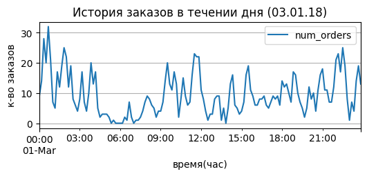
    


Произведём ресемплирование по одному часу и по одному дню


```python
data = data.resample('1H').sum()
data_d = data.resample('1D').sum()
data['2018-03-01':'2018-03-01'].plot(figsize=(6,2), grid=True,
                                     xlabel='время(час)', ylabel='к-во заказов',
                                     title='Ресемплирование по 1 часу (03.01.18)');
```


    
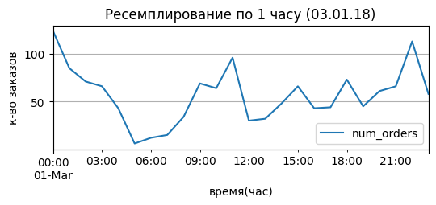
    


**Заключение**: <br/>
Проведено ряд мер подготовки данных:
- загрузка библиотек, файла с данными;
- первичный осмотр, где выяснилось, что данные представлены за период с марта по август;
- сделано ресемплирование по одному часу.

<a id='my_section_2'></a>
## [Анализ](#content_2)

<a id='my_section_3'></a>
### [Апроксимация значений](#content_3)

Изучим полученые данные


```python
data.plot(figsize=(10,4), grid=True,
          xlabel='месяц', ylabel='к-во заказов',
          title='Общее представление данных');
```


    
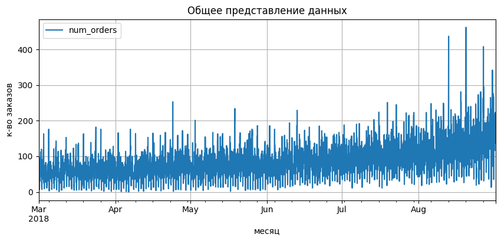
    


Оценим скользящее среднее для оценки динамики


```python
data['rolling_mean'] = data.rolling(48).median()
data.plot(figsize=(10,4), grid=True,
          xlabel='месяц', ylabel='к-во заказов',
          title='Оценка общей динамики скользящим среднем');
```


    
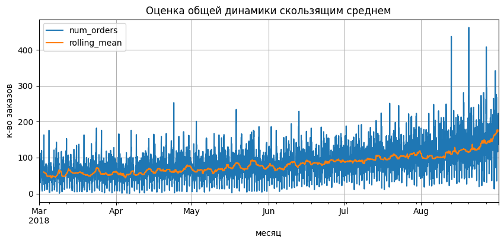
    


*Скользящее среднее определено интервало в 48 часов, таким образом заметно, что имеется тенденция на увеличение заказов в конце августа, а также в целом количество заказов растёт с марта по август. В целом заметно, что существует резкое увеличчение заказов в определённые промежутки времени.*

<a id='my_section_4'></a>
### [Анализ временных рядов](#content_4)

Чтобы лучше понимать временной ряд, разберём тренды и сезонность


```python
data = data.drop('rolling_mean', axis=1)
```


```python
decomposed = seasonal_decompose(data)
decomposed_d = seasonal_decompose(data_d)
```

<a id='my_section_5'></a>
#### [Trend](#content_5)


```python
decomposed.trend.plot(figsize=(9, 2), grid=True, title = 'Trend (ресемплинг по часу)',
                      xlabel='месяц', ylabel='к-во заказов');
```


    
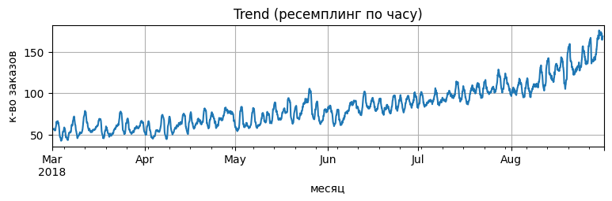
    


```python
decomposed_d.trend.plot(figsize=(9, 2), grid=True, title = 'Trend(ресемплинг по дню)',
                        xlabel='месяц', ylabel='к-во заказов'); 
```


    
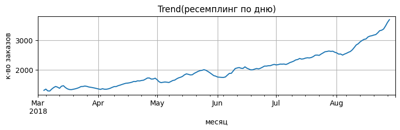
    


*На графиках можно более явно наблюдать тенденцию к увеличению заказов. Временной ряд относится к нестационарным*

<a id='my_section_6'></a>
#### [Seasonality](#content_6)

Изучим сезонную составляющую


```python
decomposed.seasonal.plot(figsize=(9, 2), grid=True, title = 'Seasonality(ресемплинг по часу)',
                         xlabel='месяц', ylabel='к-во заказов');
```


    
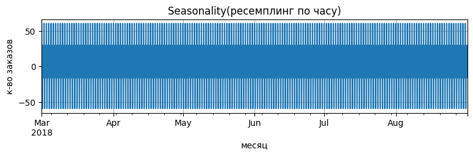
    


Уменьшим масштаб и разберём 15 дней марта месяца


```python
decomposed.seasonal['2018-03-01':'2018-03-15'].plot(figsize=(9, 2), grid=True, title = 'Seasonality(ресемплинг по часу)',
                                                    xlabel='день', ylabel='к-во заказов');
```


    
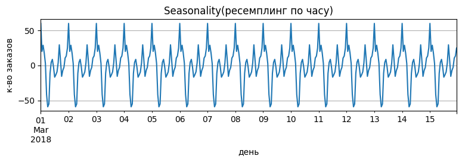
    


*Заметно, что изо дня в день наблюдается цикличность в закзах. Разберём подробнее.*


```python
decomposed.seasonal['2018-03-01':'2018-03-02'].plot(figsize=(9, 2), grid=True, title = 'Seasonality(ресемплинг по часу)',
                                                    xlabel='время(час)', ylabel='к-во заказов');
```


    
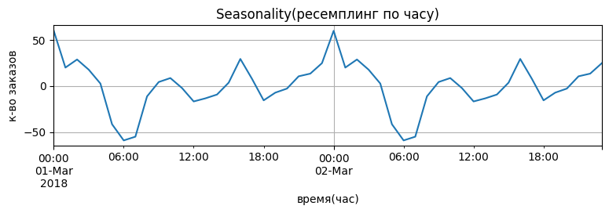
    


*Можно предположить, что работники аэропорта пользуются услугами такси, после окончания смены или во время перерывов.*

Оценим сезонность с использованием ресемплирования по одному дню


```python
decomposed_d.seasonal.plot(figsize=(9, 2), grid=True, title = 'Seasonality(ресемплинг по дню)',
                          xlabel='месяц', ylabel='к-во заказов');
```


    
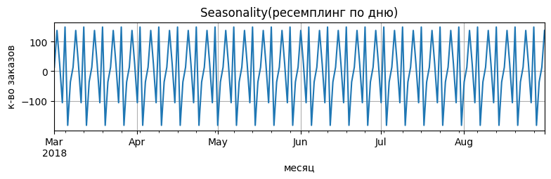
    


*Цикличность имеется на всем интервале*

<a id='my_section_7'></a>
#### [Residuals](#content_7)

Посмотрим на остаток от декомпозиции, используя разные ресемплинги и разное время


```python
decomposed.resid['2018-03-01':'2018-03-15']\
.plot(figsize=(9, 2), grid=True, title = 'Residuals(ресемплинг по часу)',
      xlabel='день', ylabel='к-во заказов');
```


    
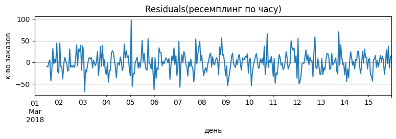
    


*Наблюдаются пики активности в разные дни марта. Посмотрим, что получится узнать, если использовать однодневный ресемплинг.*


```python
decomposed_d.resid\
.plot(figsize=(9, 2), grid=True, title = 'Residuals(ресемплинг по дню)',
      xlabel='месяц', ylabel='к-во заказов');
```


    
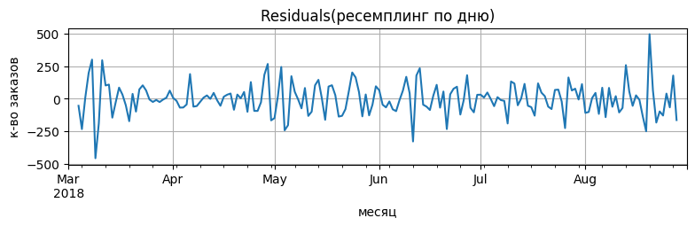
    


*Можно судить о пиках в разные месяцы, вероятно, вызванные уходами в отпуска. Веротяно, дать лучшую оценку позволит метод `rolling`.*

Изучим шум за первые 30 дней марта. 


```python
decomposed.resid['2018-03-01':'2018-03-30'].rolling(48).median()\
.plot(figsize=(9, 2), grid=True, title = 'Residuals(ресемплинг по часу)',
      xlabel='день', ylabel='к-во заказов');
```


    
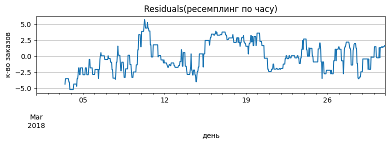
    


*Используя `rolling` по 2 дням, не удалось наглядно наблюдать скачкообразность, полученную на мелкомасштабном графике выше. Вероятно, что такой результат получается, благодаря нескольким пикам с 05.03 по 12.03. В целом необходимость прогнозирования, изучая подобные графики более чем оправдана.*

Используем ресемплинг по 1 дню и посмотрим на результат для всего набора данных. Апроксимируем значения по 3 дням.


```python
decomposed_d.resid.rolling(3).median()\
.plot(figsize=(9, 2), grid=True, title = 'Residuals(ресемплинг по дню)',
     xlabel='месяц', ylabel='к-во заказов');
```


    
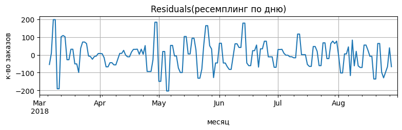
    


*Полученный результат говорит о непостоянной активности и о критичной необходимости в динамическом распределении таксистов во времена пиковой нагрузки.*

<a id='my_section_8'></a>
### [Заключение](#content_8)

Предварительный осмотр выявил, что имеется тенденция на увеличение заказов в конце августа, а также в целом количество заказов растёт с марта по август, т.е. необходимо привести набор данных к стационарному виду. В целом заметно, что существует резкое увеличение заказов в определённые промежутки времени. Анализ временных рядов дал следующие результаты:
- Тренд: подтвердилась динамика увеличения заказов с марта по август.;
- Сезонность: обнаружилась закономерность, соблюдающаяся на всём промежутке времени, предположительно, причиной являются сотрудники аэропорта.
- Остаток декомпозиции: предположительно, этот остаток составляют граждане, отправляющиеся в отпуска или по иным причинам в путешествие. 

<a id='my_section_9'></a>
## [Работа с признаками](#content_9)

Проведём ряд мероприятий для подготовки к обучению

<a id='my_section_10'></a>
### [Создание признаков](#content_10)

Определим функцию для увеличения количества признаков


```python
def make_features(data, max_lag, rolling_mean_size):
    new_data = data.copy()
    new_data['year'] = new_data.index.year
    new_data['month'] = new_data.index.month
    new_data['day'] = new_data.index.day
    new_data['dayofweek'] = new_data.index.dayofweek
    
    for lag in range(1, max_lag + 1):
        new_data['lag_{}'.format(lag)] = new_data['num_orders'].shift(lag)

    new_data['rolling_mean'] = new_data['num_orders'].shift().rolling(rolling_mean_size).median()
    return new_data


data = make_features(data, 24, 24)
```


```python
data.head(5)
```


<div>
<style scoped>
    .dataframe tbody tr th:only-of-type {
        vertical-align: middle;
    }

    .dataframe tbody tr th {
        vertical-align: top;
    }

    .dataframe thead th {
        text-align: right;
    }
</style>
<table border="1" class="dataframe">
  <thead>
    <tr style="text-align: right;">
      <th></th>
      <th>num_orders</th>
      <th>year</th>
      <th>month</th>
      <th>day</th>
      <th>dayofweek</th>
      <th>lag_1</th>
      <th>lag_2</th>
      <th>lag_3</th>
      <th>lag_4</th>
      <th>lag_5</th>
      <th>...</th>
      <th>lag_16</th>
      <th>lag_17</th>
      <th>lag_18</th>
      <th>lag_19</th>
      <th>lag_20</th>
      <th>lag_21</th>
      <th>lag_22</th>
      <th>lag_23</th>
      <th>lag_24</th>
      <th>rolling_mean</th>
    </tr>
    <tr>
      <th>datetime</th>
      <th></th>
      <th></th>
      <th></th>
      <th></th>
      <th></th>
      <th></th>
      <th></th>
      <th></th>
      <th></th>
      <th></th>
      <th></th>
      <th></th>
      <th></th>
      <th></th>
      <th></th>
      <th></th>
      <th></th>
      <th></th>
      <th></th>
      <th></th>
      <th></th>
    </tr>
  </thead>
  <tbody>
    <tr>
      <th>2018-03-01 00:00:00</th>
      <td>124</td>
      <td>2018</td>
      <td>3</td>
      <td>1</td>
      <td>3</td>
      <td>NaN</td>
      <td>NaN</td>
      <td>NaN</td>
      <td>NaN</td>
      <td>NaN</td>
      <td>...</td>
      <td>NaN</td>
      <td>NaN</td>
      <td>NaN</td>
      <td>NaN</td>
      <td>NaN</td>
      <td>NaN</td>
      <td>NaN</td>
      <td>NaN</td>
      <td>NaN</td>
      <td>NaN</td>
    </tr>
    <tr>
      <th>2018-03-01 01:00:00</th>
      <td>85</td>
      <td>2018</td>
      <td>3</td>
      <td>1</td>
      <td>3</td>
      <td>124.0</td>
      <td>NaN</td>
      <td>NaN</td>
      <td>NaN</td>
      <td>NaN</td>
      <td>...</td>
      <td>NaN</td>
      <td>NaN</td>
      <td>NaN</td>
      <td>NaN</td>
      <td>NaN</td>
      <td>NaN</td>
      <td>NaN</td>
      <td>NaN</td>
      <td>NaN</td>
      <td>NaN</td>
    </tr>
    <tr>
      <th>2018-03-01 02:00:00</th>
      <td>71</td>
      <td>2018</td>
      <td>3</td>
      <td>1</td>
      <td>3</td>
      <td>85.0</td>
      <td>124.0</td>
      <td>NaN</td>
      <td>NaN</td>
      <td>NaN</td>
      <td>...</td>
      <td>NaN</td>
      <td>NaN</td>
      <td>NaN</td>
      <td>NaN</td>
      <td>NaN</td>
      <td>NaN</td>
      <td>NaN</td>
      <td>NaN</td>
      <td>NaN</td>
      <td>NaN</td>
    </tr>
    <tr>
      <th>2018-03-01 03:00:00</th>
      <td>66</td>
      <td>2018</td>
      <td>3</td>
      <td>1</td>
      <td>3</td>
      <td>71.0</td>
      <td>85.0</td>
      <td>124.0</td>
      <td>NaN</td>
      <td>NaN</td>
      <td>...</td>
      <td>NaN</td>
      <td>NaN</td>
      <td>NaN</td>
      <td>NaN</td>
      <td>NaN</td>
      <td>NaN</td>
      <td>NaN</td>
      <td>NaN</td>
      <td>NaN</td>
      <td>NaN</td>
    </tr>
    <tr>
      <th>2018-03-01 04:00:00</th>
      <td>43</td>
      <td>2018</td>
      <td>3</td>
      <td>1</td>
      <td>3</td>
      <td>66.0</td>
      <td>71.0</td>
      <td>85.0</td>
      <td>124.0</td>
      <td>NaN</td>
      <td>...</td>
      <td>NaN</td>
      <td>NaN</td>
      <td>NaN</td>
      <td>NaN</td>
      <td>NaN</td>
      <td>NaN</td>
      <td>NaN</td>
      <td>NaN</td>
      <td>NaN</td>
      <td>NaN</td>
    </tr>
  </tbody>
</table>
<p>5 rows × 30 columns</p>
</div>


<a id='my_section_11'></a>
### [Подготовка признаков](#content_11)

Определим функцию для разделение выборки на обучающие признаки и целевой


```python
def split_into_signs(sign):
    features_train = sign.drop('num_orders', axis=1)
    target_train = sign['num_orders']
    return features_train, target_train
```

Определим функцию для контроля значений


```python
def check_val_signs():
    dict_signs = {'features_train':train, 'features_valid':valid, 'features_test':test}
    print('Количество объектов в выборках')
    for key, val in dict_signs.items():
        print(f'{key}: {val.shape[0]} {val.shape[0]/data.shape[0] :.2f}')
```

Разделим набор данных на выборки, ориентируясь на критерий.


```python
train, valid = train_test_split(data, shuffle=False, test_size=.4)
valid, test = train_test_split(valid, shuffle=False, test_size=.25)
train = train.dropna()
```

Определим обучающий и целевой признак


```python
features_train, target_train = split_into_signs(train)
features_valid, target_valid = split_into_signs(valid)
features_test, target_test = split_into_signs(test)
```


```python
check_val_signs()
```

    Количество объектов в выборках
    features_train: 2625 0.59
    features_valid: 1325 0.30
    features_test: 442 0.10
    

<a id='my_section_12'></a>
## [Обучение](#content_12)

<a id='my_section_13'></a>
### [LinearRegression](#content_13)


```python
model = LinearRegression()
```


```python
%%time
model.fit(features_train, target_train)
predicted_valid = model.predict(features_valid)
rmse = mean_squared_error(target_valid, predicted_valid) ** 0.5
print('RMSE', rmse)
```

    RMSE 30.578585679522877
    CPU times: total: 15.6 ms
    Wall time: 8.98 ms
    

<a id='my_section_14'></a>
### [LightGBM](#content_14)


```python
# Создание датасета
train_dataset = lgb.Dataset(features_train, target_train, feature_name=features_train.columns.tolist())                    
valid_dataset = lgb.Dataset(features_valid, target_valid, feature_name=features_valid.columns.tolist())               
```


```python
%%time
best_lgbm_rmse = 100
for lea in range(15, 40, 1):
    for depth in range(3, 17, 1):
        # Определение параметров модели
        params = {
            'objective': 'regression',
            'metric': 'rmse',
            'boosting_type': 'gbdt',
            'num_leaves': lea,
            'max_depth':depth,
            'learning_rate': 0.05,
            'verbose': -1
        }

        # Обучение модели
        booster = lgb.train(params, train_set=train_dataset, valid_sets=[train_dataset, valid_dataset],
                            num_boost_round=500, callbacks=[lgb.log_evaluation(period=100),lgb.early_stopping(10)])
        
        valid_prediction = booster.predict(features_valid)
        result = mean_squared_error(target_valid, valid_prediction)**0.5
        
        if result <= best_lgbm_rmse:
            best_lgbm_rmse = result
            best_lgbm_model = booster
            best_lgbm_params = params
        
    
```

    Training until validation scores don't improve for 10 rounds
    [100]	training's rmse: 19.09	valid_1's rmse: 33.1792
    [200]	training's rmse: 17.4825	valid_1's rmse: 32.4153
    Early stopping, best iteration is:
    [279]	training's rmse: 16.6401	valid_1's rmse: 31.9615
    Training until validation scores don't improve for 10 rounds
    [100]	training's rmse: 17.3646	valid_1's rmse: 32.4466
    Early stopping, best iteration is:
    [172]	training's rmse: 15.9694	valid_1's rmse: 31.4448
    Training until validation scores don't improve for 10 rounds
    [100]	training's rmse: 16.5016	valid_1's rmse: 32.2394
    [200]	training's rmse: 14.125	valid_1's rmse: 31.4601
    Early stopping, best iteration is:
    [207]	training's rmse: 13.9707	valid_1's rmse: 31.374
    Training until validation scores don't improve for 10 rounds
    [100]	training's rmse: 16.224	valid_1's rmse: 32.202
    Early stopping, best iteration is:
    [137]	training's rmse: 15.1292	valid_1's rmse: 31.7234
    Training until validation scores don't improve for 10 rounds
    [100]	training's rmse: 16.0684	valid_1's rmse: 31.7978
    Early stopping, best iteration is:
    [119]	training's rmse: 15.4561	valid_1's rmse: 31.5974
    Training until validation scores don't improve for 10 rounds
    [100]	training's rmse: 15.9909	valid_1's rmse: 31.8655
    [200]	training's rmse: 13.269	valid_1's rmse: 31.1845
    Early stopping, best iteration is:
    [191]	training's rmse: 13.4776	valid_1's rmse: 31.1453
    Training until validation scores don't improve for 10 rounds
    [100]	training's rmse: 15.9286	valid_1's rmse: 31.754
    Early stopping, best iteration is:
    [155]	training's rmse: 14.2401	valid_1's rmse: 31.1485
    Training until validation scores don't improve for 10 rounds
    [100]	training's rmse: 15.9318	valid_1's rmse: 31.9214
    [200]	training's rmse: 13.1854	valid_1's rmse: 31.23
    Early stopping, best iteration is:
    [194]	training's rmse: 13.3262	valid_1's rmse: 31.2145
    Training until validation scores don't improve for 10 rounds
    [100]	training's rmse: 15.9649	valid_1's rmse: 32.0196
    Early stopping, best iteration is:
    [178]	training's rmse: 13.6908	valid_1's rmse: 31.3817
    Training until validation scores don't improve for 10 rounds
    [100]	training's rmse: 15.9643	valid_1's rmse: 31.9146
    Early stopping, best iteration is:
    [170]	training's rmse: 13.9224	valid_1's rmse: 31.2831
    Training until validation scores don't improve for 10 rounds
    [100]	training's rmse: 15.9643	valid_1's rmse: 31.9146
    Early stopping, best iteration is:
    [170]	training's rmse: 13.9224	valid_1's rmse: 31.2831
    Training until validation scores don't improve for 10 rounds
    [100]	training's rmse: 15.9643	valid_1's rmse: 31.9146
    Early stopping, best iteration is:
    [170]	training's rmse: 13.9224	valid_1's rmse: 31.2831
    Training until validation scores don't improve for 10 rounds
    [100]	training's rmse: 15.9643	valid_1's rmse: 31.9146
    Early stopping, best iteration is:
    [170]	training's rmse: 13.9224	valid_1's rmse: 31.2831
    Training until validation scores don't improve for 10 rounds
    [100]	training's rmse: 15.9643	valid_1's rmse: 31.9146
    Early stopping, best iteration is:
    [170]	training's rmse: 13.9224	valid_1's rmse: 31.2831
    Training until validation scores don't improve for 10 rounds
    [100]	training's rmse: 19.09	valid_1's rmse: 33.1792
    [200]	training's rmse: 17.4825	valid_1's rmse: 32.4153
    Early stopping, best iteration is:
    [279]	training's rmse: 16.6401	valid_1's rmse: 31.9615
    Training until validation scores don't improve for 10 rounds
    [100]	training's rmse: 17.3324	valid_1's rmse: 32.4391
    Early stopping, best iteration is:
    [179]	training's rmse: 15.6405	valid_1's rmse: 31.6164
    Training until validation scores don't improve for 10 rounds
    [100]	training's rmse: 16.2708	valid_1's rmse: 32.2197
    Early stopping, best iteration is:
    [158]	training's rmse: 14.7669	valid_1's rmse: 31.5467
    Training until validation scores don't improve for 10 rounds
    [100]	training's rmse: 15.9159	valid_1's rmse: 32.1735
    [200]	training's rmse: 13.3055	valid_1's rmse: 31.1636
    Early stopping, best iteration is:
    [194]	training's rmse: 13.4368	valid_1's rmse: 31.1514
    Training until validation scores don't improve for 10 rounds
    [100]	training's rmse: 15.7961	valid_1's rmse: 31.9951
    Early stopping, best iteration is:
    [171]	training's rmse: 13.762	valid_1's rmse: 31.3446
    Training until validation scores don't improve for 10 rounds
    [100]	training's rmse: 15.7155	valid_1's rmse: 31.6208
    Early stopping, best iteration is:
    [177]	training's rmse: 13.4706	valid_1's rmse: 31.0912
    Training until validation scores don't improve for 10 rounds
    [100]	training's rmse: 15.6753	valid_1's rmse: 31.8304
    Early stopping, best iteration is:
    [156]	training's rmse: 14.0089	valid_1's rmse: 31.3463
    Training until validation scores don't improve for 10 rounds
    [100]	training's rmse: 15.6634	valid_1's rmse: 31.8848
    Early stopping, best iteration is:
    [143]	training's rmse: 14.2979	valid_1's rmse: 31.2876
    Training until validation scores don't improve for 10 rounds
    [100]	training's rmse: 15.6539	valid_1's rmse: 31.8395
    Early stopping, best iteration is:
    [173]	training's rmse: 13.5264	valid_1's rmse: 31.3738
    Training until validation scores don't improve for 10 rounds
    [100]	training's rmse: 15.6901	valid_1's rmse: 31.8875
    Early stopping, best iteration is:
    [160]	training's rmse: 13.8465	valid_1's rmse: 31.2498
    Training until validation scores don't improve for 10 rounds
    [100]	training's rmse: 15.6901	valid_1's rmse: 31.8875
    Early stopping, best iteration is:
    [160]	training's rmse: 13.8465	valid_1's rmse: 31.2498
    Training until validation scores don't improve for 10 rounds
    [100]	training's rmse: 15.6901	valid_1's rmse: 31.8875
    Early stopping, best iteration is:
    [160]	training's rmse: 13.8465	valid_1's rmse: 31.2498
    Training until validation scores don't improve for 10 rounds
    [100]	training's rmse: 15.6901	valid_1's rmse: 31.8875
    Early stopping, best iteration is:
    [160]	training's rmse: 13.8465	valid_1's rmse: 31.2498
    Training until validation scores don't improve for 10 rounds
    [100]	training's rmse: 15.6901	valid_1's rmse: 31.8875
    Early stopping, best iteration is:
    [160]	training's rmse: 13.8465	valid_1's rmse: 31.2498
    Training until validation scores don't improve for 10 rounds
    [100]	training's rmse: 19.09	valid_1's rmse: 33.1792
    [200]	training's rmse: 17.4825	valid_1's rmse: 32.4153
    Early stopping, best iteration is:
    [279]	training's rmse: 16.6401	valid_1's rmse: 31.9615
    Training until validation scores don't improve for 10 rounds
    [100]	training's rmse: 17.3324	valid_1's rmse: 32.4391
    Early stopping, best iteration is:
    [179]	training's rmse: 15.6405	valid_1's rmse: 31.6164
    Training until validation scores don't improve for 10 rounds
    [100]	training's rmse: 16.1426	valid_1's rmse: 32.2336
    Early stopping, best iteration is:
    [169]	training's rmse: 14.4555	valid_1's rmse: 31.5913
    Training until validation scores don't improve for 10 rounds
    [100]	training's rmse: 15.6771	valid_1's rmse: 32.1
    Early stopping, best iteration is:
    [147]	training's rmse: 14.3355	valid_1's rmse: 31.6381
    Training until validation scores don't improve for 10 rounds
    [100]	training's rmse: 15.4925	valid_1's rmse: 31.9219
    Early stopping, best iteration is:
    [163]	training's rmse: 13.5724	valid_1's rmse: 31.3238
    Training until validation scores don't improve for 10 rounds
    [100]	training's rmse: 15.4567	valid_1's rmse: 31.6626
    Early stopping, best iteration is:
    [136]	training's rmse: 14.2561	valid_1's rmse: 31.2929
    Training until validation scores don't improve for 10 rounds
    [100]	training's rmse: 15.4335	valid_1's rmse: 31.6575
    Early stopping, best iteration is:
    [188]	training's rmse: 12.8407	valid_1's rmse: 31.1441
    Training until validation scores don't improve for 10 rounds
    [100]	training's rmse: 15.3808	valid_1's rmse: 31.5774
    Early stopping, best iteration is:
    [160]	training's rmse: 13.5366	valid_1's rmse: 31.2302
    Training until validation scores don't improve for 10 rounds
    [100]	training's rmse: 15.3463	valid_1's rmse: 31.5388
    Early stopping, best iteration is:
    [154]	training's rmse: 13.6273	valid_1's rmse: 31.1509
    Training until validation scores don't improve for 10 rounds
    [100]	training's rmse: 15.3605	valid_1's rmse: 31.6086
    Early stopping, best iteration is:
    [166]	training's rmse: 13.342	valid_1's rmse: 31.1271
    Training until validation scores don't improve for 10 rounds
    [100]	training's rmse: 15.3615	valid_1's rmse: 31.5826
    Early stopping, best iteration is:
    [135]	training's rmse: 14.1904	valid_1's rmse: 31.2101
    Training until validation scores don't improve for 10 rounds
    [100]	training's rmse: 15.3615	valid_1's rmse: 31.5826
    Early stopping, best iteration is:
    [135]	training's rmse: 14.1904	valid_1's rmse: 31.2101
    Training until validation scores don't improve for 10 rounds
    [100]	training's rmse: 15.3615	valid_1's rmse: 31.5826
    Early stopping, best iteration is:
    [135]	training's rmse: 14.1904	valid_1's rmse: 31.2101
    Training until validation scores don't improve for 10 rounds
    [100]	training's rmse: 15.3615	valid_1's rmse: 31.5826
    Early stopping, best iteration is:
    [135]	training's rmse: 14.1904	valid_1's rmse: 31.2101
    Training until validation scores don't improve for 10 rounds
    [100]	training's rmse: 19.09	valid_1's rmse: 33.1792
    [200]	training's rmse: 17.4825	valid_1's rmse: 32.4153
    Early stopping, best iteration is:
    [279]	training's rmse: 16.6401	valid_1's rmse: 31.9615
    Training until validation scores don't improve for 10 rounds
    [100]	training's rmse: 17.3324	valid_1's rmse: 32.4391
    Early stopping, best iteration is:
    [179]	training's rmse: 15.6405	valid_1's rmse: 31.6164
    Training until validation scores don't improve for 10 rounds
    [100]	training's rmse: 15.9747	valid_1's rmse: 32.2296
    Early stopping, best iteration is:
    [142]	training's rmse: 14.8605	valid_1's rmse: 31.6194
    Training until validation scores don't improve for 10 rounds
    [100]	training's rmse: 15.5609	valid_1's rmse: 31.8619
    Early stopping, best iteration is:
    [151]	training's rmse: 13.9993	valid_1's rmse: 31.3794
    Training until validation scores don't improve for 10 rounds
    [100]	training's rmse: 15.3258	valid_1's rmse: 31.6732
    Early stopping, best iteration is:
    [143]	training's rmse: 13.9521	valid_1's rmse: 31.3953
    Training until validation scores don't improve for 10 rounds
    [100]	training's rmse: 15.2109	valid_1's rmse: 31.8215
    Early stopping, best iteration is:
    [145]	training's rmse: 13.7181	valid_1's rmse: 31.3977
    Training until validation scores don't improve for 10 rounds
    [100]	training's rmse: 15.2077	valid_1's rmse: 31.808
    Early stopping, best iteration is:
    [126]	training's rmse: 14.2905	valid_1's rmse: 31.6129
    Training until validation scores don't improve for 10 rounds
    [100]	training's rmse: 15.1572	valid_1's rmse: 31.6774
    Early stopping, best iteration is:
    [128]	training's rmse: 14.1582	valid_1's rmse: 31.3889
    Training until validation scores don't improve for 10 rounds
    [100]	training's rmse: 15.1583	valid_1's rmse: 31.8111
    Early stopping, best iteration is:
    [142]	training's rmse: 13.737	valid_1's rmse: 31.3984
    Training until validation scores don't improve for 10 rounds
    [100]	training's rmse: 15.0858	valid_1's rmse: 31.8211
    Early stopping, best iteration is:
    [154]	training's rmse: 13.3328	valid_1's rmse: 31.2775
    Training until validation scores don't improve for 10 rounds
    [100]	training's rmse: 15.0858	valid_1's rmse: 31.8211
    Early stopping, best iteration is:
    [138]	training's rmse: 13.8252	valid_1's rmse: 31.371
    Training until validation scores don't improve for 10 rounds
    [100]	training's rmse: 15.0858	valid_1's rmse: 31.8211
    Early stopping, best iteration is:
    [138]	training's rmse: 13.8252	valid_1's rmse: 31.371
    Training until validation scores don't improve for 10 rounds
    [100]	training's rmse: 15.0858	valid_1's rmse: 31.8211
    Early stopping, best iteration is:
    [138]	training's rmse: 13.8252	valid_1's rmse: 31.371
    Training until validation scores don't improve for 10 rounds
    [100]	training's rmse: 15.0858	valid_1's rmse: 31.8211
    Early stopping, best iteration is:
    [138]	training's rmse: 13.8252	valid_1's rmse: 31.371
    Training until validation scores don't improve for 10 rounds
    [100]	training's rmse: 19.09	valid_1's rmse: 33.1792
    [200]	training's rmse: 17.4825	valid_1's rmse: 32.4153
    Early stopping, best iteration is:
    [279]	training's rmse: 16.6401	valid_1's rmse: 31.9615
    Training until validation scores don't improve for 10 rounds
    [100]	training's rmse: 17.3324	valid_1's rmse: 32.4391
    Early stopping, best iteration is:
    [179]	training's rmse: 15.6405	valid_1's rmse: 31.6164
    Training until validation scores don't improve for 10 rounds
    [100]	training's rmse: 15.9973	valid_1's rmse: 32.2402
    Early stopping, best iteration is:
    [165]	training's rmse: 14.2303	valid_1's rmse: 31.3162
    Training until validation scores don't improve for 10 rounds
    [100]	training's rmse: 15.375	valid_1's rmse: 31.9228
    Early stopping, best iteration is:
    [152]	training's rmse: 13.83	valid_1's rmse: 31.575
    Training until validation scores don't improve for 10 rounds
    [100]	training's rmse: 15.1121	valid_1's rmse: 31.9712
    Early stopping, best iteration is:
    [121]	training's rmse: 14.394	valid_1's rmse: 31.8259
    Training until validation scores don't improve for 10 rounds
    [100]	training's rmse: 14.9811	valid_1's rmse: 31.6803
    Early stopping, best iteration is:
    [134]	training's rmse: 13.831	valid_1's rmse: 31.4624
    Training until validation scores don't improve for 10 rounds
    [100]	training's rmse: 14.9338	valid_1's rmse: 31.6542
    Early stopping, best iteration is:
    [161]	training's rmse: 12.9409	valid_1's rmse: 31.1942
    Training until validation scores don't improve for 10 rounds
    [100]	training's rmse: 14.935	valid_1's rmse: 31.5726
    Early stopping, best iteration is:
    [133]	training's rmse: 13.7734	valid_1's rmse: 31.2993
    Training until validation scores don't improve for 10 rounds
    [100]	training's rmse: 14.8623	valid_1's rmse: 31.6693
    Early stopping, best iteration is:
    [110]	training's rmse: 14.4753	valid_1's rmse: 31.547
    Training until validation scores don't improve for 10 rounds
    [100]	training's rmse: 14.9082	valid_1's rmse: 31.6797
    Early stopping, best iteration is:
    [151]	training's rmse: 13.166	valid_1's rmse: 31.2442
    Training until validation scores don't improve for 10 rounds
    [100]	training's rmse: 14.891	valid_1's rmse: 31.8262
    Early stopping, best iteration is:
    [129]	training's rmse: 13.8251	valid_1's rmse: 31.5632
    Training until validation scores don't improve for 10 rounds
    [100]	training's rmse: 14.9028	valid_1's rmse: 31.7809
    Early stopping, best iteration is:
    [168]	training's rmse: 12.7	valid_1's rmse: 31.2048
    Training until validation scores don't improve for 10 rounds
    [100]	training's rmse: 14.8679	valid_1's rmse: 31.7409
    Early stopping, best iteration is:
    [151]	training's rmse: 13.1374	valid_1's rmse: 31.2898
    Training until validation scores don't improve for 10 rounds
    [100]	training's rmse: 14.8816	valid_1's rmse: 31.7673
    Early stopping, best iteration is:
    [149]	training's rmse: 13.1948	valid_1's rmse: 31.3565
    Training until validation scores don't improve for 10 rounds
    [100]	training's rmse: 19.09	valid_1's rmse: 33.1792
    [200]	training's rmse: 17.4825	valid_1's rmse: 32.4153
    Early stopping, best iteration is:
    [279]	training's rmse: 16.6401	valid_1's rmse: 31.9615
    Training until validation scores don't improve for 10 rounds
    [100]	training's rmse: 17.3324	valid_1's rmse: 32.4391
    Early stopping, best iteration is:
    [179]	training's rmse: 15.6405	valid_1's rmse: 31.6164
    Training until validation scores don't improve for 10 rounds
    [100]	training's rmse: 15.7209	valid_1's rmse: 32.1577
    Early stopping, best iteration is:
    [144]	training's rmse: 14.5882	valid_1's rmse: 31.6521
    Training until validation scores don't improve for 10 rounds
    [100]	training's rmse: 15.167	valid_1's rmse: 32.0208
    Early stopping, best iteration is:
    [167]	training's rmse: 13.2839	valid_1's rmse: 31.4157
    Training until validation scores don't improve for 10 rounds
    [100]	training's rmse: 14.958	valid_1's rmse: 31.7282
    Early stopping, best iteration is:
    [106]	training's rmse: 14.6986	valid_1's rmse: 31.595
    Training until validation scores don't improve for 10 rounds
    [100]	training's rmse: 14.7832	valid_1's rmse: 31.8361
    Early stopping, best iteration is:
    [115]	training's rmse: 14.2149	valid_1's rmse: 31.6718
    Training until validation scores don't improve for 10 rounds
    [100]	training's rmse: 14.705	valid_1's rmse: 31.3843
    Early stopping, best iteration is:
    [168]	training's rmse: 12.485	valid_1's rmse: 30.9963
    Training until validation scores don't improve for 10 rounds
    [100]	training's rmse: 14.6826	valid_1's rmse: 31.6362
    Early stopping, best iteration is:
    [125]	training's rmse: 13.7176	valid_1's rmse: 31.4141
    Training until validation scores don't improve for 10 rounds
    [100]	training's rmse: 14.7031	valid_1's rmse: 31.6179
    Early stopping, best iteration is:
    [186]	training's rmse: 11.9395	valid_1's rmse: 31.1756
    Training until validation scores don't improve for 10 rounds
    [100]	training's rmse: 14.6415	valid_1's rmse: 31.5109
    Early stopping, best iteration is:
    [128]	training's rmse: 13.5921	valid_1's rmse: 31.3574
    Training until validation scores don't improve for 10 rounds
    [100]	training's rmse: 14.6484	valid_1's rmse: 31.621
    Early stopping, best iteration is:
    [120]	training's rmse: 13.8938	valid_1's rmse: 31.5325
    Training until validation scores don't improve for 10 rounds
    [100]	training's rmse: 14.6563	valid_1's rmse: 31.5227
    Early stopping, best iteration is:
    [146]	training's rmse: 13.0045	valid_1's rmse: 31.3299
    Training until validation scores don't improve for 10 rounds
    [100]	training's rmse: 14.6563	valid_1's rmse: 31.5227
    Early stopping, best iteration is:
    [142]	training's rmse: 13.139	valid_1's rmse: 31.3388
    Training until validation scores don't improve for 10 rounds
    [100]	training's rmse: 14.6563	valid_1's rmse: 31.5227
    Early stopping, best iteration is:
    [142]	training's rmse: 13.139	valid_1's rmse: 31.3388
    Training until validation scores don't improve for 10 rounds
    [100]	training's rmse: 19.09	valid_1's rmse: 33.1792
    [200]	training's rmse: 17.4825	valid_1's rmse: 32.4153
    Early stopping, best iteration is:
    [279]	training's rmse: 16.6401	valid_1's rmse: 31.9615
    Training until validation scores don't improve for 10 rounds
    [100]	training's rmse: 17.3324	valid_1's rmse: 32.4391
    Early stopping, best iteration is:
    [179]	training's rmse: 15.6405	valid_1's rmse: 31.6164
    Training until validation scores don't improve for 10 rounds
    [100]	training's rmse: 15.6471	valid_1's rmse: 32.011
    Early stopping, best iteration is:
    [182]	training's rmse: 13.7011	valid_1's rmse: 31.313
    Training until validation scores don't improve for 10 rounds
    [100]	training's rmse: 15.0305	valid_1's rmse: 32.0226
    Early stopping, best iteration is:
    [158]	training's rmse: 13.3613	valid_1's rmse: 31.5749
    Training until validation scores don't improve for 10 rounds
    [100]	training's rmse: 14.6383	valid_1's rmse: 31.8697
    Early stopping, best iteration is:
    [131]	training's rmse: 13.6001	valid_1's rmse: 31.5628
    Training until validation scores don't improve for 10 rounds
    [100]	training's rmse: 14.5804	valid_1's rmse: 31.7353
    Early stopping, best iteration is:
    [118]	training's rmse: 13.9702	valid_1's rmse: 31.6096
    Training until validation scores don't improve for 10 rounds
    [100]	training's rmse: 14.4961	valid_1's rmse: 31.6266
    Early stopping, best iteration is:
    [145]	training's rmse: 12.9155	valid_1's rmse: 31.3699
    Training until validation scores don't improve for 10 rounds
    [100]	training's rmse: 14.461	valid_1's rmse: 31.7246
    Early stopping, best iteration is:
    [119]	training's rmse: 13.7171	valid_1's rmse: 31.4558
    Training until validation scores don't improve for 10 rounds
    [100]	training's rmse: 14.4099	valid_1's rmse: 31.7293
    Early stopping, best iteration is:
    [175]	training's rmse: 11.9439	valid_1's rmse: 31.4369
    Training until validation scores don't improve for 10 rounds
    [100]	training's rmse: 14.397	valid_1's rmse: 31.5947
    Early stopping, best iteration is:
    [140]	training's rmse: 12.9853	valid_1's rmse: 31.3964
    Training until validation scores don't improve for 10 rounds
    [100]	training's rmse: 14.4053	valid_1's rmse: 31.7768
    Early stopping, best iteration is:
    [145]	training's rmse: 12.7566	valid_1's rmse: 31.4042
    Training until validation scores don't improve for 10 rounds
    [100]	training's rmse: 14.4053	valid_1's rmse: 31.7768
    Early stopping, best iteration is:
    [160]	training's rmse: 12.2793	valid_1's rmse: 31.339
    Training until validation scores don't improve for 10 rounds
    [100]	training's rmse: 14.4053	valid_1's rmse: 31.7768
    Early stopping, best iteration is:
    [160]	training's rmse: 12.2793	valid_1's rmse: 31.339
    Training until validation scores don't improve for 10 rounds
    [100]	training's rmse: 14.4053	valid_1's rmse: 31.7768
    Early stopping, best iteration is:
    [160]	training's rmse: 12.2793	valid_1's rmse: 31.339
    Training until validation scores don't improve for 10 rounds
    [100]	training's rmse: 19.09	valid_1's rmse: 33.1792
    [200]	training's rmse: 17.4825	valid_1's rmse: 32.4153
    Early stopping, best iteration is:
    [279]	training's rmse: 16.6401	valid_1's rmse: 31.9615
    Training until validation scores don't improve for 10 rounds
    [100]	training's rmse: 17.3324	valid_1's rmse: 32.4391
    Early stopping, best iteration is:
    [179]	training's rmse: 15.6405	valid_1's rmse: 31.6164
    Training until validation scores don't improve for 10 rounds
    [100]	training's rmse: 15.72	valid_1's rmse: 32.3696
    [200]	training's rmse: 13.3202	valid_1's rmse: 31.4655
    Early stopping, best iteration is:
    [193]	training's rmse: 13.4764	valid_1's rmse: 31.4432
    Training until validation scores don't improve for 10 rounds
    [100]	training's rmse: 14.9898	valid_1's rmse: 32.1013
    Early stopping, best iteration is:
    [174]	training's rmse: 12.9548	valid_1's rmse: 31.7021
    Training until validation scores don't improve for 10 rounds
    [100]	training's rmse: 14.5295	valid_1's rmse: 32.0521
    Early stopping, best iteration is:
    [137]	training's rmse: 13.3662	valid_1's rmse: 31.786
    Training until validation scores don't improve for 10 rounds
    [100]	training's rmse: 14.3378	valid_1's rmse: 31.6924
    Early stopping, best iteration is:
    [120]	training's rmse: 13.5538	valid_1's rmse: 31.5592
    Training until validation scores don't improve for 10 rounds
    [100]	training's rmse: 14.2472	valid_1's rmse: 31.5533
    Early stopping, best iteration is:
    [119]	training's rmse: 13.5175	valid_1's rmse: 31.352
    Training until validation scores don't improve for 10 rounds
    [100]	training's rmse: 14.1939	valid_1's rmse: 31.8116
    Early stopping, best iteration is:
    [121]	training's rmse: 13.3736	valid_1's rmse: 31.7185
    Training until validation scores don't improve for 10 rounds
    [100]	training's rmse: 14.2622	valid_1's rmse: 31.7549
    Early stopping, best iteration is:
    [120]	training's rmse: 13.4234	valid_1's rmse: 31.5133
    Training until validation scores don't improve for 10 rounds
    [100]	training's rmse: 14.2279	valid_1's rmse: 31.5945
    Early stopping, best iteration is:
    [118]	training's rmse: 13.4954	valid_1's rmse: 31.4119
    Training until validation scores don't improve for 10 rounds
    [100]	training's rmse: 14.2209	valid_1's rmse: 31.737
    Early stopping, best iteration is:
    [147]	training's rmse: 12.4615	valid_1's rmse: 31.469
    Training until validation scores don't improve for 10 rounds
    [100]	training's rmse: 14.2297	valid_1's rmse: 31.773
    Early stopping, best iteration is:
    [130]	training's rmse: 13.0744	valid_1's rmse: 31.4666
    Training until validation scores don't improve for 10 rounds
    [100]	training's rmse: 14.2297	valid_1's rmse: 31.773
    Early stopping, best iteration is:
    [133]	training's rmse: 12.9716	valid_1's rmse: 31.4549
    Training until validation scores don't improve for 10 rounds
    [100]	training's rmse: 14.2297	valid_1's rmse: 31.773
    Early stopping, best iteration is:
    [133]	training's rmse: 12.9716	valid_1's rmse: 31.4549
    Training until validation scores don't improve for 10 rounds
    [100]	training's rmse: 19.09	valid_1's rmse: 33.1792
    [200]	training's rmse: 17.4825	valid_1's rmse: 32.4153
    Early stopping, best iteration is:
    [279]	training's rmse: 16.6401	valid_1's rmse: 31.9615
    Training until validation scores don't improve for 10 rounds
    [100]	training's rmse: 17.3324	valid_1's rmse: 32.4391
    Early stopping, best iteration is:
    [179]	training's rmse: 15.6405	valid_1's rmse: 31.6164
    Training until validation scores don't improve for 10 rounds
    [100]	training's rmse: 15.5247	valid_1's rmse: 32.5049
    Early stopping, best iteration is:
    [183]	training's rmse: 13.6005	valid_1's rmse: 31.8065
    Training until validation scores don't improve for 10 rounds
    [100]	training's rmse: 14.8113	valid_1's rmse: 31.7896
    Early stopping, best iteration is:
    [177]	training's rmse: 12.6729	valid_1's rmse: 31.409
    Training until validation scores don't improve for 10 rounds
    [100]	training's rmse: 14.3644	valid_1's rmse: 31.8045
    Early stopping, best iteration is:
    [106]	training's rmse: 14.1532	valid_1's rmse: 31.7053
    Training until validation scores don't improve for 10 rounds
    [100]	training's rmse: 14.1969	valid_1's rmse: 31.8052
    Early stopping, best iteration is:
    [140]	training's rmse: 12.8201	valid_1's rmse: 31.6074
    Training until validation scores don't improve for 10 rounds
    [100]	training's rmse: 14.0888	valid_1's rmse: 31.6283
    Early stopping, best iteration is:
    [102]	training's rmse: 13.9924	valid_1's rmse: 31.6162
    Training until validation scores don't improve for 10 rounds
    [100]	training's rmse: 14.0226	valid_1's rmse: 31.8235
    Early stopping, best iteration is:
    [108]	training's rmse: 13.6724	valid_1's rmse: 31.7279
    Training until validation scores don't improve for 10 rounds
    [100]	training's rmse: 14.0259	valid_1's rmse: 31.8767
    Early stopping, best iteration is:
    [123]	training's rmse: 13.1078	valid_1's rmse: 31.6778
    Training until validation scores don't improve for 10 rounds
    [100]	training's rmse: 13.963	valid_1's rmse: 31.8306
    Early stopping, best iteration is:
    [116]	training's rmse: 13.3008	valid_1's rmse: 31.6487
    Training until validation scores don't improve for 10 rounds
    [100]	training's rmse: 13.9607	valid_1's rmse: 31.7673
    Early stopping, best iteration is:
    [122]	training's rmse: 13.1008	valid_1's rmse: 31.6087
    Training until validation scores don't improve for 10 rounds
    [100]	training's rmse: 13.9885	valid_1's rmse: 31.6989
    Early stopping, best iteration is:
    [146]	training's rmse: 12.2884	valid_1's rmse: 31.4461
    Training until validation scores don't improve for 10 rounds
    [100]	training's rmse: 13.9519	valid_1's rmse: 31.6287
    Early stopping, best iteration is:
    [103]	training's rmse: 13.8304	valid_1's rmse: 31.5739
    Training until validation scores don't improve for 10 rounds
    [100]	training's rmse: 13.9519	valid_1's rmse: 31.6287
    Early stopping, best iteration is:
    [103]	training's rmse: 13.8304	valid_1's rmse: 31.5739
    Training until validation scores don't improve for 10 rounds
    [100]	training's rmse: 19.09	valid_1's rmse: 33.1792
    [200]	training's rmse: 17.4825	valid_1's rmse: 32.4153
    Early stopping, best iteration is:
    [279]	training's rmse: 16.6401	valid_1's rmse: 31.9615
    Training until validation scores don't improve for 10 rounds
    [100]	training's rmse: 17.3324	valid_1's rmse: 32.4391
    Early stopping, best iteration is:
    [179]	training's rmse: 15.6405	valid_1's rmse: 31.6164
    Training until validation scores don't improve for 10 rounds
    [100]	training's rmse: 15.5566	valid_1's rmse: 31.8146
    [200]	training's rmse: 13.3032	valid_1's rmse: 31.2753
    Early stopping, best iteration is:
    [193]	training's rmse: 13.4398	valid_1's rmse: 31.2472
    Training until validation scores don't improve for 10 rounds
    [100]	training's rmse: 14.6923	valid_1's rmse: 31.982
    Early stopping, best iteration is:
    [154]	training's rmse: 13.2145	valid_1's rmse: 31.5542
    Training until validation scores don't improve for 10 rounds
    [100]	training's rmse: 14.1779	valid_1's rmse: 31.8165
    Early stopping, best iteration is:
    [139]	training's rmse: 12.9155	valid_1's rmse: 31.5244
    Training until validation scores don't improve for 10 rounds
    [100]	training's rmse: 13.9857	valid_1's rmse: 31.6571
    Early stopping, best iteration is:
    [143]	training's rmse: 12.5513	valid_1's rmse: 31.3413
    Training until validation scores don't improve for 10 rounds
    [100]	training's rmse: 13.9042	valid_1's rmse: 31.4538
    Early stopping, best iteration is:
    [136]	training's rmse: 12.633	valid_1's rmse: 31.2535
    Training until validation scores don't improve for 10 rounds
    [100]	training's rmse: 13.8018	valid_1's rmse: 31.5512
    Early stopping, best iteration is:
    [121]	training's rmse: 12.9504	valid_1's rmse: 31.3467
    Training until validation scores don't improve for 10 rounds
    [100]	training's rmse: 13.8142	valid_1's rmse: 31.4836
    Early stopping, best iteration is:
    [138]	training's rmse: 12.3495	valid_1's rmse: 31.3015
    Training until validation scores don't improve for 10 rounds
    [100]	training's rmse: 13.7633	valid_1's rmse: 31.4358
    Early stopping, best iteration is:
    [132]	training's rmse: 12.4857	valid_1's rmse: 31.3026
    Training until validation scores don't improve for 10 rounds
    [100]	training's rmse: 13.7343	valid_1's rmse: 31.4082
    Early stopping, best iteration is:
    [142]	training's rmse: 12.1338	valid_1's rmse: 31.1146
    Training until validation scores don't improve for 10 rounds
    [100]	training's rmse: 13.7368	valid_1's rmse: 31.3739
    Early stopping, best iteration is:
    [144]	training's rmse: 12.0826	valid_1's rmse: 31.2131
    Training until validation scores don't improve for 10 rounds
    [100]	training's rmse: 13.7368	valid_1's rmse: 31.3739
    Early stopping, best iteration is:
    [138]	training's rmse: 12.2962	valid_1's rmse: 31.17
    Training until validation scores don't improve for 10 rounds
    [100]	training's rmse: 13.7368	valid_1's rmse: 31.3739
    Early stopping, best iteration is:
    [135]	training's rmse: 12.3872	valid_1's rmse: 31.2235
    Training until validation scores don't improve for 10 rounds
    [100]	training's rmse: 19.09	valid_1's rmse: 33.1792
    [200]	training's rmse: 17.4825	valid_1's rmse: 32.4153
    Early stopping, best iteration is:
    [279]	training's rmse: 16.6401	valid_1's rmse: 31.9615
    Training until validation scores don't improve for 10 rounds
    [100]	training's rmse: 17.3324	valid_1's rmse: 32.4391
    Early stopping, best iteration is:
    [179]	training's rmse: 15.6405	valid_1's rmse: 31.6164
    Training until validation scores don't improve for 10 rounds
    [100]	training's rmse: 15.552	valid_1's rmse: 32.1848
    [200]	training's rmse: 13.2438	valid_1's rmse: 31.4318
    Early stopping, best iteration is:
    [202]	training's rmse: 13.2225	valid_1's rmse: 31.4065
    Training until validation scores don't improve for 10 rounds
    [100]	training's rmse: 14.5551	valid_1's rmse: 32.0991
    Early stopping, best iteration is:
    [138]	training's rmse: 13.4488	valid_1's rmse: 31.7785
    Training until validation scores don't improve for 10 rounds
    [100]	training's rmse: 13.9981	valid_1's rmse: 31.7496
    Early stopping, best iteration is:
    [155]	training's rmse: 12.347	valid_1's rmse: 31.5133
    Training until validation scores don't improve for 10 rounds
    [100]	training's rmse: 13.8077	valid_1's rmse: 31.6739
    Early stopping, best iteration is:
    [126]	training's rmse: 12.8849	valid_1's rmse: 31.4554
    Training until validation scores don't improve for 10 rounds
    [100]	training's rmse: 13.6577	valid_1's rmse: 31.5734
    Early stopping, best iteration is:
    [153]	training's rmse: 11.7455	valid_1's rmse: 31.2195
    Training until validation scores don't improve for 10 rounds
    [100]	training's rmse: 13.7061	valid_1's rmse: 31.5878
    Early stopping, best iteration is:
    [124]	training's rmse: 12.6914	valid_1's rmse: 31.3801
    Training until validation scores don't improve for 10 rounds
    [100]	training's rmse: 13.6023	valid_1's rmse: 31.6805
    Early stopping, best iteration is:
    [119]	training's rmse: 12.816	valid_1's rmse: 31.5443
    Training until validation scores don't improve for 10 rounds
    [100]	training's rmse: 13.5731	valid_1's rmse: 31.5446
    Early stopping, best iteration is:
    [100]	training's rmse: 13.5731	valid_1's rmse: 31.5446
    Training until validation scores don't improve for 10 rounds
    [100]	training's rmse: 13.5684	valid_1's rmse: 31.6506
    Early stopping, best iteration is:
    [139]	training's rmse: 12.0284	valid_1's rmse: 31.4175
    Training until validation scores don't improve for 10 rounds
    [100]	training's rmse: 13.5691	valid_1's rmse: 31.5344
    Early stopping, best iteration is:
    [126]	training's rmse: 12.4913	valid_1's rmse: 31.2902
    Training until validation scores don't improve for 10 rounds
    [100]	training's rmse: 13.5791	valid_1's rmse: 31.6384
    Early stopping, best iteration is:
    [138]	training's rmse: 12.0429	valid_1's rmse: 31.3903
    Training until validation scores don't improve for 10 rounds
    [100]	training's rmse: 13.5791	valid_1's rmse: 31.6384
    Early stopping, best iteration is:
    [139]	training's rmse: 12.0091	valid_1's rmse: 31.3701
    Training until validation scores don't improve for 10 rounds
    [100]	training's rmse: 19.09	valid_1's rmse: 33.1792
    [200]	training's rmse: 17.4825	valid_1's rmse: 32.4153
    Early stopping, best iteration is:
    [279]	training's rmse: 16.6401	valid_1's rmse: 31.9615
    Training until validation scores don't improve for 10 rounds
    [100]	training's rmse: 17.3324	valid_1's rmse: 32.4391
    Early stopping, best iteration is:
    [179]	training's rmse: 15.6405	valid_1's rmse: 31.6164
    Training until validation scores don't improve for 10 rounds
    [100]	training's rmse: 15.4479	valid_1's rmse: 32.3193
    [200]	training's rmse: 13.1855	valid_1's rmse: 31.4815
    Early stopping, best iteration is:
    [201]	training's rmse: 13.1521	valid_1's rmse: 31.4762
    Training until validation scores don't improve for 10 rounds
    [100]	training's rmse: 14.4438	valid_1's rmse: 31.9558
    Early stopping, best iteration is:
    [183]	training's rmse: 12.3134	valid_1's rmse: 31.421
    Training until validation scores don't improve for 10 rounds
    [100]	training's rmse: 13.9523	valid_1's rmse: 31.8849
    Early stopping, best iteration is:
    [153]	training's rmse: 12.3504	valid_1's rmse: 31.6233
    Training until validation scores don't improve for 10 rounds
    [100]	training's rmse: 13.5794	valid_1's rmse: 31.6003
    Early stopping, best iteration is:
    [98]	training's rmse: 13.6652	valid_1's rmse: 31.5736
    Training until validation scores don't improve for 10 rounds
    [100]	training's rmse: 13.5292	valid_1's rmse: 31.491
    Early stopping, best iteration is:
    [135]	training's rmse: 12.1926	valid_1's rmse: 31.3435
    Training until validation scores don't improve for 10 rounds
    [100]	training's rmse: 13.4602	valid_1's rmse: 31.4524
    Early stopping, best iteration is:
    [108]	training's rmse: 13.122	valid_1's rmse: 31.4013
    Training until validation scores don't improve for 10 rounds
    [100]	training's rmse: 13.4453	valid_1's rmse: 31.4977
    Early stopping, best iteration is:
    [119]	training's rmse: 12.605	valid_1's rmse: 31.3057
    Training until validation scores don't improve for 10 rounds
    [100]	training's rmse: 13.4319	valid_1's rmse: 31.7319
    Early stopping, best iteration is:
    [164]	training's rmse: 11.052	valid_1's rmse: 31.2997
    Training until validation scores don't improve for 10 rounds
    [100]	training's rmse: 13.3982	valid_1's rmse: 31.4714
    Early stopping, best iteration is:
    [133]	training's rmse: 12.0492	valid_1's rmse: 31.2897
    Training until validation scores don't improve for 10 rounds
    [100]	training's rmse: 13.3864	valid_1's rmse: 31.5559
    Early stopping, best iteration is:
    [163]	training's rmse: 11.0171	valid_1's rmse: 31.24
    Training until validation scores don't improve for 10 rounds
    [100]	training's rmse: 13.36	valid_1's rmse: 31.5905
    Early stopping, best iteration is:
    [119]	training's rmse: 12.5316	valid_1's rmse: 31.5211
    Training until validation scores don't improve for 10 rounds
    [100]	training's rmse: 13.4593	valid_1's rmse: 31.6757
    Early stopping, best iteration is:
    [134]	training's rmse: 12.0428	valid_1's rmse: 31.4274
    Training until validation scores don't improve for 10 rounds
    [100]	training's rmse: 19.09	valid_1's rmse: 33.1792
    [200]	training's rmse: 17.4825	valid_1's rmse: 32.4153
    Early stopping, best iteration is:
    [279]	training's rmse: 16.6401	valid_1's rmse: 31.9615
    Training until validation scores don't improve for 10 rounds
    [100]	training's rmse: 17.3324	valid_1's rmse: 32.4391
    Early stopping, best iteration is:
    [179]	training's rmse: 15.6405	valid_1's rmse: 31.6164
    Training until validation scores don't improve for 10 rounds
    [100]	training's rmse: 15.4289	valid_1's rmse: 32.4633
    [200]	training's rmse: 13.1329	valid_1's rmse: 31.4404
    Early stopping, best iteration is:
    [202]	training's rmse: 13.1065	valid_1's rmse: 31.4352
    Training until validation scores don't improve for 10 rounds
    [100]	training's rmse: 14.2876	valid_1's rmse: 32.2714
    Early stopping, best iteration is:
    [142]	training's rmse: 13.061	valid_1's rmse: 31.8462
    Training until validation scores don't improve for 10 rounds
    [100]	training's rmse: 13.7372	valid_1's rmse: 31.7148
    Early stopping, best iteration is:
    [140]	training's rmse: 12.4848	valid_1's rmse: 31.4227
    Training until validation scores don't improve for 10 rounds
    [100]	training's rmse: 13.4329	valid_1's rmse: 31.6247
    Early stopping, best iteration is:
    [146]	training's rmse: 11.8309	valid_1's rmse: 31.3982
    Training until validation scores don't improve for 10 rounds
    [100]	training's rmse: 13.3572	valid_1's rmse: 31.7488
    Early stopping, best iteration is:
    [121]	training's rmse: 12.4881	valid_1's rmse: 31.6631
    Training until validation scores don't improve for 10 rounds
    [100]	training's rmse: 13.2418	valid_1's rmse: 31.6988
    Early stopping, best iteration is:
    [99]	training's rmse: 13.2642	valid_1's rmse: 31.689
    Training until validation scores don't improve for 10 rounds
    [100]	training's rmse: 13.2423	valid_1's rmse: 31.6719
    Early stopping, best iteration is:
    [141]	training's rmse: 11.5513	valid_1's rmse: 31.4717
    Training until validation scores don't improve for 10 rounds
    [100]	training's rmse: 13.2277	valid_1's rmse: 31.7045
    Early stopping, best iteration is:
    [127]	training's rmse: 12.0773	valid_1's rmse: 31.6031
    Training until validation scores don't improve for 10 rounds
    [100]	training's rmse: 13.2212	valid_1's rmse: 31.4408
    Early stopping, best iteration is:
    [113]	training's rmse: 12.627	valid_1's rmse: 31.3521
    Training until validation scores don't improve for 10 rounds
    [100]	training's rmse: 13.2239	valid_1's rmse: 31.5845
    Early stopping, best iteration is:
    [119]	training's rmse: 12.4172	valid_1's rmse: 31.5392
    Training until validation scores don't improve for 10 rounds
    [100]	training's rmse: 13.199	valid_1's rmse: 31.6857
    Early stopping, best iteration is:
    [104]	training's rmse: 13.0073	valid_1's rmse: 31.6217
    Training until validation scores don't improve for 10 rounds
    [100]	training's rmse: 13.211	valid_1's rmse: 31.7583
    Early stopping, best iteration is:
    [121]	training's rmse: 12.2917	valid_1's rmse: 31.6112
    Training until validation scores don't improve for 10 rounds
    [100]	training's rmse: 19.09	valid_1's rmse: 33.1792
    [200]	training's rmse: 17.4825	valid_1's rmse: 32.4153
    Early stopping, best iteration is:
    [279]	training's rmse: 16.6401	valid_1's rmse: 31.9615
    Training until validation scores don't improve for 10 rounds
    [100]	training's rmse: 17.3324	valid_1's rmse: 32.4391
    Early stopping, best iteration is:
    [179]	training's rmse: 15.6405	valid_1's rmse: 31.6164
    Training until validation scores don't improve for 10 rounds
    [100]	training's rmse: 15.4874	valid_1's rmse: 32.3329
    Early stopping, best iteration is:
    [176]	training's rmse: 13.7003	valid_1's rmse: 31.5415
    Training until validation scores don't improve for 10 rounds
    [100]	training's rmse: 14.2083	valid_1's rmse: 32.3146
    Early stopping, best iteration is:
    [174]	training's rmse: 12.1899	valid_1's rmse: 31.7819
    Training until validation scores don't improve for 10 rounds
    [100]	training's rmse: 13.6154	valid_1's rmse: 31.7937
    Early stopping, best iteration is:
    [147]	training's rmse: 12.1645	valid_1's rmse: 31.3883
    Training until validation scores don't improve for 10 rounds
    [100]	training's rmse: 13.3807	valid_1's rmse: 31.7784
    Early stopping, best iteration is:
    [99]	training's rmse: 13.415	valid_1's rmse: 31.7565
    Training until validation scores don't improve for 10 rounds
    [100]	training's rmse: 13.2188	valid_1's rmse: 31.5579
    Early stopping, best iteration is:
    [115]	training's rmse: 12.5671	valid_1's rmse: 31.4007
    Training until validation scores don't improve for 10 rounds
    [100]	training's rmse: 13.1396	valid_1's rmse: 31.4294
    Early stopping, best iteration is:
    [134]	training's rmse: 11.7266	valid_1's rmse: 31.2777
    Training until validation scores don't improve for 10 rounds
    [100]	training's rmse: 13.1236	valid_1's rmse: 31.6664
    Early stopping, best iteration is:
    [123]	training's rmse: 12.1176	valid_1's rmse: 31.4312
    Training until validation scores don't improve for 10 rounds
    [100]	training's rmse: 13.0985	valid_1's rmse: 31.5889
    Early stopping, best iteration is:
    [95]	training's rmse: 13.3522	valid_1's rmse: 31.5719
    Training until validation scores don't improve for 10 rounds
    [100]	training's rmse: 13.0918	valid_1's rmse: 31.5431
    Early stopping, best iteration is:
    [144]	training's rmse: 11.3366	valid_1's rmse: 31.3263
    Training until validation scores don't improve for 10 rounds
    [100]	training's rmse: 13.0279	valid_1's rmse: 31.531
    Early stopping, best iteration is:
    [115]	training's rmse: 12.3455	valid_1's rmse: 31.3942
    Training until validation scores don't improve for 10 rounds
    [100]	training's rmse: 13.1259	valid_1's rmse: 31.6668
    Early stopping, best iteration is:
    [153]	training's rmse: 10.9439	valid_1's rmse: 31.4451
    Training until validation scores don't improve for 10 rounds
    [100]	training's rmse: 13.082	valid_1's rmse: 31.5995
    Early stopping, best iteration is:
    [97]	training's rmse: 13.2169	valid_1's rmse: 31.5553
    Training until validation scores don't improve for 10 rounds
    [100]	training's rmse: 19.09	valid_1's rmse: 33.1792
    [200]	training's rmse: 17.4825	valid_1's rmse: 32.4153
    Early stopping, best iteration is:
    [279]	training's rmse: 16.6401	valid_1's rmse: 31.9615
    Training until validation scores don't improve for 10 rounds
    [100]	training's rmse: 17.3324	valid_1's rmse: 32.4391
    Early stopping, best iteration is:
    [179]	training's rmse: 15.6405	valid_1's rmse: 31.6164
    Training until validation scores don't improve for 10 rounds
    [100]	training's rmse: 15.5451	valid_1's rmse: 32.2117
    Early stopping, best iteration is:
    [171]	training's rmse: 13.8278	valid_1's rmse: 31.5151
    Training until validation scores don't improve for 10 rounds
    [100]	training's rmse: 14.2261	valid_1's rmse: 32.2373
    Early stopping, best iteration is:
    [152]	training's rmse: 12.8427	valid_1's rmse: 31.662
    Training until validation scores don't improve for 10 rounds
    [100]	training's rmse: 13.5574	valid_1's rmse: 31.7284
    Early stopping, best iteration is:
    [118]	training's rmse: 12.8936	valid_1's rmse: 31.5803
    Training until validation scores don't improve for 10 rounds
    [100]	training's rmse: 13.215	valid_1's rmse: 31.7444
    Early stopping, best iteration is:
    [128]	training's rmse: 12.2369	valid_1's rmse: 31.4606
    Training until validation scores don't improve for 10 rounds
    [100]	training's rmse: 13.0497	valid_1's rmse: 31.785
    Early stopping, best iteration is:
    [120]	training's rmse: 12.2179	valid_1's rmse: 31.6413
    Training until validation scores don't improve for 10 rounds
    [100]	training's rmse: 12.9625	valid_1's rmse: 31.7711
    Early stopping, best iteration is:
    [148]	training's rmse: 11.156	valid_1's rmse: 31.4543
    Training until validation scores don't improve for 10 rounds
    [100]	training's rmse: 12.8397	valid_1's rmse: 31.5878
    Early stopping, best iteration is:
    [144]	training's rmse: 11.0759	valid_1's rmse: 31.2837
    Training until validation scores don't improve for 10 rounds
    [100]	training's rmse: 12.8659	valid_1's rmse: 31.509
    Early stopping, best iteration is:
    [123]	training's rmse: 11.878	valid_1's rmse: 31.4153
    Training until validation scores don't improve for 10 rounds
    [100]	training's rmse: 12.8501	valid_1's rmse: 31.7328
    Early stopping, best iteration is:
    [94]	training's rmse: 13.1423	valid_1's rmse: 31.681
    Training until validation scores don't improve for 10 rounds
    [100]	training's rmse: 12.8858	valid_1's rmse: 31.7699
    Early stopping, best iteration is:
    [136]	training's rmse: 11.3568	valid_1's rmse: 31.6118
    Training until validation scores don't improve for 10 rounds
    [100]	training's rmse: 12.9073	valid_1's rmse: 31.6926
    Early stopping, best iteration is:
    [95]	training's rmse: 13.154	valid_1's rmse: 31.6555
    Training until validation scores don't improve for 10 rounds
    [100]	training's rmse: 12.9073	valid_1's rmse: 31.6926
    Early stopping, best iteration is:
    [95]	training's rmse: 13.154	valid_1's rmse: 31.6555
    Training until validation scores don't improve for 10 rounds
    [100]	training's rmse: 19.09	valid_1's rmse: 33.1792
    [200]	training's rmse: 17.4825	valid_1's rmse: 32.4153
    Early stopping, best iteration is:
    [279]	training's rmse: 16.6401	valid_1's rmse: 31.9615
    Training until validation scores don't improve for 10 rounds
    [100]	training's rmse: 17.3324	valid_1's rmse: 32.4391
    Early stopping, best iteration is:
    [179]	training's rmse: 15.6405	valid_1's rmse: 31.6164
    Training until validation scores don't improve for 10 rounds
    [100]	training's rmse: 15.5451	valid_1's rmse: 32.2117
    Early stopping, best iteration is:
    [171]	training's rmse: 13.8278	valid_1's rmse: 31.5151
    Training until validation scores don't improve for 10 rounds
    [100]	training's rmse: 14.2253	valid_1's rmse: 32.1849
    Early stopping, best iteration is:
    [133]	training's rmse: 13.2862	valid_1's rmse: 31.7597
    Training until validation scores don't improve for 10 rounds
    [100]	training's rmse: 13.5012	valid_1's rmse: 31.7117
    Early stopping, best iteration is:
    [100]	training's rmse: 13.5012	valid_1's rmse: 31.7117
    Training until validation scores don't improve for 10 rounds
    [100]	training's rmse: 13.0711	valid_1's rmse: 31.6738
    Early stopping, best iteration is:
    [140]	training's rmse: 11.6906	valid_1's rmse: 31.3869
    Training until validation scores don't improve for 10 rounds
    [100]	training's rmse: 12.9104	valid_1's rmse: 31.6387
    Early stopping, best iteration is:
    [115]	training's rmse: 12.2814	valid_1's rmse: 31.5187
    Training until validation scores don't improve for 10 rounds
    [100]	training's rmse: 12.8204	valid_1's rmse: 31.9383
    Early stopping, best iteration is:
    [107]	training's rmse: 12.4996	valid_1's rmse: 31.9259
    Training until validation scores don't improve for 10 rounds
    [100]	training's rmse: 12.7715	valid_1's rmse: 31.9303
    Early stopping, best iteration is:
    [131]	training's rmse: 11.4192	valid_1's rmse: 31.7416
    Training until validation scores don't improve for 10 rounds
    [100]	training's rmse: 12.74	valid_1's rmse: 31.7124
    Early stopping, best iteration is:
    [123]	training's rmse: 11.7133	valid_1's rmse: 31.5603
    Training until validation scores don't improve for 10 rounds
    [100]	training's rmse: 12.7123	valid_1's rmse: 31.8125
    Early stopping, best iteration is:
    [145]	training's rmse: 10.835	valid_1's rmse: 31.5371
    Training until validation scores don't improve for 10 rounds
    [100]	training's rmse: 12.7166	valid_1's rmse: 31.6529
    Early stopping, best iteration is:
    [122]	training's rmse: 11.7268	valid_1's rmse: 31.5492
    Training until validation scores don't improve for 10 rounds
    [100]	training's rmse: 12.7354	valid_1's rmse: 31.7872
    Early stopping, best iteration is:
    [158]	training's rmse: 10.3342	valid_1's rmse: 31.5217
    Training until validation scores don't improve for 10 rounds
    [100]	training's rmse: 12.7364	valid_1's rmse: 31.8305
    Early stopping, best iteration is:
    [99]	training's rmse: 12.7824	valid_1's rmse: 31.8262
    Training until validation scores don't improve for 10 rounds
    [100]	training's rmse: 19.09	valid_1's rmse: 33.1792
    [200]	training's rmse: 17.4825	valid_1's rmse: 32.4153
    Early stopping, best iteration is:
    [279]	training's rmse: 16.6401	valid_1's rmse: 31.9615
    Training until validation scores don't improve for 10 rounds
    [100]	training's rmse: 17.3324	valid_1's rmse: 32.4391
    Early stopping, best iteration is:
    [179]	training's rmse: 15.6405	valid_1's rmse: 31.6164
    Training until validation scores don't improve for 10 rounds
    [100]	training's rmse: 15.5451	valid_1's rmse: 32.2117
    Early stopping, best iteration is:
    [171]	training's rmse: 13.8278	valid_1's rmse: 31.5151
    Training until validation scores don't improve for 10 rounds
    [100]	training's rmse: 14.0815	valid_1's rmse: 31.9674
    Early stopping, best iteration is:
    [171]	training's rmse: 12.2217	valid_1's rmse: 31.452
    Training until validation scores don't improve for 10 rounds
    [100]	training's rmse: 13.2779	valid_1's rmse: 31.4612
    Early stopping, best iteration is:
    [117]	training's rmse: 12.6515	valid_1's rmse: 31.2694
    Training until validation scores don't improve for 10 rounds
    [100]	training's rmse: 12.9506	valid_1's rmse: 31.7655
    Early stopping, best iteration is:
    [124]	training's rmse: 12.0603	valid_1's rmse: 31.5893
    Training until validation scores don't improve for 10 rounds
    [100]	training's rmse: 12.8357	valid_1's rmse: 31.735
    Early stopping, best iteration is:
    [127]	training's rmse: 11.6567	valid_1's rmse: 31.5049
    Training until validation scores don't improve for 10 rounds
    [100]	training's rmse: 12.6269	valid_1's rmse: 31.3927
    Early stopping, best iteration is:
    [117]	training's rmse: 11.905	valid_1's rmse: 31.2902
    Training until validation scores don't improve for 10 rounds
    [100]	training's rmse: 12.6016	valid_1's rmse: 31.2962
    Early stopping, best iteration is:
    [102]	training's rmse: 12.4926	valid_1's rmse: 31.2476
    Training until validation scores don't improve for 10 rounds
    [100]	training's rmse: 12.6105	valid_1's rmse: 31.5707
    Early stopping, best iteration is:
    [118]	training's rmse: 11.7725	valid_1's rmse: 31.3891
    Training until validation scores don't improve for 10 rounds
    [100]	training's rmse: 12.5748	valid_1's rmse: 31.5942
    Early stopping, best iteration is:
    [110]	training's rmse: 12.066	valid_1's rmse: 31.4225
    Training until validation scores don't improve for 10 rounds
    [100]	training's rmse: 12.5302	valid_1's rmse: 31.4308
    Early stopping, best iteration is:
    [124]	training's rmse: 11.4451	valid_1's rmse: 31.3389
    Training until validation scores don't improve for 10 rounds
    [100]	training's rmse: 12.5538	valid_1's rmse: 31.4598
    Early stopping, best iteration is:
    [119]	training's rmse: 11.6458	valid_1's rmse: 31.3841
    Training until validation scores don't improve for 10 rounds
    [100]	training's rmse: 12.6032	valid_1's rmse: 31.6466
    Early stopping, best iteration is:
    [120]	training's rmse: 11.667	valid_1's rmse: 31.508
    Training until validation scores don't improve for 10 rounds
    [100]	training's rmse: 19.09	valid_1's rmse: 33.1792
    [200]	training's rmse: 17.4825	valid_1's rmse: 32.4153
    Early stopping, best iteration is:
    [279]	training's rmse: 16.6401	valid_1's rmse: 31.9615
    Training until validation scores don't improve for 10 rounds
    [100]	training's rmse: 17.3324	valid_1's rmse: 32.4391
    Early stopping, best iteration is:
    [179]	training's rmse: 15.6405	valid_1's rmse: 31.6164
    Training until validation scores don't improve for 10 rounds
    [100]	training's rmse: 15.5451	valid_1's rmse: 32.2117
    Early stopping, best iteration is:
    [171]	training's rmse: 13.8278	valid_1's rmse: 31.5151
    Training until validation scores don't improve for 10 rounds
    [100]	training's rmse: 14.1468	valid_1's rmse: 32.146
    Early stopping, best iteration is:
    [153]	training's rmse: 12.642	valid_1's rmse: 31.6577
    Training until validation scores don't improve for 10 rounds
    [100]	training's rmse: 13.2506	valid_1's rmse: 31.9703
    Early stopping, best iteration is:
    [137]	training's rmse: 12.0721	valid_1's rmse: 31.7146
    Training until validation scores don't improve for 10 rounds
    [100]	training's rmse: 12.8754	valid_1's rmse: 31.5456
    Early stopping, best iteration is:
    [153]	training's rmse: 11.0297	valid_1's rmse: 31.2939
    Training until validation scores don't improve for 10 rounds
    [100]	training's rmse: 12.6851	valid_1's rmse: 31.5796
    Early stopping, best iteration is:
    [162]	training's rmse: 10.3884	valid_1's rmse: 31.3583
    Training until validation scores don't improve for 10 rounds
    [100]	training's rmse: 12.4541	valid_1's rmse: 31.5571
    Early stopping, best iteration is:
    [139]	training's rmse: 10.7317	valid_1's rmse: 31.2864
    Training until validation scores don't improve for 10 rounds
    [100]	training's rmse: 12.4356	valid_1's rmse: 31.916
    Early stopping, best iteration is:
    [138]	training's rmse: 10.881	valid_1's rmse: 31.7689
    Training until validation scores don't improve for 10 rounds
    [100]	training's rmse: 12.4084	valid_1's rmse: 31.749
    Early stopping, best iteration is:
    [108]	training's rmse: 12.0002	valid_1's rmse: 31.664
    Training until validation scores don't improve for 10 rounds
    [100]	training's rmse: 12.3224	valid_1's rmse: 31.6819
    Early stopping, best iteration is:
    [115]	training's rmse: 11.6066	valid_1's rmse: 31.6114
    Training until validation scores don't improve for 10 rounds
    [100]	training's rmse: 12.3865	valid_1's rmse: 31.679
    Early stopping, best iteration is:
    [111]	training's rmse: 11.8556	valid_1's rmse: 31.5452
    Training until validation scores don't improve for 10 rounds
    [100]	training's rmse: 12.3585	valid_1's rmse: 31.9008
    Early stopping, best iteration is:
    [108]	training's rmse: 11.9704	valid_1's rmse: 31.8278
    Training until validation scores don't improve for 10 rounds
    [100]	training's rmse: 12.2927	valid_1's rmse: 31.7415
    Early stopping, best iteration is:
    [102]	training's rmse: 12.1852	valid_1's rmse: 31.7059
    Training until validation scores don't improve for 10 rounds
    [100]	training's rmse: 19.09	valid_1's rmse: 33.1792
    [200]	training's rmse: 17.4825	valid_1's rmse: 32.4153
    Early stopping, best iteration is:
    [279]	training's rmse: 16.6401	valid_1's rmse: 31.9615
    Training until validation scores don't improve for 10 rounds
    [100]	training's rmse: 17.3324	valid_1's rmse: 32.4391
    Early stopping, best iteration is:
    [179]	training's rmse: 15.6405	valid_1's rmse: 31.6164
    Training until validation scores don't improve for 10 rounds
    [100]	training's rmse: 15.5451	valid_1's rmse: 32.2117
    Early stopping, best iteration is:
    [171]	training's rmse: 13.8278	valid_1's rmse: 31.5151
    Training until validation scores don't improve for 10 rounds
    [100]	training's rmse: 14.0048	valid_1's rmse: 32.0752
    Early stopping, best iteration is:
    [139]	training's rmse: 12.8802	valid_1's rmse: 31.6256
    Training until validation scores don't improve for 10 rounds
    [100]	training's rmse: 13.0584	valid_1's rmse: 31.7937
    Early stopping, best iteration is:
    [146]	training's rmse: 11.5861	valid_1's rmse: 31.3706
    Training until validation scores don't improve for 10 rounds
    [100]	training's rmse: 12.7198	valid_1's rmse: 31.7585
    Early stopping, best iteration is:
    [139]	training's rmse: 11.472	valid_1's rmse: 31.5482
    Training until validation scores don't improve for 10 rounds
    [100]	training's rmse: 12.3681	valid_1's rmse: 31.5139
    Early stopping, best iteration is:
    [92]	training's rmse: 12.767	valid_1's rmse: 31.4979
    Training until validation scores don't improve for 10 rounds
    [100]	training's rmse: 12.399	valid_1's rmse: 31.3137
    Early stopping, best iteration is:
    [125]	training's rmse: 11.3736	valid_1's rmse: 31.1947
    Training until validation scores don't improve for 10 rounds
    [100]	training's rmse: 12.3085	valid_1's rmse: 31.4443
    Early stopping, best iteration is:
    [103]	training's rmse: 12.169	valid_1's rmse: 31.4025
    Training until validation scores don't improve for 10 rounds
    [100]	training's rmse: 12.2581	valid_1's rmse: 31.4325
    Early stopping, best iteration is:
    [151]	training's rmse: 10.1603	valid_1's rmse: 31.274
    Training until validation scores don't improve for 10 rounds
    [100]	training's rmse: 12.2149	valid_1's rmse: 31.5571
    Early stopping, best iteration is:
    [156]	training's rmse: 9.892	valid_1's rmse: 31.3055
    Training until validation scores don't improve for 10 rounds
    [100]	training's rmse: 12.211	valid_1's rmse: 31.6412
    Early stopping, best iteration is:
    [153]	training's rmse: 9.93965	valid_1's rmse: 31.3318
    Training until validation scores don't improve for 10 rounds
    [100]	training's rmse: 12.1658	valid_1's rmse: 31.4393
    Early stopping, best iteration is:
    [106]	training's rmse: 11.873	valid_1's rmse: 31.4093
    Training until validation scores don't improve for 10 rounds
    [100]	training's rmse: 12.1658	valid_1's rmse: 31.4393
    Early stopping, best iteration is:
    [131]	training's rmse: 10.7671	valid_1's rmse: 31.3074
    Training until validation scores don't improve for 10 rounds
    [100]	training's rmse: 19.09	valid_1's rmse: 33.1792
    [200]	training's rmse: 17.4825	valid_1's rmse: 32.4153
    Early stopping, best iteration is:
    [279]	training's rmse: 16.6401	valid_1's rmse: 31.9615
    Training until validation scores don't improve for 10 rounds
    [100]	training's rmse: 17.3324	valid_1's rmse: 32.4391
    Early stopping, best iteration is:
    [179]	training's rmse: 15.6405	valid_1's rmse: 31.6164
    Training until validation scores don't improve for 10 rounds
    [100]	training's rmse: 15.5451	valid_1's rmse: 32.2117
    Early stopping, best iteration is:
    [171]	training's rmse: 13.8278	valid_1's rmse: 31.5151
    Training until validation scores don't improve for 10 rounds
    [100]	training's rmse: 14.0234	valid_1's rmse: 32.0124
    Early stopping, best iteration is:
    [132]	training's rmse: 13.1503	valid_1's rmse: 31.6173
    Training until validation scores don't improve for 10 rounds
    [100]	training's rmse: 13.1693	valid_1's rmse: 31.8021
    Early stopping, best iteration is:
    [152]	training's rmse: 11.5593	valid_1's rmse: 31.4375
    Training until validation scores don't improve for 10 rounds
    [100]	training's rmse: 12.5201	valid_1's rmse: 31.6923
    Early stopping, best iteration is:
    [120]	training's rmse: 11.7895	valid_1's rmse: 31.5069
    Training until validation scores don't improve for 10 rounds
    [100]	training's rmse: 12.4319	valid_1's rmse: 31.8958
    Early stopping, best iteration is:
    [92]	training's rmse: 12.8258	valid_1's rmse: 31.8629
    Training until validation scores don't improve for 10 rounds
    [100]	training's rmse: 12.2264	valid_1's rmse: 31.7482
    Early stopping, best iteration is:
    [122]	training's rmse: 11.2622	valid_1's rmse: 31.6036
    Training until validation scores don't improve for 10 rounds
    [100]	training's rmse: 12.0564	valid_1's rmse: 31.7698
    Early stopping, best iteration is:
    [130]	training's rmse: 10.7358	valid_1's rmse: 31.5841
    Training until validation scores don't improve for 10 rounds
    [100]	training's rmse: 12.0499	valid_1's rmse: 31.6682
    Early stopping, best iteration is:
    [106]	training's rmse: 11.7396	valid_1's rmse: 31.6459
    Training until validation scores don't improve for 10 rounds
    [100]	training's rmse: 12.0609	valid_1's rmse: 31.715
    Early stopping, best iteration is:
    [126]	training's rmse: 10.8222	valid_1's rmse: 31.5656
    Training until validation scores don't improve for 10 rounds
    [100]	training's rmse: 12.0277	valid_1's rmse: 31.5466
    Early stopping, best iteration is:
    [127]	training's rmse: 10.7587	valid_1's rmse: 31.4074
    Training until validation scores don't improve for 10 rounds
    [100]	training's rmse: 11.9813	valid_1's rmse: 31.6912
    Early stopping, best iteration is:
    [177]	training's rmse: 8.87016	valid_1's rmse: 31.5117
    Training until validation scores don't improve for 10 rounds
    [100]	training's rmse: 12.0368	valid_1's rmse: 31.7933
    Early stopping, best iteration is:
    [121]	training's rmse: 11.0652	valid_1's rmse: 31.6959
    Training until validation scores don't improve for 10 rounds
    [100]	training's rmse: 19.09	valid_1's rmse: 33.1792
    [200]	training's rmse: 17.4825	valid_1's rmse: 32.4153
    Early stopping, best iteration is:
    [279]	training's rmse: 16.6401	valid_1's rmse: 31.9615
    Training until validation scores don't improve for 10 rounds
    [100]	training's rmse: 17.3324	valid_1's rmse: 32.4391
    Early stopping, best iteration is:
    [179]	training's rmse: 15.6405	valid_1's rmse: 31.6164
    Training until validation scores don't improve for 10 rounds
    [100]	training's rmse: 15.5451	valid_1's rmse: 32.2117
    Early stopping, best iteration is:
    [171]	training's rmse: 13.8278	valid_1's rmse: 31.5151
    Training until validation scores don't improve for 10 rounds
    [100]	training's rmse: 13.8995	valid_1's rmse: 32.4657
    Early stopping, best iteration is:
    [174]	training's rmse: 11.9275	valid_1's rmse: 31.7649
    Training until validation scores don't improve for 10 rounds
    [100]	training's rmse: 13.0224	valid_1's rmse: 31.7473
    Early stopping, best iteration is:
    [144]	training's rmse: 11.721	valid_1's rmse: 31.4514
    Training until validation scores don't improve for 10 rounds
    [100]	training's rmse: 12.4429	valid_1's rmse: 31.4964
    Early stopping, best iteration is:
    [172]	training's rmse: 10.0375	valid_1's rmse: 31.2483
    Training until validation scores don't improve for 10 rounds
    [100]	training's rmse: 12.2903	valid_1's rmse: 31.3823
    Early stopping, best iteration is:
    [125]	training's rmse: 11.3499	valid_1's rmse: 31.2518
    Training until validation scores don't improve for 10 rounds
    [100]	training's rmse: 12.0851	valid_1's rmse: 31.4578
    Early stopping, best iteration is:
    [123]	training's rmse: 11.0482	valid_1's rmse: 31.2528
    Training until validation scores don't improve for 10 rounds
    [100]	training's rmse: 12.0064	valid_1's rmse: 31.8155
    Early stopping, best iteration is:
    [105]	training's rmse: 11.7984	valid_1's rmse: 31.7812
    Training until validation scores don't improve for 10 rounds
    [100]	training's rmse: 12.0431	valid_1's rmse: 31.5766
    Early stopping, best iteration is:
    [146]	training's rmse: 9.99295	valid_1's rmse: 31.3809
    Training until validation scores don't improve for 10 rounds
    [100]	training's rmse: 11.9736	valid_1's rmse: 31.6318
    Early stopping, best iteration is:
    [133]	training's rmse: 10.4401	valid_1's rmse: 31.5196
    Training until validation scores don't improve for 10 rounds
    [100]	training's rmse: 11.9045	valid_1's rmse: 31.5906
    Early stopping, best iteration is:
    [124]	training's rmse: 10.7255	valid_1's rmse: 31.4901
    Training until validation scores don't improve for 10 rounds
    [100]	training's rmse: 11.8803	valid_1's rmse: 31.7154
    Early stopping, best iteration is:
    [107]	training's rmse: 11.5356	valid_1's rmse: 31.6465
    Training until validation scores don't improve for 10 rounds
    [100]	training's rmse: 11.9209	valid_1's rmse: 31.6136
    Early stopping, best iteration is:
    [111]	training's rmse: 11.3842	valid_1's rmse: 31.523
    Training until validation scores don't improve for 10 rounds
    [100]	training's rmse: 19.09	valid_1's rmse: 33.1792
    [200]	training's rmse: 17.4825	valid_1's rmse: 32.4153
    Early stopping, best iteration is:
    [279]	training's rmse: 16.6401	valid_1's rmse: 31.9615
    Training until validation scores don't improve for 10 rounds
    [100]	training's rmse: 17.3324	valid_1's rmse: 32.4391
    Early stopping, best iteration is:
    [179]	training's rmse: 15.6405	valid_1's rmse: 31.6164
    Training until validation scores don't improve for 10 rounds
    [100]	training's rmse: 15.5451	valid_1's rmse: 32.2117
    Early stopping, best iteration is:
    [171]	training's rmse: 13.8278	valid_1's rmse: 31.5151
    Training until validation scores don't improve for 10 rounds
    [100]	training's rmse: 13.9072	valid_1's rmse: 32.0052
    Early stopping, best iteration is:
    [153]	training's rmse: 12.4294	valid_1's rmse: 31.4031
    Training until validation scores don't improve for 10 rounds
    [100]	training's rmse: 12.9458	valid_1's rmse: 31.8381
    Early stopping, best iteration is:
    [127]	training's rmse: 12.0891	valid_1's rmse: 31.5918
    Training until validation scores don't improve for 10 rounds
    [100]	training's rmse: 12.5637	valid_1's rmse: 31.5114
    Early stopping, best iteration is:
    [101]	training's rmse: 12.5003	valid_1's rmse: 31.4786
    Training until validation scores don't improve for 10 rounds
    [100]	training's rmse: 12.1992	valid_1's rmse: 31.6459
    Early stopping, best iteration is:
    [98]	training's rmse: 12.2804	valid_1's rmse: 31.6141
    Training until validation scores don't improve for 10 rounds
    [100]	training's rmse: 11.967	valid_1's rmse: 31.3721
    Early stopping, best iteration is:
    [147]	training's rmse: 10.1109	valid_1's rmse: 31.2264
    Training until validation scores don't improve for 10 rounds
    [100]	training's rmse: 11.9184	valid_1's rmse: 31.526
    Early stopping, best iteration is:
    [117]	training's rmse: 11.0575	valid_1's rmse: 31.4038
    Training until validation scores don't improve for 10 rounds
    [100]	training's rmse: 11.8246	valid_1's rmse: 31.4301
    Early stopping, best iteration is:
    [124]	training's rmse: 10.7155	valid_1's rmse: 31.2126
    Training until validation scores don't improve for 10 rounds
    [100]	training's rmse: 11.8182	valid_1's rmse: 31.2627
    Early stopping, best iteration is:
    [125]	training's rmse: 10.6737	valid_1's rmse: 31.0549
    Training until validation scores don't improve for 10 rounds
    [100]	training's rmse: 11.7854	valid_1's rmse: 31.5379
    Early stopping, best iteration is:
    [107]	training's rmse: 11.4288	valid_1's rmse: 31.4799
    Training until validation scores don't improve for 10 rounds
    Early stopping, best iteration is:
    [89]	training's rmse: 12.4004	valid_1's rmse: 31.4851
    Training until validation scores don't improve for 10 rounds
    [100]	training's rmse: 11.7434	valid_1's rmse: 31.5857
    Early stopping, best iteration is:
    [115]	training's rmse: 10.9919	valid_1's rmse: 31.5178
    Training until validation scores don't improve for 10 rounds
    [100]	training's rmse: 19.09	valid_1's rmse: 33.1792
    [200]	training's rmse: 17.4825	valid_1's rmse: 32.4153
    Early stopping, best iteration is:
    [279]	training's rmse: 16.6401	valid_1's rmse: 31.9615
    Training until validation scores don't improve for 10 rounds
    [100]	training's rmse: 17.3324	valid_1's rmse: 32.4391
    Early stopping, best iteration is:
    [179]	training's rmse: 15.6405	valid_1's rmse: 31.6164
    Training until validation scores don't improve for 10 rounds
    [100]	training's rmse: 15.5451	valid_1's rmse: 32.2117
    Early stopping, best iteration is:
    [171]	training's rmse: 13.8278	valid_1's rmse: 31.5151
    Training until validation scores don't improve for 10 rounds
    [100]	training's rmse: 13.8972	valid_1's rmse: 32.0724
    Early stopping, best iteration is:
    [157]	training's rmse: 12.2955	valid_1's rmse: 31.6178
    Training until validation scores don't improve for 10 rounds
    [100]	training's rmse: 12.8165	valid_1's rmse: 31.694
    Early stopping, best iteration is:
    [134]	training's rmse: 11.6852	valid_1's rmse: 31.4165
    Training until validation scores don't improve for 10 rounds
    [100]	training's rmse: 12.2664	valid_1's rmse: 31.4791
    Early stopping, best iteration is:
    [119]	training's rmse: 11.5742	valid_1's rmse: 31.4245
    Training until validation scores don't improve for 10 rounds
    [100]	training's rmse: 11.9677	valid_1's rmse: 31.5617
    Early stopping, best iteration is:
    [130]	training's rmse: 10.767	valid_1's rmse: 31.378
    Training until validation scores don't improve for 10 rounds
    [100]	training's rmse: 11.8399	valid_1's rmse: 31.7291
    Early stopping, best iteration is:
    [136]	training's rmse: 10.287	valid_1's rmse: 31.5253
    Training until validation scores don't improve for 10 rounds
    [100]	training's rmse: 11.7201	valid_1's rmse: 31.6106
    Early stopping, best iteration is:
    [126]	training's rmse: 10.5339	valid_1's rmse: 31.5248
    Training until validation scores don't improve for 10 rounds
    [100]	training's rmse: 11.6869	valid_1's rmse: 31.5939
    Early stopping, best iteration is:
    [92]	training's rmse: 12.1135	valid_1's rmse: 31.5289
    Training until validation scores don't improve for 10 rounds
    [100]	training's rmse: 11.6787	valid_1's rmse: 31.4183
    Early stopping, best iteration is:
    [102]	training's rmse: 11.5623	valid_1's rmse: 31.414
    Training until validation scores don't improve for 10 rounds
    [100]	training's rmse: 11.5813	valid_1's rmse: 31.6701
    Early stopping, best iteration is:
    [165]	training's rmse: 8.81522	valid_1's rmse: 31.4396
    Training until validation scores don't improve for 10 rounds
    [100]	training's rmse: 11.6074	valid_1's rmse: 31.4929
    Early stopping, best iteration is:
    [94]	training's rmse: 11.946	valid_1's rmse: 31.4689
    Training until validation scores don't improve for 10 rounds
    [100]	training's rmse: 11.559	valid_1's rmse: 31.6164
    Early stopping, best iteration is:
    [130]	training's rmse: 10.1641	valid_1's rmse: 31.4225
    Training until validation scores don't improve for 10 rounds
    [100]	training's rmse: 19.09	valid_1's rmse: 33.1792
    [200]	training's rmse: 17.4825	valid_1's rmse: 32.4153
    Early stopping, best iteration is:
    [279]	training's rmse: 16.6401	valid_1's rmse: 31.9615
    Training until validation scores don't improve for 10 rounds
    [100]	training's rmse: 17.3324	valid_1's rmse: 32.4391
    Early stopping, best iteration is:
    [179]	training's rmse: 15.6405	valid_1's rmse: 31.6164
    Training until validation scores don't improve for 10 rounds
    [100]	training's rmse: 15.5451	valid_1's rmse: 32.2117
    Early stopping, best iteration is:
    [171]	training's rmse: 13.8278	valid_1's rmse: 31.5151
    Training until validation scores don't improve for 10 rounds
    [100]	training's rmse: 13.7433	valid_1's rmse: 32.1676
    Early stopping, best iteration is:
    [147]	training's rmse: 12.4711	valid_1's rmse: 31.8374
    Training until validation scores don't improve for 10 rounds
    [100]	training's rmse: 12.9976	valid_1's rmse: 31.9119
    Early stopping, best iteration is:
    [157]	training's rmse: 11.3844	valid_1's rmse: 31.5113
    Training until validation scores don't improve for 10 rounds
    [100]	training's rmse: 12.3757	valid_1's rmse: 31.3692
    Early stopping, best iteration is:
    [117]	training's rmse: 11.7016	valid_1's rmse: 31.3335
    Training until validation scores don't improve for 10 rounds
    [100]	training's rmse: 11.9279	valid_1's rmse: 31.5886
    Early stopping, best iteration is:
    [104]	training's rmse: 11.7602	valid_1's rmse: 31.5482
    Training until validation scores don't improve for 10 rounds
    [100]	training's rmse: 11.843	valid_1's rmse: 31.4639
    Early stopping, best iteration is:
    [114]	training's rmse: 11.2018	valid_1's rmse: 31.3375
    Training until validation scores don't improve for 10 rounds
    [100]	training's rmse: 11.6175	valid_1's rmse: 31.5293
    Early stopping, best iteration is:
    [97]	training's rmse: 11.7851	valid_1's rmse: 31.476
    Training until validation scores don't improve for 10 rounds
    [100]	training's rmse: 11.5972	valid_1's rmse: 31.6825
    Early stopping, best iteration is:
    [109]	training's rmse: 11.1147	valid_1's rmse: 31.5742
    Training until validation scores don't improve for 10 rounds
    [100]	training's rmse: 11.5293	valid_1's rmse: 31.4585
    Early stopping, best iteration is:
    [122]	training's rmse: 10.4499	valid_1's rmse: 31.2885
    Training until validation scores don't improve for 10 rounds
    [100]	training's rmse: 11.5342	valid_1's rmse: 31.4807
    Early stopping, best iteration is:
    [126]	training's rmse: 10.2831	valid_1's rmse: 31.3528
    Training until validation scores don't improve for 10 rounds
    [100]	training's rmse: 11.5168	valid_1's rmse: 31.5875
    Early stopping, best iteration is:
    [119]	training's rmse: 10.5819	valid_1's rmse: 31.4689
    Training until validation scores don't improve for 10 rounds
    [100]	training's rmse: 11.5038	valid_1's rmse: 31.6118
    Early stopping, best iteration is:
    [128]	training's rmse: 10.1549	valid_1's rmse: 31.4934
    Training until validation scores don't improve for 10 rounds
    [100]	training's rmse: 19.09	valid_1's rmse: 33.1792
    [200]	training's rmse: 17.4825	valid_1's rmse: 32.4153
    Early stopping, best iteration is:
    [279]	training's rmse: 16.6401	valid_1's rmse: 31.9615
    Training until validation scores don't improve for 10 rounds
    [100]	training's rmse: 17.3324	valid_1's rmse: 32.4391
    Early stopping, best iteration is:
    [179]	training's rmse: 15.6405	valid_1's rmse: 31.6164
    Training until validation scores don't improve for 10 rounds
    [100]	training's rmse: 15.5451	valid_1's rmse: 32.2117
    Early stopping, best iteration is:
    [171]	training's rmse: 13.8278	valid_1's rmse: 31.5151
    Training until validation scores don't improve for 10 rounds
    [100]	training's rmse: 13.8622	valid_1's rmse: 32.1914
    Early stopping, best iteration is:
    [169]	training's rmse: 11.9064	valid_1's rmse: 31.5588
    Training until validation scores don't improve for 10 rounds
    [100]	training's rmse: 12.9065	valid_1's rmse: 31.9018
    Early stopping, best iteration is:
    [129]	training's rmse: 11.9857	valid_1's rmse: 31.6678
    Training until validation scores don't improve for 10 rounds
    [100]	training's rmse: 12.2158	valid_1's rmse: 31.8353
    Early stopping, best iteration is:
    [123]	training's rmse: 11.4067	valid_1's rmse: 31.6488
    Training until validation scores don't improve for 10 rounds
    [100]	training's rmse: 11.781	valid_1's rmse: 31.9058
    Early stopping, best iteration is:
    [126]	training's rmse: 10.8325	valid_1's rmse: 31.831
    Training until validation scores don't improve for 10 rounds
    [100]	training's rmse: 11.6626	valid_1's rmse: 31.7441
    Early stopping, best iteration is:
    [119]	training's rmse: 10.8229	valid_1's rmse: 31.6689
    Training until validation scores don't improve for 10 rounds
    [100]	training's rmse: 11.4933	valid_1's rmse: 31.5756
    Early stopping, best iteration is:
    [125]	training's rmse: 10.2944	valid_1's rmse: 31.5113
    Training until validation scores don't improve for 10 rounds
    [100]	training's rmse: 11.3574	valid_1's rmse: 31.4883
    Early stopping, best iteration is:
    [124]	training's rmse: 10.2261	valid_1's rmse: 31.3339
    Training until validation scores don't improve for 10 rounds
    [100]	training's rmse: 11.4052	valid_1's rmse: 31.8024
    Early stopping, best iteration is:
    [132]	training's rmse: 9.97412	valid_1's rmse: 31.6148
    Training until validation scores don't improve for 10 rounds
    [100]	training's rmse: 11.4098	valid_1's rmse: 31.7739
    Early stopping, best iteration is:
    [101]	training's rmse: 11.3519	valid_1's rmse: 31.7602
    Training until validation scores don't improve for 10 rounds
    [100]	training's rmse: 11.3397	valid_1's rmse: 31.5871
    Early stopping, best iteration is:
    [114]	training's rmse: 10.6285	valid_1's rmse: 31.5091
    Training until validation scores don't improve for 10 rounds
    [100]	training's rmse: 11.3275	valid_1's rmse: 31.622
    Early stopping, best iteration is:
    [157]	training's rmse: 8.85423	valid_1's rmse: 31.4007
    CPU times: total: 2min 12s
    Wall time: 23.1 s
    


```python
print('\nЛучшее RMSE модели LightGBM:', best_lgbm_rmse,
      f'\n\nЛучшие параметры')

for key, val in best_lgbm_params.items():
    print(f'{key}: {val}')
```

    
    Лучшее RMSE модели LightGBM: 30.996311257405136 
    
    Лучшие параметры
    objective: regression
    metric: rmse
    boosting_type: gbdt
    num_leaves: 20
    max_depth: 9
    learning_rate: 0.05
    verbose: -1
    

<a id='my_section_15'></a>
### [RandomForestRegressor](#content_15)


```python
best_model = None
best_result = 10000
best_est = 0
best_depth = 0
for est in range(20, 30, 2):
    for depth in range (4, 7):
        model_rf = RandomForestRegressor(random_state=12345, n_estimators=est, max_depth=depth) 
        model_rf.fit(features_train, target_train) 
        predictions_valid = model_rf.predict(features_valid) 
        result_rfr = mean_squared_error(target_valid, predictions_valid)**0.5 
        if result_rfr < best_result:
            best_model_rf = model_rf
            best_result = result
            best_est = est
            best_depth = depth

print("RMSE наилучшей модели на валидационной выборке:", best_result,
      "\nКоличество деревьев:", best_est, "\nМаксимальная глубина:", depth)
```

    RMSE наилучшей модели на валидационной выборке: 31.40073155615973 
    Количество деревьев: 20 
    Максимальная глубина: 6
    

<a id='my_section_16'></a>
### [Заключение](#content_16)

Было проведено три эксперимента в результате которых модели показали точность RMSE:
- LinearRegression: 30.578585679522877;
- LightGBM: 30.996311257405136;
- RandomForestRegressor: 31.40073155615973.<br/>

В результате выбрана LinearRegression как лучшая. Используем её для проведения теста.


<a id='my_section_17'></a>
## [Тестирование](#content_17)

Используем лучшую модель LinearRegression `model` для предсказания на тестовой выборке.


```python
%%time
test_prediction = model.predict(features_test)
result_test_rmse = mean_squared_error(target_test, test_prediction) ** 0.5
print(f'RMSE лучшей модели на тестовой выборке: {result_test_rmse}')
```

    RMSE лучшей модели на тестовой выборке: 46.88952338650032
    CPU times: total: 15.6 ms
    Wall time: 1.99 ms
    

Получим дополнительное представление о качестве модели на графике


```python
result_plot = pd.DataFrame({'target':target_test, 'predictions':test_prediction}, index=features_test.index)
result_plot.plot(figsize=(10, 3), grid=True, title = 'Качество предсказания',
                         xlabel='месяц', ylabel='к-во заказов');
```


    
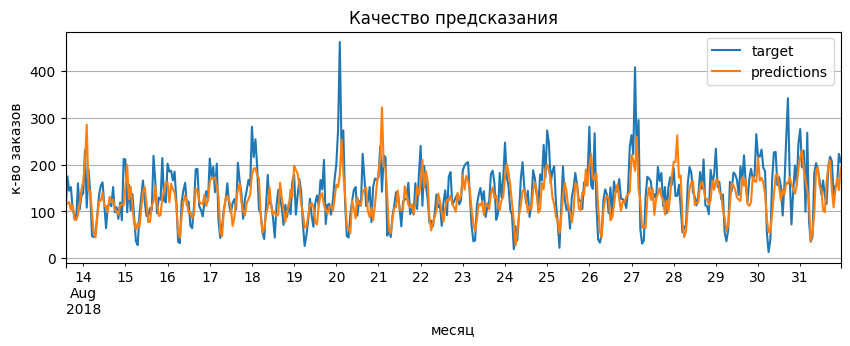
    


Уменьшим масштаб для наглядности


```python
result_plot['2018-08-13': '2018-08-20'].plot(figsize=(10, 3), grid=True, title = 'Качество предсказания',
                         xlabel='месяц', ylabel='к-во заказов');
```


    
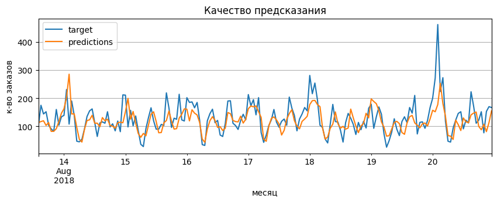
    


*Результат можно считать успешным. Модель совершает предсказания с удовлетворяющей для заказчика точностью.*

<a id='my_section_18'></a>
## [Вывод](#content_18)

Для решения поставленной задачи был предпринят ряд мер:
1. Подготовка:
    - была осуществлена загрузка библиотек и модулей, данных. Данные переданы в нужном виде и формате;
    - проведён первичный осмотр, показавший, что данные представлены с марта по август 2018 года;
    - выполнено ресемплирование по 1 часу и 1 дню. 


2. Анализ показал:
    - что имеется общая тенденция к увеличению заказов с марта по август, набор данных не относится к стационарному виду;
    - Trend подтвердил предположение об общей тенденции к увеличению заказов;
    - в Seasonality обнаружилась закономерность, соблюдающаяся на всём промежутке времени, предположительно, причиной являются сотрудники аэропорта или других служб вблизи;
    - Residuals достаточно хаотично распределён, с резкими выбросами и падениями на промежутках, предположительно, этот остаток составляют граждане, отправляющиеся в отпуска или по иным причинам в путешествие.
    
    
3. В результатае подготовки признаков:
    - проведена работа создания признаков по исходным данным;
    - данные разделены на обучающую, валидационную, тестовую выборки;
    - осуществлена подготовка признаков в соответствии с критерием заказчика (тестовый набор данных составляет 10% от выборки).
    
    
4. Проведено обучение моделей, которые показали точноть RMSE:
    - LinearRegression: 30.578585679522877;
    - LightGBM: 30.996311257405136;
    - RandomForestRegressor: 31.40073155615973.
    
    
5. По результату сравнения моделей была выбранна лучшая: LightGBM. Осуществлена проверка точности на тестовой выборке критерием RMSE:
    - 46.88952338650032.
    
    
Результат проделанной работы — обученная модель, способная спрогнозировать количество заказов такси на следующий час с точность, удовлетворяющей критерию заказчика.    
