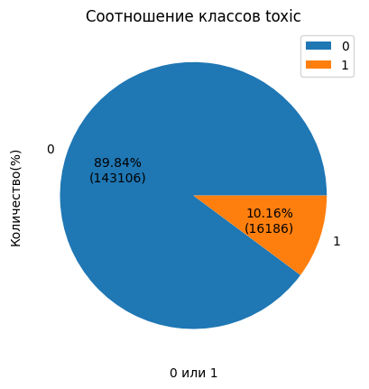
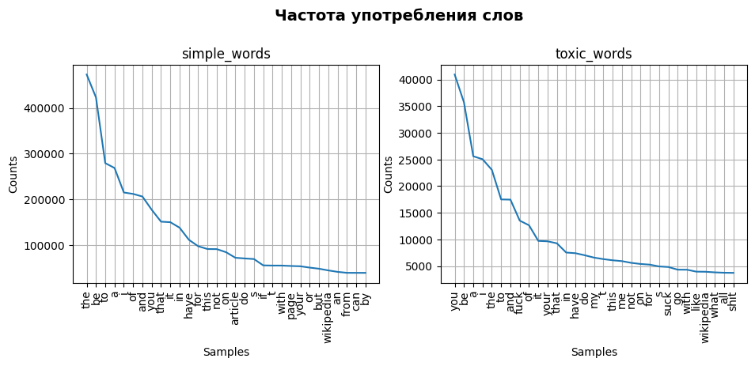
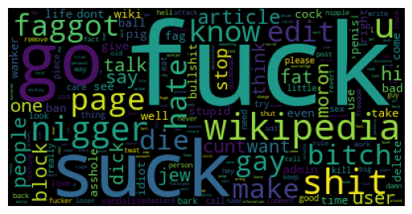

# Исследование текстов

<h1>Содержание<span class='tocSkip'></span></h1>

* [1 Подготовка](#my_section_1) <a id='content_1'></a>
  * [1.1 Ознакомление](#my_section_2) <a id='content_2'></a>
    * [1.1.1 head, info](#my_section_3) <a id='content_3'></a>
    * [1.1.2 Распределение классов](#my_section_4) <a id='content_4'></a>
    * [1.1.3 Вывод](#my_section_5) <a id='content_5'></a>
  * [1.2 Упрощение текста](#my_section_6) <a id='content_6'></a>
    * [1.2.1 Токенизация](#my_section_7) <a id='content_7'></a>
    * [1.2.2 Лемматизация](#my_section_8) <a id='content_8'></a>
    * [1.2.3 Частотный анализ](#my_section_9) <a id='content_9'></a>
  * [1.3 Подготовка признаков](#my_section_10) <a id='content_10'></a>
    * [1.3.1 Разделение на выборки](#my_section_11) <a id='content_11'></a>
    * [1.3.2 Ребаланс/Upsampling](#my_section_12) <a id='content_12'></a>
    * [1.3.3 TF_IDF](#my_section_13) <a id='content_13'></a>
  * [1.4 Заключение](#my_section_14) <a id='content_14'></a>
* [2 Обучение](#my_section_15) <a id='content_15'></a>
  * [2.1 LogisticRegression](#my_section_16) <a id='content_16'></a>
    * [2.1.1 Upsample](#my_section_17) <a id='content_17'></a>
    * [2.1.2 Balanced](#my_section_18) <a id='content_18'></a>
    * [2.1.3 GridSearchCV + Pipeline](#my_section_19) <a id='content_19'></a>
  * [2.2 CatBoostClassifier](#my_section_20) <a id='content_20'></a>
    * [2.2.1  GridSearchCV + Pipeline](#my_section_21) <a id='content_21'></a>
  * [2.3 Заключение](#my_section_22) <a id='content_22'></a>
* [3 Тестирование](#my_section_23) <a id='content_23'></a>
* [4 Выводы](#my_section_24) <a id='content_24'></a>


**Задача:**<br/>
Обучить модель классифицировать комментарии на позитивные и негативные.

**Примечание:**<br/>
Модель измеряется метрикой качества F1, её точность должна быть не меньше 0.75

**Предварительные этапы:**<br/>
1. Загрузка данных;
2. Подготовка; 
3. Обучение моделей;
4. Выводы.

**Описание данных**<br/>
В распоряжении набор данных с разметкой о токсичности правок.
- данные находятся в файле toxic_comments.csv
- столбец text в нём содержит текст комментария, а toxic — целевой признак.


<a id='my_section_1'></a>
## [Подготовка](#content_1)

Произведём импорт основных библиотек и модулей


```python
#!pip install ipywidgets
```


```python
#pip install nltk
```


```python
#pip install wordcloud
```


```python
from IPython.display import display
import pandas as pd
import matplotlib.pyplot as plt
import re

from sklearn.pipeline import Pipeline
from sklearn.model_selection import train_test_split, GridSearchCV
from sklearn.utils import shuffle
from sklearn.metrics import f1_score, make_scorer
from sklearn.linear_model import LogisticRegression
from sklearn.feature_extraction.text import (CountVectorizer,
                                             TfidfVectorizer)
from catboost import CatBoostClassifier

import nltk
from nltk.probability import FreqDist
from nltk.stem import WordNetLemmatizer
from nltk.corpus import (wordnet,
                         stopwords as nltk_stopwords)

import time
from tqdm import notebook, tqdm

from wordcloud import WordCloud
```


```python
nltk.download('wordnet')
nltk.download('punkt')
nltk.download('averaged_perceptron_tagger')
nltk.download('stopwords')
```

    [nltk_data] Downloading package wordnet to
    [nltk_data]     C:\Users\Tolge\AppData\Roaming\nltk_data...
    [nltk_data]   Package wordnet is already up-to-date!
    [nltk_data] Downloading package punkt to
    [nltk_data]     C:\Users\Tolge\AppData\Roaming\nltk_data...
    [nltk_data]   Package punkt is already up-to-date!
    [nltk_data] Downloading package averaged_perceptron_tagger to
    [nltk_data]     C:\Users\Tolge\AppData\Roaming\nltk_data...
    [nltk_data]   Package averaged_perceptron_tagger is already up-to-
    [nltk_data]       date!
    [nltk_data] Downloading package stopwords to
    [nltk_data]     C:\Users\Tolge\AppData\Roaming\nltk_data...
    [nltk_data]   Package stopwords is already up-to-date!
    


    True


Определим функцию для загрузки файла


```python
def download_file(name):
    """
    Функция проходит по возможным директориям
    в попытке найти файл, используя конструкции
    try, except и итераторы. Возвращая прочтённый
    файл или ошибку, если файл не найден.
    """
    def read(name):
        next_step = next(step)
        print(f'Пробую найти файл в {next_step}: {directory[next_step]}.')
        return pd.read_csv(directory[next_step] + name + '.csv', index_col=[0], parse_dates=[0], sep=',')

    def error(err):
        print(f'Возникла ошибка: {err}\n')

    directory = {'windows':'', 'linux':'/datasets/', 'Internet':'https://..'}
    step = iter(directory)

    try:
        data = read(name)
    except FileNotFoundError as err:
        error(err)
        try:
            data = read(name)
        except FileNotFoundError as err:
            error(err)
            try:
                data = read(name)
            except FileNotFoundError:
                return error(err)

    print('Успех!')
    return data
```

**Получим файл**


```python
data = download_file('toxic_comments')
```

    Пробую найти файл в windows: .
    Успех!
    

    C:\Users\Tolge\AppData\Local\Temp\ipykernel_5628\1933731513.py:11: UserWarning: Could not infer format, so each element will be parsed individually, falling back to `dateutil`. To ensure parsing is consistent and as-expected, please specify a format.
      return pd.read_csv(directory[next_step] + name + '.csv', index_col=[0], parse_dates=[0], sep=',')
    C:\Users\Tolge\AppData\Local\Temp\ipykernel_5628\1933731513.py:11: UserWarning: Could not infer format, so each element will be parsed individually, falling back to `dateutil`. To ensure parsing is consistent and as-expected, please specify a format.
      return pd.read_csv(directory[next_step] + name + '.csv', index_col=[0], parse_dates=[0], sep=',')
    

<a id='my_section_2'></a>
### [Ознакомление](#content_2)

<a id='my_section_3'></a>
#### [head, info](#content_3)

Изучим файл


```python
data.info()
```

    <class 'pandas.core.frame.DataFrame'>
    Index: 159292 entries, 0 to 159450
    Data columns (total 2 columns):
     #   Column  Non-Null Count   Dtype 
    ---  ------  --------------   ----- 
     0   text    159292 non-null  object
     1   toxic   159292 non-null  int64 
    dtypes: int64(1), object(1)
    memory usage: 3.6+ MB
    


```python
data.sample(5)
```


<div>
<style scoped>
    .dataframe tbody tr th:only-of-type {
        vertical-align: middle;
    }

    .dataframe tbody tr th {
        vertical-align: top;
    }

    .dataframe thead th {
        text-align: right;
    }
</style>
<table border="1" class="dataframe">
  <thead>
    <tr style="text-align: right;">
      <th></th>
      <th>text</th>
      <th>toxic</th>
    </tr>
  </thead>
  <tbody>
    <tr>
      <th>95361</th>
      <td>What constitutes as 'as long as needed'. That ...</td>
      <td>0</td>
    </tr>
    <tr>
      <th>136428</th>
      <td>"\n\nRe the following passage: ""Christians ha...</td>
      <td>0</td>
    </tr>
    <tr>
      <th>47840</th>
      <td>How is the San Francisco Chronicle not a mains...</td>
      <td>0</td>
    </tr>
    <tr>
      <th>148176</th>
      <td>"\n\n Manufacture of ""dumb phones"" to stop i...</td>
      <td>0</td>
    </tr>
    <tr>
      <th>89537</th>
      <td>What\n\nthe hell are you talking about?</td>
      <td>1</td>
    </tr>
  </tbody>
</table>
</div>


*Представлено два столбца. Из задания и по виду данных необходимо решать задачу классификации. Стоит изучить конкретнее, что представляют из себя данные в каждом столбце.*


```python
for i in range(2):
    print(f"{i+1}. {data['text'][i]}")
```

    1. Explanation
    Why the edits made under my username Hardcore Metallica Fan were reverted? They weren't vandalisms, just closure on some GAs after I voted at New York Dolls FAC. And please don't remove the template from the talk page since I'm retired now.89.205.38.27
    2. D'aww! He matches this background colour I'm seemingly stuck with. Thanks.  (talk) 21:51, January 11, 2016 (UTC)
    

*Необходимо перед обучением провести предобработку текста.*

<a id='my_section_4'></a>
#### [Распределение классов](#content_4)

Изучим распределение классов в столбце `toxic`


```python
def how_percent_pie(x):
    next_step = next(step)
    return f'{x :.2f}%\n({pie_data[next_step]})'

step = iter([0, 1])
pie_data = data['toxic'].value_counts()
plt.pie(pie_data, labels=['0', '1'], autopct=how_percent_pie);
plt.legend();
plt.xlabel('0 или 1');
plt.ylabel('Количество(%)');
plt.title('Соотношение классов toxic');
```


    

    


*Требуется балансировка классов.*

<a id='my_section_5'></a>
#### [Вывод](#content_5)

Изучены данные, требуется провести:
1. предобработку текста(упрощение);
2. балансировку классов.


<a id='my_section_6'></a>
### [Упрощение текста](#content_6)

Проведём меры по подготовке и упрощению текста. Будем придерживаться алгоритма:

1. Токенизация каждого текста, то есть его разбиение на слова;
2. Лемматизация слов: приведение к начальной словарной форме (более сложные модели, например, BERT, этого не требуют: они сами понимают формы слов);
3. Очищение текста от стоп-слов и ненужных символов;
4. Для корректной работы алгоритма добавление маркеров начала и конца предложения (они приравниваются к токенам).
5. На выходе у каждого исходного текста образуется свой список токенов.


<a id='my_section_7'></a>
#### [Токенизация](#content_7)


```python
def token_text(text):
    return nltk.tokenize\
           .sent_tokenize(text, language='english')
```


```python
tqdm.pandas()
data['lemm_text'] = data['text'].progress_apply(token_text) 
```

    100%|███████████████████████████████████████████████████████████████████████| 159292/159292 [00:11<00:00, 13697.97it/s]
    


```python
data.head()
```


<div>
<style scoped>
    .dataframe tbody tr th:only-of-type {
        vertical-align: middle;
    }

    .dataframe tbody tr th {
        vertical-align: top;
    }

    .dataframe thead th {
        text-align: right;
    }
</style>
<table border="1" class="dataframe">
  <thead>
    <tr style="text-align: right;">
      <th></th>
      <th>text</th>
      <th>toxic</th>
      <th>lemm_text</th>
    </tr>
  </thead>
  <tbody>
    <tr>
      <th>0</th>
      <td>Explanation\nWhy the edits made under my usern...</td>
      <td>0</td>
      <td>[Explanation\nWhy the edits made under my user...</td>
    </tr>
    <tr>
      <th>1</th>
      <td>D'aww! He matches this background colour I'm s...</td>
      <td>0</td>
      <td>[D'aww!, He matches this background colour I'm...</td>
    </tr>
    <tr>
      <th>2</th>
      <td>Hey man, I'm really not trying to edit war. It...</td>
      <td>0</td>
      <td>[Hey man, I'm really not trying to edit war., ...</td>
    </tr>
    <tr>
      <th>3</th>
      <td>"\nMore\nI can't make any real suggestions on ...</td>
      <td>0</td>
      <td>["\nMore\nI can't make any real suggestions on...</td>
    </tr>
    <tr>
      <th>4</th>
      <td>You, sir, are my hero. Any chance you remember...</td>
      <td>0</td>
      <td>[You, sir, are my hero., Any chance you rememb...</td>
    </tr>
  </tbody>
</table>
</div>


<a id='my_section_8'></a>
#### [Лемматизация](#content_8)

Для лемматизации слов в таблице с целью сокращения используемых ресурсов составим словарь. Словарь будет состоять из уникальных слов в наборе данных и соответствующих им лемм. 

**Подготовка**

Определим функции для помощи в лемматизации:
- clear_str — очистка от мешающих символов.


```python
def clear_str(text):
    clear_text = []
    for el in text:
        clear_text.append(re.sub(r'[^a-zA-ZTt]', ' ', el).strip().lower())
    return clear_text    
```

Очистим текст


```python
data['lemm_text'] = data['lemm_text'].progress_apply(clear_str)
```

    100%|███████████████████████████████████████████████████████████████████████| 159292/159292 [00:03<00:00, 51652.53it/s]
    


```python
data.head()
```


<div>
<style scoped>
    .dataframe tbody tr th:only-of-type {
        vertical-align: middle;
    }

    .dataframe tbody tr th {
        vertical-align: top;
    }

    .dataframe thead th {
        text-align: right;
    }
</style>
<table border="1" class="dataframe">
  <thead>
    <tr style="text-align: right;">
      <th></th>
      <th>text</th>
      <th>toxic</th>
      <th>lemm_text</th>
    </tr>
  </thead>
  <tbody>
    <tr>
      <th>0</th>
      <td>Explanation\nWhy the edits made under my usern...</td>
      <td>0</td>
      <td>[explanation why the edits made under my usern...</td>
    </tr>
    <tr>
      <th>1</th>
      <td>D'aww! He matches this background colour I'm s...</td>
      <td>0</td>
      <td>[d aww, he matches this background colour i m ...</td>
    </tr>
    <tr>
      <th>2</th>
      <td>Hey man, I'm really not trying to edit war. It...</td>
      <td>0</td>
      <td>[hey man  i m really not trying to edit war, i...</td>
    </tr>
    <tr>
      <th>3</th>
      <td>"\nMore\nI can't make any real suggestions on ...</td>
      <td>0</td>
      <td>[more i can t make any real suggestions on imp...</td>
    </tr>
    <tr>
      <th>4</th>
      <td>You, sir, are my hero. Any chance you remember...</td>
      <td>0</td>
      <td>[you  sir  are my hero, any chance you remembe...</td>
    </tr>
  </tbody>
</table>
</div>


Для ускорение процесса лемматизации выгоднее обработать одну строчку. Составим множество уникальных слов


```python
def unique_words_indf(data_col):
    """Создание множества уникальных
    слов переданного столбца датасета,
    обработка его от возможных помех
    (' ', '\n', '', ',') и вывод списка слов"""
    
    unique_words_set = set()
    for i, keyword in enumerate(data_col):
        for txt in keyword:
            for word in txt.strip().split(' '):
                unique_words_set.add(word)

    unique_words_list = [x for x in unique_words_set if x != ' ' 
                         and x != '\n' and x != '' and x != ',']
    
    print(f'Длина получившегося списка: {len(unique_words_list)}')
    
    return unique_words_list               
```


```python
unique_words_list = unique_words_indf(data['lemm_text'])
```

    Длина получившегося списка: 168516
    

**Переход к лемматизации**


```python
def get_wordnet_pos(word):
    """Map POS tag to first character lemmatize() accepts"""
    tag = nltk.pos_tag([word])[0][1][0].upper()
    
    tag_dict = {"J": wordnet.ADJ,
                "N": wordnet.NOUN,
                "V": wordnet.VERB,
                "R": wordnet.ADV}
    if word == 'gotta':
        print([word], nltk.pos_tag([word])[0][1][0].upper())
    
    
    return tag_dict.get(tag, wordnet.NOUN)
```


```python
def for_lemmatization(unique_words_list):
    """функция токенизирует и лемматизирует,
    проверяет на исключения и возвращает
    словарь {'исходное слово':'лемма'}"""
    
    # Создаём словарь и список исключений
    words_dict = {}
    exception_words = ['gonna', 'gotta', 'wanna', 'gimme', 'lemme']
    # Проводим токенизацию
    for el in tqdm(unique_words_list):
        tokens = nltk.word_tokenize(el)
        # Если после токенизации длинна больше 1: ['can', 'not'] 
        if len(tokens) > 1:
            # Возврат сочетания 'can not'
            if el == 'cannot':
                result = ' '.join(tokens)      
            # Проверка в списке исключений,
            # если есть, то возврат исходного слова
            elif el in exception_words:
                result = el
            # Проверка исключений        
            else:
                raise Exception(f'I do not know what to do with this word '
                                f'Given: {el} '
                                f'After nltk.word_tokenize: {tokens}') 
        # Если 1 — лемматизация
        elif len(tokens) == 1:
            w = str(tokens[0])
            result = lemmatizer.lemmatize(w, get_wordnet_pos(w))
        # Создание словаря из исходного слова или
        # его леммы.
        words_dict[el] = result
    
    return words_dict

```


```python
%%time
lemmatizer = WordNetLemmatizer()
words_dict = for_lemmatization(unique_words_list)
```

    100%|████████████████████████████████████████████████████████████████████████| 168516/168516 [02:15<00:00, 1246.80it/s]

    CPU times: total: 2min 14s
    Wall time: 2min 15s
    

    
    

Проведём лемматизацию строк. Определим функцию


```python
def lemmatize_data(keyword):
    lemmas = ''
    for el in keyword:
        top = [w for w in el.split(' ') if w != '' and w != ' ']
        for word in top:
            if word in words_dict.keys():
                lemmas += words_dict[word] + ' '
                
            else:
                print(word,'!!!')
                pass

    return lemmas.strip()
```


```python
%%time
data['lemm_text'] = data['lemm_text'].progress_apply(lemmatize_data)
```

    100%|███████████████████████████████████████████████████████████████████████| 159292/159292 [00:04<00:00, 34436.26it/s]

    CPU times: total: 4.64 s
    Wall time: 4.63 s
    

    
    

<a id='my_section_9'></a>
#### [Частотный анализ](#content_9)


```python
def get_mood_words(tox=0):
    """функция для выбора токсичных 
    или не токсичных корпусов текста"""
    text = []
    for el in data.loc[data['toxic'] == tox, 'lemm_text']:
        for word in el.split():
            text.append(word)
    return text        
```


```python
def plot_param(fdist):
    """функция для получения параметров
    по оси x и по оси y из `FreqDist`
    для потсроения `plt.subplots`"""
    
    x_label = []
    y_label = []
    for key, val in enumerate(fdist):
        x_label.append(val)
        y_label.append(fdist[val])
        if key == 30:
            break
    return x_label, y_label
```

Запишем в списки слова, где в целевом списке есть пометка 0 или 1.


```python
toxic_words = get_mood_words(tox=1)
simple_words = get_mood_words(tox=0)
```

Получим словари распределения слов


```python
simple_words_freq = FreqDist(simple_words)
toxic_words_freq = FreqDist(toxic_words)
```

Получим параметры для построения графика распределения


```python
simple_x_label, simple_y_label  = plot_param(simple_words_freq)
toxic_x_label, toxic_y_label  = plot_param(toxic_words_freq)
```


```python
fig, ax = plt.subplots(1, 2, figsize=(11,4))
fig.suptitle('Частота употребления слов', fontsize=14, fontweight='bold')
fig.subplots_adjust(top=0.8)

plot_param = {'simple_words': [simple_x_label, simple_y_label], 'toxic_words': [toxic_x_label, toxic_y_label]}
count = 0
for key, val in plot_param.items():
    ax[count].plot(val[0], val[1])
    ax[count].tick_params('x', labelrotation = 90)
    ax[count].grid()
    ax[count].set_ylabel('Counts')
    ax[count].set_xlabel('Samples')
    ax[count].set_title(key)
    count += 1
```


    

    


*Можно заметить, что в данный момент наибольшие частоты имеют союзы, предлоги и другие служебные части речи, не несущие смысловой нагрузки, а только выражающие семантико-синтаксические отношения между словами. Для того, чтобы результаты частотного анализа отражали тематику текста, необходимо удалить эти слова из текста.*

Произведём удаление от стоп-слов и оценим результат


```python
english_stopwords = nltk_stopwords.words('english')
def del_stop_words(text):
    result = [word for word in text.split() if word
              not in english_stopwords]
        
    return ' '.join(result)
```


```python
data['lemm_text'] = data['lemm_text'].progress_apply(del_stop_words)
```

    100%|███████████████████████████████████████████████████████████████████████| 159292/159292 [00:10<00:00, 15473.27it/s]
    

Потсроим облако слов(`wordcloud`) для демонстрации 


```python
toxic_words = ' '.join(get_mood_words(tox=1))
simple_words = ' '.join(get_mood_words(tox=0))
```


```python
wordcloud_tox = WordCloud(collocations=False).generate(toxic_words)
wordcloud_sim = WordCloud(collocations=False).generate(simple_words)
```

**Токсичные слова**


```python
plt.imshow(wordcloud_tox)
plt.axis('off');
```


    

    


**Обычные слова**


```python
plt.imshow(wordcloud_sim)
plt.axis('off');
```


    

    


*Проведено избавление от стоп-слов, выражающих семантико-синтаксические отношения. В настоящий момент результаты частотного анализа отражает тематику текста или его эмоциональную окраску.*

<a id='my_section_10'></a>
### [Подготовка признаков](#content_10)

Разделим на обучающий и целевой признаки


```python
features = data['lemm_text']
target = data['toxic']
```

<a id='my_section_11'></a>
#### [Разделение на выборки](#content_11)

Разобъём набор данных на выборки, проконтролируем результат.

Опередим функцию:
1. signs — для разделения на признаки и проверки их распределения;


```python
def signs(features, target):
    def check_signs(train, valid, test):
        # Проверка соотношения между прзнаками
        dict_signs = {'обучающая':train, 'валидационная':valid, 'тестовая':test}
        print('Процентное соотношение выборок после разделения: ')
        # Создание словарей
        total_el_signs = {key:val.shape[0] for key, val in dict_signs.items()}
        percent_signs = {key:val/data.shape[0] for key, val in total_el_signs.items()}
        # Подведение итогов
        total_info = pd.DataFrame({'Количество': total_el_signs, 'Процент(%)': percent_signs})
        display(total_info)
    
    # Разделение на `train`, `valid`, `test`
    features_train, features_valid, target_train, target_valid = train_test_split(
        features, target, random_state=12345, test_size=.4, stratify=target)

    features_valid, features_test, target_valid, target_test = train_test_split(
        features_valid, target_valid, random_state=12345, test_size=.5, stratify=target_valid)
    
    # Разделение на 'X_train', 'y_train' для Pipline
    X_train, X_test, y_train, y_test = train_test_split(
        features, target, random_state=12345, test_size=0.33, stratify=target)
    
    check_signs(features_train, features_valid, features_test)
    
    
    return features_train, target_train,\
            features_valid, target_valid,\
            features_test, target_test,\
            X_train, y_train,\
            X_test, y_test
```

Разделим на выборки


```python
features_train, target_train,\
features_valid, target_valid,\
features_test, target_test,\
X_train, y_train,\
X_test, y_test = signs(features, target)
```

    Процентное соотношение выборок после разделения: 
    


<div>
<style scoped>
    .dataframe tbody tr th:only-of-type {
        vertical-align: middle;
    }

    .dataframe tbody tr th {
        vertical-align: top;
    }

    .dataframe thead th {
        text-align: right;
    }
</style>
<table border="1" class="dataframe">
  <thead>
    <tr style="text-align: right;">
      <th></th>
      <th>Количество</th>
      <th>Процент(%)</th>
    </tr>
  </thead>
  <tbody>
    <tr>
      <th>обучающая</th>
      <td>95575</td>
      <td>0.599999</td>
    </tr>
    <tr>
      <th>валидационная</th>
      <td>31858</td>
      <td>0.199997</td>
    </tr>
    <tr>
      <th>тестовая</th>
      <td>31859</td>
      <td>0.200004</td>
    </tr>
  </tbody>
</table>
</div>


*Разделение произведено, но стоит учитывать, что у нас баланс классов в целевом признаки нарушен, поэтому требуется провести ребалансировку.*

<a id='my_section_12'></a>
#### [Ребаланс/Upsampling](#content_12)

Проводить `upsampling` будем только для обучающей выборке.
Изучим во сколько раз классы отличаются.


```python
ans = round(target_train.loc[target_train == 0].count()
     //target_train.loc[target_train == 1].count(), 3)
ans
```


    8


*Используем это значение в unsample*

Определим функцию для балансировки классов


```python
def upsample(features, target, repeat):
    features = pd.Series([el for el in features])
    target = target.reset_index(drop=True)

    features_zeros = features[target == 0]
    features_ones = features[target == 1]
    target_zeros = target[target == 0]
    target_ones = target[target == 1]

    features_upsampled = pd.concat([features_zeros] + [features_ones] * repeat)
    target_upsampled = pd.concat([target_zeros] + [target_ones] * repeat)

    features_upsampled, target_upsampled = shuffle(
        features_upsampled, target_upsampled, random_state=12345)

    return features_upsampled, target_upsampled
```


```python
features_upsampled, target_upsampled = upsample(features_train, target_train, ans)
```

Оценим на сколько увеличилась выборка


```python
def upsample_info():
    len_before = features_train.shape[0]
    len_after = len(features_upsampled)
    print(f"{(len_after-len_before)/len_before*100 :.2f}%")

upsample_info()
```

    71.13%
    

*Данные подготовлены*

<a id='my_section_13'></a>
#### [TF_IDF](#content_13)

Очистим текст от `stop_words` и разметим его.


```python
stopwords = set(nltk_stopwords.words('english'))
count_tf_idf = TfidfVectorizer(stop_words=list(stopwords))
tf_idf_train = count_tf_idf.fit(features_upsampled)
```


```python
tf_idf_train = count_tf_idf.transform(features_upsampled)
tf_idf_valid = count_tf_idf.transform(features_valid)
tf_idf_test = count_tf_idf.transform(features_test)
```

<a id='my_section_14'></a>
### [Заключение](#content_14)

Проведены следующие мероприятния:
1. загружены библиотеки и модули, набор данных;
2. проведено ознакомление с основными параметрами данных, выявлен дисбаланс классов;
3. упрощен текст, проведены
    - токенизация;
    - лемматизация.
4. данные разделены на выбоки;
5. произведен ребаланс классов техникой unsampling;
6. разбитые данные получили веторизацию TF_IDF.

Данные подготовлены для обучения моделей.

<a id='my_section_15'></a>
## [Обучение](#content_15)

Обучим разные модели и выберем лучшую

<a id='my_section_16'></a>
### [LogisticRegression](#content_16)

Рассмотрим для этой модели разные варианты гиперпараметров

<a id='my_section_17'></a>
#### [Upsample](#content_17)


```python
model_lu = LogisticRegression(random_state=12345, solver='liblinear')
model_lu.fit(tf_idf_train, target_upsampled)
predicted_valid_lu = model_lu.predict(tf_idf_valid)

print("F1:", f1_score(target_valid, predicted_valid_lu))
```

    F1: 0.7550133221147104
    

<a id='my_section_18'></a>
#### [Balanced](#content_18)


```python
model_lb = LogisticRegression(random_state=12345, solver='liblinear', class_weight='balanced')
model_lb.fit(tf_idf_train, target_upsampled)
predicted_valid_lb = model_lb.predict(tf_idf_valid)

print("F1:", f1_score(target_valid, predicted_valid_lb))
```

    F1: 0.7489677952105697
    

<a id='my_section_19'></a>
#### [GridSearchCV + Pipeline](#content_19)

Определим pipline, получим список параметров


```python
pipe_lr = Pipeline([('tfidf', TfidfVectorizer(stop_words=list(stopwords))),
                  ('clf', LogisticRegression(random_state=12345))])
pipe_lr.get_params()
```


    {'memory': None,
     'steps': [('tfidf',
       TfidfVectorizer(stop_words=["hadn't", 'when', "that'll", 'i', 'the', 'should',
                                   'who', 'against', 'into', 'does', 'most', 'myself',
                                   'm', 'there', 'over', 'why', 'where', 're', 'can',
                                   'no', 'hasn', 'same', 'have', 'has', 'did', 'them',
                                   'for', 'himself', "she's", 'our', ...])),
      ('clf', LogisticRegression(random_state=12345))],
     'verbose': False,
     'tfidf': TfidfVectorizer(stop_words=["hadn't", 'when', "that'll", 'i', 'the', 'should',
                                 'who', 'against', 'into', 'does', 'most', 'myself',
                                 'm', 'there', 'over', 'why', 'where', 're', 'can',
                                 'no', 'hasn', 'same', 'have', 'has', 'did', 'them',
                                 'for', 'himself', "she's", 'our', ...]),
     'clf': LogisticRegression(random_state=12345),
     'tfidf__analyzer': 'word',
     'tfidf__binary': False,
     'tfidf__decode_error': 'strict',
     'tfidf__dtype': numpy.float64,
     'tfidf__encoding': 'utf-8',
     'tfidf__input': 'content',
     'tfidf__lowercase': True,
     'tfidf__max_df': 1.0,
     'tfidf__max_features': None,
     'tfidf__min_df': 1,
     'tfidf__ngram_range': (1, 1),
     'tfidf__norm': 'l2',
     'tfidf__preprocessor': None,
     'tfidf__smooth_idf': True,
     'tfidf__stop_words': ["hadn't",
      'when',
      "that'll",
      'i',
      'the',
      'should',
      'who',
      'against',
      'into',
      'does',
      'most',
      'myself',
      'm',
      'there',
      'over',
      'why',
      'where',
      're',
      'can',
      'no',
      'hasn',
      'same',
      'have',
      'has',
      'did',
      'them',
      'for',
      'himself',
      "she's",
      'our',
      'other',
      "needn't",
      'from',
      'very',
      'do',
      'any',
      've',
      'how',
      'that',
      'all',
      'of',
      'themselves',
      'they',
      'up',
      'y',
      "it's",
      'yourself',
      'about',
      'a',
      "don't",
      'she',
      "haven't",
      'then',
      'shouldn',
      'be',
      'in',
      'won',
      'o',
      'so',
      'was',
      'as',
      'than',
      'shan',
      'before',
      'we',
      "should've",
      'its',
      "couldn't",
      'too',
      'theirs',
      "you're",
      'being',
      'until',
      'down',
      'these',
      'if',
      'needn',
      'it',
      'couldn',
      'you',
      'below',
      'again',
      'each',
      'will',
      "weren't",
      'off',
      's',
      'but',
      "you've",
      'my',
      'on',
      'nor',
      "didn't",
      'which',
      'their',
      'itself',
      'while',
      'after',
      'yours',
      'doesn',
      'your',
      'll',
      'by',
      'mightn',
      'further',
      'under',
      'yourselves',
      'through',
      't',
      'didn',
      "shan't",
      'him',
      'because',
      'at',
      'are',
      'his',
      'just',
      'ourselves',
      'd',
      "you'll",
      'isn',
      'had',
      'me',
      'such',
      'were',
      "wouldn't",
      "mightn't",
      'herself',
      "aren't",
      "doesn't",
      'am',
      'this',
      "mustn't",
      "won't",
      'and',
      'not',
      'once',
      'or',
      'is',
      "shouldn't",
      'with',
      'those',
      'having',
      'here',
      'own',
      'ours',
      'whom',
      'ain',
      'both',
      'an',
      'some',
      'haven',
      'doing',
      'don',
      'now',
      'hers',
      'only',
      "wasn't",
      "you'd",
      'weren',
      "isn't",
      'her',
      'hadn',
      'during',
      'wouldn',
      'few',
      'wasn',
      'he',
      'between',
      "hasn't",
      'ma',
      'to',
      'mustn',
      'out',
      'aren',
      'above',
      'been',
      'what',
      'more'],
     'tfidf__strip_accents': None,
     'tfidf__sublinear_tf': False,
     'tfidf__token_pattern': '(?u)\\b\\w\\w+\\b',
     'tfidf__tokenizer': None,
     'tfidf__use_idf': True,
     'tfidf__vocabulary': None,
     'clf__C': 1.0,
     'clf__class_weight': None,
     'clf__dual': False,
     'clf__fit_intercept': True,
     'clf__intercept_scaling': 1,
     'clf__l1_ratio': None,
     'clf__max_iter': 100,
     'clf__multi_class': 'auto',
     'clf__n_jobs': None,
     'clf__penalty': 'l2',
     'clf__random_state': 12345,
     'clf__solver': 'lbfgs',
     'clf__tol': 0.0001,
     'clf__verbose': 0,
     'clf__warm_start': False}


Установим некоторые из них и передадим GridSearchCV


```python
%%time
parametres_lr = {'clf__solver':['lbfgs', 'liblinear', 'newton-cg'],
                 'clf__max_iter':[5000],
                 'clf__C':[1, 10],
                 'clf__verbose': [1]}

grid_lr = GridSearchCV(estimator=pipe_lr,
                         param_grid=parametres_lr,
                         cv=5,
                         scoring=make_scorer(f1_score),
                         n_jobs=-1)

search_lr = grid_lr.fit(X_train, y_train)
```

    CPU times: total: 7.83 s
    Wall time: 42 s
    

Предскажем значение

Получим таблицу с параметрами всех моделей


```python
lr_gridsearch = pd.DataFrame(grid_lr.cv_results_)
lr_gridsearch.head(1)
```


<div>
<style scoped>
    .dataframe tbody tr th:only-of-type {
        vertical-align: middle;
    }

    .dataframe tbody tr th {
        vertical-align: top;
    }

    .dataframe thead th {
        text-align: right;
    }
</style>
<table border="1" class="dataframe">
  <thead>
    <tr style="text-align: right;">
      <th></th>
      <th>mean_fit_time</th>
      <th>std_fit_time</th>
      <th>mean_score_time</th>
      <th>std_score_time</th>
      <th>param_clf__C</th>
      <th>param_clf__max_iter</th>
      <th>param_clf__solver</th>
      <th>param_clf__verbose</th>
      <th>params</th>
      <th>split0_test_score</th>
      <th>split1_test_score</th>
      <th>split2_test_score</th>
      <th>split3_test_score</th>
      <th>split4_test_score</th>
      <th>mean_test_score</th>
      <th>std_test_score</th>
      <th>rank_test_score</th>
    </tr>
  </thead>
  <tbody>
    <tr>
      <th>0</th>
      <td>7.059723</td>
      <td>0.225917</td>
      <td>0.608571</td>
      <td>0.04072</td>
      <td>1</td>
      <td>5000</td>
      <td>lbfgs</td>
      <td>1</td>
      <td>{'clf__C': 1, 'clf__max_iter': 5000, 'clf__sol...</td>
      <td>0.720159</td>
      <td>0.726407</td>
      <td>0.716653</td>
      <td>0.719323</td>
      <td>0.722001</td>
      <td>0.720909</td>
      <td>0.003244</td>
      <td>5</td>
    </tr>
  </tbody>
</table>
</div>


Получим лучшие параметры лучшей модели


```python
grid_lr.best_params_
```


    {'clf__C': 10,
     'clf__max_iter': 5000,
     'clf__solver': 'newton-cg',
     'clf__verbose': 1}


Получим её точность


```python
f1_y_pred = search_lr.best_score_
print("F1:", f1_y_pred)
```

    F1: 0.7662235157453029
    

<a id='my_section_20'></a>
### [CatBoostClassifier](#content_20)


```python
%%time
best_f1 = 0.0001
for depth in tqdm(range(7,8)):
    for ite in range(100,300,200):
        model_cbc = CatBoostClassifier(iterations=ite, depth=depth, learning_rate=0.32)

        start_cb_fit = time.process_time()
        model_cbc.fit(tf_idf_train, target_upsampled, verbose=ite)
        finish_cb_fit = time.process_time() - start_cb_fit

        start_cb_predict = time.process_time()
        predictions_valid_cbc = model_cbc.predict(tf_idf_valid)
        finish_cb_predict = time.process_time() - start_cb_predict

        result_cbc = f1_score(target_valid, predictions_valid_cbc)
        if result_cbc >= best_f1:
            cbc_best_f1 = result_cbc
            cbc_best_f1_model = model_cbc
            cbc_best_iter = ite
            cbc_best_depth = depth
            cbc_fit = finish_cb_fit
            cbc_pred = finish_cb_predict

print(f'\nf1 лучшей модели: {cbc_best_f1}\n'
      f'Количество итераций: {cbc_best_iter}\n'
      f'Лучшая глубина: {cbc_best_depth}\n'
      f'Время обучения: {cbc_fit}\n'
      f'Время предсказания: {cbc_pred}\n')
```

      0%|                                                                                            | 0/1 [00:00<?, ?it/s]

    0:	learn: 0.5659262	total: 1.29s	remaining: 2m 8s
    99:	learn: 0.2385122	total: 1m 37s	remaining: 0us
    

    100%|███████████████████████████████████████████████████████████████████████████████████| 1/1 [01:45<00:00, 105.37s/it]

    
    f1 лучшей модели: 0.7468408348715037
    Количество итераций: 100
    Лучшая глубина: 7
    Время обучения: 496.546875
    Время предсказания: 0.65625
    
    CPU times: total: 8min 17s
    Wall time: 1min 45s
    

    
    

<a id='my_section_21'></a>
#### [ GridSearchCV + Pipeline](#content_21)


```python
pipe_cbc = Pipeline([('tfidf', TfidfVectorizer(stop_words=list(stopwords))),
                  ('cbc', CatBoostClassifier(learning_rate=0.32))])
pipe_cbc.get_params()
```


    {'memory': None,
     'steps': [('tfidf',
       TfidfVectorizer(stop_words=["hadn't", 'when', "that'll", 'i', 'the', 'should',
                                   'who', 'against', 'into', 'does', 'most', 'myself',
                                   'm', 'there', 'over', 'why', 'where', 're', 'can',
                                   'no', 'hasn', 'same', 'have', 'has', 'did', 'them',
                                   'for', 'himself', "she's", 'our', ...])),
      ('cbc', <catboost.core.CatBoostClassifier at 0x24d7ba8d790>)],
     'verbose': False,
     'tfidf': TfidfVectorizer(stop_words=["hadn't", 'when', "that'll", 'i', 'the', 'should',
                                 'who', 'against', 'into', 'does', 'most', 'myself',
                                 'm', 'there', 'over', 'why', 'where', 're', 'can',
                                 'no', 'hasn', 'same', 'have', 'has', 'did', 'them',
                                 'for', 'himself', "she's", 'our', ...]),
     'cbc': <catboost.core.CatBoostClassifier at 0x24d7ba8d790>,
     'tfidf__analyzer': 'word',
     'tfidf__binary': False,
     'tfidf__decode_error': 'strict',
     'tfidf__dtype': numpy.float64,
     'tfidf__encoding': 'utf-8',
     'tfidf__input': 'content',
     'tfidf__lowercase': True,
     'tfidf__max_df': 1.0,
     'tfidf__max_features': None,
     'tfidf__min_df': 1,
     'tfidf__ngram_range': (1, 1),
     'tfidf__norm': 'l2',
     'tfidf__preprocessor': None,
     'tfidf__smooth_idf': True,
     'tfidf__stop_words': ["hadn't",
      'when',
      "that'll",
      'i',
      'the',
      'should',
      'who',
      'against',
      'into',
      'does',
      'most',
      'myself',
      'm',
      'there',
      'over',
      'why',
      'where',
      're',
      'can',
      'no',
      'hasn',
      'same',
      'have',
      'has',
      'did',
      'them',
      'for',
      'himself',
      "she's",
      'our',
      'other',
      "needn't",
      'from',
      'very',
      'do',
      'any',
      've',
      'how',
      'that',
      'all',
      'of',
      'themselves',
      'they',
      'up',
      'y',
      "it's",
      'yourself',
      'about',
      'a',
      "don't",
      'she',
      "haven't",
      'then',
      'shouldn',
      'be',
      'in',
      'won',
      'o',
      'so',
      'was',
      'as',
      'than',
      'shan',
      'before',
      'we',
      "should've",
      'its',
      "couldn't",
      'too',
      'theirs',
      "you're",
      'being',
      'until',
      'down',
      'these',
      'if',
      'needn',
      'it',
      'couldn',
      'you',
      'below',
      'again',
      'each',
      'will',
      "weren't",
      'off',
      's',
      'but',
      "you've",
      'my',
      'on',
      'nor',
      "didn't",
      'which',
      'their',
      'itself',
      'while',
      'after',
      'yours',
      'doesn',
      'your',
      'll',
      'by',
      'mightn',
      'further',
      'under',
      'yourselves',
      'through',
      't',
      'didn',
      "shan't",
      'him',
      'because',
      'at',
      'are',
      'his',
      'just',
      'ourselves',
      'd',
      "you'll",
      'isn',
      'had',
      'me',
      'such',
      'were',
      "wouldn't",
      "mightn't",
      'herself',
      "aren't",
      "doesn't",
      'am',
      'this',
      "mustn't",
      "won't",
      'and',
      'not',
      'once',
      'or',
      'is',
      "shouldn't",
      'with',
      'those',
      'having',
      'here',
      'own',
      'ours',
      'whom',
      'ain',
      'both',
      'an',
      'some',
      'haven',
      'doing',
      'don',
      'now',
      'hers',
      'only',
      "wasn't",
      "you'd",
      'weren',
      "isn't",
      'her',
      'hadn',
      'during',
      'wouldn',
      'few',
      'wasn',
      'he',
      'between',
      "hasn't",
      'ma',
      'to',
      'mustn',
      'out',
      'aren',
      'above',
      'been',
      'what',
      'more'],
     'tfidf__strip_accents': None,
     'tfidf__sublinear_tf': False,
     'tfidf__token_pattern': '(?u)\\b\\w\\w+\\b',
     'tfidf__tokenizer': None,
     'tfidf__use_idf': True,
     'tfidf__vocabulary': None,
     'cbc__learning_rate': 0.32}


```python
%%time
parametres_cbc = {'cbc__iterations':[100, 300],
                 'cbc__depth':[7, 8]}

grid_cbc = GridSearchCV(estimator=pipe_cbc,
                         param_grid=parametres_cbc,
                         cv=3,
                         scoring=make_scorer(f1_score),
                         n_jobs=-1)

search_cbc = grid_cbc.fit(X_train, y_train)
```

    0:	learn: 0.4176170	total: 1.86s	remaining: 9m 16s
    1:	learn: 0.3076544	total: 3.64s	remaining: 9m 2s
    2:	learn: 0.2596406	total: 5.44s	remaining: 8m 58s
    3:	learn: 0.2331420	total: 7.22s	remaining: 8m 54s
    4:	learn: 0.2203837	total: 8.96s	remaining: 8m 48s
    5:	learn: 0.2121736	total: 10.7s	remaining: 8m 43s
    6:	learn: 0.2066036	total: 12.4s	remaining: 8m 39s
    7:	learn: 0.2005435	total: 14.2s	remaining: 8m 36s
    8:	learn: 0.1971192	total: 15.9s	remaining: 8m 33s
    9:	learn: 0.1932858	total: 17.6s	remaining: 8m 30s
    10:	learn: 0.1904011	total: 19.4s	remaining: 8m 28s
    11:	learn: 0.1858928	total: 21.2s	remaining: 8m 28s
    12:	learn: 0.1833425	total: 23s	remaining: 8m 27s
    13:	learn: 0.1809650	total: 24.7s	remaining: 8m 24s
    14:	learn: 0.1792405	total: 26.4s	remaining: 8m 22s
    15:	learn: 0.1773080	total: 28.2s	remaining: 8m 19s
    16:	learn: 0.1756154	total: 29.9s	remaining: 8m 17s
    17:	learn: 0.1734462	total: 31.6s	remaining: 8m 15s
    18:	learn: 0.1713900	total: 33.4s	remaining: 8m 13s
    19:	learn: 0.1695055	total: 35.1s	remaining: 8m 12s
    20:	learn: 0.1681758	total: 36.9s	remaining: 8m 9s
    21:	learn: 0.1665239	total: 38.6s	remaining: 8m 7s
    22:	learn: 0.1650954	total: 40.3s	remaining: 8m 5s
    23:	learn: 0.1637512	total: 42.1s	remaining: 8m 3s
    24:	learn: 0.1626401	total: 43.8s	remaining: 8m 1s
    25:	learn: 0.1614083	total: 45.5s	remaining: 7m 59s
    26:	learn: 0.1605084	total: 47.3s	remaining: 7m 57s
    27:	learn: 0.1595680	total: 49s	remaining: 7m 55s
    28:	learn: 0.1583305	total: 50.7s	remaining: 7m 53s
    29:	learn: 0.1573777	total: 52.4s	remaining: 7m 51s
    30:	learn: 0.1564337	total: 54.2s	remaining: 7m 50s
    31:	learn: 0.1556290	total: 55.9s	remaining: 7m 48s
    32:	learn: 0.1546569	total: 57.6s	remaining: 7m 46s
    33:	learn: 0.1535598	total: 59.4s	remaining: 7m 44s
    34:	learn: 0.1528037	total: 1m 1s	remaining: 7m 42s
    35:	learn: 0.1517260	total: 1m 2s	remaining: 7m 40s
    36:	learn: 0.1508105	total: 1m 4s	remaining: 7m 39s
    37:	learn: 0.1499123	total: 1m 6s	remaining: 7m 37s
    38:	learn: 0.1490651	total: 1m 8s	remaining: 7m 35s
    39:	learn: 0.1483078	total: 1m 9s	remaining: 7m 33s
    40:	learn: 0.1472275	total: 1m 11s	remaining: 7m 31s
    41:	learn: 0.1465257	total: 1m 13s	remaining: 7m 29s
    42:	learn: 0.1456577	total: 1m 14s	remaining: 7m 28s
    43:	learn: 0.1451189	total: 1m 16s	remaining: 7m 26s
    44:	learn: 0.1444753	total: 1m 18s	remaining: 7m 24s
    45:	learn: 0.1435145	total: 1m 20s	remaining: 7m 22s
    46:	learn: 0.1426129	total: 1m 21s	remaining: 7m 20s
    47:	learn: 0.1421276	total: 1m 23s	remaining: 7m 18s
    48:	learn: 0.1416686	total: 1m 25s	remaining: 7m 17s
    49:	learn: 0.1409318	total: 1m 27s	remaining: 7m 15s
    50:	learn: 0.1404561	total: 1m 28s	remaining: 7m 13s
    51:	learn: 0.1398389	total: 1m 30s	remaining: 7m 11s
    52:	learn: 0.1391661	total: 1m 32s	remaining: 7m 10s
    53:	learn: 0.1384640	total: 1m 34s	remaining: 7m 8s
    54:	learn: 0.1380108	total: 1m 35s	remaining: 7m 6s
    55:	learn: 0.1376213	total: 1m 37s	remaining: 7m 4s
    56:	learn: 0.1371397	total: 1m 39s	remaining: 7m 2s
    57:	learn: 0.1365118	total: 1m 40s	remaining: 7m 1s
    58:	learn: 0.1361747	total: 1m 42s	remaining: 6m 59s
    59:	learn: 0.1356312	total: 1m 44s	remaining: 6m 57s
    60:	learn: 0.1353353	total: 1m 46s	remaining: 6m 55s
    61:	learn: 0.1346482	total: 1m 47s	remaining: 6m 53s
    62:	learn: 0.1339904	total: 1m 49s	remaining: 6m 51s
    63:	learn: 0.1336909	total: 1m 51s	remaining: 6m 50s
    64:	learn: 0.1334330	total: 1m 52s	remaining: 6m 48s
    65:	learn: 0.1329730	total: 1m 54s	remaining: 6m 46s
    66:	learn: 0.1327269	total: 1m 56s	remaining: 6m 44s
    67:	learn: 0.1320823	total: 1m 58s	remaining: 6m 43s
    68:	learn: 0.1314746	total: 1m 59s	remaining: 6m 41s
    69:	learn: 0.1309508	total: 2m 1s	remaining: 6m 39s
    70:	learn: 0.1305216	total: 2m 3s	remaining: 6m 37s
    71:	learn: 0.1296679	total: 2m 5s	remaining: 6m 36s
    72:	learn: 0.1292515	total: 2m 6s	remaining: 6m 34s
    73:	learn: 0.1287290	total: 2m 8s	remaining: 6m 32s
    74:	learn: 0.1282169	total: 2m 10s	remaining: 6m 30s
    75:	learn: 0.1280014	total: 2m 11s	remaining: 6m 28s
    76:	learn: 0.1276843	total: 2m 13s	remaining: 6m 27s
    77:	learn: 0.1270010	total: 2m 15s	remaining: 6m 25s
    78:	learn: 0.1267566	total: 2m 17s	remaining: 6m 23s
    79:	learn: 0.1264037	total: 2m 18s	remaining: 6m 21s
    80:	learn: 0.1260193	total: 2m 20s	remaining: 6m 19s
    81:	learn: 0.1258183	total: 2m 22s	remaining: 6m 18s
    82:	learn: 0.1254787	total: 2m 23s	remaining: 6m 16s
    83:	learn: 0.1250532	total: 2m 25s	remaining: 6m 14s
    84:	learn: 0.1247199	total: 2m 27s	remaining: 6m 12s
    85:	learn: 0.1245146	total: 2m 29s	remaining: 6m 10s
    86:	learn: 0.1240657	total: 2m 30s	remaining: 6m 9s
    87:	learn: 0.1236791	total: 2m 32s	remaining: 6m 7s
    88:	learn: 0.1231765	total: 2m 34s	remaining: 6m 5s
    89:	learn: 0.1227500	total: 2m 35s	remaining: 6m 3s
    90:	learn: 0.1225734	total: 2m 37s	remaining: 6m 2s
    91:	learn: 0.1222104	total: 2m 39s	remaining: 6m
    92:	learn: 0.1220150	total: 2m 41s	remaining: 5m 58s
    93:	learn: 0.1217248	total: 2m 42s	remaining: 5m 56s
    94:	learn: 0.1214229	total: 2m 44s	remaining: 5m 54s
    95:	learn: 0.1210426	total: 2m 46s	remaining: 5m 53s
    96:	learn: 0.1206809	total: 2m 47s	remaining: 5m 51s
    97:	learn: 0.1204810	total: 2m 49s	remaining: 5m 49s
    98:	learn: 0.1200883	total: 2m 51s	remaining: 5m 47s
    99:	learn: 0.1195650	total: 2m 53s	remaining: 5m 46s
    100:	learn: 0.1193876	total: 2m 54s	remaining: 5m 44s
    101:	learn: 0.1190567	total: 2m 56s	remaining: 5m 42s
    102:	learn: 0.1188625	total: 2m 58s	remaining: 5m 41s
    103:	learn: 0.1186906	total: 3m	remaining: 5m 39s
    104:	learn: 0.1182810	total: 3m 1s	remaining: 5m 37s
    105:	learn: 0.1181133	total: 3m 3s	remaining: 5m 35s
    106:	learn: 0.1177275	total: 3m 5s	remaining: 5m 34s
    107:	learn: 0.1175718	total: 3m 6s	remaining: 5m 32s
    108:	learn: 0.1174005	total: 3m 8s	remaining: 5m 30s
    109:	learn: 0.1172461	total: 3m 10s	remaining: 5m 28s
    110:	learn: 0.1171044	total: 3m 12s	remaining: 5m 26s
    111:	learn: 0.1168607	total: 3m 13s	remaining: 5m 25s
    112:	learn: 0.1165682	total: 3m 15s	remaining: 5m 23s
    113:	learn: 0.1164258	total: 3m 17s	remaining: 5m 21s
    114:	learn: 0.1162921	total: 3m 18s	remaining: 5m 19s
    115:	learn: 0.1161677	total: 3m 20s	remaining: 5m 18s
    116:	learn: 0.1160104	total: 3m 22s	remaining: 5m 16s
    117:	learn: 0.1156639	total: 3m 24s	remaining: 5m 14s
    118:	learn: 0.1155077	total: 3m 25s	remaining: 5m 13s
    119:	learn: 0.1152696	total: 3m 27s	remaining: 5m 11s
    120:	learn: 0.1151467	total: 3m 29s	remaining: 5m 9s
    121:	learn: 0.1148745	total: 3m 31s	remaining: 5m 7s
    122:	learn: 0.1147364	total: 3m 32s	remaining: 5m 6s
    123:	learn: 0.1145355	total: 3m 34s	remaining: 5m 4s
    124:	learn: 0.1141336	total: 3m 36s	remaining: 5m 2s
    125:	learn: 0.1137418	total: 3m 37s	remaining: 5m
    126:	learn: 0.1136068	total: 3m 39s	remaining: 4m 59s
    127:	learn: 0.1134771	total: 3m 41s	remaining: 4m 57s
    128:	learn: 0.1133520	total: 3m 43s	remaining: 4m 55s
    129:	learn: 0.1131166	total: 3m 44s	remaining: 4m 53s
    130:	learn: 0.1129970	total: 3m 46s	remaining: 4m 52s
    131:	learn: 0.1126943	total: 3m 48s	remaining: 4m 50s
    132:	learn: 0.1123579	total: 3m 49s	remaining: 4m 48s
    133:	learn: 0.1122428	total: 3m 51s	remaining: 4m 46s
    134:	learn: 0.1121316	total: 3m 53s	remaining: 4m 45s
    135:	learn: 0.1118647	total: 3m 55s	remaining: 4m 43s
    136:	learn: 0.1117123	total: 3m 56s	remaining: 4m 41s
    137:	learn: 0.1114047	total: 3m 58s	remaining: 4m 40s
    138:	learn: 0.1111423	total: 4m	remaining: 4m 38s
    139:	learn: 0.1110263	total: 4m 2s	remaining: 4m 36s
    140:	learn: 0.1108991	total: 4m 3s	remaining: 4m 34s
    141:	learn: 0.1106811	total: 4m 5s	remaining: 4m 33s
    142:	learn: 0.1104846	total: 4m 7s	remaining: 4m 31s
    143:	learn: 0.1103799	total: 4m 8s	remaining: 4m 29s
    144:	learn: 0.1102742	total: 4m 10s	remaining: 4m 27s
    145:	learn: 0.1101730	total: 4m 12s	remaining: 4m 26s
    146:	learn: 0.1100616	total: 4m 14s	remaining: 4m 24s
    147:	learn: 0.1096398	total: 4m 15s	remaining: 4m 22s
    148:	learn: 0.1093965	total: 4m 17s	remaining: 4m 20s
    149:	learn: 0.1092140	total: 4m 19s	remaining: 4m 19s
    150:	learn: 0.1091081	total: 4m 20s	remaining: 4m 17s
    151:	learn: 0.1088708	total: 4m 22s	remaining: 4m 15s
    152:	learn: 0.1087329	total: 4m 24s	remaining: 4m 13s
    153:	learn: 0.1086425	total: 4m 26s	remaining: 4m 12s
    154:	learn: 0.1082605	total: 4m 27s	remaining: 4m 10s
    155:	learn: 0.1081614	total: 4m 29s	remaining: 4m 8s
    156:	learn: 0.1079044	total: 4m 31s	remaining: 4m 7s
    157:	learn: 0.1078078	total: 4m 33s	remaining: 4m 5s
    158:	learn: 0.1075931	total: 4m 34s	remaining: 4m 3s
    159:	learn: 0.1074521	total: 4m 36s	remaining: 4m 1s
    160:	learn: 0.1072125	total: 4m 38s	remaining: 4m
    161:	learn: 0.1070927	total: 4m 39s	remaining: 3m 58s
    162:	learn: 0.1067824	total: 4m 41s	remaining: 3m 56s
    163:	learn: 0.1066469	total: 4m 43s	remaining: 3m 55s
    164:	learn: 0.1063481	total: 4m 45s	remaining: 3m 53s
    165:	learn: 0.1062560	total: 4m 46s	remaining: 3m 51s
    166:	learn: 0.1061711	total: 4m 48s	remaining: 3m 49s
    167:	learn: 0.1058916	total: 4m 50s	remaining: 3m 48s
    168:	learn: 0.1058077	total: 4m 52s	remaining: 3m 46s
    169:	learn: 0.1056371	total: 4m 53s	remaining: 3m 44s
    170:	learn: 0.1053772	total: 4m 55s	remaining: 3m 43s
    171:	learn: 0.1051731	total: 4m 57s	remaining: 3m 41s
    172:	learn: 0.1050532	total: 4m 59s	remaining: 3m 39s
    173:	learn: 0.1047794	total: 5m	remaining: 3m 37s
    174:	learn: 0.1046708	total: 5m 2s	remaining: 3m 36s
    175:	learn: 0.1044226	total: 5m 4s	remaining: 3m 34s
    176:	learn: 0.1042584	total: 5m 6s	remaining: 3m 32s
    177:	learn: 0.1040018	total: 5m 7s	remaining: 3m 30s
    178:	learn: 0.1038972	total: 5m 9s	remaining: 3m 29s
    179:	learn: 0.1036512	total: 5m 11s	remaining: 3m 27s
    180:	learn: 0.1034879	total: 5m 12s	remaining: 3m 25s
    181:	learn: 0.1034044	total: 5m 14s	remaining: 3m 24s
    182:	learn: 0.1029677	total: 5m 16s	remaining: 3m 22s
    183:	learn: 0.1028642	total: 5m 18s	remaining: 3m 20s
    184:	learn: 0.1027771	total: 5m 19s	remaining: 3m 18s
    185:	learn: 0.1026268	total: 5m 21s	remaining: 3m 17s
    186:	learn: 0.1022648	total: 5m 23s	remaining: 3m 15s
    187:	learn: 0.1021411	total: 5m 25s	remaining: 3m 13s
    188:	learn: 0.1019111	total: 5m 26s	remaining: 3m 11s
    189:	learn: 0.1015981	total: 5m 28s	remaining: 3m 10s
    190:	learn: 0.1015131	total: 5m 30s	remaining: 3m 8s
    191:	learn: 0.1014288	total: 5m 31s	remaining: 3m 6s
    192:	learn: 0.1013502	total: 5m 33s	remaining: 3m 4s
    193:	learn: 0.1011399	total: 5m 35s	remaining: 3m 3s
    194:	learn: 0.1010543	total: 5m 37s	remaining: 3m 1s
    195:	learn: 0.1008567	total: 5m 38s	remaining: 2m 59s
    196:	learn: 0.1007488	total: 5m 40s	remaining: 2m 58s
    197:	learn: 0.1005515	total: 5m 42s	remaining: 2m 56s
    198:	learn: 0.1002573	total: 5m 43s	remaining: 2m 54s
    199:	learn: 0.1001774	total: 5m 45s	remaining: 2m 52s
    200:	learn: 0.0999112	total: 5m 47s	remaining: 2m 51s
    201:	learn: 0.0996563	total: 5m 49s	remaining: 2m 49s
    202:	learn: 0.0995818	total: 5m 50s	remaining: 2m 47s
    203:	learn: 0.0993729	total: 5m 52s	remaining: 2m 45s
    204:	learn: 0.0992453	total: 5m 54s	remaining: 2m 44s
    205:	learn: 0.0991709	total: 5m 55s	remaining: 2m 42s
    206:	learn: 0.0989253	total: 5m 57s	remaining: 2m 40s
    207:	learn: 0.0988187	total: 5m 59s	remaining: 2m 38s
    208:	learn: 0.0987278	total: 6m 1s	remaining: 2m 37s
    209:	learn: 0.0986442	total: 6m 2s	remaining: 2m 35s
    210:	learn: 0.0984394	total: 6m 4s	remaining: 2m 33s
    211:	learn: 0.0983643	total: 6m 6s	remaining: 2m 32s
    212:	learn: 0.0982894	total: 6m 7s	remaining: 2m 30s
    213:	learn: 0.0980012	total: 6m 9s	remaining: 2m 28s
    214:	learn: 0.0978787	total: 6m 11s	remaining: 2m 26s
    215:	learn: 0.0977258	total: 6m 13s	remaining: 2m 25s
    216:	learn: 0.0976501	total: 6m 14s	remaining: 2m 23s
    217:	learn: 0.0974933	total: 6m 16s	remaining: 2m 21s
    218:	learn: 0.0972749	total: 6m 18s	remaining: 2m 19s
    219:	learn: 0.0972039	total: 6m 19s	remaining: 2m 18s
    220:	learn: 0.0971324	total: 6m 21s	remaining: 2m 16s
    221:	learn: 0.0969368	total: 6m 23s	remaining: 2m 14s
    222:	learn: 0.0968431	total: 6m 25s	remaining: 2m 12s
    223:	learn: 0.0967509	total: 6m 26s	remaining: 2m 11s
    224:	learn: 0.0966822	total: 6m 28s	remaining: 2m 9s
    225:	learn: 0.0964459	total: 6m 30s	remaining: 2m 7s
    226:	learn: 0.0962142	total: 6m 31s	remaining: 2m 6s
    227:	learn: 0.0961427	total: 6m 33s	remaining: 2m 4s
    228:	learn: 0.0960359	total: 6m 35s	remaining: 2m 2s
    229:	learn: 0.0959678	total: 6m 37s	remaining: 2m
    230:	learn: 0.0959018	total: 6m 38s	remaining: 1m 59s
    231:	learn: 0.0956896	total: 6m 40s	remaining: 1m 57s
    232:	learn: 0.0955933	total: 6m 42s	remaining: 1m 55s
    233:	learn: 0.0955275	total: 6m 43s	remaining: 1m 53s
    234:	learn: 0.0953324	total: 6m 45s	remaining: 1m 52s
    235:	learn: 0.0952658	total: 6m 47s	remaining: 1m 50s
    236:	learn: 0.0950926	total: 6m 49s	remaining: 1m 48s
    237:	learn: 0.0949481	total: 6m 50s	remaining: 1m 47s
    238:	learn: 0.0948807	total: 6m 52s	remaining: 1m 45s
    239:	learn: 0.0947938	total: 6m 54s	remaining: 1m 43s
    240:	learn: 0.0945878	total: 6m 56s	remaining: 1m 41s
    241:	learn: 0.0945239	total: 6m 57s	remaining: 1m 40s
    242:	learn: 0.0944579	total: 6m 59s	remaining: 1m 38s
    243:	learn: 0.0943141	total: 7m 1s	remaining: 1m 36s
    244:	learn: 0.0942506	total: 7m 3s	remaining: 1m 34s
    245:	learn: 0.0941629	total: 7m 4s	remaining: 1m 33s
    246:	learn: 0.0940720	total: 7m 6s	remaining: 1m 31s
    247:	learn: 0.0940103	total: 7m 8s	remaining: 1m 29s
    248:	learn: 0.0939460	total: 7m 9s	remaining: 1m 28s
    249:	learn: 0.0938813	total: 7m 11s	remaining: 1m 26s
    250:	learn: 0.0938196	total: 7m 13s	remaining: 1m 24s
    251:	learn: 0.0935778	total: 7m 14s	remaining: 1m 22s
    252:	learn: 0.0935047	total: 7m 16s	remaining: 1m 21s
    253:	learn: 0.0934365	total: 7m 18s	remaining: 1m 19s
    254:	learn: 0.0933729	total: 7m 20s	remaining: 1m 17s
    255:	learn: 0.0932651	total: 7m 21s	remaining: 1m 15s
    256:	learn: 0.0930815	total: 7m 23s	remaining: 1m 14s
    257:	learn: 0.0930207	total: 7m 25s	remaining: 1m 12s
    258:	learn: 0.0928745	total: 7m 26s	remaining: 1m 10s
    259:	learn: 0.0926234	total: 7m 28s	remaining: 1m 9s
    260:	learn: 0.0925655	total: 7m 30s	remaining: 1m 7s
    261:	learn: 0.0924835	total: 7m 32s	remaining: 1m 5s
    262:	learn: 0.0924228	total: 7m 33s	remaining: 1m 3s
    263:	learn: 0.0923617	total: 7m 35s	remaining: 1m 2s
    264:	learn: 0.0923042	total: 7m 37s	remaining: 1m
    265:	learn: 0.0921838	total: 7m 38s	remaining: 58.7s
    266:	learn: 0.0920653	total: 7m 40s	remaining: 56.9s
    267:	learn: 0.0920029	total: 7m 42s	remaining: 55.2s
    268:	learn: 0.0919424	total: 7m 44s	remaining: 53.5s
    269:	learn: 0.0918225	total: 7m 45s	remaining: 51.8s
    270:	learn: 0.0917622	total: 7m 47s	remaining: 50s
    271:	learn: 0.0916904	total: 7m 49s	remaining: 48.3s
    272:	learn: 0.0916304	total: 7m 50s	remaining: 46.6s
    273:	learn: 0.0915707	total: 7m 52s	remaining: 44.9s
    274:	learn: 0.0915123	total: 7m 54s	remaining: 43.1s
    275:	learn: 0.0913785	total: 7m 56s	remaining: 41.4s
    276:	learn: 0.0913179	total: 7m 57s	remaining: 39.7s
    277:	learn: 0.0911838	total: 7m 59s	remaining: 37.9s
    278:	learn: 0.0911205	total: 8m 1s	remaining: 36.2s
    279:	learn: 0.0910604	total: 8m 2s	remaining: 34.5s
    280:	learn: 0.0910000	total: 8m 4s	remaining: 32.8s
    281:	learn: 0.0908270	total: 8m 6s	remaining: 31s
    282:	learn: 0.0907676	total: 8m 8s	remaining: 29.3s
    283:	learn: 0.0907081	total: 8m 9s	remaining: 27.6s
    284:	learn: 0.0906472	total: 8m 11s	remaining: 25.9s
    285:	learn: 0.0905390	total: 8m 13s	remaining: 24.1s
    286:	learn: 0.0904785	total: 8m 14s	remaining: 22.4s
    287:	learn: 0.0904178	total: 8m 16s	remaining: 20.7s
    288:	learn: 0.0903605	total: 8m 18s	remaining: 19s
    289:	learn: 0.0902996	total: 8m 20s	remaining: 17.2s
    290:	learn: 0.0902419	total: 8m 21s	remaining: 15.5s
    291:	learn: 0.0901826	total: 8m 23s	remaining: 13.8s
    292:	learn: 0.0901054	total: 8m 25s	remaining: 12.1s
    293:	learn: 0.0900460	total: 8m 26s	remaining: 10.3s
    294:	learn: 0.0898987	total: 8m 28s	remaining: 8.62s
    295:	learn: 0.0898397	total: 8m 30s	remaining: 6.9s
    296:	learn: 0.0897701	total: 8m 32s	remaining: 5.17s
    297:	learn: 0.0896957	total: 8m 33s	remaining: 3.45s
    298:	learn: 0.0896396	total: 8m 35s	remaining: 1.72s
    299:	learn: 0.0895812	total: 8m 37s	remaining: 0us
    CPU times: total: 44min 53s
    Wall time: 53min 44s
    

Получим лучшие параметры модели


```python
grid_cbc.best_params_
```


    {'cbc__depth': 8, 'cbc__iterations': 300}


Получим её точность


```python
f1_y_pred = search_cbc.best_score_
print("F1:", f1_y_pred)
```

    F1: 0.7510363407178146
    

<a id='my_section_22'></a>
### [Заключение](#content_22)

В ходе эксперимента модели показали следующие значения метрики f1:
- LogisticRegression(указаны разные способы балансирования класса):
    - Upsample — 0.7515383563517024;
    - Balanced — 0.7458630431857931;
    - GridSearchCV + Pipeline — 0.7662235157453029.
    
- CatBoostClassifier — 0.7468408348715037;
    - GridSearchCV + Pipeline — 0.7261040600781233.

В результате была выбрана модель `LogisticRegression`(f1: 0.7662) для изучения на тестовой выборке.

<a id='my_section_23'></a>
## [Тестирование](#content_23)


```python
test_predict_lr = search_lr.best_estimator_.predict(X_test)
test_f1_score_lr = f1_score(y_test, test_predict_lr)
print(f'Тестирование лучшей модели LogisticRegression показало точность: {test_f1_score_lr}')
```

    Тестирование лучшей модели LogisticRegression показало точность: 0.768858495528669
    

<a id='my_section_24'></a>
## [Выводы](#content_24)

В проекте проведен ряд мер по подготовке данных и их применению:
1. В процессе подготовки данных:    
    - Загружены модули и библиотеки, набор данных;
    - Произведён первичный анализ, выявлено, что целевой признак несбалансирован;
    - упрощен текст, проведены:
        - токенизация;
        - лемматизация.
    - данные разделены на выбоки;
    - произведен ребаланс классов техникой unsampling;
    - разбитые данные получили веторизацию TF_IDF.
    
2. Для обучения были выбраны разные модели, они показали точность:
    - LogisticRegression(разное балансирование):
        - Upsample (0.7550133221147104);
        - Balanced (0.7489677952105697);
        - GridSearchCV+Pipeline (0.7662235157453029).
    - CatBoostClassifier (0.7468408348715037);
        - GridSearchCV+Pipeline (0.7261040600781233).
    
3. Проведено тестирование выбранной модели(LogisticRegression(GridSearchCV+Pipeline), показавшей значение метрики f1:
    - 0.768858495528669.
    
Обучена модель для классификации комментариев на позитивные и негативные. Точность модели удовлетворяет критерию заказчика.    


