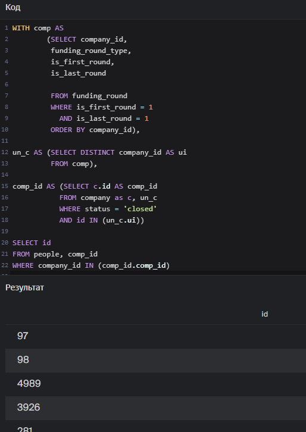
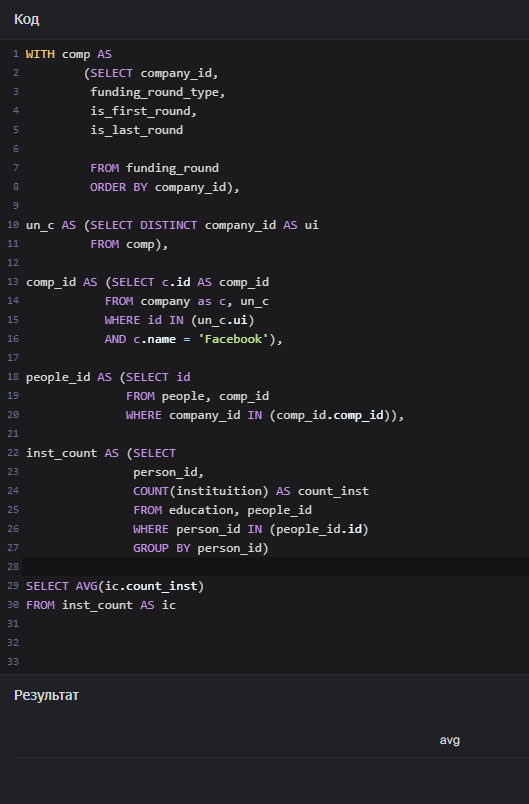

# Проект PostgreSQL

<h1>Содержание<span class='tocSkip'></span></h1>

* [1 Задача №1.](#my_section_1) <a id='content_1'></a>
* [2 Задача №2](#my_section_2) <a id='content_2'></a>
* [3 Задача №3](#my_section_3) <a id='content_3'></a>
* [4 Задача №4](#my_section_4) <a id='content_4'></a>
* [5 Задача №5](#my_section_5) <a id='content_5'></a>
* [6 Задача №6](#my_section_6) <a id='content_6'></a>
* [7 Задача №7](#my_section_7) <a id='content_7'></a>
* [8 Задача №8](#my_section_8) <a id='content_8'></a>
* [9 Задача №9](#my_section_9) <a id='content_9'></a>
* [10 Задача №10](#my_section_10) <a id='content_10'></a>
* [11 Задача №11](#my_section_11) <a id='content_11'></a>
* [12 Задача №12](#my_section_12) <a id='content_12'></a>
* [13 Задача №13](#my_section_13) <a id='content_13'></a>
* [14 Задача №14](#my_section_14) <a id='content_14'></a>
* [15 Задача №15](#my_section_15) <a id='content_15'></a>
* [16 Задача №16](#my_section_16) <a id='content_16'></a>
* [17 Задача №17](#my_section_17) <a id='content_17'></a>
* [18 Задача №18](#my_section_18) <a id='content_18'></a>
* [19 Задача №19](#my_section_19) <a id='content_19'></a>
* [20 Задача №20](#my_section_20) <a id='content_20'></a>
* [21 Задача №21](#my_section_21) <a id='content_21'></a>
* [22 Задача №22](#my_section_22) <a id='content_22'></a>
* [23 Задача №23](#my_section_23) <a id='content_23'></a>

**Данные**\
База данных основана на [Startup Investments](https://www.kaggle.com/datasets/justinas/startup-investments)


<a id='my_section_1'></a>
## [Задача №1.](#content_1)


Посчитайте, .. закрылось.


<a id='my_section_2'></a>
## [Задача №2](#content_2)


.. количество привлечённых средств ... .. из таблицы company. Отсортируйте .. .


<a id='my_section_3'></a>
## [Задача №3](#content_3)


.. общую сумму сделок .. за наличные с 2011 по 2013 ...


<a id='my_section_4'></a>
## [Задача №4](#content_4)

.. названия .. поле network_username, .. названия .. 'Silver'.


<a id='my_section_5'></a>
## [Задача №5](#content_5)

.. всю информацию .. содержат подстроку 'money', а фамилия .. на 'K'.


<a id='my_section_6'></a>
## [Задача №6](#content_6)

.. общую сумму привлечённых инвестиций, .. данные по убыванию суммы.


<a id='my_section_7'></a>
## [Задача №7](#content_7)

..дата проведения раунда, а также минимальное и мак.. в эту дату.
..е записи,..х ми..е суммы инвестиций не равно нулюи.ю.


<a id='my_section_8'></a>
## [Задача №8](#content_8)


Создайте поле с категориями
- Для фондов .. high_activity.
- Для фондов, .. middle_activity.
- .. low_activity.

Отобразите все поля таблицы fund и новое поле с категориями.:


<a id='my_section_9'></a>
## [Задача №9](#content_9)

Для каждой .. округлённое до ближайшего целого числа среднее количество инвестиционных раундов, .. .. категории и среднее число инвестиционных раундов..


<a id='my_section_10'></a>
## [Задача №10](#content_10)

..в каких странах находятся фонды..
.. посчитайте минимальное, максимальное и..ы, основанные с 2010 по 2012.о. Исключите..й, получивших инвестиции, равно нулю. 
Выгрузите десять самых активных стран-инвесторов: отсортируйт..у. Затем добавьте сортировк.ке.


<a id='my_section_11'></a>
## [Задача №11](#content_11)

Отобразите .. Добавьте поле .., если эта информация известна.


<a id='my_section_12'></a>
## [Задача №12](#content_12)

.. найдите количество учебных заведений, .. Выведите .. и число уникальных названий учебных .. Составьте топ-5 к..


<a id='my_section_13'></a>
## [Задача №13](#content_13)

.. список с уникальными названиями .., для которых первый раунд финансирования ..


<a id='my_section_14'></a>
## [Задача №14](#content_14)

Составьте список .., которые работают в компаниях, ..



<a id='my_section_15'></a>
## [Задача №15](#content_15)

Составьте таблицу, .. и учебным заведением, которое окончил сотрудник.


<a id='my_section_16'></a>
## [Задача №16](#content_16)

Посчитайте количество учебных заведений .. При подсчёте .., что некоторые сотрудники могли окончить одно и то же ..


<a id='my_section_17'></a>
## [Задача №17](#content_17)

Дополните .. выведите среднее .. (всех, не только уникальных), .. окончили сотрудники разных компаний. .. вывести только одну запись..


<a id='my_section_18'></a>
## [Задача №18](#content_18)

.. выведите среднее число учебных заведений (всех, не только уникальных), которые окончили сотрудники Facebook*.
*(сервис, запрещённый на территории РФ)



<a id='my_section_19'></a>
## [Задача №19](#content_19)

Составьте таблицу из полей:
- ..;
- ..;
- amount — ...

В таблицу войдут.. больше шести важных этапов, .. с 2012 по 2013 ...


<a id='my_section_20'></a>
## [Задача №20](#content_20)

Выгрузите таблицу, в которой будут такие поля:
- название компании-покупателя;
- сумма сделки;
- название компании, которую купили;
- сумма инвестиций, вложенных в купленную компанию;
- доля, которая отображает, во сколько раз сумма покупки превысила сумму вложенных в компанию инвестиций, округлённая до ближайшего целого числа.

Не ..улю. Если сумма ... 
Отсортируйте таблицу ... Ограничьте таблицу п...


<a id='my_section_21'></a>
## [Задача №21](#content_21)

Выгрузите таблицу, .. с 2010 по 2013 год включительно. ..Выведите также номер месяца, в котором проходил раунд финансирования.


<a id='my_section_22'></a>
## [Задача №22](#content_22)

Отберите данные по месяцам с 2010 по 2013 год, ... Сгруппируйте данные .. и получите таблицу, в которой будут поля:
- номер месяца,..;
-.. из США, которые инвестировали в этом месяце;
- количество компаний, ..;
- общая сумма сделок ...


<a id='my_section_23'></a>
## [Задача №23](#content_23)

Составьте сводную таблицу .., в которых есть стартапы, зарегистрированные в 2011, ..годах. Данные за .. поле. Отсортируйте .. за 2011 год от .. к ...


```python

```
