# Предсказание температуры сплава

<h1>Содержание<span class='tocSkip'></span></h1>

* [1 Подготовка и анализ](#my_section_1) <a id='content_1'></a>
  * [1.1 Вспомогательный блок](#my_section_2) <a id='content_2'></a>
  * [1.2 data_arc_new](#my_section_3) <a id='content_3'></a>
    * [1.2.1 Первичный осмотр](#my_section_4) <a id='content_4'></a>
    * [1.2.2 Выбросы](#my_section_5) <a id='content_5'></a>
    * [1.2.3 Распределение значений](#my_section_6) <a id='content_6'></a>
    * [1.2.4 Корреляция значений](#my_section_7) <a id='content_7'></a>
    * [1.2.5 Вывод](#my_section_8) <a id='content_8'></a>
  * [1.3 data_bulk_new](#my_section_9) <a id='content_9'></a>
    * [1.3.1 Первичный осмотр](#my_section_10) <a id='content_10'></a>
    * [1.3.2 Выбросы](#my_section_11) <a id='content_11'></a>
    * [1.3.3 Распределение значений](#my_section_12) <a id='content_12'></a>
    * [1.3.4 Корреляция значений](#my_section_13) <a id='content_13'></a>
    * [1.3.5 Вывод](#my_section_14) <a id='content_14'></a>
  * [1.4 data_bulk_time_new](#my_section_15) <a id='content_15'></a>
    * [1.4.1 Первичный осмотр](#my_section_16) <a id='content_16'></a>
    * [1.4.2 Вывод](#my_section_17) <a id='content_17'></a>
  * [1.5 data_gas_new](#my_section_18) <a id='content_18'></a>
    * [1.5.1 Первичный осмотр](#my_section_19) <a id='content_19'></a>
    * [1.5.2 Выбросы](#my_section_20) <a id='content_20'></a>
    * [1.5.3 Распределение значений](#my_section_21) <a id='content_21'></a>
    * [1.5.4 Вывод](#my_section_22) <a id='content_22'></a>
  * [1.6 data_temp_new](#my_section_23) <a id='content_23'></a>
    * [1.6.1 Первичный осмотр](#my_section_24) <a id='content_24'></a>
    * [1.6.2 Выбросы](#my_section_25) <a id='content_25'></a>
    * [1.6.3 Распределение значений](#my_section_26) <a id='content_26'></a>
    * [1.6.4 Вывод](#my_section_27) <a id='content_27'></a>
  * [1.7  data_wire_new](#my_section_28) <a id='content_28'></a>
    * [1.7.1 Первичный осмотр](#my_section_29) <a id='content_29'></a>
    * [1.7.2 Выбросы](#my_section_30) <a id='content_30'></a>
    * [1.7.3 Распределение значений](#my_section_31) <a id='content_31'></a>
    * [1.7.4 Вывод](#my_section_32) <a id='content_32'></a>
  * [1.8 data_wire_time_new](#my_section_33) <a id='content_33'></a>
    * [1.8.1 Вывод](#my_section_34) <a id='content_34'></a>
  * [1.9 Сравнение временных интервалов](#my_section_35) <a id='content_35'></a>
  * [1.10 Вывод](#my_section_36) <a id='content_36'></a>
* [2 Предобработка](#my_section_37) <a id='content_37'></a>
  * [2.1 data_arc_new](#my_section_38) <a id='content_38'></a>
    * [2.1.1 Агрегирование](#my_section_39) <a id='content_39'></a>
  * [2.2 data_bulk_new](#my_section_40) <a id='content_40'></a>
  * [2.3 data_gas_new](#my_section_41) <a id='content_41'></a>
  * [2.4 data_temp_new](#my_section_42) <a id='content_42'></a>
    * [2.4.1 Оптимальная температура плавки](#my_section_43) <a id='content_43'></a>
    * [2.4.2 Агрегирование](#my_section_44) <a id='content_44'></a>
  * [2.5 data_wire_new](#my_section_45) <a id='content_45'></a>
  * [2.6 Объединение](#my_section_46) <a id='content_46'></a>
    * [2.6.1 Корреляция](#my_section_47) <a id='content_47'></a>
* [3 Подготовка признаков](#my_section_48) <a id='content_48'></a>
  * [3.1 Вспомогательный блок](#my_section_49) <a id='content_49'></a>
  * [3.2 Разделение на выбороки](#my_section_50) <a id='content_50'></a>
  * [3.3 Изучение и обработка выборок](#my_section_51) <a id='content_51'></a>
    * [3.3.1 train](#my_section_52) <a id='content_52'></a>
      * [3.3.1.1 температура](#my_section_53) <a id='content_53'></a>
      * [3.3.1.2 газ](#my_section_54) <a id='content_54'></a>
      * [3.3.1.3 акт_мощ(median)](#my_section_55) <a id='content_55'></a>
      * [3.3.1.4 дуга_сек(median)](#my_section_56) <a id='content_56'></a>
      * [3.3.1.5 Вывод](#my_section_57) <a id='content_57'></a>
  * [3.4 Обучающий и целевой](#my_section_58) <a id='content_58'></a>
* [4 Обучение](#my_section_59) <a id='content_59'></a>
  * [4.1 LinearRegression](#my_section_60) <a id='content_60'></a>
  * [4.2 LightGBM](#my_section_61) <a id='content_61'></a>
  * [4.3 CatBoostRegressor](#my_section_62) <a id='content_62'></a>
  * [4.4 Тестирование](#my_section_63) <a id='content_63'></a>
  * [4.5 Анализ важности факторов](#my_section_64) <a id='content_64'></a>
* [5 Вывод](#my_section_65) <a id='content_65'></a>
* [6 Отчёт](#my_section_66) <a id='content_66'></a>

**Описание проекта**:<br/>
Чтобы оптимизировать производственные расходы, м..

**Задача**:<br/>
Построить модель, которая предскажет температуру стали.

**Описание этапа обработки**<br/>
1. Сталь обрабатывают в металлическом ковше ..
2. Из сплава выводится..
3. .. легирующие добавки, измеряют температуру ..
4. .. расплавленная сталь отправляется ...

**Описание данных**<br/>
Данные состоят из файлов, полученных из разных источников:
- data_arc_new.csv — данные об электродах;
- data_bulk_new.csv — данные о подаче сыпучих материалов (объём);
- data_bulk_time_new.csv — данные о подаче сыпучих материалов (время);
- data_gas_new.csv — данные о продувке сплава газом;
- data_temp_new.csv — результаты измерения температуры;
- data_wire_new.csv — данные о проволочных материалах (объём);
- data_wire_time_new.csv — данные о проволочных материалах (время). <br/>

Во всех файлах столбец `key` содержит номер партии. В файлах может быть несколько строк с одинаковым значением `key`: они соответствуют разным итерациям обработки.

**План работы** <br/>
1. Подготовка и анализ;
2. Предобработка;
3. Подготовка признаков;
4. Обучение;
5. Выводы


<a id='my_section_1'></a>
## [Подготовка и анализ](#content_1)

Произведём импорт основных библиотек и модулей


```python
import pandas as pd
from IPython.display import display
import seaborn as sns
import matplotlib.pyplot as plt

from sklearn.metrics import mean_absolute_error, make_scorer
from sklearn.model_selection import (train_test_split,
                                     cross_val_score,
                                     GridSearchCV)
from sklearn.linear_model import LinearRegression
from catboost import CatBoostRegressor
import lightgbm as lgb
```

Определим функцию для загрузки файлов


```python
def download_file(name):
    """
    Функция проходит по возможным директориям
    в попытке найти файл, используя конструкции
    try, except и итераторы. Возвращая прочтённый
    файл или ошибку, если файл не найден.
    """
    def read(name):
        next_step = next(step)
        print(f'Пробую найти файл в {next_step}: {directory[next_step]}.')
        return pd.read_csv(directory[next_step] + name + '.csv', index_col=[0], parse_dates=[0], sep=',')

    def error(err):
        print(f'Возникла ошибка: {err}\n')

    print('\nИщем файл для имени:', name)    
    directory = {'windows':'', 'linux':'/datasets/', 'Internet':'https:..'}
    step = iter(directory)

    try:
        data = read(name)
    except FileNotFoundError as err1:
        try:
            data = read(name)
        except FileNotFoundError as err2:
            try:
                data = read(name)
            except Exception as err3:
                error(err1)
                error(err2)
                return error(err3)

    print('Успех!')
    return data
```

**Получим файлы**


```python
data_arc_new = download_file('data_arc_new')
data_bulk_new = download_file('data_bulk_new')
data_bulk_time_new = download_file('data_bulk_time_new')
data_gas_new = download_file('data_gas_new')
data_temp_new = download_file('data_temp_new')
data_wire_new = download_file('data_wire_new')
data_wire_time_new = download_file('data_wire_time_new')
```

    
    Ищем файл для имени: data_arc_new
    Пробую найти файл в windows: .
    Пробую найти файл в linux: /datasets/.
    Успех!
    
    Ищем файл для имени: data_bulk_new
    Пробую найти файл в windows: .
    Пробую найти файл в linux: /datasets/.
    Успех!
    
    Ищем файл для имени: data_bulk_time_new
    Пробую найти файл в windows: .
    Пробую найти файл в linux: /datasets/.
    Успех!
    
    Ищем файл для имени: data_gas_new
    Пробую найти файл в windows: .
    Пробую найти файл в linux: /datasets/.
    Успех!
    
    Ищем файл для имени: data_temp_new
    Пробую найти файл в windows: .
    Пробую найти файл в linux: /datasets/.
    Успех!
    
    Ищем файл для имени: data_wire_new
    Пробую найти файл в windows: .
    Пробую найти файл в linux: /datasets/.
    Успех!
    
    Ищем файл для имени: data_wire_time_new
    Пробую найти файл в windows: .
    Пробую найти файл в linux: /datasets/.
    Успех!
    

*Проведём изучение каждого из них*

<a id='my_section_2'></a>
### [Вспомогательный блок](#content_2)

Подготовим блок функций для анализа, определим функцию.


```python
def head_tail_info_desc(name):
    print(f'\n.head()')
    display(name.head())
    
    print(f'\n.tail()')
    display(name.tail())
    
    print(f'\n.info()')
    display(name.info())
    
    print(f'\n.describe()')
    display(name.describe())
```

<a id='my_section_3'></a>
### [data_arc_new](#content_3)

<a id='my_section_4'></a>
#### [Первичный осмотр](#content_4)


```python
head_tail_info_desc(data_arc_new)
```

    
    .head()
    


<div>
<style scoped>
    .dataframe tbody tr th:only-of-type {
        vertical-align: middle;
    }

    .dataframe tbody tr th {
        vertical-align: top;
    }

    .dataframe thead th {
        text-align: right;
    }
</style>
<table border="1" class="dataframe">
  <thead>
    <tr style="text-align: right;">
      <th></th>
      <th>Начало нагрева дугой</th>
      <th>Конец нагрева дугой</th>
      <th>Активная мощность</th>
      <th>Реактивная мощность</th>
    </tr>
    <tr>
      <th>key</th>
      <th></th>
      <th></th>
      <th></th>
      <th></th>
    </tr>
  </thead>
  <tbody>
    <tr>
      <th>1</th>
      <td>2019-05-03 11:02:14</td>
      <td>2019-05-03 11:06:02</td>
      <td>0.305130</td>
      <td>0.211253</td>
    </tr>
    <tr>
      <th>1</th>
      <td>2019-05-03 11:07:28</td>
      <td>2019-05-03 11:10:33</td>
      <td>0.765658</td>
      <td>0.477438</td>
    </tr>
    <tr>
      <th>1</th>
      <td>2019-05-03 11:11:44</td>
      <td>2019-05-03 11:14:36</td>
      <td>0.580313</td>
      <td>0.430460</td>
    </tr>
    <tr>
      <th>1</th>
      <td>2019-05-03 11:18:14</td>
      <td>2019-05-03 11:24:19</td>
      <td>0.518496</td>
      <td>0.379979</td>
    </tr>
    <tr>
      <th>1</th>
      <td>2019-05-03 11:26:09</td>
      <td>2019-05-03 11:28:37</td>
      <td>0.867133</td>
      <td>0.643691</td>
    </tr>
  </tbody>
</table>
</div>


    
    .tail()
    


<div>
<style scoped>
    .dataframe tbody tr th:only-of-type {
        vertical-align: middle;
    }

    .dataframe tbody tr th {
        vertical-align: top;
    }

    .dataframe thead th {
        text-align: right;
    }
</style>
<table border="1" class="dataframe">
  <thead>
    <tr style="text-align: right;">
      <th></th>
      <th>Начало нагрева дугой</th>
      <th>Конец нагрева дугой</th>
      <th>Активная мощность</th>
      <th>Реактивная мощность</th>
    </tr>
    <tr>
      <th>key</th>
      <th></th>
      <th></th>
      <th></th>
      <th></th>
    </tr>
  </thead>
  <tbody>
    <tr>
      <th>3241</th>
      <td>2019-09-06 16:49:05</td>
      <td>2019-09-06 16:51:42</td>
      <td>0.439735</td>
      <td>0.299579</td>
    </tr>
    <tr>
      <th>3241</th>
      <td>2019-09-06 16:55:11</td>
      <td>2019-09-06 16:58:11</td>
      <td>0.646498</td>
      <td>0.458240</td>
    </tr>
    <tr>
      <th>3241</th>
      <td>2019-09-06 17:06:48</td>
      <td>2019-09-06 17:09:52</td>
      <td>1.039726</td>
      <td>0.769302</td>
    </tr>
    <tr>
      <th>3241</th>
      <td>2019-09-06 17:21:58</td>
      <td>2019-09-06 17:22:55</td>
      <td>0.530267</td>
      <td>0.361543</td>
    </tr>
    <tr>
      <th>3241</th>
      <td>2019-09-06 17:24:54</td>
      <td>2019-09-06 17:26:15</td>
      <td>0.389057</td>
      <td>0.251347</td>
    </tr>
  </tbody>
</table>
</div>


    
    .info()
    <class 'pandas.core.frame.DataFrame'>
    Int64Index: 14876 entries, 1 to 3241
    Data columns (total 4 columns):
     #   Column                Non-Null Count  Dtype  
    ---  ------                --------------  -----  
     0   Начало нагрева дугой  14876 non-null  object 
     1   Конец нагрева дугой   14876 non-null  object 
     2   Активная мощность     14876 non-null  float64
     3   Реактивная мощность   14876 non-null  float64
    dtypes: float64(2), object(2)
    memory usage: 581.1+ KB
    


    None


    
    .describe()
    


<div>
<style scoped>
    .dataframe tbody tr th:only-of-type {
        vertical-align: middle;
    }

    .dataframe tbody tr th {
        vertical-align: top;
    }

    .dataframe thead th {
        text-align: right;
    }
</style>
<table border="1" class="dataframe">
  <thead>
    <tr style="text-align: right;">
      <th></th>
      <th>Активная мощность</th>
      <th>Реактивная мощность</th>
    </tr>
  </thead>
  <tbody>
    <tr>
      <th>count</th>
      <td>14876.000000</td>
      <td>14876.000000</td>
    </tr>
    <tr>
      <th>mean</th>
      <td>0.662752</td>
      <td>0.438986</td>
    </tr>
    <tr>
      <th>std</th>
      <td>0.258885</td>
      <td>5.873485</td>
    </tr>
    <tr>
      <th>min</th>
      <td>0.223120</td>
      <td>-715.479924</td>
    </tr>
    <tr>
      <th>25%</th>
      <td>0.467115</td>
      <td>0.337175</td>
    </tr>
    <tr>
      <th>50%</th>
      <td>0.599587</td>
      <td>0.441639</td>
    </tr>
    <tr>
      <th>75%</th>
      <td>0.830070</td>
      <td>0.608201</td>
    </tr>
    <tr>
      <th>max</th>
      <td>1.463773</td>
      <td>1.270284</td>
    </tr>
  </tbody>
</table>
</div>


**Вывод:**<br/>
Данные представлены в 4 колонках, две из которых представляют информацию о времени(*Начало нагрева дугой, Конец нагрева дугой*), две других, дают количественные значения мощности(*Активная* и *Реактивная мощность*). Из результата работы функций ясно следющее:
1. head, tail:
 - данные представлены за 2019 год, с 3 мая по 6 сентября;
 - имеется 3241 партия;
 - время нагрева составляет несколько минут меньше 10;
 - появляется предположение, что коэффициент из рассчета активной и реактивной мощности может играть важную роль в диагностике потребления электроэнергии;
 - данные в активной и реактивной мощности, предположительно представлены в диапазоне от 0 до 1, в чем измеряются параметры не известно.
 
 
2. info:
 - данные не имеют пропусков;
 - имеется 14876 значений, что означает примерно 4.59 итерации на сборку;
 - колонки с началом и концом нагрева необходимо преобразовать в соответствующий формат.
 
 
3. describe (изучены столбцы активной и реактивной мощности):
 - не ясно, какие граничные значения может принимать активная и реактивнвая мощности, данные лучше уточнить;
 - среднее значение для активной и реактивной мощностей составляет 0.66 и 0.43 соответственно;
 - минимальные значения сильно разняться, предположительно влияние выборосов, подобные значения стоит либо убрать, либо обработать в соответствии с рекомендациями заказчика;
 - средние и максимальные значения близки друг другу, но имеют сейчас неточность в связи с влиянием выбросов, данные требуется уточнить.
 
 
 


Изучим сколько партий есть в наборе данных. Для этого поместим те, которых нет(в промежутке от 1 до 3241) в отдельный список.


```python
mis_val = []
for i in range(data_arc_new.index.unique().values.max()):
    if i+1 not in data_arc_new.index.unique().values:
        mis_val.append(i+1)
        
print(mis_val)
```

    [41, 42, 195, 279, 355, 382, 506, 529, 540, 607, 683, 710, 766, 1133, 1300, 1437, 2031, 2103, 2278, 2356, 2373, 2446, 2469, 2491, 2683, 3200, 3207]
    

Оценим сколько циклов бывает


```python
data_arc_new.index.value_counts().describe()
```


    count    3214.000000
    mean        4.628500
    std         1.608647
    min         1.000000
    25%         4.000000
    50%         4.000000
    75%         6.000000
    max        16.000000
    Name: key, dtype: float64


*Данные представлены циклами от 1 до 16*

Проведём простейшую предобработку.


```python
data_arc_new['Начало нагрева дугой'] = pd.to_datetime(data_arc_new['Начало нагрева дугой'], format='%Y-%m-%d %H:%M:%S')
data_arc_new['Конец нагрева дугой'] = pd.to_datetime(data_arc_new['Конец нагрева дугой'], format='%Y-%m-%d %H:%M:%S')
```

<a id='my_section_5'></a>
#### [Выбросы](#content_5)
Изучим выбросы в столбцах:
 - Активная мощность;
 - Реактивная мощность.


```python
fig, ax = plt.subplots(1, 2, figsize = (12, 6))
fig.suptitle('Ящик с усами', fontsize=14, fontweight='bold')
fig.subplots_adjust(top=0.9)

moustache_dan = {}
param = {'Активная мощность':None, 'Реактивная мощность':None}
count = 0
for key, val in param.items():
    b = ax[count].boxplot(data_arc_new[key])
    #Выделение крайних усов боксплота
    moustache_dan[key] = [item.get_ydata()[1] for item in b['whiskers']]
    ax[count].grid()
    ax[count].set_title(key)
    ax[count].set_xlabel('Выборка значений')
    ax[count].set_ylabel('Разброс параметров')
    count += 1

```


    

    


Изучим границы усов


```python
print(moustache_dan)
```

    {'Активная мощность': [0.22312, 1.373621], 'Реактивная мощность': [0.153777, 1.014739]}
    

*На первом графике параметры мощности представлены достаточно близко друг другу. Так как это производство, то с обрезанием по усам значений надо быть аккуратным, поэтому параметры граничных значений можно попробовать узнать у заказчика. Второй график надо изучить подробнее, чтобы определить по каким границам строить ящик с усами.*


```python
data_arc_new.hist(column='Реактивная мощность',bins=100)
plt.xlabel('Мощность')
plt.ylabel('Количество')
```


    Text(0, 0.5, 'Количество')


    
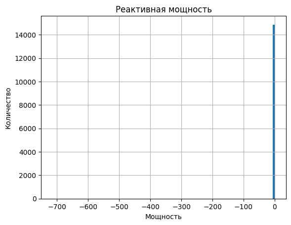
    


```python
data_arc_new.sort_values(by='Реактивная мощность').head(5)
```


<div>
<style scoped>
    .dataframe tbody tr th:only-of-type {
        vertical-align: middle;
    }

    .dataframe tbody tr th {
        vertical-align: top;
    }

    .dataframe thead th {
        text-align: right;
    }
</style>
<table border="1" class="dataframe">
  <thead>
    <tr style="text-align: right;">
      <th></th>
      <th>Начало нагрева дугой</th>
      <th>Конец нагрева дугой</th>
      <th>Активная мощность</th>
      <th>Реактивная мощность</th>
    </tr>
    <tr>
      <th>key</th>
      <th></th>
      <th></th>
      <th></th>
      <th></th>
    </tr>
  </thead>
  <tbody>
    <tr>
      <th>2116</th>
      <td>2019-07-28 02:22:08</td>
      <td>2019-07-28 02:23:57</td>
      <td>0.705344</td>
      <td>-715.479924</td>
    </tr>
    <tr>
      <th>152</th>
      <td>2019-05-09 11:26:58</td>
      <td>2019-05-09 11:29:41</td>
      <td>0.228852</td>
      <td>0.153777</td>
    </tr>
    <tr>
      <th>711</th>
      <td>2019-05-31 07:16:01</td>
      <td>2019-05-31 07:20:05</td>
      <td>0.242989</td>
      <td>0.153921</td>
    </tr>
    <tr>
      <th>2567</th>
      <td>2019-08-13 05:51:16</td>
      <td>2019-08-13 05:52:22</td>
      <td>0.288314</td>
      <td>0.155221</td>
    </tr>
    <tr>
      <th>1336</th>
      <td>2019-06-22 15:46:26</td>
      <td>2019-06-22 15:47:50</td>
      <td>0.244191</td>
      <td>0.156525</td>
    </tr>
  </tbody>
</table>
</div>


*Других выбивающихся значений не обнаружено, ограничим выборку.*


```python
b = data_arc_new.query('0 < `Реактивная мощность` < 1.28')\
    .boxplot(column = 'Реактивная мощность', figsize=(8,5), return_type='dict')

plt.ylabel('Мощность')
plt.title('Ящик с усами')

moustache_dan['Реактивная мощность'] = [item.get_ydata()[1] for item in b['whiskers']]
```


    
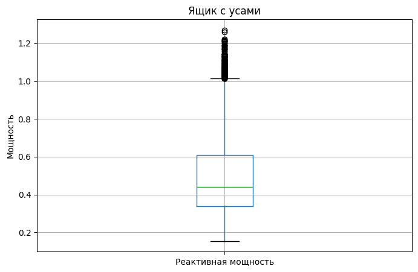
    


Перепроверим параметры


```python
print(moustache_dan)
```

    {'Активная мощность': [0.22312, 1.373621], 'Реактивная мощность': [0.153777, 1.014739]}
    


```python
ans = data_arc_new.loc[(data_arc_new['Активная мощность'] > moustache_dan["Активная мощность"][0]) &
                 (data_arc_new['Активная мощность'] < moustache_dan["Активная мощность"][1]) &
                 (data_arc_new['Реактивная мощность'] > moustache_dan["Реактивная мощность"][0]) &
                 (data_arc_new['Реактивная мощность'] < moustache_dan["Реактивная мощность"][1])]

print('Процентное количество выбросов:', round(1 - ans.shape[0]/data_arc_new.shape[0],2))
```

    Процентное количество выбросов: 0.02
    

*Достаточно малое количество выбросов говорит о возможности удаления*

<a id='my_section_6'></a>
#### [Распределение значений](#content_6)


```python
data_arc_new.hist(column='Активная мощность', bins=200, figsize=(12,4))
plt.xlabel('Мощность')
plt.ylabel('Количествово');
```


    
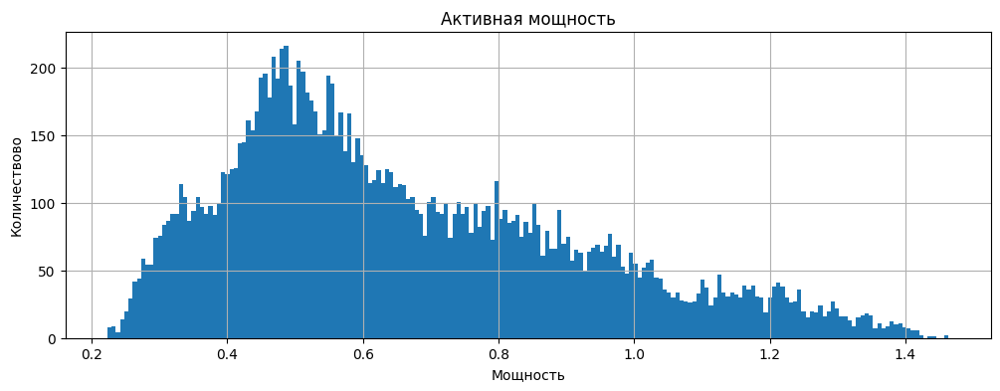
    


```python
data_arc_new.query('0 < `Реактивная мощность` < 1.28')\
.hist(column='Реактивная мощность', bins=200, figsize=(12,4))
plt.xlabel('Мощность')
plt.ylabel('Количествово');
```


    
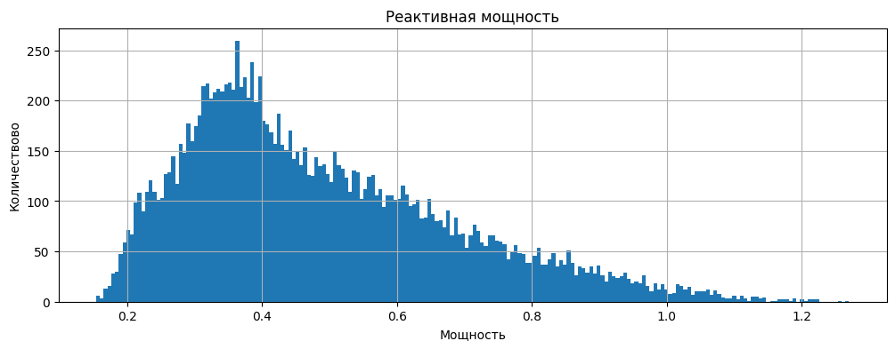
    


**Вывод**: распределение рассмотренных графиков смещено вправо.

<a id='my_section_7'></a>
#### [Корреляция значений](#content_7)


```python
data_arc_new.corr()
```


<div>
<style scoped>
    .dataframe tbody tr th:only-of-type {
        vertical-align: middle;
    }

    .dataframe tbody tr th {
        vertical-align: top;
    }

    .dataframe thead th {
        text-align: right;
    }
</style>
<table border="1" class="dataframe">
  <thead>
    <tr style="text-align: right;">
      <th></th>
      <th>Активная мощность</th>
      <th>Реактивная мощность</th>
    </tr>
  </thead>
  <tbody>
    <tr>
      <th>Активная мощность</th>
      <td>1.000000</td>
      <td>0.031164</td>
    </tr>
    <tr>
      <th>Реактивная мощность</th>
      <td>0.031164</td>
      <td>1.000000</td>
    </tr>
  </tbody>
</table>
</div>


*На первый взгляд наблюдается её отсутствие, однако, если граничить выборку по выбросам, получим следующий результат.*


```python
data_arc_new.query('0 < `Реактивная мощность` < 1.28')\
.plot(x='Активная мощность', y='Реактивная мощность', kind='scatter', alpha=0.08, grid=True);
```


    
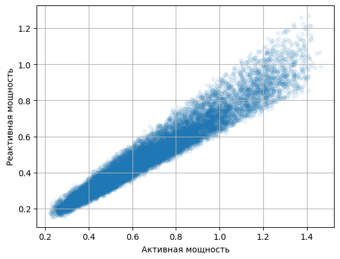
    


```python
data_arc_new.query('0 < `Реактивная мощность` < 1.28').corr()
```


<div>
<style scoped>
    .dataframe tbody tr th:only-of-type {
        vertical-align: middle;
    }

    .dataframe tbody tr th {
        vertical-align: top;
    }

    .dataframe thead th {
        text-align: right;
    }
</style>
<table border="1" class="dataframe">
  <thead>
    <tr style="text-align: right;">
      <th></th>
      <th>Активная мощность</th>
      <th>Реактивная мощность</th>
    </tr>
  </thead>
  <tbody>
    <tr>
      <th>Активная мощность</th>
      <td>1.000000</td>
      <td>0.966373</td>
    </tr>
    <tr>
      <th>Реактивная мощность</th>
      <td>0.966373</td>
      <td>1.000000</td>
    </tr>
  </tbody>
</table>
</div>


Данные параметры должны быть еще лучше и стремиться к 1, вероятно, что причиной являются погрешности измерений.

<a id='my_section_8'></a>
#### [Вывод](#content_8)

Обзор данных выявил:
- данные представлены за 2019 год, с 3 мая по 6 сентября;
- имеется 3241 партия и 14876 значений, что означает примерно 4.59 итерации на сборку;
- время нагрева составляет несколько минут меньше 10;
- появляется предположение, что коэффициент из рассчета активной и реактивной мощности может играть важную роль в диагностике потребления электроэнергии;
- данные в активной и реактивной мощности, предположительно представлены в диапазоне от 0 до 1, в чем измеряются параметры не известно;
- данные не имеют пропусков;
- изучены столбцы активной и реактивной мощности. Не ясно, какие граничные значения может принимать активная и реактивнвая мощности, данные лучше уточнить;
- среднее значение для активной и реактивной мощностей составляет 0.66 и 0.43 соответственно;
- минимальные значения сильно разняться, предположительно влияние выборосов, подобные значения стоит либо убрать, либо обработать в соответствии с рекомендациями заказчика;
- средние и максимальные значения близки друг другу, но имеют сейчас неточность в связи с влиянием выбросов, данные требуется уточнить;
- распределение данных в столбцах 'Реактивная мощность' и 'Активная мощность' смещено вправо;
- наблюдается корреляция;
- данные представлены циклами от 1 до 16;
- партии представлены с промежутками в данных. Почему?
 

<a id='my_section_9'></a>
### [data_bulk_new](#content_9)

<a id='my_section_10'></a>
#### [Первичный осмотр](#content_10)


```python
head_tail_info_desc(data_bulk_new)
```

    
    .head()
    


<div>
<style scoped>
    .dataframe tbody tr th:only-of-type {
        vertical-align: middle;
    }

    .dataframe tbody tr th {
        vertical-align: top;
    }

    .dataframe thead th {
        text-align: right;
    }
</style>
<table border="1" class="dataframe">
  <thead>
    <tr style="text-align: right;">
      <th></th>
      <th>Bulk 1</th>
      <th>Bulk 2</th>
      <th>Bulk 3</th>
      <th>Bulk 4</th>
      <th>Bulk 5</th>
      <th>Bulk 6</th>
      <th>Bulk 7</th>
      <th>Bulk 8</th>
      <th>Bulk 9</th>
      <th>Bulk 10</th>
      <th>Bulk 11</th>
      <th>Bulk 12</th>
      <th>Bulk 13</th>
      <th>Bulk 14</th>
      <th>Bulk 15</th>
    </tr>
    <tr>
      <th>key</th>
      <th></th>
      <th></th>
      <th></th>
      <th></th>
      <th></th>
      <th></th>
      <th></th>
      <th></th>
      <th></th>
      <th></th>
      <th></th>
      <th></th>
      <th></th>
      <th></th>
      <th></th>
    </tr>
  </thead>
  <tbody>
    <tr>
      <th>1</th>
      <td>NaN</td>
      <td>NaN</td>
      <td>NaN</td>
      <td>43.0</td>
      <td>NaN</td>
      <td>NaN</td>
      <td>NaN</td>
      <td>NaN</td>
      <td>NaN</td>
      <td>NaN</td>
      <td>NaN</td>
      <td>206.0</td>
      <td>NaN</td>
      <td>150.0</td>
      <td>154.0</td>
    </tr>
    <tr>
      <th>2</th>
      <td>NaN</td>
      <td>NaN</td>
      <td>NaN</td>
      <td>73.0</td>
      <td>NaN</td>
      <td>NaN</td>
      <td>NaN</td>
      <td>NaN</td>
      <td>NaN</td>
      <td>NaN</td>
      <td>NaN</td>
      <td>206.0</td>
      <td>NaN</td>
      <td>149.0</td>
      <td>154.0</td>
    </tr>
    <tr>
      <th>3</th>
      <td>NaN</td>
      <td>NaN</td>
      <td>NaN</td>
      <td>34.0</td>
      <td>NaN</td>
      <td>NaN</td>
      <td>NaN</td>
      <td>NaN</td>
      <td>NaN</td>
      <td>NaN</td>
      <td>NaN</td>
      <td>205.0</td>
      <td>NaN</td>
      <td>152.0</td>
      <td>153.0</td>
    </tr>
    <tr>
      <th>4</th>
      <td>NaN</td>
      <td>NaN</td>
      <td>NaN</td>
      <td>81.0</td>
      <td>NaN</td>
      <td>NaN</td>
      <td>NaN</td>
      <td>NaN</td>
      <td>NaN</td>
      <td>NaN</td>
      <td>NaN</td>
      <td>207.0</td>
      <td>NaN</td>
      <td>153.0</td>
      <td>154.0</td>
    </tr>
    <tr>
      <th>5</th>
      <td>NaN</td>
      <td>NaN</td>
      <td>NaN</td>
      <td>78.0</td>
      <td>NaN</td>
      <td>NaN</td>
      <td>NaN</td>
      <td>NaN</td>
      <td>NaN</td>
      <td>NaN</td>
      <td>NaN</td>
      <td>203.0</td>
      <td>NaN</td>
      <td>151.0</td>
      <td>152.0</td>
    </tr>
  </tbody>
</table>
</div>


    
    .tail()
    


<div>
<style scoped>
    .dataframe tbody tr th:only-of-type {
        vertical-align: middle;
    }

    .dataframe tbody tr th {
        vertical-align: top;
    }

    .dataframe thead th {
        text-align: right;
    }
</style>
<table border="1" class="dataframe">
  <thead>
    <tr style="text-align: right;">
      <th></th>
      <th>Bulk 1</th>
      <th>Bulk 2</th>
      <th>Bulk 3</th>
      <th>Bulk 4</th>
      <th>Bulk 5</th>
      <th>Bulk 6</th>
      <th>Bulk 7</th>
      <th>Bulk 8</th>
      <th>Bulk 9</th>
      <th>Bulk 10</th>
      <th>Bulk 11</th>
      <th>Bulk 12</th>
      <th>Bulk 13</th>
      <th>Bulk 14</th>
      <th>Bulk 15</th>
    </tr>
    <tr>
      <th>key</th>
      <th></th>
      <th></th>
      <th></th>
      <th></th>
      <th></th>
      <th></th>
      <th></th>
      <th></th>
      <th></th>
      <th></th>
      <th></th>
      <th></th>
      <th></th>
      <th></th>
      <th></th>
    </tr>
  </thead>
  <tbody>
    <tr>
      <th>3237</th>
      <td>NaN</td>
      <td>NaN</td>
      <td>170.0</td>
      <td>NaN</td>
      <td>NaN</td>
      <td>NaN</td>
      <td>NaN</td>
      <td>NaN</td>
      <td>NaN</td>
      <td>NaN</td>
      <td>NaN</td>
      <td>252.0</td>
      <td>NaN</td>
      <td>130.0</td>
      <td>206.0</td>
    </tr>
    <tr>
      <th>3238</th>
      <td>NaN</td>
      <td>NaN</td>
      <td>126.0</td>
      <td>NaN</td>
      <td>NaN</td>
      <td>NaN</td>
      <td>NaN</td>
      <td>NaN</td>
      <td>NaN</td>
      <td>NaN</td>
      <td>NaN</td>
      <td>254.0</td>
      <td>NaN</td>
      <td>108.0</td>
      <td>106.0</td>
    </tr>
    <tr>
      <th>3239</th>
      <td>NaN</td>
      <td>NaN</td>
      <td>NaN</td>
      <td>NaN</td>
      <td>NaN</td>
      <td>114.0</td>
      <td>NaN</td>
      <td>NaN</td>
      <td>NaN</td>
      <td>NaN</td>
      <td>NaN</td>
      <td>158.0</td>
      <td>NaN</td>
      <td>270.0</td>
      <td>88.0</td>
    </tr>
    <tr>
      <th>3240</th>
      <td>NaN</td>
      <td>NaN</td>
      <td>NaN</td>
      <td>NaN</td>
      <td>NaN</td>
      <td>26.0</td>
      <td>NaN</td>
      <td>NaN</td>
      <td>NaN</td>
      <td>NaN</td>
      <td>NaN</td>
      <td>NaN</td>
      <td>NaN</td>
      <td>192.0</td>
      <td>54.0</td>
    </tr>
    <tr>
      <th>3241</th>
      <td>NaN</td>
      <td>NaN</td>
      <td>NaN</td>
      <td>NaN</td>
      <td>NaN</td>
      <td>NaN</td>
      <td>NaN</td>
      <td>NaN</td>
      <td>NaN</td>
      <td>NaN</td>
      <td>NaN</td>
      <td>NaN</td>
      <td>NaN</td>
      <td>180.0</td>
      <td>52.0</td>
    </tr>
  </tbody>
</table>
</div>


    
    .info()
    <class 'pandas.core.frame.DataFrame'>
    Int64Index: 3129 entries, 1 to 3241
    Data columns (total 15 columns):
     #   Column   Non-Null Count  Dtype  
    ---  ------   --------------  -----  
     0   Bulk 1   252 non-null    float64
     1   Bulk 2   22 non-null     float64
     2   Bulk 3   1298 non-null   float64
     3   Bulk 4   1014 non-null   float64
     4   Bulk 5   77 non-null     float64
     5   Bulk 6   576 non-null    float64
     6   Bulk 7   25 non-null     float64
     7   Bulk 8   1 non-null      float64
     8   Bulk 9   19 non-null     float64
     9   Bulk 10  176 non-null    float64
     10  Bulk 11  177 non-null    float64
     11  Bulk 12  2450 non-null   float64
     12  Bulk 13  18 non-null     float64
     13  Bulk 14  2806 non-null   float64
     14  Bulk 15  2248 non-null   float64
    dtypes: float64(15)
    memory usage: 391.1 KB
    


    None


    
    .describe()
    


<div>
<style scoped>
    .dataframe tbody tr th:only-of-type {
        vertical-align: middle;
    }

    .dataframe tbody tr th {
        vertical-align: top;
    }

    .dataframe thead th {
        text-align: right;
    }
</style>
<table border="1" class="dataframe">
  <thead>
    <tr style="text-align: right;">
      <th></th>
      <th>Bulk 1</th>
      <th>Bulk 2</th>
      <th>Bulk 3</th>
      <th>Bulk 4</th>
      <th>Bulk 5</th>
      <th>Bulk 6</th>
      <th>Bulk 7</th>
      <th>Bulk 8</th>
      <th>Bulk 9</th>
      <th>Bulk 10</th>
      <th>Bulk 11</th>
      <th>Bulk 12</th>
      <th>Bulk 13</th>
      <th>Bulk 14</th>
      <th>Bulk 15</th>
    </tr>
  </thead>
  <tbody>
    <tr>
      <th>count</th>
      <td>252.000000</td>
      <td>22.000000</td>
      <td>1298.000000</td>
      <td>1014.000000</td>
      <td>77.000000</td>
      <td>576.000000</td>
      <td>25.000000</td>
      <td>1.0</td>
      <td>19.000000</td>
      <td>176.000000</td>
      <td>177.000000</td>
      <td>2450.000000</td>
      <td>18.000000</td>
      <td>2806.000000</td>
      <td>2248.000000</td>
    </tr>
    <tr>
      <th>mean</th>
      <td>39.242063</td>
      <td>253.045455</td>
      <td>113.879045</td>
      <td>104.394477</td>
      <td>107.025974</td>
      <td>118.925347</td>
      <td>305.600000</td>
      <td>49.0</td>
      <td>76.315789</td>
      <td>83.284091</td>
      <td>76.819209</td>
      <td>260.471020</td>
      <td>181.111111</td>
      <td>170.284747</td>
      <td>160.513345</td>
    </tr>
    <tr>
      <th>std</th>
      <td>18.277654</td>
      <td>21.180578</td>
      <td>75.483494</td>
      <td>48.184126</td>
      <td>81.790646</td>
      <td>72.057776</td>
      <td>191.022904</td>
      <td>NaN</td>
      <td>21.720581</td>
      <td>26.060347</td>
      <td>59.655365</td>
      <td>120.649269</td>
      <td>46.088009</td>
      <td>65.868652</td>
      <td>51.765319</td>
    </tr>
    <tr>
      <th>min</th>
      <td>10.000000</td>
      <td>228.000000</td>
      <td>6.000000</td>
      <td>12.000000</td>
      <td>11.000000</td>
      <td>17.000000</td>
      <td>47.000000</td>
      <td>49.0</td>
      <td>63.000000</td>
      <td>24.000000</td>
      <td>8.000000</td>
      <td>53.000000</td>
      <td>151.000000</td>
      <td>16.000000</td>
      <td>1.000000</td>
    </tr>
    <tr>
      <th>25%</th>
      <td>27.000000</td>
      <td>242.000000</td>
      <td>58.000000</td>
      <td>72.000000</td>
      <td>70.000000</td>
      <td>69.750000</td>
      <td>155.000000</td>
      <td>49.0</td>
      <td>66.000000</td>
      <td>64.000000</td>
      <td>25.000000</td>
      <td>204.000000</td>
      <td>153.250000</td>
      <td>119.000000</td>
      <td>105.000000</td>
    </tr>
    <tr>
      <th>50%</th>
      <td>31.000000</td>
      <td>251.500000</td>
      <td>97.500000</td>
      <td>102.000000</td>
      <td>86.000000</td>
      <td>100.000000</td>
      <td>298.000000</td>
      <td>49.0</td>
      <td>68.000000</td>
      <td>86.500000</td>
      <td>64.000000</td>
      <td>208.000000</td>
      <td>155.500000</td>
      <td>151.000000</td>
      <td>160.000000</td>
    </tr>
    <tr>
      <th>75%</th>
      <td>46.000000</td>
      <td>257.750000</td>
      <td>152.000000</td>
      <td>133.000000</td>
      <td>132.000000</td>
      <td>157.000000</td>
      <td>406.000000</td>
      <td>49.0</td>
      <td>70.500000</td>
      <td>102.000000</td>
      <td>106.000000</td>
      <td>316.000000</td>
      <td>203.500000</td>
      <td>205.750000</td>
      <td>205.000000</td>
    </tr>
    <tr>
      <th>max</th>
      <td>185.000000</td>
      <td>325.000000</td>
      <td>454.000000</td>
      <td>281.000000</td>
      <td>603.000000</td>
      <td>503.000000</td>
      <td>772.000000</td>
      <td>49.0</td>
      <td>147.000000</td>
      <td>159.000000</td>
      <td>313.000000</td>
      <td>1849.000000</td>
      <td>305.000000</td>
      <td>636.000000</td>
      <td>405.000000</td>
    </tr>
  </tbody>
</table>
</div>


**Вывод:**
- `head` и `tail` выявили в данных большое количество пропусков. 
- необходимо уточнить, по какому принципу вносились данные в столбцы, связана ли таблица с количеством итераций?
- столбцы стоит переименовать
- в `info` стало понятно, что значения в таблице представлены в диапазоне от 1 до 3241, но всего 3129 вхождений. Нужно понять, почему включены не все партии(3241 значение)?
- `describe` даёт представление о разбросе значений, из-за малого количества сложно судить о других показателях. Наблюдаются очень большие отклонения, предположительно выбросы. Это нужно уточнить.


Получим имена партий не вошедших в таблицу


```python
mis_val = []
for i in range(data_bulk_new.index.values.max()):
    if i+1 not in data_bulk_new.index.values:
        mis_val.append(i+1)

print(mis_val)
```

    [41, 42, 51, 52, 53, 54, 55, 56, 72, 80, 81, 110, 151, 188, 195, 225, 269, 302, 330, 331, 332, 343, 350, 355, 382, 506, 529, 540, 607, 661, 683, 710, 766, 830, 874, 931, 933, 934, 960, 961, 964, 966, 983, 984, 1062, 1105, 1133, 1221, 1268, 1300, 1334, 1402, 1437, 1517, 1518, 1535, 1566, 1623, 1656, 1783, 1818, 1911, 1959, 1974, 1979, 2009, 2010, 2031, 2043, 2056, 2103, 2195, 2196, 2197, 2198, 2216, 2217, 2231, 2278, 2310, 2356, 2373, 2390, 2408, 2434, 2446, 2460, 2468, 2469, 2471, 2491, 2595, 2599, 2600, 2608, 2625, 2628, 2683, 2738, 2739, 2816, 2821, 2863, 2884, 2891, 3018, 3026, 3047, 3182, 3200, 3207, 3216]
    

<a id='my_section_11'></a>
#### [Выбросы](#content_11)

Получим общее представление о выбросах и граничных значениях


```python
fig, ax = plt.subplots(3, 5, figsize = (12, 12))
fig.suptitle('Ящик с усами', fontsize=14, fontweight='bold')
fig.subplots_adjust(top=0.9)

moustache = {}
param = {'Bulk 1':None, 'Bulk 2':None, 'Bulk 3':None, 'Bulk 4':None, 'Bulk 5':None, 
         'Bulk 6':None, 'Bulk 7':None, 'Bulk 8':None, 'Bulk 9':None, 'Bulk 10':None, 
         'Bulk 11':None, 'Bulk 12':None, 'Bulk 13':None, 'Bulk 14':None, 'Bulk 15':None}

x = 0
y = 0
for key, val in param.items():
    ax[x][y].boxplot(data_bulk_new[key].dropna())
    ax[x][y].grid()
    ax[x][y].set_title(key)
    ax[x][y].set_xlabel('Выборка значений')
    ax[x][y].set_ylabel('Объем материалов')
    y += 1
    if y == 5:
        y = 0
        if x < 3:
            x += 1
    
fig.tight_layout()    
```


    
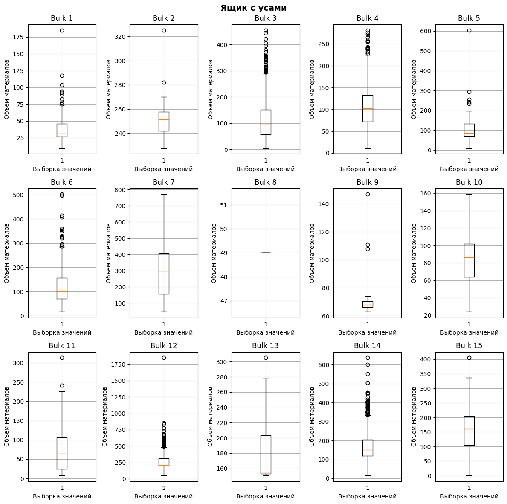
    


**Вывод** <br/>
*Значения были получены в результате удаления пропусков, параметров представлено мало, поэтому, делать предположения о выбросах не приходится, предположительно, некторые значения могут выбиваться из общей массы специально.*

<a id='my_section_12'></a>
#### [Распределение значений](#content_12)

Изучим распределение значений, вероятно, есть какие-то общие тенденции.


```python
fig, ax = plt.subplots(3, 5, figsize = (12, 12))
fig.suptitle('Ящик с усами', fontsize=14, fontweight='bold')
fig.subplots_adjust(top=0.9)

moustache = {}
param = {'Bulk 1':None, 'Bulk 2':None, 'Bulk 3':None, 'Bulk 4':None, 'Bulk 5':None, 
         'Bulk 6':None, 'Bulk 7':None, 'Bulk 8':None, 'Bulk 9':None, 'Bulk 10':None, 
         'Bulk 11':None, 'Bulk 12':None, 'Bulk 13':None, 'Bulk 14':None, 'Bulk 15':None}

x = 0
y = 0
for key, val in param.items():
    ax[x][y].hist(data_bulk_new[key].dropna(), bins=45)
    ax[x][y].grid()
    ax[x][y].set_title(key)
    ax[x][y].set_xlabel('Объем материалов')
    ax[x][y].set_ylabel('Выборка значений')
    y += 1
    if y == 5:
        y = 0
        if x < 3:
            x += 1
    
fig.tight_layout()    
```


    
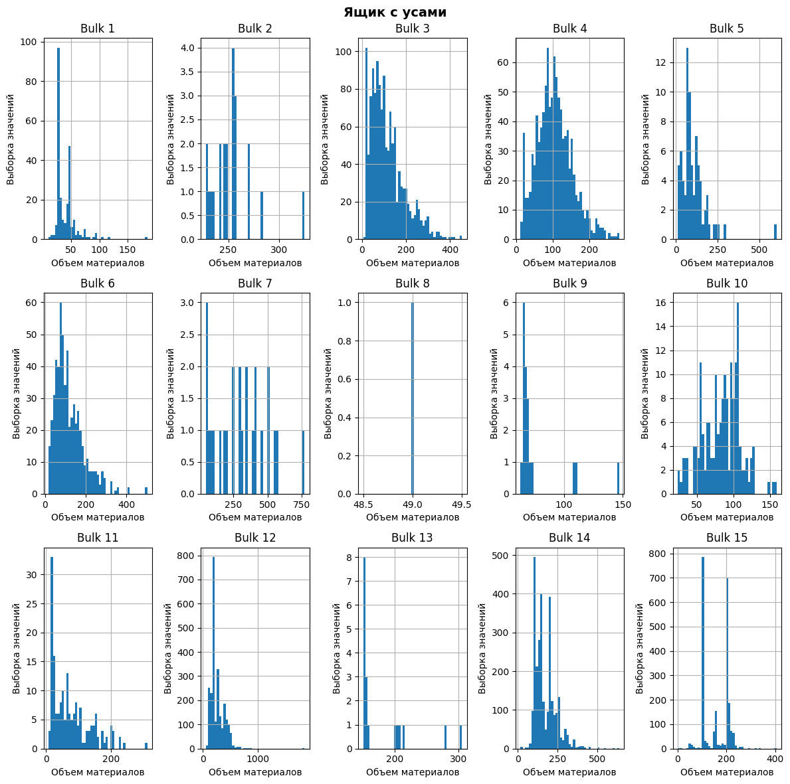
    


**Вывод**<br/>
Значений мало, поэтому сложно говорить о нормальности распределения. Однако, можно наблюдать, что в ряде случаев некоторые объемы материала превалируют. В общем случае, значения больше 0, что исключает очевидные ошибки в переданных данных. Конкретно можно описать следующие столбцы для которых распределение:
- 'Bulk 3' скошено вправо;
- 'Bulk 4' можно предположить наличие симметрии(нормальное распределение);
- 'Bulk 6' скошено вправо;
- 'Bulk 10' скошено влево;
- 'Bulk 11' скошено вправо;
- 'Bulk 12' скошено  вправо;
- 'Bulk 14' скошено вправо.

<a id='my_section_13'></a>
#### [Корреляция значений](#content_13)

Значений мало, поэтому, чтобы не обманываться, возьмём столбцы, где значений, хотя бы 500


```python
list_corr_data = []
for el in data_bulk_new.columns:
    if (~data_bulk_new[el].isna()).sum() > 500:
        list_corr_data.append(el)

list_corr_data        
```


    ['Bulk 3', 'Bulk 4', 'Bulk 6', 'Bulk 12', 'Bulk 14', 'Bulk 15']


```python
corr_data = data_bulk_new.corr()
corr_data.loc[list_corr_data, list_corr_data]
```


<div>
<style scoped>
    .dataframe tbody tr th:only-of-type {
        vertical-align: middle;
    }

    .dataframe tbody tr th {
        vertical-align: top;
    }

    .dataframe thead th {
        text-align: right;
    }
</style>
<table border="1" class="dataframe">
  <thead>
    <tr style="text-align: right;">
      <th></th>
      <th>Bulk 3</th>
      <th>Bulk 4</th>
      <th>Bulk 6</th>
      <th>Bulk 12</th>
      <th>Bulk 14</th>
      <th>Bulk 15</th>
    </tr>
  </thead>
  <tbody>
    <tr>
      <th>Bulk 3</th>
      <td>1.000000</td>
      <td>-0.260918</td>
      <td>0.253080</td>
      <td>0.011648</td>
      <td>0.026257</td>
      <td>-0.023689</td>
    </tr>
    <tr>
      <th>Bulk 4</th>
      <td>-0.260918</td>
      <td>1.000000</td>
      <td>-0.333841</td>
      <td>0.051112</td>
      <td>0.022925</td>
      <td>0.041190</td>
    </tr>
    <tr>
      <th>Bulk 6</th>
      <td>0.253080</td>
      <td>-0.333841</td>
      <td>1.000000</td>
      <td>-0.079822</td>
      <td>0.154429</td>
      <td>-0.038363</td>
    </tr>
    <tr>
      <th>Bulk 12</th>
      <td>0.011648</td>
      <td>0.051112</td>
      <td>-0.079822</td>
      <td>1.000000</td>
      <td>0.427247</td>
      <td>0.418691</td>
    </tr>
    <tr>
      <th>Bulk 14</th>
      <td>0.026257</td>
      <td>0.022925</td>
      <td>0.154429</td>
      <td>0.427247</td>
      <td>1.000000</td>
      <td>0.099170</td>
    </tr>
    <tr>
      <th>Bulk 15</th>
      <td>-0.023689</td>
      <td>0.041190</td>
      <td>-0.038363</td>
      <td>0.418691</td>
      <td>0.099170</td>
      <td>1.000000</td>
    </tr>
  </tbody>
</table>
</div>


```python
pd.plotting.scatter_matrix(data_bulk_new.loc[:, list_corr_data], figsize=(14,14));
```


    
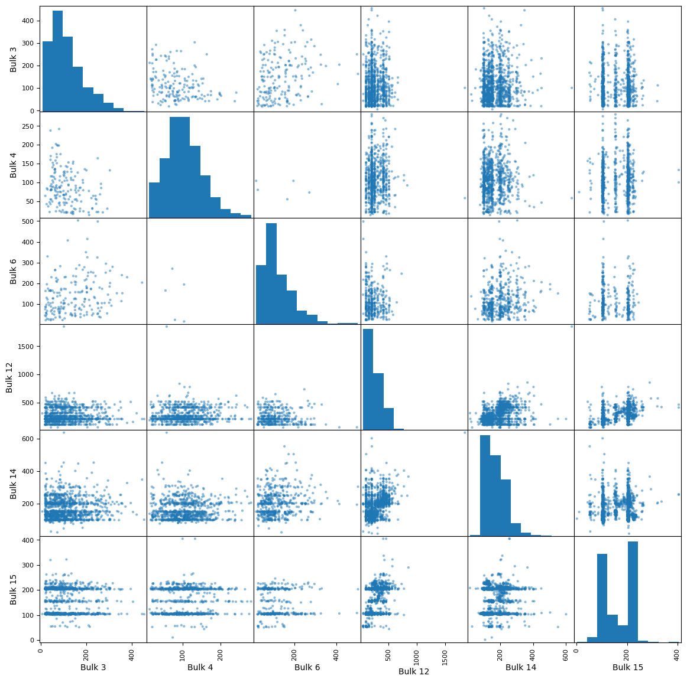
    


**Вывод**<br/>
Сильных значений корреляции не наблюдается, макисимальное значение достигает 0.4.

<a id='my_section_14'></a>
#### [Вывод](#content_14)

Результат изучения таблицы:
- обнаружено большое количество пропусков
- необходимо уточнить, по какому принципу вносились данные в столбцы, связана ли таблица с количеством итераций?
- нужно понять как работать с этой таблицей?
- столбцы нужно переименовать
- значения в таблице представлены в диапазоне от 1 до 3241, но всего 3129 вхождений. Нужно понять, почему включены не все партии(3241 значение)? Намеренно ли это сделано?
- вероятно, в таблице имеются выбросы, но самих значений достаточно мало, нужно понять, действительно ли это выбросы
- нужно уточнить у заказчика, какие параметры и таблицы могут повлиять на энергосбережение. Возможно эта таблица не пригодится.
- до уточнения данных у заказчика о корреляции и распределении можно не говорить, данных мало, предварительный анализ показал лишь 6 из 15 столбцов, доступных для обнаружения зависимостей. Корреляция наблюдается слабой, около 0.4 у некоторых столбцов.

<a id='my_section_15'></a>
### [data_bulk_time_new](#content_15)

<a id='my_section_16'></a>
#### [Первичный осмотр](#content_16)


```python
head_tail_info_desc(data_bulk_time_new)
```

    
    .head()
    


<div>
<style scoped>
    .dataframe tbody tr th:only-of-type {
        vertical-align: middle;
    }

    .dataframe tbody tr th {
        vertical-align: top;
    }

    .dataframe thead th {
        text-align: right;
    }
</style>
<table border="1" class="dataframe">
  <thead>
    <tr style="text-align: right;">
      <th></th>
      <th>Bulk 1</th>
      <th>Bulk 2</th>
      <th>Bulk 3</th>
      <th>Bulk 4</th>
      <th>Bulk 5</th>
      <th>Bulk 6</th>
      <th>Bulk 7</th>
      <th>Bulk 8</th>
      <th>Bulk 9</th>
      <th>Bulk 10</th>
      <th>Bulk 11</th>
      <th>Bulk 12</th>
      <th>Bulk 13</th>
      <th>Bulk 14</th>
      <th>Bulk 15</th>
    </tr>
    <tr>
      <th>key</th>
      <th></th>
      <th></th>
      <th></th>
      <th></th>
      <th></th>
      <th></th>
      <th></th>
      <th></th>
      <th></th>
      <th></th>
      <th></th>
      <th></th>
      <th></th>
      <th></th>
      <th></th>
    </tr>
  </thead>
  <tbody>
    <tr>
      <th>1</th>
      <td>NaN</td>
      <td>NaN</td>
      <td>NaN</td>
      <td>2019-05-03 11:28:48</td>
      <td>NaN</td>
      <td>NaN</td>
      <td>NaN</td>
      <td>NaN</td>
      <td>NaN</td>
      <td>NaN</td>
      <td>NaN</td>
      <td>2019-05-03 11:24:31</td>
      <td>NaN</td>
      <td>2019-05-03 11:14:50</td>
      <td>2019-05-03 11:10:43</td>
    </tr>
    <tr>
      <th>2</th>
      <td>NaN</td>
      <td>NaN</td>
      <td>NaN</td>
      <td>2019-05-03 11:36:50</td>
      <td>NaN</td>
      <td>NaN</td>
      <td>NaN</td>
      <td>NaN</td>
      <td>NaN</td>
      <td>NaN</td>
      <td>NaN</td>
      <td>2019-05-03 11:53:30</td>
      <td>NaN</td>
      <td>2019-05-03 11:48:37</td>
      <td>2019-05-03 11:44:39</td>
    </tr>
    <tr>
      <th>3</th>
      <td>NaN</td>
      <td>NaN</td>
      <td>NaN</td>
      <td>2019-05-03 12:32:39</td>
      <td>NaN</td>
      <td>NaN</td>
      <td>NaN</td>
      <td>NaN</td>
      <td>NaN</td>
      <td>NaN</td>
      <td>NaN</td>
      <td>2019-05-03 12:27:13</td>
      <td>NaN</td>
      <td>2019-05-03 12:21:01</td>
      <td>2019-05-03 12:16:16</td>
    </tr>
    <tr>
      <th>4</th>
      <td>NaN</td>
      <td>NaN</td>
      <td>NaN</td>
      <td>2019-05-03 12:43:22</td>
      <td>NaN</td>
      <td>NaN</td>
      <td>NaN</td>
      <td>NaN</td>
      <td>NaN</td>
      <td>NaN</td>
      <td>NaN</td>
      <td>2019-05-03 12:58:00</td>
      <td>NaN</td>
      <td>2019-05-03 12:51:11</td>
      <td>2019-05-03 12:46:36</td>
    </tr>
    <tr>
      <th>5</th>
      <td>NaN</td>
      <td>NaN</td>
      <td>NaN</td>
      <td>2019-05-03 13:30:47</td>
      <td>NaN</td>
      <td>NaN</td>
      <td>NaN</td>
      <td>NaN</td>
      <td>NaN</td>
      <td>NaN</td>
      <td>NaN</td>
      <td>2019-05-03 13:30:47</td>
      <td>NaN</td>
      <td>2019-05-03 13:34:12</td>
      <td>2019-05-03 13:30:47</td>
    </tr>
  </tbody>
</table>
</div>


    
    .tail()
    


<div>
<style scoped>
    .dataframe tbody tr th:only-of-type {
        vertical-align: middle;
    }

    .dataframe tbody tr th {
        vertical-align: top;
    }

    .dataframe thead th {
        text-align: right;
    }
</style>
<table border="1" class="dataframe">
  <thead>
    <tr style="text-align: right;">
      <th></th>
      <th>Bulk 1</th>
      <th>Bulk 2</th>
      <th>Bulk 3</th>
      <th>Bulk 4</th>
      <th>Bulk 5</th>
      <th>Bulk 6</th>
      <th>Bulk 7</th>
      <th>Bulk 8</th>
      <th>Bulk 9</th>
      <th>Bulk 10</th>
      <th>Bulk 11</th>
      <th>Bulk 12</th>
      <th>Bulk 13</th>
      <th>Bulk 14</th>
      <th>Bulk 15</th>
    </tr>
    <tr>
      <th>key</th>
      <th></th>
      <th></th>
      <th></th>
      <th></th>
      <th></th>
      <th></th>
      <th></th>
      <th></th>
      <th></th>
      <th></th>
      <th></th>
      <th></th>
      <th></th>
      <th></th>
      <th></th>
    </tr>
  </thead>
  <tbody>
    <tr>
      <th>3237</th>
      <td>NaN</td>
      <td>NaN</td>
      <td>2019-09-06 11:54:15</td>
      <td>NaN</td>
      <td>NaN</td>
      <td>NaN</td>
      <td>NaN</td>
      <td>NaN</td>
      <td>NaN</td>
      <td>NaN</td>
      <td>NaN</td>
      <td>2019-09-06 11:49:45</td>
      <td>NaN</td>
      <td>2019-09-06 11:45:22</td>
      <td>2019-09-06 11:40:06</td>
    </tr>
    <tr>
      <th>3238</th>
      <td>NaN</td>
      <td>NaN</td>
      <td>2019-09-06 12:26:52</td>
      <td>NaN</td>
      <td>NaN</td>
      <td>NaN</td>
      <td>NaN</td>
      <td>NaN</td>
      <td>NaN</td>
      <td>NaN</td>
      <td>NaN</td>
      <td>2019-09-06 12:18:35</td>
      <td>NaN</td>
      <td>2019-09-06 12:31:49</td>
      <td>2019-09-06 12:26:52</td>
    </tr>
    <tr>
      <th>3239</th>
      <td>NaN</td>
      <td>NaN</td>
      <td>NaN</td>
      <td>NaN</td>
      <td>NaN</td>
      <td>2019-09-06 15:06:00</td>
      <td>NaN</td>
      <td>NaN</td>
      <td>NaN</td>
      <td>NaN</td>
      <td>NaN</td>
      <td>2019-09-06 15:01:44</td>
      <td>NaN</td>
      <td>2019-09-06 14:58:15</td>
      <td>2019-09-06 14:48:06</td>
    </tr>
    <tr>
      <th>3240</th>
      <td>NaN</td>
      <td>NaN</td>
      <td>NaN</td>
      <td>NaN</td>
      <td>NaN</td>
      <td>2019-09-06 16:24:28</td>
      <td>NaN</td>
      <td>NaN</td>
      <td>NaN</td>
      <td>NaN</td>
      <td>NaN</td>
      <td>NaN</td>
      <td>NaN</td>
      <td>2019-09-06 16:07:29</td>
      <td>2019-09-06 16:01:34</td>
    </tr>
    <tr>
      <th>3241</th>
      <td>NaN</td>
      <td>NaN</td>
      <td>NaN</td>
      <td>NaN</td>
      <td>NaN</td>
      <td>NaN</td>
      <td>NaN</td>
      <td>NaN</td>
      <td>NaN</td>
      <td>NaN</td>
      <td>NaN</td>
      <td>NaN</td>
      <td>NaN</td>
      <td>2019-09-06 17:26:33</td>
      <td>2019-09-06 17:23:15</td>
    </tr>
  </tbody>
</table>
</div>


    
    .info()
    <class 'pandas.core.frame.DataFrame'>
    Int64Index: 3129 entries, 1 to 3241
    Data columns (total 15 columns):
     #   Column   Non-Null Count  Dtype 
    ---  ------   --------------  ----- 
     0   Bulk 1   252 non-null    object
     1   Bulk 2   22 non-null     object
     2   Bulk 3   1298 non-null   object
     3   Bulk 4   1014 non-null   object
     4   Bulk 5   77 non-null     object
     5   Bulk 6   576 non-null    object
     6   Bulk 7   25 non-null     object
     7   Bulk 8   1 non-null      object
     8   Bulk 9   19 non-null     object
     9   Bulk 10  176 non-null    object
     10  Bulk 11  177 non-null    object
     11  Bulk 12  2450 non-null   object
     12  Bulk 13  18 non-null     object
     13  Bulk 14  2806 non-null   object
     14  Bulk 15  2248 non-null   object
    dtypes: object(15)
    memory usage: 391.1+ KB
    


    None


    
    .describe()
    


<div>
<style scoped>
    .dataframe tbody tr th:only-of-type {
        vertical-align: middle;
    }

    .dataframe tbody tr th {
        vertical-align: top;
    }

    .dataframe thead th {
        text-align: right;
    }
</style>
<table border="1" class="dataframe">
  <thead>
    <tr style="text-align: right;">
      <th></th>
      <th>Bulk 1</th>
      <th>Bulk 2</th>
      <th>Bulk 3</th>
      <th>Bulk 4</th>
      <th>Bulk 5</th>
      <th>Bulk 6</th>
      <th>Bulk 7</th>
      <th>Bulk 8</th>
      <th>Bulk 9</th>
      <th>Bulk 10</th>
      <th>Bulk 11</th>
      <th>Bulk 12</th>
      <th>Bulk 13</th>
      <th>Bulk 14</th>
      <th>Bulk 15</th>
    </tr>
  </thead>
  <tbody>
    <tr>
      <th>count</th>
      <td>252</td>
      <td>22</td>
      <td>1298</td>
      <td>1014</td>
      <td>77</td>
      <td>576</td>
      <td>25</td>
      <td>1</td>
      <td>19</td>
      <td>176</td>
      <td>177</td>
      <td>2450</td>
      <td>18</td>
      <td>2806</td>
      <td>2248</td>
    </tr>
    <tr>
      <th>unique</th>
      <td>252</td>
      <td>22</td>
      <td>1298</td>
      <td>1014</td>
      <td>77</td>
      <td>576</td>
      <td>25</td>
      <td>1</td>
      <td>19</td>
      <td>176</td>
      <td>177</td>
      <td>2450</td>
      <td>18</td>
      <td>2806</td>
      <td>2248</td>
    </tr>
    <tr>
      <th>top</th>
      <td>2019-06-21 04:35:36</td>
      <td>2019-07-27 04:17:21</td>
      <td>2019-06-02 18:20:37</td>
      <td>2019-06-02 08:24:42</td>
      <td>2019-05-12 10:54:36</td>
      <td>2019-06-11 18:53:24</td>
      <td>2019-08-12 22:25:23</td>
      <td>2019-07-08 17:14:53</td>
      <td>2019-05-14 14:10:18</td>
      <td>2019-06-02 05:53:41</td>
      <td>2019-08-24 06:42:47</td>
      <td>2019-07-30 00:26:16</td>
      <td>2019-05-16 05:29:33</td>
      <td>2019-05-08 20:29:26</td>
      <td>2019-08-03 19:08:18</td>
    </tr>
    <tr>
      <th>freq</th>
      <td>1</td>
      <td>1</td>
      <td>1</td>
      <td>1</td>
      <td>1</td>
      <td>1</td>
      <td>1</td>
      <td>1</td>
      <td>1</td>
      <td>1</td>
      <td>1</td>
      <td>1</td>
      <td>1</td>
      <td>1</td>
      <td>1</td>
    </tr>
  </tbody>
</table>
</div>


<a id='my_section_17'></a>
#### [Вывод](#content_17)
Предварительный осмотр заставляет усомниться в корректности данных. Время в столбцах не соответствует порядковым номерам, т.е. не заметна временная последовательность от столбца к столбцу. Таблица сообщает о времени проведения операций в таблице data_bulk_new.

<a id='my_section_18'></a>
### [data_gas_new](#content_18)

<a id='my_section_19'></a>
#### [Первичный осмотр](#content_19)


```python
head_tail_info_desc(data_gas_new)
```

    
    .head()
    


<div>
<style scoped>
    .dataframe tbody tr th:only-of-type {
        vertical-align: middle;
    }

    .dataframe tbody tr th {
        vertical-align: top;
    }

    .dataframe thead th {
        text-align: right;
    }
</style>
<table border="1" class="dataframe">
  <thead>
    <tr style="text-align: right;">
      <th></th>
      <th>Газ 1</th>
    </tr>
    <tr>
      <th>key</th>
      <th></th>
    </tr>
  </thead>
  <tbody>
    <tr>
      <th>1</th>
      <td>29.749986</td>
    </tr>
    <tr>
      <th>2</th>
      <td>12.555561</td>
    </tr>
    <tr>
      <th>3</th>
      <td>28.554793</td>
    </tr>
    <tr>
      <th>4</th>
      <td>18.841219</td>
    </tr>
    <tr>
      <th>5</th>
      <td>5.413692</td>
    </tr>
  </tbody>
</table>
</div>


    
    .tail()
    


<div>
<style scoped>
    .dataframe tbody tr th:only-of-type {
        vertical-align: middle;
    }

    .dataframe tbody tr th {
        vertical-align: top;
    }

    .dataframe thead th {
        text-align: right;
    }
</style>
<table border="1" class="dataframe">
  <thead>
    <tr style="text-align: right;">
      <th></th>
      <th>Газ 1</th>
    </tr>
    <tr>
      <th>key</th>
      <th></th>
    </tr>
  </thead>
  <tbody>
    <tr>
      <th>3237</th>
      <td>5.543905</td>
    </tr>
    <tr>
      <th>3238</th>
      <td>6.745669</td>
    </tr>
    <tr>
      <th>3239</th>
      <td>16.023518</td>
    </tr>
    <tr>
      <th>3240</th>
      <td>11.863103</td>
    </tr>
    <tr>
      <th>3241</th>
      <td>12.680959</td>
    </tr>
  </tbody>
</table>
</div>


    
    .info()
    <class 'pandas.core.frame.DataFrame'>
    Int64Index: 3239 entries, 1 to 3241
    Data columns (total 1 columns):
     #   Column  Non-Null Count  Dtype  
    ---  ------  --------------  -----  
     0   Газ 1   3239 non-null   float64
    dtypes: float64(1)
    memory usage: 50.6 KB
    


    None


    
    .describe()
    


<div>
<style scoped>
    .dataframe tbody tr th:only-of-type {
        vertical-align: middle;
    }

    .dataframe tbody tr th {
        vertical-align: top;
    }

    .dataframe thead th {
        text-align: right;
    }
</style>
<table border="1" class="dataframe">
  <thead>
    <tr style="text-align: right;">
      <th></th>
      <th>Газ 1</th>
    </tr>
  </thead>
  <tbody>
    <tr>
      <th>count</th>
      <td>3239.000000</td>
    </tr>
    <tr>
      <th>mean</th>
      <td>11.002062</td>
    </tr>
    <tr>
      <th>std</th>
      <td>6.220327</td>
    </tr>
    <tr>
      <th>min</th>
      <td>0.008399</td>
    </tr>
    <tr>
      <th>25%</th>
      <td>7.043089</td>
    </tr>
    <tr>
      <th>50%</th>
      <td>9.836267</td>
    </tr>
    <tr>
      <th>75%</th>
      <td>13.769915</td>
    </tr>
    <tr>
      <th>max</th>
      <td>77.995040</td>
    </tr>
  </tbody>
</table>
</div>


**Вывод:**<br/>
- представлен единственный столбец с наименованием 'Газ 1', вероятно есть еще данные, стоит уточнить;
- значение газа представлено в целом по партиям, либо взято среднее, либо продувка была один раз;
- 3239 вхождения найдено, с интервалом от 1 до 3241, значит, где-то есть пропуск;
- `describe` сообщает о возможных выбросах.

Получим имена партий не вошедших в таблицу


```python
mis_val = []
for i in range(data_gas_new.index.values.max()):
    if i+1 not in data_gas_new.index.values:
        mis_val.append(i+1)

print(mis_val)
```

    [193, 259]
    

<a id='my_section_20'></a>
#### [Выбросы](#content_20)


```python
b = data_gas_new.boxplot(figsize=(8,8), return_type='dict')
plt.ylabel('параметры газа')
plt.title('Ящик с усами')

moustache_dgn = {}
moustache_dgn['газ'] = [item.get_ydata()[1] for item in b['whiskers']]
```


    
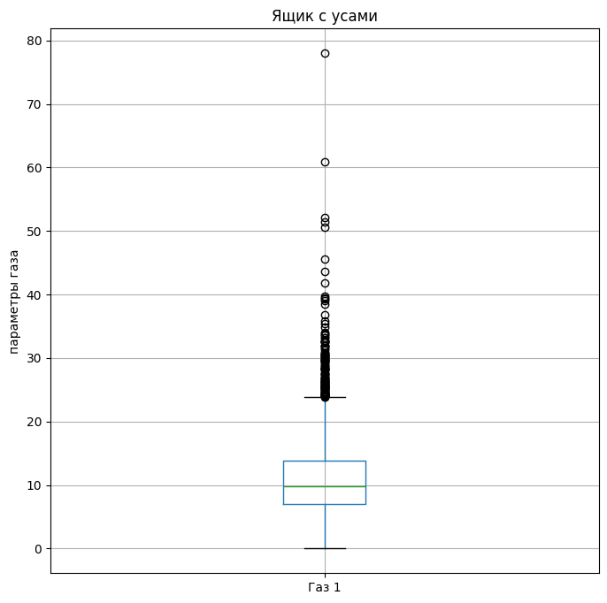
    


**Вывод**<br/>
Похожие выбросы наблюдаются и в таюлице data_arc_new, возможно это часть производственного процесса. Вопрос об удалении лучше поставить перед заказчиком.

<a id='my_section_21'></a>
#### [Распределение значений](#content_21)


```python
data_gas_new.hist(bins=100, figsize=(8,8))
plt.ylabel('Частота')
plt.xlabel('Параметры газа');
```


    

    


**Вывод**<br/>
Распределение не значительно скошено вправо.


<a id='my_section_22'></a>
#### [Вывод](#content_22)

- представлен единственный столбец с наименованием 'Газ 1', вероятно есть еще данные, стоит уточнить;
- значение газа представлено в целом по партиям, либо взято среднее, либо продувка была один раз;
- 3239 вхождения найдено, с интервалом от 1 до 3241, найдены пропущенные партии;
- имеются выбросы, стоит уточнить на сколько они важны для производственного процесса;
- распределение значений практически нормальное, есть небольшое скос вправо.

<a id='my_section_23'></a>
### [data_temp_new](#content_23)

<a id='my_section_24'></a>
#### [Первичный осмотр](#content_24)


```python
head_tail_info_desc(data_temp_new)
```

    
    .head()
    


<div>
<style scoped>
    .dataframe tbody tr th:only-of-type {
        vertical-align: middle;
    }

    .dataframe tbody tr th {
        vertical-align: top;
    }

    .dataframe thead th {
        text-align: right;
    }
</style>
<table border="1" class="dataframe">
  <thead>
    <tr style="text-align: right;">
      <th></th>
      <th>Время замера</th>
      <th>Температура</th>
    </tr>
    <tr>
      <th>key</th>
      <th></th>
      <th></th>
    </tr>
  </thead>
  <tbody>
    <tr>
      <th>1</th>
      <td>2019-05-03 11:02:04</td>
      <td>1571.0</td>
    </tr>
    <tr>
      <th>1</th>
      <td>2019-05-03 11:07:18</td>
      <td>1604.0</td>
    </tr>
    <tr>
      <th>1</th>
      <td>2019-05-03 11:11:34</td>
      <td>1618.0</td>
    </tr>
    <tr>
      <th>1</th>
      <td>2019-05-03 11:18:04</td>
      <td>1601.0</td>
    </tr>
    <tr>
      <th>1</th>
      <td>2019-05-03 11:25:59</td>
      <td>1606.0</td>
    </tr>
  </tbody>
</table>
</div>


    
    .tail()
    


<div>
<style scoped>
    .dataframe tbody tr th:only-of-type {
        vertical-align: middle;
    }

    .dataframe tbody tr th {
        vertical-align: top;
    }

    .dataframe thead th {
        text-align: right;
    }
</style>
<table border="1" class="dataframe">
  <thead>
    <tr style="text-align: right;">
      <th></th>
      <th>Время замера</th>
      <th>Температура</th>
    </tr>
    <tr>
      <th>key</th>
      <th></th>
      <th></th>
    </tr>
  </thead>
  <tbody>
    <tr>
      <th>3241</th>
      <td>2019-09-06 16:55:01</td>
      <td>NaN</td>
    </tr>
    <tr>
      <th>3241</th>
      <td>2019-09-06 17:06:38</td>
      <td>NaN</td>
    </tr>
    <tr>
      <th>3241</th>
      <td>2019-09-06 17:21:48</td>
      <td>NaN</td>
    </tr>
    <tr>
      <th>3241</th>
      <td>2019-09-06 17:24:44</td>
      <td>NaN</td>
    </tr>
    <tr>
      <th>3241</th>
      <td>2019-09-06 17:30:05</td>
      <td>NaN</td>
    </tr>
  </tbody>
</table>
</div>


    
    .info()
    <class 'pandas.core.frame.DataFrame'>
    Int64Index: 18092 entries, 1 to 3241
    Data columns (total 2 columns):
     #   Column        Non-Null Count  Dtype  
    ---  ------        --------------  -----  
     0   Время замера  18092 non-null  object 
     1   Температура   14665 non-null  float64
    dtypes: float64(1), object(1)
    memory usage: 424.0+ KB
    


    None


    
    .describe()
    


<div>
<style scoped>
    .dataframe tbody tr th:only-of-type {
        vertical-align: middle;
    }

    .dataframe tbody tr th {
        vertical-align: top;
    }

    .dataframe thead th {
        text-align: right;
    }
</style>
<table border="1" class="dataframe">
  <thead>
    <tr style="text-align: right;">
      <th></th>
      <th>Температура</th>
    </tr>
  </thead>
  <tbody>
    <tr>
      <th>count</th>
      <td>14665.000000</td>
    </tr>
    <tr>
      <th>mean</th>
      <td>1590.722741</td>
    </tr>
    <tr>
      <th>std</th>
      <td>20.394381</td>
    </tr>
    <tr>
      <th>min</th>
      <td>1191.000000</td>
    </tr>
    <tr>
      <th>25%</th>
      <td>1580.000000</td>
    </tr>
    <tr>
      <th>50%</th>
      <td>1590.000000</td>
    </tr>
    <tr>
      <th>75%</th>
      <td>1599.000000</td>
    </tr>
    <tr>
      <th>max</th>
      <td>1705.000000</td>
    </tr>
  </tbody>
</table>
</div>


Изучение количества вхождений


```python
data_temp_new.shape[0]- data_arc_new.shape[0]
```


    3216


Изучение количества пропусков


```python
for el in data_temp_new.columns:
    ans = len(data_temp_new[data_temp_new[el].isna()])
    print(f'{el} {ans} ({ans/data_temp_new.shape[0] :.2}%)')
```

    Время замера 0 (0.0%)
    Температура 3427 (0.19%)
    

**Вывод**<br/>
- замеры температуры взяты между началом и концом нагрева дугой, т.е. данных должно быть больше, что и подтверждается в info. Значений на 3216 вхождений больше;
- предположительно данные представлены для каждой итерации;
- не все значения присутствуют, имеются пропуски;
- по полученным данным методом `describe` можно судить о более стабильных значениях, относительно других таблиц. Необходимо удостовериться, изучив выбросы и распределение значений;
- нужно уточнить у заказчика результаты измерения температуры чего конкретно представлены в наборе данных;
- можно предположить, что идеальная температура находится в районе 1590 градусов.

Изучим пропущенные партии


```python
mis_val = []
for i in range(data_temp_new.index.values.max()):
    if i+1 not in data_temp_new.index.values:
        mis_val.append(i+1)

print(mis_val)
```

    [41, 42, 355, 382, 506, 529, 540, 607, 683, 710, 766, 1133, 1300, 1437, 2031, 2103, 2278, 2356, 2373, 2446, 2469, 2491, 2683, 3200, 3207]
    

<a id='my_section_25'></a>
#### [Выбросы](#content_25)


```python
b = data_temp_new.boxplot(figsize=(8,8), return_type='dict')
plt.ylabel('параметры температуры')
plt.title('Ящик с усами')

moustache_dtn = {}
moustache_dtn['температура'] = [item.get_ydata()[1] for item in b['whiskers']]
```


    
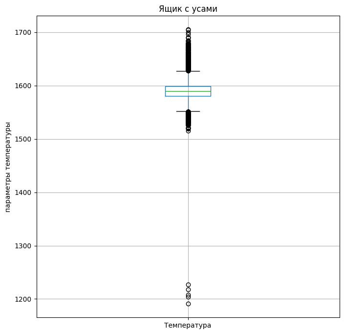
    


```python
print(moustache_dtn)
```

    {'температура': [1552.0, 1627.0]}
    

**Вывод**<br/>
- температура плавления стали 1370-1530 градусов Цельсия. Чем обусловленны столь высокие и низкие значения не понятно. Надо уточнить температуру чего измеряют и на основе полученной информации принимать решение о сокращении значений.


<a id='my_section_26'></a>
#### [Распределение значений](#content_26)


```python
data_temp_new.hist(bins=50, figsize=(8,8), range = (1500, 1750))
plt.ylabel('Частота')
plt.xlabel('Параметры температуры');
```


    

    


**Вывод**<br/>
Представлено нормальное распределение значений

<a id='my_section_27'></a>
#### [Вывод](#content_27)

- замеры температуры взяты между началом и концом нагрева дугой, т.е. данных больше, значений на 3216 вхождений больше;
- данные представлены почти для каждой итерации;
- не все значения присутствуют, имеются пропуски, около 19%;
- нужно уточнить у заказчика результаты измерения температуры чего конкретно представлены в наборе данных;
- имеются выбросы, необходимо утонить их природу и ценность, после можно приступать к обработке значений;
- данные распределены нормально.


<a id='my_section_28'></a>
### [ data_wire_new](#content_28)

<a id='my_section_29'></a>
#### [Первичный осмотр](#content_29)


```python
head_tail_info_desc(data_wire_new)
```

    
    .head()
    


<div>
<style scoped>
    .dataframe tbody tr th:only-of-type {
        vertical-align: middle;
    }

    .dataframe tbody tr th {
        vertical-align: top;
    }

    .dataframe thead th {
        text-align: right;
    }
</style>
<table border="1" class="dataframe">
  <thead>
    <tr style="text-align: right;">
      <th></th>
      <th>Wire 1</th>
      <th>Wire 2</th>
      <th>Wire 3</th>
      <th>Wire 4</th>
      <th>Wire 5</th>
      <th>Wire 6</th>
      <th>Wire 7</th>
      <th>Wire 8</th>
      <th>Wire 9</th>
    </tr>
    <tr>
      <th>key</th>
      <th></th>
      <th></th>
      <th></th>
      <th></th>
      <th></th>
      <th></th>
      <th></th>
      <th></th>
      <th></th>
    </tr>
  </thead>
  <tbody>
    <tr>
      <th>1</th>
      <td>60.059998</td>
      <td>NaN</td>
      <td>NaN</td>
      <td>NaN</td>
      <td>NaN</td>
      <td>NaN</td>
      <td>NaN</td>
      <td>NaN</td>
      <td>NaN</td>
    </tr>
    <tr>
      <th>2</th>
      <td>96.052315</td>
      <td>NaN</td>
      <td>NaN</td>
      <td>NaN</td>
      <td>NaN</td>
      <td>NaN</td>
      <td>NaN</td>
      <td>NaN</td>
      <td>NaN</td>
    </tr>
    <tr>
      <th>3</th>
      <td>91.160157</td>
      <td>NaN</td>
      <td>NaN</td>
      <td>NaN</td>
      <td>NaN</td>
      <td>NaN</td>
      <td>NaN</td>
      <td>NaN</td>
      <td>NaN</td>
    </tr>
    <tr>
      <th>4</th>
      <td>89.063515</td>
      <td>NaN</td>
      <td>NaN</td>
      <td>NaN</td>
      <td>NaN</td>
      <td>NaN</td>
      <td>NaN</td>
      <td>NaN</td>
      <td>NaN</td>
    </tr>
    <tr>
      <th>5</th>
      <td>89.238236</td>
      <td>9.11456</td>
      <td>NaN</td>
      <td>NaN</td>
      <td>NaN</td>
      <td>NaN</td>
      <td>NaN</td>
      <td>NaN</td>
      <td>NaN</td>
    </tr>
  </tbody>
</table>
</div>


    
    .tail()
    


<div>
<style scoped>
    .dataframe tbody tr th:only-of-type {
        vertical-align: middle;
    }

    .dataframe tbody tr th {
        vertical-align: top;
    }

    .dataframe thead th {
        text-align: right;
    }
</style>
<table border="1" class="dataframe">
  <thead>
    <tr style="text-align: right;">
      <th></th>
      <th>Wire 1</th>
      <th>Wire 2</th>
      <th>Wire 3</th>
      <th>Wire 4</th>
      <th>Wire 5</th>
      <th>Wire 6</th>
      <th>Wire 7</th>
      <th>Wire 8</th>
      <th>Wire 9</th>
    </tr>
    <tr>
      <th>key</th>
      <th></th>
      <th></th>
      <th></th>
      <th></th>
      <th></th>
      <th></th>
      <th></th>
      <th></th>
      <th></th>
    </tr>
  </thead>
  <tbody>
    <tr>
      <th>3237</th>
      <td>38.088959</td>
      <td>NaN</td>
      <td>NaN</td>
      <td>NaN</td>
      <td>NaN</td>
      <td>NaN</td>
      <td>NaN</td>
      <td>NaN</td>
      <td>NaN</td>
    </tr>
    <tr>
      <th>3238</th>
      <td>56.128799</td>
      <td>NaN</td>
      <td>NaN</td>
      <td>NaN</td>
      <td>NaN</td>
      <td>NaN</td>
      <td>NaN</td>
      <td>NaN</td>
      <td>NaN</td>
    </tr>
    <tr>
      <th>3239</th>
      <td>143.357761</td>
      <td>NaN</td>
      <td>NaN</td>
      <td>NaN</td>
      <td>NaN</td>
      <td>NaN</td>
      <td>NaN</td>
      <td>NaN</td>
      <td>NaN</td>
    </tr>
    <tr>
      <th>3240</th>
      <td>34.070400</td>
      <td>NaN</td>
      <td>NaN</td>
      <td>NaN</td>
      <td>NaN</td>
      <td>NaN</td>
      <td>NaN</td>
      <td>NaN</td>
      <td>NaN</td>
    </tr>
    <tr>
      <th>3241</th>
      <td>63.117595</td>
      <td>NaN</td>
      <td>NaN</td>
      <td>NaN</td>
      <td>NaN</td>
      <td>NaN</td>
      <td>NaN</td>
      <td>NaN</td>
      <td>NaN</td>
    </tr>
  </tbody>
</table>
</div>


    
    .info()
    <class 'pandas.core.frame.DataFrame'>
    Int64Index: 3081 entries, 1 to 3241
    Data columns (total 9 columns):
     #   Column  Non-Null Count  Dtype  
    ---  ------  --------------  -----  
     0   Wire 1  3055 non-null   float64
     1   Wire 2  1079 non-null   float64
     2   Wire 3  63 non-null     float64
     3   Wire 4  14 non-null     float64
     4   Wire 5  1 non-null      float64
     5   Wire 6  73 non-null     float64
     6   Wire 7  11 non-null     float64
     7   Wire 8  19 non-null     float64
     8   Wire 9  29 non-null     float64
    dtypes: float64(9)
    memory usage: 240.7 KB
    


    None


    
    .describe()
    


<div>
<style scoped>
    .dataframe tbody tr th:only-of-type {
        vertical-align: middle;
    }

    .dataframe tbody tr th {
        vertical-align: top;
    }

    .dataframe thead th {
        text-align: right;
    }
</style>
<table border="1" class="dataframe">
  <thead>
    <tr style="text-align: right;">
      <th></th>
      <th>Wire 1</th>
      <th>Wire 2</th>
      <th>Wire 3</th>
      <th>Wire 4</th>
      <th>Wire 5</th>
      <th>Wire 6</th>
      <th>Wire 7</th>
      <th>Wire 8</th>
      <th>Wire 9</th>
    </tr>
  </thead>
  <tbody>
    <tr>
      <th>count</th>
      <td>3055.000000</td>
      <td>1079.000000</td>
      <td>63.000000</td>
      <td>14.000000</td>
      <td>1.000</td>
      <td>73.000000</td>
      <td>11.000000</td>
      <td>19.000000</td>
      <td>29.000000</td>
    </tr>
    <tr>
      <th>mean</th>
      <td>100.895853</td>
      <td>50.577323</td>
      <td>189.482681</td>
      <td>57.442841</td>
      <td>15.132</td>
      <td>48.016974</td>
      <td>10.039007</td>
      <td>53.625193</td>
      <td>34.155752</td>
    </tr>
    <tr>
      <th>std</th>
      <td>42.012518</td>
      <td>39.320216</td>
      <td>99.513444</td>
      <td>28.824667</td>
      <td>NaN</td>
      <td>33.919845</td>
      <td>8.610584</td>
      <td>16.881728</td>
      <td>19.931616</td>
    </tr>
    <tr>
      <th>min</th>
      <td>1.918800</td>
      <td>0.030160</td>
      <td>0.144144</td>
      <td>24.148801</td>
      <td>15.132</td>
      <td>0.034320</td>
      <td>0.234208</td>
      <td>45.076721</td>
      <td>4.622800</td>
    </tr>
    <tr>
      <th>25%</th>
      <td>72.115684</td>
      <td>20.193680</td>
      <td>95.135044</td>
      <td>40.807002</td>
      <td>15.132</td>
      <td>25.053600</td>
      <td>6.762756</td>
      <td>46.094879</td>
      <td>22.058401</td>
    </tr>
    <tr>
      <th>50%</th>
      <td>100.158234</td>
      <td>40.142956</td>
      <td>235.194977</td>
      <td>45.234282</td>
      <td>15.132</td>
      <td>42.076324</td>
      <td>9.017009</td>
      <td>46.279999</td>
      <td>30.066399</td>
    </tr>
    <tr>
      <th>75%</th>
      <td>126.060483</td>
      <td>70.227558</td>
      <td>276.252014</td>
      <td>76.124619</td>
      <td>15.132</td>
      <td>64.212723</td>
      <td>11.886057</td>
      <td>48.089603</td>
      <td>43.862003</td>
    </tr>
    <tr>
      <th>max</th>
      <td>330.314424</td>
      <td>282.780152</td>
      <td>385.008668</td>
      <td>113.231044</td>
      <td>15.132</td>
      <td>180.454575</td>
      <td>32.847674</td>
      <td>102.762401</td>
      <td>90.053604</td>
    </tr>
  </tbody>
</table>
</div>


**Вывод:**
- имена столбцов нужно переименовать; 
- очень много пропущенных значений, вероятно проволочые материалы добавлялись не всегда;
- представлено обобщенное значение по партиям, что подразумевает нумерация в столбцах не понятно;
- часть партий пропущена;
- о нормальности распределения и выбросах можно судить только по первым двум столбцам;

Изучим пропущенные партии


```python
mis_val = []
for i in range(data_wire_new.index.values.max()):
    if i+1 not in data_wire_new.index.values:
        mis_val.append(i+1)

print(mis_val)
```

    [41, 42, 51, 52, 53, 54, 55, 56, 81, 82, 83, 84, 85, 88, 109, 195, 197, 209, 210, 211, 212, 269, 330, 331, 332, 355, 375, 376, 377, 378, 382, 506, 529, 540, 607, 683, 710, 711, 712, 713, 714, 715, 744, 748, 754, 755, 766, 796, 797, 798, 799, 800, 841, 929, 930, 931, 932, 933, 934, 1102, 1103, 1104, 1105, 1106, 1107, 1133, 1184, 1300, 1379, 1380, 1437, 1525, 1526, 1527, 1528, 1564, 1565, 1566, 1646, 1743, 1744, 1745, 1746, 1747, 1748, 1758, 1817, 1818, 1836, 1946, 1977, 1978, 1979, 2010, 2031, 2043, 2103, 2195, 2196, 2197, 2198, 2214, 2215, 2216, 2217, 2218, 2219, 2236, 2238, 2278, 2356, 2360, 2367, 2368, 2369, 2370, 2373, 2388, 2389, 2390, 2391, 2392, 2393, 2446, 2469, 2491, 2624, 2625, 2626, 2627, 2628, 2629, 2683, 2788, 2789, 2790, 2791, 2792, 2814, 2815, 2846, 2847, 2848, 2849, 2850, 2863, 2871, 2872, 2873, 2874, 2875, 2876, 3035, 3036, 3037, 3038, 3039, 3040, 3200, 3207]
    

<a id='my_section_30'></a>
#### [Выбросы](#content_30)


```python
fig, ax = plt.subplots(1, 2, figsize = (12, 6))
fig.suptitle('Ящик с усами', fontsize=14, fontweight='bold')
fig.subplots_adjust(top=0.9)

moustache_dwn = {}
param = {'Wire 1':None, 'Wire 2':None}
count = 0
for key, val in param.items():
    b = ax[count].boxplot(data_wire_new[key].dropna())
    #Выделение крайних усов боксплота
    moustache_dwn[key] = [item.get_ydata()[1] for item in b['whiskers']]
    ax[count].grid()
    ax[count].set_title(key)
    ax[count].set_xlabel('Объем проволочных материалов')
    ax[count].set_ylabel('Разброс параметров')
    count += 1
```


    
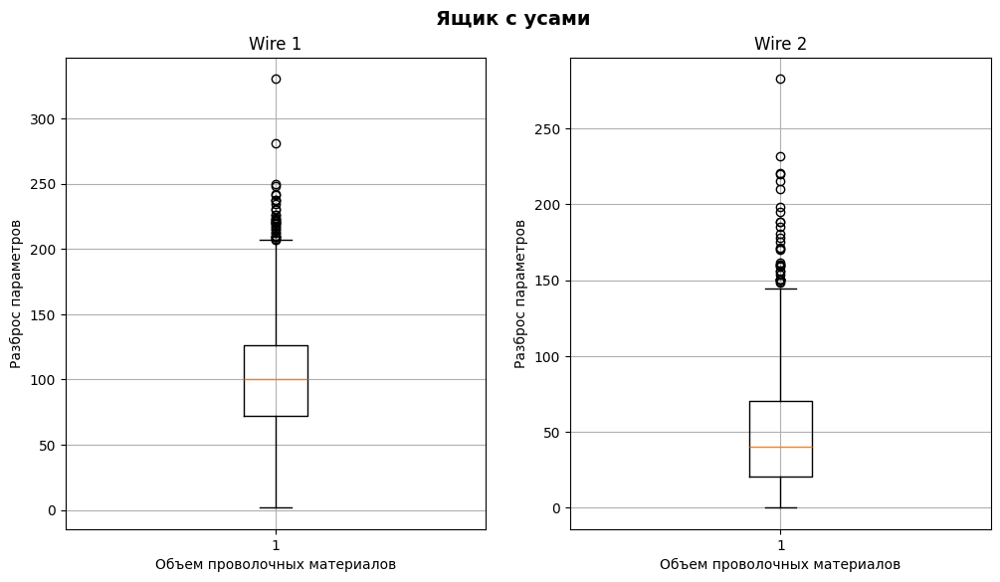
    


```python
print(moustache_dwn)
```

    {'Wire 1': [1.9188, 206.668792], 'Wire 2': [0.03016, 144.289596]}
    

**Вывод**
- вероятно, что центральные значения соответствуют наиболее оптимальному решению в подготовке стали;
- стоит уточнить, почему столбцов 9, что за этим стоит;
- после уточнения, можно приступать к корректировке значений.

<a id='my_section_31'></a>
#### [Распределение значений](#content_31)


```python
data_wire_new.hist(column = ['Wire 1', 'Wire 2'], bins=50, figsize=(12,4))
plt.ylabel('Частота')
plt.xlabel('Параметры температуры');
```


    
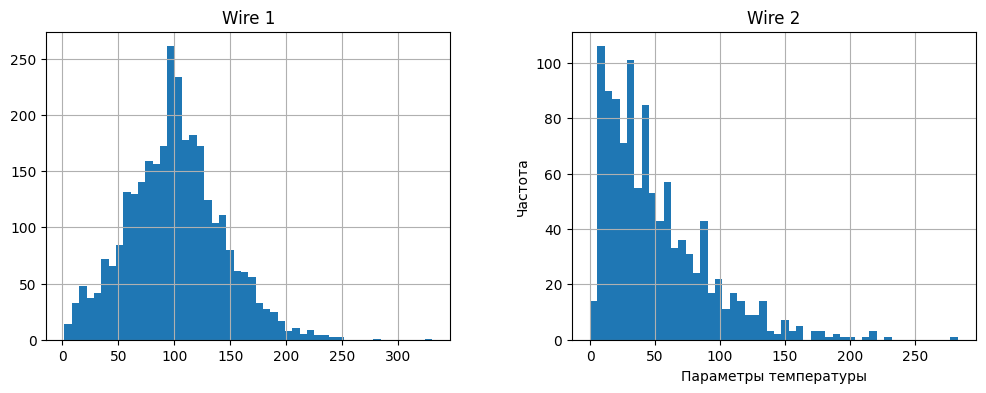
    


**Вывод**
- 'Wire 1' распределение нормальное;
- 'Wire 2' распределение смещено вправо;
- возможно, стоит использовать только значимые параметры для решения задачи, параметры с малым количеством значений, можно не учитывать. Тем не менее лучше уточнить у заказчика.

<a id='my_section_32'></a>
#### [Вывод](#content_32)

- имена столбцов нужно переименовать; 
- очень много пропущенных значений, вероятно проволочые материалы добавлялись не всегда;
- представлено обобщенное значение по партиям, что подразумевает нумерация в столбцах не понятно;
- часть партий пропущена;
- о нормальности распределения и выбросах можно судить только по первым двум столбцам;
- вероятно, что центральные значения соответствуют наиболее оптимальному решению в подготовке стали;
- стоит уточнить, почему столбцов 9, что за этим стоит;
- после уточнения, можно приступать к корректировке значений;
- Столбцы: 
    - 'Wire 1' распределение нормальное;
    - 'Wire 2' распределение смещено вправо;
- возможно, стоит использовать только значимые параметры для решения задачи, параметры с малым количеством значений, можно не учитывать. Тем не менее лучше уточнить у заказчика.

<a id='my_section_33'></a>
### [data_wire_time_new](#content_33)


```python
head_tail_info_desc(data_wire_time_new)
```

    
    .head()
    


<div>
<style scoped>
    .dataframe tbody tr th:only-of-type {
        vertical-align: middle;
    }

    .dataframe tbody tr th {
        vertical-align: top;
    }

    .dataframe thead th {
        text-align: right;
    }
</style>
<table border="1" class="dataframe">
  <thead>
    <tr style="text-align: right;">
      <th></th>
      <th>Wire 1</th>
      <th>Wire 2</th>
      <th>Wire 3</th>
      <th>Wire 4</th>
      <th>Wire 5</th>
      <th>Wire 6</th>
      <th>Wire 7</th>
      <th>Wire 8</th>
      <th>Wire 9</th>
    </tr>
    <tr>
      <th>key</th>
      <th></th>
      <th></th>
      <th></th>
      <th></th>
      <th></th>
      <th></th>
      <th></th>
      <th></th>
      <th></th>
    </tr>
  </thead>
  <tbody>
    <tr>
      <th>1</th>
      <td>2019-05-03 11:06:19</td>
      <td>NaN</td>
      <td>NaN</td>
      <td>NaN</td>
      <td>NaN</td>
      <td>NaN</td>
      <td>NaN</td>
      <td>NaN</td>
      <td>NaN</td>
    </tr>
    <tr>
      <th>2</th>
      <td>2019-05-03 11:36:50</td>
      <td>NaN</td>
      <td>NaN</td>
      <td>NaN</td>
      <td>NaN</td>
      <td>NaN</td>
      <td>NaN</td>
      <td>NaN</td>
      <td>NaN</td>
    </tr>
    <tr>
      <th>3</th>
      <td>2019-05-03 12:11:46</td>
      <td>NaN</td>
      <td>NaN</td>
      <td>NaN</td>
      <td>NaN</td>
      <td>NaN</td>
      <td>NaN</td>
      <td>NaN</td>
      <td>NaN</td>
    </tr>
    <tr>
      <th>4</th>
      <td>2019-05-03 12:43:22</td>
      <td>NaN</td>
      <td>NaN</td>
      <td>NaN</td>
      <td>NaN</td>
      <td>NaN</td>
      <td>NaN</td>
      <td>NaN</td>
      <td>NaN</td>
    </tr>
    <tr>
      <th>5</th>
      <td>2019-05-03 13:20:44</td>
      <td>2019-05-03 13:15:34</td>
      <td>NaN</td>
      <td>NaN</td>
      <td>NaN</td>
      <td>NaN</td>
      <td>NaN</td>
      <td>NaN</td>
      <td>NaN</td>
    </tr>
  </tbody>
</table>
</div>


    
    .tail()
    


<div>
<style scoped>
    .dataframe tbody tr th:only-of-type {
        vertical-align: middle;
    }

    .dataframe tbody tr th {
        vertical-align: top;
    }

    .dataframe thead th {
        text-align: right;
    }
</style>
<table border="1" class="dataframe">
  <thead>
    <tr style="text-align: right;">
      <th></th>
      <th>Wire 1</th>
      <th>Wire 2</th>
      <th>Wire 3</th>
      <th>Wire 4</th>
      <th>Wire 5</th>
      <th>Wire 6</th>
      <th>Wire 7</th>
      <th>Wire 8</th>
      <th>Wire 9</th>
    </tr>
    <tr>
      <th>key</th>
      <th></th>
      <th></th>
      <th></th>
      <th></th>
      <th></th>
      <th></th>
      <th></th>
      <th></th>
      <th></th>
    </tr>
  </thead>
  <tbody>
    <tr>
      <th>3237</th>
      <td>2019-09-06 11:33:38</td>
      <td>NaN</td>
      <td>NaN</td>
      <td>NaN</td>
      <td>NaN</td>
      <td>NaN</td>
      <td>NaN</td>
      <td>NaN</td>
      <td>NaN</td>
    </tr>
    <tr>
      <th>3238</th>
      <td>2019-09-06 12:18:35</td>
      <td>NaN</td>
      <td>NaN</td>
      <td>NaN</td>
      <td>NaN</td>
      <td>NaN</td>
      <td>NaN</td>
      <td>NaN</td>
      <td>NaN</td>
    </tr>
    <tr>
      <th>3239</th>
      <td>2019-09-06 14:36:11</td>
      <td>NaN</td>
      <td>NaN</td>
      <td>NaN</td>
      <td>NaN</td>
      <td>NaN</td>
      <td>NaN</td>
      <td>NaN</td>
      <td>NaN</td>
    </tr>
    <tr>
      <th>3240</th>
      <td>2019-09-06 15:33:55</td>
      <td>NaN</td>
      <td>NaN</td>
      <td>NaN</td>
      <td>NaN</td>
      <td>NaN</td>
      <td>NaN</td>
      <td>NaN</td>
      <td>NaN</td>
    </tr>
    <tr>
      <th>3241</th>
      <td>2019-09-06 17:10:06</td>
      <td>NaN</td>
      <td>NaN</td>
      <td>NaN</td>
      <td>NaN</td>
      <td>NaN</td>
      <td>NaN</td>
      <td>NaN</td>
      <td>NaN</td>
    </tr>
  </tbody>
</table>
</div>


    
    .info()
    <class 'pandas.core.frame.DataFrame'>
    Int64Index: 3081 entries, 1 to 3241
    Data columns (total 9 columns):
     #   Column  Non-Null Count  Dtype 
    ---  ------  --------------  ----- 
     0   Wire 1  3055 non-null   object
     1   Wire 2  1079 non-null   object
     2   Wire 3  63 non-null     object
     3   Wire 4  14 non-null     object
     4   Wire 5  1 non-null      object
     5   Wire 6  73 non-null     object
     6   Wire 7  11 non-null     object
     7   Wire 8  19 non-null     object
     8   Wire 9  29 non-null     object
    dtypes: object(9)
    memory usage: 240.7+ KB
    


    None


    
    .describe()
    


<div>
<style scoped>
    .dataframe tbody tr th:only-of-type {
        vertical-align: middle;
    }

    .dataframe tbody tr th {
        vertical-align: top;
    }

    .dataframe thead th {
        text-align: right;
    }
</style>
<table border="1" class="dataframe">
  <thead>
    <tr style="text-align: right;">
      <th></th>
      <th>Wire 1</th>
      <th>Wire 2</th>
      <th>Wire 3</th>
      <th>Wire 4</th>
      <th>Wire 5</th>
      <th>Wire 6</th>
      <th>Wire 7</th>
      <th>Wire 8</th>
      <th>Wire 9</th>
    </tr>
  </thead>
  <tbody>
    <tr>
      <th>count</th>
      <td>3055</td>
      <td>1079</td>
      <td>63</td>
      <td>14</td>
      <td>1</td>
      <td>73</td>
      <td>11</td>
      <td>19</td>
      <td>29</td>
    </tr>
    <tr>
      <th>unique</th>
      <td>3055</td>
      <td>1079</td>
      <td>63</td>
      <td>14</td>
      <td>1</td>
      <td>73</td>
      <td>11</td>
      <td>19</td>
      <td>29</td>
    </tr>
    <tr>
      <th>top</th>
      <td>2019-06-17 11:15:39</td>
      <td>2019-05-12 19:27:06</td>
      <td>2019-07-27 05:11:06</td>
      <td>2019-07-20 16:11:26</td>
      <td>2019-08-13 06:14:30</td>
      <td>2019-08-13 09:26:22</td>
      <td>2019-08-13 01:13:45</td>
      <td>2019-05-14 14:35:02</td>
      <td>2019-06-09 19:55:31</td>
    </tr>
    <tr>
      <th>freq</th>
      <td>1</td>
      <td>1</td>
      <td>1</td>
      <td>1</td>
      <td>1</td>
      <td>1</td>
      <td>1</td>
      <td>1</td>
      <td>1</td>
    </tr>
  </tbody>
</table>
</div>


<a id='my_section_34'></a>
#### [Вывод](#content_34)
- имена столбцов нужно переименовать;
- заметно большое количество пропусков, в целом, количество вхождений в data_wire_new и этом столбце совпадают;
- есть необходимость в изменении типов данных;

<a id='my_section_35'></a>
### [Сравнение временных интервалов](#content_35)

Изучим порядок проведения операций


```python
def time_info():
    def make_df(col_name):    
        dict_wire = {'Bulk 1': 'Гранулы 1', 'Bulk 4': 'Гранулы 4',
                     'Bulk 12': 'Гранулы 12', 'Bulk 14': 'Гранулы 14', 'Bulk 15': 'Гранулы 15'}
        dbtn4 = pd.DataFrame(dbtn[col_name].values, index=[dict_wire[col_name]], columns=['Начало нагрева дугой'])
        return dbtn4
    # data_arc_new
    dan = data_arc_new.loc[1].copy()
    dan.loc[1, ['Начало нагрева дугой']] = data_arc_new.loc[1, ['Начало нагрева дугой']]['Начало нагрева дугой'].dt.time
    dan.loc[1, ['Конец нагрева дугой']] = data_arc_new.loc[1, ['Конец нагрева дугой']]['Конец нагрева дугой'].dt.time
    dan.index = ['Нагрев дугой' for i in range(dan.shape[0])]
    # data_bulk_time_new
    dbtn = data_bulk_time_new.loc[:1, :].copy()
    dbtn['Bulk 4'] = pd.to_datetime(dbtn['Bulk 4'], format='%Y-%m-%d %H:%M:%S').dt.time
    dbtn['Bulk 12'] = pd.to_datetime(dbtn['Bulk 12'], format='%Y-%m-%d %H:%M:%S').dt.time
    dbtn['Bulk 14'] = pd.to_datetime(dbtn['Bulk 14'], format='%Y-%m-%d %H:%M:%S').dt.time
    dbtn['Bulk 15'] = pd.to_datetime(dbtn['Bulk 15'], format='%Y-%m-%d %H:%M:%S').dt.time
    dbtn = dbtn.loc[1:, ['Bulk 4', 'Bulk 12', 'Bulk 14', 'Bulk 15']]
    dbtn4 = make_df('Bulk 4')   
    dbtn12 = make_df('Bulk 12')
    dbtn14 = make_df('Bulk 14')
    dbtn15 = make_df('Bulk 15')
    # data_temp_new
    dtn = data_temp_new.loc[:1, :].copy()
    dtn['Время замера'] = pd.to_datetime(dtn['Время замера'], format='%Y-%m-%d %H:%M:%S').dt.time
    dtn.index = ['Измерение температуры' for i in range(dtn.shape[0])]
    dtn.columns = ['Начало нагрева дугой', 'Температура']
    # data_wire_time_new
    dwtn = data_wire_time_new.loc[1, ['Wire 1']].copy()
    dwtn = pd.to_datetime(dwtn, format='%Y-%m-%d %H:%M:%S').dt.time
    dwtn = pd.DataFrame(dwtn.values, index=['проволочное_1'], columns=['Начало нагрева дугой'])
    
    dan = pd.concat([dan, dbtn4,  dbtn12, dbtn14,  dbtn15, dtn, dwtn])
    dan = dan.loc[:, ['Начало нагрева дугой', 'Конец нагрева дугой']]
    dan.columns = ['Время операции', 'Конец операции']
    
    return(dan.sort_values(by='Время операции'))
    
time_info()    
```


<div>
<style scoped>
    .dataframe tbody tr th:only-of-type {
        vertical-align: middle;
    }

    .dataframe tbody tr th {
        vertical-align: top;
    }

    .dataframe thead th {
        text-align: right;
    }
</style>
<table border="1" class="dataframe">
  <thead>
    <tr style="text-align: right;">
      <th></th>
      <th>Время операции</th>
      <th>Конец операции</th>
    </tr>
  </thead>
  <tbody>
    <tr>
      <th>Измерение температуры</th>
      <td>11:02:04</td>
      <td>NaN</td>
    </tr>
    <tr>
      <th>Нагрев дугой</th>
      <td>11:02:14</td>
      <td>11:06:02</td>
    </tr>
    <tr>
      <th>проволочное_1</th>
      <td>11:06:19</td>
      <td>NaN</td>
    </tr>
    <tr>
      <th>Измерение температуры</th>
      <td>11:07:18</td>
      <td>NaN</td>
    </tr>
    <tr>
      <th>Нагрев дугой</th>
      <td>11:07:28</td>
      <td>11:10:33</td>
    </tr>
    <tr>
      <th>Гранулы 15</th>
      <td>11:10:43</td>
      <td>NaN</td>
    </tr>
    <tr>
      <th>Измерение температуры</th>
      <td>11:11:34</td>
      <td>NaN</td>
    </tr>
    <tr>
      <th>Нагрев дугой</th>
      <td>11:11:44</td>
      <td>11:14:36</td>
    </tr>
    <tr>
      <th>Гранулы 14</th>
      <td>11:14:50</td>
      <td>NaN</td>
    </tr>
    <tr>
      <th>Измерение температуры</th>
      <td>11:18:04</td>
      <td>NaN</td>
    </tr>
    <tr>
      <th>Нагрев дугой</th>
      <td>11:18:14</td>
      <td>11:24:19</td>
    </tr>
    <tr>
      <th>Гранулы 12</th>
      <td>11:24:31</td>
      <td>NaN</td>
    </tr>
    <tr>
      <th>Измерение температуры</th>
      <td>11:25:59</td>
      <td>NaN</td>
    </tr>
    <tr>
      <th>Нагрев дугой</th>
      <td>11:26:09</td>
      <td>11:28:37</td>
    </tr>
    <tr>
      <th>Гранулы 4</th>
      <td>11:28:48</td>
      <td>NaN</td>
    </tr>
    <tr>
      <th>Измерение температуры</th>
      <td>11:30:38</td>
      <td>NaN</td>
    </tr>
  </tbody>
</table>
</div>


<a id='my_section_36'></a>
### [Вывод](#content_36)

Вывод будет распределен по каждой таблице и отдельно для всех <br/>
1. data_arc_new(данные об электродах):
    - данные представлены за 2019 год, с 3 мая по 6 сентября;
    - имеется 3241 партия и 14876 значений, что означает примерно 4.59 итерации на сборку;
    - обнаружены выбросы в значениях активной и реактивнвой мощностей;
    - распределение данных в столбцах 'Реактивная мощность' и 'Активная мощность' смещено вправо;
    - наблюдается сильная корреляция, порядка 0.96.

      Вопросы к заказчику:
    - необходимы граничные значения активной и реактивной мощности
    - партии представлены с промежутками в данных. Так и должно быть?
    
2.  data_bulk_new(данные о подаче сыпучих материалов (объём)):
    - обнаружено большое количество пропусков, вероятно из-за специфики производства;
    - столбцы нужно переименовать;
    - значения в таблице представлены в диапазоне от 1 до 3241, но всего 3129 вхождений;
    - имеются выбросы, но из-за малого количества значений точно понять нельзя.
    
      Вопросы к заказчику:
    - чем являются 'builk' — ёмкость? Почему столбцов 15?
    - почему включены не все партии(3241 значение)? Намеренно ли это сделано?
    - все ли данные предоставлены?
    - в таблице, значения сильно разняться, что позволяет сделать предположение о сильном отклонении от нормы значения(т.е. о выбросе). Какие параметры можно считать выбросами(например 1849 и 1)?
      
3. data_bulk_time_new(данные о подаче сыпучих материалов (время)):
    - между стобцами 'Builk 1' - 'Builk 15' можно наблюдать отсутствие в последовательности во времени;
    - столбцы стоит переименовать и привестви к другому типу данных;
    
      Вопросы к заказчику:
    - между стобцами 'Builk 1' - 'Builk 15' можно наблюдать отсутствие в последовательности во времени, так и должно быть?;
    
4. data_gas_new(данные о продувке сплава газом):
    - представлен единственный столбец с наименованием 'Газ 1';
    - значение газа представлено в целом по партиям, либо взято среднее, либо продувка была один раз;
    - 3239 вхождения найдено, с интервалом от 1 до 3241, найдены пропущенные партии;
    - имеются выбросы;
    - распределение значений практически нормальное, есть небольшое скос вправо.
    
      Вопросы к заказчику:
    - как осуществляется продувка газом, процесс одноразовый для всех итераций партии, либо взято среднее?;
    - в какой системе измерений представлены значения в таблице?;
    - есть ли рекомендованные граничные значенния у параметров газа?;

5. data_temp_new(результаты измерения температуры):
    - замеры температуры взяты между началом и концом нагрева дугой, т.е. данных больше, значений на 3216 вхождений больше;
    - данные представлены почти для каждой итерации;
    - не все значения присутствуют, имеются пропуски, около 19%;
    - данные распределены нормально;
    - В данных представлено минимальное значение в 1191 и 1705. 
    
      Вопросы к заказчику:
    - параметры в таблице представляют температуру стали? Значения представлены в градусах Цельсия?;
    - почему имеется такой большое количество пропусков в значениях температуры, сталь достигла необходимых параметров?;
    - какие граничные значения температуры? 
    
6. data_wire_new(данные о проволочных материалах (объём)): 
    - имена столбцов нужно переименовать;
    - очень много пропущенных значений, вероятно проволочые материалы добавлялись не всегда;
    - представлено обобщенное значение по партиям, что подразумевает нумерация в столбцах не понятно;
    - часть партий пропущена;
    - о нормальности распределения и выбросах можно судить только по первым двум столбцам;
    - вероятно, что центральные значения соответствуют наиболее оптимальному решению в подготовке стали;
    - Столбцы: 
        - 'Wire 1' распределение нормальное;
        - 'Wire 2' распределение смещено вправо;
   
      Вопросы к заказчику:
    - почему в таблице представлено 9 столбцов, что за этим стоит?;
    - почему часть партий может быть пропущена?;
    - есть ли граничные значения?;
    - почему столько пропусков?. 
    
7. ata_wire_time_new(данные о проволочных материалах): 
    - имена столбцов нужно переименовать;
    - аметно большое количество пропусков, в целом, количество вхождений в data_wire_new и этом столбце совпадают;
    - есть необходимость в изменении типов данных;
    
Общие вопросы:
1. как прогнозная модель по температуре поможет в энергосбережении;
2. предположительно, чем больше активная мощность и меньше реактивная, тем лучше, существует ли какая-то формула для получения коэффициента? 
3. есть ли какие-то дополнительные данные, позволяющие определить достижение целевого химического состава и оптимальную температуры плавки?

**Предварительный план работы**<br/>
1. Подготовка и анализ;
2. Предобработка;
3. Подготовка признаков;
4. Обучение;
5. Выводы


<a id='my_section_37'></a>
## [Предобработка](#content_37)

По итогам встречи с заказчиком были получены ответы на интересующие вопросы и намечен курс дальнейшей работы. Вначале будет проведена обработка данных в таблицах, следом, данные будут агрегированы и объеденены. Некоторые таблицы не будут включены в итоговую агрегирующую.

<a id='my_section_38'></a>
### [data_arc_new](#content_38)

Добавим секунды как новый признак


```python
data_arc_new['seconds'] = (data_arc_new['Конец нагрева дугой'] - data_arc_new['Начало нагрева дугой']).dt.seconds
```

Проверим на пропуски


```python
data_arc_new['Активная мощность'].isna().sum()
```


    0


Посчитаем итерации каждой партии. Сформирует стобец.


```python
iter_arc = data_arc_new.loc[:, ['Начало нагрева дугой']].copy()
iter_arc.columns = ['итер_дуг']
iter_arc = iter_arc.groupby('key').count()
```

<a id='my_section_39'></a>
#### [Агрегирование](#content_39)

Агрегируем данные времени по партиям


```python
agg_dict = {'median':'дуга_сек(median)',  
           'sum':'дуга_сек(sum)'}

agg_sec = data_arc_new['seconds'].groupby('key').agg(list(agg_dict.keys()))
agg_sec.columns = list(agg_dict.values())
```


```python
agg_sec.head()
```


<div>
<style scoped>
    .dataframe tbody tr th:only-of-type {
        vertical-align: middle;
    }

    .dataframe tbody tr th {
        vertical-align: top;
    }

    .dataframe thead th {
        text-align: right;
    }
</style>
<table border="1" class="dataframe">
  <thead>
    <tr style="text-align: right;">
      <th></th>
      <th>дуга_сек(median)</th>
      <th>дуга_сек(sum)</th>
    </tr>
    <tr>
      <th>key</th>
      <th></th>
      <th></th>
    </tr>
  </thead>
  <tbody>
    <tr>
      <th>1</th>
      <td>185.0</td>
      <td>1098</td>
    </tr>
    <tr>
      <th>2</th>
      <td>173.5</td>
      <td>811</td>
    </tr>
    <tr>
      <th>3</th>
      <td>109.0</td>
      <td>655</td>
    </tr>
    <tr>
      <th>4</th>
      <td>182.0</td>
      <td>741</td>
    </tr>
    <tr>
      <th>5</th>
      <td>191.5</td>
      <td>869</td>
    </tr>
  </tbody>
</table>
</div>


Агрегируем данные, используя, только один из факторов, между которыми корреляция почти 1, тот, который представляет большую ценность. Добавим несколько агрегаторов, ради эксперимента.


```python
funs_col = {'median':'акт_мощ(median)',
            'sum':'акт_мощ(sum)'}

agg_data_arc_new = (pd.pivot_table(data_arc_new.loc[:, ['Активная мощность']],
                                   index='key', aggfunc=list(funs_col.keys()))
                    
                   )   

agg_data_arc_new.columns = list(funs_col.values())
```


```python
list(funs_col.values())
```


    ['акт_мощ(median)', 'акт_мощ(sum)']


```python
agg_data_arc_new.head()
```


<div>
<style scoped>
    .dataframe tbody tr th:only-of-type {
        vertical-align: middle;
    }

    .dataframe tbody tr th {
        vertical-align: top;
    }

    .dataframe thead th {
        text-align: right;
    }
</style>
<table border="1" class="dataframe">
  <thead>
    <tr style="text-align: right;">
      <th></th>
      <th>акт_мощ(median)</th>
      <th>акт_мощ(sum)</th>
    </tr>
    <tr>
      <th>key</th>
      <th></th>
      <th></th>
    </tr>
  </thead>
  <tbody>
    <tr>
      <th>1</th>
      <td>0.580313</td>
      <td>3.036730</td>
    </tr>
    <tr>
      <th>2</th>
      <td>0.545710</td>
      <td>2.139408</td>
    </tr>
    <tr>
      <th>3</th>
      <td>0.774632</td>
      <td>4.063641</td>
    </tr>
    <tr>
      <th>4</th>
      <td>0.753970</td>
      <td>2.706489</td>
    </tr>
    <tr>
      <th>5</th>
      <td>0.517715</td>
      <td>2.252950</td>
    </tr>
  </tbody>
</table>
</div>


Сформируем таблицу признаков, используя `join`


```python
agg_data_arc_new = agg_data_arc_new.join(agg_sec, on='key', rsuffix='_sec')
```


```python
agg_data_arc_new.head()
```


<div>
<style scoped>
    .dataframe tbody tr th:only-of-type {
        vertical-align: middle;
    }

    .dataframe tbody tr th {
        vertical-align: top;
    }

    .dataframe thead th {
        text-align: right;
    }
</style>
<table border="1" class="dataframe">
  <thead>
    <tr style="text-align: right;">
      <th></th>
      <th>акт_мощ(median)</th>
      <th>акт_мощ(sum)</th>
      <th>дуга_сек(median)</th>
      <th>дуга_сек(sum)</th>
    </tr>
    <tr>
      <th>key</th>
      <th></th>
      <th></th>
      <th></th>
      <th></th>
    </tr>
  </thead>
  <tbody>
    <tr>
      <th>1</th>
      <td>0.580313</td>
      <td>3.036730</td>
      <td>185.0</td>
      <td>1098</td>
    </tr>
    <tr>
      <th>2</th>
      <td>0.545710</td>
      <td>2.139408</td>
      <td>173.5</td>
      <td>811</td>
    </tr>
    <tr>
      <th>3</th>
      <td>0.774632</td>
      <td>4.063641</td>
      <td>109.0</td>
      <td>655</td>
    </tr>
    <tr>
      <th>4</th>
      <td>0.753970</td>
      <td>2.706489</td>
      <td>182.0</td>
      <td>741</td>
    </tr>
    <tr>
      <th>5</th>
      <td>0.517715</td>
      <td>2.252950</td>
      <td>191.5</td>
      <td>869</td>
    </tr>
  </tbody>
</table>
</div>


*Вот и первая таблица готова!*

<a id='my_section_40'></a>
### [data_bulk_new](#content_40)


```python
data_bulk_new.info()
```

    <class 'pandas.core.frame.DataFrame'>
    Int64Index: 3129 entries, 1 to 3241
    Data columns (total 15 columns):
     #   Column   Non-Null Count  Dtype  
    ---  ------   --------------  -----  
     0   Bulk 1   252 non-null    float64
     1   Bulk 2   22 non-null     float64
     2   Bulk 3   1298 non-null   float64
     3   Bulk 4   1014 non-null   float64
     4   Bulk 5   77 non-null     float64
     5   Bulk 6   576 non-null    float64
     6   Bulk 7   25 non-null     float64
     7   Bulk 8   1 non-null      float64
     8   Bulk 9   19 non-null     float64
     9   Bulk 10  176 non-null    float64
     10  Bulk 11  177 non-null    float64
     11  Bulk 12  2450 non-null   float64
     12  Bulk 13  18 non-null     float64
     13  Bulk 14  2806 non-null   float64
     14  Bulk 15  2248 non-null   float64
    dtypes: float64(15)
    memory usage: 391.1 KB
    

Избавимся от пропусков в таблице, заполним значения 0(допустимое значение по предобработке и смыслу).


```python
data_bulk_new = data_bulk_new.fillna(0)
```

Не все столбцы заполнены, предположительно присадок не было. Для анализа используем ниболее значимые признаки, остальные попробуем объединить в один столбец и посмотрим что получится(получено опытным путём). 

Наиболее полные столбцы:
- 'Bulk 12'
- 'Bulk 14'
- 'Bulk 15'

Столбцы для объединения:
- 'Bulk 1'
- 'Bulk 2'
- 'Bulk 5'
- 'Bulk 6'
- 'Bulk 7'
- 'Bulk 8'
- 'Bulk 9'
- 'Bulk 10'
- 'Bulk 11'
- 'Bulk 13'
- 'Bulk 3'
- 'Bulk 4'


```python
agg_data_bulk_new = data_bulk_new.loc[:, ['Bulk 12', 'Bulk 14', 'Bulk 15']]
```


```python
agg_data_bulk_new['Bulk other'] = 0
list_sum = ['Bulk 1', 'Bulk 2', 'Bulk 5', 'Bulk 6', 'Bulk 7', 'Bulk 8', 'Bulk 9', 'Bulk 10',
            'Bulk 11', 'Bulk 13', 'Bulk 4', 'Bulk 3'  
           ]

for el in list_sum:
    agg_data_bulk_new['Bulk other'] += data_bulk_new[el]
```

Изучим количество 0 значений в объединении


```python
agg_data_bulk_new.loc[agg_data_bulk_new['Bulk other'] != 0, ['Bulk other']].shape[0]
```


    2673


Остаётся переименовать столбцы


```python
agg_data_bulk_new.columns = ['гранулы_12', 'гранулы_14', 'гранулы_15', 'другие_гранулы']
```


```python
agg_data_bulk_new.head()
```


<div>
<style scoped>
    .dataframe tbody tr th:only-of-type {
        vertical-align: middle;
    }

    .dataframe tbody tr th {
        vertical-align: top;
    }

    .dataframe thead th {
        text-align: right;
    }
</style>
<table border="1" class="dataframe">
  <thead>
    <tr style="text-align: right;">
      <th></th>
      <th>гранулы_12</th>
      <th>гранулы_14</th>
      <th>гранулы_15</th>
      <th>другие_гранулы</th>
    </tr>
    <tr>
      <th>key</th>
      <th></th>
      <th></th>
      <th></th>
      <th></th>
    </tr>
  </thead>
  <tbody>
    <tr>
      <th>1</th>
      <td>206.0</td>
      <td>150.0</td>
      <td>154.0</td>
      <td>43.0</td>
    </tr>
    <tr>
      <th>2</th>
      <td>206.0</td>
      <td>149.0</td>
      <td>154.0</td>
      <td>73.0</td>
    </tr>
    <tr>
      <th>3</th>
      <td>205.0</td>
      <td>152.0</td>
      <td>153.0</td>
      <td>34.0</td>
    </tr>
    <tr>
      <th>4</th>
      <td>207.0</td>
      <td>153.0</td>
      <td>154.0</td>
      <td>81.0</td>
    </tr>
    <tr>
      <th>5</th>
      <td>203.0</td>
      <td>151.0</td>
      <td>152.0</td>
      <td>78.0</td>
    </tr>
  </tbody>
</table>
</div>


*Готова вторая таблица*

<a id='my_section_41'></a>
### [data_gas_new](#content_41)

Столбец обладает единственным, уже агрегированным параметром, некоторые партии отсутствуют.


```python
data_gas_new.head()
```


<div>
<style scoped>
    .dataframe tbody tr th:only-of-type {
        vertical-align: middle;
    }

    .dataframe tbody tr th {
        vertical-align: top;
    }

    .dataframe thead th {
        text-align: right;
    }
</style>
<table border="1" class="dataframe">
  <thead>
    <tr style="text-align: right;">
      <th></th>
      <th>Газ 1</th>
    </tr>
    <tr>
      <th>key</th>
      <th></th>
    </tr>
  </thead>
  <tbody>
    <tr>
      <th>1</th>
      <td>29.749986</td>
    </tr>
    <tr>
      <th>2</th>
      <td>12.555561</td>
    </tr>
    <tr>
      <th>3</th>
      <td>28.554793</td>
    </tr>
    <tr>
      <th>4</th>
      <td>18.841219</td>
    </tr>
    <tr>
      <th>5</th>
      <td>5.413692</td>
    </tr>
  </tbody>
</table>
</div>


```python
edit_data_gas_new = data_gas_new.copy()
edit_data_gas_new.columns = ['газ']
```

*Таблица готова*

<a id='my_section_42'></a>
### [data_temp_new](#content_42)

Температура является ключевым признаком, соответственно, если есть пропуски, то необходимо удалять всю партию.


```python
data_temp_new.head()
```


<div>
<style scoped>
    .dataframe tbody tr th:only-of-type {
        vertical-align: middle;
    }

    .dataframe tbody tr th {
        vertical-align: top;
    }

    .dataframe thead th {
        text-align: right;
    }
</style>
<table border="1" class="dataframe">
  <thead>
    <tr style="text-align: right;">
      <th></th>
      <th>Время замера</th>
      <th>Температура</th>
    </tr>
    <tr>
      <th>key</th>
      <th></th>
      <th></th>
    </tr>
  </thead>
  <tbody>
    <tr>
      <th>1</th>
      <td>2019-05-03 11:02:04</td>
      <td>1571.0</td>
    </tr>
    <tr>
      <th>1</th>
      <td>2019-05-03 11:07:18</td>
      <td>1604.0</td>
    </tr>
    <tr>
      <th>1</th>
      <td>2019-05-03 11:11:34</td>
      <td>1618.0</td>
    </tr>
    <tr>
      <th>1</th>
      <td>2019-05-03 11:18:04</td>
      <td>1601.0</td>
    </tr>
    <tr>
      <th>1</th>
      <td>2019-05-03 11:25:59</td>
      <td>1606.0</td>
    </tr>
  </tbody>
</table>
</div>


Определим партии, где пропусков нет


```python
pass_index = set(data_temp_new.loc[data_temp_new['Температура'].isna(), ['Температура']].index)
edit_data_temp_new = data_temp_new.loc[~data_temp_new['Температура'].index.isin(pass_index),['Температура']]
edit_data_temp_new.columns = ['температура']
```

<a id='my_section_43'></a>
#### [Оптимальная температура плавки](#content_43)

Из описания этапов обработки металла ясно, что наиболее важным этапом в цикле является последний, так как обладает необходимым химическим составом и температурой плавки. Стоит дополнительно исследовать последний замер температуры в цикле. 


```python
edit_data_temp_new.groupby('key').last().describe()
```


<div>
<style scoped>
    .dataframe tbody tr th:only-of-type {
        vertical-align: middle;
    }

    .dataframe tbody tr th {
        vertical-align: top;
    }

    .dataframe thead th {
        text-align: right;
    }
</style>
<table border="1" class="dataframe">
  <thead>
    <tr style="text-align: right;">
      <th></th>
      <th>температура</th>
    </tr>
  </thead>
  <tbody>
    <tr>
      <th>count</th>
      <td>2477.000000</td>
    </tr>
    <tr>
      <th>mean</th>
      <td>1595.334275</td>
    </tr>
    <tr>
      <th>std</th>
      <td>16.019339</td>
    </tr>
    <tr>
      <th>min</th>
      <td>1541.000000</td>
    </tr>
    <tr>
      <th>25%</th>
      <td>1587.000000</td>
    </tr>
    <tr>
      <th>50%</th>
      <td>1593.000000</td>
    </tr>
    <tr>
      <th>75%</th>
      <td>1599.000000</td>
    </tr>
    <tr>
      <th>max</th>
      <td>1700.000000</td>
    </tr>
  </tbody>
</table>
</div>


```python
edit_data_temp_new.groupby('key').last().hist(bins = 50)
```


    array([[<AxesSubplot:title={'center':'температура'}>]], dtype=object)


    
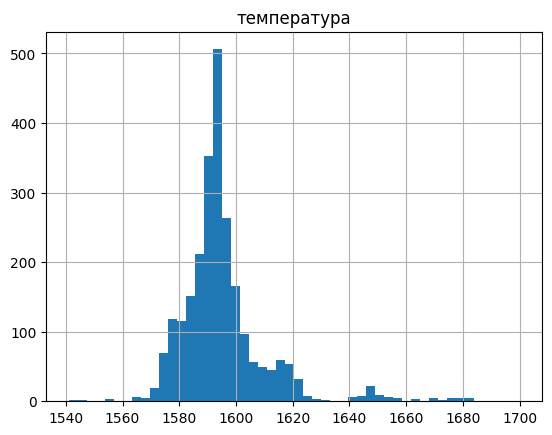
    


*Распределение похоже на нормальное*

<a id='my_section_44'></a>
#### [Агрегирование](#content_44)


```python
edit_data_temp_new = edit_data_temp_new.groupby('key').agg(['last', 'first'])
edit_data_temp_new.columns = ['температура', 'т_начальная']
edit_data_temp_new.head()
```


<div>
<style scoped>
    .dataframe tbody tr th:only-of-type {
        vertical-align: middle;
    }

    .dataframe tbody tr th {
        vertical-align: top;
    }

    .dataframe thead th {
        text-align: right;
    }
</style>
<table border="1" class="dataframe">
  <thead>
    <tr style="text-align: right;">
      <th></th>
      <th>температура</th>
      <th>т_начальная</th>
    </tr>
    <tr>
      <th>key</th>
      <th></th>
      <th></th>
    </tr>
  </thead>
  <tbody>
    <tr>
      <th>1</th>
      <td>1613.0</td>
      <td>1571.0</td>
    </tr>
    <tr>
      <th>2</th>
      <td>1602.0</td>
      <td>1581.0</td>
    </tr>
    <tr>
      <th>3</th>
      <td>1599.0</td>
      <td>1596.0</td>
    </tr>
    <tr>
      <th>4</th>
      <td>1625.0</td>
      <td>1601.0</td>
    </tr>
    <tr>
      <th>5</th>
      <td>1602.0</td>
      <td>1576.0</td>
    </tr>
  </tbody>
</table>
</div>


Получим информацию о количестве итераций


```python
iter_temp = data_temp_new.loc[:, ['Температура']].copy()
iter_temp.columns = ['итер_темп']
iter_temp = iter_temp.groupby('key').count()
```


```python
edit_data_temp_new.head()
```


<div>
<style scoped>
    .dataframe tbody tr th:only-of-type {
        vertical-align: middle;
    }

    .dataframe tbody tr th {
        vertical-align: top;
    }

    .dataframe thead th {
        text-align: right;
    }
</style>
<table border="1" class="dataframe">
  <thead>
    <tr style="text-align: right;">
      <th></th>
      <th>температура</th>
      <th>т_начальная</th>
    </tr>
    <tr>
      <th>key</th>
      <th></th>
      <th></th>
    </tr>
  </thead>
  <tbody>
    <tr>
      <th>1</th>
      <td>1613.0</td>
      <td>1571.0</td>
    </tr>
    <tr>
      <th>2</th>
      <td>1602.0</td>
      <td>1581.0</td>
    </tr>
    <tr>
      <th>3</th>
      <td>1599.0</td>
      <td>1596.0</td>
    </tr>
    <tr>
      <th>4</th>
      <td>1625.0</td>
      <td>1601.0</td>
    </tr>
    <tr>
      <th>5</th>
      <td>1602.0</td>
      <td>1576.0</td>
    </tr>
  </tbody>
</table>
</div>


<a id='my_section_45'></a>
### [data_wire_new](#content_45)

Обработаем эту таблицу так же, как и data_bulk_new. Объединим часть столбцов.


```python
data_wire_new.info()
```

    <class 'pandas.core.frame.DataFrame'>
    Int64Index: 3081 entries, 1 to 3241
    Data columns (total 9 columns):
     #   Column  Non-Null Count  Dtype  
    ---  ------  --------------  -----  
     0   Wire 1  3055 non-null   float64
     1   Wire 2  1079 non-null   float64
     2   Wire 3  63 non-null     float64
     3   Wire 4  14 non-null     float64
     4   Wire 5  1 non-null      float64
     5   Wire 6  73 non-null     float64
     6   Wire 7  11 non-null     float64
     7   Wire 8  19 non-null     float64
     8   Wire 9  29 non-null     float64
    dtypes: float64(9)
    memory usage: 240.7 KB
    


```python
data_wire_new = data_wire_new.fillna(0)
```


```python
edit_data_wire_new = data_wire_new.loc[:, ['Wire 1']]
```


```python
edit_data_wire_new['wire_other'] = 0
add_list = ['Wire 2', 'Wire 3', 'Wire 4', 'Wire 5', 'Wire 6', 'Wire 7',  'Wire 8', 'Wire 9']

for el in add_list:
    edit_data_wire_new['wire_other'] += data_wire_new[el]
```

Оценим сколько значений будет в объединенном столбце


```python
edit_data_wire_new.loc[edit_data_wire_new['wire_other'] != 0, ['wire_other']].count()
```


    wire_other    1164
    dtype: int64


```python
edit_data_wire_new.columns = ['проволчное_1', 'проволочное_остальное']
edit_data_wire_new.head()
```


<div>
<style scoped>
    .dataframe tbody tr th:only-of-type {
        vertical-align: middle;
    }

    .dataframe tbody tr th {
        vertical-align: top;
    }

    .dataframe thead th {
        text-align: right;
    }
</style>
<table border="1" class="dataframe">
  <thead>
    <tr style="text-align: right;">
      <th></th>
      <th>проволчное_1</th>
      <th>проволочное_остальное</th>
    </tr>
    <tr>
      <th>key</th>
      <th></th>
      <th></th>
    </tr>
  </thead>
  <tbody>
    <tr>
      <th>1</th>
      <td>60.059998</td>
      <td>0.00000</td>
    </tr>
    <tr>
      <th>2</th>
      <td>96.052315</td>
      <td>0.00000</td>
    </tr>
    <tr>
      <th>3</th>
      <td>91.160157</td>
      <td>0.00000</td>
    </tr>
    <tr>
      <th>4</th>
      <td>89.063515</td>
      <td>0.00000</td>
    </tr>
    <tr>
      <th>5</th>
      <td>89.238236</td>
      <td>9.11456</td>
    </tr>
  </tbody>
</table>
</div>


<a id='my_section_46'></a>
### [Объединение](#content_46)

Главной таблицей к которой будем присоеденять станет та, где находится целевой признак.
Объединим таблицы:
- edit_data_temp_new;
- agg_data_arc_new;
- agg_data_bulk_new;
- edit_data_gas_new;
- edit_data_wire_new;
- iter_arc;
- iter_temp.


```python
table_join = [agg_data_arc_new, agg_data_bulk_new, edit_data_gas_new, edit_data_wire_new, iter_arc, iter_temp]
data = edit_data_temp_new.join(table_join)
data.head()
```


<div>
<style scoped>
    .dataframe tbody tr th:only-of-type {
        vertical-align: middle;
    }

    .dataframe tbody tr th {
        vertical-align: top;
    }

    .dataframe thead th {
        text-align: right;
    }
</style>
<table border="1" class="dataframe">
  <thead>
    <tr style="text-align: right;">
      <th></th>
      <th>температура</th>
      <th>т_начальная</th>
      <th>акт_мощ(median)</th>
      <th>акт_мощ(sum)</th>
      <th>дуга_сек(median)</th>
      <th>дуга_сек(sum)</th>
      <th>гранулы_12</th>
      <th>гранулы_14</th>
      <th>гранулы_15</th>
      <th>другие_гранулы</th>
      <th>газ</th>
      <th>проволчное_1</th>
      <th>проволочное_остальное</th>
      <th>итер_дуг</th>
      <th>итер_темп</th>
    </tr>
    <tr>
      <th>key</th>
      <th></th>
      <th></th>
      <th></th>
      <th></th>
      <th></th>
      <th></th>
      <th></th>
      <th></th>
      <th></th>
      <th></th>
      <th></th>
      <th></th>
      <th></th>
      <th></th>
      <th></th>
    </tr>
  </thead>
  <tbody>
    <tr>
      <th>1</th>
      <td>1613.0</td>
      <td>1571.0</td>
      <td>0.580313</td>
      <td>3.036730</td>
      <td>185.0</td>
      <td>1098.0</td>
      <td>206.0</td>
      <td>150.0</td>
      <td>154.0</td>
      <td>43.0</td>
      <td>29.749986</td>
      <td>60.059998</td>
      <td>0.00000</td>
      <td>5.0</td>
      <td>6.0</td>
    </tr>
    <tr>
      <th>2</th>
      <td>1602.0</td>
      <td>1581.0</td>
      <td>0.545710</td>
      <td>2.139408</td>
      <td>173.5</td>
      <td>811.0</td>
      <td>206.0</td>
      <td>149.0</td>
      <td>154.0</td>
      <td>73.0</td>
      <td>12.555561</td>
      <td>96.052315</td>
      <td>0.00000</td>
      <td>4.0</td>
      <td>5.0</td>
    </tr>
    <tr>
      <th>3</th>
      <td>1599.0</td>
      <td>1596.0</td>
      <td>0.774632</td>
      <td>4.063641</td>
      <td>109.0</td>
      <td>655.0</td>
      <td>205.0</td>
      <td>152.0</td>
      <td>153.0</td>
      <td>34.0</td>
      <td>28.554793</td>
      <td>91.160157</td>
      <td>0.00000</td>
      <td>5.0</td>
      <td>6.0</td>
    </tr>
    <tr>
      <th>4</th>
      <td>1625.0</td>
      <td>1601.0</td>
      <td>0.753970</td>
      <td>2.706489</td>
      <td>182.0</td>
      <td>741.0</td>
      <td>207.0</td>
      <td>153.0</td>
      <td>154.0</td>
      <td>81.0</td>
      <td>18.841219</td>
      <td>89.063515</td>
      <td>0.00000</td>
      <td>4.0</td>
      <td>5.0</td>
    </tr>
    <tr>
      <th>5</th>
      <td>1602.0</td>
      <td>1576.0</td>
      <td>0.517715</td>
      <td>2.252950</td>
      <td>191.5</td>
      <td>869.0</td>
      <td>203.0</td>
      <td>151.0</td>
      <td>152.0</td>
      <td>78.0</td>
      <td>5.413692</td>
      <td>89.238236</td>
      <td>9.11456</td>
      <td>4.0</td>
      <td>5.0</td>
    </tr>
  </tbody>
</table>
</div>


```python
shape_info = data.shape[0]
shape_info
```


    2477


Изучим пропуски в таблице


```python
pass_list = {}
for el in data.columns:
    pass_list[el] = data[el].isna().sum()
print(pass_list)    
```

    {'температура': 0, 'т_начальная': 0, 'акт_мощ(median)': 2, 'акт_мощ(sum)': 2, 'дуга_сек(median)': 2, 'дуга_сек(sum)': 2, 'гранулы_12': 69, 'гранулы_14': 69, 'гранулы_15': 69, 'другие_гранулы': 69, 'газ': 2, 'проволчное_1': 104, 'проволочное_остальное': 104, 'итер_дуг': 2, 'итер_темп': 0}
    

Очистим набор данных от пропусков


```python
data = data.dropna()
```

Изучим какой объем значений был отброшен


```python
print(f'Мы удалили {1 - (data.shape[0]/shape_info) :.2f}% данных')
```

    Мы удалили 0.06% данных
    


```python
data.head()
```


<div>
<style scoped>
    .dataframe tbody tr th:only-of-type {
        vertical-align: middle;
    }

    .dataframe tbody tr th {
        vertical-align: top;
    }

    .dataframe thead th {
        text-align: right;
    }
</style>
<table border="1" class="dataframe">
  <thead>
    <tr style="text-align: right;">
      <th></th>
      <th>температура</th>
      <th>т_начальная</th>
      <th>акт_мощ(median)</th>
      <th>акт_мощ(sum)</th>
      <th>дуга_сек(median)</th>
      <th>дуга_сек(sum)</th>
      <th>гранулы_12</th>
      <th>гранулы_14</th>
      <th>гранулы_15</th>
      <th>другие_гранулы</th>
      <th>газ</th>
      <th>проволчное_1</th>
      <th>проволочное_остальное</th>
      <th>итер_дуг</th>
      <th>итер_темп</th>
    </tr>
    <tr>
      <th>key</th>
      <th></th>
      <th></th>
      <th></th>
      <th></th>
      <th></th>
      <th></th>
      <th></th>
      <th></th>
      <th></th>
      <th></th>
      <th></th>
      <th></th>
      <th></th>
      <th></th>
      <th></th>
    </tr>
  </thead>
  <tbody>
    <tr>
      <th>1</th>
      <td>1613.0</td>
      <td>1571.0</td>
      <td>0.580313</td>
      <td>3.036730</td>
      <td>185.0</td>
      <td>1098.0</td>
      <td>206.0</td>
      <td>150.0</td>
      <td>154.0</td>
      <td>43.0</td>
      <td>29.749986</td>
      <td>60.059998</td>
      <td>0.00000</td>
      <td>5.0</td>
      <td>6.0</td>
    </tr>
    <tr>
      <th>2</th>
      <td>1602.0</td>
      <td>1581.0</td>
      <td>0.545710</td>
      <td>2.139408</td>
      <td>173.5</td>
      <td>811.0</td>
      <td>206.0</td>
      <td>149.0</td>
      <td>154.0</td>
      <td>73.0</td>
      <td>12.555561</td>
      <td>96.052315</td>
      <td>0.00000</td>
      <td>4.0</td>
      <td>5.0</td>
    </tr>
    <tr>
      <th>3</th>
      <td>1599.0</td>
      <td>1596.0</td>
      <td>0.774632</td>
      <td>4.063641</td>
      <td>109.0</td>
      <td>655.0</td>
      <td>205.0</td>
      <td>152.0</td>
      <td>153.0</td>
      <td>34.0</td>
      <td>28.554793</td>
      <td>91.160157</td>
      <td>0.00000</td>
      <td>5.0</td>
      <td>6.0</td>
    </tr>
    <tr>
      <th>4</th>
      <td>1625.0</td>
      <td>1601.0</td>
      <td>0.753970</td>
      <td>2.706489</td>
      <td>182.0</td>
      <td>741.0</td>
      <td>207.0</td>
      <td>153.0</td>
      <td>154.0</td>
      <td>81.0</td>
      <td>18.841219</td>
      <td>89.063515</td>
      <td>0.00000</td>
      <td>4.0</td>
      <td>5.0</td>
    </tr>
    <tr>
      <th>5</th>
      <td>1602.0</td>
      <td>1576.0</td>
      <td>0.517715</td>
      <td>2.252950</td>
      <td>191.5</td>
      <td>869.0</td>
      <td>203.0</td>
      <td>151.0</td>
      <td>152.0</td>
      <td>78.0</td>
      <td>5.413692</td>
      <td>89.238236</td>
      <td>9.11456</td>
      <td>4.0</td>
      <td>5.0</td>
    </tr>
  </tbody>
</table>
</div>


<a id='my_section_47'></a>
#### [Корреляция](#content_47)

Изучим корреляцию полученной таблицы


```python
plt.figure(figsize=(21, 12))
fig = sns.heatmap(data.corr(), cmap='coolwarm', annot=True)
plt.title('Корреляция признаков', fontsize=16)
plt.setp(fig.get_xticklabels(), rotation=22)
plt.show()
```


    
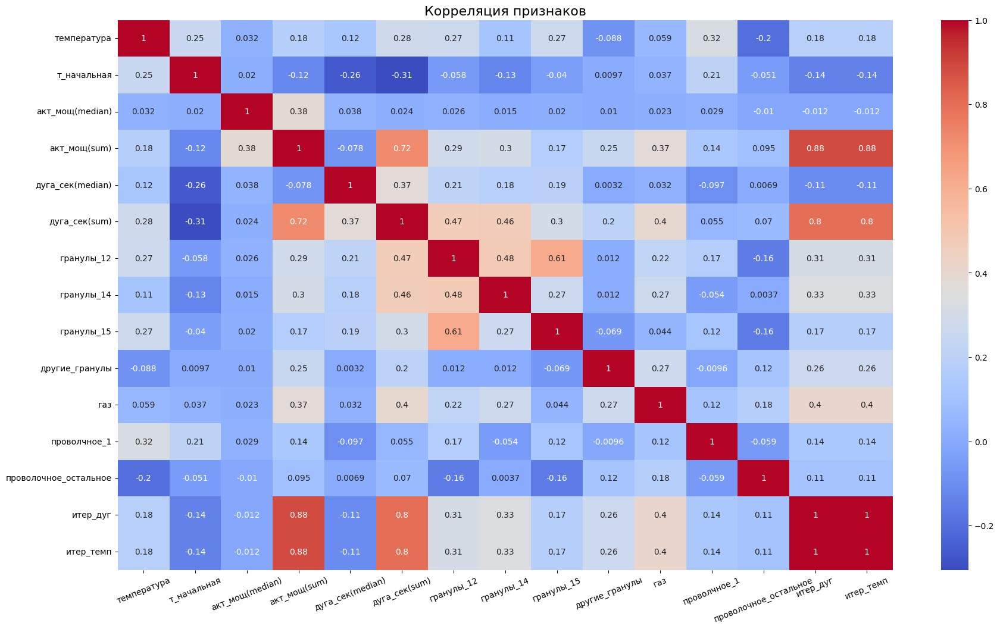
    


'итер_дуг' и 'итер_темп' сильно коррелируют, что и понятно из анализа выше

<a id='my_section_48'></a>
## [Подготовка признаков](#content_48)

<a id='my_section_49'></a>
### [Вспомогательный блок](#content_49)

Определим функцию для разделение выборки на обучающие признаки и целевой


```python
def split_into_signs(sign):
    features_train = sign.drop('температура', axis=1)
    target_train = sign['температура']
    return features_train, target_train
```

Определим функцию для контроля значений


```python
def check_val_signs():
    dict_signs = {'features_train':train, 'features_test':test}
    print('Количество объектов в выборках')
    for key, val in dict_signs.items():
        print(f'{key}: {val.shape[0]} {val.shape[0]/data.shape[0] :.2f}')
```

<a id='my_section_50'></a>
### [Разделение на выбороки](#content_50)

Разделим набор данных на выборки, ориентируясь на критерий.


```python
train, test = train_test_split(data, random_state=280823, test_size=.25)
```

<a id='my_section_51'></a>
### [Изучение и обработка выборок](#content_51)

Для нас важно, чтобы тестовый набор данных остался как есть, когда обучающий можно обработать от искажений.

<a id='my_section_52'></a>
#### [train](#content_52)


```python
train.head()
```


<div>
<style scoped>
    .dataframe tbody tr th:only-of-type {
        vertical-align: middle;
    }

    .dataframe tbody tr th {
        vertical-align: top;
    }

    .dataframe thead th {
        text-align: right;
    }
</style>
<table border="1" class="dataframe">
  <thead>
    <tr style="text-align: right;">
      <th></th>
      <th>температура</th>
      <th>т_начальная</th>
      <th>акт_мощ(median)</th>
      <th>акт_мощ(sum)</th>
      <th>дуга_сек(median)</th>
      <th>дуга_сек(sum)</th>
      <th>гранулы_12</th>
      <th>гранулы_14</th>
      <th>гранулы_15</th>
      <th>другие_гранулы</th>
      <th>газ</th>
      <th>проволчное_1</th>
      <th>проволочное_остальное</th>
      <th>итер_дуг</th>
      <th>итер_темп</th>
    </tr>
    <tr>
      <th>key</th>
      <th></th>
      <th></th>
      <th></th>
      <th></th>
      <th></th>
      <th></th>
      <th></th>
      <th></th>
      <th></th>
      <th></th>
      <th></th>
      <th></th>
      <th></th>
      <th></th>
      <th></th>
    </tr>
  </thead>
  <tbody>
    <tr>
      <th>77</th>
      <td>1604.0</td>
      <td>1605.0</td>
      <td>0.674262</td>
      <td>4.079181</td>
      <td>138.5</td>
      <td>1216.0</td>
      <td>408.0</td>
      <td>215.0</td>
      <td>203.0</td>
      <td>271.0</td>
      <td>11.024942</td>
      <td>110.292000</td>
      <td>45.135998</td>
      <td>6.0</td>
      <td>7.0</td>
    </tr>
    <tr>
      <th>2378</th>
      <td>1589.0</td>
      <td>1580.0</td>
      <td>0.565128</td>
      <td>4.516180</td>
      <td>107.5</td>
      <td>1056.0</td>
      <td>125.0</td>
      <td>179.0</td>
      <td>104.0</td>
      <td>66.0</td>
      <td>11.743407</td>
      <td>50.974560</td>
      <td>75.400001</td>
      <td>8.0</td>
      <td>9.0</td>
    </tr>
    <tr>
      <th>530</th>
      <td>1581.0</td>
      <td>1596.0</td>
      <td>0.412150</td>
      <td>0.412150</td>
      <td>241.0</td>
      <td>241.0</td>
      <td>106.0</td>
      <td>255.0</td>
      <td>0.0</td>
      <td>0.0</td>
      <td>4.247358</td>
      <td>0.000000</td>
      <td>22.107281</td>
      <td>1.0</td>
      <td>2.0</td>
    </tr>
    <tr>
      <th>1857</th>
      <td>1585.0</td>
      <td>1585.0</td>
      <td>0.555978</td>
      <td>1.738832</td>
      <td>187.0</td>
      <td>614.0</td>
      <td>0.0</td>
      <td>199.0</td>
      <td>0.0</td>
      <td>41.0</td>
      <td>6.080227</td>
      <td>101.649598</td>
      <td>0.000000</td>
      <td>3.0</td>
      <td>4.0</td>
    </tr>
    <tr>
      <th>135</th>
      <td>1581.0</td>
      <td>1579.0</td>
      <td>0.539665</td>
      <td>3.606951</td>
      <td>160.5</td>
      <td>1023.0</td>
      <td>512.0</td>
      <td>254.0</td>
      <td>201.0</td>
      <td>397.0</td>
      <td>7.017192</td>
      <td>124.225914</td>
      <td>51.205441</td>
      <td>6.0</td>
      <td>7.0</td>
    </tr>
  </tbody>
</table>
</div>


```python
train_shape = train.shape[0]
```

Обрабтаем некоторые столбцы с выбросами:
- температура;
- газ;
- акт_мощ(median).

Дополнительно изучим столбец дуга_сек(median). Для удаления выбросов используем полученные ранее границы усов.

<a id='my_section_53'></a>
##### [температура](#content_53)


```python
print('Температурные усы', moustache_dtn)
```

    Температурные усы {'температура': [1552.0, 1627.0]}
    


```python
left_moust = moustache_dtn['температура'][0]
right_moust = moustache_dtn['температура'][1]
train = train.query('@left_moust <= температура <= @right_moust')
```


```python
train.shape[0]
```


    1736


<a id='my_section_54'></a>
##### [газ](#content_54)


```python
print('Газовые усы', moustache_dgn)
```

    Газовые усы {'газ': [0.0083985291, 23.8112788026]}
    


```python
left_moust = moustache_dgn['газ'][0]
right_moust = moustache_dgn['газ'][1]
train = train.query('@left_moust <= газ <= @right_moust')
```


```python
train.shape[0]
```


    1655


<a id='my_section_55'></a>
##### [акт_мощ(median)](#content_55)


```python
print('Мощные усы', moustache_dan)
```

    Мощные усы {'Активная мощность': [0.22312, 1.373621], 'Реактивная мощность': [0.153777, 1.014739]}
    


```python
left_moust = moustache_dan['Активная мощность'][0]
right_moust = moustache_dan['Активная мощность'][1]
train = train.query('@left_moust <= `акт_мощ(median)` <= @right_moust')
```


```python
print('Данных удалено(%):',round(1 - train.shape[0]/train_shape,3))
```

    Данных удалено(%): 0.052
    


```python
train.shape[0]
```


    1655


<a id='my_section_56'></a>
##### [дуга_сек(median)](#content_56)

Посмотрим что представляют данные


```python
train.hist('дуга_сек(median)', bins=55)
```


    array([[<AxesSubplot:title={'center':'дуга_сек(median)'}>]], dtype=object)


    
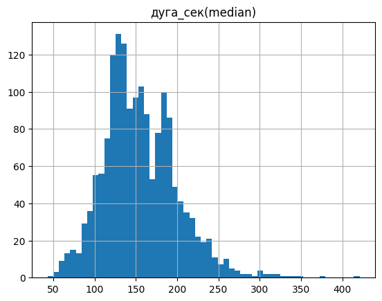
    


```python
b = train.boxplot('дуга_сек(median)', return_type='dict')

plt.ylabel('секунды')
plt.title('Ящик с усами')

moustache_asm = {}
moustache_asm['секунды'] = [item.get_ydata()[1] for item in b['whiskers']]
```


    
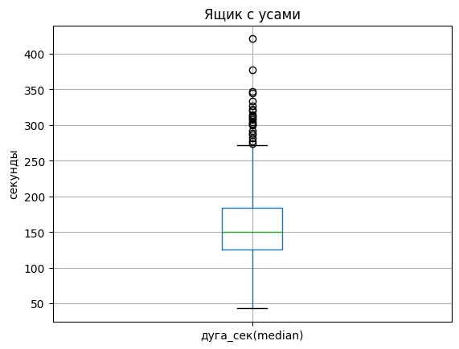
    


```python
print('Усы времени', moustache_asm)
```

    Усы времени {'секунды': [43.0, 272.0]}
    


```python
left_moust = moustache_asm['секунды'][0]
right_moust = moustache_asm['секунды'][1]
train = train.query('@left_moust <= `дуга_сек(median)` <= @right_moust')
```


```python
print('Данных удалено(%):',round(1 - train.shape[0]/train_shape,3))
```

    Данных удалено(%): 0.065
    


```python
train.shape[0]
```


    1633


<a id='my_section_57'></a>
##### [Вывод](#content_57)

*Предобработка завершена*

<a id='my_section_58'></a>
### [Обучающий и целевой](#content_58)

Определим обучающий и целевой признак


```python
features_train, target_train = split_into_signs(train)
features_test, target_test = split_into_signs(test)
```


```python
check_val_signs()
```

    Количество объектов в выборках
    features_train: 1633 0.70
    features_test: 583 0.25
    

<a id='my_section_59'></a>
## [Обучение](#content_59)

Рассмотрим несколько моделей. Объявим переменную


```python
RANDOM_STATE = 280823
```

<a id='my_section_60'></a>
### [LinearRegression](#content_60)


```python
%%time
model_lr = LinearRegression()

mae = make_scorer(mean_absolute_error)
scores_lr = cross_val_score(model_lr,
                            features_train,
                            target_train,
                            scoring=mae,
                            cv=25)


print("MAE with cross_val_score:")
print(pd.Series(scores_lr).mean())
```

    MAE with cross_val_score:
    6.402521256492779
    CPU times: user 348 ms, sys: 340 ms, total: 687 ms
    Wall time: 727 ms
    

<a id='my_section_61'></a>
### [LightGBM](#content_61)


```python
%%time
lgbm_mod = lgb.LGBMRegressor()

params_lgbm = {
    'random_state': [RANDOM_STATE],
    'metric': ['mae'],
    'max_depth': [10],  # проверена 7
    'num_leaves': [10], # проверена 4  
    'learning_rate': [0.05], # проверена 0.1
    
}

lgbm_grid = GridSearchCV(lgbm_mod, params_lgbm, cv=25, verbose=2, scoring='neg_mean_absolute_error')
lgbm_grid.fit(features_train, target_train)
```

    Fitting 25 folds for each of 1 candidates, totalling 25 fits
    [CV] END learning_rate=0.05, max_depth=10, metric=mae, num_leaves=10, random_state=280823; total time= 1.5min
    [CV] END learning_rate=0.05, max_depth=10, metric=mae, num_leaves=10, random_state=280823; total time= 1.6min
    [CV] END learning_rate=0.05, max_depth=10, metric=mae, num_leaves=10, random_state=280823; total time= 1.3min
    [CV] END learning_rate=0.05, max_depth=10, metric=mae, num_leaves=10, random_state=280823; total time= 1.7min
    [CV] END learning_rate=0.05, max_depth=10, metric=mae, num_leaves=10, random_state=280823; total time= 1.7min
    [CV] END learning_rate=0.05, max_depth=10, metric=mae, num_leaves=10, random_state=280823; total time= 1.7min
    [CV] END learning_rate=0.05, max_depth=10, metric=mae, num_leaves=10, random_state=280823; total time= 1.8min
    [CV] END learning_rate=0.05, max_depth=10, metric=mae, num_leaves=10, random_state=280823; total time= 1.7min
    [CV] END learning_rate=0.05, max_depth=10, metric=mae, num_leaves=10, random_state=280823; total time= 1.7min
    [CV] END learning_rate=0.05, max_depth=10, metric=mae, num_leaves=10, random_state=280823; total time= 1.7min
    [CV] END learning_rate=0.05, max_depth=10, metric=mae, num_leaves=10, random_state=280823; total time= 2.0min
    [CV] END learning_rate=0.05, max_depth=10, metric=mae, num_leaves=10, random_state=280823; total time= 1.6min
    [CV] END learning_rate=0.05, max_depth=10, metric=mae, num_leaves=10, random_state=280823; total time= 1.7min
    [CV] END learning_rate=0.05, max_depth=10, metric=mae, num_leaves=10, random_state=280823; total time= 1.7min
    [CV] END learning_rate=0.05, max_depth=10, metric=mae, num_leaves=10, random_state=280823; total time= 1.7min
    [CV] END learning_rate=0.05, max_depth=10, metric=mae, num_leaves=10, random_state=280823; total time= 1.6min
    [CV] END learning_rate=0.05, max_depth=10, metric=mae, num_leaves=10, random_state=280823; total time= 1.6min
    [CV] END learning_rate=0.05, max_depth=10, metric=mae, num_leaves=10, random_state=280823; total time= 1.7min
    [CV] END learning_rate=0.05, max_depth=10, metric=mae, num_leaves=10, random_state=280823; total time= 1.7min
    [CV] END learning_rate=0.05, max_depth=10, metric=mae, num_leaves=10, random_state=280823; total time= 1.8min
    [CV] END learning_rate=0.05, max_depth=10, metric=mae, num_leaves=10, random_state=280823; total time= 1.8min
    [CV] END learning_rate=0.05, max_depth=10, metric=mae, num_leaves=10, random_state=280823; total time= 2.1min
    [CV] END learning_rate=0.05, max_depth=10, metric=mae, num_leaves=10, random_state=280823; total time= 1.6min
    [CV] END learning_rate=0.05, max_depth=10, metric=mae, num_leaves=10, random_state=280823; total time= 1.6min
    [CV] END learning_rate=0.05, max_depth=10, metric=mae, num_leaves=10, random_state=280823; total time= 1.7min
    CPU times: user 40min 18s, sys: 19.9 s, total: 40min 38s
    Wall time: 43min 52s
    


    GridSearchCV(cv=25, estimator=LGBMRegressor(),
                 param_grid={'learning_rate': [0.05], 'max_depth': [10],
                             'metric': ['mae'], 'num_leaves': [10],
                             'random_state': [280823]},
                 scoring='neg_mean_absolute_error', verbose=2)


```python
%%time
train_predictions_lgbm = lgbm_grid.predict(features_train)
result_lgbm = mean_absolute_error(target_train, train_predictions_lgbm)
print('LightGBM')
print(f'MAE with GSCV: {result_lgbm:.2f}')
```

    LightGBM
    MAE with GSCV: 5.01
    CPU times: user 53.7 ms, sys: 4 ms, total: 57.7 ms
    Wall time: 76.7 ms
    


```python
print('LightGBM')
print(f'Кросс-валидированная метрика лучших модели: \n{-lgbm_grid.best_score_ :.2f}')
```

    LightGBM
    Кросс-валидированная метрика лучших модели: 
    6.10
    


```python
print('Лучшие параметры')
lgbm_grid.best_params_
```

    Лучшие параметры
    


    {'learning_rate': 0.05,
     'max_depth': 10,
     'metric': 'mae',
     'num_leaves': 10,
     'random_state': 280823}


<a id='my_section_62'></a>
### [CatBoostRegressor](#content_62)


```python
%%time
model_cbr = CatBoostRegressor(verbose=False)

params_cbr = {
    'random_state': [RANDOM_STATE],
    'loss_function':['MAE'],
    'depth': [5], # проверены 7, 9
    'learning_rate': [0.05],  # проверена 0.1
    'n_estimators': [550], # проверена 500
    
}

cat_grid = GridSearchCV(model_cbr, params_cbr, cv=25, verbose=2, scoring='neg_mean_absolute_error')
cat_grid.fit(features_train, target_train)
```

    Fitting 25 folds for each of 1 candidates, totalling 25 fits
    [CV] END depth=5, learning_rate=0.05, loss_function=MAE, n_estimators=550, random_state=280823; total time=   2.6s
    [CV] END depth=5, learning_rate=0.05, loss_function=MAE, n_estimators=550, random_state=280823; total time=   2.5s
    [CV] END depth=5, learning_rate=0.05, loss_function=MAE, n_estimators=550, random_state=280823; total time=   2.5s
    [CV] END depth=5, learning_rate=0.05, loss_function=MAE, n_estimators=550, random_state=280823; total time=   2.2s
    [CV] END depth=5, learning_rate=0.05, loss_function=MAE, n_estimators=550, random_state=280823; total time=   2.5s
    [CV] END depth=5, learning_rate=0.05, loss_function=MAE, n_estimators=550, random_state=280823; total time=   2.1s
    [CV] END depth=5, learning_rate=0.05, loss_function=MAE, n_estimators=550, random_state=280823; total time=   2.2s
    [CV] END depth=5, learning_rate=0.05, loss_function=MAE, n_estimators=550, random_state=280823; total time=   2.1s
    [CV] END depth=5, learning_rate=0.05, loss_function=MAE, n_estimators=550, random_state=280823; total time=   2.1s
    [CV] END depth=5, learning_rate=0.05, loss_function=MAE, n_estimators=550, random_state=280823; total time=   2.7s
    [CV] END depth=5, learning_rate=0.05, loss_function=MAE, n_estimators=550, random_state=280823; total time=   2.1s
    [CV] END depth=5, learning_rate=0.05, loss_function=MAE, n_estimators=550, random_state=280823; total time=   2.6s
    [CV] END depth=5, learning_rate=0.05, loss_function=MAE, n_estimators=550, random_state=280823; total time=   3.5s
    [CV] END depth=5, learning_rate=0.05, loss_function=MAE, n_estimators=550, random_state=280823; total time=   2.7s
    [CV] END depth=5, learning_rate=0.05, loss_function=MAE, n_estimators=550, random_state=280823; total time=   2.0s
    [CV] END depth=5, learning_rate=0.05, loss_function=MAE, n_estimators=550, random_state=280823; total time=   2.1s
    [CV] END depth=5, learning_rate=0.05, loss_function=MAE, n_estimators=550, random_state=280823; total time=   2.2s
    [CV] END depth=5, learning_rate=0.05, loss_function=MAE, n_estimators=550, random_state=280823; total time=   3.0s
    [CV] END depth=5, learning_rate=0.05, loss_function=MAE, n_estimators=550, random_state=280823; total time=   2.0s
    [CV] END depth=5, learning_rate=0.05, loss_function=MAE, n_estimators=550, random_state=280823; total time=   2.0s
    [CV] END depth=5, learning_rate=0.05, loss_function=MAE, n_estimators=550, random_state=280823; total time=   2.6s
    [CV] END depth=5, learning_rate=0.05, loss_function=MAE, n_estimators=550, random_state=280823; total time=   2.6s
    [CV] END depth=5, learning_rate=0.05, loss_function=MAE, n_estimators=550, random_state=280823; total time=   3.1s
    [CV] END depth=5, learning_rate=0.05, loss_function=MAE, n_estimators=550, random_state=280823; total time=   2.4s
    [CV] END depth=5, learning_rate=0.05, loss_function=MAE, n_estimators=550, random_state=280823; total time=   2.2s
    CPU times: user 26.7 s, sys: 1.49 s, total: 28.2 s
    Wall time: 1min 2s
    


    GridSearchCV(cv=25,
                 estimator=<catboost.core.CatBoostRegressor object at 0x7f1d76e386a0>,
                 param_grid={'depth': [5], 'learning_rate': [0.05],
                             'loss_function': ['MAE'], 'n_estimators': [550],
                             'random_state': [280823]},
                 scoring='neg_mean_absolute_error', verbose=2)


```python
%%time
train_predictions_cbr = cat_grid.predict(features_train)
result_cbr = mean_absolute_error(target_train, train_predictions_cbr)
print('CatBoostRegressor')
print(f'MAE with GSCV: {result_cbr:.2f}')
```

    CatBoostRegressor
    MAE with GSCV: 3.93
    CPU times: user 4.26 ms, sys: 0 ns, total: 4.26 ms
    Wall time: 3.5 ms
    


```python
print('CatBoostRegressor')
print(f'Кросс-валидированная метрика лучших модели: \n{-cat_grid.best_score_ :.2f}')
```

    CatBoostRegressor
    Кросс-валидированная метрика лучших модели: 
    6.07
    


```python
cat_grid.best_params_
```


    {'depth': 5,
     'learning_rate': 0.05,
     'loss_function': 'MAE',
     'n_estimators': 550,
     'random_state': 280823}


<a id='my_section_63'></a>
### [Тестирование](#content_63)

Лучшей моделью стала CatBoostRegressor с точностью MAE 3.93 и кросс-валидированной метрикой лучших модели: 
6.07. Используем полученные данные для проверки на тестовой выборке.


```python
model = CatBoostRegressor(depth=5,
                         learning_rate=0.05,
                         loss_function='MAE',
                         n_estimators=550,
                         random_state=280823,
                          verbose=False)

model.fit(features_train, target_train)
predictions = model.predict(features_test)
test_result = mean_absolute_error(target_test, predictions)
```


```python
print('CatBoostRegressor')
print(f'MAE with GSCV: {test_result:.4f}')
```

    CatBoostRegressor
    MAE with GSCV: 6.2515
    

<a id='my_section_64'></a>
### [Анализ важности факторов](#content_64)


```python
factor_cbr = {
    'признаки': features_test.columns,
    'важность': model.feature_importances_,
}
factor_cbr = pd.DataFrame(factor_cbr)
factor_cbr.sort_values(by='важность', ascending=False, inplace=True)
plt.figure(figsize=(18, 9))
sns.barplot(x=factor_cbr['важность'], y=factor_cbr['признаки'])
plt.title('Важность признаков для CatBoostRegressor', fontsize=14)
plt.xlabel('Критерий важности')
plt.ylabel('Признаки')
plt.show()
```


    
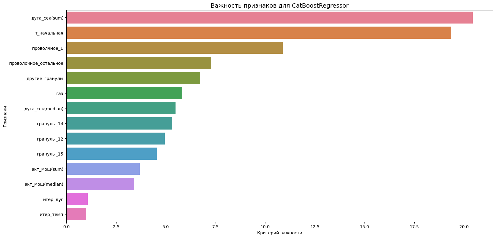
    


Исходя из корреляционной матрицы(полученной в ходе анализа объединенной таблицы) и графика, избавимся от `итер-темп`.


```python
drop_col = ['итер_дуг']
up_features_train = features_train.copy()
up_features_test = features_test.copy()
up_features_train = up_features_train.drop(columns=drop_col)
up_features_test = up_features_test.drop(columns=drop_col)
```


```python
model.fit(up_features_train, target_train)
predictions = model.predict(up_features_test)
up_result = mean_absolute_error(target_test, predictions)
print('CatBoostRegressor')
print(f'MAE: {up_result:.4f}')
```

    CatBoostRegressor
    MAE: 6.2475
    


```python
print(f'Точность улучшилась на {test_result-up_result :.3f}')
```

    Точность улучшилась на 0.004
    

<a id='my_section_65'></a>
## [Вывод](#content_65)

Поставленная заказчиком задача была выполнена. Для решения были предприняты следующие меры:
1. Проведена подготовка и анализ данных. В ходе подготовки были загружены исходные таблицы и библиотеки. Анализ этих таблиц показал для:
    - data_arc_new:
        - данные представлены за 2019 год, с 3 мая по 6 сентября
        - имеется 3241 партия и 14876 значений, что означает примерно 4.59 итерации на сборку;
        - время нагрева дуги составляет несколько минут меньше 10;
        - данные не имеют пропусков;
        - среднее значение для активной и реактивной мощностей составляет 0.66 и 0.43 соответственно;
        - разброс значений, предположительно свидетельствует о выбросах;
        - наблюдается сильная(0.96) корреляция между активной и реактивной мощностью;
        - данные представлены циклами от 1 до 16;
        - партии представлены с промежутками в данных.
    - data_bulk_new:
        - обнаружено большое количество пропусков;
        - столбцы нужно переименовать;
        - значения в таблице представлены в диапазоне от 1 до 3241, но всего 3129 вхождений;
        - вероятно, в таблице имеются выбросы, но самих значений достаточно мало. Действительно ли это выбросы?
        - только 6 из 15 столбцов наполнены значениеями так, что данных больше 500, и только 3 из них, где значений больше 2000.  
        - максимальная корреляция между столбцами ссоставила 0.4.
    - data_bulk_time_new:
        - время в столбцах не соответствует порядковым номерам, т.е. не заметна временная последовательность от столбца к столбцу.
    - data_gas_new: 
        - 3239 вхождения найдено, с интервалом от 1 до 3241, найдены пропущенные партии;
        - имеются выбросы;
        - распределение значений практически нормальное, есть небольшое скос вправо;
        - значение газа представлено одним числом по партиям;
    - data_temp_new:
        - замеры температуры взяты между началом и концом нагрева дугой, т.е. данных больше, значений на 3216 вхождений больше;
        - есть пропуски по партиям
        - не все значения присутствуют, имеются пропуски, около 19%;
        - имеются выбросы, необходимо утонить их природу и ценность; 
        - данные распределены нормально.
    - data_wire_new: 
        - имена столбцов представлены на английском языке;
        - очень много пропущенных значений;
        - представлено обобщенное значение по партиям;
        - о нормальности распределения и выбросах можно судить только по первым двум столбцам. В остальных столбцах значений крайне мало;
    - data_wire_time_new:
        - имена столбцов нужно переименовать;
        - заметно большое количество пропусков, в целом, количество вхождений в data_wire_new и этом столбце совпадают;
        - тип данных object. 
        
Касательно многих столбцов возникли вопросы, адресованные и более конкретно расписанные после первой главы. В результате уточнения был скорректирован курс дальнейшей работы и намечен план.<br/>


2. Во второй части была проведена предобработка и подготовка столбцов к обучению. Для всех таблиц были созданы копии:
    - data_arc_new:<br/>
        - добавлен новый признак — секунды, представляющий разницу между началом и концом нагрева;<br/>
        - подготовлен столбец с количеством итераций для каждой партии; <br/>
        - в полученном столбце с временем агрегированы данные функиями 'median' и 'sum';<br/>
    - data_bulk_new:<br/>
        - опытным путём выбраны наиболее значимые столбцы(Bulk: 12, 14, 15). Остальные столбцы решено объединить;<br/>
        - столбца переименовы;<br/>
        - создана новая таблица с стлобцами (Гранулы: 12, 14, 15, другие).<br/>
    - data_gas_new:<br/>
        - столбец переименован<br/>
    - data_temp_new: <br/>
        - оставлен и переименован только столбец 'температура';<br/>
        - проведено дополнительное исследование, агрегирована таблица по последнему значению, как, по предположительно  наиболее важному, проведен анализ. В результате известно медианное значение температуры, равное 1593. Температура в столбце тоже распределена нормально;
        - данные агрегированы, используя `groupby` и параметры `last` и `first`, last('температура') — так как оно наиболее важное. first('т_начальная') — как то, которое измеряется по умолчанию;
    - data_wire_new:
        - обработана так же, как и data_bulk_new. Было решено объединить часть столбцов;
        - в результате анализа, был оставлен столбец Wire 1('проволчное_1'), остальные собраны в ('проволочное_остальное');
    - итогом обработки значений было объединение таблиц:
        - edit_data_temp_new;
        - agg_data_arc_new;
        - agg_data_bulk_new;
        - edit_data_gas_new;
        - edit_data_wire_new;
        - iter_arc;
        - iter_temp.
    - проведено изучение корреляции, установлено: 
        - столбцы 'итер_дуг'(количество итераций) и 'итер_темп' сильно коррелируют(0.88). Ради эксперимента оставлены оба.
            
Данные подготавливались для объединения, но не были обработаны для исключения выбросов. Так как необходимо разбить рабочую таблицу на обучающий набор данных и тестовый, где обучающий будет очищен, а тестовый оставлен как есть.   


3. В этой части:
    - объединенная таблицы data разделяется на обучающий и тестовый наборы данных;
    - в полученном обучающем наборе train проводятся меры по очистке, данные в столбцах: 'температура', 'газ', 'акт_мощ(median)', 'дуга_сек(median)'; обрезаются по усам графика boxplot, полученным ранее;
    - происходит разделение наборов данных на обучающий и целевой показатели;
    - проводится контроль количества значений.
    
    
4. Заключительная часть, где происходит выбор лучшей модели по метрике MAE. Использована кросс-валидация(cv=25) и GridSearchCV:

    1. LinearRegression — показала точность 6.402521256492779;
    2. LightGBM — точность составила 5.01. Значение атрибута `.best_score_` у GridSearchCV показало среднее MAE: 6.10. Параметры:
        - 'random_state': 280823;
        - 'metric': 'mae';
        - 'max_depth': 10;
        - 'num_leaves': 10;
        - 'learning_rate': 0.05;
        
    3. CatBoostRegressor — точность составила 3.93. Значение атрибута (.best_score_) у GridSearchCV показало среднее MAE: 6.07. Параметры: 
        - 'depth': 5;
        - 'learning_rate': 0.05;
        - 'loss_function': 'MAE';
        - 'n_estimators': 550;
        - 'random_state': 280823;
        
    4. Тестирование:
        - была выбрана лучшая модель — CatBoostRegressor;
        - проведена оценка модели на тестовой выборке, которая показала точность MAE: 6.2515.
        
    5. Анализ важности факторов:
        - изучено влияние набора признаков на модель, полученная диграмма, выявила два менее важных: 'итер_темп' и 'итер_дуг';         - при сравнении этих признаков был исключён 'итер-темп';
        - проведена перестройка модели, она стала точнее на 0.004.
        
        
По результату проведённой работы можно сделать вывод о том, что поставленная перед нами цель заказчика выполнена. Итоговая точность на исходном наборе данных лучше поставленной на 0.6(6.8 против 6.2475).           
     

<a id='my_section_66'></a>
## [Отчёт](#content_66)

1. Все ли пункты плана были выполнены?
    - Выполнены все пункты;
2. Трудности и их преодаление?
    - К трудностям можно отнести:
        1. наличие пропусков;
        2. на первый взгляд не полные данные;
        3. наличие выбросов;
        4. отсутствие необходимого типа данных в таблице;
        5. некорректное наименование столбцов;
        6. отсустствие понимая того, как работать с таблицей; 
        7. сложность в получении необхлдимого значения метрики;
    - Преодоление трудностей:
        1. уточнено у заказчика, обработано в соответствии с комментарием или по смыслу, заполнены 0 или удалены. В некоторых случаях использовалось объединение табиц для компенсации пропусков; 
        2. уточнено у заказчика, объединение данных;
        3. уточнение у заказчика, обработка с использованием boxplot. Удаление выбросов по смыслу и с учетом мнения заказчика; 
        4. изменение типа данных; 
        5. переименование типа данных;
        6. уточнение у заказчика;
        7. проведение экспериментов с признаками на обучающей выборке, добавление новых признаков из существующих, удаление имеющихся, если имеется сильная корреляция или по смыслу. Перебор разных моделей машинного обучения и их параметров.
3. Ключевые шаги в решении задачи?
    1. Подготовка и анализ;
    2. Предобработка;
    3. Подготовка признаков;
    4. Обучение;
    5. Выводы
4. Итоговая модель и её качество?
    - итоговая модель CatBoostRegressor с качеством на тестовой выборке: 6.2475.
    
5. Список признаков, используемых для обучения лучшей модели и описание их предобработки:
('температура', 'т_начальная', 'акт_мощ(median)', 'акт_мощ(sum)', 'дуга_сек(median)', 'дуга_сек(sum)', 'гранулы_12', 'гранулы_14', 'гранулы_15', 'другие_гранулы', 'газ', 'проволчное_1', 'проволочное_остальное', 'итер_дуг', 'итер_темп'):

    1. 'температура' и 'т_начальная' получены из таблицы data_temp_new, путём первоначального выделения столбца `Темпертура` и агрегирования значений по партиям командой (edit_data_temp_new.groupby('key').agg(['last', 'first'])) для нахождения последнего, как ниболее важного значения и первого, как по умолчанию измеряемого. После объединения на обучающей выборке были ограничены по усам, графика boxplot. 
    2. 'акт_мощ(median)' и 'акт_мощ(sum)' получены из столбца data_arc_new, они представляют значения активной мощности, полученные путём агрегирования по партиям. Столбцы дают медианное и суммарное значения. Предварительная предобработка проходила с отсичением граничных параметров по усам boxplot. 
    3. 'дуга_сек(median)' и 'дуга_сек(sum)' так же получены из data_arc_new, но представляют время в секундах, между началом и концом нагрева дуг. Была скопирована исходная таблица, выделены временные параметры, тип данных был преобразован к datetime64[ns]. После чего найдена разница между началом и концом нагрева. Эту разницу поместили в отдельный столбец, агрерировали значения по партиям медианой и суммой. После проведен дополнительный анализ с использование boxplot. И данные были обрезаны по усам.
    4. 'гранулы_12', 'гранулы_14', 'гранулы_15', 'другие_гранулы' получены из таблицы data_bulk_new. Предварительно проведён анализ таблицы, где выявлено, что имеется много пропусков. В результатае общения с заказчиком и анализа было принято решение оставить только самые большие значения исходной таблицы, имеющие имена: Bulk 12, Bulk 14, Bulk 15. Значения остальных столбцов было решено объединить. В результате Bulk 12, Bulk 14, Bulk 15 были переименованы в 'гранулы_12', 'гранулы_14', 'гранулы_15'. А все остальные значения получили имя 'другие_гранулы'. Обработки на выбросы в этих столбцах не проводилось.
    5. 'газ' получено из таблицы data_gas_new. Предварительно во время анализа были получены с помощью boxplot граничные значения, после переименовая и добавления в обучающую выборку обрезан по усам.  
    6. 'проволчное_1' и 'проволочное_остальное' получены из таблицы data_wire_new. Предварительно проведён анализ таблицы, где выявлено, что имеется много пропусков. В результатае общения с заказчиком и анализа было принято решение оставить только самые большие значения исходной таблицы, имеющие имена: Wire 1. Значения остальных столбцов было решено объединить. В результате Wire 1 был переименован в 'проволчное_1'. А все остальные значения получили имя 'проволочное_остальное'. Обработки на выбросы в этих столбцах не проводилось.
    7. 'итер_дуг' получен из таблицы data_arc_new и представляет собой агрегированное значение по циклам, т.е. он содержит информацию о количестве циклов в партии. Данные были получены, после чего столбец переименован в 'итер_дуг'. Обработки по выбросам не проводилось.
    8. 'итер_темп' получен из таблицы data_temp_new и представляет собой агрегированное значение по циклам, т.е. он содержит информацию о количестве циклов в партии. Данные были получены, после чего столбец переименован в 'итер_темп'. Обработки по выбросам не проводилось.

6. Гиперпараметры лучшей модели, включая random_state: 
    - 'depth': 5;
    - 'learning_rate': 0.05;
    - 'loss_function': 'MAE';
    - 'n_estimators': 550;
    - 'random_state': 280823.

7. Что рекомендуется для улучшения модели, решения:
    - надо уменьшить разброс в измерениях. В данном случае в температуре, как в одном из важнейших признаков; 
    - более детально изучить данные и все важные факторы, возможно работа с ними позволит улучшить результат;
    - необходимо получить больше сведений от заказчика, связанных с плавкой металла(от хим. состава до состава бригады), тогда будет больше признаков на которые можно опереться;
    - можно попробовать определить обучающие признаки по другому, например, не агрегировать признаки, а транспонировать таблицу, таким образом, чтобы итерации стали столбцами; 
    - подключить в работу специалиста — консультанта с производства, что позволит уменьшить время на разработку модели и возможно улучшить точность. Одним из преимуществ будет понимание того, какие знначения можно отбрасывать;
    


```python

```
